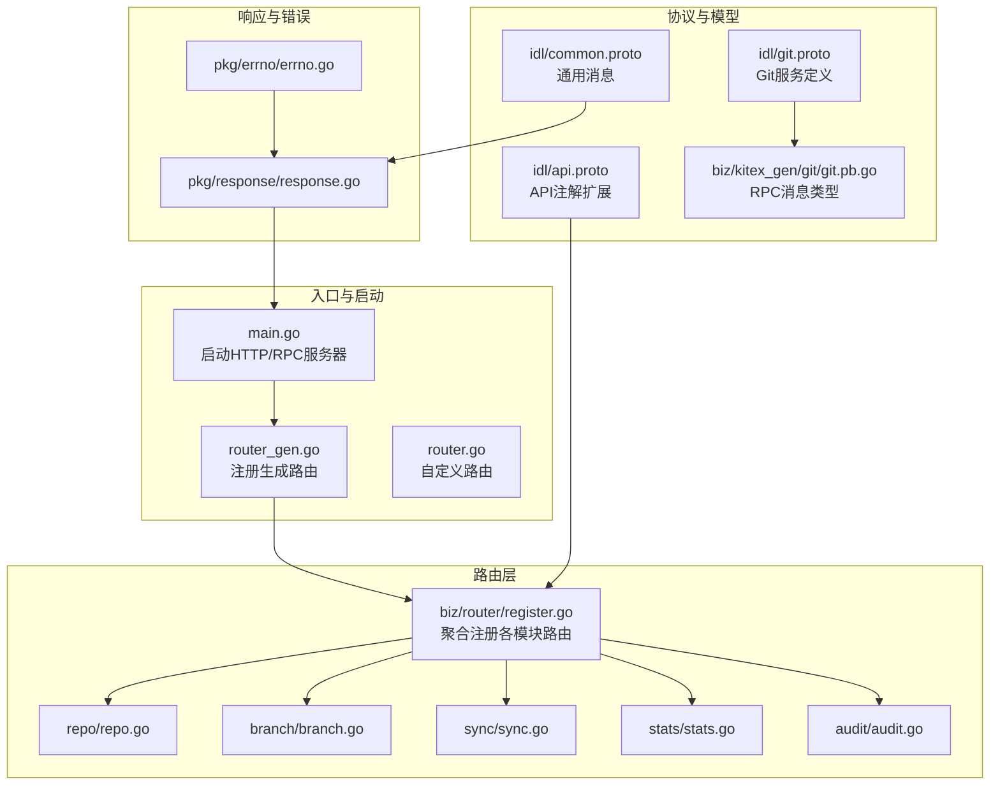
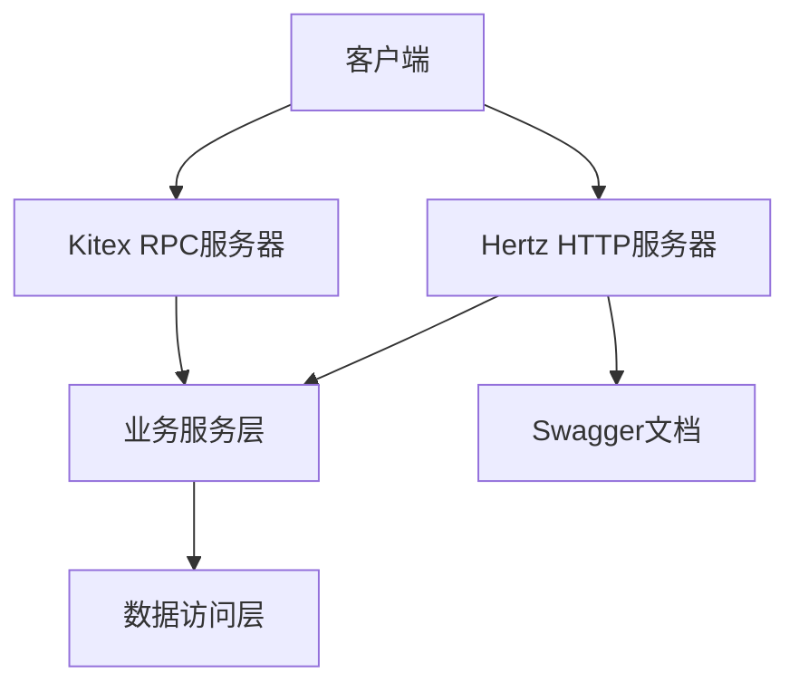
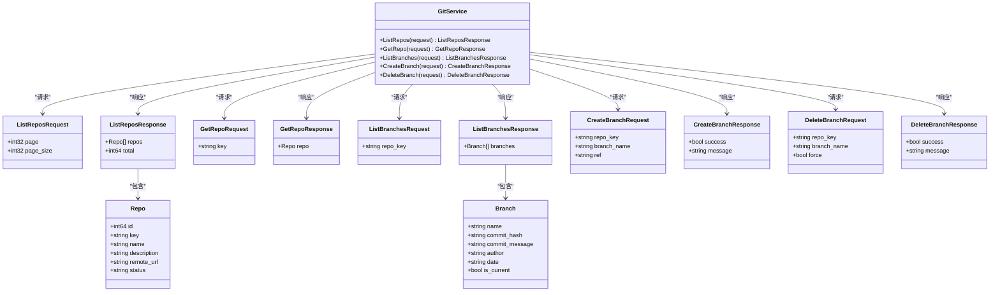
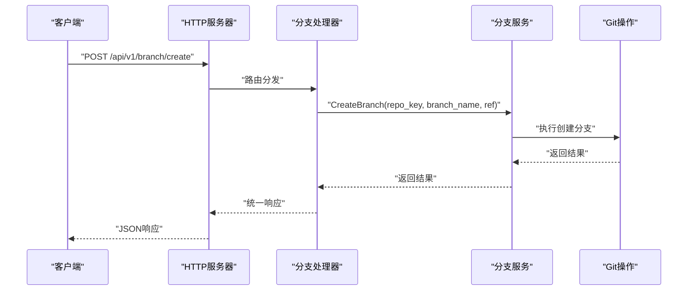
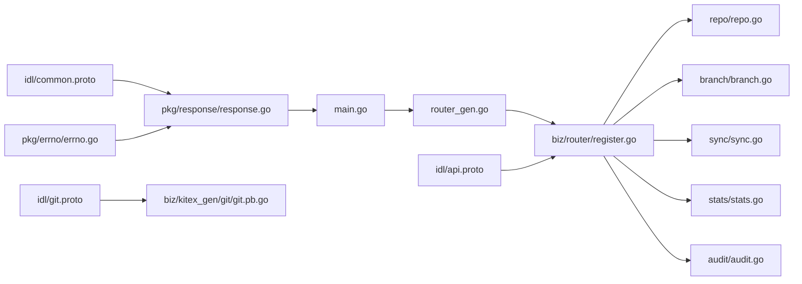

# API文档

<cite>
**本文引用的文件**
- [main.go](file://main.go)
- [router.go](file://router.go)
- [router_gen.go](file://router_gen.go)
- [biz/router/register.go](file://biz/router/register.go)
- [biz/router/repo/repo.go](file://biz/router/repo/repo.go)
- [biz/router/branch/branch.go](file://biz/router/branch/branch.go)
- [biz/router/sync/sync.go](file://biz/router/sync/sync.go)
- [biz/router/stats/stats.go](file://biz/router/stats/stats.go)
- [biz/router/audit/audit.go](file://biz/router/audit/audit.go)
- [idl/api.proto](file://idl/api.proto)
- [idl/common.proto](file://idl/common.proto)
- [idl/git.proto](file://idl/git.proto)
- [pkg/response/response.go](file://pkg/response/response.go)
- [pkg/errno/errno.go](file://pkg/errno/errno.go)
- [biz/kitex_gen/git/git.pb.go](file://biz/kitex_gen/git/git.pb.go)
- [docs/swagger.yaml](file://docs/swagger.yaml)
</cite>

## 目录
1. [简介](#简介)
2. [项目结构](#项目结构)
3. [核心组件](#核心组件)
4. [架构总览](#架构总览)
5. [详细组件分析](#详细组件分析)
6. [依赖关系分析](#依赖关系分析)
7. [性能考虑](#性能考虑)
8. [故障排查指南](#故障排查指南)
9. [结论](#结论)
10. [附录](#附录)

## 简介
本项目提供一个轻量级的多仓库、多分支自动化同步管理服务，支持通过HTTP REST API与Kitex RPC进行交互。系统采用分层设计：HTTP路由层负责REST接口注册与静态资源托管；RPC层提供高性能的Git操作服务；业务层封装仓库、分支、同步、统计与审计等能力；数据访问层负责持久化与缓存；统一响应与错误码体系保证接口一致性。

- 版本与基础信息
  - 应用名称：git-manage-service
  - 应用版本：2.0.0
  - 默认基础路径：/api
  - 支持启动模式：http、rpc、all

- 认证与安全
  - 项目未内置统一鉴权中间件，路由注册中存在多处“_xxxMw()”占位中间件，建议在实际部署时接入鉴权与限流策略。

- 协议与序列化
  - HTTP REST：基于Hertz框架，统一响应结构与错误码。
  - RPC：基于Kitex，Protocol Buffer定义服务接口与消息类型。

**章节来源**
- [main.go](file://main.go#L29-L40)
- [main.go](file://main.go#L47-L50)
- [main.go](file://main.go#L76-L86)
- [main.go](file://main.go#L136-L176)

## 项目结构
项目采用按功能域划分的目录组织方式，核心模块包括：
- biz/router：REST路由注册，按模块分组（repo、branch、sync、stats、audit等）
- biz/handler：各模块HTTP处理器（由生成器根据IDL注解生成）
- biz/service：业务逻辑层（如统计、同步、审计等初始化）
- biz/kitex_gen：Kitex生成的RPC服务与消息类型
- idl：Protocol Buffer定义（API注解扩展、通用消息、Git服务定义）
- pkg/response、pkg/errno：统一响应与错误码
- docs：Swagger文档与前端页面

**图表来源**
- [main.go](file://main.go#L136-L176)
- [router_gen.go](file://router_gen.go#L10-L16)
- [router.go](file://router.go#L10-L15)
- [biz/router/register.go](file://biz/router/register.go#L18-L41)
- [idl/api.proto](file://idl/api.proto#L1-L77)
- [idl/common.proto](file://idl/common.proto#L1-L41)
- [idl/git.proto](file://idl/git.proto#L1-L78)
- [biz/kitex_gen/git/git.pb.go](file://biz/kitex_gen/git/git.pb.go#L1-L200)
- [pkg/response/response.go](file://pkg/response/response.go#L9-L15)
- [pkg/errno/errno.go](file://pkg/errno/errno.go#L7-L23)

**章节来源**
- [main.go](file://main.go#L136-L176)
- [router_gen.go](file://router_gen.go#L10-L16)
- [router.go](file://router.go#L10-L15)
- [biz/router/register.go](file://biz/router/register.go#L18-L41)
- [idl/api.proto](file://idl/api.proto#L1-L77)
- [idl/common.proto](file://idl/common.proto#L1-L41)
- [idl/git.proto](file://idl/git.proto#L1-L78)
- [pkg/response/response.go](file://pkg/response/response.go#L9-L15)
- [pkg/errno/errno.go](file://pkg/errno/errno.go#L7-L23)

## 核心组件
- HTTP服务器与路由
  - 启动HTTP服务器，注册生成路由与自定义路由，提供静态资源与根路径重定向。
  - 路由按模块聚合注册，统一前缀为/api/v1/{module}。
- RPC服务器
  - 启动Kitex RPC服务，绑定GitService接口，供内部或外部客户端调用。
- 统一响应与错误码
  - 所有HTTP响应遵循统一结构，错误码按业务域细分，便于客户端处理。
- Swagger文档
  - 提供OpenAPI文档，便于联调与测试。

**章节来源**
- [main.go](file://main.go#L136-L176)
- [router_gen.go](file://router_gen.go#L10-L16)
- [biz/router/register.go](file://biz/router/register.go#L18-L41)
- [pkg/response/response.go](file://pkg/response/response.go#L9-L15)
- [pkg/errno/errno.go](file://pkg/errno/errno.go#L31-L129)
- [docs/swagger.yaml](file://docs/swagger.yaml)

## 架构总览
系统同时提供HTTP REST与RPC两种接入方式，二者共享业务逻辑与数据层，通过统一的错误码与响应格式保证一致性。

**图表来源**
- [main.go](file://main.go#L136-L176)
- [biz/router/register.go](file://biz/router/register.go#L18-L41)
- [docs/swagger.yaml](file://docs/swagger.yaml)

## 详细组件分析

### HTTP REST API 定义
- 基础路径
  - /api/v1/{module}
- 通用响应结构
  - 字段：code、msg、error、data
  - 成功：code=0；失败：code为具体业务错误码
- 通用错误码范围
  - 通用：0-999
  - 仓库：10000-10999
  - 分支：11000-11999
  - 同步：12000-12999
  - 认证：13000-13999
  - 标签：14000-14999
  - 系统：15000-15999

- 仓库管理（/api/v1/repo）
  - POST /clone：克隆仓库
  - POST /create：创建仓库
  - POST /delete：删除仓库
  - GET /detail：查询仓库详情
  - POST /fetch：拉取远程更新
  - GET /list：分页列出仓库
  - POST /scan：扫描本地仓库
  - GET /task：查询克隆任务状态
  - POST /update：更新仓库信息

- 分支管理（/api/v1/branch）
  - POST /checkout：切换分支
  - GET /compare：比较两个分支差异
  - POST /create：创建分支
  - POST /delete：删除分支
  - GET /diff：获取文件差异
  - GET /list：列出分支
  - POST /merge：合并分支
  - GET /merge/check：检查合并冲突
  - GET /patch：生成补丁
  - POST /pull：拉取远程变更
  - POST /push：推送本地变更
  - POST /update：更新分支信息

- 同步服务（/api/v1/sync）
  - POST /execute：立即执行一次同步
  - GET /history：查询同步历史
  - POST /history/delete：删除同步历史
  - POST /run：运行同步任务
  - GET /task：查询同步任务
  - POST /task/create：创建同步任务
  - POST /task/delete：删除同步任务
  - POST /task/update：更新同步任务
  - GET /tasks：列出同步任务

- 统计分析（/api/v1/stats）
  - GET /analyze：仓库统计分析
  - GET /authors：作者列表
  - GET /branches：分支列表
  - GET /commits：提交记录
  - GET /export/csv：导出CSV
  - GET /lines：代码行统计
  - GET /lines/config：读取行统计配置
  - POST /lines/config：保存行统计配置
  - GET /lines/export/csv：导出行统计CSV

- 审计日志（/api/v1/audit）
  - GET /log：查询单条审计日志
  - GET /logs：分页列出审计日志

- 系统与版本（/api/v1/system、/api/v1/version）
  - 系统与版本相关接口（具体字段以实际实现为准）

- 认证与中间件
  - 路由注册中存在多处“_xxxMw()”占位中间件，建议在生产环境接入鉴权、限流与CORS等中间件。

**章节来源**
- [pkg/response/response.go](file://pkg/response/response.go#L9-L15)
- [pkg/errno/errno.go](file://pkg/errno/errno.go#L31-L129)
- [biz/router/repo/repo.go](file://biz/router/repo/repo.go#L16-L38)
- [biz/router/branch/branch.go](file://biz/router/branch/branch.go#L16-L42)
- [biz/router/sync/sync.go](file://biz/router/sync/sync.go#L16-L40)
- [biz/router/stats/stats.go](file://biz/router/stats/stats.go#L16-L48)
- [biz/router/audit/audit.go](file://biz/router/audit/audit.go#L16-L31)
- [biz/router/register.go](file://biz/router/register.go#L18-L41)

### Protocol Buffer 定义（RPC）
- 服务：GitService
  - ListRepos(ListReposRequest) -> ListReposResponse
  - GetRepo(GetRepoRequest) -> GetRepoResponse
  - ListBranches(ListBranchesRequest) -> ListBranchesResponse
  - CreateBranch(CreateBranchRequest) -> CreateBranchResponse
  - DeleteBranch(DeleteBranchRequest) -> DeleteBranchResponse

- 常用消息类型
  - Repo：id、key、name、description、remote_url、status
  - Branch：name、commit_hash、commit_message、author、date、is_current
  - ListReposRequest：page、page_size
  - ListReposResponse：repos[]、total
  - GetRepoRequest：key
  - GetRepoResponse：repo
  - ListBranchesRequest：repo_key
  - ListBranchesResponse：branches[]
  - CreateBranchRequest：repo_key、branch_name、ref
  - CreateBranchResponse：success、message
  - DeleteBranchRequest：repo_key、branch_name、force
  - DeleteBranchResponse：success、message

- 通用消息与注解
  - BaseResponse：code、msg、error
  - PaginationRequest/PaginationMeta：分页参数与元数据
  - EmptyRequest/EmptyResponse：空请求/响应包装
  - api.proto扩展了对HTTP注解的支持，用于生成器识别路由与参数映射

**图表来源**
- [idl/git.proto](file://idl/git.proto#L5-L78)
- [biz/kitex_gen/git/git.pb.go](file://biz/kitex_gen/git/git.pb.go#L11-L200)

**章节来源**
- [idl/git.proto](file://idl/git.proto#L1-L78)
- [biz/kitex_gen/git/git.pb.go](file://biz/kitex_gen/git/git.pb.go#L1-L200)
- [idl/common.proto](file://idl/common.proto#L8-L41)
- [idl/api.proto](file://idl/api.proto#L10-L55)

### API 调用流程（示例：创建分支）

**图表来源**
- [biz/router/branch/branch.go](file://biz/router/branch/branch.go#L26-L38)
- [pkg/response/response.go](file://pkg/response/response.go#L17-L24)
- [pkg/errno/errno.go](file://pkg/errno/errno.go#L56-L70)

## 依赖关系分析
- 启动流程
  - main.go初始化配置、数据库、加密与业务服务，随后按模式启动HTTP或RPC服务器，并注册路由。
- 路由注册
  - router_gen.go与router.go分别负责生成路由与自定义路由；biz/router/register.go聚合各模块路由。
- 协议与模型
  - idl/api.proto提供API注解扩展；idl/common.proto定义通用消息；idl/git.proto定义RPC服务与消息；kitex_gen生成RPC类型。
- 响应与错误
  - pkg/response/response.go统一响应结构；pkg/errno/errno.go提供错误码与转换。

**图表来源**
- [main.go](file://main.go#L136-L176)
- [router_gen.go](file://router_gen.go#L10-L16)
- [biz/router/register.go](file://biz/router/register.go#L18-L41)
- [idl/api.proto](file://idl/api.proto#L1-L77)
- [idl/common.proto](file://idl/common.proto#L1-L41)
- [idl/git.proto](file://idl/git.proto#L1-L78)
- [biz/kitex_gen/git/git.pb.go](file://biz/kitex_gen/git/git.pb.go#L1-L200)
- [pkg/response/response.go](file://pkg/response/response.go#L9-L15)
- [pkg/errno/errno.go](file://pkg/errno/errno.go#L7-L23)

**章节来源**
- [main.go](file://main.go#L136-L176)
- [router_gen.go](file://router_gen.go#L10-L16)
- [biz/router/register.go](file://biz/router/register.go#L18-L41)
- [idl/api.proto](file://idl/api.proto#L1-L77)
- [idl/common.proto](file://idl/common.proto#L1-L41)
- [idl/git.proto](file://idl/git.proto#L1-L78)
- [biz/kitex_gen/git/git.pb.go](file://biz/kitex_gen/git/git.pb.go#L1-L200)
- [pkg/response/response.go](file://pkg/response/response.go#L9-L15)
- [pkg/errno/errno.go](file://pkg/errno/errno.go#L7-L23)

## 性能考虑
- 并发与连接
  - HTTP服务器默认并发处理请求，建议结合负载均衡与限流中间件控制峰值流量。
- 数据库与缓存
  - 对高频查询（如仓库列表、分支列表）可引入缓存层，降低数据库压力。
- RPC调用
  - Git操作通常较重，建议异步化或批量化处理，避免阻塞RPC线程池。
- 分页与导出
  - 导出CSV等大体量数据需分页或流式输出，避免内存峰值过高。
- 监控与日志
  - 建议接入指标采集（QPS、延迟、错误率）与链路追踪，定位慢调用与异常。

[本节为通用指导，无需特定文件来源]

## 故障排查指南
- 常见错误码定位
  - 通用错误：如参数错误、未授权、禁止访问、资源不存在、冲突等。
  - 业务错误：仓库、分支、同步、认证、标签、系统等子域错误码。
- 响应结构
  - code非0时，优先查看msg与error字段，结合服务端日志定位问题。
- 排查步骤
  - 确认请求路径与HTTP方法正确；
  - 检查请求体与查询参数格式；
  - 查看服务端日志与数据库状态；
  - 使用Swagger或curl验证接口行为。

**章节来源**
- [pkg/errno/errno.go](file://pkg/errno/errno.go#L31-L129)
- [pkg/response/response.go](file://pkg/response/response.go#L35-L87)

## 结论
本项目提供了清晰的REST与RPC双栈接口，配合统一的响应与错误码体系，能够满足多仓库、多分支的自动化管理需求。建议在生产环境中完善鉴权、限流、监控与备份策略，并持续演进API版本与向后兼容方案。

[本节为总结，无需特定文件来源]

## 附录

### API 版本管理与迁移
- 版本策略
  - 路由前缀采用/api/v1，便于未来升级到/api/v2。
- 迁移建议
  - 新增字段采用可选方式，避免破坏现有客户端；
  - 对于不兼容变更，保留旧版本接口一段时间并提供迁移指引；
  - 在swagger中明确标注废弃字段与替代方案。

**章节来源**
- [main.go](file://main.go#L29-L40)
- [biz/router/register.go](file://biz/router/register.go#L18-L41)

### 常见使用场景
- 仓库管理
  - 克隆远程仓库、扫描本地仓库、更新仓库信息、删除仓库。
- 分支管理
  - 列表、创建、删除、切换、比较、合并、拉取/推送。
- 同步服务
  - 创建/更新/删除同步任务，手动触发执行与查看历史。
- 统计分析
  - 仓库统计、作者与分支列表、提交记录、代码行统计与导出。
- 审计日志
  - 查询审计日志，便于合规与问题追溯。

**章节来源**
- [biz/router/repo/repo.go](file://biz/router/repo/repo.go#L16-L38)
- [biz/router/branch/branch.go](file://biz/router/branch/branch.go#L16-L42)
- [biz/router/sync/sync.go](file://biz/router/sync/sync.go#L16-L40)
- [biz/router/stats/stats.go](file://biz/router/stats/stats.go#L16-L48)
- [biz/router/audit/audit.go](file://biz/router/audit/audit.go#L16-L31)

### 客户端实现要点
- HTTP客户端
  - 统一处理响应结构，解析code与msg；
  - 对4xx/5xx错误进行重试或降级处理；
  - 对需要鉴权的接口注入令牌。
- RPC客户端
  - 使用Kitex生成的客户端，注意连接超时与重试策略；
  - 对批量操作采用分页或流式处理。

**章节来源**
- [pkg/response/response.go](file://pkg/response/response.go#L9-L15)
- [idl/git.proto](file://idl/git.proto#L1-L78)

### 调试与监控
- Swagger
  - 通过/docs/swagger.json或/docs/swagger.html查看与调试接口。
- 日志
  - 关注main.go中启动与关闭日志，以及业务错误日志。
- 监控
  - 建议接入Prometheus/Grafana或APM平台，关注关键指标。

**章节来源**
- [docs/swagger.yaml](file://docs/swagger.yaml)
- [main.go](file://main.go#L136-L176)