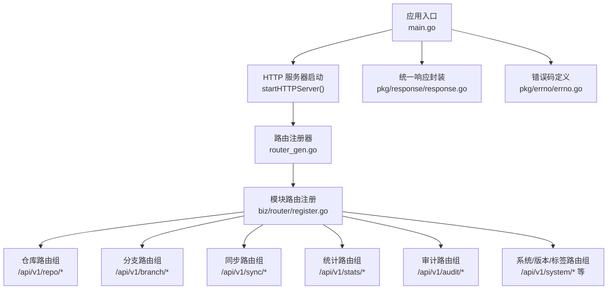
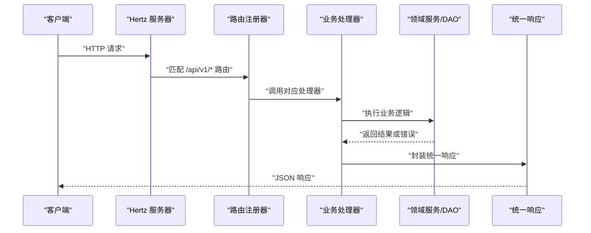
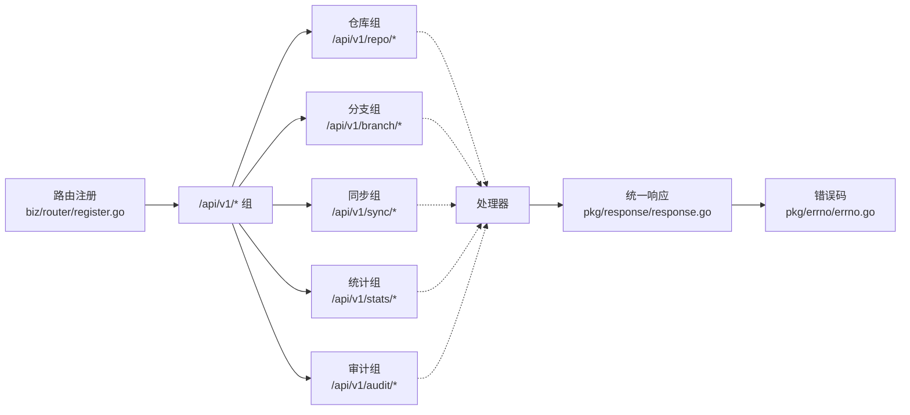

# HTTP REST API

<cite>
**本文引用的文件**
- [main.go](file://main.go)
- [router_gen.go](file://router_gen.go)
- [router.go](file://router.go)
- [biz/router/register.go](file://biz/router/register.go)
- [biz/router/repo/repo.go](file://biz/router/repo/repo.go)
- [biz/router/branch/branch.go](file://biz/router/branch/branch.go)
- [biz/router/sync/sync.go](file://biz/router/sync/sync.go)
- [biz/router/stats/stats.go](file://biz/router/stats/stats.go)
- [biz/router/audit/audit.go](file://biz/router/audit/audit.go)
- [pkg/response/response.go](file://pkg/response/response.go)
- [pkg/errno/errno.go](file://pkg/errno/errno.go)
- [docs/swagger.yaml](file://docs/swagger.yaml)
- [docs/swagger.json](file://docs/swagger.json)
- [biz/model/api/repo.go](file://biz/model/api/repo.go)
- [biz/model/api/branch.go](file://biz/model/api/branch.go)
</cite>

## 目录
1. [简介](#简介)
2. [项目结构](#项目结构)
3. [核心组件](#核心组件)
4. [架构总览](#架构总览)
5. [详细组件分析](#详细组件分析)
6. [依赖关系分析](#依赖关系分析)
7. [性能与可扩展性](#性能与可扩展性)
8. [故障排查指南](#故障排查指南)
9. [结论](#结论)
10. [附录：API 参考与最佳实践](#附录api-参考与最佳实践)

## 简介
本文件为 Git 管理服务的 HTTP REST API 详细接口文档，基于 Swagger 规范整理，覆盖仓库管理、分支管理、同步服务、统计分析、审计日志、系统配置、版本与标签等接口组。文档包含每个端点的 HTTP 方法、URL 模式、请求参数、响应格式、状态码与错误处理说明，并提供认证方式、版本管理策略、错误码定义与常见使用场景。

- 版本与基础路径
  - API 版本：2.0
  - 基础路径：/api
  - 主机地址：localhost:8080（可通过配置调整）

**章节来源**
- [main.go](file://main.go#L29-L41)

## 项目结构
后端采用 Hertz 作为 HTTP 框架，通过生成器注册路由；业务层按功能分组（仓库、分支、同步、统计、审计、系统、版本、标签），统一在 /api/v1 下暴露接口。响应体遵循统一结构，错误码由 errno 组件集中管理。

**图示来源**
- [main.go](file://main.go#L136-L152)
- [router_gen.go](file://router_gen.go#L10-L16)
- [biz/router/register.go](file://biz/router/register.go#L18-L41)
- [pkg/response/response.go](file://pkg/response/response.go#L9-L15)
- [pkg/errno/errno.go](file://pkg/errno/errno.go#L7-L23)

**章节来源**
- [main.go](file://main.go#L136-L152)
- [router_gen.go](file://router_gen.go#L10-L16)
- [biz/router/register.go](file://biz/router/register.go#L18-L41)

## 核心组件
- 统一响应结构
  - 字段：code、msg、error、data
  - 成功：code=0；失败：code 为 errno 中定义的业务错误码
- 错误码体系
  - 通用错误（0-999）：如成功、参数错误、未授权、禁止、未找到、冲突
  - 仓库相关（10000-10999）、分支相关（11000-11999）、同步任务（12000-12999）、认证（13000-13999）、标签（14000-14999）、系统（15000-15999）
- Swagger 文档
  - 提供 YAML/JSON 两版，覆盖所有端点、模型与示例

**章节来源**
- [pkg/response/response.go](file://pkg/response/response.go#L9-L15)
- [pkg/response/response.go](file://pkg/response/response.go#L35-L86)
- [pkg/errno/errno.go](file://pkg/errno/errno.go#L31-L129)
- [docs/swagger.yaml](file://docs/swagger.yaml#L1-L20)
- [docs/swagger.json](file://docs/swagger.json#L1-L20)

## 架构总览
下图展示从客户端到处理器的整体调用链路与模块划分。

**图示来源**
- [router_gen.go](file://router_gen.go#L10-L16)
- [biz/router/register.go](file://biz/router/register.go#L18-L41)
- [pkg/response/response.go](file://pkg/response/response.go#L17-L24)

## 详细组件分析

### 仓库管理（/api/v1/repo）
- 接口组：/api/v1/repo
- 关键端点
  - POST /clone：克隆远程仓库（异步任务）
  - POST /create：创建仓库
  - POST /delete：删除仓库
  - GET /detail：查询仓库详情
  - POST /fetch：拉取仓库
  - GET /list：列出仓库
  - POST /scan：扫描本地目录判断是否为 Git 仓库
  - GET /task：查询克隆任务进度
  - POST /update：更新仓库

- 请求/响应要点
  - 请求体类型：application/json
  - 成功响应：code=0，data 为具体对象或数组
  - 失败响应：code 为 errno 中的业务错误码
  - 示例参考：Swagger YAML/JSON 中的相应路径定义

- 常见状态码
  - 200：成功
  - 400：参数错误/输入无效
  - 404：资源未找到
  - 500：服务器内部错误

**章节来源**
- [biz/router/repo/repo.go](file://biz/router/repo/repo.go#L16-L38)
- [docs/swagger.yaml](file://docs/swagger.yaml#L314-L368)
- [docs/swagger.json](file://docs/swagger.json#L314-L368)

### 分支管理（/api/v1/branch）
- 接口组：/api/v1/branch
- 关键端点
  - POST /checkout：切换分支
  - GET /compare：比较两个分支差异
  - POST /create：创建分支
  - POST /delete：删除分支
  - GET /diff：获取差异内容
  - GET /list：列出分支
  - POST /merge：合并分支
  - GET /merge/check：检查合并可行性
  - GET /patch：导出补丁
  - POST /pull：拉取分支
  - POST /push：推送分支
  - POST /update：更新分支信息

- 请求/响应要点
  - 请求体类型：application/json
  - 成功响应：code=0，data 为具体对象或数组
  - 失败响应：code 为 errno 中的业务错误码
  - 示例参考：Swagger YAML/JSON 中的相应路径定义

**章节来源**
- [biz/router/branch/branch.go](file://biz/router/branch/branch.go#L16-L42)
- [docs/swagger.yaml](file://docs/swagger.yaml#L769-L868)
- [docs/swagger.json](file://docs/swagger.json#L769-L868)

### 同步服务（/api/v1/sync）
- 接口组：/api/v1/sync
- 关键端点
  - POST /execute：执行一次同步
  - GET /history：查询同步历史
  - POST /history/delete：删除同步历史
  - POST /run：运行同步任务
  - GET /task：查询单个同步任务
  - POST /task/create：创建同步任务
  - POST /task/delete：删除同步任务
  - POST /task/update：更新同步任务
  - GET /tasks：列出同步任务

- 请求/响应要点
  - 请求体类型：application/json
  - 成功响应：code=0，data 为具体对象或数组
  - 失败响应：code 为 errno 中的业务错误码
  - 示例参考：Swagger YAML/JSON 中的相应路径定义

**章节来源**
- [biz/router/sync/sync.go](file://biz/router/sync/sync.go#L16-L40)
- [docs/swagger.yaml](file://docs/swagger.yaml#L442-L566)
- [docs/swagger.json](file://docs/swagger.json#L44-L222)

### 统计分析（/api/v1/stats）
- 接口组：/api/v1/stats
- 关键端点
  - GET /analyze：分析仓库统计
  - GET /authors：作者统计
  - GET /branches：分支统计
  - GET /commits：提交记录
  - GET /export/csv：导出 CSV
  - GET /lines：代码行统计
  - GET /lines/config：读取行统计配置
  - POST /lines/config：保存行统计配置
  - GET /lines/export/csv：导出行统计 CSV

- 请求/响应要点
  - 请求体类型：application/json
  - 成功响应：code=0，data 为具体对象或数组
  - 失败响应：code 为 errno 中的业务错误码
  - 示例参考：Swagger YAML/JSON 中的相应路径定义

**章节来源**
- [biz/router/stats/stats.go](file://biz/router/stats/stats.go#L16-L48)
- [docs/swagger.yaml](file://docs/swagger.yaml#L227-L426)
- [docs/swagger.json](file://docs/swagger.json#L223-L425)

### 审计日志（/api/v1/audit）
- 接口组：/api/v1/audit
- 关键端点
  - GET /log：获取单条审计日志详情
  - GET /logs：分页列出审计日志

- 请求/响应要点
  - 请求体类型：application/json
  - 成功响应：code=0，data 为具体对象或数组
  - 失败响应：code 为 errno 中的业务错误码
  - 示例参考：Swagger YAML/JSON 中的相应路径定义

**章节来源**
- [biz/router/audit/audit.go](file://biz/router/audit/audit.go#L16-L31)
- [docs/swagger.yaml](file://docs/swagger.yaml#L442-L494)
- [docs/swagger.json](file://docs/swagger.json#L21-L107)

### 系统配置（/api/config）
- 接口组：/api/config
- 关键端点
  - GET /config：获取全局配置
  - POST /config：更新全局配置

- 请求/响应要点
  - 请求体类型：application/json
  - 成功响应：code=0，data 为配置对象
  - 失败响应：code 为 errno 中的业务错误码
  - 示例参考：Swagger YAML/JSON 中的相应路径定义

**章节来源**
- [docs/swagger.yaml](file://docs/swagger.yaml#L495-L535)
- [docs/swagger.json](file://docs/swagger.json#L109-L169)

### 版本与标签（/api/v1/version 与 /api/v1/repo/{id}/tags）
- 接口组：/api/v1/version
  - GET /version：获取项目版本字符串
  - GET /version/next：获取建议的下一主/次/修订版本
  - GET /versions：列出版本（标签）列表
- 接口组：/api/v1/repo/{id}/tags
  - GET /tags：列出仓库标签
  - POST /tags：创建标签（可选推送到远端）

- 请求/响应要点
  - 请求体类型：application/json
  - 成功响应：code=0，data 为具体对象或数组
  - 失败响应：code 为 errno 中的业务错误码
  - 示例参考：Swagger YAML/JSON 中的相应路径定义

**章节来源**
- [docs/swagger.yaml](file://docs/swagger.yaml#L675-L748)
- [docs/swagger.json](file://docs/swagger.json#L510-L634)

### Git 连接测试（/api/git/test-connection）
- 接口组：/api/git/test-connection
- 关键端点
  - POST /test-connection：测试远程 Git URL 可达性

- 请求/响应要点
  - 请求体类型：application/json
  - 成功响应：code=0，data 为连接状态对象
  - 失败响应：code 为 errno 中的业务错误码
  - 示例参考：Swagger YAML/JSON 中的相应路径定义

**章节来源**
- [docs/swagger.yaml](file://docs/swagger.yaml#L536-L566)
- [docs/swagger.json](file://docs/swagger.json#L171-L222)

## 依赖关系分析
- 路由注册
  - GeneratedRegister 调用各模块 Register，形成 /api/v1/{group} 的命名空间
- 处理器与服务
  - 各路由组映射到 biz/handler 对应包，实际业务逻辑在 service 层实现
- 响应与错误
  - 所有处理器最终通过 pkg/response/response.go 统一封装
  - 错误码来自 pkg/errno/errno.go

**图示来源**
- [biz/router/register.go](file://biz/router/register.go#L18-L41)
- [pkg/response/response.go](file://pkg/response/response.go#L9-L15)
- [pkg/errno/errno.go](file://pkg/errno/errno.go#L7-L23)

**章节来源**
- [biz/router/register.go](file://biz/router/register.go#L18-L41)
- [pkg/response/response.go](file://pkg/response/response.go#L9-L15)
- [pkg/errno/errno.go](file://pkg/errno/errno.go#L7-L23)

## 性能与可扩展性
- 路由与中间件
  - 采用分组与中间件机制，便于鉴权、限流与日志扩展
- 异步任务
  - 仓库克隆等耗时操作通过任务机制异步执行，避免阻塞请求
- 统一响应与错误码
  - 降低前端解析成本，便于统一错误处理与告警

[本节为通用指导，无需特定文件引用]

## 故障排查指南
- 常见错误码定位
  - 通用错误：如参数错误、未授权、禁止、未找到、冲突
  - 仓库相关：仓库不存在、路径无效、克隆/拉取失败、被同步任务占用
  - 分支相关：分支不存在、创建/删除/重命名失败、合并冲突、工作区不干净
  - 同步相关：任务不存在、执行失败、Cron 配置错误、任务已运行
  - 认证相关：认证失败、SSH 密钥无效、凭证无效
  - 标签相关：标签不存在、创建/删除失败
  - 系统相关：配置加载/保存失败、目录不存在/访问被拒绝
- 响应体解读
  - code=0 表示成功；非 0 时需结合 msg 与 error 字段定位问题
- 日志与审计
  - 使用审计日志接口 /api/v1/audit/logs 查询系统操作轨迹

**章节来源**
- [pkg/errno/errno.go](file://pkg/errno/errno.go#L31-L129)
- [pkg/response/response.go](file://pkg/response/response.go#L35-L86)

## 结论
本项目通过清晰的模块化路由、统一的响应与错误码体系，提供了完善的 Git 管理能力。Swagger 文档覆盖全面，便于前后端协作与集成测试。建议在生产环境中配合鉴权、限流与监控中间件，确保系统的安全性与稳定性。

[本节为总结性内容，无需特定文件引用]

## 附录：API 参考与最佳实践

### API 版本管理
- 当前版本：2.0
- 基础路径：/api
- 建议：后续版本在 /api/v2 下演进，保持 v1 向后兼容

**章节来源**
- [main.go](file://main.go#L29-L41)

### 认证与安全
- 项目未内置认证中间件，建议在路由注册前加入鉴权中间件
- 对敏感字段（如密钥）进行脱敏输出与最小权限原则

[本节为通用指导，无需特定文件引用]

### 错误码定义（节选）
- 通用错误：0 成功、400 参数错误、401 未授权、403 禁止、404 未找到、409 冲突、500 服务器内部错误
- 仓库相关：10001 仓库不存在、10002 已存在、10003 路径无效、10004 克隆失败、10005 拉取失败、10006 扫描失败、10007 非 Git 仓库、10008 被任务占用
- 分支相关：11001 分支不存在、11002 已存在、11003 删除失败、11004 创建失败、11005 重命名失败、11006 切换失败、11007 推送失败、11008 拉取失败、11009 合并失败、11010 合并冲突、11011 工作区不干净
- 同步相关：12001 任务不存在、12002 执行失败、12003 Cron 配置错误、12004 任务已禁用、12005 任务已在运行
- 认证相关：13001 认证失败、13002 SSH 密钥无效、13003 SSH 密钥不存在、13004 远程连接失败、13005 凭证无效
- 标签相关：14001 标签不存在、14002 已存在、14003 创建失败、14004 删除失败
- 系统相关：15001 加载配置失败、15002 保存配置失败、15003 目录不存在、15004 目录访问被拒绝、15005 文件操作错误

**章节来源**
- [pkg/errno/errno.go](file://pkg/errno/errno.go#L31-L129)

### 请求/响应示例与模型
- Swagger YAML/JSON 提供了完整端点定义、参数说明与示例，建议优先参考
- 常用模型
  - 仓库注册/扫描/克隆/连接测试请求体
  - 分支创建/更新/推送请求体
  - 审计日志、统计响应、同步任务/运行记录等 DTO

**章节来源**
- [docs/swagger.yaml](file://docs/swagger.yaml#L1-L800)
- [docs/swagger.json](file://docs/swagger.json#L1-L800)
- [biz/model/api/repo.go](file://biz/model/api/repo.go#L10-L37)
- [biz/model/api/branch.go](file://biz/model/api/branch.go#L3-L15)

### 最佳实践
- 使用统一响应结构，前端按 code=0 判断成功
- 对外部系统（Git 远端、文件系统）调用增加超时与重试
- 对写操作（创建/更新/删除）增加幂等与防抖
- 对大列表分页查询设置合理的默认页大小与最大限制
- 对敏感操作（删除仓库/分支/标签）增加二次确认与审计日志

[本节为通用指导，无需特定文件引用]