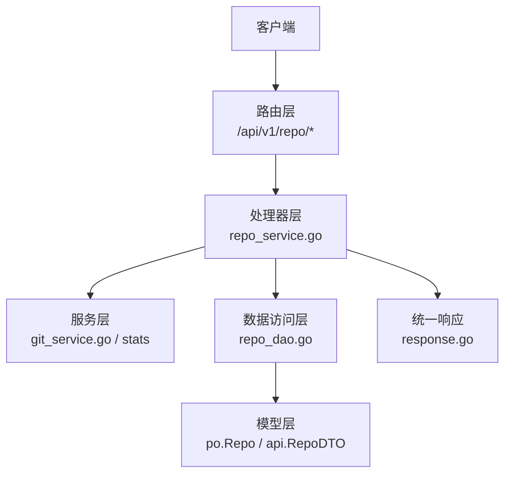
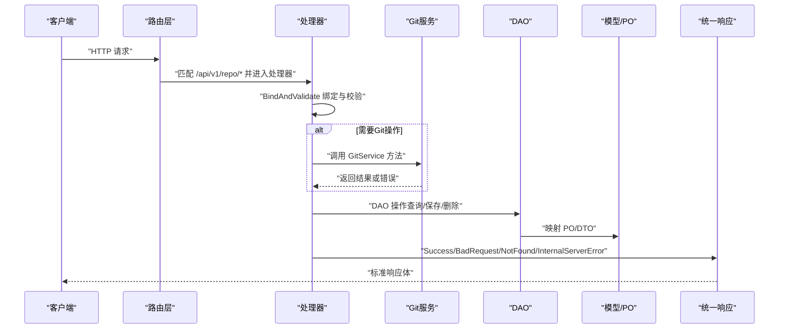
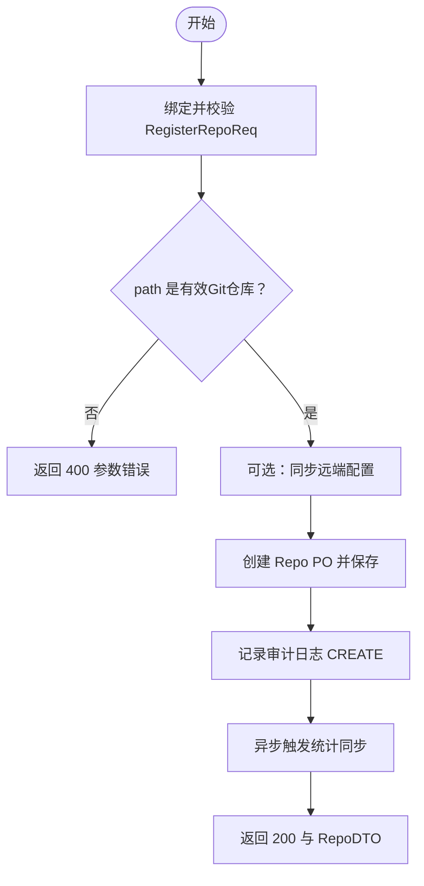
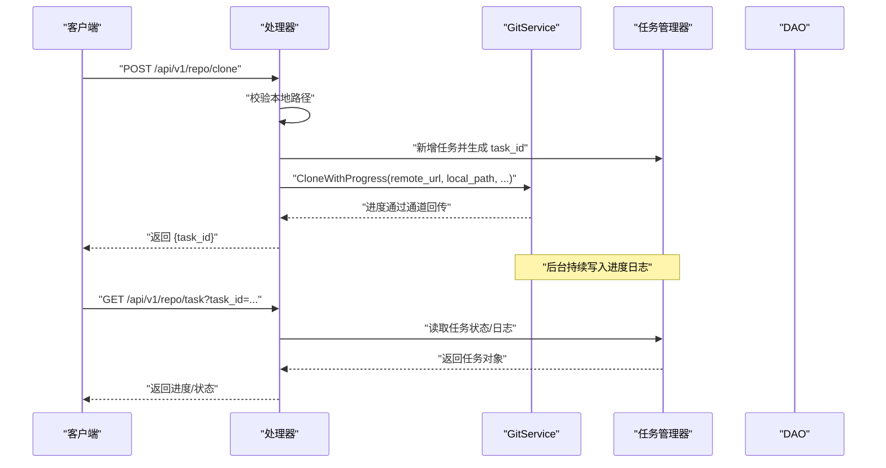
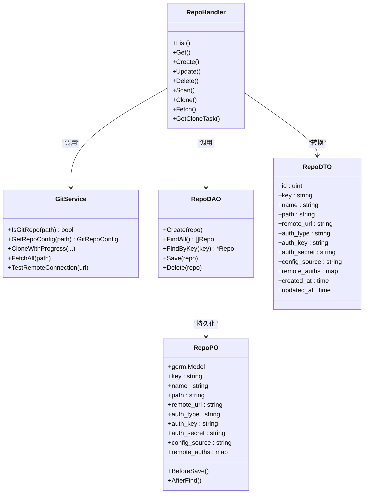

# 仓库管理API

<cite>
**本文引用的文件**
- [biz/router/repo/repo.go](file://biz/router/repo/repo.go)
- [biz/handler/repo/repo_service.go](file://biz/handler/repo/repo_service.go)
- [biz/model/api/repo.go](file://biz/model/api/repo.go)
- [biz/model/po/repo.go](file://biz/model/po/repo.go)
- [biz/dal/db/repo_dao.go](file://biz/dal/db/repo_dao.go)
- [biz/model/domain/git.go](file://biz/model/domain/git.go)
- [pkg/response/response.go](file://pkg/response/response.go)
- [biz/service/git/git_service.go](file://biz/service/git/git_service.go)
- [biz/router/repo/middleware.go](file://biz/router/repo/middleware.go)
- [biz/handler/system/system_service.go](file://biz/handler/system/system_service.go)
- [public/js/repos.js](file://public/js/repos.js)
- [public/repos.html](file://public/repos.html)
</cite>

## 目录
1. [简介](#简介)
2. [项目结构](#项目结构)
3. [核心组件](#核心组件)
4. [架构总览](#架构总览)
5. [详细组件分析](#详细组件分析)
6. [依赖关系分析](#依赖关系分析)
7. [性能与并发特性](#性能与并发特性)
8. [故障排查指南](#故障排查指南)
9. [结论](#结论)
10. [附录：接口规范与示例](#附录接口规范与示例)

## 简介
本文件面向仓库管理API，聚焦于仓库注册、查询、更新、删除、扫描、克隆、拉取、任务查询等能力，覆盖请求/响应数据结构、状态码、错误处理、认证配置、远程URL设置、SSH密钥管理、远程仓库连接测试、路径校验等关键主题。文档同时给出调用序列图、类图与流程图，帮助开发者快速理解与集成。

## 项目结构
仓库管理API由路由层、处理器层、服务层、数据访问层与模型层组成，采用分层设计与清晰的职责划分：
- 路由层：在路由文件中声明REST端点与中间件
- 处理器层：接收请求、绑定与校验参数、调用服务、返回统一响应
- 服务层：封装业务逻辑（如Git操作、统计同步、审计日志）
- 数据访问层：对数据库进行增删改查
- 模型层：定义API请求/响应与持久化实体，并在保存/读取时进行加密/解密

图表来源
- [biz/router/repo/repo.go](file://biz/router/repo/repo.go#L17-L37)
- [biz/handler/repo/repo_service.go](file://biz/handler/repo/repo_service.go#L21-L370)
- [biz/service/git/git_service.go](file://biz/service/git/git_service.go#L27-L127)
- [biz/dal/db/repo_dao.go](file://biz/dal/db/repo_dao.go#L7-L41)
- [biz/model/po/repo.go](file://biz/model/po/repo.go#L11-L28)
- [pkg/response/response.go](file://pkg/response/response.go#L9-L86)

章节来源
- [biz/router/repo/repo.go](file://biz/router/repo/repo.go#L17-L37)
- [biz/router/repo/middleware.go](file://biz/router/repo/middleware.go#L9-L72)

## 核心组件
- 路由注册：在路由文件中集中注册仓库相关端点，包括列表、详情、创建、更新、删除、扫描、克隆、拉取、任务查询等。
- 处理器：实现各端点的请求绑定、参数校验、调用服务与DAO、返回统一响应。
- 服务：封装Git操作（克隆、拉取、远程管理、配置读取）、统计同步、审计日志。
- 数据访问：基于GORM对仓库表进行CRUD。
- 模型：API请求/响应结构与持久化实体，支持主密钥与远程认证信息的加解密。

章节来源
- [biz/handler/repo/repo_service.go](file://biz/handler/repo/repo_service.go#L21-L370)
- [biz/model/api/repo.go](file://biz/model/api/repo.go#L10-L76)
- [biz/model/po/repo.go](file://biz/model/po/repo.go#L11-L92)
- [biz/dal/db/repo_dao.go](file://biz/dal/db/repo_dao.go#L13-L41)
- [pkg/response/response.go](file://pkg/response/response.go#L17-L86)

## 架构总览
下图展示仓库管理API的端到端调用链路与模块交互：

图表来源
- [biz/router/repo/repo.go](file://biz/router/repo/repo.go#L17-L37)
- [biz/handler/repo/repo_service.go](file://biz/handler/repo/repo_service.go#L21-L370)
- [biz/service/git/git_service.go](file://biz/service/git/git_service.go#L129-L136)
- [biz/dal/db/repo_dao.go](file://biz/dal/db/repo_dao.go#L13-L41)
- [pkg/response/response.go](file://pkg/response/response.go#L17-L86)

## 详细组件分析

### 1) 仓库注册 /api/v1/repo/create
- 方法与路径：POST /api/v1/repo/create
- 功能概述：将本地已存在的Git仓库登记入库；可选同步远端配置；触发异步统计同步；记录审计日志。
- 请求参数（RegisterRepoReq）
  - name: 仓库名称
  - path: 本地仓库路径（必须是有效的Git仓库）
  - remote_url: 远程默认URL（可选）
  - auth_type: 认证类型（ssh/http/none）
  - auth_key: 凭据键（SSH私钥路径或HTTP用户名）
  - auth_secret: 凭据值（SSH口令或HTTP密码；入库前加密）
  - config_source: 配置来源（local/database，默认local）
  - remotes: 远端列表（可选），用于同步远端配置
  - remote_auths: 按远端的独立认证（可选）
- 响应数据（RepoDTO）
  - 包含仓库基本信息、认证信息与时间戳；敏感字段在入库前后自动加解密
- 状态码
  - 200 成功
  - 400 参数错误（如路径无效、参数缺失）
  - 500 服务器内部错误
- 错误处理
  - 路径有效性检查失败返回400
  - DAO创建失败返回500
  - 审计日志记录“CREATE”
- 关键流程
  - 校验path是否为有效Git仓库
  - 可选同步remotes与pushURL
  - 创建PO并保存至数据库
  - 异步触发统计同步
  - 返回RepoDTO

图表来源
- [biz/handler/repo/repo_service.go](file://biz/handler/repo/repo_service.go#L52-L126)
- [biz/service/git/git_service.go](file://biz/service/git/git_service.go#L129-L136)
- [biz/model/po/repo.go](file://biz/model/po/repo.go#L30-L62)

章节来源
- [biz/handler/repo/repo_service.go](file://biz/handler/repo/repo_service.go#L52-L126)
- [biz/model/api/repo.go](file://biz/model/api/repo.go#L10-L20)
- [biz/model/po/repo.go](file://biz/model/po/repo.go#L11-L62)
- [pkg/response/response.go](file://pkg/response/response.go#L58-L71)

### 2) 仓库查询 /api/v1/repo/detail
- 方法与路径：GET /api/v1/repo/detail?key={key}
- 功能概述：根据仓库key查询单个仓库详情
- 查询参数
  - key: 仓库唯一标识
- 响应数据：RepoDTO
- 状态码
  - 200 成功
  - 400 缺少key
  - 404 未找到仓库
- 错误处理
  - key为空返回400
  - 未找到返回404

章节来源
- [biz/handler/repo/repo_service.go](file://biz/handler/repo/repo_service.go#L36-L50)
- [biz/dal/db/repo_dao.go](file://biz/dal/db/repo_dao.go#L23-L27)
- [pkg/response/response.go](file://pkg/response/response.go#L63-L66)

### 3) 仓库列表 /api/v1/repo/list
- 方法与路径：GET /api/v1/repo/list
- 功能概述：列出所有仓库
- 响应数据：RepoDTO数组
- 状态码：200 成功

章节来源
- [biz/handler/repo/repo_service.go](file://biz/handler/repo/repo_service.go#L21-L34)
- [biz/dal/db/repo_dao.go](file://biz/dal/db/repo_dao.go#L17-L21)

### 4) 仓库更新 /api/v1/repo/update
- 方法与路径：POST /api/v1/repo/update
- 功能概述：更新仓库信息；若路径变更则重新校验有效性；可选同步远端配置
- 请求参数（匿名嵌入）
  - key: 必填
  - RegisterRepoReq: 其余字段同注册
- 响应数据：RepoDTO
- 状态码
  - 200 成功
  - 400 参数错误（如路径无效）
  - 404 未找到仓库
  - 500 服务器内部错误
- 错误处理
  - 未找到仓库返回404
  - 路径变更时重新校验
  - 同步远端配置后保存

章节来源
- [biz/handler/repo/repo_service.go](file://biz/handler/repo/repo_service.go#L128-L204)
- [biz/model/api/repo.go](file://biz/model/api/repo.go#L10-L20)
- [pkg/response/response.go](file://pkg/response/response.go#L58-L71)

### 5) 仓库删除 /api/v1/repo/delete
- 方法与路径：POST /api/v1/repo/delete
- 功能概述：删除仓库；若被同步任务引用则拒绝删除
- 请求参数
  - key: 仓库key
- 响应数据：{"message":"deleted"}
- 状态码
  - 200 成功
  - 400 已被同步任务引用
  - 404 未找到仓库
  - 500 服务器内部错误
- 错误处理
  - 若存在同步任务引用返回400
  - 删除失败返回500
  - 审计日志记录“DELETE”

章节来源
- [biz/handler/repo/repo_service.go](file://biz/handler/repo/repo_service.go#L206-L237)
- [biz/dal/db/repo_dao.go](file://biz/dal/db/repo_dao.go#L39-L41)
- [pkg/response/response.go](file://pkg/response/response.go#L58-L71)

### 6) 仓库扫描 /api/v1/repo/scan
- 方法与路径：POST /api/v1/repo/scan
- 功能概述：扫描指定路径的Git仓库配置，返回远端与分支信息
- 请求参数（ScanRepoReq）
  - path: 本地仓库路径
- 响应数据：GitRepoConfig（包含remotes与branches）
- 状态码
  - 200 成功
  - 400 参数错误（路径无效）
  - 500 服务器内部错误
- 错误处理
  - 路径非Git仓库返回400
  - 读取配置失败返回500

章节来源
- [biz/handler/repo/repo_service.go](file://biz/handler/repo/repo_service.go#L239-L261)
- [biz/service/git/git_service.go](file://biz/service/git/git_service.go#L357-L409)
- [pkg/response/response.go](file://pkg/response/response.go#L58-L71)

### 7) 仓库克隆 /api/v1/repo/clone
- 方法与路径：POST /api/v1/repo/clone
- 功能概述：从远程URL克隆到本地路径，支持HTTP/SSH认证；返回任务ID，后续轮询进度
- 请求参数（CloneRepoReq）
  - remote_url: 远程仓库URL
  - local_path: 本地目标路径
  - auth_type/auth_key/auth_secret: 认证信息
  - config_source: 配置来源
- 响应数据：{"task_id": "..."}
- 状态码
  - 200 成功
  - 400 参数错误（如目录已存在且非空仓库）
  - 500 服务器内部错误
- 错误处理
  - 本地路径已存在且为Git仓库返回400
  - 克隆失败更新任务状态为failed
  - 成功后写入数据库并触发统计同步
- 任务轮询
  - GET /api/v1/repo/task?task_id={id} 查询进度与状态

图表来源
- [biz/handler/repo/repo_service.go](file://biz/handler/repo/repo_service.go#L263-L370)
- [biz/service/git/git_service.go](file://biz/service/git/git_service.go#L197-L218)
- [public/js/repos.js](file://public/js/repos.js#L496-L539)
- [public/repos.html](file://public/repos.html#L169-L186)

章节来源
- [biz/handler/repo/repo_service.go](file://biz/handler/repo/repo_service.go#L263-L370)
- [biz/service/git/git_service.go](file://biz/service/git/git_service.go#L197-L218)
- [public/js/repos.js](file://public/js/repos.js#L482-L539)
- [public/repos.html](file://public/repos.html#L169-L186)

### 8) 仓库拉取 /api/v1/repo/fetch
- 方法与路径：POST /api/v1/repo/fetch
- 功能概述：对指定仓库执行“拉取全部远端”操作
- 请求参数
  - repo_key: 仓库key
- 响应数据：{"message":"fetched"}
- 状态码
  - 200 成功
  - 400 参数错误
  - 404 未找到仓库
  - 500 服务器内部错误
- 错误处理
  - 未找到仓库返回404
  - 拉取失败返回500
  - 记录审计日志“FETCH_REPO”

章节来源
- [biz/handler/repo/repo_service.go](file://biz/handler/repo/repo_service.go#L329-L354)
- [pkg/response/response.go](file://pkg/response/response.go#L63-L71)

### 9) 任务查询 /api/v1/repo/task
- 方法与路径：GET /api/v1/repo/task?task_id={id}
- 功能概述：查询克隆任务的进度与状态
- 查询参数
  - task_id: 任务ID
- 响应数据：任务对象（包含状态、日志等）
- 状态码
  - 200 成功
  - 400 参数错误
  - 404 任务不存在

章节来源
- [biz/handler/repo/repo_service.go](file://biz/handler/repo/repo_service.go#L356-L370)
- [pkg/response/response.go](file://pkg/response/response.go#L58-L66)

### 10) 远程连接测试 /api/v1/system/test-connection
- 方法与路径：POST /api/v1/system/test-connection
- 功能概述：测试对指定远程URL的可达性（无需仓库key）
- 请求参数（TestConnectionReq）
  - url: 远程URL
- 响应数据：{"status":"success|failed","error": "..."}（成功时无error字段）
- 状态码
  - 200 成功
  - 400 参数错误
- 错误处理
  - 绑定/校验失败返回400
  - 连接失败返回失败状态与错误信息

章节来源
- [biz/handler/system/system_service.go](file://biz/handler/system/system_service.go#L142-L158)
- [biz/service/git/git_service.go](file://biz/service/git/git_service.go#L578-L592)

## 依赖关系分析

图表来源
- [biz/handler/repo/repo_service.go](file://biz/handler/repo/repo_service.go#L21-L370)
- [biz/service/git/git_service.go](file://biz/service/git/git_service.go#L129-L409)
- [biz/dal/db/repo_dao.go](file://biz/dal/db/repo_dao.go#L13-L41)
- [biz/model/api/repo.go](file://biz/model/api/repo.go#L46-L76)
- [biz/model/po/repo.go](file://biz/model/po/repo.go#L11-L92)

章节来源
- [biz/handler/repo/repo_service.go](file://biz/handler/repo/repo_service.go#L21-L370)
- [biz/service/git/git_service.go](file://biz/service/git/git_service.go#L129-L409)
- [biz/dal/db/repo_dao.go](file://biz/dal/db/repo_dao.go#L13-L41)
- [biz/model/api/repo.go](file://biz/model/api/repo.go#L46-L76)
- [biz/model/po/repo.go](file://biz/model/po/repo.go#L11-L92)

## 性能与并发特性
- 异步克隆：克隆过程在后台协程中执行，通过任务管理器记录进度与状态，避免阻塞请求线程。
- 统一响应：所有端点返回统一结构，便于前端一致处理。
- 加解密开销：敏感字段在入库前加密、出库后解密，建议在批量操作时注意I/O与CPU开销。
- Git操作：使用go-git与原生命令组合，尽量通过go-git完成以减少外部进程开销；仅在必要时使用shell命令。

[本节为通用指导，不直接分析具体文件]

## 故障排查指南
- 参数错误（400）
  - 常见原因：缺少必填参数、路径无效、本地路径已是仓库
  - 排查要点：确认请求体结构与必填字段；检查路径是否存在且为Git仓库
- 资源不存在（404）
  - 常见原因：仓库key不存在、任务ID不存在
  - 排查要点：核对key与task_id；确认资源是否已被删除
- 服务器内部错误（500）
  - 常见原因：数据库操作失败、Git命令执行失败、配置读取异常
  - 排查要点：查看服务日志；确认Git可执行文件可用；检查权限与网络
- 认证问题
  - SSH：确认私钥路径正确、无口令或口令正确；必要时使用SSH Agent
  - HTTP：确认用户名/密码或Token正确
- 远程连接测试
  - 使用系统测试接口验证URL可达性与认证配置

章节来源
- [pkg/response/response.go](file://pkg/response/response.go#L58-L86)
- [biz/handler/repo/repo_service.go](file://biz/handler/repo/repo_service.go#L52-L126)
- [biz/handler/system/system_service.go](file://biz/handler/system/system_service.go#L142-L158)

## 结论
仓库管理API围绕“注册—查询—更新—删除—扫描—克隆—拉取—任务查询—连接测试”的完整生命周期构建，结合Git服务、DAO与统一响应，形成清晰、可扩展的分层架构。通过任务轮询与异步统计同步，兼顾了用户体验与系统性能。建议在生产环境启用审计日志与连接测试，并对敏感字段进行妥善保护。

[本节为总结性内容，不直接分析具体文件]

## 附录：接口规范与示例

### A. 数据结构说明
- RegisterRepoReq（注册请求）
  - 字段：name, path, remote_url, auth_type, auth_key, auth_secret, config_source, remotes, remote_auths
- RepoDTO（仓库响应）
  - 字段：id, key, name, path, remote_url, auth_type, auth_key, auth_secret, config_source, remote_auths, created_at, updated_at
- ScanRepoReq（扫描请求）
  - 字段：path
- CloneRepoReq（克隆请求）
  - 字段：remote_url, local_path, auth_type, auth_key, auth_secret, config_source
- TestConnectionReq（连接测试请求）
  - 字段：url
- GitRepoConfig（仓库配置）
  - 字段：remotes[], branches[]（其中GitRemote与GitBranch见领域模型）

章节来源
- [biz/model/api/repo.go](file://biz/model/api/repo.go#L10-L37)
- [biz/model/po/repo.go](file://biz/model/po/repo.go#L11-L24)
- [biz/model/domain/git.go](file://biz/model/domain/git.go#L5-L24)

### B. 使用场景与最佳实践
- 仓库认证配置
  - SSH：auth_type=ssh，auth_key为私钥路径；可配合SSH Agent
  - HTTP：auth_type=http，auth_key为用户名，auth_secret为密码或Token
- 远程URL设置
  - 支持多远端同步；可通过remotes字段在注册/更新时同步远端配置
- SSH密钥管理
  - 建议使用无口令私钥或SSH Agent；必要时在系统级列出可用密钥
- 仓库扫描
  - 使用扫描接口获取当前仓库的远端与分支配置，辅助诊断与迁移
- 路径验证
  - 注册/更新时会校验path是否为有效Git仓库；克隆前也会校验本地路径
- 远程仓库连接测试
  - 使用系统测试接口验证URL连通性与认证配置

章节来源
- [biz/handler/repo/repo_service.go](file://biz/handler/repo/repo_service.go#L52-L126)
- [biz/handler/system/system_service.go](file://biz/handler/system/system_service.go#L113-L158)
- [biz/service/git/git_service.go](file://biz/service/git/git_service.go#L50-L127)

### C. 请求/响应示例（路径参考）
- 注册仓库
  - 请求体字段：参见RegisterRepoReq
  - 响应体字段：参见RepoDTO
  - 参考实现：[Create](file://biz/handler/repo/repo_service.go#L52-L126)
- 查询仓库
  - 查询参数：key
  - 响应体字段：参见RepoDTO
  - 参考实现：[Get](file://biz/handler/repo/repo_service.go#L36-L50)
- 更新仓库
  - 请求体字段：key + RegisterRepoReq
  - 响应体字段：参见RepoDTO
  - 参考实现：[Update](file://biz/handler/repo/repo_service.go#L128-L204)
- 删除仓库
  - 请求体字段：key
  - 响应体：{"message":"deleted"}
  - 参考实现：[Delete](file://biz/handler/repo/repo_service.go#L206-L237)
- 扫描仓库
  - 请求体字段：path
  - 响应体：GitRepoConfig
  - 参考实现：[Scan](file://biz/handler/repo/repo_service.go#L239-L261)
- 克隆仓库
  - 请求体字段：CloneRepoReq
  - 响应体：{"task_id":"..."}
  - 参考实现：[Clone](file://biz/handler/repo/repo_service.go#L263-L327)
- 拉取仓库
  - 请求体字段：repo_key
  - 响应体：{"message":"fetched"}
  - 参考实现：[Fetch](file://biz/handler/repo/repo_service.go#L329-L354)
- 任务查询
  - 查询参数：task_id
  - 响应体：任务对象
  - 参考实现：[GetCloneTask](file://biz/handler/repo/repo_service.go#L356-L370)
- 连接测试
  - 请求体字段：url
  - 响应体：{"status":"success|failed"[,"error": "..."]}
  - 参考实现：[TestConnection](file://biz/handler/system/system_service.go#L142-L158)