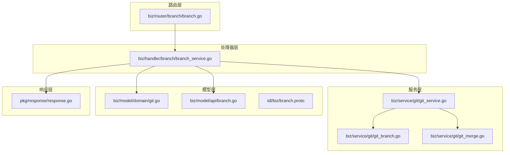
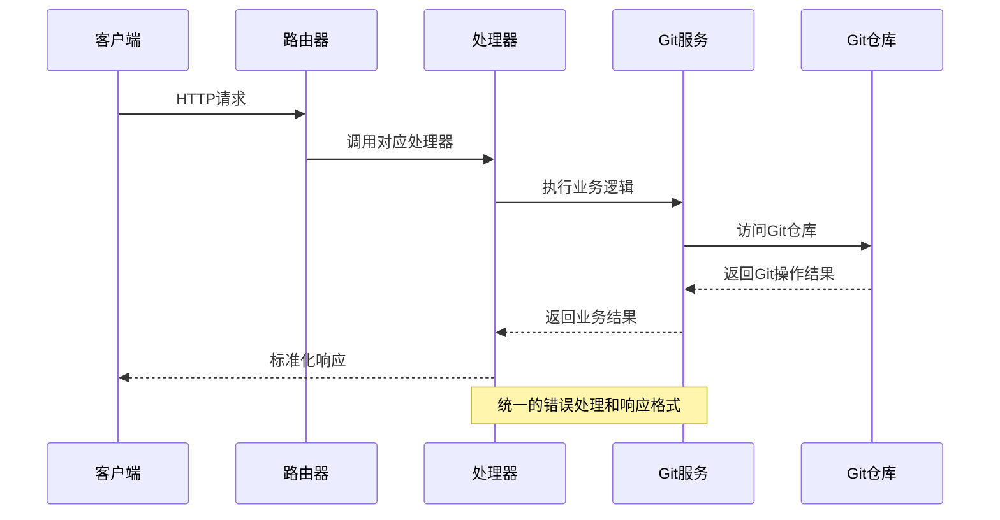
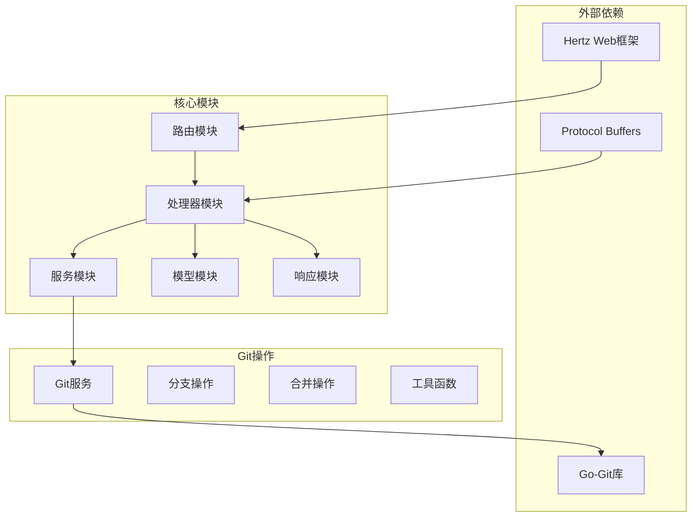
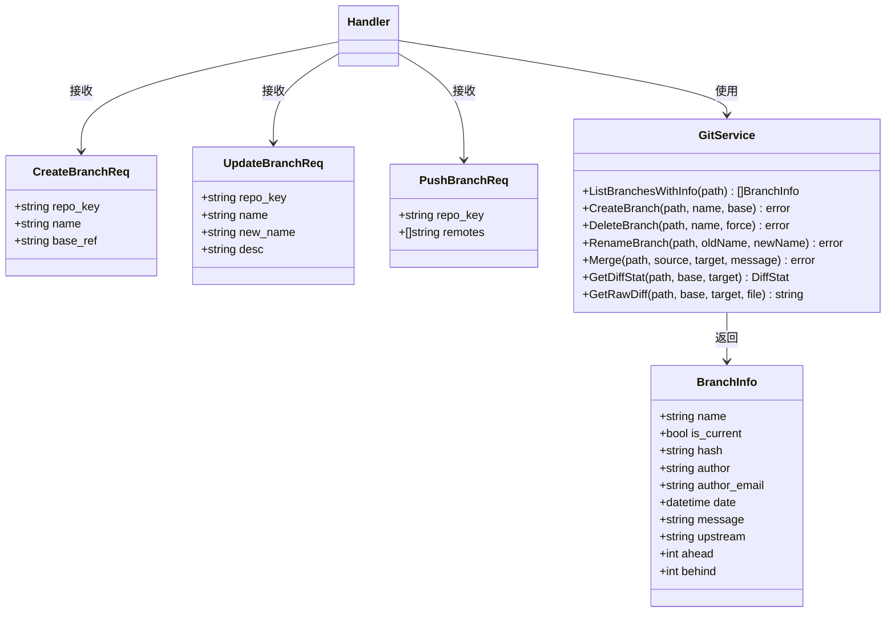

# 分支管理API

<cite>
**本文档引用的文件**
- [biz/router/branch/branch.go](file://biz/router/branch/branch.go)
- [biz/handler/branch/branch_service.go](file://biz/handler/branch/branch_service.go)
- [biz/service/git/git_branch.go](file://biz/service/git/git_branch.go)
- [biz/service/git/git_merge.go](file://biz/service/git/git_merge.go)
- [biz/service/git/git_service.go](file://biz/service/git/git_service.go)
- [biz/model/domain/git.go](file://biz/model/domain/git.go)
- [biz/model/api/branch.go](file://biz/model/api/branch.go)
- [idl/biz/branch.proto](file://idl/biz/branch.proto)
- [pkg/response/response.go](file://pkg/response/response.go)
- [public/js/compare.js](file://public/js/compare.js)
</cite>

## 目录
1. [简介](#简介)
2. [项目结构](#项目结构)
3. [核心组件](#核心组件)
4. [架构概览](#架构概览)
5. [详细组件分析](#详细组件分析)
6. [依赖关系分析](#依赖关系分析)
7. [性能考虑](#性能考虑)
8. [故障排除指南](#故障排除指南)
9. [结论](#结论)

## 简介

分支管理API是Git管理服务的核心功能模块，提供了完整的Git分支生命周期管理能力。该模块支持分支列表查询、创建、删除、更新、切换、比较、合并、推送、拉取等操作，并集成了分支描述管理、远程分支同步、分支保护规则等高级功能。

本API基于Hertz框架构建，采用分层架构设计，包括路由层、处理器层、服务层和数据访问层。所有接口均遵循RESTful设计原则，提供标准化的JSON响应格式。

## 项目结构

分支管理API的项目结构采用典型的分层架构模式：



**图表来源**
- [biz/router/branch/branch.go](file://biz/router/branch/branch.go#L17-L41)
- [biz/handler/branch/branch_service.go](file://biz/handler/branch/branch_service.go#L1-L50)
- [biz/service/git/git_service.go](file://biz/service/git/git_service.go#L27-L31)

**章节来源**
- [biz/router/branch/branch.go](file://biz/router/branch/branch.go#L1-L43)
- [biz/handler/branch/branch_service.go](file://biz/handler/branch/branch_service.go#L1-L50)

## 核心组件

### 路由注册器
路由注册器负责将所有分支管理相关的API端点注册到Hertz服务器。系统自动根据IDL配置生成路由映射，确保URL路径与业务逻辑的一致性。

### 处理器服务
处理器服务实现了具体的业务逻辑，包括：
- 分支列表查询与分页过滤
- 分支创建与删除
- 分支更新（重命名、描述修改）
- 分支切换与同步
- 分支比较与差异分析
- 分支合并与冲突检测

### Git服务层
Git服务层封装了底层的Git操作，提供统一的接口供上层调用。支持本地Git仓库操作和远程仓库交互。

**章节来源**
- [biz/router/branch/branch.go](file://biz/router/branch/branch.go#L16-L41)
- [biz/handler/branch/branch_service.go](file://biz/handler/branch/branch_service.go#L22-L522)

## 架构概览

分支管理API采用分层架构设计，各层职责明确，耦合度低：



**图表来源**
- [biz/handler/branch/branch_service.go](file://biz/handler/branch/branch_service.go#L22-L92)
- [biz/service/git/git_service.go](file://biz/service/git/git_service.go#L33-L48)

## 详细组件分析

### 分支列表查询 API

#### 接口定义
- **HTTP方法**: GET
- **URL模式**: `/api/v1/branch/list`
- **请求参数**:
  - `repo_key`: 仓库标识符（必需）
  - `page`: 页码，默认1
  - `page_size`: 每页大小，默认100
  - `keyword`: 搜索关键词

#### 请求示例
```bash
curl -X GET "http://localhost:8080/api/v1/branch/list?repo_key=repo123&page=1&page_size=50&keyword=feature"
```

#### 响应格式
```json
{
  "code": 0,
  "msg": "success",
  "data": {
    "total": 150,
    "list": [
      {
        "name": "feature-login",
        "is_current": false,
        "hash": "a1b2c3d4e5f6...",
        "author": "张三",
        "author_email": "zhangsan@example.com",
        "date": "2024-01-15T10:30:00Z",
        "message": "添加用户登录功能",
        "upstream": "origin/feature-login",
        "ahead": 3,
        "behind": 0
      }
    ]
  }
}
```

#### 状态码
- 200: 成功
- 400: 参数错误
- 404: 仓库不存在
- 500: 服务器内部错误

**章节来源**
- [biz/handler/branch/branch_service.go](file://biz/handler/branch/branch_service.go#L22-L92)
- [biz/service/git/git_branch.go](file://biz/service/git/git_branch.go#L13-L79)

### 分支创建 API

#### 接口定义
- **HTTP方法**: POST
- **URL模式**: `/api/v1/branch/create`
- **请求体**: CreateBranchReq
  - `repo_key`: 仓库标识符（必需）
  - `name`: 分支名称（必需）
  - `base_ref`: 基础引用，默认HEAD

#### 请求示例
```json
{
  "repo_key": "repo123",
  "name": "feature-new-api",
  "base_ref": "main"
}
```

#### 响应格式
```json
{
  "code": 0,
  "msg": "success",
  "data": {
    "message": "created"
  }
}
```

#### 状态码
- 200: 创建成功
- 400: 参数验证失败
- 404: 仓库不存在
- 500: 创建失败

**章节来源**
- [biz/handler/branch/branch_service.go](file://biz/handler/branch/branch_service.go#L94-L124)
- [biz/service/git/git_branch.go](file://biz/service/git/git_branch.go#L81-L106)

### 分支删除 API

#### 接口定义
- **HTTP方法**: POST
- **URL模式**: `/api/v1/branch/delete`
- **请求体**: DeleteBranchReq
  - `repo_key`: 仓库标识符（必需）
  - `name`: 分支名称（必需）
  - `force`: 是否强制删除

#### 请求示例
```json
{
  "repo_key": "repo123",
  "name": "deprecated-feature",
  "force": false
}
```

#### 响应格式
```json
{
  "code": 0,
  "msg": "success",
  "data": {
    "message": "deleted"
  }
}
```

#### 状态码
- 200: 删除成功
- 400: 参数验证失败
- 404: 仓库或分支不存在
- 500: 删除失败

**章节来源**
- [biz/handler/branch/branch_service.go](file://biz/handler/branch/branch_service.go#L126-L156)
- [biz/service/git/git_branch.go](file://biz/service/git/git_branch.go#L108-L116)

### 分支更新 API

#### 接口定义
- **HTTP方法**: POST
- **URL模式**: `/api/v1/branch/update`
- **请求体**: UpdateBranchReq
  - `repo_key`: 仓库标识符（必需）
  - `name`: 当前分支名称（必需）
  - `new_name`: 新分支名称
  - `desc`: 分支描述

#### 请求示例
```json
{
  "repo_key": "repo123",
  "name": "feature-old",
  "new_name": "feature-renamed",
  "desc": "重构后的用户认证模块"
}
```

#### 响应格式
```json
{
  "code": 0,
  "msg": "success",
  "data": {
    "message": "updated"
  }
}
```

#### 状态码
- 200: 更新成功
- 400: 参数验证失败
- 404: 仓库或分支不存在
- 500: 更新失败

**章节来源**
- [biz/handler/branch/branch_service.go](file://biz/handler/branch/branch_service.go#L158-L203)
- [biz/service/git/git_branch.go](file://biz/service/git/git_branch.go#L118-L154)

### 分支切换 API

#### 接口定义
- **HTTP方法**: POST
- **URL模式**: `/api/v1/branch/checkout`
- **请求体**: CheckoutBranchReq
  - `repo_key`: 仓库标识符（必需）
  - `name`: 目标分支名称（必需）

#### 请求示例
```json
{
  "repo_key": "repo123",
  "name": "develop"
}
```

#### 响应格式
```json
{
  "code": 0,
  "msg": "success",
  "data": {
    "message": "checked out develop"
  }
}
```

#### 状态码
- 200: 切换成功
- 400: 参数验证失败
- 404: 仓库或分支不存在
- 500: 切换失败

**章节来源**
- [biz/handler/branch/branch_service.go](file://biz/handler/branch/branch_service.go#L205-L233)
- [biz/service/git/git_service.go](file://biz/service/git/git_service.go#L594-L607)

### 分支比较 API

#### 接口定义
- **HTTP方法**: GET
- **URL模式**: `/api/v1/branch/compare`
- **查询参数**:
  - `repo_key`: 仓库标识符（必需）
  - `base`: 基础分支
  - `target`: 目标分支

#### 请求示例
```bash
curl -X GET "http://localhost:8080/api/v1/branch/compare?repo_key=repo123&base=main&target=feature-login"
```

#### 响应格式
```json
{
  "code": 0,
  "msg": "success",
  "data": {
    "stat": {
      "files_changed": 15,
      "insertions": 245,
      "deletions": 89
    },
    "files": [
      {
        "path": "src/auth/login.py",
        "status": "M",
        "additions": 120,
        "deletions": 45
      }
    ]
  }
}
```

#### 状态码
- 200: 比较成功
- 400: 参数错误
- 404: 仓库不存在
- 500: 比较失败

**章节来源**
- [biz/handler/branch/branch_service.go](file://biz/handler/branch/branch_service.go#L352-L388)
- [biz/service/git/git_merge.go](file://biz/service/git/git_merge.go#L21-L94)

### 分支差异查看 API

#### 接口定义
- **HTTP方法**: GET
- **URL模式**: `/api/v1/branch/diff`
- **查询参数**:
  - `repo_key`: 仓库标识符（必需）
  - `base`: 基础分支
  - `target`: 目标分支
  - `file`: 文件路径（可选）

#### 请求示例
```bash
curl -X GET "http://localhost:8080/api/v1/branch/diff?repo_key=repo123&base=main&target=feature-login&file=src/auth/login.py"
```

#### 响应格式
```json
{
  "code": 0,
  "msg": "success",
  "data": {
    "diff": "@@ -1,7 +1,7 @@\n def authenticate_user(username, password):\n     if not username or not password:\n         return False\n-    return True\n+    return validate_credentials(username, password)"
  }
}
```

#### 状态码
- 200: 获取差异成功
- 400: 参数错误
- 404: 仓库不存在
- 500: 获取差异失败

**章节来源**
- [biz/handler/branch/branch_service.go](file://biz/handler/branch/branch_service.go#L390-L412)
- [biz/service/git/git_merge.go](file://biz/service/git/git_merge.go#L109-L148)

### 分支合并检查 API

#### 接口定义
- **HTTP方法**: GET
- **URL模式**: `/api/v1/branch/merge/check`
- **查询参数**:
  - `repo_key`: 仓库标识符（必需）
  - `base`: 源分支
  - `target`: 目标分支

#### 请求示例
```bash
curl -X GET "http://localhost:8080/api/v1/branch/merge/check?repo_key=repo123&base=feature-login&target=main"
```

#### 响应格式
```json
{
  "code": 0,
  "msg": "success",
  "data": {
    "success": true,
    "conflicts": []
  }
}
```

#### 状态码
- 200: 检查成功
- 400: 参数错误
- 404: 仓库不存在
- 500: 检查失败

**章节来源**
- [biz/handler/branch/branch_service.go](file://biz/handler/branch/branch_service.go#L414-L435)
- [biz/service/git/git_merge.go](file://biz/service/git/git_merge.go#L157-L217)

### 分支合并 API

#### 接口定义
- **HTTP方法**: POST
- **URL模式**: `/api/v1/branch/merge`
- **请求体**: MergeBranchReq
  - `repo_key`: 仓库标识符（必需）
  - `source`: 源分支
  - `target`: 目标分支
  - `message`: 合并提交信息
  - `no_ff`: 是否禁用快进合并
  - `squash`: 是否进行压缩合并

#### 请求示例
```json
{
  "repo_key": "repo123",
  "source": "feature-login",
  "target": "main",
  "message": "合并用户登录功能",
  "no_ff": false,
  "squash": false
}
```

#### 响应格式
```json
{
  "code": 0,
  "msg": "success",
  "data": {
    "status": "merged"
  }
}
```

#### 状态码
- 200: 合并成功
- 400: 参数错误
- 404: 仓库不存在
- 409: 存在合并冲突
- 500: 合并失败

**章节来源**
- [biz/handler/branch/branch_service.go](file://biz/handler/branch/branch_service.go#L437-L496)
- [biz/service/git/git_merge.go](file://biz/service/git/git_merge.go#L219-L242)

### 分支补丁下载 API

#### 接口定义
- **HTTP方法**: GET
- **URL模式**: `/api/v1/branch/patch`
- **查询参数**:
  - `repo_key`: 仓库标识符（必需）
  - `base`: 基础分支
  - `target`: 目标分支

#### 请求示例
```bash
curl -X GET "http://localhost:8080/api/v1/branch/patch?repo_key=repo123&base=main&target=feature-login" -o login.patch
```

#### 响应格式
- Content-Type: application/octet-stream
- Content-Disposition: attachment; filename=repo-name-main-20240115.patch

#### 状态码
- 200: 下载成功
- 400: 参数错误
- 404: 仓库不存在
- 500: 生成补丁失败

**章节来源**
- [biz/handler/branch/branch_service.go](file://biz/handler/branch/branch_service.go#L498-L521)
- [biz/service/git/git_merge.go](file://biz/service/git/git_merge.go#L244-L262)

### 分支推送 API

#### 接口定义
- **HTTP方法**: POST
- **URL模式**: `/api/v1/branch/push`
- **请求体**: PushBranchReq
  - `repo_key`: 仓库标识符（必需）
  - `name`: 分支名称
  - `remotes`: 远程仓库列表

#### 请求示例
```json
{
  "repo_key": "repo123",
  "name": "feature-login",
  "remotes": ["origin", "upstream"]
}
```

#### 响应格式
```json
{
  "code": 0,
  "msg": "success",
  "data": {
    "message": "pushed"
  }
}
```

#### 状态码
- 200: 推送成功
- 400: 参数错误
- 404: 仓库不存在
- 500: 推送失败

**章节来源**
- [biz/handler/branch/branch_service.go](file://biz/handler/branch/branch_service.go#L235-L273)
- [biz/service/git/git_service.go](file://biz/service/git/git_service.go#L292-L323)

### 分支拉取 API

#### 接口定义
- **HTTP方法**: POST
- **URL模式**: `/api/v1/branch/pull`
- **请求体**: PullBranchReq
  - `repo_key`: 仓库标识符（必需）
  - `name`: 分支名称

#### 请求示例
```json
{
  "repo_key": "repo123",
  "name": "main"
}
```

#### 响应格式
```json
{
  "code": 0,
  "msg": "success",
  "data": {
    "message": "synced"
  }
}
```

#### 状态码
- 200: 拉取成功
- 400: 参数错误或上游未配置
- 404: 仓库不存在
- 500: 拉取失败

**章节来源**
- [biz/handler/branch/branch_service.go](file://biz/handler/branch/branch_service.go#L275-L350)
- [biz/service/git/git_service.go](file://biz/service/git/git_service.go#L594-L607)

## 依赖关系分析

分支管理API的依赖关系呈现清晰的分层结构：



**图表来源**
- [biz/handler/branch/branch_service.go](file://biz/handler/branch/branch_service.go#L5-L20)
- [biz/service/git/git_service.go](file://biz/service/git/git_service.go#L3-L25)

### 数据模型关系



**图表来源**
- [biz/model/domain/git.go](file://biz/model/domain/git.go#L26-L39)
- [biz/model/api/branch.go](file://biz/model/api/branch.go#L3-L15)
- [biz/service/git/git_service.go](file://biz/service/git/git_service.go#L27-L31)

**章节来源**
- [biz/model/domain/git.go](file://biz/model/domain/git.go#L1-L40)
- [biz/model/api/branch.go](file://biz/model/api/branch.go#L1-L16)
- [idl/biz/branch.proto](file://idl/biz/branch.proto#L74-L100)

## 性能考虑

### 分页优化
- 默认每页返回100条记录，支持自定义页大小
- 关键字搜索采用内存过滤，适合中小规模仓库
- 大型仓库建议使用更精确的搜索条件

### 缓存策略
- 分支同步状态（ahead/behind）按需计算
- Git对象缓存利用Go-Git的内置缓存机制
- 避免重复解析相同的Git引用

### 并发控制
- Git操作使用互斥锁防止并发修改
- 大型操作（如合并）采用异步处理
- 进度报告通过流式传输实现

### 内存管理
- 差异内容按需生成，避免大文件加载
- 日志统计使用流式处理减少内存占用
- 及时释放Git对象资源

## 故障排除指南

### 常见错误类型

#### 参数验证错误
- **错误码**: 400
- **原因**: 缺少必需参数或参数格式不正确
- **解决方案**: 检查请求参数的完整性和格式

#### 资源不存在错误
- **错误码**: 404
- **原因**: 仓库或分支不存在
- **解决方案**: 确认仓库标识符和分支名称的正确性

#### 权限不足错误
- **错误码**: 403
- **原因**: 用户没有执行相应操作的权限
- **解决方案**: 检查用户权限配置

#### 冲突错误
- **错误码**: 409
- **原因**: 合并或更新操作存在冲突
- **解决方案**: 先解决冲突再重试操作

### 调试技巧

#### 启用调试模式
```bash
export DEBUG_MODE=true
```

#### 查看Git命令输出
- 在开发环境中启用详细日志
- 检查Git命令的执行结果
- 分析错误输出信息

#### 验证Git配置
- 确认Git用户配置
- 检查SSH密钥配置
- 验证远程仓库可达性

**章节来源**
- [pkg/response/response.go](file://pkg/response/response.go#L58-L87)
- [biz/service/git/git_service.go](file://biz/service/git/git_service.go#L33-L48)

## 结论

分支管理API提供了完整的Git分支生命周期管理能力，具有以下特点：

### 技术优势
- **模块化设计**: 清晰的分层架构便于维护和扩展
- **标准化接口**: 统一的响应格式和错误处理机制
- **安全性**: 完善的参数验证和权限控制
- **可扩展性**: 支持自定义扩展和插件集成

### 功能完整性
- 覆盖了Git分支管理的所有核心功能
- 提供了丰富的高级功能（比较、合并、补丁等）
- 支持多种Git操作模式（快进、非快进、压缩合并）

### 最佳实践
- 建议在生产环境中启用适当的缓存策略
- 对于大型仓库，合理设置分页参数
- 建立完善的监控和日志系统
- 定期备份重要分支和配置

该API为Git仓库管理提供了强大而灵活的工具，能够满足各种复杂的分支管理需求。