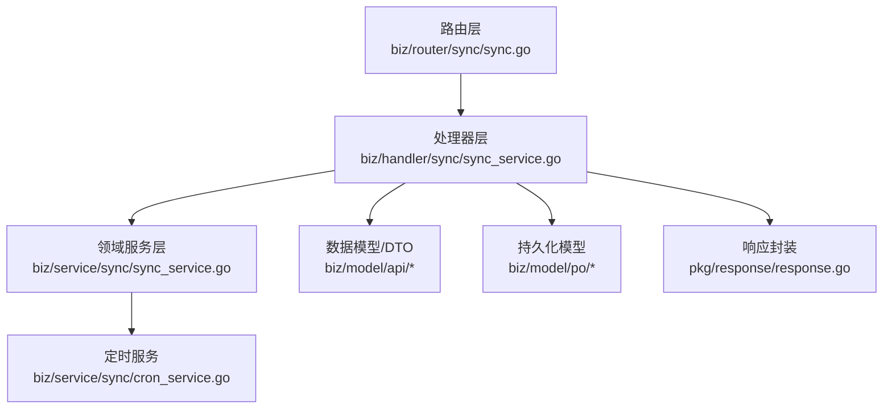
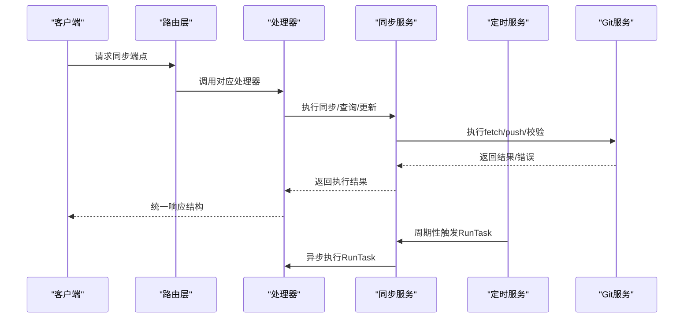
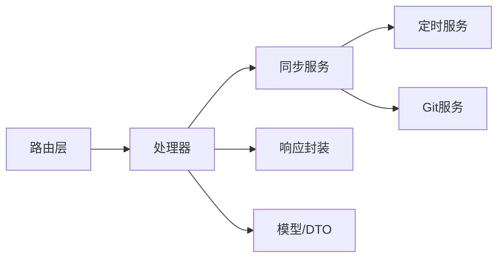

# 同步服务API

<cite>
**本文引用的文件**
- [biz/handler/sync/sync_service.go](file://biz/handler/sync/sync_service.go)
- [biz/router/sync/sync.go](file://biz/router/sync/sync.go)
- [biz/model/api/sync.go](file://biz/model/api/sync.go)
- [biz/model/api/task.go](file://biz/model/api/task.go)
- [biz/model/po/sync_task.go](file://biz/model/po/sync_task.go)
- [biz/model/po/sync_run.go](file://biz/model/po/sync_run.go)
- [biz/service/sync/sync_service.go](file://biz/service/sync/sync_service.go)
- [biz/service/sync/cron_service.go](file://biz/service/sync/cron_service.go)
- [pkg/response/response.go](file://pkg/response/response.go)
- [idl/biz/sync.proto](file://idl/biz/sync.proto)
- [biz/middleware/webhook.go](file://biz/middleware/webhook.go)
- [public/repo_sync.html](file://public/repo_sync.html)
</cite>

## 目录
1. [简介](#简介)
2. [项目结构](#项目结构)
3. [核心组件](#核心组件)
4. [架构总览](#架构总览)
5. [详细组件分析](#详细组件分析)
6. [依赖关系分析](#依赖关系分析)
7. [性能与可靠性](#性能与可靠性)
8. [故障排查指南](#故障排查指南)
9. [结论](#结论)
10. [附录：API参考](#附录api参考)

## 简介
本文件为“同步服务API”的权威接口文档，覆盖同步任务的创建、查询、执行、历史查询与删除等能力，并对定时同步、手动触发、Webhook触发等不同触发方式进行说明。同时给出请求/响应数据模型（SyncTaskDTO、SyncRunDTO）以及同步选项配置、推送选项、错误重试机制等高级功能的使用指南。

## 项目结构
同步服务API由路由注册、处理器、领域服务、数据模型与响应封装组成，整体采用分层设计：
- 路由层：在统一前缀下注册各端点
- 处理器层：解析请求、调用服务、返回标准响应
- 领域服务层：封装同步逻辑、定时调度、Git操作
- 数据模型层：PO/DTO映射、请求/响应结构体
- 响应封装：统一返回结构与状态码语义

图表来源
- [biz/router/sync/sync.go](file://biz/router/sync/sync.go#L17-L39)
- [biz/handler/sync/sync_service.go](file://biz/handler/sync/sync_service.go#L19-L258)
- [biz/service/sync/sync_service.go](file://biz/service/sync/sync_service.go#L13-L263)
- [biz/service/sync/cron_service.go](file://biz/service/sync/cron_service.go#L14-L101)
- [pkg/response/response.go](file://pkg/response/response.go#L9-L87)

章节来源
- [biz/router/sync/sync.go](file://biz/router/sync/sync.go#L17-L39)
- [biz/handler/sync/sync_service.go](file://biz/handler/sync/sync_service.go#L19-L258)
- [pkg/response/response.go](file://pkg/response/response.go#L9-L87)

## 核心组件
- 路由注册：按版本前缀注册所有同步相关端点
- 处理器：负责参数绑定与校验、DAO调用、审计日志、异步执行与响应
- 领域服务：封装同步执行流程（抓取源/目标、快进检查、推送）、生成执行记录
- 定时服务：基于Cron表达式调度任务
- 数据模型：请求/响应结构体与DTO映射
- 响应封装：统一返回结构，含业务状态码、消息与数据

章节来源
- [biz/handler/sync/sync_service.go](file://biz/handler/sync/sync_service.go#L19-L258)
- [biz/service/sync/sync_service.go](file://biz/service/sync/sync_service.go#L13-L263)
- [biz/service/sync/cron_service.go](file://biz/service/sync/cron_service.go#L14-L101)
- [pkg/response/response.go](file://pkg/response/response.go#L9-L87)

## 架构总览
同步服务API通过Hertz框架暴露REST端点，处理器将请求转交给领域服务执行具体同步逻辑；定时服务根据任务配置周期性触发；Webhook中间件用于外部系统安全地触发同步。

图表来源
- [biz/router/sync/sync.go](file://biz/router/sync/sync.go#L17-L39)
- [biz/handler/sync/sync_service.go](file://biz/handler/sync/sync_service.go#L147-L200)
- [biz/service/sync/sync_service.go](file://biz/service/sync/sync_service.go#L27-L74)
- [biz/service/sync/cron_service.go](file://biz/service/sync/cron_service.go#L84-L100)

## 详细组件分析

### 同步任务创建 /api/v1/sync/task/create
- 方法与路径
  - 方法：POST
  - 路径：/api/v1/sync/task/create
- 请求体参数
  - 字段：source_repo_key、source_remote、source_branch、target_repo_key、target_remote、target_branch、push_options、cron、enabled
  - 类型：字符串/布尔
  - 必填：除cron与enabled外，其余建议必填
- 响应
  - 成功：返回SyncTaskDTO
  - 失败：参数错误/内部错误
- 处理流程
  - 绑定并校验请求体
  - 生成唯一任务Key
  - 持久化任务
  - 更新定时服务
  - 记录审计日志
- 示例
  - 请求示例（字段名与含义见“附录：API参考”）
  - 响应示例（SyncTaskDTO）

章节来源
- [biz/handler/sync/sync_service.go](file://biz/handler/sync/sync_service.go#L62-L81)
- [biz/model/api/task.go](file://biz/model/api/task.go#L115-L126)
- [biz/model/po/sync_task.go](file://biz/model/po/sync_task.go#L8-L24)
- [biz/service/sync/cron_service.go](file://biz/service/sync/cron_service.go#L59-L72)
- [pkg/response/response.go](file://pkg/response/response.go#L58-L71)

### 同步任务查询 /api/v1/sync/tasks
- 方法与路径
  - 方法：GET
  - 路径：/api/v1/sync/tasks
- 查询参数
  - repo_key：仓库标识，可选
- 响应
  - 成功：返回SyncTaskDTO数组
  - 失败：内部错误
- 处理流程
  - 若提供repo_key：按仓库查询任务
  - 否则：查询全部任务并关联仓库信息
- 示例
  - 响应示例（数组形式的SyncTaskDTO）

章节来源
- [biz/handler/sync/sync_service.go](file://biz/handler/sync/sync_service.go#L19-L43)
- [biz/model/api/task.go](file://biz/model/api/task.go#L22-L39)
- [biz/model/po/sync_task.go](file://biz/model/po/sync_task.go#L8-L24)

### 单个任务详情 /api/v1/sync/task
- 方法与路径
  - 方法：GET
  - 路径：/api/v1/sync/task
- 查询参数
  - key：任务Key，必填
- 响应
  - 成功：返回SyncTaskDTO
  - 失败：资源不存在
- 示例
  - 响应示例（单个SyncTaskDTO）

章节来源
- [biz/handler/sync/sync_service.go](file://biz/handler/sync/sync_service.go#L45-L60)
- [pkg/response/response.go](file://pkg/response/response.go#L63-L66)

### 更新任务 /api/v1/sync/task/update
- 方法与路径
  - 方法：POST
  - 路径：/api/v1/sync/task/update
- 请求体参数
  - key（必填）与其他任务字段
- 响应
  - 成功：返回SyncTaskDTO
  - 失败：参数错误/资源不存在/内部错误
- 处理流程
  - 根据key查找任务
  - 更新字段后持久化
  - 更新定时服务
  - 记录审计日志
- 示例
  - 请求示例（包含key与待更新字段）
  - 响应示例（更新后的SyncTaskDTO）

章节来源
- [biz/handler/sync/sync_service.go](file://biz/handler/sync/sync_service.go#L83-L120)
- [pkg/response/response.go](file://pkg/response/response.go#L58-L71)

### 删除任务 /api/v1/sync/task/delete
- 方法与路径
  - 方法：POST
  - 路径：/api/v1/sync/task/delete
- 请求体参数
  - key：任务Key，必填
- 响应
  - 成功：返回{"message":"deleted"}
  - 失败：资源不存在/内部错误
- 处理流程
  - 查找任务并删除
  - 从定时服务移除
  - 记录审计日志
- 示例
  - 请求示例（仅key）
  - 响应示例（删除成功）

章节来源
- [biz/handler/sync/sync_service.go](file://biz/handler/sync/sync_service.go#L122-L145)
- [pkg/response/response.go](file://pkg/response/response.go#L63-L71)

### 手动触发同步 /api/v1/sync/run
- 方法与路径
  - 方法：POST
  - 路径：/api/v1/sync/run
- 请求体参数
  - task_key：任务Key，必填
- 响应
  - 成功：返回{"status":"started"}（异步启动）
  - 失败：参数错误/内部错误
- 处理流程
  - 绑定并校验请求体
  - 异步调用RunTask执行
  - 记录审计日志
- 示例
  - 请求示例（task_key）
  - 响应示例（异步启动）

章节来源
- [biz/handler/sync/sync_service.go](file://biz/handler/sync/sync_service.go#L147-L163)
- [biz/service/sync/sync_service.go](file://biz/service/sync/sync_service.go#L27-L33)
- [pkg/response/response.go](file://pkg/response/response.go#L58-L71)

### 临时执行同步 /api/v1/sync/execute
- 方法与路径
  - 方法：POST
  - 路径：/api/v1/sync/execute
- 请求体参数
  - repo_key、source_remote、source_branch、target_remote、target_branch、push_options
- 响应
  - 成功：返回{"status":"started","task_key": "..."}
  - 失败：资源不存在/内部错误
- 处理流程
  - 校验并绑定请求体
  - 以临时任务形式执行同步
  - 记录审计日志
- 示例
  - 请求示例（完整字段）
  - 响应示例（包含临时任务Key）

章节来源
- [biz/handler/sync/sync_service.go](file://biz/handler/sync/sync_service.go#L165-L200)
- [biz/service/sync/sync_service.go](file://biz/service/sync/sync_service.go#L35-L74)
- [pkg/response/response.go](file://pkg/response/response.go#L63-L71)

### 同步历史查询 /api/v1/sync/history
- 方法与路径
  - 方法：GET
  - 路径：/api/v1/sync/history
- 查询参数
  - repo_key：仓库标识，可选
  - task_key：任务标识，可选
  - limit：限制条数，可选
- 响应
  - 成功：返回SyncRunDTO数组
  - 失败：内部错误
- 处理流程
  - 若提供repo_key：查询该仓库关联任务的历史
  - 否则：查询最新若干条
- 示例
  - 响应示例（数组形式的SyncRunDTO）

章节来源
- [biz/handler/sync/sync_service.go](file://biz/handler/sync/sync_service.go#L202-L233)
- [biz/model/api/sync.go](file://biz/model/api/sync.go#L9-L21)
- [biz/model/po/sync_run.go](file://biz/model/po/sync_run.go#L9-L21)

### 删除历史 /api/v1/sync/history/delete
- 方法与路径
  - 方法：POST
  - 路径：/api/v1/sync/history/delete
- 请求体参数
  - id：历史记录ID，必填
- 响应
  - 成功：返回{"message":"deleted"}
  - 失败：参数错误/内部错误
- 处理流程
  - 支持请求体与查询参数两种传参方式
  - 删除历史记录
- 示例
  - 请求示例（id）
  - 响应示例（删除成功）

章节来源
- [biz/handler/sync/sync_service.go](file://biz/handler/sync/sync_service.go#L235-L257)
- [pkg/response/response.go](file://pkg/response/response.go#L58-L71)

### Webhook触发（概念说明）
- 触发方式
  - 外部系统通过签名验证的HTTP请求触发同步
- 安全机制
  - IP白名单、速率限制、HMAC SHA256签名验证
- 使用场景
  - 源仓库变更通知后自动触发同步
- 示例
  - 参考前端页面中的Webhook链接构造与curl示例

章节来源
- [biz/middleware/webhook.go](file://biz/middleware/webhook.go#L18-L68)
- [public/repo_sync.html](file://public/repo_sync.html#L297-L305)

## 依赖关系分析
- 路由到处理器：路由层将URL映射到具体处理器函数
- 处理器到服务：处理器调用领域服务执行业务逻辑
- 服务到DAO：服务层通过DAO访问数据库
- 服务到Git：服务层调用Git服务执行fetch/push等操作
- 响应封装：统一输出结构，便于客户端解析

图表来源
- [biz/router/sync/sync.go](file://biz/router/sync/sync.go#L17-L39)
- [biz/handler/sync/sync_service.go](file://biz/handler/sync/sync_service.go#L147-L200)
- [biz/service/sync/sync_service.go](file://biz/service/sync/sync_service.go#L13-L263)
- [pkg/response/response.go](file://pkg/response/response.go#L9-L87)

章节来源
- [biz/router/sync/sync.go](file://biz/router/sync/sync.go#L17-L39)
- [biz/handler/sync/sync_service.go](file://biz/handler/sync/sync_service.go#L147-L200)
- [biz/service/sync/sync_service.go](file://biz/service/sync/sync_service.go#L13-L263)
- [pkg/response/response.go](file://pkg/response/response.go#L9-L87)

## 性能与可靠性
- 异步执行
  - 手动触发与临时执行均在后台协程中执行，避免阻塞请求线程
- 日志与可观测性
  - 执行过程记录命令与详细日志，便于排障
- 错误分类
  - 成功、失败、冲突三种状态，冲突场景明确区分
- 定时调度
  - 基于Cron表达式，支持动态增删改任务
- 推送选项
  - 支持传递git push选项（如强制推送、跳过钩子等），需谨慎使用

章节来源
- [biz/handler/sync/sync_service.go](file://biz/handler/sync/sync_service.go#L147-L200)
- [biz/service/sync/sync_service.go](file://biz/service/sync/sync_service.go#L35-L74)
- [biz/service/sync/cron_service.go](file://biz/service/sync/cron_service.go#L59-L72)

## 故障排查指南
- 常见错误与处理
  - 参数错误：检查请求体字段是否正确绑定与校验
  - 资源不存在：确认任务/仓库是否存在
  - 内部错误：查看服务端日志与执行详情
- 冲突与失败
  - 冲突：通常由于非快进或分支分歧导致
  - 失败：查看SyncRunDTO中的错误信息与执行日志
- 定时任务未触发
  - 检查任务是否启用且cron表达式有效
  - 查看定时服务日志
- Webhook触发失败
  - 核对签名算法、密钥与请求头
  - 检查IP白名单与速率限制

章节来源
- [pkg/response/response.go](file://pkg/response/response.go#L58-L86)
- [biz/service/sync/sync_service.go](file://biz/service/sync/sync_service.go#L58-L73)
- [biz/service/sync/cron_service.go](file://biz/service/sync/cron_service.go#L84-L100)
- [biz/middleware/webhook.go](file://biz/middleware/webhook.go#L18-L68)

## 结论
同步服务API提供了完善的任务生命周期管理与多种触发方式，结合定时调度与Webhook能力，能够满足多样化的同步需求。通过统一的响应结构与清晰的数据模型，客户端可以稳定地集成与扩展。

## 附录：API参考

### 数据模型

- SyncTaskDTO
  - 字段：id、key、source_repo_key、source_remote、source_branch、target_repo_key、target_remote、target_branch、push_options、cron、enabled、created_at、updated_at、source_repo、target_repo
  - 关联：source_repo、target_repo（RepoDTO）
  - 来源：NewSyncTaskDTO映射

- SyncRunDTO
  - 字段：id、task_key、status、commit_range、error_message、details、start_time、end_time、created_at、updated_at、task
  - 关联：task（SyncTaskDTO）
  - 来源：NewSyncRunDTO映射

- 请求体结构
  - RunSyncReq：task_key
  - ExecuteSyncReq：repo_key、source_remote、source_branch、target_remote、target_branch、push_options

章节来源
- [biz/model/api/task.go](file://biz/model/api/task.go#L22-L66)
- [biz/model/api/sync.go](file://biz/model/api/sync.go#L9-L41)
- [biz/model/po/sync_task.go](file://biz/model/po/sync_task.go#L8-L24)
- [biz/model/po/sync_run.go](file://biz/model/po/sync_run.go#L9-L21)

### API端点一览

- 同步任务创建
  - 方法：POST
  - 路径：/api/v1/sync/task/create
  - 请求体：source_repo_key、source_remote、source_branch、target_repo_key、target_remote、target_branch、push_options、cron、enabled
  - 响应：SyncTaskDTO

- 同步任务查询
  - 方法：GET
  - 路径：/api/v1/sync/tasks
  - 查询：repo_key
  - 响应：[]SyncTaskDTO

- 单个任务详情
  - 方法：GET
  - 路径：/api/v1/sync/task
  - 查询：key
  - 响应：SyncTaskDTO

- 更新任务
  - 方法：POST
  - 路径：/api/v1/sync/task/update
  - 请求体：key（必填）+ 其他任务字段
  - 响应：SyncTaskDTO

- 删除任务
  - 方法：POST
  - 路径：/api/v1/sync/task/delete
  - 请求体：key
  - 响应：{"message":"deleted"}

- 手动触发同步
  - 方法：POST
  - 路径：/api/v1/sync/run
  - 请求体：task_key
  - 响应：{"status":"started"}

- 临时执行同步
  - 方法：POST
  - 路径：/api/v1/sync/execute
  - 请求体：repo_key、source_remote、source_branch、target_remote、target_branch、push_options
  - 响应：{"status":"started","task_key": "..."}

- 同步历史查询
  - 方法：GET
  - 路径：/api/v1/sync/history
  - 查询：repo_key、task_key、limit
  - 响应：[]SyncRunDTO

- 删除历史
  - 方法：POST
  - 路径：/api/v1/sync/history/delete
  - 请求体：id
  - 响应：{"message":"deleted"}

章节来源
- [idl/biz/sync.proto](file://idl/biz/sync.proto#L12-L57)
- [biz/router/sync/sync.go](file://biz/router/sync/sync.go#L17-L39)
- [biz/handler/sync/sync_service.go](file://biz/handler/sync/sync_service.go#L19-L258)

### 触发方式与配置

- 定时同步
  - 在任务中设置cron表达式与enabled开关
  - 定时服务会周期性触发RunTask

- 手动触发
  - 调用/run端点传入task_key即可立即执行

- Webhook触发
  - 外部系统通过带签名的HTTP请求触发
  - 中间件进行IP白名单、速率限制与HMAC验证

章节来源
- [biz/service/sync/cron_service.go](file://biz/service/sync/cron_service.go#L59-L72)
- [biz/handler/sync/sync_service.go](file://biz/handler/sync/sync_service.go#L147-L163)
- [biz/middleware/webhook.go](file://biz/middleware/webhook.go#L18-L68)

### 错误与状态码语义
- 统一响应结构：包含业务状态码、消息与可选错误详情
- 常见状态：
  - 成功：0
  - 参数错误：业务错误码（如参数非法）
  - 资源不存在：业务错误码（如任务不存在）
  - 冲突：业务错误码（如非快进/分支分歧）
  - 服务器内部错误：业务错误码（如数据库异常）

章节来源
- [pkg/response/response.go](file://pkg/response/response.go#L9-L87)
- [biz/service/sync/sync_service.go](file://biz/service/sync/sync_service.go#L58-L73)