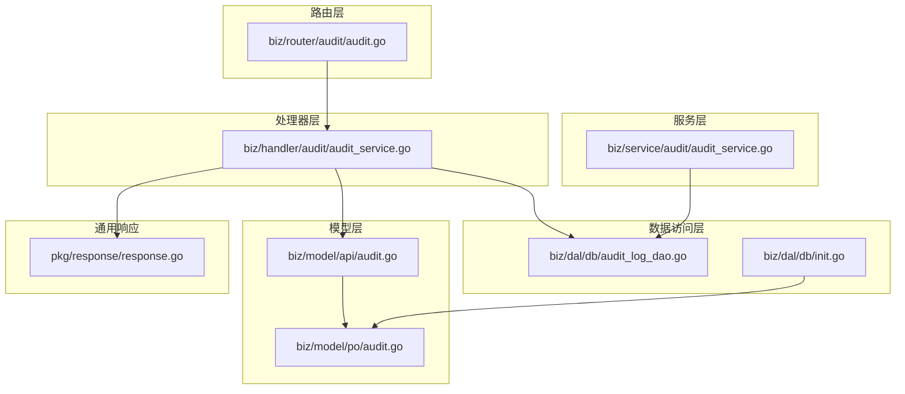
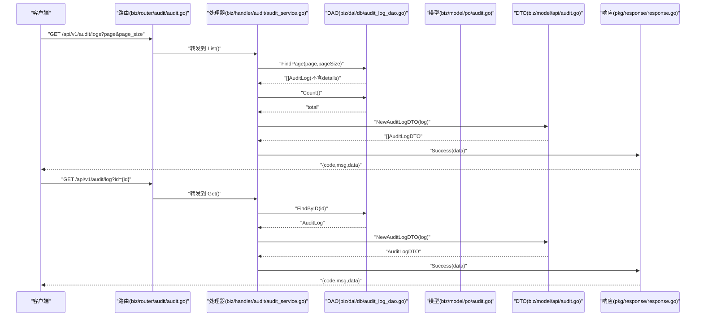
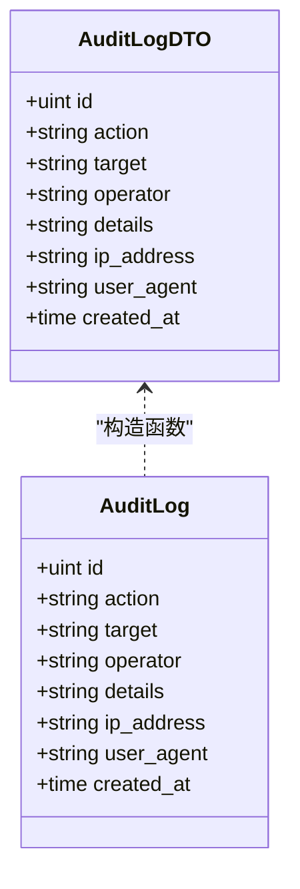
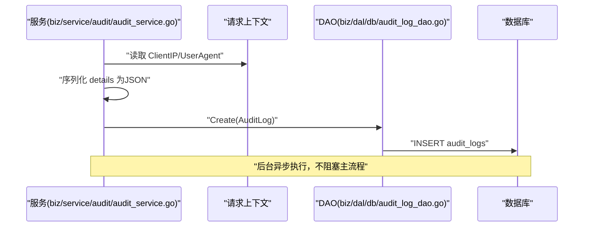
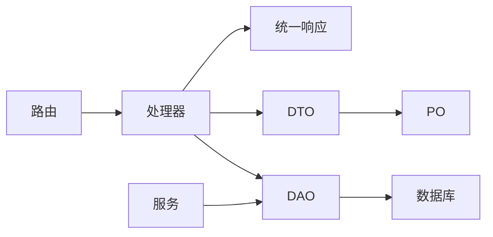

# 审计日志API

<cite>
**本文引用的文件**
- [biz/router/audit/audit.go](file://biz/router/audit/audit.go)
- [biz/handler/audit/audit_service.go](file://biz/handler/audit/audit_service.go)
- [biz/model/api/audit.go](file://biz/model/api/audit.go)
- [biz/model/po/audit.go](file://biz/model/po/audit.go)
- [biz/dal/db/audit_log_dao.go](file://biz/dal/db/audit_log_dao.go)
- [biz/dal/db/init.go](file://biz/dal/db/init.go)
- [pkg/response/response.go](file://pkg/response/response.go)
- [biz/service/audit/audit_service.go](file://biz/service/audit/audit_service.go)
- [conf/config.yaml](file://conf/config.yaml)
- [public/audit.html](file://public/audit.html)
</cite>

## 目录
1. [简介](#简介)
2. [项目结构](#项目结构)
3. [核心组件](#核心组件)
4. [架构总览](#架构总览)
5. [详细组件分析](#详细组件分析)
6. [依赖关系分析](#依赖关系分析)
7. [性能考量](#性能考量)
8. [故障排查指南](#故障排查指南)
9. [结论](#结论)
10. [附录](#附录)

## 简介
本文件为审计日志API的详细接口文档，覆盖以下端点与能力：
- 审计日志列表查询：GET /api/v1/audit/logs
- 审计日志详情查询：GET /api/v1/audit/log（通过查询参数 id 获取）

文档内容包括：
- 请求与响应结构
- 查询参数与分页机制
- 状态码与错误处理
- 数据模型 AuditLogDTO 的字段说明
- 存储策略、保留期限与隐私保护建议

## 项目结构
审计日志API由路由层、处理器层、服务层、数据访问层与模型层组成，遵循清晰的分层职责划分。

图表来源
- [biz/router/audit/audit.go](file://biz/router/audit/audit.go#L17-L30)
- [biz/handler/audit/audit_service.go](file://biz/handler/audit/audit_service.go#L16-L76)
- [biz/service/audit/audit_service.go](file://biz/service/audit/audit_service.go#L17-L50)
- [biz/dal/db/audit_log_dao.go](file://biz/dal/db/audit_log_dao.go#L29-L45)
- [biz/dal/db/init.go](file://biz/dal/db/init.go#L54-L71)
- [biz/model/api/audit.go](file://biz/model/api/audit.go#L9-L31)
- [biz/model/po/audit.go](file://biz/model/po/audit.go#L7-L20)
- [pkg/response/response.go](file://pkg/response/response.go#L9-L86)

章节来源
- [biz/router/audit/audit.go](file://biz/router/audit/audit.go#L17-L30)
- [biz/handler/audit/audit_service.go](file://biz/handler/audit/audit_service.go#L16-L76)
- [biz/dal/db/audit_log_dao.go](file://biz/dal/db/audit_log_dao.go#L29-L45)
- [biz/model/api/audit.go](file://biz/model/api/audit.go#L9-L31)
- [biz/model/po/audit.go](file://biz/model/po/audit.go#L7-L20)
- [biz/dal/db/init.go](file://biz/dal/db/init.go#L54-L71)
- [pkg/response/response.go](file://pkg/response/response.go#L9-L86)

## 核心组件
- 路由注册：在路由层注册审计模块的 GET /api/v1/audit/logs 与 GET /api/v1/audit/log 两个端点。
- 处理器：负责解析查询参数、调用DAO进行数据读取、组装响应。
- 数据访问层：提供分页查询、总数统计、按ID查询等方法，并对列表查询排除 details 字段以优化性能。
- 模型层：PO/AuditLog 定义持久化字段；API/AuditLogDTO 提供对外传输结构。
- 通用响应：统一返回结构与错误码映射。

章节来源
- [biz/router/audit/audit.go](file://biz/router/audit/audit.go#L17-L30)
- [biz/handler/audit/audit_service.go](file://biz/handler/audit/audit_service.go#L16-L76)
- [biz/dal/db/audit_log_dao.go](file://biz/dal/db/audit_log_dao.go#L29-L45)
- [biz/model/api/audit.go](file://biz/model/api/audit.go#L9-L31)
- [biz/model/po/audit.go](file://biz/model/po/audit.go#L7-L20)
- [pkg/response/response.go](file://pkg/response/response.go#L9-L86)

## 架构总览
审计日志API的调用链路如下：

图表来源
- [biz/router/audit/audit.go](file://biz/router/audit/audit.go#L26-L27)
- [biz/handler/audit/audit_service.go](file://biz/handler/audit/audit_service.go#L18-L52)
- [biz/handler/audit/audit_service.go](file://biz/handler/audit/audit_service.go#L56-L76)
- [biz/dal/db/audit_log_dao.go](file://biz/dal/db/audit_log_dao.go#L29-L45)
- [biz/model/api/audit.go](file://biz/model/api/audit.go#L20-L31)
- [pkg/response/response.go](file://pkg/response/response.go#L17-L71)

## 详细组件分析

### 接口一：审计日志列表查询
- HTTP 方法：GET
- URL 模式：/api/v1/audit/logs
- 功能：分页列出审计日志，不包含 details 字段，提升列表查询性能。
- 查询参数
  - page：页码，整数，默认 1，最小 1
  - page_size：每页条数，默认 20，最小 1
- 响应数据结构
  - items：AuditLogDTO 数组（不含 details）
  - total：总数
  - page：当前页
  - size：每页大小
- 状态码
  - 200 OK：成功
  - 500 服务器内部错误：DAO 查询异常时返回
- 错误处理
  - DAO 查询失败：返回统一错误响应，code 非 0，包含 msg 与 error 字段
- 请求示例
  - GET /api/v1/audit/logs?page=1&page_size=20
- 响应示例
  - {
      "code": 0,
      "msg": "success",
      "data": {
        "items": [
          {
            "id": 1,
            "action": "CREATE",
            "target": "repo:1",
            "operator": "system",
            "ip_address": "127.0.0.1",
            "user_agent": "Mozilla/5.0...",
            "created_at": "2025-01-01T00:00:00Z"
          }
        ],
        "total": 123,
        "page": 1,
        "size": 20
      }
    }

章节来源
- [biz/router/audit/audit.go](file://biz/router/audit/audit.go#L27)
- [biz/handler/audit/audit_service.go](file://biz/handler/audit/audit_service.go#L18-L52)
- [biz/dal/db/audit_log_dao.go](file://biz/dal/db/audit_log_dao.go#L29-L39)
- [pkg/response/response.go](file://pkg/response/response.go#L68-L71)

### 接口二：审计日志详情查询
- HTTP 方法：GET
- URL 模式：/api/v1/audit/log
- 功能：根据 id 查询单条审计日志详情（包含 details 字段）。
- 查询参数
  - id：日志ID，必填且必须为有效整数
- 响应数据结构
  - AuditLogDTO：包含 details 字段
- 状态码
  - 200 OK：成功
  - 400 参数错误：id 缺失或无效
  - 404 资源不存在：未找到对应ID的日志
  - 500 服务器内部错误：DAO 查询异常时返回
- 错误处理
  - id 缺失：返回参数错误
  - id 无效：返回参数错误
  - 未找到：返回资源不存在
  - DAO 查询异常：返回统一错误响应
- 请求示例
  - GET /api/v1/audit/log?id=123
- 响应示例
  - {
      "code": 0,
      "msg": "success",
      "data": {
        "id": 123,
        "action": "UPDATE",
        "target": "task:abc",
        "operator": "system",
        "details": "{\"before\": {...}, \"after\": {...}}",
        "ip_address": "127.0.0.1",
        "user_agent": "Mozilla/5.0...",
        "created_at": "2025-01-01T00:00:00Z"
      }
    }

章节来源
- [biz/router/audit/audit.go](file://biz/router/audit/audit.go#L26)
- [biz/handler/audit/audit_service.go](file://biz/handler/audit/audit_service.go#L56-L76)
- [biz/dal/db/audit_log_dao.go](file://biz/dal/db/audit_log_dao.go#L41-L45)
- [pkg/response/response.go](file://pkg/response/response.go#L58-L71)

### 数据模型：AuditLogDTO
- 字段说明
  - id：日志ID
  - action：操作类型（如 CREATE、UPDATE、DELETE、SYNC 等）
  - target：目标标识（如 repo:1、task:abc 等）
  - operator：操作者（当前为 system，待鉴权后替换为真实用户）
  - details：操作详情（JSON 字符串），列表接口不返回该字段
  - ip_address：客户端IP
  - user_agent：客户端UA
  - created_at：创建时间
- 映射关系
  - API 层 DTO 由 PO 层 AuditLog 构造生成

图表来源
- [biz/model/po/audit.go](file://biz/model/po/audit.go#L7-L20)
- [biz/model/api/audit.go](file://biz/model/api/audit.go#L9-L31)

章节来源
- [biz/model/api/audit.go](file://biz/model/api/audit.go#L9-L31)
- [biz/model/po/audit.go](file://biz/model/po/audit.go#L7-L20)

### 审计日志写入流程（扩展能力）
- 位置：服务层 AuditService.Log
- 流程要点
  - 从请求上下文提取客户端IP与User-Agent
  - 将 details 序列化为JSON字符串
  - 构造 AuditLog 对象并异步写入数据库（后台goroutine）
- 注意事项
  - 当前 operator 固定为 system，待鉴权后替换
  - 异步写入避免阻塞主流程，但可能带来丢失风险；可根据合规要求调整为同步

图表来源
- [biz/service/audit/audit_service.go](file://biz/service/audit/audit_service.go#L24-L50)
- [biz/dal/db/audit_log_dao.go](file://biz/dal/db/audit_log_dao.go#L13-L15)

章节来源
- [biz/service/audit/audit_service.go](file://biz/service/audit/audit_service.go#L24-L50)
- [biz/dal/db/audit_log_dao.go](file://biz/dal/db/audit_log_dao.go#L13-L15)

## 依赖关系分析
- 路由层依赖处理器层
- 处理器层依赖DAO层与DTO构造
- DAO层依赖GORM连接与PO模型
- 服务层可独立于HTTP层使用，便于单元测试与复用
- 统一响应封装了错误码转换与标准结构

图表来源
- [biz/router/audit/audit.go](file://biz/router/audit/audit.go#L17-L30)
- [biz/handler/audit/audit_service.go](file://biz/handler/audit/audit_service.go#L18-L52)
- [biz/dal/db/audit_log_dao.go](file://biz/dal/db/audit_log_dao.go#L29-L45)
- [biz/model/api/audit.go](file://biz/model/api/audit.go#L20-L31)
- [pkg/response/response.go](file://pkg/response/response.go#L17-L71)

章节来源
- [biz/router/audit/audit.go](file://biz/router/audit/audit.go#L17-L30)
- [biz/handler/audit/audit_service.go](file://biz/handler/audit/audit_service.go#L18-L52)
- [biz/dal/db/audit_log_dao.go](file://biz/dal/db/audit_log_dao.go#L29-L45)
- [biz/model/api/audit.go](file://biz/model/api/audit.go#L20-L31)
- [pkg/response/response.go](file://pkg/response/response.go#L17-L71)

## 性能考量
- 列表查询排除 details 字段，减少网络与序列化开销
- 使用分页查询，避免一次性加载大量数据
- 建议在 action 与 target 字段建立索引，以支持常见过滤场景
- 若日志量极大，可考虑引入归档策略与冷热分离

## 故障排查指南
- 400 参数错误
  - 现象：请求缺少 id 或 id 不是有效整数
  - 处理：检查查询参数 id 是否传入且为正整数
- 404 资源不存在
  - 现象：根据 id 无法查到对应审计日志
  - 处理：确认日志ID是否正确，或检查数据库中是否存在该记录
- 500 服务器内部错误
  - 现象：DAO 查询异常
  - 处理：查看服务日志中的错误堆栈，检查数据库连接与迁移状态

章节来源
- [pkg/response/response.go](file://pkg/response/response.go#L58-L71)
- [biz/handler/audit/audit_service.go](file://biz/handler/audit/audit_service.go#L30-L33)
- [biz/handler/audit/audit_service.go](file://biz/handler/audit/audit_service.go#L64-L72)

## 结论
本接口文档明确了审计日志API的端点、参数、响应与错误处理规范，并提供了数据模型与调用链路图示。当前实现支持分页列表与详情查询，列表接口已针对性能进行优化。后续可在鉴权完善后增强 operator 字段与权限控制，并结合业务需求制定日志保留与归档策略。

## 附录

### 数据库初始化与表结构
- 初始化逻辑会自动迁移 audit_logs 表
- 表名固定为 audit_logs
- 建议在生产环境启用索引以优化查询

章节来源
- [biz/dal/db/init.go](file://biz/dal/db/init.go#L54-L71)
- [biz/model/po/audit.go](file://biz/model/po/audit.go#L18-L20)

### 配置参考
- 数据库类型与路径/DSN 可在配置文件中设置
- 默认使用 sqlite，路径为 git_sync.db

章节来源
- [conf/config.yaml](file://conf/config.yaml#L7-L19)

### 前端集成参考
- 审计页面通过脚本加载日志列表与分页控件
- 页面包含“刷新”按钮与分页导航

章节来源
- [public/audit.html](file://public/audit.html#L14-L56)