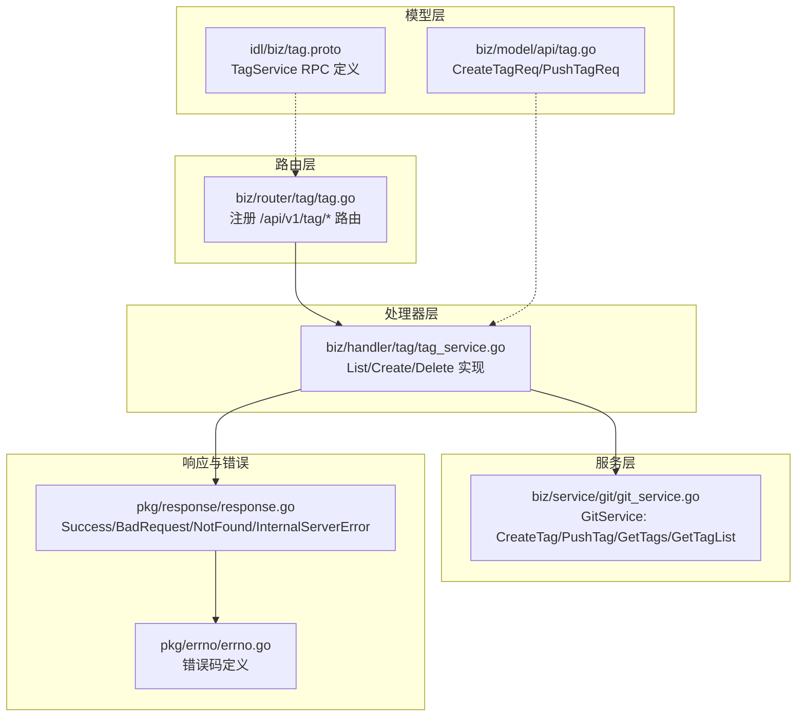
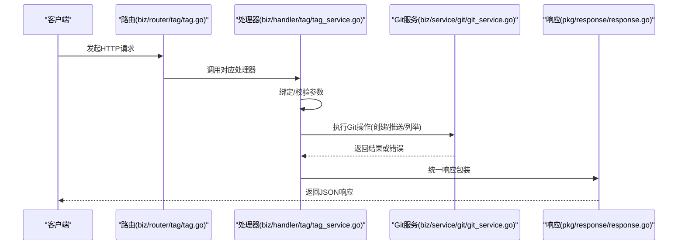
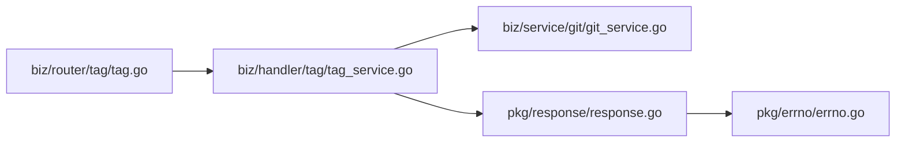

# 标签管理API

<cite>
**本文档引用的文件**
- [biz/router/tag/tag.go](file://biz/router/tag/tag.go)
- [biz/handler/tag/tag_service.go](file://biz/handler/tag/tag_service.go)
- [biz/service/git/git_service.go](file://biz/service/git/git_service.go)
- [biz/model/api/tag.go](file://biz/model/api/tag.go)
- [idl/biz/tag.proto](file://idl/biz/tag.proto)
- [pkg/response/response.go](file://pkg/response/response.go)
- [pkg/errno/errno.go](file://pkg/errno/errno.go)
- [public/branches.html](file://public/branches.html)
</cite>

## 目录
1. [简介](#简介)
2. [项目结构](#项目结构)
3. [核心组件](#核心组件)
4. [架构总览](#架构总览)
5. [详细组件分析](#详细组件分析)
6. [依赖关系分析](#依赖关系分析)
7. [性能考量](#性能考量)
8. [故障排查指南](#故障排查指南)
9. [结论](#结论)
10. [附录](#附录)

## 简介
本文件为标签管理API的详细接口文档，覆盖标签列表查询、标签创建、标签删除等核心能力。文档基于实际代码实现，明确各端点的HTTP方法、URL模式、请求参数、响应格式、状态码与错误处理，并提供基于分支或提交哈希创建标签、远程推送标签、标签信息查询等使用场景的最佳实践建议。

## 项目结构
标签管理API由路由层、处理器层、服务层与模型层组成：
- 路由层：在路由注册中定义REST路径与中间件
- 处理器层：解析请求、校验参数、调用服务层并返回标准响应
- 服务层：封装Git操作（创建标签、推送标签、列出标签、版本号计算等）
- 模型层：定义请求/响应数据结构与IDL契约

图表来源
- [biz/router/tag/tag.go](file://biz/router/tag/tag.go#L17-L31)
- [biz/handler/tag/tag_service.go](file://biz/handler/tag/tag_service.go#L16-L116)
- [biz/service/git/git_service.go](file://biz/service/git/git_service.go#L953-L1080)
- [biz/model/api/tag.go](file://biz/model/api/tag.go#L3-L13)
- [idl/biz/tag.proto](file://idl/biz/tag.proto#L12-L26)
- [pkg/response/response.go](file://pkg/response/response.go#L17-L86)
- [pkg/errno/errno.go](file://pkg/errno/errno.go#L92-L99)

章节来源
- [biz/router/tag/tag.go](file://biz/router/tag/tag.go#L17-L31)
- [biz/handler/tag/tag_service.go](file://biz/handler/tag/tag_service.go#L16-L116)
- [biz/service/git/git_service.go](file://biz/service/git/git_service.go#L953-L1080)
- [biz/model/api/tag.go](file://biz/model/api/tag.go#L3-L13)
- [idl/biz/tag.proto](file://idl/biz/tag.proto#L12-L26)
- [pkg/response/response.go](file://pkg/response/response.go#L17-L86)
- [pkg/errno/errno.go](file://pkg/errno/errno.go#L92-L99)

## 核心组件
- 路由注册：在路由层注册标签相关REST端点，绑定到对应处理器函数
- 处理器：负责参数绑定与校验、资源存在性检查、调用Git服务、统一响应输出
- Git服务：封装底层Git操作，包括创建标签、推送标签、列举标签、版本号计算等
- 数据模型：定义请求体结构与RPC契约，确保前后端一致

章节来源
- [biz/router/tag/tag.go](file://biz/router/tag/tag.go#L17-L31)
- [biz/handler/tag/tag_service.go](file://biz/handler/tag/tag_service.go#L16-L116)
- [biz/service/git/git_service.go](file://biz/service/git/git_service.go#L953-L1080)
- [biz/model/api/tag.go](file://biz/model/api/tag.go#L3-L13)
- [idl/biz/tag.proto](file://idl/biz/tag.proto#L12-L26)

## 架构总览
标签管理API采用分层架构，请求从路由进入，经由处理器完成参数校验与业务前置检查，再调用Git服务执行具体操作，最后通过统一响应包装返回。

图表来源
- [biz/router/tag/tag.go](file://biz/router/tag/tag.go#L17-L31)
- [biz/handler/tag/tag_service.go](file://biz/handler/tag/tag_service.go#L16-L116)
- [biz/service/git/git_service.go](file://biz/service/git/git_service.go#L953-L1080)
- [pkg/response/response.go](file://pkg/response/response.go#L17-L86)

## 详细组件分析

### 接口清单与规范
- 基础路径：/api/v1/tag
- 支持方法：GET（列表）、POST（创建）、POST（删除）
- 请求参数位置：查询参数或请求体，依据IDL注解与处理器实现
- 响应格式：统一JSON结构，包含业务状态码、消息与数据字段
- 错误处理：使用统一错误码体系，便于前端与监控系统识别

章节来源
- [idl/biz/tag.proto](file://idl/biz/tag.proto#L12-L26)
- [biz/router/tag/tag.go](file://biz/router/tag/tag.go#L17-L31)
- [pkg/response/response.go](file://pkg/response/response.go#L17-L86)
- [pkg/errno/errno.go](file://pkg/errno/errno.go#L92-L99)

### 标签列表查询
- 方法与路径：GET /api/v1/tag/list
- 查询参数：
  - repo_key: 必填，仓库唯一标识
  - page/page_size: 可选，分页参数（IDL中定义）
- 处理流程：
  - 校验repo_key是否存在
  - 通过Git服务获取标签列表
  - 返回统一响应
- 响应数据：
  - tags: 标签数组（名称、提交哈希、消息、标签者、日期等）
  - total: 总数
- 状态码：
  - 200：成功
  - 400：参数错误
  - 404：仓库不存在
  - 500：内部错误

章节来源
- [biz/handler/tag/tag_service.go](file://biz/handler/tag/tag_service.go#L16-L39)
- [idl/biz/tag.proto](file://idl/biz/tag.proto#L39-L51)
- [biz/service/git/git_service.go](file://biz/service/git/git_service.go#L1018-L1080)
- [pkg/response/response.go](file://pkg/response/response.go#L17-L86)
- [pkg/errno/errno.go](file://pkg/errno/errno.go#L31-L41)

### 标签创建
- 方法与路径：POST /api/v1/tag/create
- 请求体：
  - repo_key: 必填，仓库唯一标识
  - tag_name: 必填，标签名；支持“auto”自动递增版本
  - ref: 必填，可为分支名或提交哈希
  - message: 可选，标签消息
  - push_remote: 可选，远端名称（若指定则尝试推送）
- 处理流程：
  - 校验repo_key是否存在
  - 解析全局Git用户信息作为标签者
  - 若tag_name为“auto”，根据最近版本号自动计算下一个版本
  - 调用Git服务创建标签
  - 若指定了push_remote，尝试推送标签
  - 返回统一响应
- 响应数据：
  - 成功时返回空数据
  - 推送失败时返回状态与错误信息
- 状态码：
  - 200：成功
  - 400：参数错误
  - 404：仓库不存在
  - 500：内部错误

章节来源
- [biz/handler/tag/tag_service.go](file://biz/handler/tag/tag_service.go#L41-L94)
- [biz/model/api/tag.go](file://biz/model/api/tag.go#L3-L8)
- [biz/service/git/git_service.go](file://biz/service/git/git_service.go#L953-L980)
- [biz/service/git/git_service.go](file://biz/service/git/git_service.go#L982-L1016)
- [pkg/response/response.go](file://pkg/response/response.go#L17-L86)
- [pkg/errno/errno.go](file://pkg/errno/errno.go#L92-L99)

### 标签删除
- 方法与路径：POST /api/v1/tag/delete
- 请求体：
  - repo_key: 必填
  - tag_name: 必填
- 处理流程：
  - 校验repo_key是否存在
  - 当前实现返回“标签删除暂不支持”的错误
- 状态码：
  - 400：参数错误或功能未实现
  - 404：仓库不存在
  - 500：内部错误

章节来源
- [biz/handler/tag/tag_service.go](file://biz/handler/tag/tag_service.go#L96-L116)
- [pkg/response/response.go](file://pkg/response/response.go#L17-L86)
- [pkg/errno/errno.go](file://pkg/errno/errno.go#L92-L99)

### 数据结构与IDL契约
- CreateTagReq
  - 字段：tag_name、ref、message、push_remote
  - 用途：标签创建请求体
- PushTagReq
  - 字段：tag_name、remote
  - 用途：标签推送请求体
- TagService RPC
  - List：GET /api/v1/tag/list
  - Create：POST /api/v1/tag/create
  - Delete：POST /api/v1/tag/delete

章节来源
- [biz/model/api/tag.go](file://biz/model/api/tag.go#L3-L13)
- [idl/biz/tag.proto](file://idl/biz/tag.proto#L12-L26)

### Git服务关键方法
- CreateTag(path, tagName, ref, message, authorName, authorEmail)
  - 功能：基于ref创建轻量或附注标签
  - 输入：仓库路径、标签名、引用（分支或提交哈希）、消息、作者信息
  - 输出：错误或成功
- PushTag(path, remoteName, tagName, authType, authKey, authSecret)
  - 功能：将本地标签推送到远端
  - 输入：仓库路径、远端名、标签名、认证方式与凭据
  - 输出：错误或成功
- GetTags(path)
  - 功能：获取标签名列表
- GetTagList(path)
  - 功能：获取标签详情列表（名称、哈希、消息、标签者、日期）

章节来源
- [biz/service/git/git_service.go](file://biz/service/git/git_service.go#L953-L980)
- [biz/service/git/git_service.go](file://biz/service/git/git_service.go#L982-L1016)
- [biz/service/git/git_service.go](file://biz/service/git/git_service.go#L1018-L1080)

### 请求/响应示例（以路径代替代码）
- 创建标签请求体示例
  - 参考路径：[CreateTagReq](file://biz/model/api/tag.go#L3-L8)
- 标签列表响应示例
  - 参考路径：[TagService.List 响应结构](file://idl/biz/tag.proto#L46-L51)
- 标签详情结构
  - 参考路径：[Tag 结构](file://idl/biz/tag.proto#L29-L37)

章节来源
- [biz/model/api/tag.go](file://biz/model/api/tag.go#L3-L8)
- [idl/biz/tag.proto](file://idl/biz/tag.proto#L29-L51)

### 基于分支或提交哈希创建标签
- ref参数支持两种形式：
  - 分支名：例如“main”
  - 提交哈希：例如“a1b2c3d4”
- Git服务会解析ref为具体提交对象，再创建标签
- 自动版本号策略：
  - 当tag_name为“auto”时，系统读取最新版本并递增
  - 参考路径：[incrementVersion](file://biz/handler/tag/tag_service.go#L118-L143)

章节来源
- [biz/handler/tag/tag_service.go](file://biz/handler/tag/tag_service.go#L62-L76)
- [biz/service/git/git_service.go](file://biz/service/git/git_service.go#L1089-L1101)
- [biz/service/git/git_service.go](file://biz/service/git/git_service.go#L1110-L1161)

### 远程推送标签
- 当请求体包含push_remote时，处理器会在本地创建成功后尝试推送
- 推送失败时返回状态为“created_local_only”及错误信息
- 参考路径：[Create 处理器推送逻辑](file://biz/handler/tag/tag_service.go#L82-L91)

章节来源
- [biz/handler/tag/tag_service.go](file://biz/handler/tag/tag_service.go#L82-L91)
- [biz/service/git/git_service.go](file://biz/service/git/git_service.go#L982-L1016)

### 标签信息查询
- 列表查询：GET /api/v1/tag/list
  - 返回标签名列表或详细列表（取决于实现）
- 详情查询：通过Git服务获取标签详情
  - 参考路径：[GetTagList](file://biz/service/git/git_service.go#L1043-L1080)

章节来源
- [biz/handler/tag/tag_service.go](file://biz/handler/tag/tag_service.go#L16-L39)
- [biz/service/git/git_service.go](file://biz/service/git/git_service.go#L1043-L1080)

### 最佳实践与规范
- 标签名规范
  - 建议遵循语义化版本（SemVer）规则，例如“v1.2.3”
  - “auto”用于自动递增版本，适合CI/CD流水线
- 签名与作者信息
  - 默认使用全局Git用户信息；若未配置，将使用默认值
  - 参考路径：[GetGlobalGitUser](file://biz/service/git/git_service.go#L872-L891)
- 版本发布流程建议
  - 在合并到主分支后创建标签
  - 使用“auto”自动递增版本，减少人为错误
  - 配置push_remote以自动推送标签至远端
- 前端交互参考
  - 参考页面中的标签创建模态框与版本建议逻辑
  - 参考路径：[branches.html 标签模态框](file://public/branches.html#L169-L247)

章节来源
- [biz/service/git/git_service.go](file://biz/service/git/git_service.go#L872-L891)
- [public/branches.html](file://public/branches.html#L169-L247)

## 依赖关系分析
- 路由层依赖处理器层
- 处理器层依赖服务层与响应封装
- 服务层依赖Git库与配置
- 错误码统一由errno模块提供

图表来源
- [biz/router/tag/tag.go](file://biz/router/tag/tag.go#L17-L31)
- [biz/handler/tag/tag_service.go](file://biz/handler/tag/tag_service.go#L16-L116)
- [biz/service/git/git_service.go](file://biz/service/git/git_service.go#L953-L1080)
- [pkg/response/response.go](file://pkg/response/response.go#L17-L86)
- [pkg/errno/errno.go](file://pkg/errno/errno.go#L92-L99)

章节来源
- [biz/router/tag/tag.go](file://biz/router/tag/tag.go#L17-L31)
- [biz/handler/tag/tag_service.go](file://biz/handler/tag/tag_service.go#L16-L116)
- [biz/service/git/git_service.go](file://biz/service/git/git_service.go#L953-L1080)
- [pkg/response/response.go](file://pkg/response/response.go#L17-L86)
- [pkg/errno/errno.go](file://pkg/errno/errno.go#L92-L99)

## 性能考量
- 列表查询：标签数量较多时建议配合分页参数（page/page_size）使用
- 推送标签：网络延迟与远端认证开销较大，建议在必要时才启用push_remote
- 版本计算：自动版本号依赖最近标签描述，避免频繁切换分支导致的解析成本

## 故障排查指南
- 参数错误
  - 现象：返回400错误
  - 排查：确认repo_key、tag_name、ref等必填字段是否正确
  - 参考路径：[BadRequest](file://pkg/response/response.go#L58-L61)
- 仓库不存在
  - 现象：返回404错误
  - 排查：确认repo_key是否有效
  - 参考路径：[NotFound](file://pkg/response/response.go#L63-L66)
- 标签创建失败
  - 现象：返回500错误或推送失败提示
  - 排查：检查ref是否有效、远端认证配置、网络连通性
  - 参考路径：[CreateTag](file://biz/service/git/git_service.go#L953-L980)
- 标签删除未实现
  - 现象：返回400错误，提示“标签删除暂不支持”
  - 排查：当前版本未实现删除逻辑，需后续扩展
  - 参考路径：[Delete](file://biz/handler/tag/tag_service.go#L96-L116)

章节来源
- [pkg/response/response.go](file://pkg/response/response.go#L58-L86)
- [pkg/errno/errno.go](file://pkg/errno/errno.go#L92-L99)
- [biz/service/git/git_service.go](file://biz/service/git/git_service.go#L953-L980)
- [biz/handler/tag/tag_service.go](file://biz/handler/tag/tag_service.go#L96-L116)

## 结论
标签管理API提供了完整的标签生命周期管理能力，涵盖列表查询、创建与删除（部分实现）。通过统一的错误码与响应结构，便于集成与监控。建议在生产环境中结合语义化版本规范与自动化流水线，提升发布效率与稳定性。

## 附录
- 统一响应结构
  - 字段：code、msg、error、data
  - 参考路径：[Response](file://pkg/response/response.go#L9-L15)
- 标签相关错误码
  - 参考路径：[Tag* 错误码](file://pkg/errno/errno.go#L92-L99)