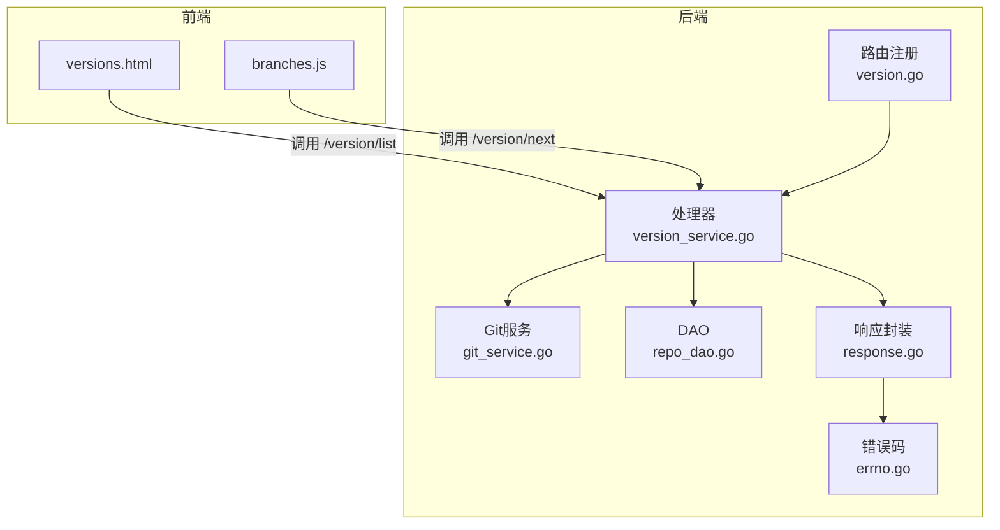
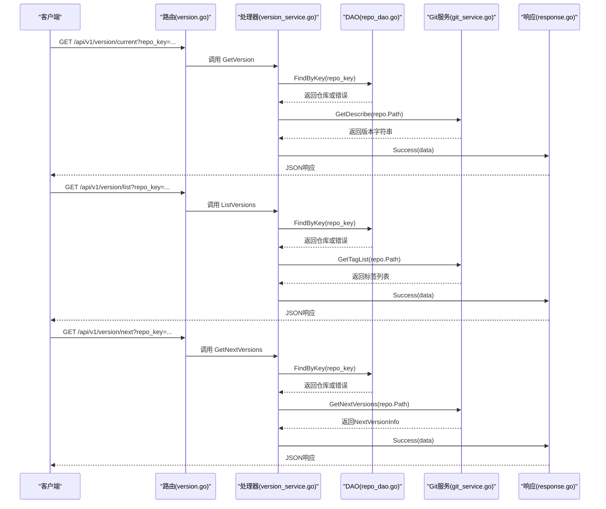
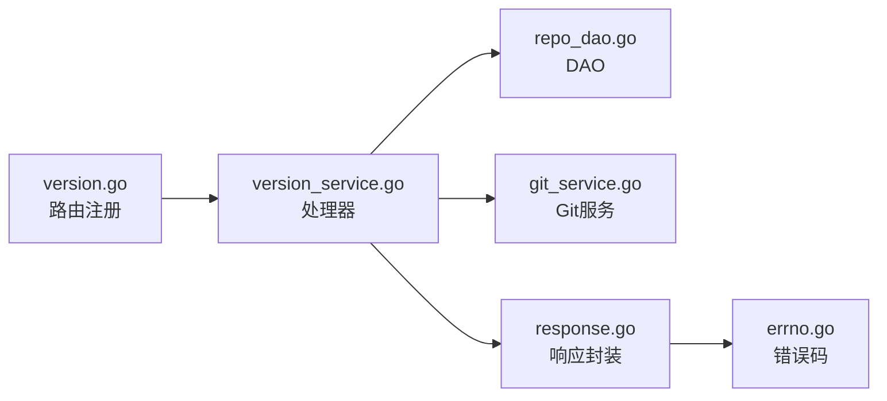

# 版本管理API

<cite>
**本文引用的文件**
- [biz/router/version/version.go](file://biz/router/version/version.go)
- [biz/handler/version/version_service.go](file://biz/handler/version/version_service.go)
- [biz/service/git/git_service.go](file://biz/service/git/git_service.go)
- [idl/biz/version.proto](file://idl/biz/version.proto)
- [pkg/response/response.go](file://pkg/response/response.go)
- [pkg/errno/errno.go](file://pkg/errno/errno.go)
- [biz/dal/db/repo_dao.go](file://biz/dal/db/repo_dao.go)
- [public/versions.html](file://public/versions.html)
- [public/js/branches.js](file://public/js/branches.js)
</cite>

## 目录
1. [简介](#简介)
2. [项目结构](#项目结构)
3. [核心组件](#核心组件)
4. [架构总览](#架构总览)
5. [详细组件分析](#详细组件分析)
6. [依赖关系分析](#依赖关系分析)
7. [性能考量](#性能考量)
8. [故障排查指南](#故障排查指南)
9. [结论](#结论)
10. [附录](#附录)

## 简介
本文件面向版本管理API，覆盖以下端点：
- 查询当前版本：GET /api/v1/version/current
- 查询版本历史：GET /api/v1/version/list
- 获取下一版本建议：GET /api/v1/version/next

文档详细说明HTTP方法、URL模式、请求参数、响应格式、状态码与错误处理，并给出基于git describe的版本字符串解析、语义化版本号生成、版本比较算法等版本管理功能的API说明。同时提供版本标签规范、发布流程自动化、版本回滚策略等开发运维实践建议。

## 项目结构
版本管理API由IDL定义、路由注册、处理器与Git服务层组成，前端页面用于展示版本历史与建议版本。

图表来源
- [biz/router/version/version.go](file://biz/router/version/version.go#L17-L31)
- [biz/handler/version/version_service.go](file://biz/handler/version/version_service.go#L14-L87)
- [biz/service/git/git_service.go](file://biz/service/git/git_service.go#L1082-L1161)
- [biz/dal/db/repo_dao.go](file://biz/dal/db/repo_dao.go#L23-L27)
- [pkg/response/response.go](file://pkg/response/response.go#L17-L87)
- [pkg/errno/errno.go](file://pkg/errno/errno.go#L33-L41)
- [public/versions.html](file://public/versions.html#L66-L103)
- [public/js/branches.js](file://public/js/branches.js#L434-L451)

章节来源
- [biz/router/version/version.go](file://biz/router/version/version.go#L17-L31)
- [biz/handler/version/version_service.go](file://biz/handler/version/version_service.go#L14-L87)
- [public/versions.html](file://public/versions.html#L55-L103)
- [public/js/branches.js](file://public/js/branches.js#L434-L451)

## 核心组件
- 路由注册：在版本命名空间下注册三个GET端点，分别对应当前版本、版本历史与下一版本建议。
- 处理器：从查询参数读取repo_key，校验仓库存在性，调用Git服务执行具体操作，统一返回标准响应。
- Git服务：封装git命令与go-git操作，实现git describe解析、标签列表获取、最新版本与下一版本计算。
- 响应与错误：统一响应结构与错误码映射，便于前端与客户端消费。

章节来源
- [biz/router/version/version.go](file://biz/router/version/version.go#L17-L31)
- [biz/handler/version/version_service.go](file://biz/handler/version/version_service.go#L14-L87)
- [biz/service/git/git_service.go](file://biz/service/git/git_service.go#L1082-L1161)
- [pkg/response/response.go](file://pkg/response/response.go#L17-L87)
- [pkg/errno/errno.go](file://pkg/errno/errno.go#L33-L41)

## 架构总览
版本管理API的调用链路如下：

图表来源
- [biz/router/version/version.go](file://biz/router/version/version.go#L25-L29)
- [biz/handler/version/version_service.go](file://biz/handler/version/version_service.go#L14-L87)
- [biz/dal/db/repo_dao.go](file://biz/dal/db/repo_dao.go#L23-L27)
- [biz/service/git/git_service.go](file://biz/service/git/git_service.go#L1082-L1161)
- [pkg/response/response.go](file://pkg/response/response.go#L17-L87)

## 详细组件分析

### 当前版本查询 /api/v1/version/current
- HTTP方法：GET
- URL模式：/api/v1/version/current
- 请求参数：
  - repo_key: 查询参数，必填
- 响应格式：
  - 成功：返回版本字符串
  - 失败：标准响应结构，包含错误码、消息与可选错误详情
- 状态码：
  - 200 OK：成功
  - 400 Bad Request：repo_key缺失
  - 404 Not Found：仓库不存在
  - 500 Internal Server Error：内部错误
- 错误处理：
  - 参数校验失败时返回400
  - 仓库不存在时返回404
  - Git命令执行失败时返回500
- 数据流：
  - 读取repo_key
  - 通过DAO按key查找仓库
  - 调用Git服务执行git describe --tags --always --long
  - 统一返回Success(data)

章节来源
- [biz/handler/version/version_service.go](file://biz/handler/version/version_service.go#L14-L37)
- [biz/service/git/git_service.go](file://biz/service/git/git_service.go#L1082-L1087)
- [pkg/response/response.go](file://pkg/response/response.go#L58-L71)
- [pkg/errno/errno.go](file://pkg/errno/errno.go#L33-L41)

### 版本历史查询 /api/v1/version/list
- HTTP方法：GET
- URL模式：/api/v1/version/list
- 请求参数：
  - repo_key: 查询参数，必填
  - page: 查询参数，可选
  - page_size: 查询参数，可选
- 响应格式：
  - 成功：返回版本数组与总数
  - 失败：标准响应结构
- 状态码：
  - 200 OK：成功
  - 400 Bad Request：repo_key缺失
  - 404 Not Found：仓库不存在
  - 500 Internal Server Error：内部错误
- 错误处理：
  - 参数校验失败时返回400
  - 仓库不存在时返回404
  - Git命令执行失败时返回500
- 数据流：
  - 读取repo_key
  - 通过DAO按key查找仓库
  - 调用Git服务获取标签列表（含注释、作者、时间等）
  - 统一返回Success(data)

章节来源
- [biz/handler/version/version_service.go](file://biz/handler/version/version_service.go#L39-L62)
- [biz/service/git/git_service.go](file://biz/service/git/git_service.go#L1043-L1080)
- [pkg/response/response.go](file://pkg/response/response.go#L58-L71)
- [pkg/errno/errno.go](file://pkg/errno/errno.go#L33-L41)

### 下一版本建议 /api/v1/version/next
- HTTP方法：GET
- URL模式：/api/v1/version/next
- 请求参数：
  - repo_key: 查询参数，必填
- 响应格式：
  - 成功：返回NextVersionInfo对象，包含current、next_major、next_minor、next_patch
  - 失败：标准响应结构
- 状态码：
  - 200 OK：成功
  - 400 Bad Request：repo_key缺失
  - 404 Not Found：仓库不存在
  - 500 Internal Server Error：内部错误
- 错误处理：
  - 参数校验失败时返回400
  - 仓库不存在时返回404
  - Git命令执行失败时返回500
- 数据流：
  - 读取repo_key
  - 通过DAO按key查找仓库
  - 调用Git服务获取最新版本（git describe --tags --abbrev=0）
  - 解析语义化版本，生成下一版本建议（主/次/补丁）
  - 统一返回Success(data)

章节来源
- [biz/handler/version/version_service.go](file://biz/handler/version/version_service.go#L64-L87)
- [biz/service/git/git_service.go](file://biz/service/git/git_service.go#L1089-L1161)
- [pkg/response/response.go](file://pkg/response/response.go#L58-L71)
- [pkg/errno/errno.go](file://pkg/errno/errno.go#L33-L41)

### 数据结构说明

#### NextVersionInfo
- 字段
  - current: 当前版本字符串
  - next_major: 主版本建议
  - next_minor: 次版本建议
  - next_patch: 补丁版本建议

章节来源
- [idl/biz/version.proto](file://idl/biz/version.proto#L38-L44)
- [biz/service/git/git_service.go](file://biz/service/git/git_service.go#L1103-L1108)

#### TagInfo
- 字段
  - name: 标签名
  - hash: 提交哈希
  - message: 标签消息或提交信息
  - tagger: 标签作者或提交作者
  - date: 标签时间或提交时间

章节来源
- [idl/biz/version.proto](file://idl/biz/version.proto#L29-L36)
- [biz/service/git/git_service.go](file://biz/service/git/git_service.go#L1035-L1041)

### 版本管理功能API说明

#### 基于git describe的版本字符串解析
- 实现位置：Git服务的GetDescribe与GetLatestVersion
- 行为说明：
  - GetDescribe：执行git describe --tags --always --long，返回描述字符串
  - GetLatestVersion：执行git describe --tags --abbrev=0，返回最近可达标签
- 注意事项：
  - 若无任何标签，GetLatestVersion会返回错误；调用方需处理空值或默认值

章节来源
- [biz/service/git/git_service.go](file://biz/service/git/git_service.go#L1082-L1101)

#### 语义化版本号生成
- 实现位置：Git服务的GetNextVersions
- 行为说明：
  - 解析当前版本字符串，支持以v开头的前缀
  - 按点分隔提取主/次/补丁号
  - 生成下一版本建议：主版本+1.0.0、次版本+0.1.0、补丁+0.0.1
  - 保持原版本前缀（如有v）
- 复杂度：O(n)（n为版本字符串长度）

章节来源
- [biz/service/git/git_service.go](file://biz/service/git/git_service.go#L1110-L1161)

#### 版本比较算法
- 当前实现：
  - Git服务采用git describe --tags --abbrev=0获取“最近可达标签”，该策略基于拓扑可达性而非严格语义排序
  - 若需严格语义排序，需要列出所有标签并进行排序后再取最大值
- 建议：
  - 对于严格语义排序，可在上层服务中对标签进行解析与排序，再选择最高版本

章节来源
- [biz/service/git/git_service.go](file://biz/service/git/git_service.go#L1089-L1101)

### 前端集成与示例

#### 版本历史页面
- 页面：versions.html
- 行为：加载repo_key参数，调用/version/list，渲染时间线
- 示例交互：若无版本记录显示提示，否则按日期降序排列

章节来源
- [public/versions.html](file://public/versions.html#L55-L103)

#### 下一版本建议在分支页面
- 文件：branches.js
- 行为：打开标签创建模态框时，调用/version/next获取建议版本，并更新UI徽章
- 示例交互：根据用户选择的版本类型（补丁/小版/大版/自定义）动态更新标签名输入框

章节来源
- [public/js/branches.js](file://public/js/branches.js#L434-L451)

## 依赖关系分析

图表来源
- [biz/router/version/version.go](file://biz/router/version/version.go#L17-L31)
- [biz/handler/version/version_service.go](file://biz/handler/version/version_service.go#L14-L87)
- [biz/dal/db/repo_dao.go](file://biz/dal/db/repo_dao.go#L23-L27)
- [biz/service/git/git_service.go](file://biz/service/git/git_service.go#L1082-L1161)
- [pkg/response/response.go](file://pkg/response/response.go#L17-L87)
- [pkg/errno/errno.go](file://pkg/errno/errno.go#L33-L41)

章节来源
- [biz/router/version/version.go](file://biz/router/version/version.go#L17-L31)
- [biz/handler/version/version_service.go](file://biz/handler/version/version_service.go#L14-L87)
- [pkg/response/response.go](file://pkg/response/response.go#L17-L87)
- [pkg/errno/errno.go](file://pkg/errno/errno.go#L33-L41)

## 性能考量
- Git命令执行：GetDescribe与GetLatestVersion依赖git命令，建议在高并发场景下：
  - 合理缓存最近版本结果
  - 控制请求频率，避免频繁触发git describe
  - 对于大量标签的仓库，GetTagList可能较慢，建议分页或限制数量
- 响应封装：统一使用Success/Error函数，减少重复逻辑，提升一致性

[本节为通用指导，无需特定文件来源]

## 故障排查指南
- 常见错误与处理
  - 参数缺失：返回400，检查repo_key是否传入
  - 仓库不存在：返回404，确认仓库key正确且已注册
  - Git命令失败：返回500，检查git环境、权限与仓库路径
- 错误码参考
  - 通用错误码：0成功、400参数错误、404未找到、500服务错误
  - 仓库相关错误码：10000+，如仓库不存在、克隆失败等
- 建议排查步骤
  - 确认repo_key有效
  - 在服务端执行git describe --tags --always --long验证环境
  - 查看服务日志定位具体错误

章节来源
- [pkg/response/response.go](file://pkg/response/response.go#L58-L87)
- [pkg/errno/errno.go](file://pkg/errno/errno.go#L33-L41)

## 结论
版本管理API提供了查询当前版本、版本历史与下一版本建议的核心能力，结合git describe与语义化版本解析，满足日常发布与回滚需求。建议在生产环境中配合缓存与限流策略，确保性能与稳定性；同时完善标签命名规范与发布流程，降低版本管理风险。

[本节为总结，无需特定文件来源]

## 附录

### 版本标签规范与发布流程自动化
- 标签命名规范
  - 建议采用语义化版本命名：vX.Y.Z
  - 变更类型：补丁（Patch）修复bug；小版本（Minor）新增功能但向后兼容；大版本（Major）破坏性变更
- 发布流程自动化
  - 基于CI/CD在合并到主分支后自动打标签
  - 自动推送标签至远程仓库，触发构建与部署
- 版本回滚策略
  - 回滚到指定标签：git checkout <tag>
  - 回滚到上一个标签：git checkout $(git describe --tags --abbrev=0)^
  - 回滚到上一个标签的父提交：git checkout $(git describe --tags --abbrev=0)^1

[本节为实践建议，无需特定文件来源]