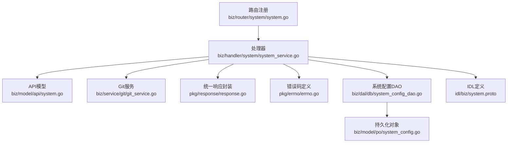
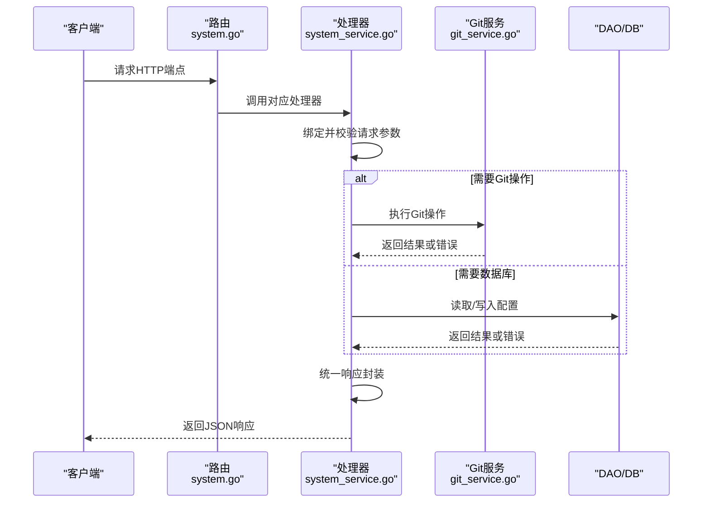
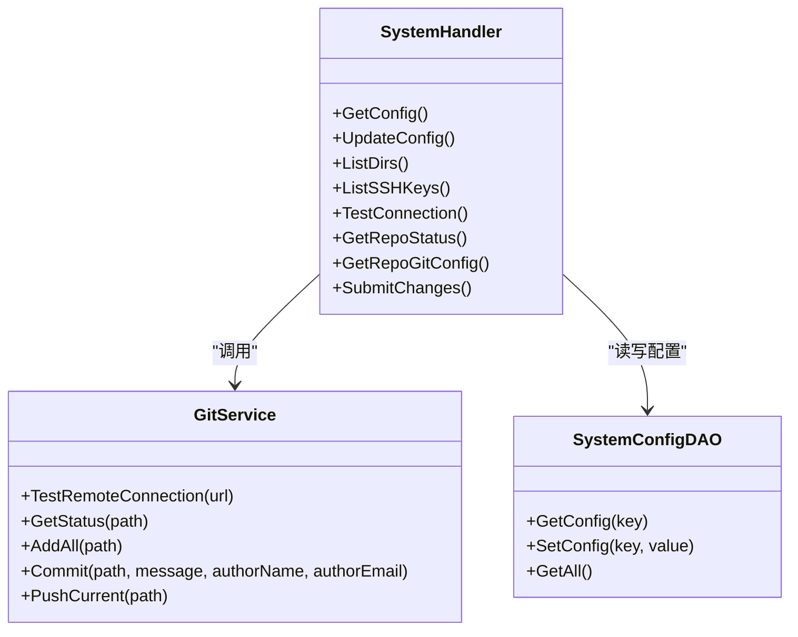

# 系统配置API

<cite>
**本文档引用的文件**
- [biz/router/system/system.go](file://biz/router/system/system.go)
- [biz/handler/system/system_service.go](file://biz/handler/system/system_service.go)
- [biz/model/api/system.go](file://biz/model/api/system.go)
- [idl/biz/system.proto](file://idl/biz/system.proto)
- [pkg/response/response.go](file://pkg/response/response.go)
- [pkg/errno/errno.go](file://pkg/errno/errno.go)
- [biz/service/git/git_service.go](file://biz/service/git/git_service.go)
- [biz/dal/db/system_config_dao.go](file://biz/dal/db/system_config_dao.go)
- [biz/model/po/system_config.go](file://biz/model/po/system_config.go)
- [pkg/configs/model.go](file://pkg/configs/model.go)
</cite>

## 目录
1. [简介](#简介)
2. [项目结构](#项目结构)
3. [核心组件](#核心组件)
4. [架构总览](#架构总览)
5. [详细组件分析](#详细组件分析)
6. [依赖关系分析](#依赖关系分析)
7. [性能考虑](#性能考虑)
8. [故障排查指南](#故障排查指南)
9. [结论](#结论)

## 简介
本文件为系统配置API的完整接口文档，覆盖以下端点：
- 获取全局配置：GET /api/v1/system/config
- 更新全局配置：POST /api/v1/system/config
- 文件系统浏览：GET /api/v1/system/dirs
- SSH密钥列表：GET /api/v1/system/ssh-keys
- 远程连接测试：POST /api/v1/system/test-connection
- 仓库状态查询：GET /api/v1/system/repo/status
- 仓库Git配置查询：GET /api/v1/system/repo/git-config
- 工作区变更提交：POST /api/v1/system/repo/submit

文档包含HTTP方法、URL模式、请求参数、响应格式、状态码与错误处理，并提供请求/响应示例与数据结构说明；同时涵盖配置验证、热更新与备份恢复等运维要点。

## 项目结构
系统配置API由路由注册、处理器、数据模型与底层服务组成，采用分层设计：
- 路由层：在系统路由组下注册各端点
- 处理器层：解析请求、调用服务、封装统一响应
- 数据模型层：定义请求/响应结构体
- 服务层：封装Git操作与系统能力
- DAO/持久化层：系统配置的读写

图表来源
- [biz/router/system/system.go](file://biz/router/system/system.go#L17-L39)
- [biz/handler/system/system_service.go](file://biz/handler/system/system_service.go#L22-L268)
- [biz/model/api/system.go](file://biz/model/api/system.go#L1-L29)
- [idl/biz/system.proto](file://idl/biz/system.proto#L12-L52)
- [pkg/response/response.go](file://pkg/response/response.go#L9-L87)
- [pkg/errno/errno.go](file://pkg/errno/errno.go#L7-L129)
- [biz/service/git/git_service.go](file://biz/service/git/git_service.go#L27-L200)
- [biz/dal/db/system_config_dao.go](file://biz/dal/db/system_config_dao.go#L7-L43)
- [biz/model/po/system_config.go](file://biz/model/po/system_config.go#L3-L11)

章节来源
- [biz/router/system/system.go](file://biz/router/system/system.go#L17-L39)
- [biz/handler/system/system_service.go](file://biz/handler/system/system_service.go#L22-L268)

## 核心组件
- 统一响应结构：包含业务状态码、消息、可选错误详情与业务数据
- 错误码体系：按通用、仓库、分支、同步、认证、标签、系统等维度划分
- Git服务：封装远程连接检测、工作区状态、提交、推送等能力
- 系统配置DAO：提供键值配置的读取、设置与全量导出

章节来源
- [pkg/response/response.go](file://pkg/response/response.go#L9-L87)
- [pkg/errno/errno.go](file://pkg/errno/errno.go#L31-L129)
- [biz/service/git/git_service.go](file://biz/service/git/git_service.go#L578-L665)
- [biz/dal/db/system_config_dao.go](file://biz/dal/db/system_config_dao.go#L13-L42)

## 架构总览
系统配置API通过Hertz路由注册到 /api/v1/system 下，处理器负责参数绑定与校验、调用Git服务或DAO、返回统一响应。IDL定义了RPC契约与HTTP映射，确保前后端一致。

图表来源
- [biz/router/system/system.go](file://biz/router/system/system.go#L17-L39)
- [biz/handler/system/system_service.go](file://biz/handler/system/system_service.go#L22-L268)
- [biz/service/git/git_service.go](file://biz/service/git/git_service.go#L578-L665)
- [biz/dal/db/system_config_dao.go](file://biz/dal/db/system_config_dao.go#L13-L42)

## 详细组件分析

### 获取全局配置
- 方法与路径：GET /api/v1/system/config
- 功能描述：返回当前调试模式与Git全局作者信息
- 请求参数：无
- 响应数据：
  - debug_mode: 布尔，调试模式开关
  - author_name: 字符串，全局作者名
  - author_email: 字符串，全局作者邮箱
- 示例响应：
  {
    "code": 0,
    "msg": "success",
    "data": {
      "debug_mode": true,
      "author_name": "Alice",
      "author_email": "alice@example.com"
    }
  }

章节来源
- [biz/router/system/system.go](file://biz/router/system/system.go#L26-L30)
- [biz/handler/system/system_service.go](file://biz/handler/system/system_service.go#L22-L33)
- [pkg/response/response.go](file://pkg/response/response.go#L17-L24)

### 更新全局配置
- 方法与路径：POST /api/v1/system/config
- 功能描述：更新调试模式与Git全局作者信息
- 请求体字段：
  - debug_mode: 布尔
  - author_name: 字符串
  - author_email: 字符串
- 响应数据：同“获取全局配置”
- 示例请求体：
  {
    "debug_mode": false,
    "author_name": "Bob",
    "author_email": "bob@example.com"
  }
- 示例响应：
  {
    "code": 0,
    "msg": "success",
    "data": {
      "debug_mode": false,
      "author_name": "Bob",
      "author_email": "bob@example.com"
    }
  }

章节来源
- [biz/router/system/system.go](file://biz/router/system/system.go#L27-L30)
- [biz/handler/system/system_service.go](file://biz/handler/system/system_service.go#L35-L57)
- [biz/model/api/system.go](file://biz/model/api/system.go#L24-L28)
- [pkg/response/response.go](file://pkg/response/response.go#L17-L24)

### 文件系统浏览
- 方法与路径：GET /api/v1/system/dirs
- 功能描述：列出指定路径下的可见子目录，支持搜索过滤
- 查询参数：
  - path: 字符串，目标路径（为空时默认用户主目录）
  - search: 字符串，可选，用于名称匹配过滤
- 响应数据：
  - parent: 字符串，父目录路径（根目录时为空）
  - current: 字符串，当前目录路径
  - dirs: 数组，目录项列表，每项含 name 与 path
- 示例响应：
  {
    "code": 0,
    "msg": "success",
    "data": {
      "parent": "/home",
      "current": "/home/user",
      "dirs": [
        {"name": "project-a", "path": "/home/user/project-a"},
        {"name": "project-b", "path": "/home/user/project-b"}
      ]
    }
  }

章节来源
- [biz/router/system/system.go](file://biz/router/system/system.go#L28-L30)
- [biz/handler/system/system_service.go](file://biz/handler/system/system_service.go#L59-L111)
- [biz/model/api/system.go](file://biz/model/api/system.go#L3-L17)
- [pkg/response/response.go](file://pkg/response/response.go#L17-L24)

### SSH密钥管理
- 方法与路径：GET /api/v1/system/ssh-keys
- 功能描述：枚举用户家目录 .ssh 下的非目录文件作为潜在SSH密钥
- 请求参数：无
- 响应数据：数组，每项包含 name 与 path
- 示例响应：
  [
    {"name": "id_rsa", "path": "/home/user/.ssh/id_rsa"},
    {"name": "id_ed25519", "path": "/home/user/.ssh/id_ed25519"}
  ]

章节来源
- [biz/router/system/system.go](file://biz/router/system/system.go#L29-L30)
- [biz/handler/system/system_service.go](file://biz/handler/system/system_service.go#L113-L140)
- [biz/model/api/system.go](file://biz/model/api/system.go#L19-L22)
- [pkg/response/response.go](file://pkg/response/response.go#L17-L24)

### 远程连接测试
- 方法与路径：POST /api/v1/system/test-connection
- 功能描述：对给定URL执行远程连接测试（自动检测SSH/HTTP凭据）
- 请求体字段：
  - url: 字符串，待测试的远程仓库URL
- 响应数据：
  - status: 字符串，"success" 或 "failed"
  - error: 字符串（失败时存在）
- 示例请求体：
  {
    "url": "https://github.com/example/repo.git"
  }
- 示例响应（成功）：
  {
    "code": 0,
    "msg": "success",
    "data": {"status": "success"}
  }
- 示例响应（失败）：
  {
    "code": 500,
    "msg": "internal server error",
    "data": {"status": "failed", "error": "连接超时"}
  }

章节来源
- [biz/router/system/system.go](file://biz/router/system/system.go#L30-L30)
- [biz/handler/system/system_service.go](file://biz/handler/system/system_service.go#L142-L158)
- [biz/service/git/git_service.go](file://biz/service/git/git_service.go#L578-L592)
- [pkg/response/response.go](file://pkg/response/response.go#L68-L71)

### 仓库状态查询
- 方法与路径：GET /api/v1/system/repo/status
- 功能描述：获取指定仓库的工作区状态快照
- 查询参数：
  - repo_key: 字符串，仓库标识
- 响应数据：
  - status: 字符串，工作区状态文本
- 示例响应：
  {
    "code": 0,
    "msg": "success",
    "data": {"status": "On branch main\nnothing to commit, working tree clean"}
  }

章节来源
- [biz/router/system/system.go](file://biz/router/system/system.go#L32-L36)
- [biz/handler/system/system_service.go](file://biz/handler/system/system_service.go#L160-L183)
- [biz/service/git/git_service.go](file://biz/service/git/git_service.go#L609-L623)
- [pkg/response/response.go](file://pkg/response/response.go#L17-L24)

### 仓库Git配置查询
- 方法与路径：GET /api/v1/system/repo/git-config
- 功能描述：获取指定仓库的Git用户配置（姓名与邮箱）
- 查询参数：
  - repo_key: 字符串，仓库标识
- 响应数据：
  - name: 字符串，用户姓名
  - email: 字符串，用户邮箱
- 示例响应：
  {
    "code": 0,
    "msg": "success",
    "data": {"name": "Alice", "email": "alice@example.com"}
  }

章节来源
- [biz/router/system/system.go](file://biz/router/system/system.go#L32-L36)
- [biz/handler/system/system_service.go](file://biz/handler/system/system_service.go#L185-L207)
- [biz/service/git/git_service.go](file://biz/service/git/git_service.go#L609-L623)
- [pkg/response/response.go](file://pkg/response/response.go#L17-L24)

### 工作区变更提交
- 方法与路径：POST /api/v1/system/repo/submit
- 功能描述：将工作区变更全部暂存、提交（可选推送），并记录审计日志
- 请求体字段：
  - repo_key: 字符串，仓库标识
  - message: 字符串，提交信息（必填）
  - push: 布尔，是否同时推送
  - author_name: 字符串，可选，作者名
  - author_email: 字符串，可选，作者邮箱
- 响应数据：
  - message: 字符串，提交结果摘要
  - warning: 字符串，当推送失败时返回 "push_failed"
- 示例请求体：
  {
    "repo_key": "repo-key-001",
    "message": "feat: 新增功能",
    "push": true,
    "author_name": "Alice",
    "author_email": "alice@example.com"
  }
- 示例响应（仅提交成功）：
  {
    "code": 0,
    "msg": "success",
    "data": {"message": "Committed successfully"}
  }
- 示例响应（提交+推送成功）：
  {
    "code": 0,
    "msg": "success",
    "data": {"message": "Committed successfully and pushed to remote"}
  }
- 示例响应（提交成功但推送失败）：
  {
    "code": 0,
    "msg": "success",
    "data": {"message": "Committed successfully", "warning": "push_failed"}
  }

章节来源
- [biz/router/system/system.go](file://biz/router/system/system.go#L32-L36)
- [biz/handler/system/system_service.go](file://biz/handler/system/system_service.go#L209-L268)
- [biz/service/git/git_service.go](file://biz/service/git/git_service.go#L625-L665)
- [pkg/response/response.go](file://pkg/response/response.go#L17-L24)

### 数据结构说明
- ConfigReq（更新全局配置请求体）
  - 字段：debug_mode（布尔）、author_name（字符串）、author_email（字符串）
  - 参考路径：[biz/model/api/system.go](file://biz/model/api/system.go#L24-L28)
- DirItem（目录项）
  - 字段：name（字符串）、path（字符串）
  - 参考路径：[biz/model/api/system.go](file://biz/model/api/system.go#L8-L11)
- ListDirsReq/ListDirsResp（目录浏览请求/响应）
  - 请求：path（字符串）、search（字符串）
  - 响应：parent（字符串）、current（字符串）、dirs（数组，元素为DirItem）
  - 参考路径：[biz/model/api/system.go](file://biz/model/api/system.go#L3-L17)
- SSHKey（SSH密钥）
  - 字段：name（字符串）、path（字符串）
  - 参考路径：[biz/model/api/system.go](file://biz/model/api/system.go#L19-L22)
- TestConnectionReq（连接测试请求体）
  - 字段：url（字符串）、auth_type（字符串）、auth_key（字符串）、auth_secret（字符串）
  - 参考路径：[idl/biz/system.proto](file://idl/biz/system.proto#L134-L140)

章节来源
- [biz/model/api/system.go](file://biz/model/api/system.go#L3-L28)
- [idl/biz/system.proto](file://idl/biz/system.proto#L134-L140)

## 依赖关系分析

图表来源
- [biz/handler/system/system_service.go](file://biz/handler/system/system_service.go#L22-L268)
- [biz/service/git/git_service.go](file://biz/service/git/git_service.go#L578-L665)
- [biz/dal/db/system_config_dao.go](file://biz/dal/db/system_config_dao.go#L13-L42)

章节来源
- [biz/handler/system/system_service.go](file://biz/handler/system/system_service.go#L22-L268)
- [biz/service/git/git_service.go](file://biz/service/git/git_service.go#L578-L665)
- [biz/dal/db/system_config_dao.go](file://biz/dal/db/system_config_dao.go#L13-L42)

## 性能考虑
- 目录遍历：ListDirs 对目录进行顺序扫描并排序，建议限制搜索范围与层级深度
- Git操作：提交/推送可能耗时较长，建议在前端使用异步轮询或后台任务
- 连接测试：TestConnection 使用匿名远程列举，避免实际数据传输，注意网络超时设置
- 响应封装：统一响应结构减少前端分支判断复杂度，便于缓存与调试

## 故障排查指南
- 参数错误（400）：请求参数缺失或格式不合法
  - 触发场景：BindAndValidate失败、缺少repo_key、提交message为空
  - 排查要点：检查请求体/查询参数命名与类型
- 资源不存在（404）：仓库未找到
  - 触发场景：根据repo_key查询仓库失败
  - 排查要点：确认仓库标识正确且已录入系统
- 服务器内部错误（500）：系统异常或Git命令执行失败
  - 触发场景：文件系统访问失败、Git操作异常、数据库读写失败
  - 排查要点：查看服务日志、确认Git可执行文件可用、检查SSH密钥权限
- 推送失败告警：提交成功但推送失败
  - 触发场景：提交完成但推送阶段报错
  - 排查要点：检查远端URL、凭据、网络连通性与权限

章节来源
- [pkg/response/response.go](file://pkg/response/response.go#L58-L86)
- [pkg/errno/errno.go](file://pkg/errno/errno.go#L31-L129)
- [biz/handler/system/system_service.go](file://biz/handler/system/system_service.go#L160-L183)
- [biz/handler/system/system_service.go](file://biz/handler/system/system_service.go#L209-L268)

## 结论
系统配置API提供了从全局配置、文件浏览、SSH密钥管理到仓库操作的一体化能力。通过统一的响应与错误码体系、清晰的路由与处理器职责划分，以及对Git服务与DAO的合理封装，满足了日常运维与开发管理需求。建议在生产环境中结合审计日志与监控告警，确保变更可追溯、问题可定位。