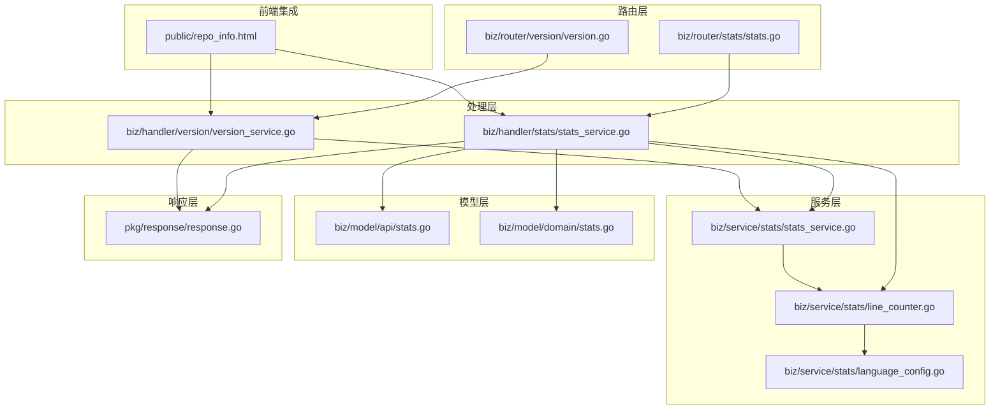
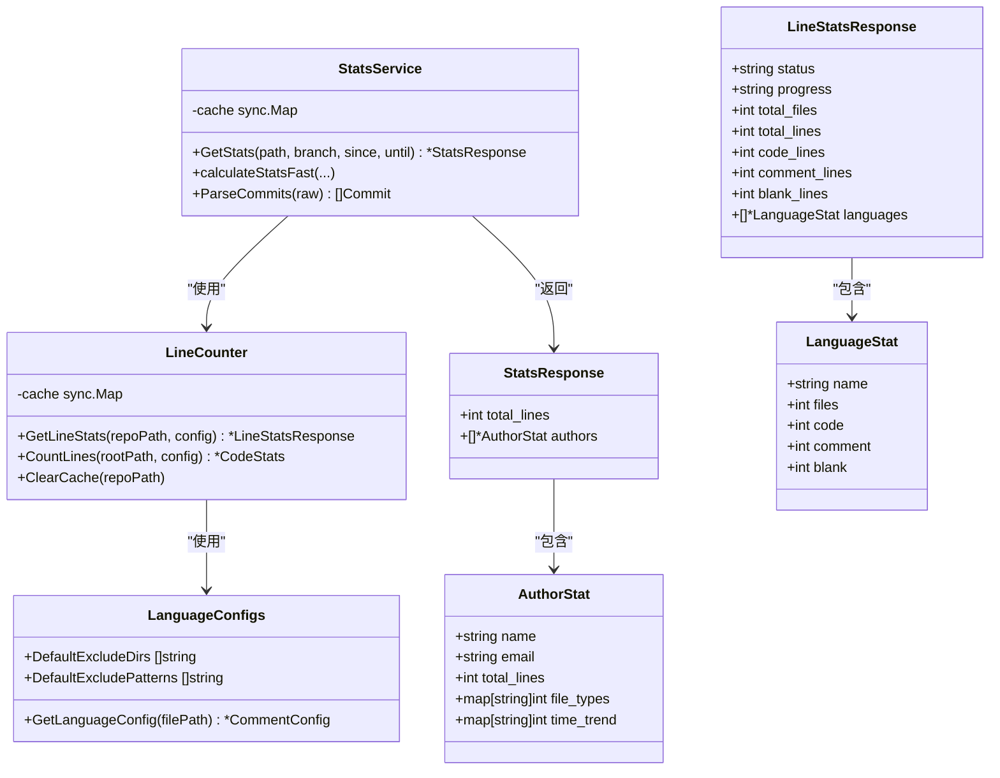

# 统计分析API

<cite>
**本文档引用的文件**
- [biz/router/stats/stats.go](file://biz/router/stats/stats.go)
- [biz/handler/stats/stats_service.go](file://biz/handler/stats/stats_service.go)
- [biz/service/stats/stats_service.go](file://biz/service/stats/stats_service.go)
- [biz/service/stats/line_counter.go](file://biz/service/stats/line_counter.go)
- [biz/service/stats/language_config.go](file://biz/service/stats/language_config.go)
- [biz/model/api/stats.go](file://biz/model/api/stats.go)
- [biz/model/domain/stats.go](file://biz/model/domain/stats.go)
- [pkg/response/response.go](file://pkg/response/response.go)
- [biz/handler/version/version_service.go](file://biz/handler/version/version_service.go)
- [biz/router/stats/middleware.go](file://biz/router/stats/middleware.go)
- [biz/router/version/version.go](file://biz/router/version/version.go)
- [public/repo_info.html](file://public/repo_info.html)
</cite>

## 更新摘要
**变更内容**
- 更新统计API访问方式：从独立的stats.html页面改为通过仓库详情页面的标签访问
- 新增仓库详情页面的统计功能集成说明
- 更新API路由结构和访问路径
- 补充前端JavaScript集成示例

## 目录
1. [简介](#简介)
2. [项目结构](#项目结构)
3. [核心组件](#核心组件)
4. [架构概览](#架构概览)
5. [详细组件分析](#详细组件分析)
6. [依赖关系分析](#依赖关系分析)
7. [性能考量](#性能考量)
8. [故障排查指南](#故障排查指南)
9. [结论](#结论)

## 简介
本文件为统计分析API的详细接口文档，覆盖以下核心统计能力：
- 代码行数统计：/api/v1/stats/lines（GET），支持时间范围、作者过滤、排除目录与模式、异步计算与缓存
- 作者贡献统计：/api/v1/stats/authors（GET），返回仓库作者列表
- 代码统计分析：/api/v1/stats/analyze（GET），聚合作者贡献、文件类型分布、时间趋势
- 版本历史查询：/api/v1/version/list（GET），列出仓库标签/版本
- 代码行统计导出：/api/v1/stats/lines/export/csv（GET），导出按语言统计的CSV
- 统计配置管理：/api/v1/stats/lines/config（GET/POST），查看与保存统计配置

**更新** 统计分析API现在通过仓库详情页面的"真实工程代码度量"标签访问，而非独立的stats.html页面。前端JavaScript通过AJAX调用API获取统计数据并渲染图表。

同时涵盖请求/响应示例、错误处理、统计缓存机制、性能优化与大数据量处理策略。

## 项目结构
统计分析API位于biz子系统中，采用分层架构：
- 路由层：注册统计相关路由
- 处理层：接收请求、解析参数、调用服务层、封装响应
- 服务层：核心统计逻辑（并发缓存、异步计算、Git日志解析）
- 数据模型：API响应结构与领域模型
- 工具层：语言配置、行统计器、Git服务

**图表来源**
- [biz/router/stats/stats.go](file://biz/router/stats/stats.go#L17-L48)
- [biz/router/version/version.go](file://biz/router/version/version.go#L17-L32)
- [biz/handler/stats/stats_service.go](file://biz/handler/stats/stats_service.go#L1-L360)
- [biz/handler/version/version_service.go](file://biz/handler/version/version_service.go#L1-L88)

**章节来源**
- [biz/router/stats/stats.go](file://biz/router/stats/stats.go#L17-L48)
- [biz/handler/stats/stats_service.go](file://biz/handler/stats/stats_service.go#L1-L360)

## 核心组件
- 统计服务（StatsService）：负责并发缓存、异步计算、Git日志流解析、进度更新
- 行统计器（LineCounter）：负责文件遍历、注释识别、按语言统计、作者/时间过滤、缓存与导出
- 语言配置（LanguageConfigs）：预定义多种编程语言的注释与字符串规则
- API模型：AuthorStat、StatsResponse、LineStatsResponse、LanguageStat等
- 响应封装：统一的响应结构与状态码封装

**章节来源**
- [biz/service/stats/stats_service.go](file://biz/service/stats/stats_service.go#L39-L50)
- [biz/service/stats/line_counter.go](file://biz/service/stats/line_counter.go#L20-L74)
- [biz/service/stats/language_config.go](file://biz/service/stats/language_config.go#L8-L284)
- [biz/model/api/stats.go](file://biz/model/api/stats.go#L3-L49)
- [pkg/response/response.go](file://pkg/response/response.go#L9-L87)

## 架构概览
统计分析API采用"路由-处理器-服务-工具"的分层设计，结合并发缓存与异步计算提升大数据量场景下的性能与用户体验。

```mermaid
sequenceDiagram
participant C as "客户端"
participant F as "前端(repo_info.html)"
participant R as "路由(stats.go)"
participant H as "处理器(stats_service.go)"
participant S as "统计服务(stats_service.go)"
participant L as "行统计器(line_counter.go)"
participant G as "Git服务"
participant RESP as "响应(response.go)"
C->>F : 访问仓库详情页面
F->>R : GET /api/v1/stats/lines?repo_key=...
R->>H : 调用GetLineStats
H->>L : GetLineStats(repoPath, config)
alt 命中缓存且有效
L-->>H : 返回缓存结果
else 缓存未命中
L->>L : 启动后台计算
L-->>H : 返回processing状态
end
H->>RESP : Success(data)
RESP-->>F : JSON响应
F-->>C : 更新图表和表格
```

**图表来源**
- [biz/router/stats/stats.go](file://biz/router/stats/stats.go#L34-L44)
- [biz/handler/stats/stats_service.go](file://biz/handler/stats/stats_service.go#L199-L253)
- [biz/service/stats/line_counter.go](file://biz/service/stats/line_counter.go#L76-L111)
- [public/repo_info.html](file://public/repo_info.html#L689-L713)

## 详细组件分析

### 代码行数统计 /api/v1/stats/lines（GET）
- 功能：统计仓库代码行数，支持排除目录/模式、分支、作者、时间范围筛选；异步计算与缓存
- 请求参数
  - repo_key: 必填，仓库标识
  - branch: 可选，目标分支
  - author: 可选，作者名或邮箱（模糊匹配）
  - since: 可选，YYYY-MM-DD起始日期
  - until: 可选，YYYY-MM-DD结束日期
  - exclude_dirs: 可选，逗号分隔的目录列表
  - exclude_patterns: 可选，通配符文件模式列表
- 响应
  - status: processing/ready/failed
  - progress: 进度描述（仅processing时）
  - total_files/code_lines/comment_lines/blank_lines/total_lines: 统计汇总
  - languages: 按语言分类的统计数组（name/files/code/comment/blank）
- 状态码
  - 200: 成功
  - 202: 异步处理中（processing）
  - 400: 参数错误
  - 404: 仓库不存在
  - 500: 服务器内部错误
- 示例
  - 请求：GET /api/v1/stats/lines?repo_key=REPO_KEY&since=2023-01-01&until=2023-12-31
  - 响应：包含languages数组与统计汇总字段

**章节来源**
- [biz/handler/stats/stats_service.go](file://biz/handler/stats/stats_service.go#L199-L253)
- [biz/service/stats/line_counter.go](file://biz/service/stats/line_counter.go#L76-L151)
- [biz/model/api/stats.go](file://biz/model/api/stats.go#L26-L36)

### 代码行统计配置 /api/v1/stats/lines/config（GET/POST）
- GET：返回默认排除配置（exclude_dirs、exclude_patterns）
- POST：保存用户自定义配置（需repo_key），并清除对应仓库的统计缓存
- 响应：统一响应结构
- 示例
  - GET：返回默认配置
  - POST：{"message":"配置已保存，下次统计将使用新配置"}

**章节来源**
- [biz/handler/stats/stats_service.go](file://biz/handler/stats/stats_service.go#L255-L292)
- [biz/service/stats/line_counter.go](file://biz/service/stats/line_counter.go#L573-L582)

### 代码行统计导出 /api/v1/stats/lines/export/csv（GET）
- 功能：导出按语言统计的CSV文件
- 参数：同"代码行数统计"
- 响应：CSV文件流，包含表头与每种语言的统计行，最后附带汇总行
- 示例：CSV首行为"Language,Files,Code,Comment,Blank,Total"

**章节来源**
- [biz/handler/stats/stats_service.go](file://biz/handler/stats/stats_service.go#L294-L359)
- [biz/service/stats/line_counter.go](file://biz/service/stats/line_counter.go#L113-L151)

### 作者贡献统计 /api/v1/stats/authors（GET）
- 功能：返回仓库作者列表
- 参数：repo_key（必填）
- 响应：作者数组（名称、邮箱等）
- 状态码：200/400/404/500

**章节来源**
- [biz/handler/stats/stats_service.go](file://biz/handler/stats/stats_service.go#L44-L66)

### 代码统计分析 /api/v1/stats/analyze（GET）
- 功能：聚合作者贡献、文件类型分布、时间趋势
- 参数：repo_key、branch、since、until
- 响应：total_lines与authors数组（每个作者含name、email、total_lines、file_types、time_trend）
- 过滤：可对作者进行二次过滤（按name或email精确匹配）
- 状态码：200/202/400/404/500

**章节来源**
- [biz/handler/stats/stats_service.go](file://biz/handler/stats/stats_service.go#L97-L149)
- [biz/service/stats/stats_service.go](file://biz/service/stats/stats_service.go#L179-L227)
- [biz/model/api/stats.go](file://biz/model/api/stats.go#L3-L15)

### 版本历史查询 /api/v1/version/list（GET）
- 功能：列出仓库标签/版本
- 参数：repo_key（必填）
- 响应：标签/版本列表
- 状态码：200/400/404/500

**章节来源**
- [biz/handler/version/version_service.go](file://biz/handler/version/version_service.go#L39-L62)

### 通用响应结构
- 字段：code、msg、error、data
- 成功：code=0，msg="success"
- 异步处理：Accepted封装，返回202与进度信息
- 错误：统一错误码与消息

**章节来源**
- [pkg/response/response.go](file://pkg/response/response.go#L9-L87)

## 依赖关系分析

**图表来源**
- [biz/service/stats/stats_service.go](file://biz/service/stats/stats_service.go#L39-L50)
- [biz/service/stats/line_counter.go](file://biz/service/stats/line_counter.go#L20-L74)
- [biz/service/stats/language_config.go](file://biz/service/stats/language_config.go#L8-L284)
- [biz/model/api/stats.go](file://biz/model/api/stats.go#L12-L49)

## 性能考量
- 并发缓存与去重
  - 使用sync.Map存储缓存项，键为路径+分支+时间范围组合
  - 使用LoadOrStore避免重复并发计算，提升高并发场景吞吐
- 异步计算与进度反馈
  - 统计任务在后台goroutine执行，立即返回processing状态与进度
  - 定期更新缓存中的progress，便于前端轮询展示
- I/O与内存优化
  - 行扫描使用大缓冲区（64KB初始，最大1MB），减少系统调用
  - 语言配置通过扩展名映射快速定位，避免重复解析
- 大数据量处理
  - Git日志流式解析，逐行处理commit与变更，避免一次性加载全部数据
  - 支持按作者/时间范围过滤，缩小统计范围
- 缓存策略
  - 缓存有效期1小时，避免频繁重复计算
  - 配置变更时主动清理对应仓库缓存，确保下次统计使用新配置

**章节来源**
- [biz/service/stats/stats_service.go](file://biz/service/stats/stats_service.go#L180-L227)
- [biz/service/stats/line_counter.go](file://biz/service/stats/line_counter.go#L76-L151)
- [biz/service/stats/line_counter.go](file://biz/service/stats/line_counter.go#L153-L251)

## 故障排查指南
- 常见错误与处理
  - 400 参数错误：检查repo_key是否缺失或格式不正确
  - 404 仓库不存在：确认repo_key是否正确，仓库路径是否存在
  - 500 服务器内部错误：查看服务日志，关注Git命令执行与文件读取异常
- 异步处理状态
  - 202 异步处理中：等待一段时间后重试，或根据progress判断进度
- 缓存问题
  - 若统计结果未更新：确认是否修改了统计配置，必要时调用保存配置接口触发缓存清理
- 导出CSV
  - 若导出失败：检查仓库权限与磁盘空间，确认统计已完成（非processing）

**章节来源**
- [pkg/response/response.go](file://pkg/response/response.go#L58-L87)
- [biz/handler/stats/stats_service.go](file://biz/handler/stats/stats_service.go#L151-L197)
- [biz/handler/stats/stats_service.go](file://biz/handler/stats/stats_service.go#L294-L359)

## 结论
统计分析API通过清晰的分层设计、并发缓存与异步计算机制，在保证准确性的同时显著提升了性能与用户体验。**更新** 统计功能现已集成到仓库详情页面，用户可以通过"真实工程代码度量"标签页直接访问统计功能，无需跳转到独立页面。

建议在生产环境中：
- 合理设置排除配置，减少无效文件统计
- 对高频查询开启缓存，避免重复计算
- 在前端实现轮询进度展示，改善用户感知
- 对超大仓库启用作者/时间范围过滤，缩短统计时间
- 利用仓库详情页面的标签化界面，提供更好的用户体验