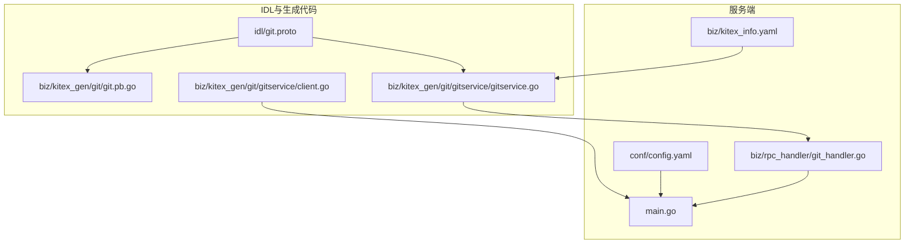
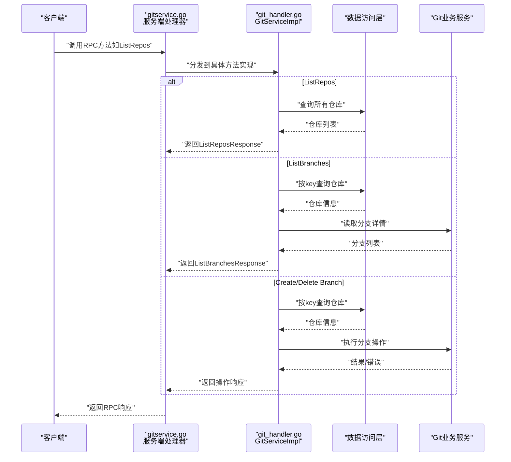
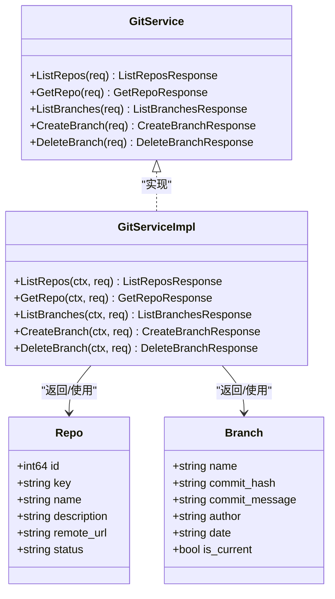

# RPC服务接口

<cite>
**本文引用的文件**
- [git.proto](file://idl/git.proto)
- [git.pb.go](file://biz/kitex_gen/git/git.pb.go)
- [gitservice.go](file://biz/kitex_gen/git/gitservice/gitservice.go)
- [git_handler.go](file://biz/rpc_handler/git_handler.go)
- [main.go](file://main.go)
- [config.yaml](file://conf/config.yaml)
- [kitex_info.yaml](file://biz/kitex_info.yaml)
- [client.go](file://biz/kitex_gen/git/gitservice/client.go)
</cite>

## 目录
1. [简介](#简介)
2. [项目结构](#项目结构)
3. [核心组件](#核心组件)
4. [架构总览](#架构总览)
5. [详细组件分析](#详细组件分析)
6. [依赖关系分析](#依赖关系分析)
7. [性能考虑](#性能考虑)
8. [故障排查指南](#故障排查指南)
9. [结论](#结论)
10. [附录](#附录)

## 简介
本文件面向Git管理服务的RPC服务接口，基于IDL中的git.proto定义，系统性梳理GitService服务的协议规范、消息类型与字段、服务端与客户端实现要点、序列化格式、调用流程、最佳实践、错误处理与调试方法，并给出服务发现、负载均衡与故障恢复的建议方案。目标是帮助开发者快速理解并正确使用GitService的RPC接口。

## 项目结构
围绕GitService的RPC接口，项目中涉及的关键文件与职责如下：
- 协议定义：idl/git.proto
- 生成代码（服务端/客户端）：biz/kitex_gen/git/gitservice/gitservice.go
- 生成代码（消息类型）：biz/kitex_gen/git/git.pb.go
- 服务端实现：biz/rpc_handler/git_handler.go
- 服务启动入口：main.go
- 配置：conf/config.yaml
- Kitex元信息：biz/kitex_info.yaml
- 客户端封装：biz/kitex_gen/git/gitservice/client.go

图表来源
- [git.proto](file://idl/git.proto#L1-L78)
- [git.pb.go](file://biz/kitex_gen/git/git.pb.go#L1-L366)
- [gitservice.go](file://biz/kitex_gen/git/gitservice/gitservice.go#L1-L117)
- [git_handler.go](file://biz/rpc_handler/git_handler.go#L1-L131)
- [main.go](file://main.go#L154-L175)
- [config.yaml](file://conf/config.yaml#L1-L25)
- [kitex_info.yaml](file://biz/kitex_info.yaml#L1-L4)
- [client.go](file://biz/kitex_gen/git/gitservice/client.go#L37-L73)

章节来源
- [git.proto](file://idl/git.proto#L1-L78)
- [git.pb.go](file://biz/kitex_gen/git/git.pb.go#L1-L366)
- [gitservice.go](file://biz/kitex_gen/git/gitservice/gitservice.go#L1-L117)
- [git_handler.go](file://biz/rpc_handler/git_handler.go#L1-L131)
- [main.go](file://main.go#L154-L175)
- [config.yaml](file://conf/config.yaml#L1-L25)
- [kitex_info.yaml](file://biz/kitex_info.yaml#L1-L4)
- [client.go](file://biz/kitex_gen/git/gitservice/client.go#L37-L73)

## 核心组件
- GitService服务：定义了5个RPC方法，用于仓库与分支的查询、创建与删除。
- 消息类型：Repo、Branch以及各RPC请求/响应消息。
- 服务端实现：GitServiceImpl，对接数据访问层与Git业务服务。
- 客户端：Kitex生成的客户端封装，支持统一的调用方式。
- 序列化：Protobuf（通过prutal库），PayloadCodec为Protobuf。
- 传输：基于TCP的Kitex服务端，监听配置中的RPC端口。

章节来源
- [git.proto](file://idl/git.proto#L5-L11)
- [git.pb.go](file://biz/kitex_gen/git/git.pb.go#L11-L357)
- [gitservice.go](file://biz/kitex_gen/git/gitservice/gitservice.go#L17-L53)
- [git_handler.go](file://biz/rpc_handler/git_handler.go#L12-L131)
- [client.go](file://biz/kitex_gen/git/gitservice/client.go#L37-L73)

## 架构总览
GitService采用Kitex框架，服务端以TCP监听方式提供RPC能力；客户端通过生成的客户端封装进行调用。消息序列化采用Protobuf，服务端在gitservice.go中声明了方法信息与序列化细节。

图表来源
- [gitservice.go](file://biz/kitex_gen/git/gitservice/gitservice.go#L119-L143)
- [git_handler.go](file://biz/rpc_handler/git_handler.go#L15-L51)
- [git_handler.go](file://biz/rpc_handler/git_handler.go#L72-L100)
- [git_handler.go](file://biz/rpc_handler/git_handler.go#L102-L115)
- [git_handler.go](file://biz/rpc_handler/git_handler.go#L117-L130)

章节来源
- [gitservice.go](file://biz/kitex_gen/git/gitservice/gitservice.go#L119-L143)
- [git_handler.go](file://biz/rpc_handler/git_handler.go#L15-L51)
- [git_handler.go](file://biz/rpc_handler/git_handler.go#L72-L100)
- [git_handler.go](file://biz/rpc_handler/git_handler.go#L102-L115)
- [git_handler.go](file://biz/rpc_handler/git_handler.go#L117-L130)

## 详细组件分析

### GitService服务定义
- 服务名：GitService
- 方法：
  - ListRepos(ListReposRequest) -> ListReposResponse
  - GetRepo(GetRepoRequest) -> GetRepoResponse
  - ListBranches(ListBranchesRequest) -> ListBranchesResponse
  - CreateBranch(CreateBranchRequest) -> CreateBranchResponse
  - DeleteBranch(DeleteBranchRequest) -> DeleteBranchResponse

章节来源
- [git.proto](file://idl/git.proto#L5-L11)

### 消息类型与字段定义
- Repo
  - 字段：id、key、name、description、remote_url、status
- Branch
  - 字段：name、commit_hash、commit_message、author、date、is_current
- 请求/响应消息
  - ListReposRequest：page、page_size
  - ListReposResponse：repolist、total
  - GetRepoRequest：key
  - GetRepoResponse：repo
  - ListBranchesRequest：repo_key
  - ListBranchesResponse：branches
  - CreateBranchRequest：repo_key、branch_name、ref
  - CreateBranchResponse：success、message
  - DeleteBranchRequest：repo_key、branch_name、force
  - DeleteBranchResponse：success、message

章节来源
- [git.proto](file://idl/git.proto#L13-L77)
- [git.pb.go](file://biz/kitex_gen/git/git.pb.go#L11-L357)

### RPC方法详解

#### ListRepos
- 参数
  - page: 页码（整型）
  - page_size: 每页大小（整型）
- 返回
  - repos: 仓库列表（Repo数组）
  - total: 总数（整型）
- 实现要点
  - 从数据访问层获取仓库列表
  - 基于page/page_size做内存分页（起始/结束索引计算）
  - 返回分页后的结果与总数
- 调用示例（路径）
  - 客户端调用：[client.go](file://biz/kitex_gen/git/gitservice/client.go#L50-L53)
  - 服务端处理：[git_handler.go](file://biz/rpc_handler/git_handler.go#L15-L51)

章节来源
- [git.proto](file://idl/git.proto#L31-L39)
- [git_handler.go](file://biz/rpc_handler/git_handler.go#L15-L51)
- [client.go](file://biz/kitex_gen/git/gitservice/client.go#L50-L53)

#### GetRepo
- 参数
  - key: 仓库唯一标识（字符串）
- 返回
  - repo: 仓库对象（Repo）
- 实现要点
  - 通过key查询仓库
  - 将仓库信息映射为Repo结构返回
- 调用示例（路径）
  - 客户端调用：[client.go](file://biz/kitex_gen/git/gitservice/client.go#L55-L58)
  - 服务端处理：[git_handler.go](file://biz/rpc_handler/git_handler.go#L53-L70)

章节来源
- [git.proto](file://idl/git.proto#L41-L47)
- [git_handler.go](file://biz/rpc_handler/git_handler.go#L53-L70)
- [client.go](file://biz/kitex_gen/git/gitservice/client.go#L55-L58)

#### ListBranches
- 参数
  - repo_key: 仓库键（字符串）
- 返回
  - branches: 分支列表（Branch数组）
- 实现要点
  - 先根据repo_key查询仓库路径
  - 调用Git业务服务读取分支详情
  - 将分支信息映射为Branch结构返回
- 调用示例（路径）
  - 客户端调用：[client.go](file://biz/kitex_gen/git/gitservice/client.go#L60-L63)
  - 服务端处理：[git_handler.go](file://biz/rpc_handler/git_handler.go#L72-L100)

章节来源
- [git.proto](file://idl/git.proto#L49-L55)
- [git_handler.go](file://biz/rpc_handler/git_handler.go#L72-L100)
- [client.go](file://biz/kitex_gen/git/gitservice/client.go#L60-L63)

#### CreateBranch
- 参数
  - repo_key: 仓库键（字符串）
  - branch_name: 分支名（字符串）
  - ref: 源引用（字符串，分支/提交）
- 返回
  - success: 是否成功（布尔）
  - message: 描述信息（字符串）
- 实现要点
  - 查询仓库路径
  - 调用Git业务服务创建分支
  - 统一返回success/message
- 调用示例（路径）
  - 客户端调用：[client.go](file://biz/kitex_gen/git/gitservice/client.go#L65-L68)
  - 服务端处理：[git_handler.go](file://biz/rpc_handler/git_handler.go#L102-L115)

章节来源
- [git.proto](file://idl/git.proto#L57-L66)
- [git_handler.go](file://biz/rpc_handler/git_handler.go#L102-L115)
- [client.go](file://biz/kitex_gen/git/gitservice/client.go#L65-L68)

#### DeleteBranch
- 参数
  - repo_key: 仓库键（字符串）
  - branch_name: 分支名（字符串）
  - force: 是否强制删除（布尔）
- 返回
  - success: 是否成功（布尔）
  - message: 描述信息（字符串）
- 实现要点
  - 查询仓库路径
  - 调用Git业务服务删除分支
  - 统一返回success/message
- 调用示例（路径）
  - 客户端调用：[client.go](file://biz/kitex_gen/git/gitservice/client.go#L70-L73)
  - 服务端处理：[git_handler.go](file://biz/rpc_handler/git_handler.go#L117-L130)

章节来源
- [git.proto](file://idl/git.proto#L68-L77)
- [git_handler.go](file://biz/rpc_handler/git_handler.go#L117-L130)
- [client.go](file://biz/kitex_gen/git/gitservice/client.go#L70-L73)

### 服务端实现指南
- 服务端启动
  - 在main.go中通过startRPCServer创建Kitex服务端，绑定配置中的RPC端口
  - 使用gitservice.NewServer(new(rpc_handler.GitServiceImpl), ...)注册GitServiceImpl
- 处理器行为
  - gitservice.go中定义了各方法的处理器与序列化逻辑
  - PayloadCodec为Protobuf，使用prutal进行编解码
- 数据访问与业务逻辑
  - GitServiceImpl通过数据访问层与Git业务服务完成实际操作
  - 对于ListRepos，采用内存分页；其他方法通过仓库键定位仓库路径后执行Git操作

章节来源
- [main.go](file://main.go#L154-L175)
- [gitservice.go](file://biz/kitex_gen/git/gitservice/gitservice.go#L119-L143)
- [git_handler.go](file://biz/rpc_handler/git_handler.go#L12-L131)

### 客户端实现指南
- 客户端封装
  - 生成的客户端封装在client.go中，提供统一的调用方法
  - 支持传入ctx与callOptions，便于超时、重试等控制
- 调用流程
  - 通过NewClient创建客户端实例
  - 调用对应方法（如ListRepos、GetRepo、ListBranches、CreateBranch、DeleteBranch）
  - 获取响应或错误

章节来源
- [client.go](file://biz/kitex_gen/git/gitservice/client.go#L37-L73)

### 序列化格式说明
- 编解码器：Protobuf（PayloadCodec为Protobuf）
- 编解码库：prutal（在生成代码中使用）
- 传输协议：基于TCP的Kitex RPC

章节来源
- [gitservice.go](file://biz/kitex_gen/git/gitservice/gitservice.go#L112-L112)
- [git.pb.go](file://biz/kitex_gen/git/git.pb.go#L22-L24)

### 错误处理策略
- 服务端错误
  - 查询失败或业务异常时，返回错误或设置success=false、message描述
  - ListRepos/ListBranches对未找到仓库场景返回明确提示
- 客户端错误
  - 通过返回err判断调用是否成功
  - 建议在调用侧设置合理的超时与重试策略
- 最佳实践
  - 对关键RPC方法增加超时控制
  - 对批量操作（如ListRepos）建议分页调用
  - 对分支操作（Create/Delete）建议先校验仓库存在性

章节来源
- [git_handler.go](file://biz/rpc_handler/git_handler.go#L17-L20)
- [git_handler.go](file://biz/rpc_handler/git_handler.go#L56-L58)
- [git_handler.go](file://biz/rpc_handler/git_handler.go#L81-L83)
- [git_handler.go](file://biz/rpc_handler/git_handler.go#L106-L107)
- [git_handler.go](file://biz/rpc_handler/git_handler.go#L121-L122)

### 调试方法
- 日志
  - 服务端启动与停止日志在main.go中输出
  - 可在git_handler.go中添加必要的日志以便追踪请求与响应
- 端口与地址
  - RPC端口由配置文件提供，默认为38888
  - 服务端解析TCP地址并监听
- 连接验证
  - 可使用生成的客户端进行最小化调用验证（如GetRepo）

章节来源
- [main.go](file://main.go#L167-L172)
- [config.yaml](file://conf/config.yaml#L4-L5)

## 依赖关系分析

图表来源
- [gitservice.go](file://biz/kitex_gen/git/gitservice/gitservice.go#L359-L365)
- [git_handler.go](file://biz/rpc_handler/git_handler.go#L12-L131)
- [git.pb.go](file://biz/kitex_gen/git/git.pb.go#L11-L123)

章节来源
- [gitservice.go](file://biz/kitex_gen/git/gitservice/gitservice.go#L359-L365)
- [git_handler.go](file://biz/rpc_handler/git_handler.go#L12-L131)
- [git.pb.go](file://biz/kitex_gen/git/git.pb.go#L11-L123)

## 性能考虑
- 序列化开销
  - Protobuf序列化效率高，适合高频RPC调用
- 分页策略
  - ListRepos采用内存分页，建议在数据量较大时改为数据库分页或服务端分页
- 并发与连接
  - 客户端应复用连接，避免频繁建立/销毁
  - 合理设置超时与并发上限
- 缓存
  - 对热点仓库信息可考虑短期缓存，降低数据库压力
- I/O优化
  - Git分支读取可能较慢，建议异步化或限流

[本节为通用性能建议，不直接分析具体文件]

## 故障排查指南
- 无法连接RPC服务
  - 检查配置中的RPC端口是否正确
  - 确认服务已启动且监听该端口
- 调用超时
  - 为客户端调用设置合理超时时间
  - 检查网络延迟与服务端负载
- 业务错误
  - 查看返回的success/message或错误信息
  - 对仓库不存在、分支冲突等情况进行针对性处理
- 日志定位
  - 关注服务端启动/停止日志
  - 在git_handler.go中增加必要日志点

章节来源
- [config.yaml](file://conf/config.yaml#L4-L5)
- [main.go](file://main.go#L167-L172)
- [git_handler.go](file://biz/rpc_handler/git_handler.go#L106-L107)
- [git_handler.go](file://biz/rpc_handler/git_handler.go#L121-L122)

## 结论
GitService的RPC接口以清晰的消息模型与简洁的方法集合覆盖了仓库与分支的核心操作。结合Kitex的高效序列化与TCP传输，能够满足内部微服务间的低延迟通信需求。建议在生产环境中配合合理的超时、重试、限流与缓存策略，并完善监控与日志体系，以确保稳定性与可观测性。

[本节为总结性内容，不直接分析具体文件]

## 附录

### 服务发现、负载均衡与故障恢复建议
- 服务发现
  - 在容器化部署中，可通过Kubernetes Service暴露RPC端口
  - 或集成注册中心（如Consul/Nacos）进行动态发现
- 负载均衡
  - 客户端侧使用轮询/一致性哈希策略
  - 服务端可横向扩展多个实例
- 故障恢复
  - 客户端设置指数退避重试
  - 对不可重试错误（如参数非法）快速失败
  - 结合熔断与降级策略，保障系统整体可用性

[本节为概念性建议，不直接分析具体文件]