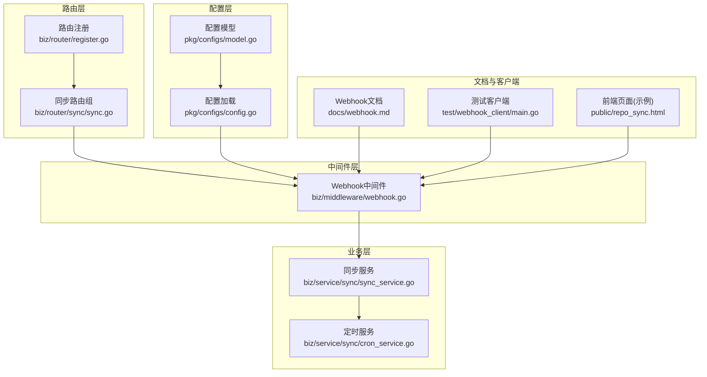
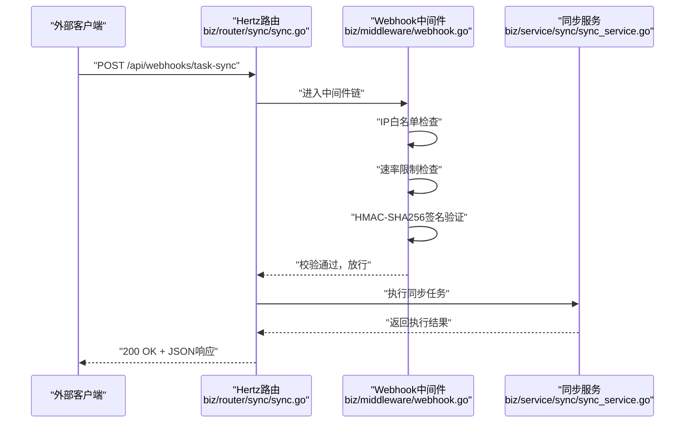
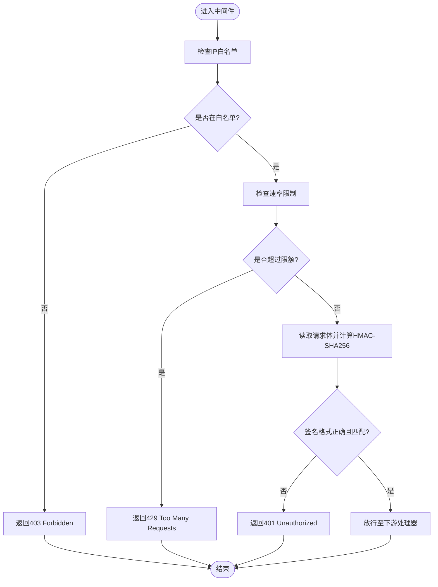
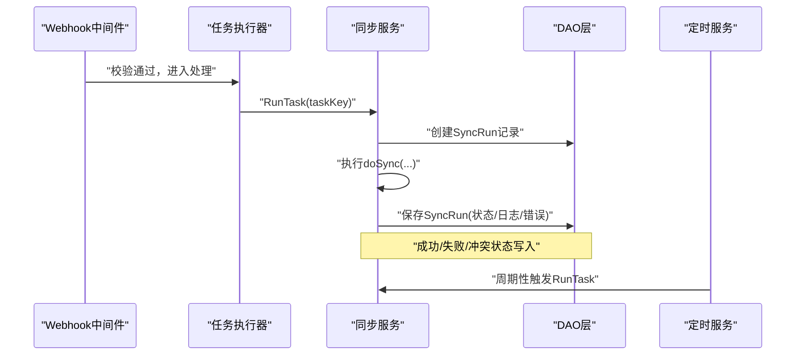
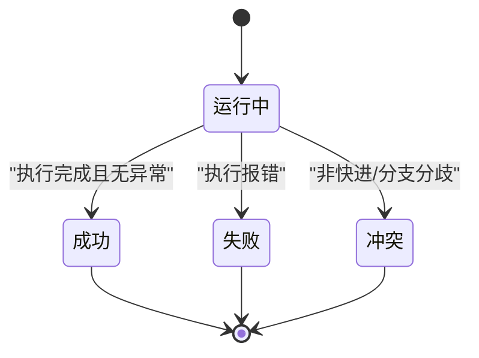
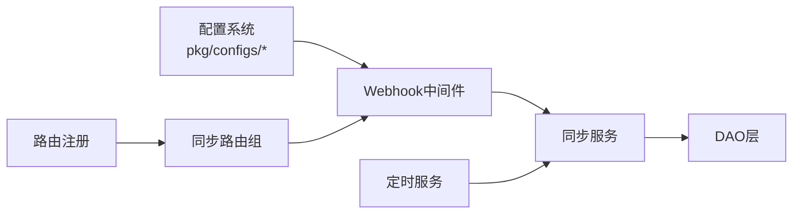

# Webhook机制

<cite>
**本文引用的文件**
- [biz/middleware/webhook.go](file://biz/middleware/webhook.go)
- [docs/webhook.md](file://docs/webhook.md)
- [pkg/configs/config.go](file://pkg/configs/config.go)
- [pkg/configs/model.go](file://pkg/configs/model.go)
- [biz/router/register.go](file://biz/router/register.go)
- [biz/router/sync/sync.go](file://biz/router/sync/sync.go)
- [biz/service/sync/sync_service.go](file://biz/service/sync/sync_service.go)
- [biz/service/sync/cron_service.go](file://biz/service/sync/cron_service.go)
- [biz/model/po/sync_task.go](file://biz/model/po/sync_task.go)
- [biz/model/po/sync_run.go](file://biz/model/po/sync_run.go)
- [test/webhook_client/main.go](file://test/webhook_client/main.go)
- [public/repo_sync.html](file://public/repo_sync.html)
</cite>

## 目录
1. [简介](#简介)
2. [项目结构](#项目结构)
3. [核心组件](#核心组件)
4. [架构总览](#架构总览)
5. [详细组件分析](#详细组件分析)
6. [依赖关系分析](#依赖关系分析)
7. [性能考量](#性能考量)
8. [故障排查指南](#故障排查指南)
9. [结论](#结论)
10. [附录](#附录)

## 简介
本文件系统性阐述本项目的Webhook机制，重点覆盖以下方面：
- Webhook触发流程与事件处理机制
- Webhook中间件的实现逻辑（请求拦截、参数提取、事件分发）
- 支持的Webhook事件类型与触发条件
- Webhook事件数据结构与消息格式
- Webhook处理流程图与时序图
- 与同步服务的集成方式与触发机制
- Webhook事件的生命周期管理与状态跟踪

## 项目结构
Webhook功能由“中间件 + 文档规范 + 同步服务”协同实现，并通过路由注册接入Hertz框架。关键位置如下：
- 中间件：统一的安全校验与限流
- 文档：接口定义、签名算法、调用示例
- 配置：Webhook密钥、速率限制、IP白名单
- 路由：Webhook端点注册
- 同步服务：任务执行与运行记录

图表来源
- [biz/router/register.go](file://biz/router/register.go#L18-L41)
- [biz/router/sync/sync.go](file://biz/router/sync/sync.go#L17-L40)
- [biz/middleware/webhook.go](file://biz/middleware/webhook.go#L18-L68)
- [pkg/configs/config.go](file://pkg/configs/config.go#L18-L42)
- [pkg/configs/model.go](file://pkg/configs/model.go#L29-L33)
- [biz/service/sync/sync_service.go](file://biz/service/sync/sync_service.go#L13-L25)
- [biz/service/sync/cron_service.go](file://biz/service/sync/cron_service.go#L24-L33)
- [docs/webhook.md](file://docs/webhook.md#L1-L133)
- [test/webhook_client/main.go](file://test/webhook_client/main.go#L1-L35)
- [public/repo_sync.html](file://public/repo_sync.html#L297-L305)

章节来源
- [biz/router/register.go](file://biz/router/register.go#L18-L41)
- [biz/router/sync/sync.go](file://biz/router/sync/sync.go#L17-L40)
- [pkg/configs/config.go](file://pkg/configs/config.go#L18-L42)
- [pkg/configs/model.go](file://pkg/configs/model.go#L29-L33)

## 核心组件
- Webhook中间件：负责IP白名单、速率限制、签名验证，并放行后续处理器
- 同步服务：封装任务执行、日志采集、运行状态持久化
- 定时服务：基于Cron表达式周期性触发同步任务
- 配置系统：从配置文件与环境变量加载Webhook密钥、速率限制、IP白名单
- 文档与示例：提供接口定义、签名算法、调用示例与前端交互

章节来源
- [biz/middleware/webhook.go](file://biz/middleware/webhook.go#L18-L68)
- [biz/service/sync/sync_service.go](file://biz/service/sync/sync_service.go#L13-L74)
- [biz/service/sync/cron_service.go](file://biz/service/sync/cron_service.go#L14-L100)
- [pkg/configs/config.go](file://pkg/configs/config.go#L18-L42)
- [docs/webhook.md](file://docs/webhook.md#L1-L133)

## 架构总览
Webhook触发链路分为“入口路由 -> 中间件校验 -> 业务处理 -> 结果返回”。下图展示整体交互：

图表来源
- [biz/router/sync/sync.go](file://biz/router/sync/sync.go#L17-L40)
- [biz/middleware/webhook.go](file://biz/middleware/webhook.go#L18-L68)
- [biz/service/sync/sync_service.go](file://biz/service/sync/sync_service.go#L27-L74)

## 详细组件分析

### Webhook中间件实现逻辑
Webhook中间件按顺序执行三项安全与质量控制：
- IP白名单（可选）：若配置了白名单，则仅允许白名单内的来源访问
- 速率限制：基于每分钟请求数进行限制，超限返回429
- 签名验证：要求请求头包含“X-Hub-Signature-256”，格式为“sha256=<hex>”，并与服务端计算的HMAC一致

图表来源
- [biz/middleware/webhook.go](file://biz/middleware/webhook.go#L18-L68)
- [pkg/configs/config.go](file://pkg/configs/config.go#L18-L42)
- [pkg/configs/model.go](file://pkg/configs/model.go#L29-L33)

章节来源
- [biz/middleware/webhook.go](file://biz/middleware/webhook.go#L18-L68)
- [pkg/configs/config.go](file://pkg/configs/config.go#L18-L42)
- [pkg/configs/model.go](file://pkg/configs/model.go#L29-L33)

### Webhook事件类型与触发条件
- 事件类型：多仓同步任务触发
- 触发条件：外部系统向“/api/webhooks/task-sync”发送POST请求，携带必需的签名头
- 触发参数：请求体包含“task_id”，用于定位需要执行的同步任务

章节来源
- [docs/webhook.md](file://docs/webhook.md#L6-L44)
- [test/webhook_client/main.go](file://test/webhook_client/main.go#L1-L35)

### Webhook事件数据结构与消息格式
- Endpoint：/api/webhooks/task-sync
- Method：POST
- Content-Type：application/json
- 请求头：
  - X-Hub-Signature-256：sha256=<hex_digest>
  - Content-Type：application/json
- 请求体：
  - task_id：uint，必填，表示需要触发的多仓同步任务ID
- 成功响应：
  - 200 OK，返回包含“message”和“task_id”的JSON对象
- 错误响应：
  - 400：请求体格式错误或缺少参数
  - 401：签名无效或缺失
  - 403：IP不在白名单
  - 429：请求过于频繁

章节来源
- [docs/webhook.md](file://docs/webhook.md#L6-L60)

### 与同步服务的集成与触发机制
- 路由注册：同步路由组位于“/api/v1/sync”，其中包含“/execute”等端点；Webhook端点在文档中定义为“/api/webhooks/task-sync”
- 触发路径：Webhook中间件校验通过后，调用同步服务执行任务
- 执行细节：同步服务会创建一次“运行记录”，记录开始时间、状态、提交范围、日志与错误信息，并在完成后更新状态与结束时间
- 定时联动：同步服务与定时服务配合，定时器根据Cron表达式周期性触发任务；Webhook作为一次性触发入口

图表来源
- [biz/middleware/webhook.go](file://biz/middleware/webhook.go#L18-L68)
- [biz/service/sync/sync_service.go](file://biz/service/sync/sync_service.go#L27-L74)
- [biz/service/sync/cron_service.go](file://biz/service/sync/cron_service.go#L84-L99)

章节来源
- [biz/router/sync/sync.go](file://biz/router/sync/sync.go#L17-L40)
- [biz/service/sync/sync_service.go](file://biz/service/sync/sync_service.go#L27-L74)
- [biz/service/sync/cron_service.go](file://biz/service/sync/cron_service.go#L24-L100)

### Webhook事件生命周期与状态跟踪
- 生命周期阶段：
  - 初始化：创建SyncRun记录，状态设为“running”，记录开始时间
  - 执行：执行fetch、比较、fast-forward检查、push等步骤
  - 结束：根据结果设置状态为“success/failed/conflict”，记录结束时间、错误信息与日志
- 数据模型：
  - SyncTask：任务元数据（来源/目标仓库、分支、Cron、启用状态等）
  - SyncRun：单次执行记录（状态、提交范围、详情、时间戳等）

图表来源
- [biz/service/sync/sync_service.go](file://biz/service/sync/sync_service.go#L35-L74)
- [biz/model/po/sync_run.go](file://biz/model/po/sync_run.go#L9-L21)
- [biz/model/po/sync_task.go](file://biz/model/po/sync_task.go#L7-L24)

章节来源
- [biz/service/sync/sync_service.go](file://biz/service/sync/sync_service.go#L35-L74)
- [biz/model/po/sync_run.go](file://biz/model/po/sync_run.go#L9-L21)
- [biz/model/po/sync_task.go](file://biz/model/po/sync_task.go#L7-L24)

## 依赖关系分析
- 中间件依赖配置系统提供的密钥、速率限制与IP白名单
- 路由层将Webhook中间件挂载到对应路径
- 业务层通过DAO持久化任务与运行记录
- 定时服务与同步服务解耦，互不依赖Webhook

图表来源
- [pkg/configs/config.go](file://pkg/configs/config.go#L18-L42)
- [pkg/configs/model.go](file://pkg/configs/model.go#L29-L33)
- [biz/router/register.go](file://biz/router/register.go#L18-L41)
- [biz/router/sync/sync.go](file://biz/router/sync/sync.go#L17-L40)
- [biz/middleware/webhook.go](file://biz/middleware/webhook.go#L18-L68)
- [biz/service/sync/sync_service.go](file://biz/service/sync/sync_service.go#L13-L25)
- [biz/service/sync/cron_service.go](file://biz/service/sync/cron_service.go#L24-L33)

章节来源
- [pkg/configs/config.go](file://pkg/configs/config.go#L18-L42)
- [pkg/configs/model.go](file://pkg/configs/model.go#L29-L33)
- [biz/router/register.go](file://biz/router/register.go#L18-L41)
- [biz/router/sync/sync.go](file://biz/router/sync/sync.go#L17-L40)
- [biz/middleware/webhook.go](file://biz/middleware/webhook.go#L18-L68)
- [biz/service/sync/sync_service.go](file://biz/service/sync/sync_service.go#L13-L25)
- [biz/service/sync/cron_service.go](file://biz/service/sync/cron_service.go#L24-L33)

## 性能考量
- 速率限制：中间件使用令牌桶限流，避免突发流量冲击
- 计算开销：HMAC-SHA256计算与请求体读取为轻量级操作
- I/O瓶颈：同步执行涉及Git操作与数据库写入，建议在高并发场景下结合异步队列或后台任务

## 故障排查指南
- 401 Unauthorized
  - 检查请求头“X-Hub-Signature-256”是否存在且格式为“sha256=<hex>”
  - 确认服务端配置的密钥与客户端计算一致
- 403 Forbidden
  - 检查是否命中IP白名单
- 429 Too Many Requests
  - 降低请求频率或提升配置中的速率限制
- 400/404/5xx
  - 核对端点路径与方法，确认任务ID有效
- 日志与状态
  - 查看SyncRun记录的状态、错误信息与详情字段，定位具体失败环节

章节来源
- [biz/middleware/webhook.go](file://biz/middleware/webhook.go#L18-L68)
- [docs/webhook.md](file://docs/webhook.md#L55-L60)
- [biz/service/sync/sync_service.go](file://biz/service/sync/sync_service.go#L35-L74)

## 结论
本Webhook机制以中间件为核心，提供IP白名单、速率限制与签名验证三重保障；通过文档化的接口规范与示例客户端，确保外部系统可稳定触发多仓同步任务。同步服务与定时服务相互独立，既支持Webhook的一次性触发，也支持Cron的周期性调度，形成完整的事件驱动与计划任务体系。

## 附录
- 前端交互示例：页面提供生成Webhook URL与curl命令的能力，便于快速测试
- 测试客户端：提供Go语言示例，演示如何构造签名并发起请求

章节来源
- [public/repo_sync.html](file://public/repo_sync.html#L297-L305)
- [test/webhook_client/main.go](file://test/webhook_client/main.go#L1-L35)