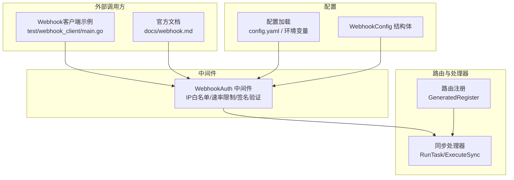
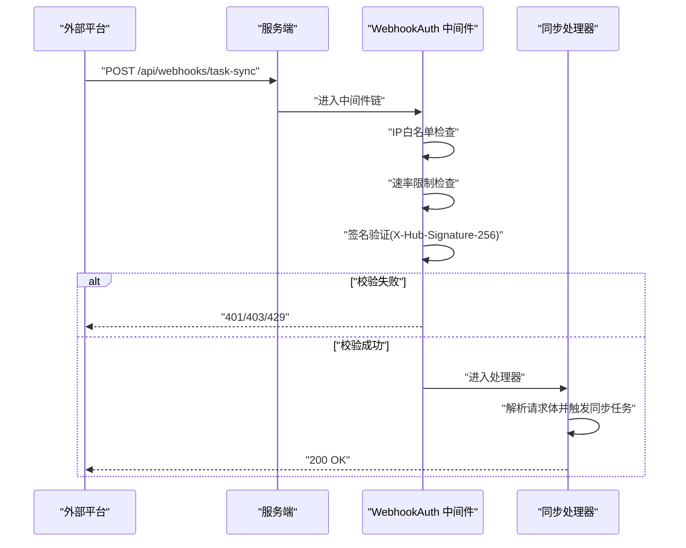
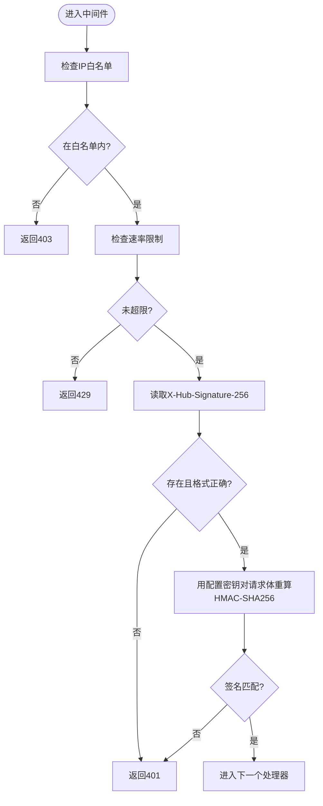
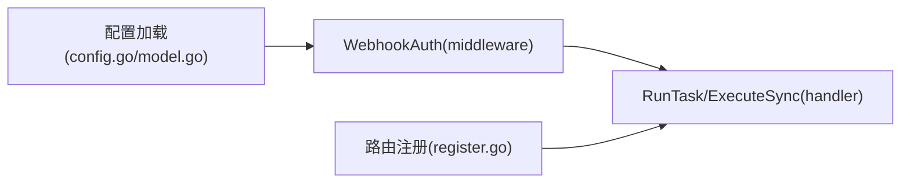

# Webhook集成

<cite>
**本文引用的文件**
- [biz/middleware/webhook.go](file://biz/middleware/webhook.go)
- [docs/webhook.md](file://docs/webhook.md)
- [test/webhook_client/main.go](file://test/webhook_client/main.go)
- [pkg/configs/config.go](file://pkg/configs/config.go)
- [pkg/configs/model.go](file://pkg/configs/model.go)
- [conf/config.yaml](file://conf/config.yaml)
- [biz/router/register.go](file://biz/router/register.go)
- [biz/handler/sync/sync_service.go](file://biz/handler/sync/sync_service.go)
</cite>

## 目录
1. [简介](#简介)
2. [项目结构](#项目结构)
3. [核心组件](#核心组件)
4. [架构总览](#架构总览)
5. [详细组件分析](#详细组件分析)
6. [依赖关系分析](#依赖关系分析)
7. [性能考量](#性能考量)
8. [故障排查指南](#故障排查指南)
9. [结论](#结论)
10. [附录](#附录)

## 简介
本文件面向需要集成Webhook以触发“多仓同步任务”的用户与开发者，系统性说明Webhook触发流程、事件处理机制、签名验证与IP白名单等安全措施，并提供客户端集成示例、测试工具使用指南、支持平台的配置要点、错误处理与重试策略、调试与监控方法以及安全最佳实践与常见问题解答。

## 项目结构
Webhook相关能力由以下模块协同实现：
- 中间件层：统一的安全校验（IP白名单、速率限制、签名验证）
- 配置层：从配置文件与环境变量加载Webhook密钥、速率限制与IP白名单
- 文档与示例：官方接口文档与Go/Python/Bash示例
- 路由与处理器：Webhook入口路由与多仓同步任务执行逻辑

图表来源
- [biz/middleware/webhook.go](file://biz/middleware/webhook.go#L18-L68)
- [pkg/configs/config.go](file://pkg/configs/config.go#L18-L42)
- [pkg/configs/model.go](file://pkg/configs/model.go#L29-L33)
- [biz/router/register.go](file://biz/router/register.go#L18-L41)
- [biz/handler/sync/sync_service.go](file://biz/handler/sync/sync_service.go#L147-L200)

章节来源
- [biz/middleware/webhook.go](file://biz/middleware/webhook.go#L1-L70)
- [pkg/configs/config.go](file://pkg/configs/config.go#L1-L42)
- [pkg/configs/model.go](file://pkg/configs/model.go#L1-L34)
- [conf/config.yaml](file://conf/config.yaml#L21-L24)
- [biz/router/register.go](file://biz/router/register.go#L18-L41)
- [biz/handler/sync/sync_service.go](file://biz/handler/sync/sync_service.go#L147-L200)

## 核心组件
- WebhookAuth 中间件：负责IP白名单检查、速率限制与签名验证
- 配置加载：从配置文件与环境变量读取Webhook密钥、速率限制与IP白名单
- 同步处理器：接收Webhook触发后执行具体的多仓同步任务
- 官方文档与示例：提供接口定义、请求/响应格式与多种语言的调用示例

章节来源
- [biz/middleware/webhook.go](file://biz/middleware/webhook.go#L18-L68)
- [pkg/configs/config.go](file://pkg/configs/config.go#L18-L42)
- [pkg/configs/model.go](file://pkg/configs/model.go#L29-L33)
- [docs/webhook.md](file://docs/webhook.md#L1-L133)
- [test/webhook_client/main.go](file://test/webhook_client/main.go#L1-L36)
- [biz/handler/sync/sync_service.go](file://biz/handler/sync/sync_service.go#L147-L200)

## 架构总览
Webhook触发的整体流程如下：
- 外部平台向服务端发送POST请求至Webhook端点
- 中间件依次执行：IP白名单校验、速率限制、签名验证
- 校验通过后进入同步处理器，根据请求内容触发多仓同步任务
- 返回标准响应给调用方

图表来源
- [biz/middleware/webhook.go](file://biz/middleware/webhook.go#L18-L68)
- [docs/webhook.md](file://docs/webhook.md#L5-L60)
- [biz/handler/sync/sync_service.go](file://biz/handler/sync/sync_service.go#L147-L200)

## 详细组件分析

### WebhookAuth 中间件
- IP白名单：若配置了白名单，则仅允许白名单内的来源访问；否则放行
- 速率限制：基于全局配置的每分钟请求数进行限流，超限返回429
- 签名验证：要求请求头包含X-Hub-Signature-256，格式为sha256=<hex>，并与使用配置密钥对请求体计算的HMAC-SHA256一致

图表来源
- [biz/middleware/webhook.go](file://biz/middleware/webhook.go#L18-L68)

章节来源
- [biz/middleware/webhook.go](file://biz/middleware/webhook.go#L18-L68)

### 配置与环境变量
- 配置文件：webhook.secret、webhook.rate_limit、webhook.ip_whitelist
- 环境变量：支持覆盖部分配置项
- 全局变量：中间件运行时使用的密钥、速率限制与白名单来源于配置

章节来源
- [conf/config.yaml](file://conf/config.yaml#L21-L24)
- [pkg/configs/config.go](file://pkg/configs/config.go#L18-L42)
- [pkg/configs/model.go](file://pkg/configs/model.go#L29-L33)

### 同步处理器与Webhook端点
- Webhook端点：/api/webhooks/task-sync（POST）
- 请求体字段：task_id（uint）
- 处理器行为：解析请求体，触发多仓同步任务（异步执行），返回成功响应
- 注意：当前仓库中未发现名为“/api/webhooks/task-sync”的路由注册，但官方文档与示例明确该端点。建议在路由注册处补充对应路由绑定，或确保该端点由其他方式暴露。

章节来源
- [docs/webhook.md](file://docs/webhook.md#L5-L60)
- [test/webhook_client/main.go](file://test/webhook_client/main.go#L13-L35)
- [biz/handler/sync/sync_service.go](file://biz/handler/sync/sync_service.go#L147-L200)
- [biz/router/register.go](file://biz/router/register.go#L18-L41)

### 安全措施详解
- 签名验证：要求请求头X-Hub-Signature-256，格式为sha256=<hex>，服务端使用相同密钥对请求体重算并比对
- IP白名单：可选功能，仅允许白名单中的来源访问
- 速率限制：防止滥用与DDoS，超限返回429

章节来源
- [biz/middleware/webhook.go](file://biz/middleware/webhook.go#L18-L68)
- [docs/webhook.md](file://docs/webhook.md#L11-L25)

### 错误处理与状态码
- 400：请求体格式错误或缺少必要参数
- 401：签名缺失、格式不正确或签名不匹配
- 403：IP不在白名单
- 429：超出速率限制

章节来源
- [docs/webhook.md](file://docs/webhook.md#L55-L60)

### 事件类型、消息格式与处理逻辑
- 事件类型：多仓同步触发
- 消息格式：application/json，请求体包含task_id
- 处理逻辑：解析task_id，触发对应的同步任务（异步执行）

章节来源
- [docs/webhook.md](file://docs/webhook.md#L26-L44)
- [biz/handler/sync/sync_service.go](file://biz/handler/sync/sync_service.go#L147-L200)

### 重试策略
- 客户端侧：当收到429时，应按指数退避策略重试；当收到401/403时，需检查签名与白名单配置后再重试
- 服务端侧：中间件已内置速率限制，避免过载

章节来源
- [biz/middleware/webhook.go](file://biz/middleware/webhook.go#L36-L40)
- [docs/webhook.md](file://docs/webhook.md#L19-L21)

### 调试工具与监控
- 调试工具：官方文档提供Python/Go/Bash示例，便于快速验证签名与请求
- 监控建议：记录中间件拦截原因（IP拒绝、签名失败、限流）、统计成功率与延迟、告警异常峰值

章节来源
- [docs/webhook.md](file://docs/webhook.md#L61-L133)
- [test/webhook_client/main.go](file://test/webhook_client/main.go#L1-L36)

### 客户端集成示例与测试工具
- 官方示例：Python/Go/Bash三种语言的完整调用示例
- 测试工具：仓库提供独立的Go客户端示例，可直接运行验证签名与请求

章节来源
- [docs/webhook.md](file://docs/webhook.md#L61-L133)
- [test/webhook_client/main.go](file://test/webhook_client/main.go#L1-L36)

### 支持的Webhook平台与配置说明
- 平台通用性：当前实现遵循X-Hub-Signature-256头部约定，适用于GitHub风格的Webhook平台
- 配置要点：设置webhook.secret、webhook.rate_limit、webhook.ip_whitelist；在平台侧配置回调URL与密钥

章节来源
- [docs/webhook.md](file://docs/webhook.md#L11-L25)
- [conf/config.yaml](file://conf/config.yaml#L21-L24)

## 依赖关系分析
- 中间件依赖配置模块提供的密钥、速率限制与白名单
- 路由注册负责将Webhook端点与处理器绑定
- 处理器依赖同步服务执行具体任务

图表来源
- [pkg/configs/config.go](file://pkg/configs/config.go#L18-L42)
- [pkg/configs/model.go](file://pkg/configs/model.go#L29-L33)
- [biz/middleware/webhook.go](file://biz/middleware/webhook.go#L16-L16)
- [biz/router/register.go](file://biz/router/register.go#L18-L41)
- [biz/handler/sync/sync_service.go](file://biz/handler/sync/sync_service.go#L147-L200)

章节来源
- [pkg/configs/config.go](file://pkg/configs/config.go#L18-L42)
- [pkg/configs/model.go](file://pkg/configs/model.go#L29-L33)
- [biz/middleware/webhook.go](file://biz/middleware/webhook.go#L16-L16)
- [biz/router/register.go](file://biz/router/register.go#L18-L41)
- [biz/handler/sync/sync_service.go](file://biz/handler/sync/sync_service.go#L147-L200)

## 性能考量
- 速率限制：默认每分钟100次，可根据业务量调整
- 异步执行：处理器内部采用异步启动任务，避免阻塞请求线程
- 建议：结合限流与异步策略，配合日志与监控，持续评估并发与延迟表现

章节来源
- [docs/webhook.md](file://docs/webhook.md#L19-L21)
- [biz/handler/sync/sync_service.go](file://biz/handler/sync/sync_service.go#L156-L162)

## 故障排查指南
- 401 Unauthorized
  - 检查是否添加X-Hub-Signature-256头且格式为sha256=<hex>
  - 确认服务端与平台侧使用相同的密钥
- 403 Forbidden
  - 检查是否配置了IP白名单且当前来源在白名单内
- 429 Too Many Requests
  - 降低请求频率或提升配置的rate_limit
- 400 Bad Request
  - 检查请求体格式与必填字段task_id
- 端点不可达
  - 确认路由已注册到/api/webhooks/task-sync

章节来源
- [biz/middleware/webhook.go](file://biz/middleware/webhook.go#L31-L65)
- [docs/webhook.md](file://docs/webhook.md#L55-L60)

## 结论
本Webhook集成方案提供了完善的签名验证、IP白名单与速率限制等安全措施，并通过官方示例与测试工具降低了集成门槛。建议在生产环境中启用IP白名单与合理的速率限制，结合日志与监控持续优化性能与稳定性。

## 附录

### 接口定义与示例摘要
- 端点：/api/webhooks/task-sync
- 方法：POST
- 内容类型：application/json
- 请求头：X-Hub-Signature-256、Content-Type
- 请求体：task_id（uint）
- 响应：200 OK（包含消息与task_id）

章节来源
- [docs/webhook.md](file://docs/webhook.md#L5-L60)