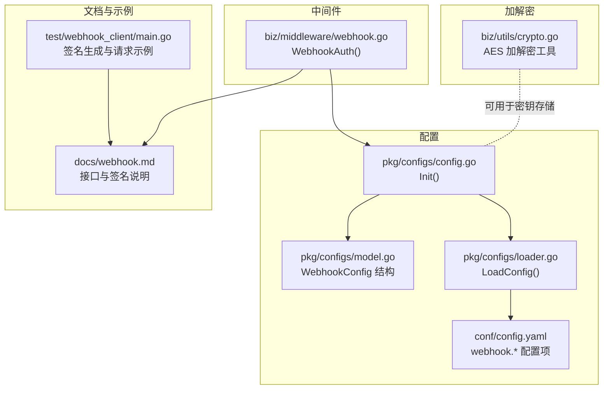
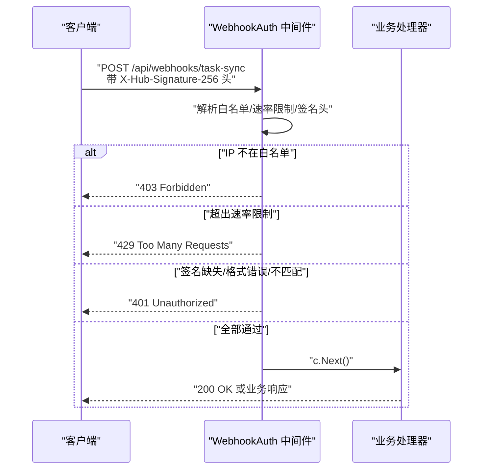
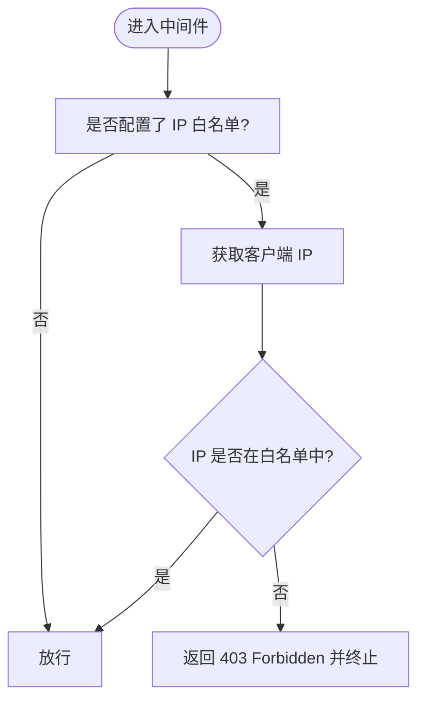
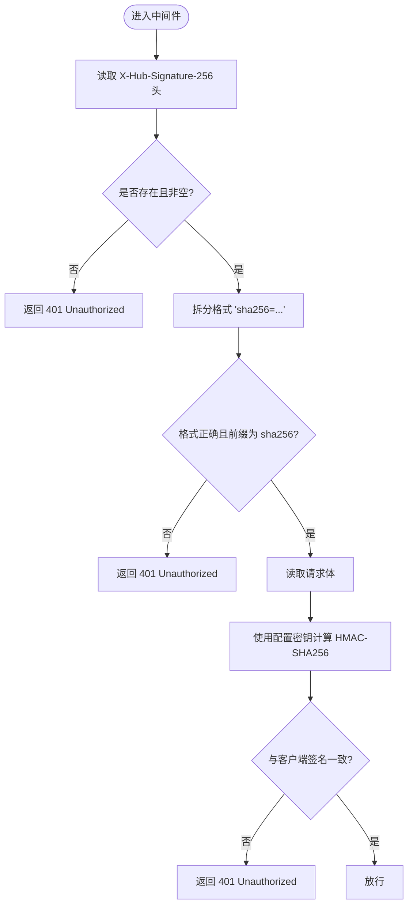
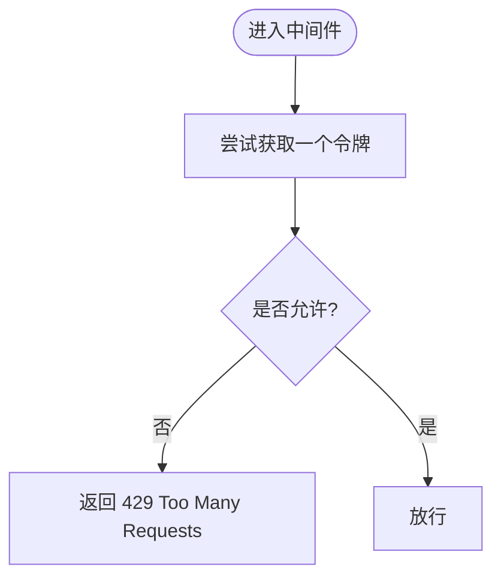
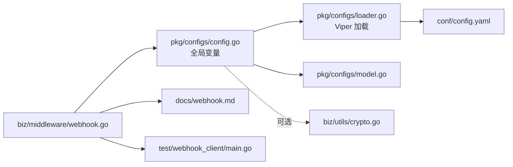

# 安全验证

<cite>
**本文引用的文件**
- [biz/middleware/webhook.go](file://biz/middleware/webhook.go)
- [pkg/configs/config.go](file://pkg/configs/config.go)
- [pkg/configs/loader.go](file://pkg/configs/loader.go)
- [pkg/configs/model.go](file://pkg/configs/model.go)
- [conf/config.yaml](file://conf/config.yaml)
- [docs/webhook.md](file://docs/webhook.md)
- [test/webhook_client/main.go](file://test/webhook_client/main.go)
- [biz/utils/crypto.go](file://biz/utils/crypto.go)
</cite>

## 目录
1. [简介](#简介)
2. [项目结构](#项目结构)
3. [核心组件](#核心组件)
4. [架构总览](#架构总览)
5. [详细组件分析](#详细组件分析)
6. [依赖关系分析](#依赖关系分析)
7. [性能考量](#性能考量)
8. [故障排除指南](#故障排除指南)
9. [结论](#结论)
10. [附录](#附录)

## 简介
本文件聚焦于系统中的 Webhook 安全验证机制，覆盖以下方面：
- IP 白名单验证的实现与配置
- HMAC SHA256 签名验证的算法原理与实现细节
- Webhook 密钥管理与安全配置指南
- 速率限制与防滥用策略
- HTTPS 配置与证书管理要求
- 安全最佳实践、常见威胁与防护措施
- 安全配置示例与故障排除

## 项目结构
围绕 Webhook 安全验证的相关模块分布如下：
- 中间件层：负责请求拦截、IP 白名单校验、速率限制、HMAC 签名校验
- 配置层：加载 YAML 配置与环境变量，暴露全局配置与兼容性变量
- 文档与示例：提供接口定义、签名算法说明、调用示例与错误码
- 加解密工具：提供对称加密能力（与 Webhook 安全无直接耦合，但可用于密钥存储等场景）

图表来源
- [biz/middleware/webhook.go](file://biz/middleware/webhook.go#L1-L70)
- [pkg/configs/config.go](file://pkg/configs/config.go#L1-L43)
- [pkg/configs/loader.go](file://pkg/configs/loader.go#L1-L46)
- [pkg/configs/model.go](file://pkg/configs/model.go#L1-L34)
- [conf/config.yaml](file://conf/config.yaml#L1-L25)
- [docs/webhook.md](file://docs/webhook.md#L1-L133)
- [test/webhook_client/main.go](file://test/webhook_client/main.go#L1-L36)
- [biz/utils/crypto.go](file://biz/utils/crypto.go#L1-L71)

章节来源
- [biz/middleware/webhook.go](file://biz/middleware/webhook.go#L1-L70)
- [pkg/configs/config.go](file://pkg/configs/config.go#L1-L43)
- [pkg/configs/loader.go](file://pkg/configs/loader.go#L1-L46)
- [pkg/configs/model.go](file://pkg/configs/model.go#L1-L34)
- [conf/config.yaml](file://conf/config.yaml#L1-L25)
- [docs/webhook.md](file://docs/webhook.md#L1-L133)
- [test/webhook_client/main.go](file://test/webhook_client/main.go#L1-L36)
- [biz/utils/crypto.go](file://biz/utils/crypto.go#L1-L71)

## 核心组件
- Webhook 安全中间件：统一处理 IP 白名单、速率限制、HMAC SHA256 签名验证
- 配置加载器：从 YAML 文件与环境变量加载 Webhook 配置，并维护全局变量
- 文档与示例：提供接口规范、签名算法与调用示例
- 加密工具：提供对称加密能力，可用于安全存储密钥等场景

章节来源
- [biz/middleware/webhook.go](file://biz/middleware/webhook.go#L1-L70)
- [pkg/configs/config.go](file://pkg/configs/config.go#L1-L43)
- [pkg/configs/loader.go](file://pkg/configs/loader.go#L1-L46)
- [docs/webhook.md](file://docs/webhook.md#L1-L133)
- [biz/utils/crypto.go](file://biz/utils/crypto.go#L1-L71)

## 架构总览
Webhook 安全验证的整体流程如下：
- 请求进入中间件后，按顺序执行 IP 白名单检查、速率限制检查、HMAC 签名校验
- 校验通过后放行到后续处理器；任一环节失败则返回对应错误码

图表来源
- [biz/middleware/webhook.go](file://biz/middleware/webhook.go#L18-L68)
- [docs/webhook.md](file://docs/webhook.md#L11-L60)

## 详细组件分析

### IP 白名单验证机制
- 实现方式：中间件读取配置中的 IP 列表，若配置存在，则仅允许列表内的客户端 IP 访问
- 配置入口：
  - YAML 配置项：webhook.ip_whitelist
  - 兼容变量：WebhookIPWhitelist
  - 环境变量覆盖：通过 LoadConfig 的 AutomaticEnv 自动生效
- 生效范围：对所有 Webhook 路由生效

图表来源
- [biz/middleware/webhook.go](file://biz/middleware/webhook.go#L20-L34)
- [pkg/configs/config.go](file://pkg/configs/config.go#L28-L31)
- [pkg/configs/loader.go](file://pkg/configs/loader.go#L28-L37)
- [conf/config.yaml](file://conf/config.yaml#L24)

章节来源
- [biz/middleware/webhook.go](file://biz/middleware/webhook.go#L20-L34)
- [pkg/configs/config.go](file://pkg/configs/config.go#L28-L31)
- [pkg/configs/loader.go](file://pkg/configs/loader.go#L28-L37)
- [conf/config.yaml](file://conf/config.yaml#L24)

### HMAC SHA256 签名验证
- 算法原理：使用共享密钥对请求体进行 HMAC-SHA256 计算，比较服务端计算结果与客户端传入的签名
- 请求头约定：X-Hub-Signature-256，格式为 sha256=<hex_digest>
- 实现要点：
  - 解析头部并校验格式
  - 使用配置中的 WebhookSecret 对请求体进行签名计算
  - 使用恒定时间比较函数避免时序攻击
- 生效范围：对所有 Webhook 路由生效

图表来源
- [biz/middleware/webhook.go](file://biz/middleware/webhook.go#L42-L65)
- [docs/webhook.md](file://docs/webhook.md#L13-L18)

章节来源
- [biz/middleware/webhook.go](file://biz/middleware/webhook.go#L42-L65)
- [docs/webhook.md](file://docs/webhook.md#L13-L18)

### 速率限制与防滥用策略
- 限流算法：基于令牌桶（golang.org/x/time/rate）实现
- 配置项：webhook.rate_limit（单位：每分钟请求数）
- 行为：超过阈值立即返回 429 Too Many Requests
- 注意：当前实现为进程内限流，建议在多副本部署时采用分布式限流方案

图表来源
- [biz/middleware/webhook.go](file://biz/middleware/webhook.go#L16-L40)
- [docs/webhook.md](file://docs/webhook.md#L19-L21)

章节来源
- [biz/middleware/webhook.go](file://biz/middleware/webhook.go#L16-L40)
- [docs/webhook.md](file://docs/webhook.md#L19-L21)

### Webhook 密钥管理与安全配置
- 密钥来源：webhook.secret
- 配置优先级：
  - YAML 文件默认值
  - 环境变量覆盖（如 WEBHOOK_SECRET）
  - 运行时初始化更新全局变量
- 最佳实践：
  - 使用强随机密钥，长度至少 32 字节
  - 将密钥存储在只读的机密管理器中，避免硬编码
  - 定期轮换密钥，旧密钥在迁移期间可短期保留
  - 仅在 HTTPS 环境下传输密钥与请求
- 可选：结合加密工具对敏感配置进行本地存储（注意与 Webhook 签名密钥解耦）

章节来源
- [conf/config.yaml](file://conf/config.yaml#L21-L23)
- [pkg/configs/loader.go](file://pkg/configs/loader.go#L24-L26)
- [pkg/configs/config.go](file://pkg/configs/config.go#L33-L37)
- [biz/utils/crypto.go](file://biz/utils/crypto.go#L15-L22)

### HTTPS 配置与证书管理
- 强制要求：生产环境必须启用 HTTPS，防止中间人攻击与明文泄露
- 证书管理建议：
  - 使用受信 CA 签发的证书
  - 启用 TLS 1.2+，禁用过时协议与弱密码套件
  - 使用自动化证书续期（如 ACME）
  - 将证书与私钥置于只读权限的安全存储中
- 与 Webhook 的关联：HTTPS 保障签名头与请求体在传输过程中的完整性与保密性

[本节为通用安全建议，不直接分析具体文件]

### 安全最佳实践与常见威胁防护
- 最佳实践：
  - 始终启用 HTTPS 与强 TLS 配置
  - 严格最小权限原则：仅授予必要 IP 与最小密钥权限
  - 定期审计日志与告警，监控异常 429/401/403 次数
  - 使用分布式限流与熔断保护，避免雪崩效应
  - 对外暴露的 Webhook 路由应具备独立鉴权与隔离
- 常见威胁与防护：
  - 重放攻击：结合时间戳与一次性 nonce（如需），并在业务侧做幂等控制
  - 中间人攻击：强制 HTTPS，校验证书链与主机名
  - 暴力破解：速率限制 + 黑名单 + 多因子（可选）
  - 供应链风险：密钥轮换与最小暴露面

[本节为通用安全建议，不直接分析具体文件]

## 依赖关系分析
- 中间件依赖配置模块提供的全局变量与结构化配置
- 配置模块依赖 Viper 读取 YAML 与环境变量，并设置默认值
- 文档与示例为外部使用者提供参考，与实现保持一致

图表来源
- [biz/middleware/webhook.go](file://biz/middleware/webhook.go#L1-L70)
- [pkg/configs/config.go](file://pkg/configs/config.go#L1-L43)
- [pkg/configs/loader.go](file://pkg/configs/loader.go#L1-L46)
- [pkg/configs/model.go](file://pkg/configs/model.go#L1-L34)
- [conf/config.yaml](file://conf/config.yaml#L1-L25)
- [docs/webhook.md](file://docs/webhook.md#L1-L133)
- [test/webhook_client/main.go](file://test/webhook_client/main.go#L1-L36)
- [biz/utils/crypto.go](file://biz/utils/crypto.go#L1-L71)

章节来源
- [biz/middleware/webhook.go](file://biz/middleware/webhook.go#L1-L70)
- [pkg/configs/config.go](file://pkg/configs/config.go#L1-L43)
- [pkg/configs/loader.go](file://pkg/configs/loader.go#L1-L46)
- [pkg/configs/model.go](file://pkg/configs/model.go#L1-L34)
- [conf/config.yaml](file://conf/config.yaml#L1-L25)
- [docs/webhook.md](file://docs/webhook.md#L1-L133)
- [test/webhook_client/main.go](file://test/webhook_client/main.go#L1-L36)
- [biz/utils/crypto.go](file://biz/utils/crypto.go#L1-L71)

## 性能考量
- 速率限制为进程内令牌桶，适合单实例；多副本部署建议使用集中式限流（如 Redis）
- HMAC 计算与字符串解析开销极低，瓶颈通常在网络与磁盘 IO
- 建议：
  - 对高频 Webhook 场景启用异步处理与队列
  - 合理设置 rate_limit，避免误伤正常流量
  - 在网关层前置限流与 WAF，减轻应用压力

[本节为通用性能建议，不直接分析具体文件]

## 故障排除指南
- 401 Unauthorized
  - 现象：签名缺失、格式错误或签名不匹配
  - 排查：确认请求头 X-Hub-Signature-256 格式为 sha256=<hex>；确保使用相同密钥与请求体计算签名
  - 参考：中间件签名解析逻辑与文档示例
- 403 Forbidden
  - 现象：客户端 IP 不在白名单
  - 排查：核对 webhook.ip_whitelist 配置与实际来源 IP
- 429 Too Many Requests
  - 现象：超出 rate_limit
  - 排查：降低发送频率或提升 webhook.rate_limit；考虑分布式限流
- 环境变量未生效
  - 现象：WEBHOOK_SECRET 未被识别
  - 排查：确认环境变量命名与加载顺序；检查初始化流程

章节来源
- [biz/middleware/webhook.go](file://biz/middleware/webhook.go#L30-L65)
- [docs/webhook.md](file://docs/webhook.md#L55-L60)
- [pkg/configs/config.go](file://pkg/configs/config.go#L33-L37)
- [pkg/configs/loader.go](file://pkg/configs/loader.go#L28-L37)

## 结论
本项目通过“IP 白名单 + 速率限制 + HMAC-SHA256 签名”的组合策略，提供了 Webhook 的基础安全能力。建议在生产环境中配合 HTTPS、分布式限流、密钥轮换与严格的访问控制，进一步提升整体安全性与稳定性。

[本节为总结，不直接分析具体文件]

## 附录

### 配置项一览（YAML 与环境变量）
- webhook.secret：Webhook 签名密钥
- webhook.rate_limit：每分钟最大请求数
- webhook.ip_whitelist：允许的客户端 IP 列表
- 环境变量：WEBHOOK_SECRET 可覆盖密钥

章节来源
- [conf/config.yaml](file://conf/config.yaml#L21-L24)
- [pkg/configs/loader.go](file://pkg/configs/loader.go#L24-L26)
- [pkg/configs/config.go](file://pkg/configs/config.go#L33-L37)

### 安全配置示例（步骤说明）
- 设置 webhook.secret：在 YAML 中配置或通过 WEBHOOK_SECRET 注入
- 配置 webhook.rate_limit：根据业务峰值合理设置
- 配置 webhook.ip_whitelist：仅允许可信来源
- 启用 HTTPS：在网关或服务端启用 TLS，使用强密码套件
- 密钥轮换：先启用新密钥，再切换流量，最后清理旧密钥

章节来源
- [conf/config.yaml](file://conf/config.yaml#L21-L24)
- [pkg/configs/config.go](file://pkg/configs/config.go#L33-L37)
- [docs/webhook.md](file://docs/webhook.md#L11-L25)