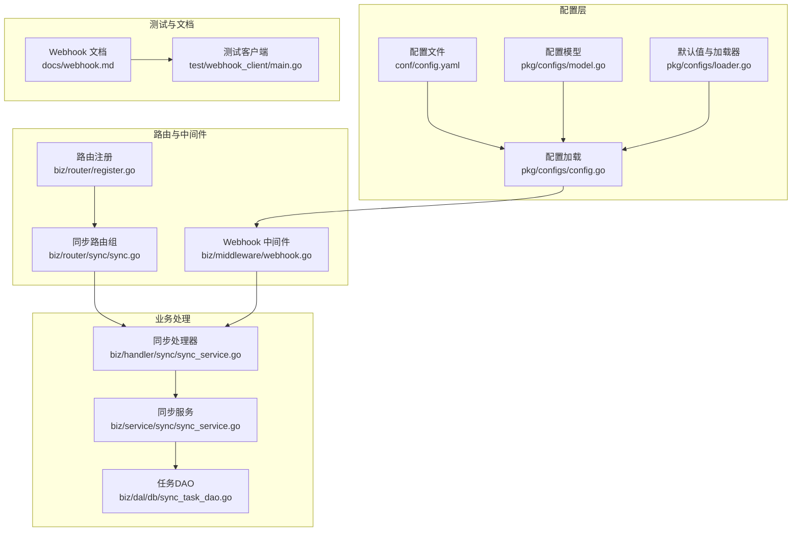
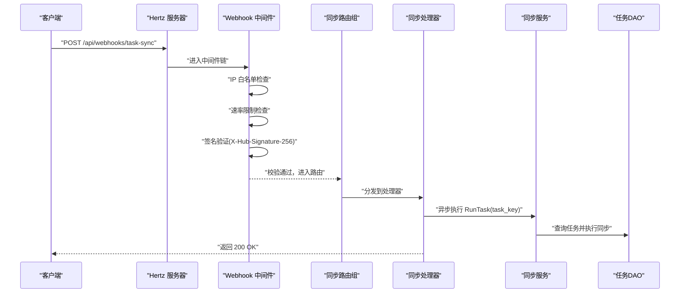
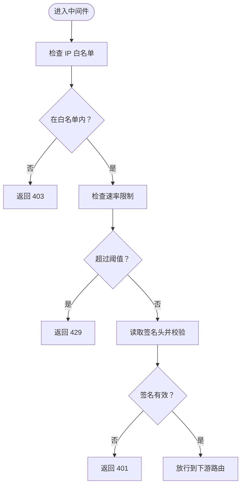
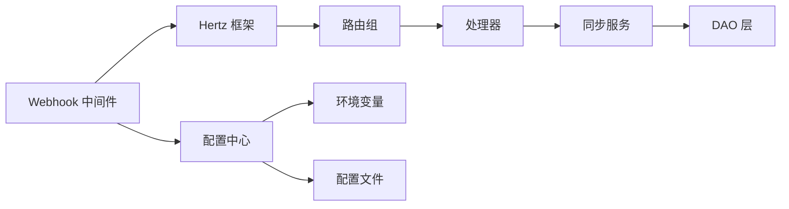

# 客户端集成

<cite>
**本文引用的文件**
- [docs/webhook.md](file://docs/webhook.md)
- [biz/middleware/webhook.go](file://biz/middleware/webhook.go)
- [test/webhook_client/main.go](file://test/webhook_client/main.go)
- [pkg/configs/config.go](file://pkg/configs/config.go)
- [conf/config.yaml](file://conf/config.yaml)
- [biz/router/register.go](file://biz/router/register.go)
- [biz/router/sync/sync.go](file://biz/router/sync/sync.go)
- [biz/handler/sync/sync_service.go](file://biz/handler/sync/sync_service.go)
- [biz/service/sync/sync_service.go](file://biz/service/sync/sync_service.go)
- [biz/dal/db/sync_task_dao.go](file://biz/dal/db/sync_task_dao.go)
- [biz/model/api/sync.go](file://biz/model/api/sync.go)
- [pkg/configs/loader.go](file://pkg/configs/loader.go)
- [pkg/configs/model.go](file://pkg/configs/model.go)
</cite>

## 目录
1. [简介](#简介)
2. [项目结构](#项目结构)
3. [核心组件](#核心组件)
4. [架构总览](#架构总览)
5. [详细组件分析](#详细组件分析)
6. [依赖关系分析](#依赖关系分析)
7. [性能考虑](#性能考虑)
8. [故障排查指南](#故障排查指南)
9. [结论](#结论)
10. [附录](#附录)

## 简介
本文件面向需要在外部系统中集成 Webhook 的开发者，提供从接口定义、安全校验、路由与中间件到业务执行的完整集成指南。当前系统提供一个用于触发“多仓同步任务”的 Webhook 接口，具备签名验证、频率限制与可选 IP 白名单能力，并配套了测试客户端与配置说明，便于快速完成对接与联调。

## 项目结构
围绕 Webhook 的关键目录与文件如下：
- 文档与接口说明：docs/webhook.md
- Webhook 中间件：biz/middleware/webhook.go
- 配置加载与默认值：pkg/configs/config.go、pkg/configs/loader.go、pkg/configs/model.go、conf/config.yaml
- 路由注册：biz/router/register.go、biz/router/sync/sync.go
- 同步任务处理：biz/handler/sync/sync_service.go、biz/service/sync/sync_service.go、biz/dal/db/sync_task_dao.go
- 测试客户端：test/webhook_client/main.go

图表来源
- [biz/router/register.go](file://biz/router/register.go#L18-L41)
- [biz/router/sync/sync.go](file://biz/router/sync/sync.go#L17-L40)
- [biz/middleware/webhook.go](file://biz/middleware/webhook.go#L18-L68)
- [biz/handler/sync/sync_service.go](file://biz/handler/sync/sync_service.go#L147-L163)
- [biz/service/sync/sync_service.go](file://biz/service/sync/sync_service.go#L27-L74)
- [biz/dal/db/sync_task_dao.go](file://biz/dal/db/sync_task_dao.go#L31-L35)
- [conf/config.yaml](file://conf/config.yaml#L21-L24)
- [pkg/configs/config.go](file://pkg/configs/config.go#L18-L42)
- [pkg/configs/model.go](file://pkg/configs/model.go#L5-L6)
- [pkg/configs/loader.go](file://pkg/configs/loader.go#L23-L25)
- [docs/webhook.md](file://docs/webhook.md#L1-L133)
- [test/webhook_client/main.go](file://test/webhook_client/main.go#L13-L35)

章节来源
- [biz/router/register.go](file://biz/router/register.go#L18-L41)
- [biz/router/sync/sync.go](file://biz/router/sync/sync.go#L17-L40)
- [biz/middleware/webhook.go](file://biz/middleware/webhook.go#L18-L68)
- [biz/handler/sync/sync_service.go](file://biz/handler/sync/sync_service.go#L147-L163)
- [biz/service/sync/sync_service.go](file://biz/service/sync/sync_service.go#L27-L74)
- [biz/dal/db/sync_task_dao.go](file://biz/dal/db/sync_task_dao.go#L31-L35)
- [conf/config.yaml](file://conf/config.yaml#L21-L24)
- [pkg/configs/config.go](file://pkg/configs/config.go#L18-L42)
- [pkg/configs/model.go](file://pkg/configs/model.go#L5-L6)
- [pkg/configs/loader.go](file://pkg/configs/loader.go#L23-L25)
- [docs/webhook.md](file://docs/webhook.md#L1-L133)
- [test/webhook_client/main.go](file://test/webhook_client/main.go#L13-L35)

## 核心组件
- Webhook 接口与安全策略
  - 接口：POST /api/webhooks/task-sync
  - 内容类型：application/json
  - 签名头：X-Hub-Signature-256（sha256=hex）
  - 频率限制：默认每分钟 100 次
  - 可选 IP 白名单
- Webhook 中间件
  - 支持 IP 白名单、速率限制与签名验证
  - 使用配置中心的 WebhookSecret、WebhookRateLimit、WebhookIPWhitelist
- 配置体系
  - 默认值来源于 pkg/configs/loader.go
  - 运行时可被 conf/config.yaml 覆盖
  - 支持环境变量覆盖（如 WEBHOOK_SECRET）
- 业务处理链路
  - 路由注册在 biz/router/sync/sync.go 中
  - 处理器在 biz/handler/sync/sync_service.go 中触发异步执行
  - 服务层在 biz/service/sync/sync_service.go 中执行具体同步逻辑
  - 数据访问在 biz/dal/db/sync_task_dao.go 中完成

章节来源
- [docs/webhook.md](file://docs/webhook.md#L7-L60)
- [biz/middleware/webhook.go](file://biz/middleware/webhook.go#L18-L68)
- [pkg/configs/config.go](file://pkg/configs/config.go#L18-L42)
- [pkg/configs/loader.go](file://pkg/configs/loader.go#L23-L25)
- [conf/config.yaml](file://conf/config.yaml#L21-L24)
- [biz/router/sync/sync.go](file://biz/router/sync/sync.go#L17-L40)
- [biz/handler/sync/sync_service.go](file://biz/handler/sync/sync_service.go#L147-L163)
- [biz/service/sync/sync_service.go](file://biz/service/sync/sync_service.go#L27-L74)
- [biz/dal/db/sync_task_dao.go](file://biz/dal/db/sync_task_dao.go#L31-L35)

## 架构总览
下图展示了 Webhook 从请求进入、安全校验、路由分发到业务执行的整体流程。

图表来源
- [biz/middleware/webhook.go](file://biz/middleware/webhook.go#L18-L68)
- [biz/router/sync/sync.go](file://biz/router/sync/sync.go#L17-L40)
- [biz/handler/sync/sync_service.go](file://biz/handler/sync/sync_service.go#L147-L163)
- [biz/service/sync/sync_service.go](file://biz/service/sync/sync_service.go#L27-L74)
- [biz/dal/db/sync_task_dao.go](file://biz/dal/db/sync_task_dao.go#L31-L35)

## 详细组件分析

### Webhook 中间件
- 功能要点
  - IP 白名单：若配置了白名单，则仅允许白名单内的来源访问
  - 速率限制：基于令牌桶限流，每秒允许的请求数由配置决定
  - 签名验证：要求请求头 X-Hub-Signature-256，格式为 sha256=<hex>
- 关键行为
  - 缺少签名或格式不正确直接拒绝
  - 签名计算采用 HMAC-SHA256，密钥来自配置中心
  - 速率超限返回 429

图表来源
- [biz/middleware/webhook.go](file://biz/middleware/webhook.go#L18-L68)

章节来源
- [biz/middleware/webhook.go](file://biz/middleware/webhook.go#L18-L68)

### 配置体系与默认值
- 默认值来源
  - pkg/configs/loader.go 设置 webhook.secret、webhook.rate_limit、webhook.ip_whitelist 的默认值
- 运行时覆盖
  - conf/config.yaml 提供运行时配置项
  - pkg/configs/config.go 在初始化时将配置写入全局变量，并支持环境变量覆盖（如 WEBHOOK_SECRET）
- 生效路径
  - 中间件直接读取全局变量进行校验与限流

章节来源
- [pkg/configs/loader.go](file://pkg/configs/loader.go#L23-L25)
- [pkg/configs/config.go](file://pkg/configs/config.go#L18-L42)
- [conf/config.yaml](file://conf/config.yaml#L21-L24)

### 路由与处理器
- 路由注册
  - biz/router/register.go 注册各模块路由，包括同步模块
  - biz/router/sync/sync.go 定义 /api/v1/sync 下的路由组与方法
- 处理器
  - biz/handler/sync/sync_service.go 中的 RunTask 方法接收请求体中的 task_key 并异步触发同步
- 业务执行
  - biz/service/sync/sync_service.go 执行实际的 fetch、fast-forward 检查与 push
  - biz/dal/db/sync_task_dao.go 查询任务配置

章节来源
- [biz/router/register.go](file://biz/router/register.go#L18-L41)
- [biz/router/sync/sync.go](file://biz/router/sync/sync.go#L17-L40)
- [biz/handler/sync/sync_service.go](file://biz/handler/sync/sync_service.go#L147-L163)
- [biz/service/sync/sync_service.go](file://biz/service/sync/sync_service.go#L27-L74)
- [biz/dal/db/sync_task_dao.go](file://biz/dal/db/sync_task_dao.go#L31-L35)

### 数据模型与响应
- 同步运行记录 DTO
  - biz/model/api/sync.go 定义了 SyncRunDTO 结构，包含任务状态、时间戳、错误信息等字段
- 响应封装
  - 处理器统一通过响应封装模块返回结果，便于前端与外部系统消费

章节来源
- [biz/model/api/sync.go](file://biz/model/api/sync.go#L9-L40)

### 测试客户端
- 功能
  - 构造请求体与签名头，向 /api/webhooks/task-sync 发送 POST 请求
  - 读取并打印响应状态与正文
- 使用场景
  - 快速验证签名算法、网络连通性与服务可用性

章节来源
- [test/webhook_client/main.go](file://test/webhook_client/main.go#L13-L35)

## 依赖关系分析
- 组件耦合
  - 中间件依赖配置中心提供的密钥与限流参数
  - 处理器依赖同步服务与 DAO 层
  - 路由注册集中于生成文件，便于扩展与维护
- 外部依赖
  - Hertz 框架负责 HTTP 路由与中间件链
  - rate 限流库用于速率控制
  - HMAC-SHA256 用于签名验证

图表来源
- [biz/middleware/webhook.go](file://biz/middleware/webhook.go#L18-L68)
- [pkg/configs/config.go](file://pkg/configs/config.go#L18-L42)
- [conf/config.yaml](file://conf/config.yaml#L21-L24)
- [biz/router/sync/sync.go](file://biz/router/sync/sync.go#L17-L40)
- [biz/handler/sync/sync_service.go](file://biz/handler/sync/sync_service.go#L147-L163)
- [biz/service/sync/sync_service.go](file://biz/service/sync/sync_service.go#L27-L74)
- [biz/dal/db/sync_task_dao.go](file://biz/dal/db/sync_task_dao.go#L31-L35)

章节来源
- [biz/middleware/webhook.go](file://biz/middleware/webhook.go#L18-L68)
- [pkg/configs/config.go](file://pkg/configs/config.go#L18-L42)
- [conf/config.yaml](file://conf/config.yaml#L21-L24)
- [biz/router/sync/sync.go](file://biz/router/sync/sync.go#L17-L40)
- [biz/handler/sync/sync_service.go](file://biz/handler/sync/sync_service.go#L147-L163)
- [biz/service/sync/sync_service.go](file://biz/service/sync/sync_service.go#L27-L74)
- [biz/dal/db/sync_task_dao.go](file://biz/dal/db/sync_task_dao.go#L31-L35)

## 性能考虑
- 速率限制
  - 默认每分钟 100 次，可根据业务压力调整配置
- 异步执行
  - 处理器采用 goroutine 异步触发同步，避免阻塞请求线程
- 日志与可观测性
  - 同步服务内部记录命令与日志，便于定位性能瓶颈与异常

章节来源
- [biz/middleware/webhook.go](file://biz/middleware/webhook.go#L16-L40)
- [biz/handler/sync/sync_service.go](file://biz/handler/sync/sync_service.go#L156-L159)
- [biz/service/sync/sync_service.go](file://biz/service/sync/sync_service.go#L45-L73)

## 故障排查指南
- 常见错误与原因
  - 400：请求体格式错误或缺少参数
  - 401：签名缺失、格式不正确或签名不匹配
  - 403：IP 不在白名单
  - 429：超出速率限制
- 排查步骤
  - 确认签名算法与密钥一致（HMAC-SHA256，头部 X-Hub-Signature-256）
  - 检查速率限制是否过低
  - 核对配置文件与环境变量是否生效
  - 查看同步服务日志，确认任务是否存在且可执行
- 调试建议
  - 使用测试客户端快速复现问题
  - 开启调试模式（如存在）以输出更详细的日志

章节来源
- [docs/webhook.md](file://docs/webhook.md#L55-L60)
- [biz/middleware/webhook.go](file://biz/middleware/webhook.go#L42-L65)
- [pkg/configs/config.go](file://pkg/configs/config.go#L34-L37)
- [biz/service/sync/sync_service.go](file://biz/service/sync/sync_service.go#L45-L73)

## 结论
该 Webhook 集成方案提供了清晰的安全边界（签名、限流、白名单）与稳定的业务执行链路。通过统一的配置中心与生成式路由，系统易于扩展与维护。结合测试客户端与文档，外部系统可快速完成对接与联调。

## 附录

### Webhook 接口与安全规范
- Endpoint：/api/webhooks/task-sync
- Method：POST
- Content-Type：application/json
- 签名头：X-Hub-Signature-256（sha256=<hex>）
- 频率限制：默认 100 次/分钟
- IP 白名单：可选

章节来源
- [docs/webhook.md](file://docs/webhook.md#L7-L24)

### 配置项说明
- webhook.secret：签名密钥
- webhook.rate_limit：每分钟最大请求数
- webhook.ip_whitelist：允许访问的 IP 列表
- 环境变量覆盖：WEBHOOK_SECRET

章节来源
- [conf/config.yaml](file://conf/config.yaml#L21-L24)
- [pkg/configs/loader.go](file://pkg/configs/loader.go#L23-L25)
- [pkg/configs/config.go](file://pkg/configs/config.go#L34-L37)

### 路由与处理器映射
- /api/v1/sync/run：POST，触发指定任务同步
- /api/v1/sync/tasks：GET，列出任务
- /api/v1/sync/task：GET，按 key 获取任务
- /api/v1/sync/task/create：POST，创建任务
- /api/v1/sync/task/update：POST，更新任务
- /api/v1/sync/task/delete：POST，删除任务
- /api/v1/sync/history：GET，查看历史
- /api/v1/sync/history/delete：POST，删除历史

章节来源
- [biz/router/sync/sync.go](file://biz/router/sync/sync.go#L26-L36)
- [biz/handler/sync/sync_service.go](file://biz/handler/sync/sync_service.go#L19-L145)

### 集成检查清单
- [ ] 确认目标回调地址为 /api/webhooks/task-sync
- [ ] 准备 HMAC-SHA256 签名并设置 X-Hub-Signature-256 头
- [ ] 验证速率限制与 IP 白名单配置
- [ ] 使用测试客户端验证签名与连通性
- [ ] 在系统中创建并启用目标同步任务
- [ ] 查看同步历史与错误日志，确认执行成功

章节来源
- [docs/webhook.md](file://docs/webhook.md#L7-L60)
- [test/webhook_client/main.go](file://test/webhook_client/main.go#L13-L35)
- [biz/handler/sync/sync_service.go](file://biz/handler/sync/sync_service.go#L147-L163)
- [biz/service/sync/sync_service.go](file://biz/service/sync/sync_service.go#L45-L73)