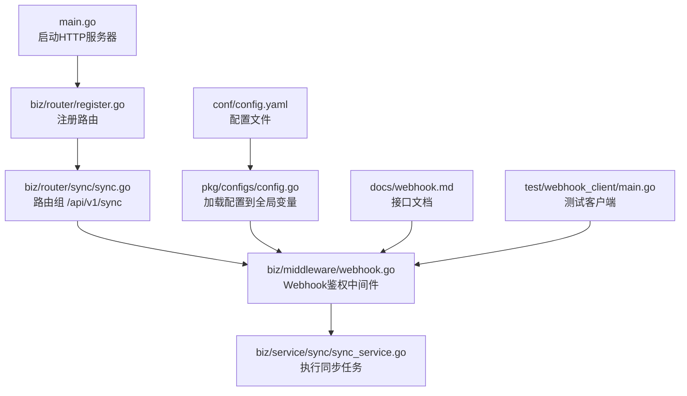
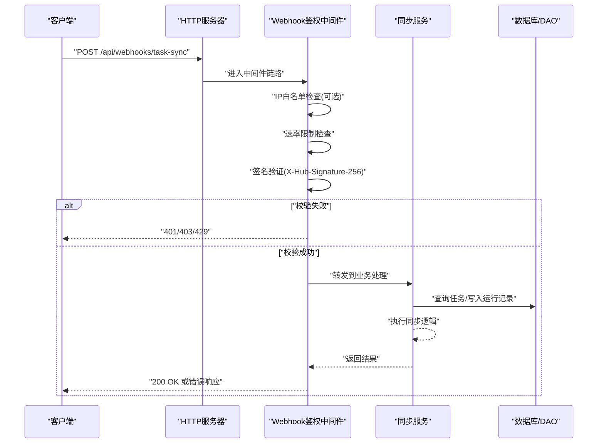
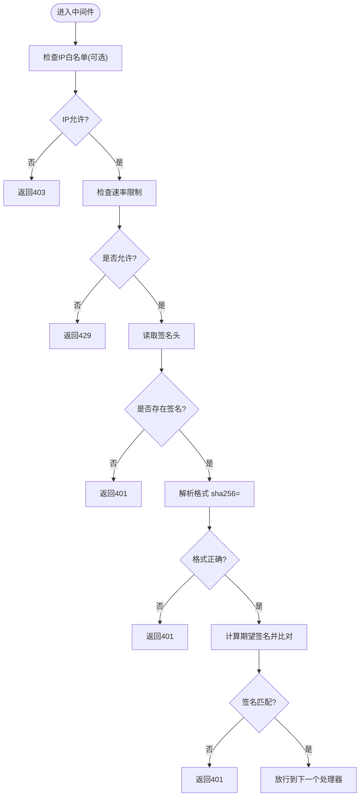
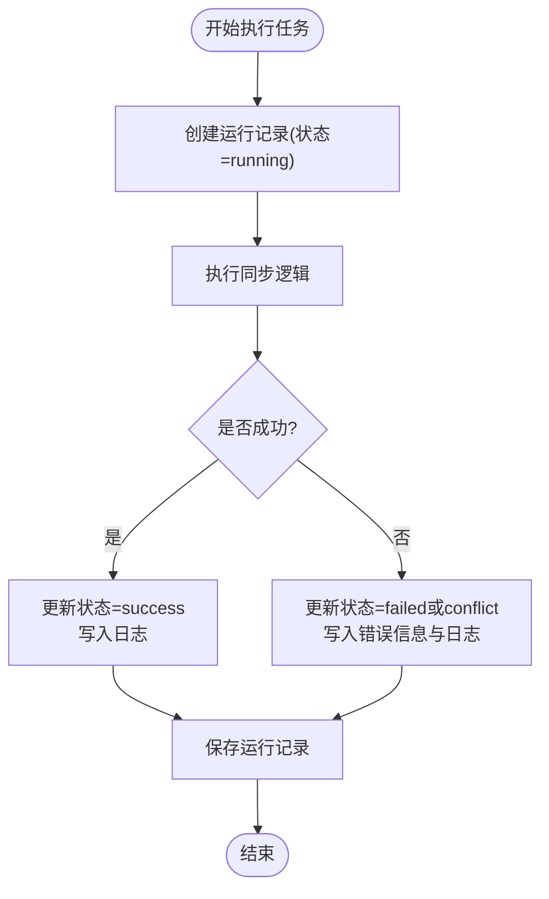
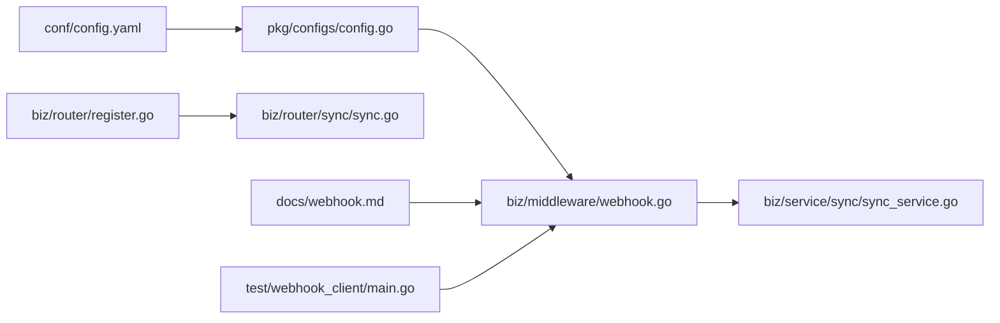

# 测试与调试

<cite>
**本文引用的文件**
- [docs/webhook.md](file://docs/webhook.md)
- [test/webhook_client/main.go](file://test/webhook_client/main.go)
- [biz/middleware/webhook.go](file://biz/middleware/webhook.go)
- [pkg/configs/config.go](file://pkg/configs/config.go)
- [conf/config.yaml](file://conf/config.yaml)
- [biz/service/sync/sync_service.go](file://biz/service/sync/sync_service.go)
- [biz/service/sync/cron_service.go](file://biz/service/sync/cron_service.go)
- [biz/router/register.go](file://biz/router/register.go)
- [biz/router/sync/sync.go](file://biz/router/sync/sync.go)
- [main.go](file://main.go)
</cite>

## 目录
1. [简介](#简介)
2. [项目结构](#项目结构)
3. [核心组件](#核心组件)
4. [架构总览](#架构总览)
5. [详细组件分析](#详细组件分析)
6. [依赖关系分析](#依赖关系分析)
7. [性能考虑](#性能考虑)
8. [故障排查指南](#故障排查指南)
9. [结论](#结论)
10. [附录](#附录)

## 简介
本文件面向Webhook测试与调试，围绕“任务触发型Webhook”的接口行为、安全校验、限流与白名单、日志与错误诊断、性能监控与指标采集、重试与失败处理策略、测试环境搭建与隔离、以及常见问题排查等维度，提供系统化实践指南。目标读者包括开发者、运维工程师与测试工程师。

## 项目结构
Webhook相关能力由以下模块协同实现：
- 文档与示例：提供接口定义、签名算法、调用示例与错误码
- 中间件：负责IP白名单、速率限制、签名验证
- 配置：集中管理Webhook密钥、限流阈值、IP白名单
- 业务服务：执行具体同步任务，记录运行日志与状态
- 路由注册：统一注册HTTP路由，暴露Webhook入口
- 测试客户端：最小化示例，便于快速验证

图表来源
- [main.go](file://main.go#L136-L152)
- [biz/router/register.go](file://biz/router/register.go#L18-L41)
- [biz/router/sync/sync.go](file://biz/router/sync/sync.go#L16-L40)
- [biz/middleware/webhook.go](file://biz/middleware/webhook.go#L18-L68)
- [pkg/configs/config.go](file://pkg/configs/config.go#L18-L42)
- [conf/config.yaml](file://conf/config.yaml#L21-L24)
- [docs/webhook.md](file://docs/webhook.md#L1-L133)
- [test/webhook_client/main.go](file://test/webhook_client/main.go#L13-L35)

章节来源
- [main.go](file://main.go#L136-L152)
- [biz/router/register.go](file://biz/router/register.go#L18-L41)
- [biz/router/sync/sync.go](file://biz/router/sync/sync.go#L16-L40)
- [pkg/configs/config.go](file://pkg/configs/config.go#L18-L42)
- [conf/config.yaml](file://conf/config.yaml#L21-L24)
- [docs/webhook.md](file://docs/webhook.md#L1-L133)
- [test/webhook_client/main.go](file://test/webhook_client/main.go#L13-L35)

## 核心组件
- Webhook接口与安全
  - 接口：POST /api/webhooks/task-sync，Content-Type: application/json
  - 签名：X-Hub-Signature-256，HMAC-SHA256(secret, body)，格式 sha256=<hex>
  - 限流：默认每分钟100次
  - IP白名单：可选，通过配置启用
- 中间件链路
  - IP白名单检查（可选）
  - 速率限制
  - 签名验证
  - 通过后进入业务处理
- 业务执行
  - 执行同步任务，记录开始/结束时间、状态、错误信息与日志详情
- 配置加载
  - 从配置文件读取Webhook密钥、限流阈值、IP白名单
  - 支持环境变量覆盖
- 路由注册
  - 统一注册各模块路由，包含 /api/v1/sync 下的同步相关接口

章节来源
- [docs/webhook.md](file://docs/webhook.md#L5-L60)
- [biz/middleware/webhook.go](file://biz/middleware/webhook.go#L18-L68)
- [pkg/configs/config.go](file://pkg/configs/config.go#L18-L42)
- [conf/config.yaml](file://conf/config.yaml#L21-L24)
- [biz/service/sync/sync_service.go](file://biz/service/sync/sync_service.go#L35-L74)
- [biz/router/register.go](file://biz/router/register.go#L18-L41)
- [biz/router/sync/sync.go](file://biz/router/sync/sync.go#L16-L40)

## 架构总览
下图展示Webhook请求从接入到执行的关键路径与决策点。

图表来源
- [biz/middleware/webhook.go](file://biz/middleware/webhook.go#L18-L68)
- [biz/service/sync/sync_service.go](file://biz/service/sync/sync_service.go#L35-L74)
- [conf/config.yaml](file://conf/config.yaml#L21-L24)

## 详细组件分析

### Webhook鉴权中间件
- 功能要点
  - 可选IP白名单：若配置了白名单且来源IP不在其中则拒绝
  - 速率限制：基于配置的每秒令牌桶进行限流
  - 签名验证：要求请求头 X-Hub-Signature-256，格式 sha256=<hex>；服务端用相同算法计算期望签名并与之比较
- 错误处理
  - 缺失签名：401
  - 签名格式不正确：401
  - 签名不匹配：401
  - 超出频率：429
  - IP不在白名单：403

图表来源
- [biz/middleware/webhook.go](file://biz/middleware/webhook.go#L18-L68)

章节来源
- [biz/middleware/webhook.go](file://biz/middleware/webhook.go#L18-L68)

### 配置加载与覆盖
- 配置来源
  - 配置文件：conf/config.yaml
  - 全局变量：pkg/configs/config.go
  - 环境变量：支持覆盖Webhook密钥等关键项
- 关键项
  - webhook.secret：用于生成与验证签名
  - webhook.rate_limit：每分钟请求数
  - webhook.ip_whitelist：允许的来源IP列表

章节来源
- [conf/config.yaml](file://conf/config.yaml#L21-L24)
- [pkg/configs/config.go](file://pkg/configs/config.go#L18-L42)

### 业务执行与日志
- 执行流程
  - 记录运行开始时间、状态为 running
  - 执行同步（拉取源/目标、比较哈希、快进判断、推送）
  - 更新结束时间、状态（success/failed/conflict）、错误信息与完整日志
- 日志要点
  - 按时间戳追加日志
  - 包含命令行日志（如 fetch/push）与关键步骤提示
  - 冲突与失败场景有明确状态区分

图表来源
- [biz/service/sync/sync_service.go](file://biz/service/sync/sync_service.go#L35-L74)

章节来源
- [biz/service/sync/sync_service.go](file://biz/service/sync/sync_service.go#L35-L74)

### 路由与入口
- 路由注册
  - 统一注册各模块路由，包含 /api/v1/sync 下的接口
- Webhook入口
  - 文档中定义的 /api/webhooks/task-sync 作为触发入口
  - 实际路由注册位于 /api/v1/sync 下，需结合中间件链路生效

章节来源
- [biz/router/register.go](file://biz/router/register.go#L18-L41)
- [biz/router/sync/sync.go](file://biz/router/sync/sync.go#L16-L40)
- [docs/webhook.md](file://docs/webhook.md#L5-L10)

### 测试客户端
- 用途
  - 最小化演示如何构造请求体、计算签名、设置请求头并发起请求
- 使用建议
  - 替换目标地址与密钥
  - 可扩展为批量发送、并发压测、统计响应时间与错误分布

章节来源
- [test/webhook_client/main.go](file://test/webhook_client/main.go#L13-L35)

## 依赖关系分析
- 组件耦合
  - 中间件依赖配置模块以获取密钥、限流阈值与白名单
  - 业务服务依赖DAO层持久化运行记录与任务元数据
  - 路由注册依赖各模块的路由定义
- 外部依赖
  - Hertz HTTP框架
  - rate 限流库
  - 配置加载与环境变量

图表来源
- [pkg/configs/config.go](file://pkg/configs/config.go#L18-L42)
- [conf/config.yaml](file://conf/config.yaml#L21-L24)
- [biz/middleware/webhook.go](file://biz/middleware/webhook.go#L18-L68)
- [biz/service/sync/sync_service.go](file://biz/service/sync/sync_service.go#L35-L74)
- [biz/router/register.go](file://biz/router/register.go#L18-L41)
- [biz/router/sync/sync.go](file://biz/router/sync/sync.go#L16-L40)
- [docs/webhook.md](file://docs/webhook.md#L1-L133)
- [test/webhook_client/main.go](file://test/webhook_client/main.go#L13-L35)

章节来源
- [pkg/configs/config.go](file://pkg/configs/config.go#L18-L42)
- [conf/config.yaml](file://conf/config.yaml#L21-L24)
- [biz/middleware/webhook.go](file://biz/middleware/webhook.go#L18-L68)
- [biz/service/sync/sync_service.go](file://biz/service/sync/sync_service.go#L35-L74)
- [biz/router/register.go](file://biz/router/register.go#L18-L41)
- [biz/router/sync/sync.go](file://biz/router/sync/sync.go#L16-L40)
- [docs/webhook.md](file://docs/webhook.md#L1-L133)
- [test/webhook_client/main.go](file://test/webhook_client/main.go#L13-L35)

## 性能考虑
- 并发与吞吐
  - 速率限制为每分钟固定次数，建议根据实际负载调整
  - 对于高并发场景，建议前置反向代理或网关做限流与熔断
- 延迟与超时
  - 签名计算与限流检查开销极低，主要瓶颈在Git操作与网络IO
  - 建议在业务层增加超时控制与重试策略
- 资源占用
  - 同步过程会频繁调用外部Git命令，注意磁盘IO与进程数
  - 建议对频繁触发的任务采用队列化或去抖动策略

## 故障排查指南
- 常见错误与定位
  - 401 未授权
    - 检查请求头 X-Hub-Signature-256 是否存在、格式是否为 sha256=<hex>
    - 确认使用的密钥与服务端一致
  - 403 禁止访问
    - 检查是否启用了IP白名单，当前来源IP是否在白名单内
  - 429 请求过多
    - 检查客户端是否超过每分钟阈值，适当降低发送频率
- 日志与审计
  - 查看业务运行记录中的状态、错误信息与完整日志
  - 关注冲突与失败场景的日志片段，定位具体步骤
- 配置核对
  - 确认配置文件与环境变量覆盖是否生效
  - 确认中间件链路已正确挂载到目标路由

章节来源
- [biz/middleware/webhook.go](file://biz/middleware/webhook.go#L18-L68)
- [biz/service/sync/sync_service.go](file://biz/service/sync/sync_service.go#L35-L74)
- [conf/config.yaml](file://conf/config.yaml#L21-L24)
- [pkg/configs/config.go](file://pkg/configs/config.go#L18-L42)

## 结论
本项目提供了完整的Webhook测试与调试基础：清晰的接口定义、严格的鉴权与限流、完善的日志与错误状态、以及可扩展的配置体系。结合本文提供的测试客户端、压力测试思路、日志分析与故障排查方法，可快速完成Webhook的集成验证与生产级运维。

## 附录

### Webhook测试客户端使用指南
- 准备工作
  - 获取目标服务地址与Webhook密钥
  - 准备请求体（例如包含任务ID）
- 步骤
  - 计算签名：对请求体进行 HMAC-SHA256，并按 sha256=<hex> 设置请求头
  - 发起请求：POST 到 /api/webhooks/task-sync
  - 解析响应：关注状态码与返回体
- 扩展
  - 批量发送：循环构造不同任务ID
  - 并发压测：使用多线程/多协程发送请求，统计成功率与延迟分布
  - 失败重试：对非幂等场景谨慎重试，避免重复触发

章节来源
- [test/webhook_client/main.go](file://test/webhook_client/main.go#L13-L35)
- [docs/webhook.md](file://docs/webhook.md#L61-L133)

### Webhook事件模拟与压力测试实施
- 事件模拟
  - 构造不同任务ID与请求体，验证鉴权与限流效果
  - 模拟异常场景：缺失签名、错误格式、错误签名、超出频率
- 压力测试
  - 使用并发客户端在限定时间内发送大量请求
  - 统计 2xx/4xx/5xx 分布、P50/P95 延迟、错误类型占比
  - 观察服务端日志与数据库运行记录，评估稳定性

章节来源
- [biz/middleware/webhook.go](file://biz/middleware/webhook.go#L18-L68)
- [biz/service/sync/sync_service.go](file://biz/service/sync/sync_service.go#L35-L74)

### Webhook调试工具配置与使用技巧
- 工具选择
  - curl：适合快速验证与手动调试
  - Postman/Insomnia：图形界面，便于维护多个环境
  - 自定义客户端：便于集成到CI/CD或自动化脚本
- 技巧
  - 固定密钥与请求体，便于复现问题
  - 开启详细日志，记录请求头、签名计算过程与响应
  - 使用环境变量覆盖配置，便于切换测试/生产

章节来源
- [docs/webhook.md](file://docs/webhook.md#L61-L133)
- [pkg/configs/config.go](file://pkg/configs/config.go#L34-L37)

### Webhook日志分析与错误诊断
- 关注点
  - 运行记录：开始/结束时间、状态、错误信息、日志详情
  - 冲突与失败：区分冲突与失败，定位具体步骤
  - 签名校验：确认签名头存在、格式正确、与期望一致
- 方法
  - 通过运行记录回溯整个执行流程
  - 对照日志中的命令行输出，定位网络/权限/版本差异等问题

章节来源
- [biz/service/sync/sync_service.go](file://biz/service/sync/sync_service.go#L35-L74)
- [biz/middleware/webhook.go](file://biz/middleware/webhook.go#L18-L68)

### Webhook性能监控与指标采集
- 指标建议
  - QPS、错误率（4xx/5xx）、P50/P95 延迟
  - 速率限制触发次数、IP白名单拒绝次数
  - 同步任务成功率、平均耗时、冲突率
- 采集方式
  - 在中间件与业务层埋点
  - 通过日志聚合与指标系统（如Prometheus/Grafana）可视化

章节来源
- [biz/middleware/webhook.go](file://biz/middleware/webhook.go#L16-L40)
- [biz/service/sync/sync_service.go](file://biz/service/sync/sync_service.go#L35-L74)

### Webhook重试机制与失败处理策略
- 重试原则
  - 幂等性优先：尽量保证请求幂等，避免重复触发
  - 指数退避：指数增长等待时间，避免雪崩
  - 上限控制：设置最大重试次数与总超时
- 失败处理
  - 401/403：检查密钥与IP白名单配置
  - 429：降低发送频率或增加队列
  - 业务错误：根据运行记录与日志定位并修复

章节来源
- [biz/middleware/webhook.go](file://biz/middleware/webhook.go#L18-L68)
- [biz/service/sync/sync_service.go](file://biz/service/sync/sync_service.go#L35-L74)

### Webhook测试环境搭建与隔离
- 环境隔离
  - 使用独立配置文件与环境变量，避免与生产混淆
  - 为测试服务分配独立端口与路由前缀
- 安全隔离
  - 测试密钥与生产密钥分离
  - 限制测试IP白名单范围，仅允许测试网段
- 资源隔离
  - 使用独立数据库或表空间，避免污染生产数据

章节来源
- [conf/config.yaml](file://conf/config.yaml#L21-L24)
- [pkg/configs/config.go](file://pkg/configs/config.go#L18-L42)
- [main.go](file://main.go#L136-L152)