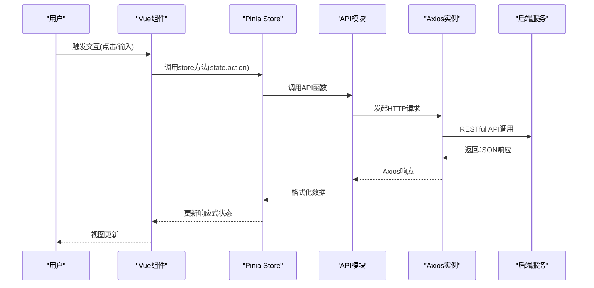
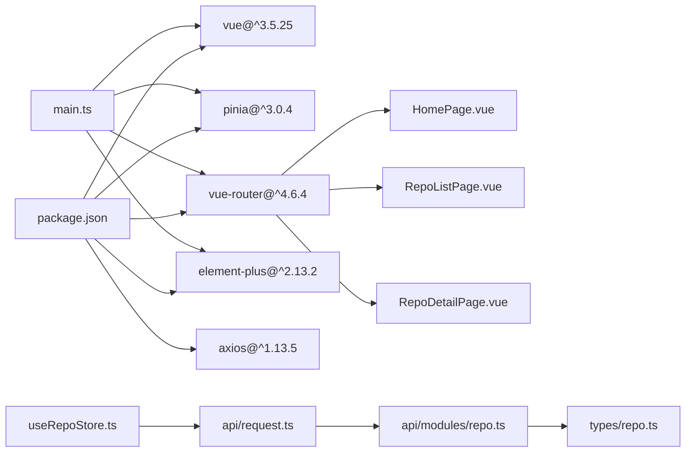

# JavaScript组件

<cite>
**本文引用的文件**
- [frontend/src/main.ts](file://frontend/src/main.ts)
- [frontend/src/App.vue](file://frontend/src/App.vue)
- [frontend/src/router/index.ts](file://frontend/src/router/index.ts)
- [frontend/src/stores/useAppStore.ts](file://frontend/src/stores/useAppStore.ts)
- [frontend/src/stores/useRepoStore.ts](file://frontend/src/stores/useRepoStore.ts)
- [frontend/src/api/request.ts](file://frontend/src/api/request.ts)
- [frontend/src/api/modules/repo.ts](file://frontend/src/api/modules/repo.ts)
- [frontend/src/types/repo.ts](file://frontend/src/types/repo.ts)
- [frontend/src/utils/format.ts](file://frontend/src/utils/format.ts)
- [frontend/src/views/home/HomePage.vue](file://frontend/src/views/home/HomePage.vue)
- [frontend/src/views/repo/RepoListPage.vue](file://frontend/src/views/repo/RepoListPage.vue)
- [frontend/src/views/repo/RepoDetailPage.vue](file://frontend/src/views/repo/RepoDetailPage.vue)
- [frontend/package.json](file://frontend/package.json)
</cite>

## 更新摘要
**所做更改**
- 完全重构前端架构，从原生JavaScript迁移到Vue3 Composition API + TypeScript
- 新增基于Pinia的状态管理系统和基于Element Plus的UI组件库
- 重新设计API集成层，采用Axios封装和TypeScript类型定义
- 更新组件通信机制，从全局函数改为响应式状态管理
- 新增路由系统和页面级组件架构

## 目录
1. [简介](#简介)
2. [项目结构](#项目结构)
3. [核心组件](#核心组件)
4. [架构总览](#架构总览)
5. [组件详解](#组件详解)
6. [依赖关系分析](#依赖关系分析)
7. [性能考量](#性能考量)
8. [故障排查指南](#故障排查指南)
9. [结论](#结论)
10. [附录](#附录)

## 简介
本文件面向Vue3 + TypeScript前端组件，系统性梳理仓库中基于Composition API的现代化组件架构。重点覆盖：
- Vue3 Composition API + TypeScript的组件设计模式
- Pinia状态管理与响应式数据流
- Axios封装的API集成层与类型安全
- Element Plus UI组件库的集成与使用
- 路由驱动的页面架构与组件通信机制
- 异步操作处理与Promise使用模式
- 组件间通信与数据传递策略
- 测试与调试建议

## 项目结构
前端采用Vue3 + TypeScript + Vite的现代化技术栈，采用"页面组件 + 组合式函数 + 状态管理 + API模块"的分层架构：

```mermaid
graph TB
subgraph "应用层"
MAIN["main.ts"]
APP["App.vue"]
END
subgraph "路由层"
ROUTER["router/index.ts"]
END
subgraph "状态管理层"
APPSTORE["useAppStore.ts"]
REPSTORE["useRepoStore.ts"]
END
subgraph "API层"
REQUEST["api/request.ts"]
REPOAPI["api/modules/repo.ts"]
END
subgraph "类型定义层"
REPOTYPE["types/repo.ts"]
FORMAT["utils/format.ts"]
END
subgraph "页面组件层"
HOME["views/home/HomePage.vue"]
REPOLIST["views/repo/RepoListPage.vue"]
REPDETAIL["views/repo/RepoDetailPage.vue"]
END
MAIN --> APP
APP --> ROUTER
ROUTER --> HOME
ROUTER --> REPOLIST
ROUTER --> REPDETAIL
REPOLIST --> REPSTORE
REPDETAIL --> REPSTORE
REPSTORE --> REQUEST
REQUEST --> REPOAPI
REPOAPI --> REPOTYPE
```

**更新** 完全重构的Vue3架构，采用Composition API替代原生JavaScript，提供更好的类型安全和组件复用能力。

## 核心组件
- 应用入口：main.ts负责应用初始化、插件注册和根组件挂载
- 路由系统：router/index.ts定义页面路由和导航逻辑
- 状态管理：useAppStore.ts和useRepoStore.ts提供全局状态管理
- API封装：api/request.ts统一HTTP请求处理，api/modules/*.ts提供业务API
- 类型定义：types/*.ts确保TypeScript类型安全
- 工具函数：utils/format.ts提供数据格式化工具

**更新** 新增Vue3 Composition API架构，提供响应式状态管理和更好的TypeScript支持。

## 架构总览
整体采用"应用入口-路由-页面组件-状态管理-API层-类型定义"的分层架构：



**更新** Vue3架构下的响应式数据流，从组件到状态管理再到API调用的完整链路。

## 组件详解

### 应用入口：main.ts
- 设计要点
  - 创建Vue应用实例，注册Element Plus、Vue Router、Pinia插件
  - 统一应用配置和全局样式导入
  - 应用挂载到DOM元素
- 复用机制
  - 单一入口管理，避免重复配置
  - 插件注册集中化管理

**章节来源**
- [frontend/src/main.ts](file://frontend/src/main.ts#L1-L16)

### 根组件：App.vue
- 设计要点
  - 简洁的模板结构，仅包含路由视图容器
  - 支持全局样式和主题配置
- 复用机制
  - 作为所有页面的父组件，提供统一的布局框架

**章节来源**
- [frontend/src/App.vue](file://frontend/src/App.vue#L1-L4)

### 路由系统：router/index.ts
- 设计要点
  - 基于Vue Router 4的路由配置
  - 支持嵌套路由和动态路由参数
  - 路由守卫实现页面标题动态设置
  - 懒加载组件提升性能
- 路由结构
  - 首页、仓库管理、分支管理、同步任务、审计日志、系统设置等页面
  - 支持仓库详情、分支详情等动态路由

**章节来源**
- [frontend/src/router/index.ts](file://frontend/src/router/index.ts#L1-L79)

### 应用状态：useAppStore.ts
- 设计要点
  - 使用Composition API定义store
  - 简单的状态管理：侧边栏折叠状态
  - 响应式状态更新
- 复用机制
  - 全局状态共享，组件间状态同步

**章节来源**
- [frontend/src/stores/useAppStore.ts](file://frontend/src/stores/useAppStore.ts#L1-L13)

### 仓库状态：useRepoStore.ts
- 设计要点
  - 管理仓库列表、当前仓库、加载状态
  - 异步数据获取和错误处理
  - 响应式状态更新
- 方法功能
  - fetchRepoList：获取仓库列表
  - fetchRepoDetail：获取仓库详情
  - getRepoByKey：根据key查找仓库

**章节来源**
- [frontend/src/stores/useRepoStore.ts](file://frontend/src/stores/useRepoStore.ts#L1-L35)

### API封装：api/request.ts
- 设计要点
  - 基于Axios的HTTP客户端封装
  - 统一的请求拦截器和响应拦截器
  - 错误处理和用户提示
  - 支持二进制响应（如CSV导出）
- 错误处理
  - 业务错误码处理
  - 网络错误统一提示
  - Promise链式错误传播

**章节来源**
- [frontend/src/api/request.ts](file://frontend/src/api/request.ts#L1-L45)

### 仓库API：api/modules/repo.ts
- 设计要点
  - 模块化API设计，按业务领域划分
  - TypeScript泛型确保类型安全
  - 统一的参数传递和响应处理
- API功能
  - 仓库列表、详情、创建、更新、删除
  - 仓库克隆、扫描、任务查询
  - 远程操作和配置管理

**章节来源**
- [frontend/src/api/modules/repo.ts](file://frontend/src/api/modules/repo.ts#L1-L41)

### 类型定义：types/repo.ts
- 设计要点
  - 完整的TypeScript类型定义
  - DTO模型定义
  - 请求参数和响应类型的严格约束
- 类型结构
  - 仓库实体、远程配置、认证信息
  - 注册请求、克隆请求、扫描结果
  - 跟踪分支信息

**章节来源**
- [frontend/src/types/repo.ts](file://frontend/src/types/repo.ts#L1-L64)

### 工具函数：utils/format.ts
- 设计要点
  - 数据格式化工具函数
  - 日期格式化和相对时间计算
  - 状态颜色映射
- 功能特性
  - 中文本地化日期格式
  - 相对时间友好显示
  - 状态到颜色的映射

**章节来源**
- [frontend/src/utils/format.ts](file://frontend/src/utils/format.ts#L1-L50)

### 首页组件：HomePage.vue
- 设计要点
  - 响应式布局设计
  - Element Plus卡片组件使用
  - 图标和按钮的组合使用
  - 路由导航集成
- 组件特性
  - 功能特性展示卡片
  - 交互式按钮导航
  - 响应式网格布局

**章节来源**
- [frontend/src/views/home/HomePage.vue](file://frontend/src/views/home/HomePage.vue#L1-L102)

### 仓库列表：RepoListPage.vue
- 设计要点
  - 表格数据展示和操作按钮组
  - 对话框表单和文件浏览器
  - 标签页切换和表单验证
  - 异步任务轮询和进度显示
- 核心功能
  - 仓库注册（本地扫描和远程克隆）
  - 仓库列表管理
  - 文件系统浏览
  - 连接测试和SSH密钥管理

**章节来源**
- [frontend/src/views/repo/RepoListPage.vue](file://frontend/src/views/repo/RepoListPage.vue#L1-L489)

### 仓库详情：RepoDetailPage.vue
- 设计要点
  - 多标签页数据展示
  - 表单过滤和数据查询
  - 统计图表和表格展示
  - 对话框编辑和配置管理
- 数据流
  - 仓库基本信息展示
  - Git有效提交度量分析
  - 真实工程代码度量统计
  - 版本历史时间线

**章节来源**
- [frontend/src/views/repo/RepoDetailPage.vue](file://frontend/src/views/repo/RepoDetailPage.vue#L1-L526)

## 依赖关系分析
- 应用依赖：Vue3 + Element Plus + Vue Router + Pinia + Axios
- 组件层次：页面组件依赖状态管理，状态管理依赖API模块
- 类型安全：完整的TypeScript类型定义确保编译时检查
- 模块化：API按业务领域模块化，便于维护和扩展



**更新** Vue3架构下的依赖关系，从传统JavaScript到现代TypeScript生态的完整迁移。

## 性能考量
- 组件懒加载：路由级别的代码分割和组件懒加载
- 状态持久化：Pinia提供响应式状态管理，避免不必要的重渲染
- API缓存：合理利用HTTP缓存和状态缓存
- 虚拟滚动：大数据表格使用虚拟滚动优化渲染性能
- 异步加载：图片和第三方资源的异步加载
- 类型优化：TypeScript编译时优化，运行时零成本抽象

**更新** Vue3架构下的性能优化策略，包括组件懒加载、响应式状态管理和TypeScript编译优化。

## 故障排查指南
- Vue应用启动问题
  - 检查main.ts中的插件注册顺序
  - 确认Element Plus主题样式正确加载
- 路由导航问题
  - 检查router/index.ts中的路由配置
  - 确认动态路由参数正确传递
- 状态管理问题
  - 检查store定义和使用方式
  - 确认响应式状态更新触发
- API调用问题
  - 检查api/request.ts中的拦截器配置
  - 确认TypeScript类型定义正确
- 类型错误
  - 检查TS配置和编译错误
  - 确认接口定义与实际响应一致

**更新** Vue3架构下的故障排查指南，涵盖组件、状态管理、API调用和类型系统的问题诊断。

## 结论
Vue3 + TypeScript架构提供了现代化的前端开发体验，通过Composition API、TypeScript类型系统、Pinia状态管理和Element Plus UI组件库，构建了高度模块化和类型安全的应用。相比原生JavaScript，新架构在开发效率、代码质量和维护性方面都有显著提升。建议继续完善单元测试、集成测试和端到端测试，确保代码质量。

## 附录
- 组件通信方式
  - Props和Events：父子组件通信
  - Provide/Inject：跨层级组件通信
  - Pinia状态共享：全局状态管理
  - 路由参数：页面间数据传递
- 异步处理模式
  - Composition API的async/await
  - Promise链式调用
  - 错误边界和异常处理
- 性能优化策略
  - 组件懒加载和代码分割
  - 响应式状态优化
  - API请求缓存和去重
  - 虚拟滚动和分页加载
- 测试与调试
  - 单元测试：Jest + Vue Test Utils
  - 集成测试：Cypress
  - 调试工具：Vue DevTools + TypeScript检查
  - 性能分析：Chrome DevTools

**更新** Vue3架构下的组件通信、异步处理、性能优化和测试调试建议，提供完整的开发和运维指南。