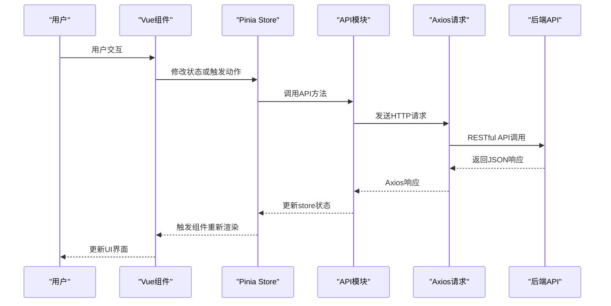
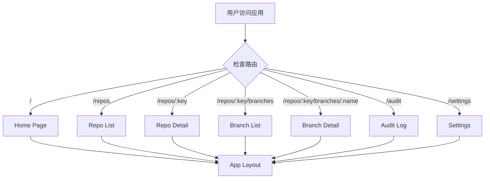
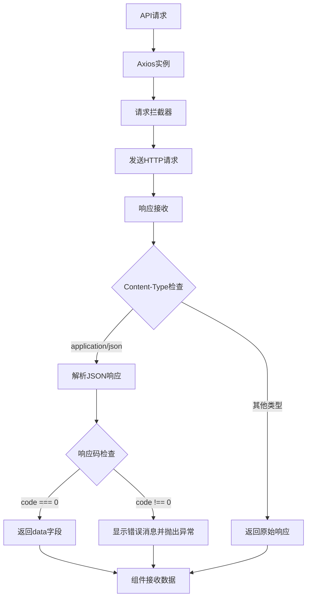

# Web界面架构

<cite>
**本文档引用的文件**
- [frontend/package.json](file://frontend/package.json)
- [frontend/vite.config.ts](file://frontend/vite.config.ts)
- [frontend/src/main.ts](file://frontend/src/main.ts)
- [frontend/src/App.vue](file://frontend/src/App.vue)
- [frontend/src/router/index.ts](file://frontend/src/router/index.ts)
- [frontend/src/api/request.ts](file://frontend/src/api/request.ts)
- [frontend/src/api/modules/repo.ts](file://frontend/src/api/modules/repo.ts)
- [frontend/src/stores/useAppStore.ts](file://frontend/src/stores/useAppStore.ts)
- [frontend/src/stores/useRepoStore.ts](file://frontend/src/stores/useRepoStore.ts)
- [frontend/src/components/layout/AppLayout.vue](file://frontend/src/components/layout/AppLayout.vue)
- [frontend/src/views/home/HomePage.vue](file://frontend/src/views/home/HomePage.vue)
- [frontend/src/views/repo/RepoListPage.vue](file://frontend/src/views/repo/RepoListPage.vue)
- [frontend/src/types/common.ts](file://frontend/src/types/common.ts)
- [frontend/src/utils/format.ts](file://frontend/src/utils/format.ts)
</cite>

## 更新摘要
**所做更改**
- 完全重构前端架构：从HTML/Bootstrap迁移到Vue3 + TypeScript + Element Plus
- 引入现代化前端开发实践：组件化、模块化、状态管理
- 新增TypeScript类型系统和构建配置
- 实现响应式布局和现代化UI组件
- 建立完整的前端开发工具链

## 目录
1. [简介](#简介)
2. [项目结构](#项目结构)
3. [核心组件](#核心组件)
4. [架构总览](#架构总览)
5. [详细组件分析](#详细组件分析)
6. [依赖关系分析](#依赖关系分析)
7. [性能考量](#性能考量)
8. [故障排查指南](#故障排查指南)
9. [结论](#结论)
10. [附录](#附录)

## 简介
本文档系统性梳理该代码库中全新的Web前端架构，重点覆盖以下方面：
- 现代化前端技术栈与架构设计原则（Vue3 + TypeScript + Element Plus）
- 组件化架构与模块化组织结构
- 响应式设计与Element Plus UI框架的使用
- 状态管理与数据流控制
- 类型安全的API调用封装
- 开发工具链与构建配置
- 跨浏览器兼容性与性能优化策略
- 前后端数据交互模式与现代化API设计

## 项目结构
前端项目位于frontend目录，采用现代化Vue3单页应用架构，通过Vite构建工具实现快速开发和优化构建。核心文件组织如下：

```mermaid
graph TB
subgraph "构建配置"
PKG["package.json"]
VITE["vite.config.ts"]
TS["tsconfig.json"]
END
subgraph "应用入口"
MAIN["main.ts"]
APP["App.vue"]
END
subgraph "路由系统"
ROUTER["router/index.ts"]
LAYOUT["components/layout/AppLayout.vue"]
END
subgraph "状态管理"
STORE_APP["stores/useAppStore.ts"]
STORE_REPO["stores/useRepoStore.ts"]
END
subgraph "API层"
REQUEST["api/request.ts"]
MODULES["api/modules/*.ts"]
TYPES["types/*.ts"]
END
subgraph "视图组件"
HOME["views/home/HomePage.vue"]
REPO_LIST["views/repo/RepoListPage.vue"]
BRANCH_PAGES["views/branch/*.vue"]
SYNC_PAGE["views/sync/SyncTaskPage.vue"]
AUDIT_PAGE["views/audit/AuditLogPage.vue"]
SETTINGS_PAGE["views/settings/SettingsPage.vue"]
END
subgraph "工具函数"
FORMAT["utils/format.ts"]
COMPOSABLES["composables/*.ts"]
END
PKG --> MAIN
VITE --> MAIN
TS --> MAIN
MAIN --> APP
APP --> ROUTER
ROUTER --> LAYOUT
LAYOUT --> HOME
LAYOUT --> REPO_LIST
REQUEST --> MODULES
MODULES --> STORE_REPO
STORE_APP --> LAYOUT
FORMAT --> REPO_LIST
```

**图表来源**
- [frontend/package.json](file://frontend/package.json#L1-L29)
- [frontend/vite.config.ts](file://frontend/vite.config.ts#L1-L33)
- [frontend/src/main.ts](file://frontend/src/main.ts#L1-L16)
- [frontend/src/router/index.ts](file://frontend/src/router/index.ts#L1-L79)

**章节来源**
- [frontend/package.json](file://frontend/package.json#L1-L29)
- [frontend/vite.config.ts](file://frontend/vite.config.ts#L1-L33)
- [frontend/src/main.ts](file://frontend/src/main.ts#L1-L16)

## 核心组件

### 应用入口与配置
- **main.ts**：应用入口文件，集成Vue3、Pinia状态管理、Vue Router路由系统和Element Plus UI框架
- **App.vue**：根组件，使用router-view实现路由视图渲染
- **vite.config.ts**：构建配置，包含代理设置、代码分割和别名配置

### 路由系统
- **router/index.ts**：基于Vue Router 4的路由配置，支持嵌套路由和动态路由参数
- **AppLayout.vue**：应用布局组件，包含顶部导航菜单和响应式设计

### 状态管理
- **useAppStore.ts**：应用级状态管理，包含侧边栏折叠状态等全局状态
- **useRepoStore.ts**：仓库数据状态管理，封装仓库列表、详情和加载状态

### API层
- **request.ts**：基于Axios的HTTP客户端，集成Element Plus消息提示和错误处理
- **modules/repo.ts**：仓库相关的API模块，提供仓库CRUD、克隆、扫描等功能

### 视图组件
- **HomePage.vue**：首页展示组件，包含功能特性卡片和引导按钮
- **RepoListPage.vue**：仓库列表组件，支持仓库注册、克隆、文件浏览等复杂交互

**章节来源**
- [frontend/src/main.ts](file://frontend/src/main.ts#L1-L16)
- [frontend/src/App.vue](file://frontend/src/App.vue#L1-L4)
- [frontend/src/router/index.ts](file://frontend/src/router/index.ts#L1-L79)
- [frontend/src/components/layout/AppLayout.vue](file://frontend/src/components/layout/AppLayout.vue#L1-L88)
- [frontend/src/stores/useAppStore.ts](file://frontend/src/stores/useAppStore.ts#L1-L13)
- [frontend/src/stores/useRepoStore.ts](file://frontend/src/stores/useRepoStore.ts#L1-L35)
- [frontend/src/api/request.ts](file://frontend/src/api/request.ts#L1-L45)
- [frontend/src/api/modules/repo.ts](file://frontend/src/api/modules/repo.ts#L1-L41)

## 架构总览
整体采用现代化的Vue3单页应用架构，通过组件化、模块化和状态管理实现清晰的职责分离。应用通过Element Plus提供丰富的UI组件，通过Pinia实现状态管理，通过Vue Router实现路由控制。



**图表来源**
- [frontend/src/stores/useRepoStore.ts](file://frontend/src/stores/useRepoStore.ts#L11-L27)
- [frontend/src/api/modules/repo.ts](file://frontend/src/api/modules/repo.ts#L4-L6)
- [frontend/src/api/request.ts](file://frontend/src/api/request.ts#L6-L12)

## 详细组件分析

### 应用入口与依赖注入
- **设计要点**
  - 使用createApp创建Vue实例，集成Element Plus主题和图标
  - 通过app.use()安装Vue Router和Pinia状态管理
  - 全局引入样式文件，确保UI组件样式正确加载
- **最佳实践**
  - 保持入口文件简洁，所有配置通过插件形式集成
  - 确保Element Plus的CSS样式正确导入

**章节来源**
- [frontend/src/main.ts](file://frontend/src/main.ts#L1-L16)

### 路由系统与导航
- **设计要点**
  - 采用嵌套路由结构，根路由指向AppLayout布局组件
  - 支持动态路由参数，如仓库键值和分支名称
  - 路由守卫中动态设置页面标题，提升用户体验
  - Element Plus菜单组件与Vue Router集成，实现导航联动
- **路由配置**
  - 首页、仓库管理、分支管理、审计日志、系统设置等主要页面
  - 支持仓库详情、分支详情、分支对比等子页面
  - 动态路由参数支持多层级页面导航



**图表来源**
- [frontend/src/router/index.ts](file://frontend/src/router/index.ts#L4-L65)

**章节来源**
- [frontend/src/router/index.ts](file://frontend/src/router/index.ts#L1-L79)
- [frontend/src/components/layout/AppLayout.vue](file://frontend/src/components/layout/AppLayout.vue#L1-L88)

### 状态管理系统
- **useAppStore.ts**
  - 管理应用级全局状态，如侧边栏折叠状态
  - 提供toggleSidebar方法，支持状态切换
  - 使用Vue 3 Composition API的ref响应式数据

- **useRepoStore.ts**
  - 管理仓库相关的状态数据
  - 提供仓库列表获取、详情获取、加载状态管理
  - 封装异步数据获取逻辑，避免组件直接处理API细节
  - 支持按key查找仓库，提供便捷的状态查询方法

**章节来源**
- [frontend/src/stores/useAppStore.ts](file://frontend/src/stores/useAppStore.ts#L1-L13)
- [frontend/src/stores/useRepoStore.ts](file://frontend/src/stores/useRepoStore.ts#L1-L35)

### API请求封装
- **设计要点**
  - 基于Axios创建HTTP客户端实例，统一配置baseURL、超时时间和请求头
  - 集成Element Plus的消息提示系统，提供统一的错误处理
  - 支持非JSON响应类型的处理，如文件下载
  - 统一响应格式处理，自动提取data字段并进行错误拦截
- **错误处理机制**
  - 自动拦截非成功响应，显示错误消息
  - 支持网络错误和服务器错误的不同处理
  - 通过Promise.reject向调用方传播错误



**图表来源**
- [frontend/src/api/request.ts](file://frontend/src/api/request.ts#L6-L42)

**章节来源**
- [frontend/src/api/request.ts](file://frontend/src/api/request.ts#L1-L45)

### 仓库管理页面组件
- **设计要点**
  - 使用Element Plus的表格、对话框、表单等组件构建复杂界面
  - 支持仓库注册（本地扫描）和克隆新仓库两种模式
  - 集成文件浏览器功能，支持目录选择和搜索
  - 实现克隆进度监控，提供实时状态反馈
- **核心功能**
  - 仓库列表展示，支持查看详情、分支管理、同步任务
  - 仓库注册表单，支持本地路径扫描和远程URL克隆
  - 文件浏览器对话框，提供目录浏览和选择功能
  - 克隆进度跟踪，实时显示克隆过程和结果

**章节来源**
- [frontend/src/views/repo/RepoListPage.vue](file://frontend/src/views/repo/RepoListPage.vue#L1-L489)

### 类型系统与工具函数
- **类型定义**
  - ApiResponse接口：统一API响应格式，包含code、msg、data字段
  - PaginationParams/PaginationResponse：分页相关类型定义
  - 详细的DTO和请求参数类型，确保类型安全
- **工具函数**
  - formatDate：日期格式化，支持中文本地化
  - formatRelativeTime：相对时间格式化，显示"几分钟前"等友好文本
  - getStatusColor：根据状态返回Element Plus颜色类型
  - getSyncTypeLabel：同步类型标签生成

**章节来源**
- [frontend/src/types/common.ts](file://frontend/src/types/common.ts#L1-L17)
- [frontend/src/utils/format.ts](file://frontend/src/utils/format.ts#L1-L50)

## 依赖关系分析
- **技术栈依赖**
  - Vue 3.5.25：现代JavaScript框架，提供响应式数据和组件系统
  - Element Plus 2.13.2：基于Vue 3的桌面端组件库，提供丰富的UI组件
  - Pinia 3.0.4：Vue官方状态管理库，替代Vuex
  - Vue Router 4.6.4：Vue官方路由管理库
  - TypeScript 5.9.3：提供静态类型检查和更好的开发体验
  - Vite 7.3.1：现代化构建工具，提供快速开发和优化构建
- **开发依赖**
  - @vitejs/plugin-vue：Vite的Vue插件
  - @vue/tsconfig：Vue项目的TypeScript配置
  - @types/node：Node.js类型定义
- **运行时依赖**
  - axios：HTTP客户端库
  - diff2html：代码差异可视化
  - @element-plus/icons-vue：Element Plus图标库

```mermaid
graph LR
SUBGRAPH "运行时依赖"
VUE["vue@^3.5.25"]
EP["element-plus@^2.13.2"]
PINIA["pinia@^3.0.4"]
ROUTER["vue-router@^4.6.4"]
AXIOS["axios@^1.13.5"]
DIFF["diff2html@^3.4.56"]
ICONS["@element-plus/icons-vue@^2.3.2"]
END
SUBGRAPH --> MAIN["main.ts"]
EP --> LAYOUT["AppLayout.vue"]
ROUTER --> ROUTER_FILE["router/index.ts"]
PINIA --> STORES["stores/*.ts"]
AXIOS --> API["api/request.ts"]
```

**图表来源**
- [frontend/package.json](file://frontend/package.json#L11-L27)

**章节来源**
- [frontend/package.json](file://frontend/package.json#L1-L29)

## 性能考量
- **构建优化**
  - 代码分割：通过manualChunks配置将element-plus和vendor分别打包
  - 按需加载：路由组件采用动态导入，减少初始包体积
  - Tree Shaking：TypeScript和ES模块支持更好的代码摇树优化
- **运行时优化**
  - 组件懒加载：路由级别的组件动态导入
  - 状态缓存：Pinia store提供响应式状态缓存
  - 请求缓存：API层支持重复请求的去重处理
- **资源优化**
  - CDN配置：Element Plus CSS样式可配置CDN加速
  - 图标优化：按需引入Element Plus图标，避免全量引入
  - 样式隔离：Scoped CSS确保样式不会相互影响

## 故障排查指南
- **开发环境问题**
  - 确认Vite开发服务器正常启动，端口3000可用
  - 检查TypeScript编译错误，确保类型定义正确
  - 验证Element Plus组件导入和样式加载
- **路由问题**
  - 检查路由配置是否正确，动态参数是否匹配
  - 确认AppLayout组件正确渲染
  - 验证路由守卫中的标题设置逻辑
- **状态管理问题**
  - 检查store初始化是否正确
  - 确认状态变更触发了正确的组件更新
  - 验证异步操作的错误处理
- **API调用问题**
  - 确认代理配置正确指向后端服务
  - 检查响应格式是否符合ApiResponse接口
  - 验证错误消息提示是否正常显示

**章节来源**
- [frontend/vite.config.ts](file://frontend/vite.config.ts#L12-L20)
- [frontend/src/api/request.ts](file://frontend/src/api/request.ts#L23-L42)

## 结论
该Web前端采用现代化的Vue3架构，实现了从传统HTML/Bootstrap到现代化前端开发的完整转型。通过组件化、模块化和类型系统的引入，显著提升了代码质量和开发效率。Element Plus提供了丰富的UI组件，配合Pinia状态管理和Vue Router路由系统，构建了功能完整、用户体验优秀的管理界面。建议后续继续完善组件文档、测试覆盖率和性能监控，进一步提升应用质量。

## 附录

### 响应式设计与移动端适配
- **Element Plus响应式系统**
  - 使用el-row和el-col组件实现响应式布局
  - 支持xs、sm、md、lg等断点配置
  - 自动适配不同屏幕尺寸的显示效果
- **导航适配**
  - AppLayout组件使用Element Plus的Header和Menu组件
  - 支持水平导航菜单，适合桌面端使用
  - 移动端可通过浏览器缩放适应

**章节来源**
- [frontend/src/views/repo/RepoListPage.vue](file://frontend/src/views/repo/RepoListPage.vue#L19-L47)
- [frontend/src/components/layout/AppLayout.vue](file://frontend/src/components/layout/AppLayout.vue#L10-L25)

### 前端资源管理与CDN配置
- **构建配置优化**
  - 通过manualChunks实现vendor和element-plus的独立打包
  - 减少重复依赖，提升缓存效率
  - 支持Tree Shaking，移除未使用的代码
- **开发工具链**
  - Vite提供快速热重载开发体验
  - TypeScript提供完整的类型检查和智能提示
  - ESLint和Prettier确保代码风格一致性

**章节来源**
- [frontend/vite.config.ts](file://frontend/vite.config.ts#L21-L31)
- [frontend/package.json](file://frontend/package.json#L6-L10)

### 跨浏览器兼容性
- **现代浏览器支持**
  - Vue 3需要支持ES2015+的现代浏览器
  - Element Plus提供良好的浏览器兼容性
  - TypeScript编译目标可配置以支持旧版浏览器
- **渐进增强策略**
  - 使用Polyfill支持较老的浏览器特性
  - 渐进式增强UI组件，确保基本功能可用
  - 优雅降级处理，避免阻塞核心功能

### 开发工作流
- **开发环境**
  - npm run dev：启动Vite开发服务器
  - 自动热重载，支持快速迭代开发
  - TypeScript类型检查实时反馈
- **生产构建**
  - npm run build：TypeScript类型检查和Vite构建
  - 代码压缩和混淆，优化生产环境性能
  - 生成静态资源，准备部署到Nginx或其他Web服务器
- **预览测试**
  - npm run preview：本地预览生产构建结果
  - 验证构建产物的正确性和性能表现

**章节来源**
- [frontend/package.json](file://frontend/package.json#L6-L10)
- [frontend/vite.config.ts](file://frontend/vite.config.ts#L1-L33)