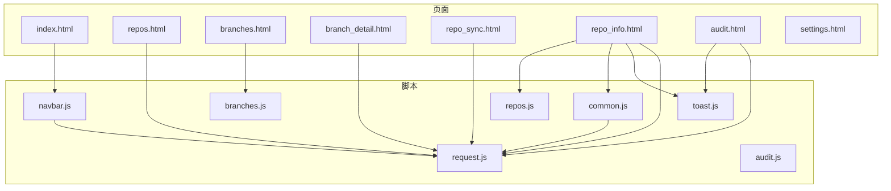
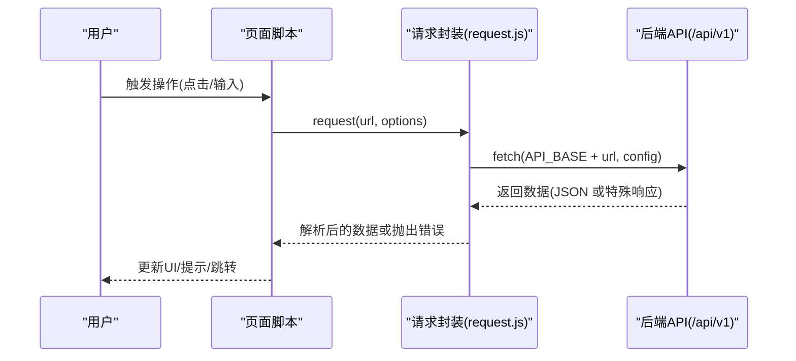
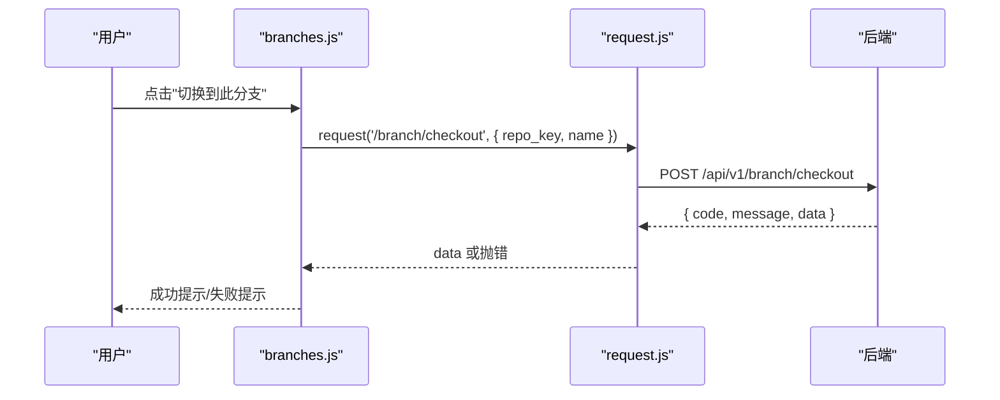
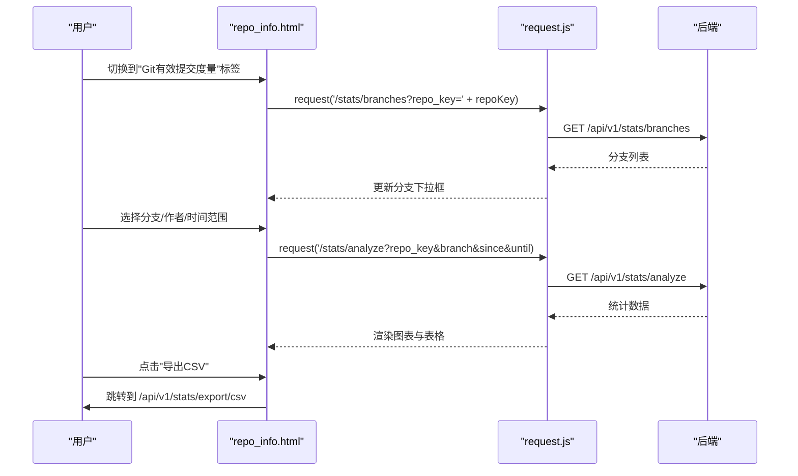
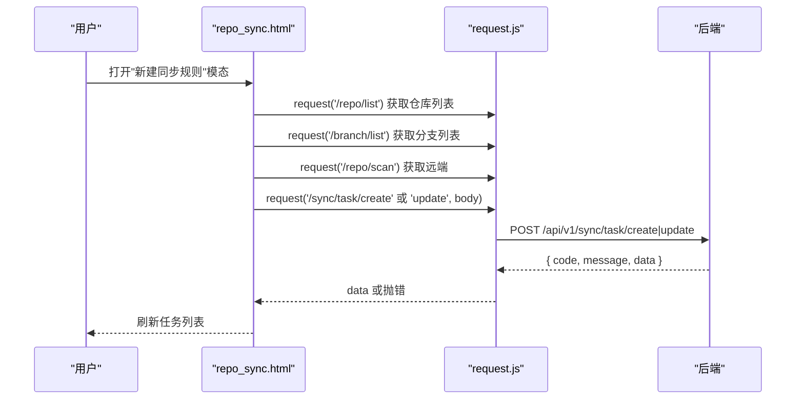
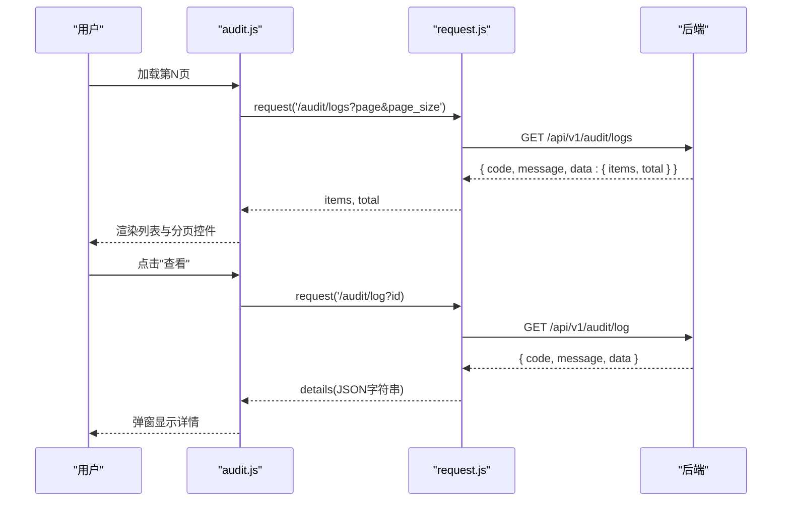
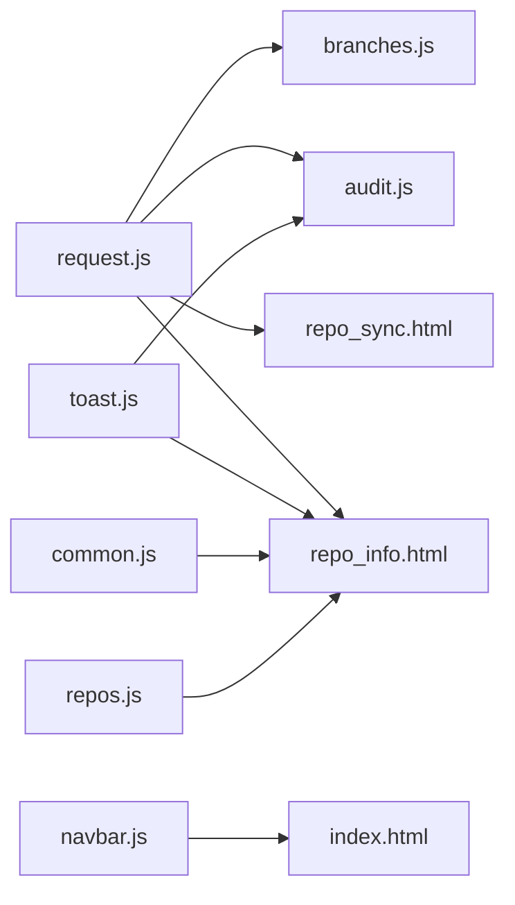

# 前端界面

<cite>
**本文引用的文件**
- [public/index.html](file://public/index.html)
- [public/repo_sync.html](file://public/repo_sync.html)
- [public/repo_info.html](file://public/repo_info.html)
- [public/js/request.js](file://public/js/request.js)
- [public/js/common.js](file://public/js/common.js)
- [public/js/toast.js](file://public/js/toast.js)
- [public/js/navbar.js](file://public/js/navbar.js)
- [public/js/branches.js](file://public/js/branches.js)
- [public/js/audit.js](file://public/js/audit.js)
- [public/js/repos.js](file://public/js/repos.js)
</cite>

## 目录
1. [简介](#简介)
2. [项目结构](#项目结构)
3. [核心组件](#核心组件)
4. [架构总览](#架构总览)
5. [详细组件分析](#详细组件分析)
6. [依赖关系分析](#依赖关系分析)
7. [性能考量](#性能考量)
8. [故障排查指南](#故障排查指南)
9. [结论](#结论)
10. [附录](#附录)

## 简介
本项目提供一套基于浏览器的 Git 仓库与分支管理界面，采用纯前端技术栈，通过统一的请求封装与 Bootstrap 组件库实现响应式布局与良好的跨浏览器兼容性。界面覆盖仓库管理、分支管理、同步任务、统计分析、审计日志等功能模块，配合后端 API 实现完整的 Git 管理能力。

## 项目结构
前端资源主要位于 public 目录，包含 HTML 页面与 JS 脚本：
- 页面文件：首页、仓库列表、分支详情、仓库同步配置、仓库详情（集成统计分析）、审计日志等
- 脚本文件：请求封装、通用工具、通知提示、导航栏、各页面业务逻辑

**更新**：仓库详情页面已重构为集成式三标签界面，替代了原有的独立统计页面

图表来源
- [public/index.html](file://public/index.html#L1-L71)
- [public/repo_sync.html](file://public/repo_sync.html#L1-L470)
- [public/repo_info.html](file://public/repo_info.html#L1-L1096)
- [public/js/request.js](file://public/js/request.js#L1-L67)
- [public/js/toast.js](file://public/js/toast.js#L1-L56)
- [public/js/navbar.js](file://public/js/navbar.js#L1-L39)
- [public/js/branches.js](file://public/js/branches.js#L1-L550)
- [public/js/audit.js](file://public/js/audit.js#L1-L118)
- [public/js/repos.js](file://public/js/repos.js#L1-L712)

章节来源
- [public/index.html](file://public/index.html#L1-L71)
- [public/repo_sync.html](file://public/repo_sync.html#L1-L470)
- [public/repo_info.html](file://public/repo_info.html#L1-L1096)
- [public/js/request.js](file://public/js/request.js#L1-L67)
- [public/js/toast.js](file://public/js/toast.js#L1-L56)
- [public/js/navbar.js](file://public/js/navbar.js#L1-L39)
- [public/js/branches.js](file://public/js/branches.js#L1-L550)
- [public/js/audit.js](file://public/js/audit.js#L1-L118)
- [public/js/repos.js](file://public/js/repos.js#L1-L712)

## 核心组件
- 请求封装层：统一处理 API 基础路径、错误处理、JSON 解析与非 JSON 响应（如导出）。
- 通知系统：基于 Bootstrap Toast 的轻量提示组件，支持多种类型与自动隐藏。
- 通用工具：状态颜色映射、日志弹窗、命令复制、SSH 密钥加载等。
- 导航栏：根据当前页面动态高亮，提供统一入口。
- 页面业务逻辑：分支管理、仓库同步、统计分析、审计日志等。

章节来源
- [public/js/request.js](file://public/js/request.js#L1-L67)
- [public/js/toast.js](file://public/js/toast.js#L1-L56)
- [public/js/common.js](file://public/js/common.js#L1-L50)
- [public/js/navbar.js](file://public/js/navbar.js#L1-L39)
- [public/js/branches.js](file://public/js/branches.js#L1-L550)
- [public/js/audit.js](file://public/js/audit.js#L1-L118)
- [public/js/repos.js](file://public/js/repos.js#L1-L712)

## 架构总览
前端采用"页面 + 脚本"的组织方式，所有页面共享统一的请求封装与 UI 组件，通过 URL 参数传递上下文（如仓库键值），并在 DOM 中注入动态内容。

图表来源
- [public/js/request.js](file://public/js/request.js#L11-L62)

## 详细组件分析

### 仓库管理页面（branches.html）
功能概述
- 展示指定仓库的本地与远程分支列表
- 支持分支搜索、切换、创建、推送、打标签、删除等操作
- 显示分支同步状态（领先/落后）、当前分支标识与上游关联

交互流程（分支切换）

图表来源
- [public/js/branches.js](file://public/js/branches.js#L308-L322)
- [public/js/request.js](file://public/js/request.js#L11-L62)

章节来源
- [public/js/branches.js](file://public/js/branches.js#L1-L550)

### 分支详情与对比（branch_detail.html 与 compare.html）
功能概述
- 分支详情页展示分支元信息、最近提交、上游/下游关系
- 对比页用于比较两个引用之间的差异，辅助合并决策

交互要点
- 通过 URL 参数传递仓库键与分支名
- 使用统一请求封装访问后端接口
- 详情页支持跳转到对比页

章节来源
- [public/js/branches.js](file://public/js/branches.js#L324-L326)

### 仓库详情与统计分析（repo_info.html）
**更新**：仓库详情页面已重构为集成式三标签界面

功能概述
- **基本信息标签**：展示仓库基本配置、当前版本、本地路径、Repo Key、配置来源，支持远程配置管理
- **Git有效提交度量标签**：按作者分布、近30天趋势、提交历史进行统计分析
- **真实工程代码度量标签**：按语言分布、Top 10语言、文件/代码/注释/空白统计进行深度分析

交互流程（统计分析）

图表来源
- [public/repo_info.html](file://public/repo_info.html#L667-L856)
- [public/js/request.js](file://public/js/request.js#L11-L62)

章节来源
- [public/repo_info.html](file://public/repo_info.html#L1-L1096)

### 仓库同步配置（repo_sync.html）
功能概述
- 管理同步任务：源/目标远端与分支、Cron 定时、Webhook 触发、Push 选项
- 查看执行历史与日志，支持立即执行任务
- 动态生成分支下拉列表，避免重复与前缀污染

交互流程（新建/编辑任务）

图表来源
- [public/repo_sync.html](file://public/repo_sync.html#L246-L419)
- [public/js/request.js](file://public/js/request.js#L11-L62)

章节来源
- [public/repo_sync.html](file://public/repo_sync.html#L1-L470)

### 审计日志（audit.html）
功能概述
- 分页展示审计日志，支持查看详情
- 日志动作类型按颜色区分（创建/更新/删除/同步）

交互流程（分页与详情）

图表来源
- [public/js/audit.js](file://public/js/audit.js#L12-L117)
- [public/js/request.js](file://public/js/request.js#L11-L62)

章节来源
- [public/js/audit.js](file://public/js/audit.js#L1-L118)

### 通用工具与组件
- 请求封装：统一 API 基础路径、错误处理、非 JSON 响应处理
- 通知系统：Toast 容器与消息提示
- 通用工具：状态颜色映射、日志弹窗、命令复制、SSH 密钥加载
- 导航栏：根据当前页面自动高亮

章节来源
- [public/js/request.js](file://public/js/request.js#L1-L67)
- [public/js/toast.js](file://public/js/toast.js#L1-L56)
- [public/js/common.js](file://public/js/common.js#L1-L50)
- [public/js/navbar.js](file://public/js/navbar.js#L1-L39)

## 依赖关系分析
- 页面对脚本的依赖：各页面通过引入公共脚本实现复用
- 脚本间耦合：request.js 作为唯一请求入口；toast.js 与 common.js 为工具类，被页面与业务脚本调用
- 外部依赖：Bootstrap CSS/JS 与图标库、ECharts 图表库（统计页）

**更新**：repo_info.html 现在依赖多个工具脚本（toast.js、common.js、repos.js）

图表来源
- [public/js/request.js](file://public/js/request.js#L1-L67)
- [public/js/toast.js](file://public/js/toast.js#L1-L56)
- [public/js/common.js](file://public/js/common.js#L1-L50)
- [public/js/navbar.js](file://public/js/navbar.js#L1-L39)
- [public/js/branches.js](file://public/js/branches.js#L1-L550)
- [public/js/audit.js](file://public/js/audit.js#L1-L118)
- [public/js/repos.js](file://public/js/repos.js#L1-L712)
- [public/repo_sync.html](file://public/repo_sync.html#L1-L470)
- [public/repo_info.html](file://public/repo_info.html#L1-L1096)

## 性能考量
- 请求缓存与去抖：页面首次加载时尽量合并请求，减少往返次数（如统计页并行加载分支与作者列表）
- 懒渲染：图表组件按需初始化，避免不必要的初始化开销
- 数据分页：审计日志与分支列表采用分页，降低一次性渲染压力
- 导出直连：CSV 导出直接跳转后端导出接口，避免前端内存占用
- 资源压缩：建议生产环境开启静态资源压缩与缓存策略

## 故障排查指南
常见问题与定位方法
- 请求失败：检查网络与后端服务状态；查看控制台错误与 toast 提示
- API 返回格式异常：确认后端返回结构是否符合 request.js 的预期
- 图表不显示：确认 ECharts 是否正确加载且容器尺寸有效
- 同步任务无分支选项：确认分支列表与远端扫描是否成功加载
- 导出无响应：确认后端导出接口可达且 content-type 正确

章节来源
- [public/js/request.js](file://public/js/request.js#L53-L62)
- [public/js/toast.js](file://public/js/toast.js#L18-L52)
- [public/js/branches.js](file://public/js/branches.js#L50-L62)
- [public/js/audit.js](file://public/js/audit.js#L12-L73)

## 结论
本前端界面以简洁清晰的模块化结构实现了 Git 仓库与分支管理的核心场景，借助统一的请求封装与 UI 组件，具备良好的可维护性与扩展性。通过合理的交互设计与性能优化，能够满足多仓库、多分支场景下的日常运维需求。

**更新**：仓库详情页面的重构显著提升了用户体验，将原本分散的统计功能整合到统一的界面中，减少了页面跳转成本，同时保持了强大的分析能力。

## 附录

### 响应式设计与跨浏览器兼容性
- 响应式：使用 Bootstrap 网格与断点，适配桌面与移动设备
- 兼容性：依赖现代浏览器的 fetch 与 Promise；建议在旧版浏览器引入 polyfill

### 主题与样式定制
- 主题：基于 Bootstrap 默认主题，可通过自定义 CSS 覆盖默认样式
- 图标：使用 Bootstrap Icons，支持按需替换或扩展

### 开发与调试建议
- 使用浏览器开发者工具检查网络请求与控制台错误
- 在 repo_info.html 中通过导出按钮验证后端导出接口
- 通过 audit.html 的详情弹窗核对审计日志字段
- 利用集成式统计界面的标签切换功能测试不同统计模块