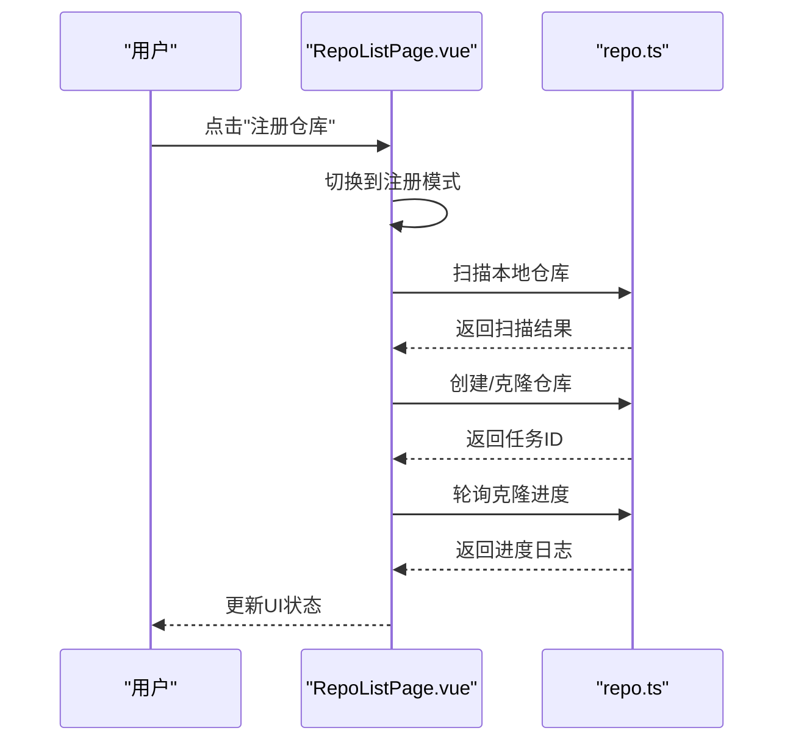
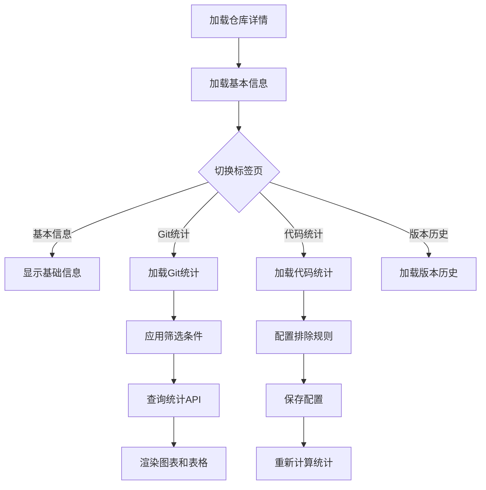
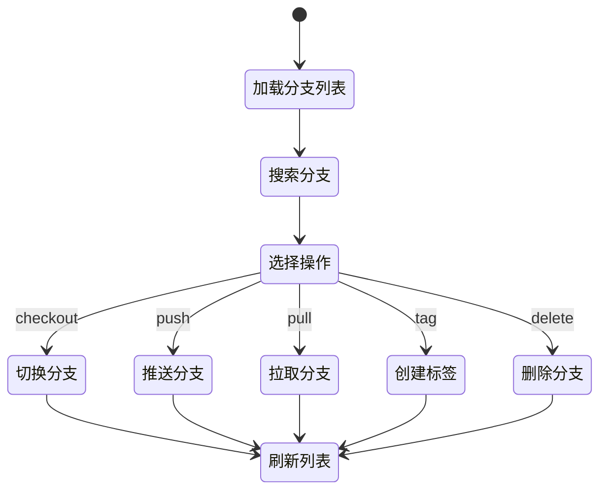
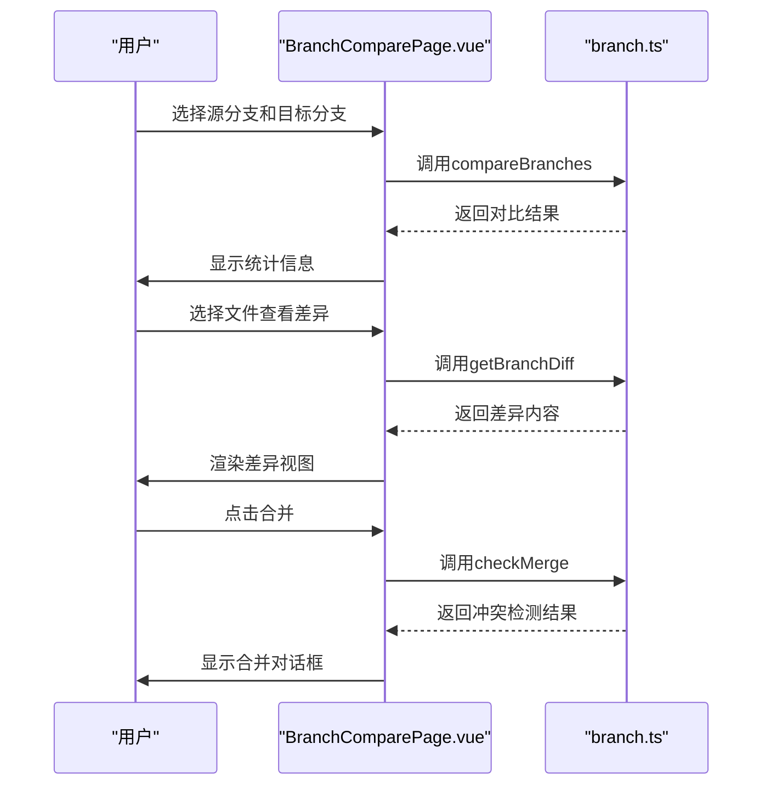
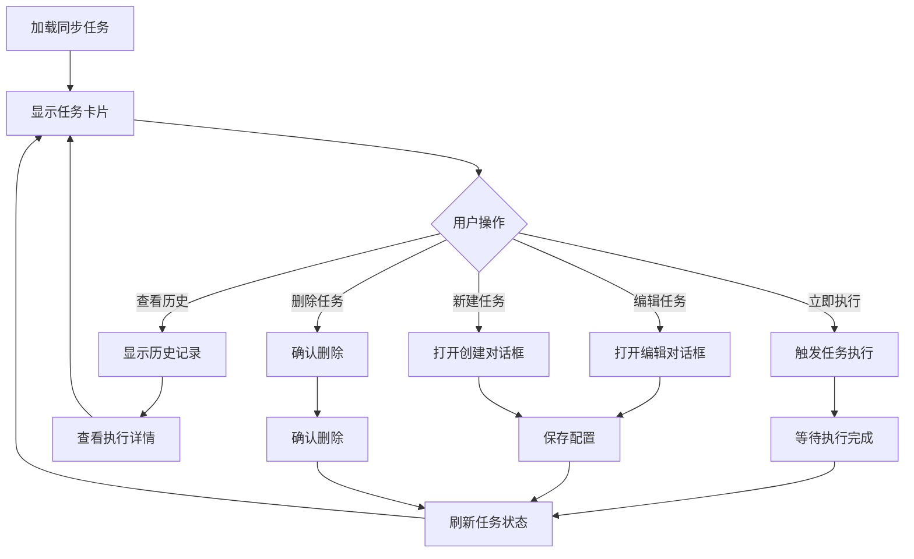
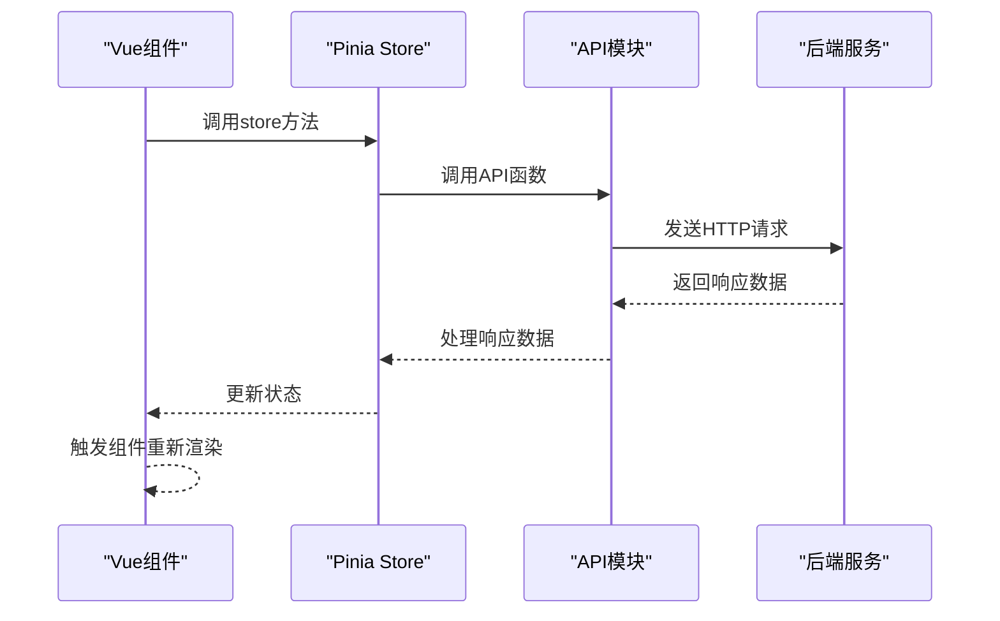
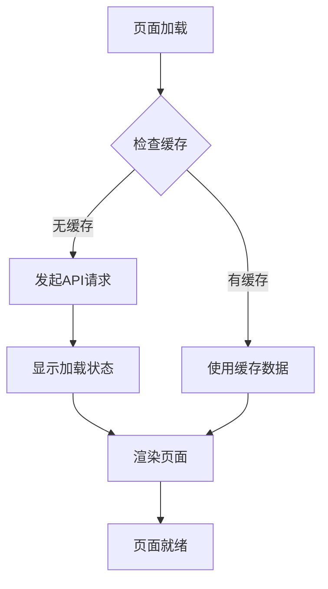

# 核心页面

<cite>
**本文档引用的文件**
- [frontend/src/views/repo/RepoListPage.vue](file://frontend/src/views/repo/RepoListPage.vue)
- [frontend/src/views/repo/RepoDetailPage.vue](file://frontend/src/views/repo/RepoDetailPage.vue)
- [frontend/src/views/branch/BranchListPage.vue](file://frontend/src/views/branch/BranchListPage.vue)
- [frontend/src/views/branch/BranchDetailPage.vue](file://frontend/src/views/branch/BranchDetailPage.vue)
- [frontend/src/views/branch/BranchComparePage.vue](file://frontend/src/views/branch/BranchComparePage.vue)
- [frontend/src/views/audit/AuditLogPage.vue](file://frontend/src/views/audit/AuditLogPage.vue)
- [frontend/src/views/sync/SyncTaskPage.vue](file://frontend/src/views/sync/SyncTaskPage.vue)
- [frontend/src/views/settings/SettingsPage.vue](file://frontend/src/views/settings/SettingsPage.vue)
- [frontend/src/views/home/HomePage.vue](file://frontend/src/views/home/HomePage.vue)
- [frontend/src/stores/useRepoStore.ts](file://frontend/src/stores/useRepoStore.ts)
- [frontend/src/api/modules/repo.ts](file://frontend/src/api/modules/repo.ts)
- [frontend/src/api/modules/branch.ts](file://frontend/src/api/modules/branch.ts)
- [frontend/src/api/modules/stats.ts](file://frontend/src/api/modules/stats.ts)
- [frontend/src/types/repo.ts](file://frontend/src/types/repo.ts)
- [frontend/src/types/branch.ts](file://frontend/src/types/branch.ts)
- [frontend/src/utils/format.ts](file://frontend/src/utils/format.ts)
- [frontend/src/main.ts](file://frontend/src/main.ts)
- [frontend/src/router/index.ts](file://frontend/src/router/index.ts)
- [frontend/src/components/layout/AppLayout.vue](file://frontend/src/components/layout/AppLayout.vue)
- [frontend/package.json](file://frontend/package.json)
- [frontend/vite.config.ts](file://frontend/vite.config.ts)
- [main.go](file://main.go)
- [router.go](file://router.go)
- [router_gen.go](file://router_gen.go)
</cite>

## 更新摘要
**变更内容**
- 全面迁移到Vue 3 Composition API架构，采用单文件组件(SFC)开发模式
- 引入Pinia状态管理，替代原有的全局状态管理方案
- 采用Element Plus组件库，提供现代化的UI交互体验
- 新增完整的仓库详情页面，包含三个标签页的统计分析功能
- 实现分支对比与合并的可视化界面，支持差异文件查看和冲突检测
- 增强同步任务页面的可视化展示，支持任务卡片式管理和历史记录查看
- 完善审计日志页面的分页展示和详情查看功能
- 新增系统设置页面，支持全局配置管理

## 目录
1. [简介](#简介)
2. [Vue组件架构](#vue组件架构)
3. [核心页面组件](#核心页面组件)
4. [状态管理与数据流](#状态管理与数据流)
5. [API接口层](#api接口层)
6. [路由与导航](#路由与导航)
7. [UI组件与样式](#ui组件与样式)
8. [性能优化与用户体验](#性能优化与用户体验)
9. [安全与权限控制](#安全与权限控制)
10. [总结](#总结)

## 简介
本文档详细介绍基于Vue 3 Composition API重构的核心页面功能，包括仓库管理、分支管理、同步任务、审计日志、系统设置等页面的完整实现。新架构采用单文件组件开发模式，结合Pinia状态管理、Element Plus组件库和现代化的TypeScript类型系统，提供了更加稳定和可维护的前端解决方案。

## Vue组件架构
新架构采用Vue 3 Composition API配合单文件组件(SFC)开发模式，每个页面都是一个独立的Vue组件，包含模板、脚本和样式的完整实现。

```mermaid
graph TB
subgraph "Vue 3 应用架构"
APP["App.vue<br/>应用根组件"]
LAYOUT["AppLayout.vue<br/>布局组件"]
HOME["HomePage.vue<br/>首页"]
REPO_LIST["RepoListPage.vue<br/>仓库列表"]
REPO_DETAIL["RepoDetailPage.vue<br/>仓库详情"]
BRANCH_LIST["BranchListPage.vue<br/>分支列表"]
BRANCH_DETAIL["BranchDetailPage.vue<br/>分支详情"]
BRANCH_COMPARE["BranchComparePage.vue<br/>分支对比"]
SYNC_TASK["SyncTaskPage.vue<br/>同步任务"]
AUDIT_LOG["AuditLogPage.vue<br/>审计日志"]
SETTINGS["SettingsPage.vue<br/>系统设置"]
END
subgraph "状态管理"
STORE["useRepoStore.ts<br/>仓库状态管理"]
PINIA["Pinia Store<br/>状态持久化"]
END
subgraph "API层"
REPO_API["repo.ts<br/>仓库API"]
BRANCH_API["branch.ts<br/>分支API"]
STATS_API["stats.ts<br/>统计API"]
SYSTEM_API["system.ts<br/>系统API"]
END
subgraph "类型定义"
REPO_TYPES["repo.ts<br/>仓库类型"]
BRANCH_TYPES["branch.ts<br/>分支类型"]
STATS_TYPES["stats.ts<br/>统计类型"]
END
APP --> LAYOUT
LAYOUT --> HOME
LAYOUT --> REPO_LIST
LAYOUT --> BRANCH_LIST
LAYOUT --> SYNC_TASK
LAYOUT --> AUDIT_LOG
LAYOUT --> SETTINGS
REPO_LIST --> STORE
REPO_DETAIL --> STORE
BRANCH_LIST --> STORE
BRANCH_DETAIL --> STORE
BRANCH_COMPARE --> STORE
STORE --> PINIA
STORE --> REPO_API
STORE --> BRANCH_API
STORE --> STATS_API
STORE --> SYSTEM_API
REPO_API --> REPO_TYPES
BRANCH_API --> BRANCH_TYPES
STATS_API --> STATS_TYPES
```

**图示来源**
- [frontend/src/views/repo/RepoListPage.vue](file://frontend/src/views/repo/RepoListPage.vue#L1-L489)
- [frontend/src/views/repo/RepoDetailPage.vue](file://frontend/src/views/repo/RepoDetailPage.vue#L1-L526)
- [frontend/src/stores/useRepoStore.ts](file://frontend/src/stores/useRepoStore.ts#L1-L35)
- [frontend/src/api/modules/repo.ts](file://frontend/src/api/modules/repo.ts#L1-L41)

## 核心页面组件

### 仓库管理页面
仓库管理页面采用卡片式布局，提供完整的仓库CRUD操作和批量管理功能。

**主要功能特性**
- 仓库列表展示：支持分页、搜索和状态标识
- 仓库注册：支持"接入现有仓库"和"克隆新仓库"两种模式
- 仓库编辑：支持修改仓库基本信息和远程配置
- 同步执行：快速发起同步任务
- 文件浏览：内置目录选择器，支持搜索和层级导航
- 克隆进度：实时显示克隆进度和日志

**用户交互流程**


**关键实现要点**
- 使用Element Plus的ElTable组件实现数据表格
- 采用ElDialog组件实现模态框交互
- 通过Pinia的useRepoStore管理仓库状态
- 支持SSH密钥和HTTP认证配置
- 实现文件浏览器的递归目录遍历

**章节来源**
- [frontend/src/views/repo/RepoListPage.vue](file://frontend/src/views/repo/RepoListPage.vue#L1-L489)
- [frontend/src/stores/useRepoStore.ts](file://frontend/src/stores/useRepoStore.ts#L1-L35)
- [frontend/src/api/modules/repo.ts](file://frontend/src/api/modules/repo.ts#L1-L41)

### 仓库详情页面
仓库详情页面提供三个标签页的完整统计分析功能，替代了原有的独立统计页面。

**标签页功能**
- **基本信息标签页**：显示仓库基础信息、远程配置和版本信息
- **Git有效提交度量标签页**：提供分支选择、作者筛选、日期范围筛选，展示统计图表和提交历史
- **真实工程代码度量标签页**：展示代码行数统计、语言分布和排除配置管理
- **版本历史标签页**：以时间轴形式展示版本标签信息

**统计分析功能**


**实现特点**
- 使用Element Plus的ElTabs组件实现标签页切换
- 集成统计图表和数据可视化功能
- 支持CSV数据导出
- 实现排除配置的实时保存和重新统计

**章节来源**
- [frontend/src/views/repo/RepoDetailPage.vue](file://frontend/src/views/repo/RepoDetailPage.vue#L1-L526)
- [frontend/src/api/modules/stats.ts](file://frontend/src/api/modules/stats.ts#L1-L42)

### 分支管理页面
分支管理页面提供完整的分支生命周期管理功能，包括创建、删除、切换、推送等操作。

**功能特性**
- 分支列表：支持本地/远端双标签页切换
- 分支搜索：支持关键字搜索和过滤
- 操作按钮：提供切换、推送、拉取、打标签等操作
- 远端管理：支持远端分支检出为本地分支
- 同步状态：显示分支的ahead/behind状态

**分支操作流程**


**实现细节**
- 使用Element Plus的ElCard和ElTable组件
- 支持分支状态的实时显示
- 实现远端分支与本地分支的关联检测
- 提供批量操作和确认对话框

**章节来源**
- [frontend/src/views/branch/BranchListPage.vue](file://frontend/src/views/branch/BranchListPage.vue#L1-L480)
- [frontend/src/api/modules/branch.ts](file://frontend/src/api/modules/branch.ts#L1-L71)

### 分支详情页面
分支详情页面提供分支的详细统计信息和操作功能。

**功能特性**
- 统计卡片：显示总代码行数、提交总数、贡献者数、文件类型
- 提交历史：展示最近提交记录和贡献者排行
- 未提交变更：检测并显示工作区状态
- 操作功能：支持推送远端、提交变更、删除分支

**实现特点**
- 使用Element Plus的ElRow和ElCol实现响应式布局
- 集成统计分析API获取分支详细信息
- 实现工作区状态检测和变更提交功能
- 支持批量推送和配置Git作者信息

**章节来源**
- [frontend/src/views/branch/BranchDetailPage.vue](file://frontend/src/views/branch/BranchDetailPage.vue#L1-L384)

### 分支对比页面
分支对比页面提供可视化差异查看和合并功能。

**功能特性**
- 分支选择：支持源分支和目标分支的选择
- 对比统计：显示变更文件数量、新增/删除行数
- 差异查看：支持行对比和并排对比两种模式
- 合并功能：支持冲突检测和自动合并
- Patch导出：支持导出差异补丁文件

**对比流程**


**实现技术**
- 集成diff2html库实现差异内容渲染
- 支持多种差异查看模式
- 实现冲突检测和自动合并
- 提供Patch文件导出功能

**章节来源**
- [frontend/src/views/branch/BranchComparePage.vue](file://frontend/src/views/branch/BranchComparePage.vue#L1-L361)

### 同步任务页面
同步任务页面提供任务的可视化管理和历史记录查看功能。

**功能特性**
- 任务卡片：以卡片形式展示同步任务配置
- 任务管理：支持创建、编辑、删除和立即执行
- 历史记录：查看每次执行的详细信息和日志
- 状态标识：显示任务的启用状态和执行状态
- 配置管理：支持Cron定时和Push选项配置

**任务管理流程**


**实现特点**
- 使用Element Plus的ElCard组件实现任务卡片
- 支持任务状态的实时更新
- 提供详细的执行历史和日志查看
- 实现任务配置的可视化编辑

**章节来源**
- [frontend/src/views/sync/SyncTaskPage.vue](file://frontend/src/views/sync/SyncTaskPage.vue#L1-L344)

### 审计日志页面
审计日志页面提供操作记录的分页展示和详情查看功能。

**功能特性**
- 日志列表：分页展示操作审计记录
- 时间排序：按时间倒序排列
- 操作类型：支持不同操作类型的标识
- 详情查看：支持查看详细的操作信息
- 分页导航：支持日志记录的分页浏览

**实现特点**
- 使用Element Plus的ElPagination组件实现分页
- 支持操作类型的彩色标识
- 实现JSON格式详情的美化显示
- 提供刷新功能重新加载日志

**章节来源**
- [frontend/src/views/audit/AuditLogPage.vue](file://frontend/src/views/audit/AuditLogPage.vue#L1-L134)

### 系统设置页面
系统设置页面提供全局配置管理和API文档访问功能。

**功能特性**
- 调试模式：支持开启/关闭调试模式
- 全局Git配置：设置默认的提交作者信息
- 配置保存：支持配置的保存和恢复
- API文档：提供在线Swagger文档链接

**实现特点**
- 使用Element Plus的表单组件
- 支持配置的实时预览和保存
- 集成系统配置API
- 提供配置重置功能

**章节来源**
- [frontend/src/views/settings/SettingsPage.vue](file://frontend/src/views/settings/SettingsPage.vue#L1-L84)

## 状态管理与数据流

### Pinia状态管理
新架构采用Pinia作为状态管理解决方案，提供更好的TypeScript支持和开发体验。

**useRepoStore实现**
```typescript
export const useRepoStore = defineStore('repo', () => {
  const repoList = ref<RepoDTO[]>([])
  const currentRepo = ref<RepoDTO | null>(null)
  const loading = ref(false)

  async function fetchRepoList() {
    loading.value = true
    try {
      repoList.value = await getRepoList()
    } finally {
      loading.value = false
    }
  }

  async function fetchRepoDetail(key: string) {
    loading.value = true
    try {
      currentRepo.value = await getRepoDetail(key)
    } finally {
      loading.value = false
    }
  }

  function getRepoByKey(key: string) {
    return repoList.value.find((r) => r.key === key)
  }

  return { repoList, currentRepo, loading, fetchRepoList, fetchRepoDetail, getRepoByKey }
})
```

**数据流架构**


**章节来源**
- [frontend/src/stores/useRepoStore.ts](file://frontend/src/stores/useRepoStore.ts#L1-L35)

## API接口层

### 统一API模块设计
每个功能模块都有对应的API模块，提供类型安全的接口封装。

**仓库API模块**
```typescript
export function getRepoList() {
  return request.get<unknown, RepoDTO[]>('/repo/list')
}

export function getRepoDetail(repoKey: string) {
  return request.get<unknown, RepoDTO>('/repo/detail', { params: { key: repoKey } })
}

export function createRepo(data: RegisterRepoReq) {
  return request.post<unknown, RepoDTO>('/repo/create', data)
}

export function cloneRepo(data: CloneRepoReq) {
  return request.post<unknown, { task_id: string }>('/repo/clone', data)
}
```

**分支API模块**
```typescript
export function getBranchList(repoKey: string, params?: { 
  page?: number; 
  page_size?: number; 
  keyword?: string; 
  type?: string 
}) {
  return request.get<unknown, PaginationResponse<BranchInfo>>('/branch/list', {
    params: { repo_key: repoKey, ...params },
  })
}

export function compareBranches(repoKey: string, base: string, target: string) {
  return request.get<unknown, { 
    stat: { FilesChanged: number; Insertions: number; Deletions: number }; 
    files: { path: string; status: string }[] 
  }>('/branch/compare', {
    params: { repo_key: repoKey, base, target },
  })
}
```

**统计API模块**
```typescript
export function getStatsAnalyze(repoKey: string, params?: { 
  branch?: string; 
  author?: string; 
  since?: string; 
  until?: string 
}) {
  return request.get<unknown, StatsResponse>('/stats/analyze', {
    params: { repo_key: repoKey, ...params },
  })
}

export function exportStatsCsv(repoKey: string, params?: Record<string, string>) {
  return request.get('/stats/export/csv', {
    params: { repo_key: repoKey, ...params },
    responseType: 'blob',
  })
}
```

**章节来源**
- [frontend/src/api/modules/repo.ts](file://frontend/src/api/modules/repo.ts#L1-L41)
- [frontend/src/api/modules/branch.ts](file://frontend/src/api/modules/branch.ts#L1-L71)
- [frontend/src/api/modules/stats.ts](file://frontend/src/api/modules/stats.ts#L1-L42)

## 路由与导航

### 路由配置
新架构采用Vue Router 4.x，提供声明式的路由配置和嵌套路由支持。

**路由结构**
```typescript
const routes: RouteRecordRaw[] = [
  {
    path: '/',
    name: 'Home',
    component: HomePage,
  },
  {
    path: '/repos',
    name: 'RepoList',
    component: RepoListPage,
  },
  {
    path: '/repos/:repoKey',
    name: 'RepoDetail',
    component: RepoDetailPage,
    props: true,
  },
  {
    path: '/repos/:repoKey/branches',
    name: 'BranchList',
    component: BranchListPage,
    props: true,
  },
  {
    path: '/repos/:repoKey/branches/:branchName',
    name: 'BranchDetail',
    component: BranchDetailPage,
    props: true,
  },
  {
    path: '/repos/:repoKey/compare',
    name: 'BranchCompare',
    component: BranchComparePage,
    props: true,
  },
  {
    path: '/repos/:repoKey/sync',
    name: 'SyncTask',
    component: SyncTaskPage,
    props: true,
  },
  {
    path: '/audit',
    name: 'AuditLog',
    component: AuditLogPage,
  },
  {
    path: '/settings',
    name: 'Settings',
    component: SettingsPage,
  },
]
```

**导航特点**
- 支持动态路由参数传递
- 实现父子组件间的参数传递
- 提供面包屑导航和页面标题
- 支持路由守卫和权限控制

**章节来源**
- [frontend/src/router/index.ts](file://frontend/src/router/index.ts)

## UI组件与样式

### Element Plus组件库
新架构全面采用Element Plus组件库，提供丰富的UI组件和良好的用户体验。

**常用组件**
- **表格组件**：ElTable、ElTableColumn用于数据展示
- **表单组件**：ElForm、ElFormItem用于数据输入
- **对话框组件**：ElDialog用于模态框交互
- **卡片组件**：ElCard用于内容分区
- **标签页组件**：ElTabs、ElTabPane用于页面分组

**样式系统**
- 使用CSS Modules实现组件样式隔离
- 支持主题定制和变量覆盖
- 实现响应式布局适配
- 提供深色模式支持

**章节来源**
- [frontend/src/views/repo/RepoListPage.vue](file://frontend/src/views/repo/RepoListPage.vue#L1-L489)
- [frontend/src/views/repo/RepoDetailPage.vue](file://frontend/src/views/repo/RepoDetailPage.vue#L1-L526)

## 性能优化与用户体验

### 性能优化策略
新架构采用了多项性能优化措施：

**组件懒加载**
- 使用动态导入实现组件懒加载
- 减少初始包体积
- 提升首屏加载速度

**状态缓存**
- Pinia store提供状态缓存
- 避免重复的API调用
- 支持状态持久化

**虚拟滚动**
- 大列表数据使用虚拟滚动
- 提升大数据量下的渲染性能
- 减少DOM节点数量

**用户体验改进**
- 加载状态指示器
- 错误处理和重试机制
- 操作确认对话框
- 实时进度反馈

### 加载优化


## 安全与权限控制

### 安全措施
新架构在安全性方面采取了多项措施：

**认证与授权**
- 基于后端的认证机制
- 路由级别的权限控制
- API接口的访问控制

**数据安全**
- 敏感信息的加密存储
- SSH密钥的安全管理
- HTTP认证的传输加密

**操作审计**
- 所有重要操作记录审计日志
- 操作人和IP地址的追踪
- 操作详情的详细记录

**章节来源**
- [frontend/src/views/audit/AuditLogPage.vue](file://frontend/src/views/audit/AuditLogPage.vue#L1-L134)

## 总结
Vue 3 Composition API架构的重构为Git管理服务带来了显著的改进：

**技术优势**
- 更好的TypeScript支持和类型安全
- 更清晰的组件逻辑分离
- 更强大的状态管理能力
- 更好的开发体验和调试支持

**用户体验提升**
- 更现代化的UI界面
- 更流畅的交互体验
- 更完善的错误处理
- 更友好的操作反馈

**维护性改善**
- 更清晰的代码结构
- 更好的模块化设计
- 更容易的测试和调试
- 更便捷的代码复用

新架构为后续功能扩展和性能优化奠定了坚实的基础，提供了更加稳定和可维护的前端解决方案。