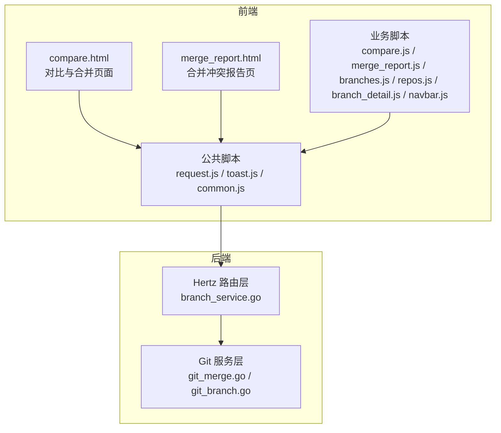
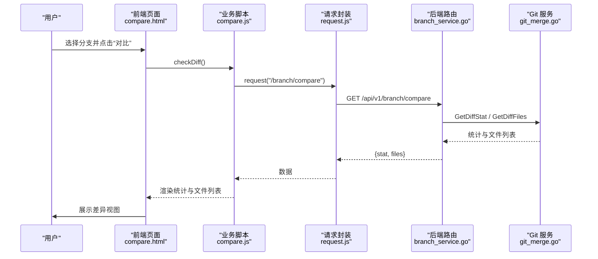
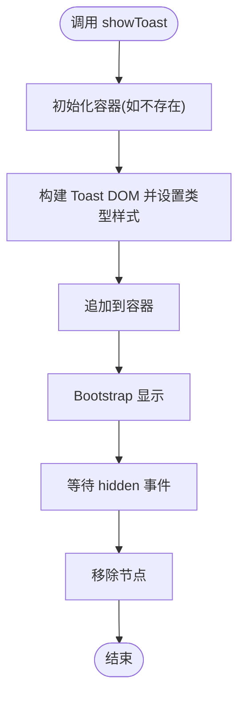
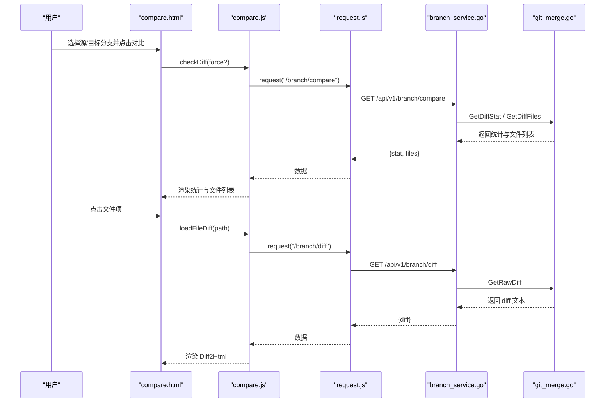
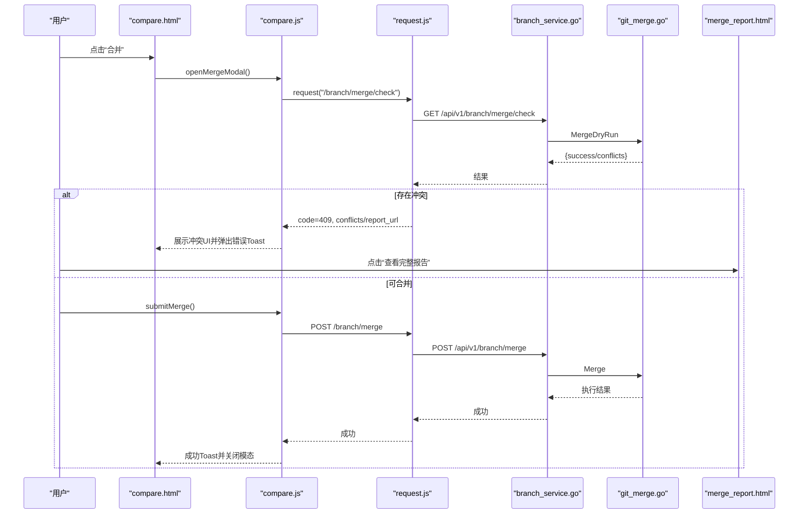
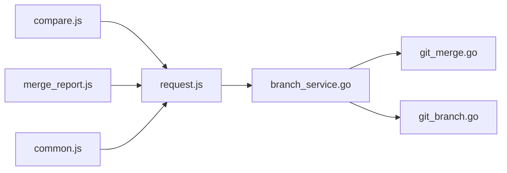

# 用户交互

<cite>
**本文引用的文件**
- [public/js/toast.js](file://public/js/toast.js)
- [public/js/request.js](file://public/js/request.js)
- [public/js/compare.js](file://public/js/compare.js)
- [public/js/merge_report.js](file://public/js/merge_report.js)
- [public/js/common.js](file://public/js/common.js)
- [public/js/navbar.js](file://public/js/navbar.js)
- [public/js/repos.js](file://public/js/repos.js)
- [public/js/branches.js](file://public/js/branches.js)
- [public/js/branch_detail.js](file://public/js/branch_detail.js)
- [public/compare.html](file://public/compare.html)
- [public/merge_report.html](file://public/merge_report.html)
- [biz/handler/branch/branch_service.go](file://biz/handler/branch/branch_service.go)
- [biz/service/git/git_merge.go](file://biz/service/git/git_merge.go)
</cite>

## 目录
1. [简介](#简介)
2. [项目结构](#项目结构)
3. [核心组件](#核心组件)
4. [架构总览](#架构总览)
5. [详细组件分析](#详细组件分析)
6. [依赖关系分析](#依赖关系分析)
7. [性能考量](#性能考量)
8. [故障排查指南](#故障排查指南)
9. [结论](#结论)
10. [附录](#附录)

## 简介
本文件聚焦于该 Git 管理服务项目的用户交互体验，围绕以下主题展开：
- Toast 通知系统的设计与使用
- 代码对比功能的交互设计与视觉呈现
- 合并报告页面的用户操作流程与反馈机制
- 表单验证与输入提示策略
- 按钮状态管理与加载动画处理
- 键盘快捷键支持与无障碍访问考虑
- 用户操作的确认机制与撤销思路
- 交互性能优化与用户体验改进建议

## 项目结构
前端采用模块化 JavaScript 文件组织，配合 HTML 模板与 Bootstrap 组件实现一致的交互风格；后端通过 Hertz 路由层对接 Git 服务层，提供分支对比、差异展示、合并预检与执行等能力。

**图表来源**
- [public/compare.html](file://public/compare.html#L1-L189)
- [public/merge_report.html](file://public/merge_report.html#L1-L108)
- [public/js/request.js](file://public/js/request.js#L1-L67)
- [public/js/toast.js](file://public/js/toast.js#L1-L56)
- [public/js/compare.js](file://public/js/compare.js#L1-L281)
- [public/js/merge_report.js](file://public/js/merge_report.js#L1-L65)
- [biz/handler/branch/branch_service.go](file://biz/handler/branch/branch_service.go#L352-L496)
- [biz/service/git/git_merge.go](file://biz/service/git/git_merge.go#L157-L242)

**章节来源**
- [public/compare.html](file://public/compare.html#L1-L189)
- [public/merge_report.html](file://public/merge_report.html#L1-L108)
- [public/js/request.js](file://public/js/request.js#L1-L67)
- [public/js/toast.js](file://public/js/toast.js#L1-L56)
- [public/js/compare.js](file://public/js/compare.js#L1-L281)
- [public/js/merge_report.js](file://public/js/merge_report.js#L1-L65)
- [biz/handler/branch/branch_service.go](file://biz/handler/branch/branch_service.go#L352-L496)
- [biz/service/git/git_merge.go](file://biz/service/git/git_merge.go#L157-L242)

## 核心组件
- 通用请求封装与错误兜底：统一处理响应结构、非 JSON 响应与异常抛出，并在失败时调用全局 Toast 提示。
- Toast 通知系统：基于 Bootstrap Toast 实现，支持成功、错误、警告、信息四种类型，自动隐藏清理 DOM。
- 对比与合并流程：页面加载分支、触发对比、渲染差异、预检冲突、弹窗确认与执行合并。
- 合并报告页：展示冲突文件清单与解决指引，提供返回与导航。
- 公共交互：日志弹窗、命令复制提示、SSH 密钥下拉填充等。

**章节来源**
- [public/js/request.js](file://public/js/request.js#L1-L67)
- [public/js/toast.js](file://public/js/toast.js#L1-L56)
- [public/js/compare.js](file://public/js/compare.js#L1-L281)
- [public/js/merge_report.js](file://public/js/merge_report.js#L1-L65)
- [public/js/common.js](file://public/js/common.js#L1-L50)

## 架构总览
前端通过 request.js 发起 API 请求，后端路由层解析参数并调用 Git 服务层执行具体操作，最终以统一响应结构返回给前端。Toast 在请求失败时统一弹出，保证一致的用户反馈。

**图表来源**
- [public/compare.html](file://public/compare.html#L1-L189)
- [public/js/compare.js](file://public/js/compare.js#L59-L127)
- [public/js/request.js](file://public/js/request.js#L11-L62)
- [biz/handler/branch/branch_service.go](file://biz/handler/branch/branch_service.go#L352-L388)
- [biz/service/git/git_merge.go](file://biz/service/git/git_merge.go#L21-L94)

## 详细组件分析

### Toast 通知系统
- 设计要点
  - 容器按需初始化，固定定位，层级高于模态框。
  - 支持四类样式映射，语义化角色与无障碍属性齐全。
  - 自动隐藏后清理节点，避免内存泄漏。
- 使用方式
  - 全局暴露函数，任何模块可直接调用。
  - 请求失败时由 request.js 自动触发，无需重复处理。
- 可扩展建议
  - 支持队列与去重，避免短时间内大量重复提示。
  - 提供可配置显示时长与位置。

**图表来源**
- [public/js/toast.js](file://public/js/toast.js#L3-L52)

**章节来源**
- [public/js/toast.js](file://public/js/toast.js#L1-L56)
- [public/js/request.js](file://public/js/request.js#L53-L61)

### 代码对比与差异展示
- 交互设计
  - 页面加载时自动拉取分支列表，支持 URL 参数预选源/目标分支。
  - 对比按钮禁用期间显示加载文案与 Spinner，避免重复提交。
  - 文件列表按状态着色（新增/修改/删除），点击即刻加载对应差异。
  - 差异视图支持行内与并排两种模式，同步滚动增强阅读体验。
- 视觉呈现
  - 统计卡片展示变更文件数、新增/删除行数，突出关键指标。
  - 文件列表滚动区域限定高度，提升大列表可读性。
- 错误处理
  - 加载失败时统一弹出错误提示，避免页面空白。
  - 无差异时提示“无差异”，二进制文件提示“无内容差异”。

**图表来源**
- [public/compare.html](file://public/compare.html#L24-L120)
- [public/js/compare.js](file://public/js/compare.js#L59-L169)
- [public/js/request.js](file://public/js/request.js#L11-L62)
- [biz/handler/branch/branch_service.go](file://biz/handler/branch/branch_service.go#L390-L412)
- [biz/service/git/git_merge.go](file://biz/service/git/git_merge.go#L109-L148)

**章节来源**
- [public/compare.html](file://public/compare.html#L1-L189)
- [public/js/compare.js](file://public/js/compare.js#L1-L281)
- [public/js/request.js](file://public/js/request.js#L1-L67)
- [biz/handler/branch/branch_service.go](file://biz/handler/branch/branch_service.go#L352-L412)
- [biz/service/git/git_merge.go](file://biz/service/git/git_merge.go#L21-L94)

### 合并报告页面与操作流程
- 用户操作流程
  - 合并预检失败时，后端返回 200 但 code 为 409，并携带冲突清单与报告链接。
  - 前端收到 409 后展示冲突 UI，同时弹出错误提示，引导用户前往合并报告页。
  - 报告页加载冲突清单与推荐策略，提供手动解决指引与返回按钮。
- 反馈机制
  - 成功合并后刷新对比结果，清空差异。
  - 失败或冲突时统一通过 Toast 提示与页面提示告知原因。

**图表来源**
- [public/js/compare.js](file://public/js/compare.js#L184-L280)
- [public/js/merge_report.js](file://public/js/merge_report.js#L1-L65)
- [public/js/request.js](file://public/js/request.js#L11-L62)
- [biz/handler/branch/branch_service.go](file://biz/handler/branch/branch_service.go#L414-L496)
- [biz/service/git/git_merge.go](file://biz/service/git/git_merge.go#L157-L242)

**章节来源**
- [public/js/compare.js](file://public/js/compare.js#L184-L280)
- [public/js/merge_report.js](file://public/js/merge_report.js#L1-L65)
- [biz/handler/branch/branch_service.go](file://biz/handler/branch/branch_service.go#L414-L496)
- [biz/service/git/git_merge.go](file://biz/service/git/git_merge.go#L157-L242)

### 表单验证与输入提示
- 分支创建/重命名/标签创建/提交等场景均在前端进行基础校验（如必填字段），并在失败时通过 Toast 提示。
- 提交变更前检查仓库状态，若无变更则禁用提交按钮并提示“无变更”。
- 推送前校验远端选择，避免空选择导致无效操作。

**章节来源**
- [public/js/branches.js](file://public/js/branches.js#L227-L253)
- [public/js/branches.js](file://public/js/branches.js#L264-L291)
- [public/js/branches.js](file://public/js/branches.js#L502-L549)
- [public/js/branch_detail.js](file://public/js/branch_detail.js#L204-L236)
- [public/js/branches.js](file://public/js/branches.js#L386-L414)

### 按钮状态管理与加载动画
- 对比按钮在请求期间禁用并替换为带 Spinner 的文案，结束后恢复。
- 合并按钮在提交时禁用并替换为“合并中…”文案，异常或完成后恢复。
- 远端连接测试按钮在请求期间替换为 Spinner 并禁用，结束后恢复图标与状态。
- 同步/推送/删除等操作在确认后禁用并替换为相应文案，完成后恢复。

**章节来源**
- [public/js/compare.js](file://public/js/compare.js#L69-L126)
- [public/js/compare.js](file://public/js/compare.js#L242-L280)
- [public/js/repos.js](file://public/js/repos.js#L206-L239)
- [public/js/branches.js](file://public/js/branches.js#L328-L342)
- [public/js/branches.js](file://public/js/branches.js#L386-L414)

### 键盘快捷键支持与无障碍访问
- 无障碍属性
  - Toast 容器与按钮具备 role、aria-live、aria-atomic 等属性，便于屏幕阅读器识别。
  - 模态框与按钮具备 data-bs-dismiss、aria-label 等属性，提升可访问性。
- 快捷键建议
  - 对比页可增加键盘快捷键：回车触发对比、Esc 关闭模态、Tab/F6 顺序导航。
  - 差异视图可支持快捷键：上下移动、Home/End 定位、Ctrl+Enter 打开合并。

**章节来源**
- [public/js/toast.js](file://public/js/toast.js#L28-L33)
- [public/compare.html](file://public/compare.html#L128-L180)

### 用户操作的确认机制与撤销思路
- 删除/切换/推送/同步等高风险操作均通过浏览器 confirm 弹窗二次确认，避免误操作。
- 合并失败或冲突时，后端执行自动 abort（在失败时回滚），前端提示并引导用户修复。
- 建议引入撤销栈：对最近一次分支操作记录快照，提供“撤销”按钮或快捷键。

**章节来源**
- [public/js/branches.js](file://public/js/branches.js#L293-L306)
- [public/js/branches.js](file://public/js/branches.js#L308-L322)
- [public/js/branches.js](file://public/js/branches.js#L344-L414)
- [biz/service/git/git_merge.go](file://biz/service/git/git_merge.go#L220-L242)

## 依赖关系分析
- 前端模块耦合
  - compare.js 依赖 request.js 与 toast.js，负责对比、差异渲染与合并流程。
  - merge_report.js 依赖 request.js 与 toast.js，负责冲突报告展示。
  - common.js 提供通用 UI 辅助（日志弹窗、命令复制、SSH 下拉）。
- 后端模块耦合
  - branch_service.go 作为路由层，调用 git_merge.go 与 git_branch.go 执行具体逻辑。
  - 统一响应结构由 response 包提供，前端 request.js 解析并抛错。

**图表来源**
- [public/js/compare.js](file://public/js/compare.js#L1-L281)
- [public/js/merge_report.js](file://public/js/merge_report.js#L1-L65)
- [public/js/common.js](file://public/js/common.js#L1-L50)
- [public/js/request.js](file://public/js/request.js#L1-L67)
- [biz/handler/branch/branch_service.go](file://biz/handler/branch/branch_service.go#L352-L496)
- [biz/service/git/git_merge.go](file://biz/service/git/git_merge.go#L157-L242)

**章节来源**
- [public/js/compare.js](file://public/js/compare.js#L1-L281)
- [public/js/merge_report.js](file://public/js/merge_report.js#L1-L65)
- [public/js/common.js](file://public/js/common.js#L1-L50)
- [public/js/request.js](file://public/js/request.js#L1-L67)
- [biz/handler/branch/branch_service.go](file://biz/handler/branch/branch_service.go#L352-L496)
- [biz/service/git/git_merge.go](file://biz/service/git/git_merge.go#L157-L242)

## 性能考量
- 请求节流与防抖
  - 对比按钮在请求期间禁用，避免重复点击造成并发请求。
  - URL 参数预选分支时，仅在两个值都存在时自动触发对比。
- 渲染优化
  - 差异视图采用 Diff2Html，支持同步滚动与高亮，减少阅读成本。
  - 文件列表限定最大高度并启用滚动，避免大列表卡顿。
- 资源加载
  - 仅在需要时加载 Diff2Html 资源，避免首屏阻塞。
- 错误与降级
  - 二进制文件无 diff 文本时，前端提示“无内容差异”，避免空渲染。
  - 请求失败统一通过 Toast 提示，避免页面崩溃。

**章节来源**
- [public/js/compare.js](file://public/js/compare.js#L59-L127)
- [public/js/compare.js](file://public/js/compare.js#L129-L169)
- [public/compare.html](file://public/compare.html#L94-L120)

## 故障排查指南
- 对比失败
  - 检查源/目标分支是否为空或相同。
  - 查看 Toast 是否弹出错误信息，确认网络与权限。
- 合并失败/冲突
  - 根据合并报告页的冲突清单逐项解决，遵循推荐策略。
  - 若后端返回 409，前端会展示冲突 UI 并弹出错误提示。
- 日志与命令
  - 使用日志弹窗查看命令与输出，支持一键复制命令。
- 连接测试
  - 远端连接测试按钮会在请求期间显示 Spinner 并禁用，结束后根据结果更新按钮颜色与提示。

**章节来源**
- [public/js/compare.js](file://public/js/compare.js#L184-L280)
- [public/js/merge_report.js](file://public/js/merge_report.js#L34-L64)
- [public/js/common.js](file://public/js/common.js#L11-L29)
- [public/js/repos.js](file://public/js/repos.js#L206-L239)

## 结论
该项目在用户交互层面实现了清晰的反馈闭环：统一的请求封装与 Toast 提示、直观的对比与差异展示、完善的合并冲突报告与指引，以及稳健的按钮状态管理与错误兜底。后续可在快捷键支持、撤销机制、提示队列与去重等方面进一步优化，以提升高级用户的操作效率与整体体验。

## 附录
- 术语
  - Diff2Html：用于渲染 Git 差异文本的可视化组件。
  - Dry Run：不实际执行合并，仅检查是否存在冲突。
- 参考文件
  - [public/js/toast.js](file://public/js/toast.js#L1-L56)
  - [public/js/request.js](file://public/js/request.js#L1-L67)
  - [public/js/compare.js](file://public/js/compare.js#L1-L281)
  - [public/js/merge_report.js](file://public/js/merge_report.js#L1-L65)
  - [public/js/common.js](file://public/js/common.js#L1-L50)
  - [public/js/navbar.js](file://public/js/navbar.js#L1-L39)
  - [public/js/repos.js](file://public/js/repos.js#L1-L712)
  - [public/js/branches.js](file://public/js/branches.js#L1-L550)
  - [public/js/branch_detail.js](file://public/js/branch_detail.js#L1-L282)
  - [public/compare.html](file://public/compare.html#L1-L189)
  - [public/merge_report.html](file://public/merge_report.html#L1-L108)
  - [biz/handler/branch/branch_service.go](file://biz/handler/branch/branch_service.go#L352-L496)
  - [biz/service/git/git_merge.go](file://biz/service/git/git_merge.go#L157-L242)