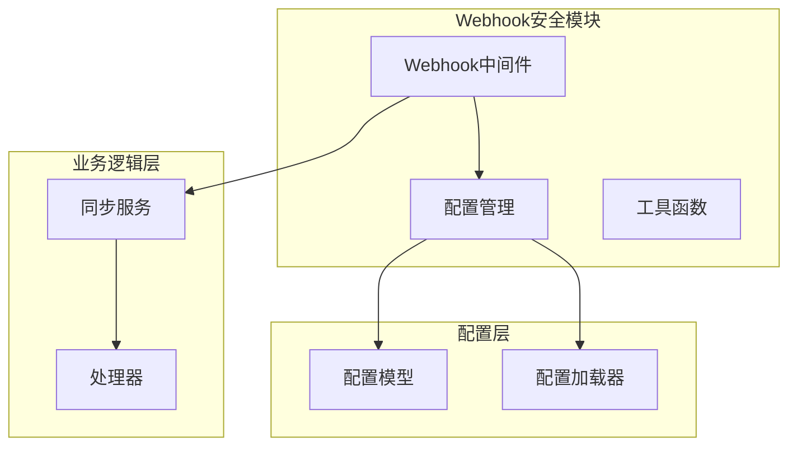
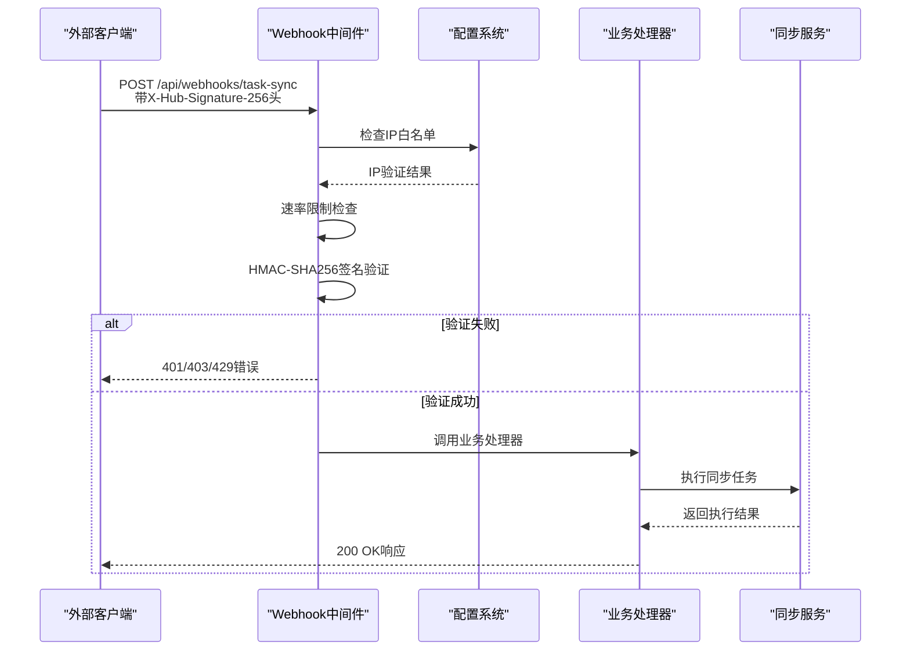
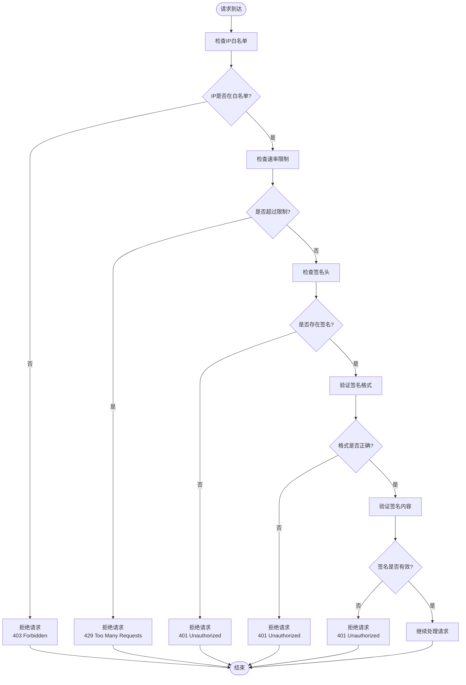
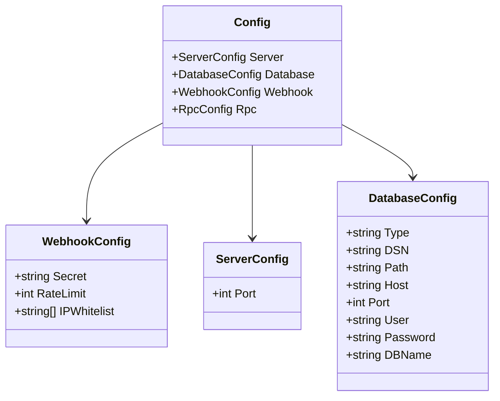
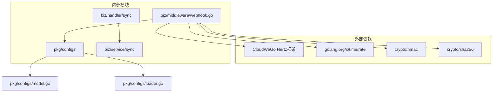

# Webhook安全验证

<cite>
**本文档引用的文件**
- [biz/middleware/webhook.go](file://biz/middleware/webhook.go)
- [docs/webhook.md](file://docs/webhook.md)
- [pkg/configs/config.go](file://pkg/configs/config.go)
- [pkg/configs/loader.go](file://pkg/configs/loader.go)
- [pkg/configs/model.go](file://pkg/configs/model.go)
- [test/webhook_client/main.go](file://test/webhook_client/main.go)
- [public/repo_sync.html](file://public/repo_sync.html)
- [biz/handler/sync/sync_service.go](file://biz/handler/sync/sync_service.go)
</cite>

## 目录
1. [简介](#简介)
2. [项目结构](#项目结构)
3. [核心组件](#核心组件)
4. [架构概览](#架构概览)
5. [详细组件分析](#详细组件分析)
6. [依赖关系分析](#依赖关系分析)
7. [性能考虑](#性能考虑)
8. [故障排除指南](#故障排除指南)
9. [结论](#结论)
10. [附录](#附录)

## 简介

本文件提供了该代码库中Webhook安全验证的综合文档。系统实现了基于HMAC-SHA256的签名验证、IP白名单控制和速率限制等多重安全机制，确保Webhook请求的安全性和可靠性。

## 项目结构

该项目采用分层架构设计，Webhook安全验证主要涉及以下模块：

**图表来源**
- [biz/middleware/webhook.go](file://biz/middleware/webhook.go#L1-L70)
- [pkg/configs/config.go](file://pkg/configs/config.go#L1-L42)
- [pkg/configs/model.go](file://pkg/configs/model.go#L1-L34)

**章节来源**
- [biz/middleware/webhook.go](file://biz/middleware/webhook.go#L1-L70)
- [pkg/configs/config.go](file://pkg/configs/config.go#L1-L42)
- [pkg/configs/loader.go](file://pkg/configs/loader.go#L1-L46)

## 核心组件

### Webhook安全中间件

Webhook安全中间件是整个安全验证的核心组件，实现了三层防护机制：

1. **IP白名单检查** - 可选的IP来源限制
2. **速率限制** - 基于令牌桶算法的请求频率控制
3. **签名验证** - 基于HMAC-SHA256的请求完整性验证

### 配置管理系统

配置系统提供了灵活的配置管理能力，支持文件配置和环境变量覆盖：

- Webhook密钥配置
- 速率限制参数
- IP白名单设置
- 默认值管理和环境变量优先级

### 测试客户端

提供了完整的Webhook测试客户端，演示了正确的签名生成和请求发送方式。

**章节来源**
- [biz/middleware/webhook.go](file://biz/middleware/webhook.go#L18-L69)
- [pkg/configs/config.go](file://pkg/configs/config.go#L8-L16)
- [test/webhook_client/main.go](file://test/webhook_client/main.go#L1-L36)

## 架构概览

Webhook安全验证的整体架构如下：

**图表来源**
- [biz/middleware/webhook.go](file://biz/middleware/webhook.go#L18-L69)
- [biz/handler/sync/sync_service.go](file://biz/handler/sync/sync_service.go#L147-L163)

## 详细组件分析

### Webhook中间件实现

Webhook中间件实现了完整的安全验证流程：

#### IP白名单验证
- 支持可选的IP来源限制
- 动态IP检测和匹配
- 未命中白名单时直接拒绝请求

#### 速率限制机制
- 基于golang.org/x/time/rate包的令牌桶算法
- 可配置的每分钟请求数限制
- 实时流量控制和突发处理

#### 签名验证算法
- 使用HMAC-SHA256算法
- 支持标准的X-Hub-Signature-256头格式
- 完整的请求体内容参与签名计算

**图表来源**
- [biz/middleware/webhook.go](file://biz/middleware/webhook.go#L18-L69)

**章节来源**
- [biz/middleware/webhook.go](file://biz/middleware/webhook.go#L18-L69)

### 配置管理系统

配置系统提供了灵活的配置管理机制：

#### 配置模型定义

**图表来源**
- [pkg/configs/model.go](file://pkg/configs/model.go#L3-L34)

#### 配置加载流程
- 支持多路径配置文件搜索
- YAML配置文件解析
- 环境变量自动注入
- 默认值设置和覆盖机制

**章节来源**
- [pkg/configs/model.go](file://pkg/configs/model.go#L29-L33)
- [pkg/configs/loader.go](file://pkg/configs/loader.go#L9-L46)
- [pkg/configs/config.go](file://pkg/configs/config.go#L18-L42)

### 测试客户端实现

测试客户端展示了正确的Webhook调用方式：

#### 签名生成流程
- 使用HMAC-SHA256算法
- 正确的十六进制编码
- 标准的sha256=前缀格式

#### 请求发送示例
- JSON内容类型设置
- 必需的头部信息
- 完整的请求体结构

**章节来源**
- [test/webhook_client/main.go](file://test/webhook_client/main.go#L13-L35)

## 依赖关系分析

Webhook安全验证系统的依赖关系如下：

**图表来源**
- [biz/middleware/webhook.go](file://biz/middleware/webhook.go#L3-L14)
- [pkg/configs/config.go](file://pkg/configs/config.go#L1-L16)

**章节来源**
- [biz/middleware/webhook.go](file://biz/middleware/webhook.go#L3-L14)
- [pkg/configs/config.go](file://pkg/configs/config.go#L1-L16)

## 性能考虑

### 速率限制优化
- 使用令牌桶算法确保公平的请求分配
- 可配置的突发处理能力
- 内存友好的实现方式

### 签名验证性能
- 单次HMAC计算开销极小
- 内存中完成所有操作
- 避免不必要的字符串转换

### IP白名单效率
- 数组查找优化
- 缓存常见的IP地址
- 最小化配置读取次数

## 故障排除指南

### 常见问题诊断

#### 401 Unauthorized错误
可能原因：
- 缺少X-Hub-Signature-256头部
- 签名格式不正确（缺少sha256=前缀）
- 密钥不匹配或请求体被修改

解决方法：
- 确保使用正确的HMAC-SHA256算法
- 验证签名生成过程的每个步骤
- 检查请求体的完整性和编码

#### 403 Forbidden错误
可能原因：
- 客户端IP不在白名单中
- 配置文件中的IP地址格式错误

解决方法：
- 检查配置文件中的IP白名单设置
- 验证客户端的实际IP地址
- 确认网络代理和负载均衡器的影响

#### 429 Too Many Requests错误
可能原因：
- 超过配置的速率限制
- 短时间内大量并发请求

解决方法：
- 调整webhook.rate_limit配置
- 实现客户端重试逻辑
- 分散请求时间点

### 调试建议

1. **启用调试模式** - 设置DebugMode为true以获取更多日志信息
2. **检查配置加载** - 验证配置文件和环境变量的正确性
3. **验证签名生成** - 使用测试客户端确认签名算法的正确性
4. **监控请求模式** - 分析请求频率和模式以优化配置

**章节来源**
- [pkg/configs/config.go](file://pkg/configs/config.go#L8-L16)
- [docs/webhook.md](file://docs/webhook.md#L55-L60)

## 结论

该Webhook安全验证系统提供了全面的安全保护机制，包括IP白名单、速率限制和签名验证等多重防护。系统设计合理，配置灵活，易于部署和维护。通过遵循本文档的最佳实践和故障排除指南，可以确保Webhook接口的安全性和可靠性。

## 附录

### 配置参考

#### Webhook配置选项
- `webhook.secret` - Webhook签名密钥
- `webhook.rate_limit` - 每分钟最大请求数
- `webhook.ip_whitelist` - 允许访问的IP地址列表

#### 环境变量映射
- `WEBHOOK_SECRET` - 覆盖webhook.secret
- `WEBHOOK_RATE_LIMIT` - 覆盖webhook.rate_limit

### 安全最佳实践

1. **定期轮换密钥** - 建议每90天更换一次Webhook密钥
2. **最小权限原则** - 仅授予必要的IP地址访问权限
3. **监控和告警** - 设置异常请求模式的监控和告警
4. **日志审计** - 记录所有Webhook请求的日志用于审计
5. **HTTPS强制** - 在生产环境中强制使用HTTPS传输

### 测试验证清单

- [ ] 验证正确的签名生成和验证
- [ ] 测试IP白名单功能
- [ ] 验证速率限制效果
- [ ] 模拟各种错误场景
- [ ] 性能压力测试
- [ ] 安全渗透测试