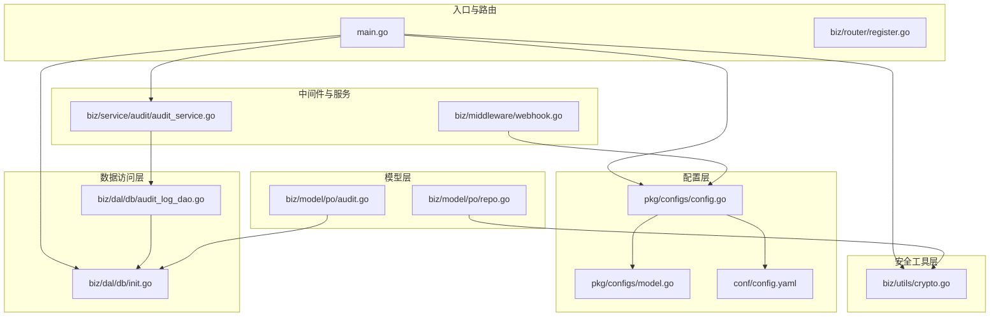
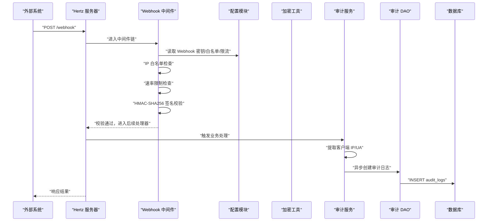
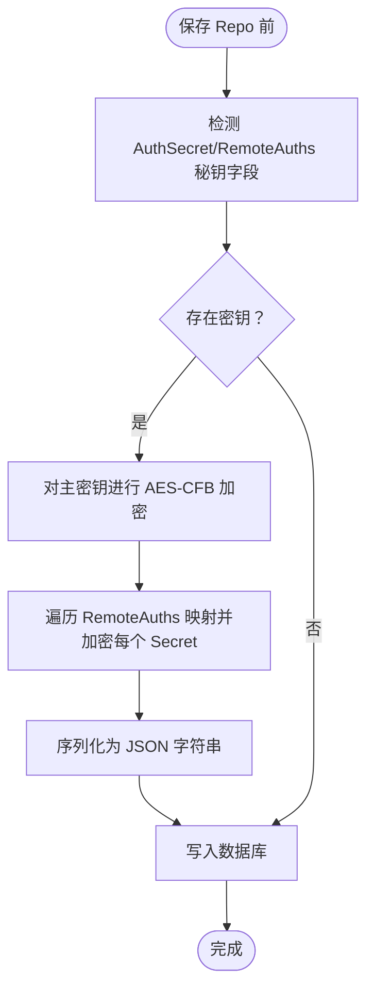
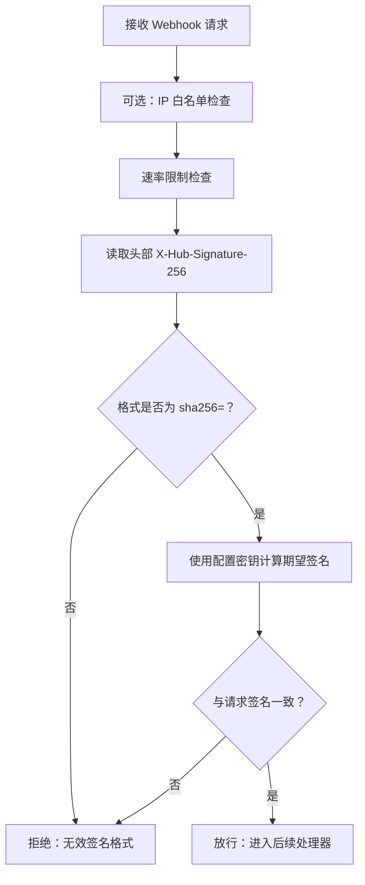
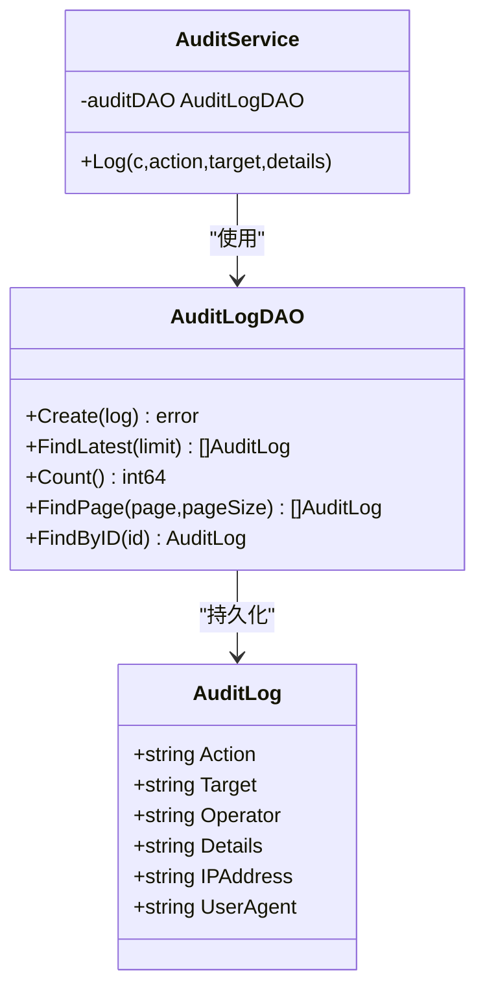
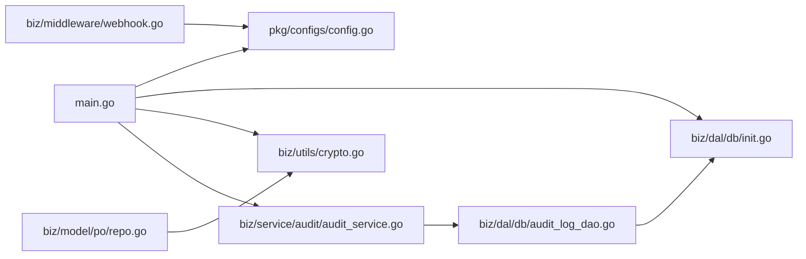

# 安全审计

<cite>
**本文引用的文件**
- [main.go](file://main.go)
- [biz/middleware/webhook.go](file://biz/middleware/webhook.go)
- [pkg/configs/config.go](file://pkg/configs/config.go)
- [pkg/configs/model.go](file://pkg/configs/model.go)
- [conf/config.yaml](file://conf/config.yaml)
- [biz/utils/crypto.go](file://biz/utils/crypto.go)
- [biz/model/po/repo.go](file://biz/model/po/repo.go)
- [biz/model/po/audit.go](file://biz/model/po/audit.go)
- [biz/dal/db/audit_log_dao.go](file://biz/dal/db/audit_log_dao.go)
- [biz/dal/db/init.go](file://biz/dal/db/init.go)
- [biz/service/audit/audit_service.go](file://biz/service/audit/audit_service.go)
- [biz/handler/audit/audit_service.go](file://biz/handler/audit/audit_service.go)
- [biz/router/register.go](file://biz/router/register.go)
- [pkg/errno/errno.go](file://pkg/errno/errno.go)
- [OPTIMIZATION_PLAN.md](file://OPTIMIZATION_PLAN.md)
</cite>

## 目录
1. [简介](#简介)
2. [项目结构](#项目结构)
3. [核心组件](#核心组件)
4. [架构总览](#架构总览)
5. [详细组件分析](#详细组件分析)
6. [依赖关系分析](#依赖关系分析)
7. [性能考量](#性能考量)
8. [故障排查指南](#故障排查指南)
9. [结论](#结论)
10. [附录](#附录)

## 简介
本文件面向“安全审计”主题，基于当前代码库现状，系统梳理并说明以下方面：
- 数据加密存储的实现机制与安全策略
- 认证授权机制的设计与配置方法（现状与建议）
- 输入验证与 SQL 注入防护措施
- Webhook 安全验证与签名机制
- 操作日志记录与审计追踪实现
- 异常监控与安全告警配置
- 安全漏洞评估与修复建议
- 数据安全、隐私保护与访问控制最佳实践
- 安全测试与渗透测试指导

## 项目结构
项目采用分层与模块化组织方式，安全相关能力主要分布在如下层次：
- 配置与密钥管理：配置加载、Webhook 密钥与限流、数据库连接
- 加解密工具：对称加密、密钥来源与初始化
- 数据模型与持久化：审计日志表、仓库凭据加密、GORM 生命周期钩子
- Webhook 中间件：IP 白名单、速率限制、签名验证
- 审计服务：异步记录审计日志
- 路由注册：统一挂载各模块接口

图表来源
- [main.go](file://main.go#L115-L134)
- [pkg/configs/config.go](file://pkg/configs/config.go#L18-L42)
- [pkg/configs/model.go](file://pkg/configs/model.go#L1-L34)
- [conf/config.yaml](file://conf/config.yaml#L1-L25)
- [biz/utils/crypto.go](file://biz/utils/crypto.go#L15-L22)
- [biz/dal/db/init.go](file://biz/dal/db/init.go#L18-L71)
- [biz/dal/db/audit_log_dao.go](file://biz/dal/db/audit_log_dao.go#L1-L46)
- [biz/model/po/audit.go](file://biz/model/po/audit.go#L1-L21)
- [biz/model/po/repo.go](file://biz/model/po/repo.go#L30-L62)
- [biz/middleware/webhook.go](file://biz/middleware/webhook.go#L16-L68)
- [biz/service/audit/audit_service.go](file://biz/service/audit/audit_service.go#L17-L50)
- [biz/router/register.go](file://biz/router/register.go#L18-L41)

章节来源
- [main.go](file://main.go#L115-L134)
- [biz/router/register.go](file://biz/router/register.go#L18-L41)

## 核心组件
- 配置与密钥管理：集中加载配置，暴露 Webhook 密钥、速率限制、IP 白名单等；同时兼容环境变量覆盖
- 加密工具：AES-CFB 对称加密，密钥来自环境变量，开发默认密钥用于快速启动
- 数据模型与生命周期钩子：仓库凭据在保存前加密、查询后解密；审计日志模型定义字段与索引
- Webhook 中间件：IP 白名单、速率限制、HMAC-SHA256 签名验证
- 审计服务：从请求上下文提取客户端 IP 与 UA，构造审计日志并异步落库
- 路由注册：统一挂载模块路由，便于集中治理

章节来源
- [pkg/configs/config.go](file://pkg/configs/config.go#L18-L42)
- [pkg/configs/model.go](file://pkg/configs/model.go#L29-L33)
- [conf/config.yaml](file://conf/config.yaml#L21-L24)
- [biz/utils/crypto.go](file://biz/utils/crypto.go#L15-L22)
- [biz/model/po/repo.go](file://biz/model/po/repo.go#L30-L62)
- [biz/model/po/audit.go](file://biz/model/po/audit.go#L7-L16)
- [biz/middleware/webhook.go](file://biz/middleware/webhook.go#L16-L68)
- [biz/service/audit/audit_service.go](file://biz/service/audit/audit_service.go#L24-L50)
- [biz/router/register.go](file://biz/router/register.go#L18-L41)

## 架构总览
下图展示了安全相关的关键交互流程：配置加载、Webhook 请求校验、凭据加密、审计日志记录。

图表来源
- [biz/middleware/webhook.go](file://biz/middleware/webhook.go#L18-L68)
- [pkg/configs/config.go](file://pkg/configs/config.go#L28-L37)
- [biz/service/audit/audit_service.go](file://biz/service/audit/audit_service.go#L24-L50)
- [biz/dal/db/audit_log_dao.go](file://biz/dal/db/audit_log_dao.go#L13-L15)
- [biz/dal/db/init.go](file://biz/dal/db/init.go#L66-L70)

## 详细组件分析

### 数据加密存储：实现机制与安全策略
- 实现机制
  - 对称加密：采用 AES-CFB 模式，随机 IV，密钥来自环境变量 ENCRYPTION_KEY
  - 生命周期钩子：仓库模型在保存前对主密钥与远程凭据映射中的密钥进行加密；查询后解密还原
  - 初始化：应用启动时调用初始化函数设置加密密钥
- 安全策略
  - 密钥管理：生产必须设置 ENCRYPTION_KEY，避免使用默认值
  - 最小暴露：仅在内存与 API 返回时解密，数据库中存储密文
  - 传输安全：结合 HTTPS 与最小权限原则，防止明文泄露
  - 审计关联：审计日志记录操作行为与来源，便于追踪异常

图表来源
- [biz/model/po/repo.go](file://biz/model/po/repo.go#L30-L62)
- [biz/utils/crypto.go](file://biz/utils/crypto.go#L24-L44)

章节来源
- [biz/utils/crypto.go](file://biz/utils/crypto.go#L15-L22)
- [biz/model/po/repo.go](file://biz/model/po/repo.go#L30-L62)
- [main.go](file://main.go#L125-L126)

### 认证授权机制：设计与配置
- 现状
  - 审计服务中操作员字段目前为固定值，尚未接入真实用户身份
  - Webhook 中间件未强制要求鉴权，仅做来源校验
- 建议
  - 引入统一鉴权中间件，支持 JWT 或会话机制
  - 为敏感接口增加 RBAC 权限校验
  - 审计日志记录 Operator 字段，确保可追溯
  - 配置项扩展：新增鉴权开关、白名单、超时等参数

章节来源
- [biz/service/audit/audit_service.go](file://biz/service/audit/audit_service.go#L35-L42)
- [biz/middleware/webhook.go](file://biz/middleware/webhook.go#L18-L68)

### 输入验证与 SQL 注入防护
- 输入验证
  - 建议在 DTO/Binder 层使用结构体标签进行必填、长度、枚举等校验
  - 前端与后端双重校验，避免绕过
- SQL 注入防护
  - ORM 使用：GORM 已内置参数化查询，避免直接拼接 SQL
  - 审计列表接口已对列表视图排除大字段以降低风险
  - 建议：对动态表名/列名进行白名单校验

章节来源
- [biz/dal/db/audit_log_dao.go](file://biz/dal/db/audit_log_dao.go#L32-L38)
- [AGENT.md](file://AGENT.md#L1155-L1164)

### Webhook 安全验证与签名机制
- IP 白名单：可选，仅允许指定来源 IP
- 速率限制：基于令牌桶算法，按配置限流
- 签名验证：使用 HMAC-SHA256，头部 X-Hub-Signature-256 格式为 sha256=<hex>
- 配置来源：配置文件与环境变量覆盖

图表来源
- [biz/middleware/webhook.go](file://biz/middleware/webhook.go#L18-L68)
- [pkg/configs/config.go](file://pkg/configs/config.go#L28-L37)
- [conf/config.yaml](file://conf/config.yaml#L21-L24)

章节来源
- [biz/middleware/webhook.go](file://biz/middleware/webhook.go#L16-L68)
- [pkg/configs/config.go](file://pkg/configs/config.go#L28-L37)
- [conf/config.yaml](file://conf/config.yaml#L21-L24)

### 操作日志记录与审计追踪
- 数据模型：审计日志包含动作、目标、操作人、详情、IP、UA 等字段，并建立索引
- DAO：提供创建、分页查询、总数统计、最新条目查询等方法
- 服务：从请求上下文提取 IP/UA，构造日志并异步写入
- Handler：提供审计日志列表与详情查询接口

图表来源
- [biz/model/po/audit.go](file://biz/model/po/audit.go#L7-L16)
- [biz/dal/db/audit_log_dao.go](file://biz/dal/db/audit_log_dao.go#L7-L45)
- [biz/service/audit/audit_service.go](file://biz/service/audit/audit_service.go#L11-L21)

章节来源
- [biz/model/po/audit.go](file://biz/model/po/audit.go#L7-L16)
- [biz/dal/db/audit_log_dao.go](file://biz/dal/db/audit_log_dao.go#L13-L45)
- [biz/service/audit/audit_service.go](file://biz/service/audit/audit_service.go#L24-L50)
- [biz/handler/audit/audit_service.go](file://biz/handler/audit/audit_service.go#L16-L76)

### 异常监控与安全告警
- 错误码体系：提供认证、标签、系统等分类的错误码，便于统一处理与上报
- 建议：集成统一错误转换与日志埋点，结合审计日志形成闭环
- 告警：参考优化计划中“通知与告警”，可扩展为 Webhook 出站告警（钉钉/飞书/Slack/Email）

章节来源
- [pkg/errno/errno.go](file://pkg/errno/errno.go#L82-L128)
- [OPTIMIZATION_PLAN.md](file://OPTIMIZATION_PLAN.md#L39-L45)

## 依赖关系分析
- 启动流程：main 负责加载配置、初始化数据库与加密、启动审计服务
- Webhook：依赖配置模块读取密钥与限流参数
- 加密：依赖环境变量密钥，仓库模型在 GORM 生命周期钩子中使用
- 审计：依赖 DAO 与数据库初始化

图表来源
- [main.go](file://main.go#L115-L134)
- [biz/middleware/webhook.go](file://biz/middleware/webhook.go#L16-L16)
- [biz/utils/crypto.go](file://biz/utils/crypto.go#L15-L22)
- [biz/model/po/repo.go](file://biz/model/po/repo.go#L30-L62)
- [biz/service/audit/audit_service.go](file://biz/service/audit/audit_service.go#L17-L21)
- [biz/dal/db/audit_log_dao.go](file://biz/dal/db/audit_log_dao.go#L13-L15)
- [biz/dal/db/init.go](file://biz/dal/db/init.go#L66-L70)

章节来源
- [main.go](file://main.go#L115-L134)
- [biz/middleware/webhook.go](file://biz/middleware/webhook.go#L16-L16)
- [biz/utils/crypto.go](file://biz/utils/crypto.go#L15-L22)
- [biz/model/po/repo.go](file://biz/model/po/repo.go#L30-L62)
- [biz/service/audit/audit_service.go](file://biz/service/audit/audit_service.go#L17-L21)
- [biz/dal/db/audit_log_dao.go](file://biz/dal/db/audit_log_dao.go#L13-L15)
- [biz/dal/db/init.go](file://biz/dal/db/init.go#L66-L70)

## 性能考量
- 审计列表排除大字段：DAO 在分页查询时排除 details 字段，减少网络与 IO 开销
- 异步落库：审计日志采用 goroutine 异步写入，避免阻塞主流程
- 速率限制：Webhook 中间件使用令牌桶限流，防止突发流量

章节来源
- [biz/dal/db/audit_log_dao.go](file://biz/dal/db/audit_log_dao.go#L32-L38)
- [biz/service/audit/audit_service.go](file://biz/service/audit/audit_service.go#L47-L50)
- [biz/middleware/webhook.go](file://biz/middleware/webhook.go#L16-L16)

## 故障排查指南
- Webhook 401/403/429
  - 检查密钥是否与上游一致
  - 校验头部 X-Hub-Signature-256 格式
  - 查看速率限制阈值与当前 QPS
- 加密异常
  - 确认 ENCRYPTION_KEY 是否设置且长度满足要求
  - 检查密文是否被篡改或截断
- 审计日志缺失
  - 确认审计服务初始化与 DAO 连接正常
  - 检查数据库迁移是否完成
- 配置未生效
  - 检查配置文件与环境变量覆盖顺序
  - 确认配置加载路径与文件名

章节来源
- [biz/middleware/webhook.go](file://biz/middleware/webhook.go#L42-L65)
- [pkg/configs/config.go](file://pkg/configs/config.go#L33-L37)
- [biz/utils/crypto.go](file://biz/utils/crypto.go#L15-L22)
- [biz/dal/db/init.go](file://biz/dal/db/init.go#L66-L70)

## 结论
当前代码库在安全方面已具备基础能力：Webhook 签名验证、速率限制、凭据加密与审计日志记录。建议下一步完善认证授权、输入校验、异常监控与告警体系，并持续开展安全测试与渗透测试，以达到企业级安全标准。

## 附录

### 安全测试与渗透测试指导
- 测试清单
  - Webhook：伪造请求、篡改签名、越权 IP、突发流量压测
  - 加密：密钥变更、密文篡改、空密钥场景
  - 审计：日志完整性、IP/UA 采集、高并发写入
  - 配置：环境变量覆盖、配置热更新
- 渗透测试要点
  - 参数注入、越权访问、敏感信息泄露
  - 速率限制绕过、暴力破解
  - 日志轮转与留存策略

章节来源
- [biz/middleware/webhook.go](file://biz/middleware/webhook.go#L18-L68)
- [biz/utils/crypto.go](file://biz/utils/crypto.go#L24-L70)
- [biz/service/audit/audit_service.go](file://biz/service/audit/audit_service.go#L24-L50)
- [pkg/configs/config.go](file://pkg/configs/config.go#L33-L37)