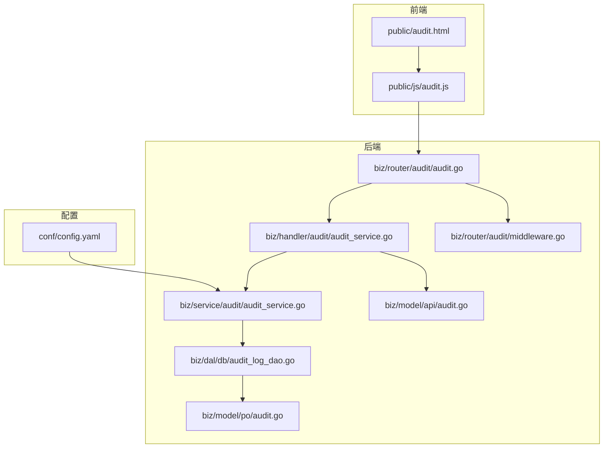
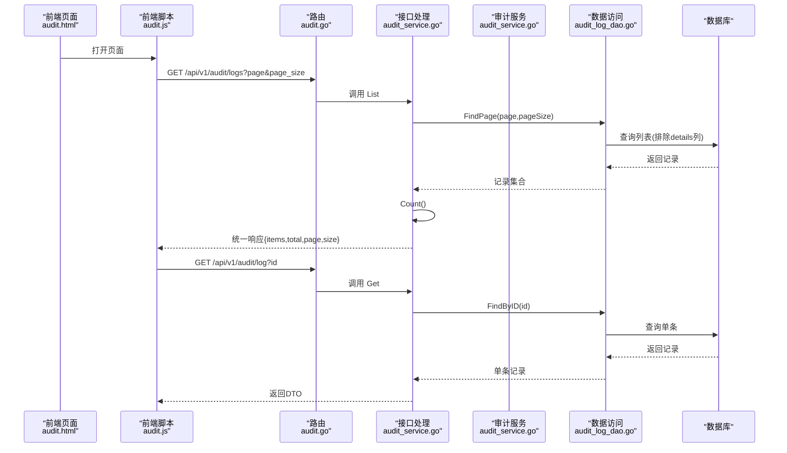
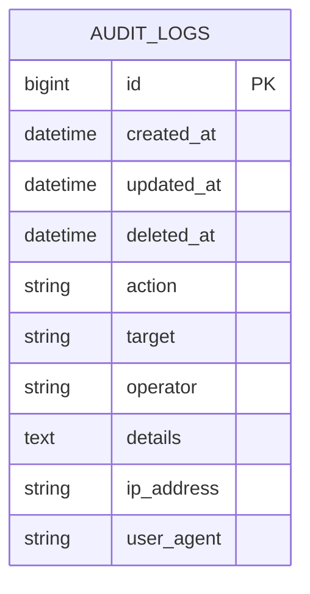
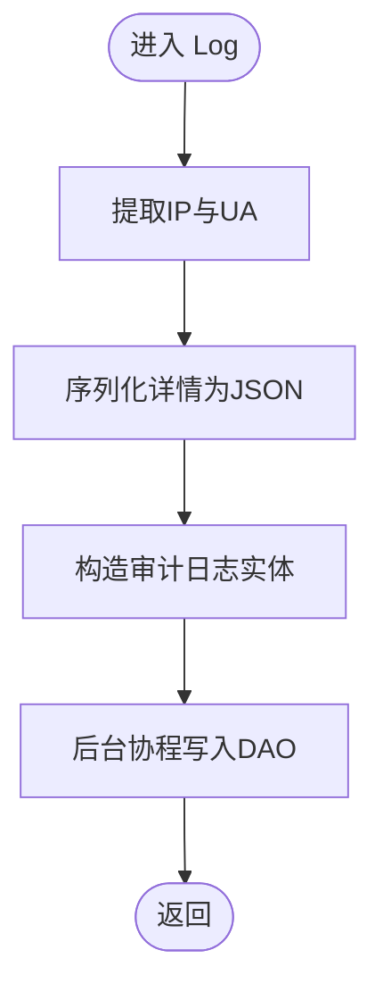
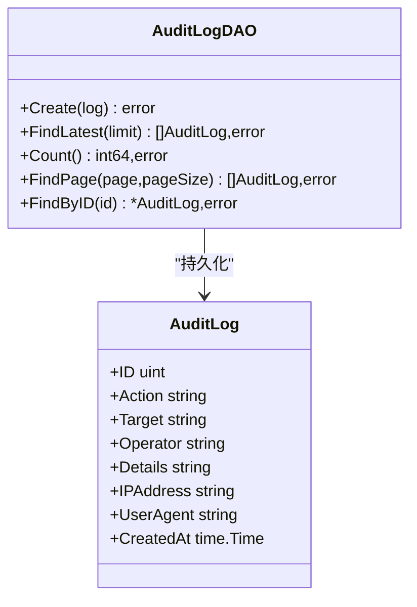
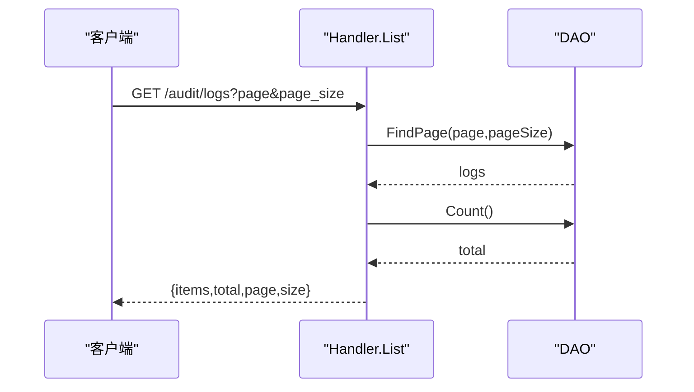
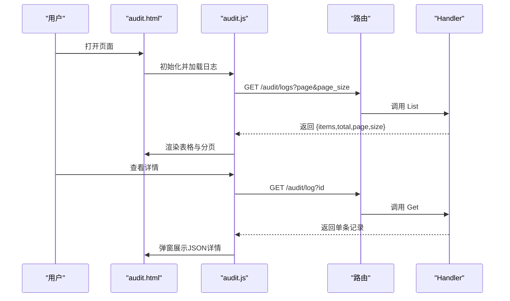
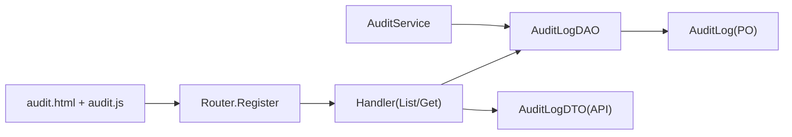

# 审计日志系统

<cite>
**本文引用的文件**
- [biz/service/audit/audit_service.go](file://biz/service/audit/audit_service.go)
- [biz/dal/db/audit_log_dao.go](file://biz/dal/db/audit_log_dao.go)
- [biz/model/po/audit.go](file://biz/model/po/audit.go)
- [biz/model/api/audit.go](file://biz/model/api/audit.go)
- [biz/handler/audit/audit_service.go](file://biz/handler/audit/audit_service.go)
- [biz/router/audit/audit.go](file://biz/router/audit/audit.go)
- [biz/router/audit/middleware.go](file://biz/router/audit/middleware.go)
- [public/audit.html](file://public/audit.html)
- [public/js/audit.js](file://public/js/audit.js)
- [conf/config.yaml](file://conf/config.yaml)
</cite>

## 目录
1. [简介](#简介)
2. [项目结构](#项目结构)
3. [核心组件](#核心组件)
4. [架构总览](#架构总览)
5. [详细组件分析](#详细组件分析)
6. [依赖关系分析](#依赖关系分析)
7. [性能与存储优化](#性能与存储优化)
8. [查询与过滤使用指南](#查询与过滤使用指南)
9. [报表生成与导出](#报表生成与导出)
10. [日志轮转与归档策略](#日志轮转与归档策略)
11. [合规性与数据保留](#合规性与数据保留)
12. [故障排查](#故障排查)
13. [结论](#结论)

## 简介
本文件系统化梳理审计日志子系统的实现，覆盖数据模型、记录机制、存储策略、权限与追踪、查询与过滤、报表与导出、轮转与归档、性能优化与合规要求。当前系统已具备完整的审计日志记录与前端展示能力，后续可按需扩展权限控制与高级过滤能力。

## 项目结构
审计日志相关模块分布于服务层、数据访问层、模型层、接口层与前端页面/脚本，并通过路由注册暴露 REST 接口。

**图表来源**
- [biz/router/audit/audit.go](file://biz/router/audit/audit.go#L17-L31)
- [biz/handler/audit/audit_service.go](file://biz/handler/audit/audit_service.go#L18-L52)
- [biz/service/audit/audit_service.go](file://biz/service/audit/audit_service.go#L24-L50)
- [biz/dal/db/audit_log_dao.go](file://biz/dal/db/audit_log_dao.go#L13-L45)
- [biz/model/po/audit.go](file://biz/model/po/audit.go#L8-L20)
- [biz/model/api/audit.go](file://biz/model/api/audit.go#L9-L31)
- [conf/config.yaml](file://conf/config.yaml#L7-L19)

**章节来源**
- [biz/router/audit/audit.go](file://biz/router/audit/audit.go#L17-L31)
- [biz/handler/audit/audit_service.go](file://biz/handler/audit/audit_service.go#L18-L52)
- [biz/service/audit/audit_service.go](file://biz/service/audit/audit_service.go#L24-L50)
- [biz/dal/db/audit_log_dao.go](file://biz/dal/db/audit_log_dao.go#L13-L45)
- [biz/model/po/audit.go](file://biz/model/po/audit.go#L8-L20)
- [biz/model/api/audit.go](file://biz/model/api/audit.go#L9-L31)
- [conf/config.yaml](file://conf/config.yaml#L7-L19)

## 核心组件
- 数据模型（PO）：定义审计日志表结构及索引字段，用于持久化记录。
- API DTO：对外输出的审计日志结构，用于接口响应。
- 服务层（AuditService）：封装审计记录逻辑，负责从请求上下文提取客户端信息，序列化详情，异步写入数据库。
- 数据访问层（AuditLogDAO）：提供创建、分页查询、总数统计、按ID查询等方法。
- 接口层（Handler）：解析分页参数，调用DAO并返回统一响应格式。
- 路由层：注册审计日志相关路由，支持 GET /audit/log 与 GET /audit/logs。
- 前端页面与脚本：提供审计日志列表、分页与详情弹窗展示。

**章节来源**
- [biz/model/po/audit.go](file://biz/model/po/audit.go#L8-L20)
- [biz/model/api/audit.go](file://biz/model/api/audit.go#L9-L31)
- [biz/service/audit/audit_service.go](file://biz/service/audit/audit_service.go#L24-L50)
- [biz/dal/db/audit_log_dao.go](file://biz/dal/db/audit_log_dao.go#L13-L45)
- [biz/handler/audit/audit_service.go](file://biz/handler/audit/audit_service.go#L18-L52)
- [biz/router/audit/audit.go](file://biz/router/audit/audit.go#L17-L31)
- [public/audit.html](file://public/audit.html#L13-L56)
- [public/js/audit.js](file://public/js/audit.js#L12-L117)

## 架构总览
审计日志从服务层记录，经DAO持久化到数据库；接口层提供REST查询；前端页面通过AJAX拉取数据并渲染。

**图表来源**
- [biz/router/audit/audit.go](file://biz/router/audit/audit.go#L25-L27)
- [biz/handler/audit/audit_service.go](file://biz/handler/audit/audit_service.go#L18-L52)
- [biz/service/audit/audit_service.go](file://biz/service/audit/audit_service.go#L24-L50)
- [biz/dal/db/audit_log_dao.go](file://biz/dal/db/audit_log_dao.go#L29-L45)

## 详细组件分析

### 数据模型与字段定义
- 表名：audit_logs
- 关键字段
  - 主键与通用字段：gorm.Model（含ID、CreatedAt、UpdatedAt、DeletedAt）
  - Action：操作类型，如 CREATE、UPDATE、DELETE、SYNC 等，带索引
  - Target：目标标识，如 repo:1、task:abc 等，带索引
  - Operator：操作者，当前为“system”占位，未来替换为真实用户或会话标识
  - Details：JSON 字符串，记录变更或详情
  - IPAddress：客户端IP
  - UserAgent：客户端UA
- 设计要点
  - 使用索引字段提升查询效率
  - 列表查询时排除 details 字段以降低网络与序列化开销
  - 使用 text 类型存储详情，便于扩展复杂结构

**图表来源**
- [biz/model/po/audit.go](file://biz/model/po/audit.go#L8-L20)

**章节来源**
- [biz/model/po/audit.go](file://biz/model/po/audit.go#L8-L20)

### 审计记录流程（服务层）
- 从请求上下文提取客户端IP与UA
- 将详情对象序列化为JSON字符串
- 构造审计日志实体
- 异步调用DAO写入数据库（当前采用 goroutine 后台写入）

**图表来源**
- [biz/service/audit/audit_service.go](file://biz/service/audit/audit_service.go#L24-L50)

**章节来源**
- [biz/service/audit/audit_service.go](file://biz/service/audit/audit_service.go#L24-L50)

### 数据访问层（DAO）
- Create：插入一条审计日志
- FindLatest：按时间倒序取最新N条
- Count：统计总记录数
- FindPage：分页查询，排除 details 字段以优化列表性能
- FindByID：按ID查询单条记录

**图表来源**
- [biz/dal/db/audit_log_dao.go](file://biz/dal/db/audit_log_dao.go#L7-L45)
- [biz/model/po/audit.go](file://biz/model/po/audit.go#L8-L20)

**章节来源**
- [biz/dal/db/audit_log_dao.go](file://biz/dal/db/audit_log_dao.go#L13-L45)

### 接口层（Handler）
- List：解析 page/page_size 参数，调用DAO分页查询与统计，组装统一响应
- Get：校验ID，查询单条记录并返回DTO

**图表来源**
- [biz/handler/audit/audit_service.go](file://biz/handler/audit/audit_service.go#L18-L52)
- [biz/dal/db/audit_log_dao.go](file://biz/dal/db/audit_log_dao.go#L29-L39)

**章节来源**
- [biz/handler/audit/audit_service.go](file://biz/handler/audit/audit_service.go#L18-L52)

### 路由与中间件
- 注册 /api/v1/audit/log 与 /api/v1/audit/logs
- 当前中间件函数体为空，预留鉴权与限流扩展点

**章节来源**
- [biz/router/audit/audit.go](file://biz/router/audit/audit.go#L17-L31)
- [biz/router/audit/middleware.go](file://biz/router/audit/middleware.go#L9-L37)

### 前端展示与交互
- 页面提供刷新按钮、分页控件与详情弹窗
- 列表默认每页20条，支持上一页/下一页切换
- 详情弹窗解析并美化显示 details JSON

**图表来源**
- [public/audit.html](file://public/audit.html#L13-L56)
- [public/js/audit.js](file://public/js/audit.js#L12-L117)
- [biz/router/audit/audit.go](file://biz/router/audit/audit.go#L25-L27)
- [biz/handler/audit/audit_service.go](file://biz/handler/audit/audit_service.go#L54-L76)

**章节来源**
- [public/audit.html](file://public/audit.html#L13-L56)
- [public/js/audit.js](file://public/js/audit.js#L12-L117)

## 依赖关系分析
- 服务层依赖DAO进行持久化
- 接口层依赖DAO与DTO进行数据传输
- 路由层注册接口并可挂载中间件
- 前端通过路由URL与接口约定交互

**图表来源**
- [biz/service/audit/audit_service.go](file://biz/service/audit/audit_service.go#L11-L21)
- [biz/dal/db/audit_log_dao.go](file://biz/dal/db/audit_log_dao.go#L7-L11)
- [biz/model/po/audit.go](file://biz/model/po/audit.go#L8-L20)
- [biz/model/api/audit.go](file://biz/model/api/audit.go#L9-L31)
- [biz/router/audit/audit.go](file://biz/router/audit/audit.go#L17-L31)
- [public/audit.html](file://public/audit.html#L13-L56)
- [public/js/audit.js](file://public/js/audit.js#L12-L117)

**章节来源**
- [biz/service/audit/audit_service.go](file://biz/service/audit/audit_service.go#L11-L21)
- [biz/dal/db/audit_log_dao.go](file://biz/dal/db/audit_log_dao.go#L7-L11)
- [biz/model/po/audit.go](file://biz/model/po/audit.go#L8-L20)
- [biz/model/api/audit.go](file://biz/model/api/audit.go#L9-L31)
- [biz/router/audit/audit.go](file://biz/router/audit/audit.go#L17-L31)
- [public/audit.html](file://public/audit.html#L13-L56)
- [public/js/audit.js](file://public/js/audit.js#L12-L117)

## 性能与存储优化
- 列表查询排除 details 字段，减少网络与序列化成本
- 异步写入（goroutine）避免阻塞主业务流程
- 建议在数据库层面增加复合索引（如 Action+Target、Operator+CreatedAt）以优化常见查询
- 对高频查询结果可引入缓存（如Redis），缩短热点查询延迟
- 配置文件支持多数据库类型，可根据容量与性能需求选择MySQL/Postgres

**章节来源**
- [biz/dal/db/audit_log_dao.go](file://biz/dal/db/audit_log_dao.go#L32-L37)
- [biz/service/audit/audit_service.go](file://biz/service/audit/audit_service.go#L47-L50)
- [conf/config.yaml](file://conf/config.yaml#L7-L19)

## 查询与过滤使用指南
- 列表查询
  - URL：/api/v1/audit/logs
  - 参数：page（默认1）、page_size（默认20）
  - 返回：items（列表，不含details）、total、page、size
- 单条查询
  - URL：/api/v1/audit/log
  - 参数：id（必填）
  - 返回：单条记录（含details）
- 前端交互
  - 页面默认每页20条，支持上一页/下一页
  - 支持点击“查看”弹窗展示详情JSON

**章节来源**
- [biz/handler/audit/audit_service.go](file://biz/handler/audit/audit_service.go#L18-L52)
- [biz/handler/audit/audit_service.go](file://biz/handler/audit/audit_service.go#L54-L76)
- [public/js/audit.js](file://public/js/audit.js#L12-L117)

## 报表生成与导出
- 当前接口返回JSON数组，前端可直接基于 items 进行二次加工生成报表
- 导出建议
  - 在前端将 items 转换为CSV/Excel，包含字段：时间、操作类型、目标对象、操作人/IP、详情
  - 后端可新增导出接口（如 /api/v1/audit/export?type=csv）以减轻前端压力
- 报表维度建议
  - 按操作类型统计数量
  - 按目标对象聚合
  - 按时间段趋势分析

[本节为通用实践建议，不涉及具体源码分析]

## 日志轮转与归档策略
- 数据库轮转
  - SQLite：可通过定期备份与清理旧数据实现归档
  - MySQL/Postgres：使用数据库自带的归档与压缩策略
- 归档建议
  - 按月/季度导出并离线保存
  - 对历史数据建立只读副本，避免影响在线查询性能
- 存储管理
  - 定期清理过期审计日志（如保留1年）
  - 对大字段（details）可考虑外部化存储（如对象存储），仅保留摘要索引

[本节为通用实践建议，不涉及具体源码分析]

## 合规性与数据保留
- 数据最小化：仅记录必要字段，避免敏感信息进入details
- 可追溯性：确保操作时间、操作者、目标对象、变更详情完整
- 保留周期：建议按法规要求设定保留期限（如1年），到期自动清理
- 访问控制：结合中间件实现鉴权与审计日志自身访问限制

[本节为通用实践建议，不涉及具体源码分析]

## 故障排查
- 列表为空
  - 检查 page/page_size 参数是否正确
  - 确认DAO分页查询是否排除了 details 字段导致前端误判
- 详情加载失败
  - 确认单条查询接口可用
  - 检查details字段是否为合法JSON
- 性能问题
  - 确认数据库索引是否存在（Action、Target、Operator）
  - 考虑引入缓存与异步写入策略

**章节来源**
- [biz/dal/db/audit_log_dao.go](file://biz/dal/db/audit_log_dao.go#L29-L39)
- [public/js/audit.js](file://public/js/audit.js#L96-L117)

## 结论
该审计日志系统已完成从记录、存储到展示的闭环，具备良好的扩展性。建议后续重点补齐权限控制、高级过滤、报表导出与合规策略，以满足更严格的审计与监管要求。