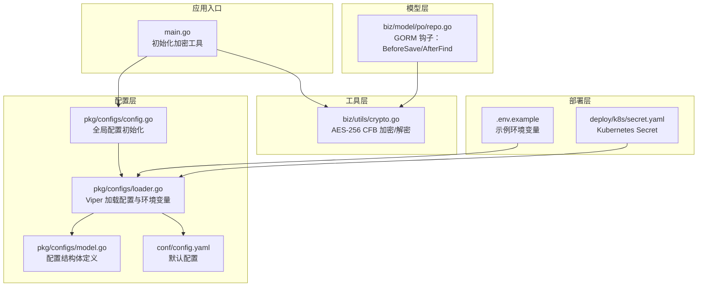
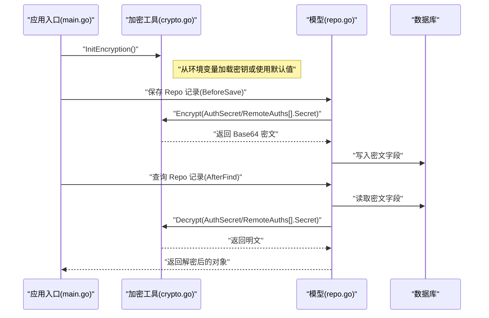
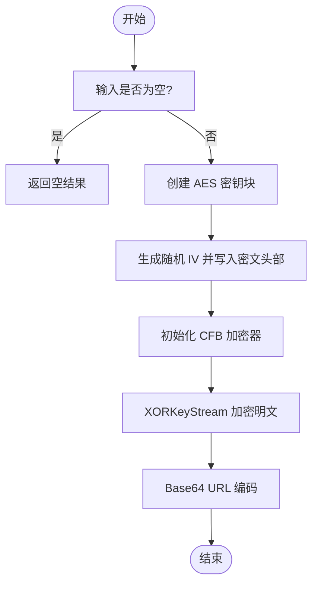
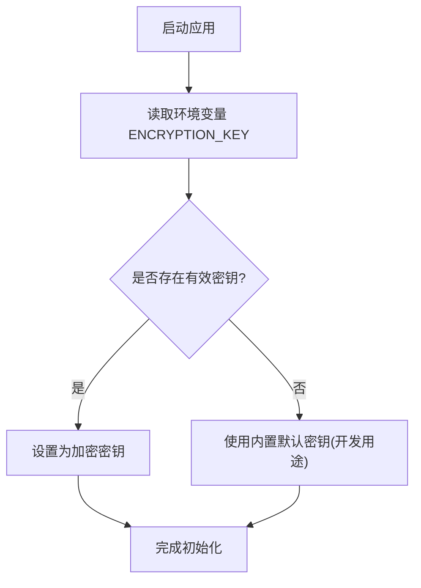
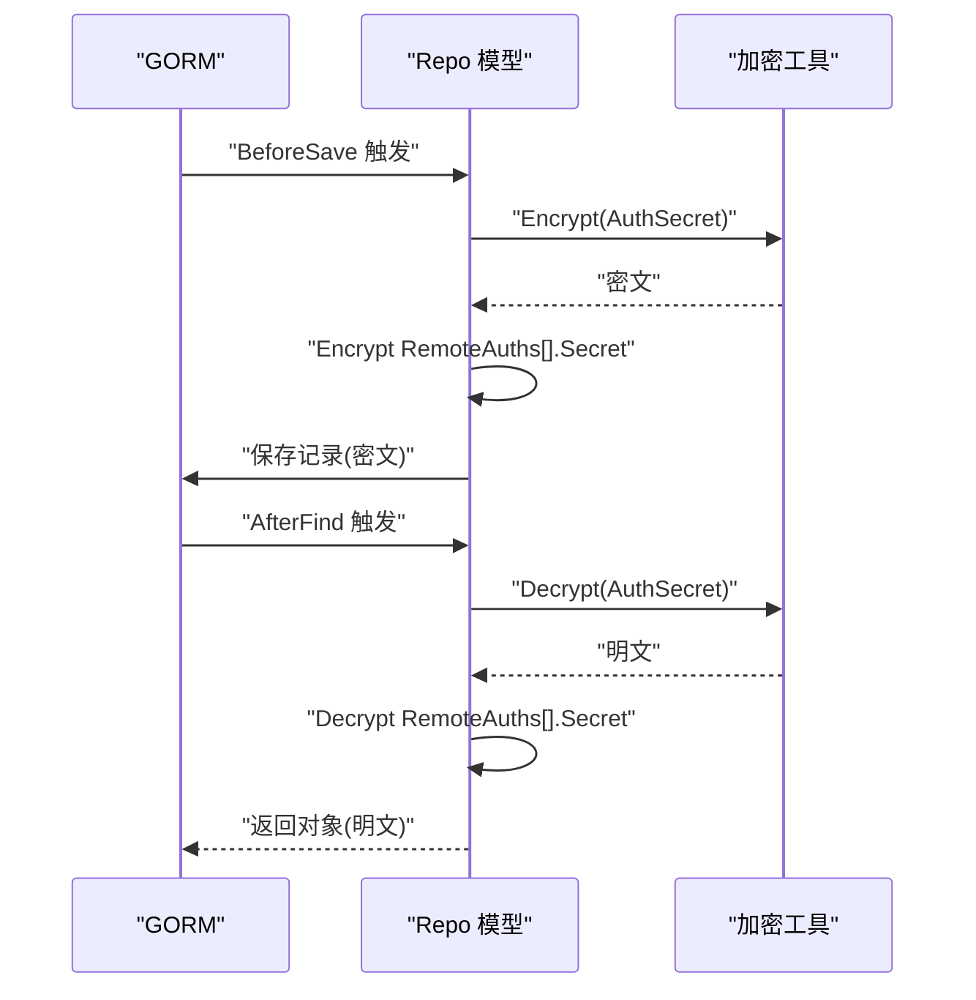
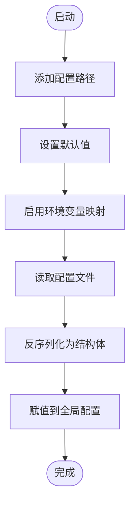
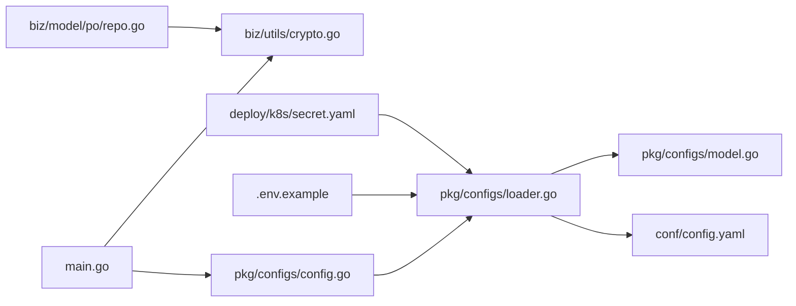

# 数据加密存储

<cite>
**本文引用的文件**
- [crypto.go](file://biz/utils/crypto.go)
- [main.go](file://main.go)
- [repo.go](file://biz/model/po/repo.go)
- [loader.go](file://pkg/configs/loader.go)
- [model.go](file://pkg/configs/model.go)
- [config.go](file://pkg/configs/config.go)
- [config.yaml](file://conf/config.yaml)
- [.env.example](file://deploy/.env.example)
- [secret.yaml](file://deploy/k8s/secret.yaml)
</cite>

## 目录
1. [简介](#简介)
2. [项目结构](#项目结构)
3. [核心组件](#核心组件)
4. [架构总览](#架构总览)
5. [详细组件分析](#详细组件分析)
6. [依赖关系分析](#依赖关系分析)
7. [性能考量](#性能考量)
8. [故障排查指南](#故障排查指南)
9. [结论](#结论)
10. [附录](#附录)

## 简介
本文件系统性阐述本项目的“数据加密存储”能力，重点围绕 AES-256 CFB 模式加密算法的实现与使用，覆盖以下主题：
- AES-256 CFB 模式的实现原理与流程
- 加密密钥管理与环境变量配置
- 加密/解密函数的实现细节（含 IV 生成与 Base64 编码）
- 敏感数据存储最佳实践与安全配置建议
- 性能优化与错误处理机制
- 开发与生产环境的差异化配置策略
- 加密数据的迁移与备份方案

## 项目结构
与“数据加密存储”直接相关的模块分布如下：
- 工具层：加密/解密工具位于 biz/utils/crypto.go
- 应用入口：在 main.go 中初始化加密工具
- 模型层：GORM 钩子在保存/查询时自动对敏感字段进行加解密，位于 biz/model/po/repo.go
- 配置层：Viper 加载配置与环境变量映射，位于 pkg/configs/loader.go、model.go、config.go；默认配置位于 conf/config.yaml
- 部署层：示例环境变量文件与 Kubernetes Secret 定义位于 deploy/.env.example、deploy/k8s/secret.yaml

图表来源
- [main.go](file://main.go#L115-L134)
- [crypto.go](file://biz/utils/crypto.go#L1-L71)
- [repo.go](file://biz/model/po/repo.go#L1-L93)
- [loader.go](file://pkg/configs/loader.go#L1-L46)
- [model.go](file://pkg/configs/model.go#L1-L34)
- [config.go](file://pkg/configs/config.go#L1-L43)
- [config.yaml](file://conf/config.yaml#L1-L25)
- [.env.example](file://deploy/.env.example#L1-L21)
- [secret.yaml](file://deploy/k8s/secret.yaml#L1-L11)

章节来源
- [main.go](file://main.go#L115-L134)
- [loader.go](file://pkg/configs/loader.go#L1-L46)
- [model.go](file://pkg/configs/model.go#L1-L34)
- [config.go](file://pkg/configs/config.go#L1-L43)
- [config.yaml](file://conf/config.yaml#L1-L25)
- [.env.example](file://deploy/.env.example#L1-L21)
- [secret.yaml](file://deploy/k8s/secret.yaml#L1-L11)

## 核心组件
- 加密工具（AES-256 CFB）：提供 InitEncryption、Encrypt、Decrypt 三个核心函数，负责密钥加载、随机 IV 生成、CFB 流加密与 Base64 编码输出。
- GORM 钩子：在 Repo 结构体保存前加密敏感字段，在查询后解密敏感字段，确保数据库中仅存储密文。
- 配置加载：通过 Viper 自动读取配置文件与环境变量，支持默认值与环境变量覆盖，用于后续扩展敏感配置（如密钥）的注入。

章节来源
- [crypto.go](file://biz/utils/crypto.go#L1-L71)
- [repo.go](file://biz/model/po/repo.go#L1-L93)
- [loader.go](file://pkg/configs/loader.go#L1-L46)
- [model.go](file://pkg/configs/model.go#L1-L34)

## 架构总览
下图展示从应用启动到敏感数据持久化的端到端流程，以及加密工具在整个链路中的位置。

图表来源
- [main.go](file://main.go#L115-L134)
- [crypto.go](file://biz/utils/crypto.go#L15-L70)
- [repo.go](file://biz/model/po/repo.go#L30-L92)

## 详细组件分析

### AES-256 CFB 模式实现与使用
- 密钥来源：优先从环境变量 ENCRYPTION_KEY 读取；若未设置则使用内置默认密钥（开发用途）。生产环境务必通过环境变量注入。
- IV 生成：每次加密前使用密码学安全随机源生成与块大小一致的 IV，并将其与密文拼接存储。
- 编解码：密文采用 URL 安全的 Base64 编码输出，便于存储与传输。
- 解密流程：先进行 Base64 解码，再以相同密钥与 IV 初始化 CFB 解密器，还原明文。

图表来源
- [crypto.go](file://biz/utils/crypto.go#L24-L44)

章节来源
- [crypto.go](file://biz/utils/crypto.go#L1-L71)

### 加密密钥管理与环境变量配置
- 密钥长度：AES-256 要求 32 字节密钥。当前实现会将字符串转换为字节数组，因此请确保密钥长度满足要求。
- 环境变量：ENCRYPTION_KEY 用于注入密钥；若未设置，将回退到内置默认密钥（仅限开发）。
- 生产建议：通过部署平台（如 Kubernetes Secret）注入密钥，避免硬编码在镜像或配置文件中。
- 运行时初始化：应用启动时调用 InitEncryption 完成密钥加载。

图表来源
- [crypto.go](file://biz/utils/crypto.go#L15-L22)
- [main.go](file://main.go#L125-L126)

章节来源
- [crypto.go](file://biz/utils/crypto.go#L15-L22)
- [main.go](file://main.go#L125-L126)

### 敏感数据存储与 GORM 钩子
- 存储场景：Repo 的 AuthSecret 字段与 RemoteAuths 映射中的每个条目的 Secret 字段会被自动加密后存入数据库。
- 加载场景：查询时自动解密，以便业务层直接使用明文。
- 实现位置：BeforeSave 与 AfterFind 钩子分别负责加密与解密。

图表来源
- [repo.go](file://biz/model/po/repo.go#L30-L92)
- [crypto.go](file://biz/utils/crypto.go#L24-L70)

章节来源
- [repo.go](file://biz/model/po/repo.go#L1-L93)

### 配置加载与环境变量映射
- 配置来源：YAML 文件与环境变量；Viper 支持 AutomaticEnv，可将环境变量映射到配置结构体。
- 默认值：未设置时使用默认值，保证最小可用配置。
- 全局配置：Init() 将最终配置赋给全局变量，供其他模块使用。

图表来源
- [loader.go](file://pkg/configs/loader.go#L10-L45)
- [model.go](file://pkg/configs/model.go#L1-L34)
- [config.go](file://pkg/configs/config.go#L18-L42)
- [config.yaml](file://conf/config.yaml#L1-L25)

章节来源
- [loader.go](file://pkg/configs/loader.go#L1-L46)
- [model.go](file://pkg/configs/model.go#L1-L34)
- [config.go](file://pkg/configs/config.go#L1-L43)
- [config.yaml](file://conf/config.yaml#L1-L25)

## 依赖关系分析
- main.go 依赖 biz/utils/crypto.go 完成加密初始化。
- biz/model/po/repo.go 依赖 biz/utils/crypto.go 在 GORM 钩子中进行加解密。
- 配置层（pkg/configs/*）与部署层（deploy/*）共同决定密钥与运行参数的注入方式。

图表来源
- [main.go](file://main.go#L115-L134)
- [crypto.go](file://biz/utils/crypto.go#L1-L71)
- [repo.go](file://biz/model/po/repo.go#L1-L93)
- [config.go](file://pkg/configs/config.go#L1-L43)
- [loader.go](file://pkg/configs/loader.go#L1-L46)
- [model.go](file://pkg/configs/model.go#L1-L34)
- [config.yaml](file://conf/config.yaml#L1-L25)
- [.env.example](file://deploy/.env.example#L1-L21)
- [secret.yaml](file://deploy/k8s/secret.yaml#L1-L11)

章节来源
- [main.go](file://main.go#L115-L134)
- [crypto.go](file://biz/utils/crypto.go#L1-L71)
- [repo.go](file://biz/model/po/repo.go#L1-L93)
- [config.go](file://pkg/configs/config.go#L1-L43)
- [loader.go](file://pkg/configs/loader.go#L1-L46)
- [model.go](file://pkg/configs/model.go#L1-L34)
- [config.yaml](file://conf/config.yaml#L1-L25)
- [.env.example](file://deploy/.env.example#L1-L21)
- [secret.yaml](file://deploy/k8s/secret.yaml#L1-L11)

## 性能考量
- 加密开销：AES-256 CFB 为流加密，CPU 开销主要来自 XORKeyStream；对大量敏感字段的批量加解密，建议：
  - 批量处理：在业务层合并多次调用，减少重复初始化开销。
  - 异步处理：对非关键路径的敏感字段更新可异步执行，避免阻塞主请求。
  - 缓存策略：对频繁访问但不常变更的明文字段，可在内存中缓存明文副本，减少重复解密。
- Base64 编解码：URL 安全 Base64 增加约 33% 的体积，但提升可移植性；对于超大文本，可评估压缩后再加密。
- IV 生成：每次加密生成新 IV，确保语义安全性；对高频小文本，可考虑复用 IV（需严格控制唯一性与随机性），但不建议在本项目中采用。

[本节为通用性能建议，不直接分析具体文件]

## 故障排查指南
- 症状：解密失败或返回空串
  - 可能原因：密钥不匹配、Base64 编码异常、密文过短、IV 不正确
  - 排查步骤：
    - 确认 ENCRYPTION_KEY 是否与加密时一致
    - 检查密文是否为有效的 Base64 URL 安全编码
    - 确认密文长度至少包含一个块大小的 IV
- 症状：应用启动时报密钥相关错误
  - 可能原因：环境变量未设置或格式不正确
  - 排查步骤：
    - 在生产环境通过部署平台注入 ENCRYPTION_KEY
    - 确保密钥长度满足 AES-256 要求
- 症状：数据库中出现乱码或无法识别的字符
  - 可能原因：未启用 GORM 钩子或钩子逻辑被绕过
  - 排查步骤：
    - 确认保存/查询路径均经过 Repo 的 BeforeSave/AfterFind
    - 检查业务层是否直接操作底层字段而跳过钩子

章节来源
- [crypto.go](file://biz/utils/crypto.go#L46-L70)
- [repo.go](file://biz/model/po/repo.go#L30-L92)

## 结论
本项目通过 AES-256 CFB 模式实现了对敏感数据的透明加密，结合 GORM 钩子在数据持久化层面自动完成加解密，降低了业务侵入性。配合 Viper 的配置加载与环境变量映射，能够灵活地在不同环境中注入密钥与运行参数。建议在生产环境严格遵循密钥管理与安全配置最佳实践，确保密钥机密性与完整性。

[本节为总结性内容，不直接分析具体文件]

## 附录

### 开发环境与生产环境配置策略
- 开发环境
  - 使用内置默认密钥（仅用于本地开发）
  - 通过 .env.example 提供示例变量参考
- 生产环境
  - 通过 Kubernetes Secret 或其他密钥管理服务注入 ENCRYPTION_KEY
  - 禁止在配置文件或镜像中硬编码密钥
  - 对密钥轮换制定流程，避免停机切换

章节来源
- [crypto.go](file://biz/utils/crypto.go#L15-L22)
- [.env.example](file://deploy/.env.example#L1-L21)
- [secret.yaml](file://deploy/k8s/secret.yaml#L1-L11)

### 加密数据迁移与备份方案
- 备份策略
  - 备份数据库时同时备份密钥（或密钥轮换计划）
  - 备份介质应具备与数据库同等的访问控制与加密保护
- 迁移策略
  - 新旧系统并行期间，保持同一 ENCRYPTION_KEY
  - 切换阶段分批迁移，逐批验证加解密一致性
  - 完成切换后，按计划轮换密钥并清理历史密钥材料
- 回滚策略
  - 若迁移失败，使用历史密钥恢复旧系统
  - 保留历史密钥材料直至确认迁移完全成功

[本节为通用迁移与备份建议，不直接分析具体文件]