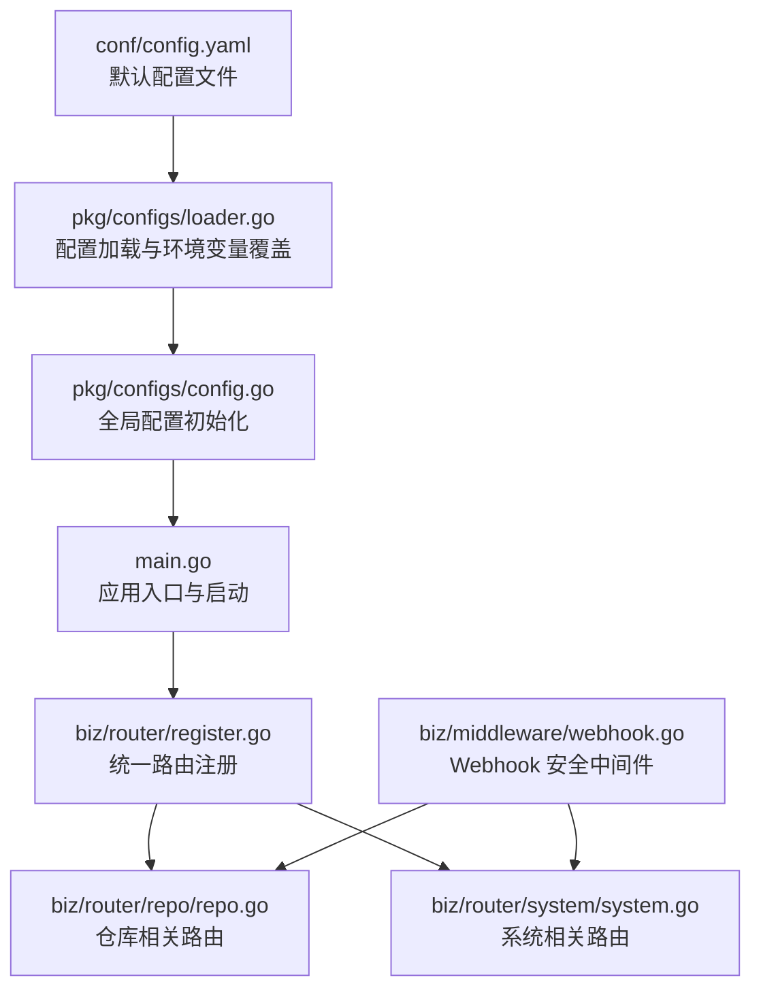
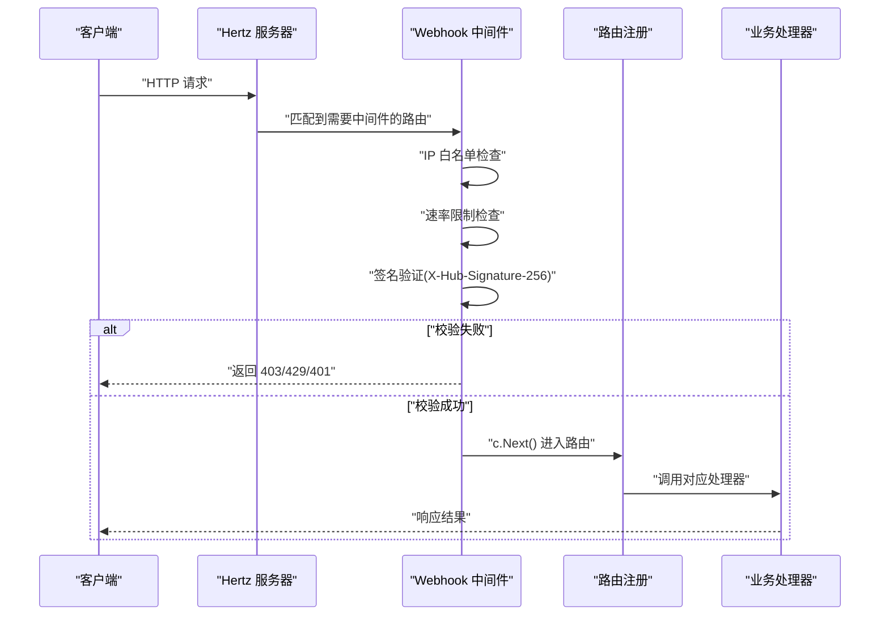
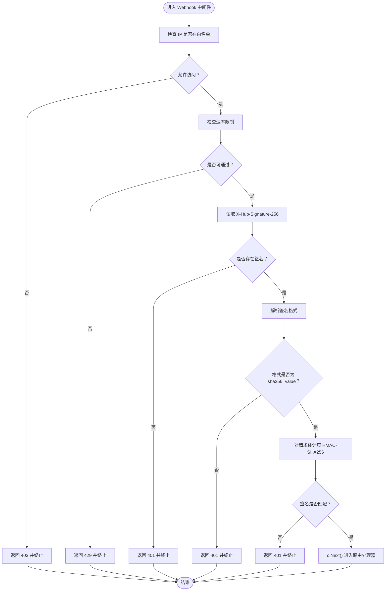
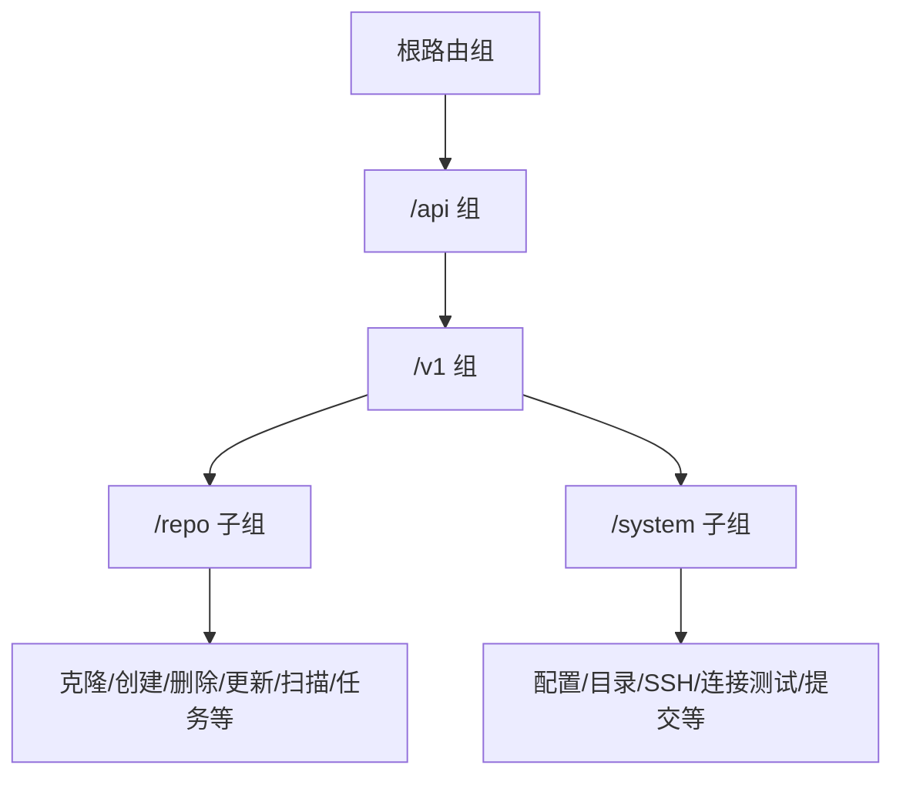
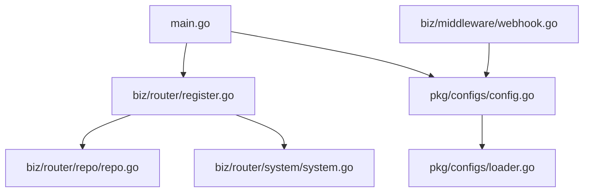

# 访问控制机制

<cite>
**本文引用的文件**
- [main.go](file://main.go)
- [router.go](file://router.go)
- [biz/router/register.go](file://biz/router/register.go)
- [biz/router/repo/repo.go](file://biz/router/repo/repo.go)
- [biz/router/system/system.go](file://biz/router/system/system.go)
- [biz/middleware/webhook.go](file://biz/middleware/webhook.go)
- [pkg/configs/config.go](file://pkg/configs/config.go)
- [pkg/configs/loader.go](file://pkg/configs/loader.go)
- [conf/config.yaml](file://conf/config.yaml)
- [biz/handler/hz/ping.go](file://biz/handler/hz/ping.go)
- [biz/model/po/repo.go](file://biz/model/po/repo.go)
- [biz/model/domain/common.go](file://biz/model/domain/common.go)
</cite>

## 目录
1. [引言](#引言)
2. [项目结构](#项目结构)
3. [核心组件](#核心组件)
4. [架构总览](#架构总览)
5. [详细组件分析](#详细组件分析)
6. [依赖关系分析](#依赖关系分析)
7. [性能考量](#性能考量)
8. [故障排查指南](#故障排查指南)
9. [结论](#结论)
10. [附录](#附录)

## 引言
本文件系统性梳理本项目的访问控制机制，覆盖认证与授权的实现架构、中间件在请求处理中的作用与拦截机制、不同路由的权限控制策略与访问规则、用户身份验证与会话管理的实现细节、API 访问控制与资源权限配置指南、跨域请求的安全处理与 CORS 配置建议、访问控制的测试方法与调试技巧，以及安全最佳实践与常见漏洞防护。

## 项目结构
项目采用分层与按功能模块组织的结构：入口程序负责初始化与启动；路由注册集中于统一入口；各业务模块通过子路由文件进行注册；中间件集中在 middleware 目录；配置通过 viper 统一加载；数据模型包含认证凭据的加解密逻辑。

图表来源
- [main.go](file://main.go#L115-L152)
- [biz/router/register.go](file://biz/router/register.go#L18-L41)
- [biz/router/repo/repo.go](file://biz/router/repo/repo.go#L17-L38)
- [biz/router/system/system.go](file://biz/router/system/system.go#L16-L40)
- [biz/middleware/webhook.go](file://biz/middleware/webhook.go#L18-L69)
- [pkg/configs/config.go](file://pkg/configs/config.go#L18-L42)
- [pkg/configs/loader.go](file://pkg/configs/loader.go#L9-L45)
- [conf/config.yaml](file://conf/config.yaml#L1-L25)

章节来源
- [main.go](file://main.go#L115-L152)
- [biz/router/register.go](file://biz/router/register.go#L18-L41)

## 核心组件
- 应用入口与启动：负责初始化配置、数据库、加密工具与业务服务，并根据启动模式选择性启动 HTTP 或 RPC 服务。
- 路由注册：集中注册所有业务模块路由，并提供静态资源与根路径重定向。
- 中间件：当前实现包含 Webhook 安全中间件，提供 IP 白名单、速率限制与签名验证。
- 配置系统：通过 viper 加载 YAML 配置，支持环境变量覆盖，提供全局配置对象与兼容变量。
- 数据模型与凭据：对远程仓库认证凭据进行入库前加密与出库后解密，保障敏感信息存储安全。

章节来源
- [main.go](file://main.go#L115-L152)
- [biz/router/register.go](file://biz/router/register.go#L18-L41)
- [biz/middleware/webhook.go](file://biz/middleware/webhook.go#L18-L69)
- [pkg/configs/config.go](file://pkg/configs/config.go#L18-L42)
- [pkg/configs/loader.go](file://pkg/configs/loader.go#L9-L45)
- [biz/model/po/repo.go](file://biz/model/po/repo.go#L40-L92)
- [biz/model/domain/common.go](file://biz/model/domain/common.go#L3-L7)

## 架构总览
下图展示从请求进入至路由处理的整体流程，以及 Webhook 中间件在其中的拦截点。

图表来源
- [biz/middleware/webhook.go](file://biz/middleware/webhook.go#L18-L69)
- [biz/router/register.go](file://biz/router/register.go#L18-L41)

## 详细组件分析

### Webhook 安全中间件
- 功能概述
  - IP 白名单：可选的来源 IP 检查，未命中白名单直接拒绝。
  - 速率限制：基于令牌桶算法的全局速率限制，防止滥用。
  - 签名验证：使用 HMAC-SHA256 对请求体进行签名比对，要求请求头携带特定格式的签名。
- 执行顺序与拦截点
  - 在路由匹配阶段，若目标路由挂载该中间件，则在进入具体处理器前执行上述三步校验；任一步失败即终止并返回相应状态码。
- 配置来源
  - 全局配置通过 viper 加载 YAML 并支持环境变量覆盖；Webhook 密钥、速率限制与 IP 白名单均来自配置。
- 复杂度与性能
  - 中间件每次请求进行常数时间的字符串比较与哈希计算，整体开销极低；速率限制为内存级操作。
- 错误处理
  - 缺失签名头、签名格式错误、签名不匹配、超出速率限制、IP 不在白名单时，均以 JSON 结构返回错误信息并中止后续处理。

图表来源
- [biz/middleware/webhook.go](file://biz/middleware/webhook.go#L18-L69)

章节来源
- [biz/middleware/webhook.go](file://biz/middleware/webhook.go#L18-L69)
- [pkg/configs/config.go](file://pkg/configs/config.go#L18-L42)
- [pkg/configs/loader.go](file://pkg/configs/loader.go#L9-L45)
- [conf/config.yaml](file://conf/config.yaml#L21-L25)

### 路由与权限控制策略
- 路由注册
  - 统一注册各模块路由，包括仓库、分支、标签、版本、系统、同步、统计与审计等；同时提供静态资源与 Swagger 文档。
- 权限控制现状
  - 当前各模块的中间件函数已预留，但返回空中间件列表，表示未启用任何显式鉴权或授权中间件。
- 建议策略
  - 在需要保护的路由上挂载鉴权中间件（如基于 Token 的校验），并在处理器内部进行资源级授权判断。
  - 对写操作与高风险操作（如删除、提交变更）实施更严格的权限校验。
  - 对外部接口（如 Webhook）保持现有中间件策略不变。

图表来源
- [biz/router/register.go](file://biz/router/register.go#L18-L41)
- [biz/router/repo/repo.go](file://biz/router/repo/repo.go#L17-L38)
- [biz/router/system/system.go](file://biz/router/system/system.go#L16-L40)

章节来源
- [biz/router/register.go](file://biz/router/register.go#L18-L41)
- [biz/router/repo/repo.go](file://biz/router/repo/repo.go#L17-L38)
- [biz/router/system/system.go](file://biz/router/system/system.go#L16-L40)

### 用户身份验证与会话管理
- 当前实现
  - 未发现内置的身份认证与会话管理中间件或持久化会话存储逻辑。
- 建议方案
  - 引入基于 JWT 的认证中间件，在登录成功后签发令牌并设置安全的 HttpOnly Cookie 或在请求头中携带 Bearer Token。
  - 在中间件中解析与校验令牌，提取用户标识并注入到上下文中供处理器使用。
  - 对敏感操作进行资源级授权校验（如仅仓库拥有者可删除）。
  - 使用安全的令牌刷新策略与过期时间控制。

[本节为概念性指导，不直接分析具体文件，故无“章节来源”]

### API 访问控制与资源权限配置
- 配置入口
  - 通过 viper 从 YAML 文件与环境变量加载配置，Webhook 相关参数可动态调整。
- 配置项
  - Webhook 密钥、速率限制、IP 白名单等。
- 实施要点
  - 将敏感配置通过环境变量注入，避免硬编码在仓库中。
  - 对外暴露的 API（如 Webhook）必须严格校验签名与来源。
  - 对内 API 可结合 JWT 与 RBAC 进行细粒度权限控制。

章节来源
- [pkg/configs/config.go](file://pkg/configs/config.go#L18-L42)
- [pkg/configs/loader.go](file://pkg/configs/loader.go#L9-L45)
- [conf/config.yaml](file://conf/config.yaml#L21-L25)

### 跨域请求的安全处理与 CORS 配置
- 当前实现
  - 未发现专门的 CORS 中间件或配置。
- 建议
  - 在前端与后端分离部署时，引入 CORS 中间件，明确允许的源、方法、头与凭证。
  - 严格限制 Allow-Origin，优先使用具体域名而非通配符。
  - 对预检请求（OPTIONS）进行最小化放行，避免泄露内部信息。

[本节为概念性指导，不直接分析具体文件，故无“章节来源”]

### 凭据安全与数据模型
- 数据模型
  - 认证信息结构包含类型、键与密文，用于远程仓库访问。
- 存储安全
  - 入库前对敏感字段进行加密，出库后解密还原，避免明文存储。
- 实施建议
  - 使用强随机盐与安全的对称加密算法。
  - 定期轮换加密密钥，确保历史数据可平滑迁移。

章节来源
- [biz/model/domain/common.go](file://biz/model/domain/common.go#L3-L7)
- [biz/model/po/repo.go](file://biz/model/po/repo.go#L40-L92)

## 依赖关系分析
- 入口依赖配置与数据库初始化，再注册路由并启动服务。
- 路由注册依赖各模块的注册函数。
- Webhook 中间件依赖全局配置与速率限制库。
- 配置系统依赖 viper 与环境变量覆盖。

图表来源
- [main.go](file://main.go#L115-L152)
- [biz/router/register.go](file://biz/router/register.go#L18-L41)
- [pkg/configs/config.go](file://pkg/configs/config.go#L18-L42)
- [pkg/configs/loader.go](file://pkg/configs/loader.go#L9-L45)
- [biz/router/repo/repo.go](file://biz/router/repo/repo.go#L17-L38)
- [biz/router/system/system.go](file://biz/router/system/system.go#L16-L40)
- [biz/middleware/webhook.go](file://biz/middleware/webhook.go#L18-L69)

章节来源
- [main.go](file://main.go#L115-L152)
- [biz/router/register.go](file://biz/router/register.go#L18-L41)

## 性能考量
- 中间件开销
  - Webhook 中间件为 O(1) 操作，对吞吐影响可忽略。
- 速率限制
  - 基于内存的令牌桶限制，适合单实例部署；分布式场景需考虑共享限流器。
- 配置加载
  - viper 在启动时一次性加载配置，运行时无额外开销。

[本节提供通用指导，不直接分析具体文件，故无“章节来源”]

## 故障排查指南
- Webhook 相关问题
  - 403：确认客户端 IP 是否在白名单中。
  - 429：检查速率限制配置与实际流量，必要时提升阈值或增加限流窗口。
  - 401：检查请求头是否包含正确的签名格式与签名值；核对密钥一致性。
- 配置问题
  - 确认配置文件路径与名称正确；检查环境变量是否覆盖了预期值。
- 路由问题
  - 确认路由注册顺序与组层级正确；检查处理器是否正确挂载中间件。

章节来源
- [biz/middleware/webhook.go](file://biz/middleware/webhook.go#L18-L69)
- [pkg/configs/config.go](file://pkg/configs/config.go#L18-L42)
- [pkg/configs/loader.go](file://pkg/configs/loader.go#L9-L45)

## 结论
本项目在入口、路由与中间件层面具备清晰的结构，当前对外部 Webhook 提供了基础的安全保护（IP 白名单、速率限制、签名验证）。对于内部 API 的访问控制，目前尚未启用鉴权与授权中间件，建议尽快引入基于 JWT 的认证与资源级授权策略，并完善 CORS 配置与凭据安全机制，以满足生产环境的安全要求。

## 附录
- 快速测试步骤
  - 使用 curl 或 Postman 发送请求，观察中间件返回的状态码与消息。
  - 修改配置后重启服务，验证环境变量覆盖生效。
  - 对 Webhook 接口生成符合规范的签名头，验证签名校验逻辑。
- 调试技巧
  - 在中间件中打印关键信息（如来源 IP、签名摘要、速率限制状态）辅助定位问题。
  - 使用最小化路由与处理器复现问题，逐步缩小范围。