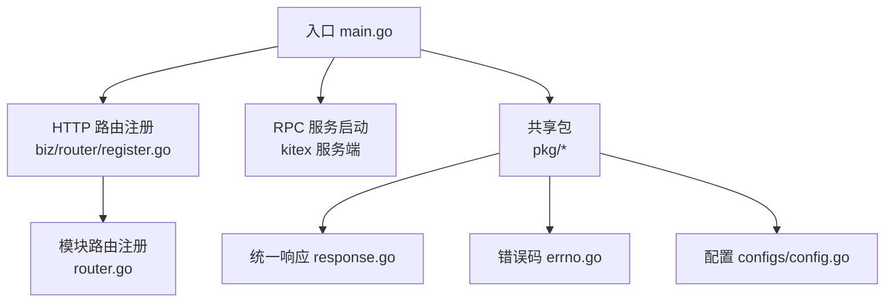
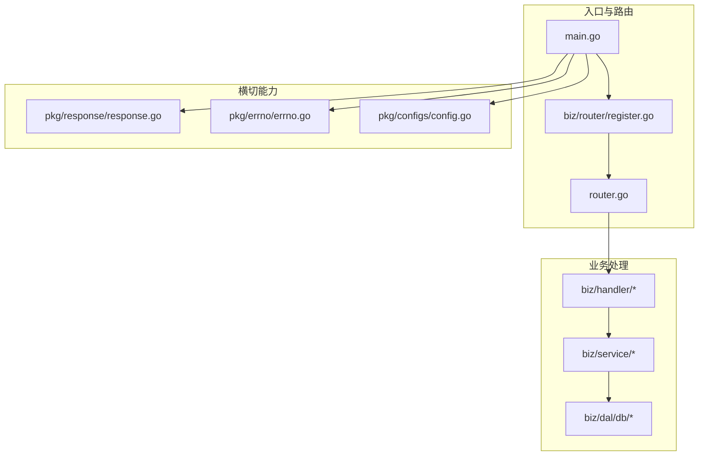
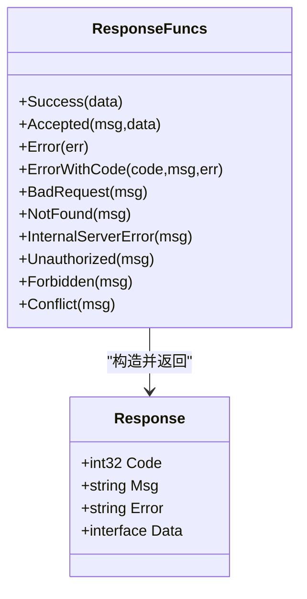
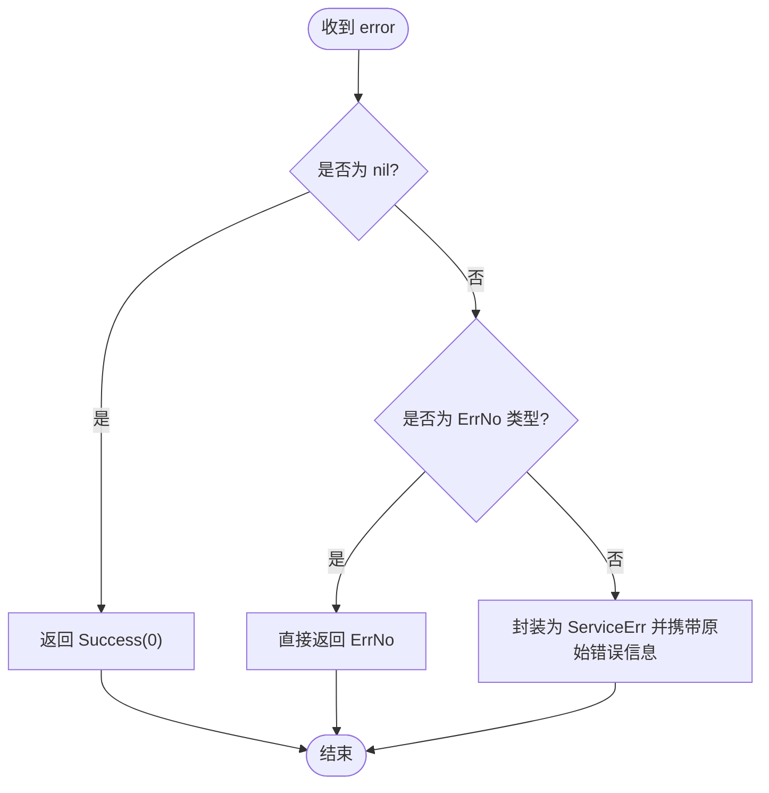
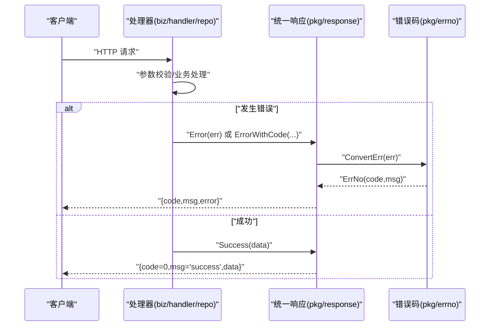
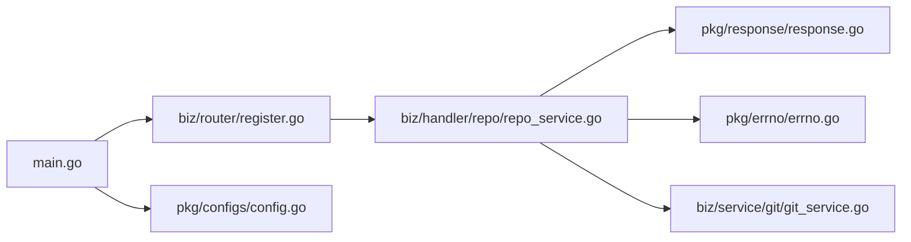

# 代码规范

<cite>
**本文引用的文件**
- [main.go](file://main.go)
- [router.go](file://router.go)
- [biz/router/register.go](file://biz/router/register.go)
- [pkg/response/response.go](file://pkg/response/response.go)
- [pkg/errno/errno.go](file://pkg/errno/errno.go)
- [Makefile](file://Makefile)
- [go.mod](file://go.mod)
- [PROJECT_STRUCTURE.md](file://PROJECT_STRUCTURE.md)
- [README.md](file://README.md)
- [biz/handler/repo/repo_service.go](file://biz/handler/repo/repo_service.go)
- [biz/service/git/git_service.go](file://biz/service/git/git_service.go)
- [biz/model/api/repo.go](file://biz/model/api/repo.go)
- [pkg/configs/config.go](file://pkg/configs/config.go)
</cite>

## 目录
1. [简介](#简介)
2. [项目结构](#项目结构)
3. [核心组件](#核心组件)
4. [架构总览](#架构总览)
5. [组件详解](#组件详解)
6. [依赖关系分析](#依赖关系分析)
7. [性能考量](#性能考量)
8. [故障排查指南](#故障排查指南)
9. [结论](#结论)
10. [附录](#附录)

## 简介
本文件旨在建立一套统一、可执行的 Go 语言编码规范与工程实践准则，覆盖命名约定、函数设计、错误处理模式、统一响应格式、错误码系统、国际化扩展建议、代码格式化与静态检查、模块化设计原则、代码评审清单与质量标准，并提供正反面示例的对比指引，帮助团队在复杂业务场景下保持一致性与可维护性。

## 项目结构
项目采用分层与模块化结合的组织方式：
- 入口与启动：main.go 负责多服务模式启动、资源初始化与优雅关闭。
- 路由注册：router.go 与 biz/router/register.go 统一注册各模块路由与静态资源。
- 业务层：biz 下按 Handler -> Service -> DAL 的分层组织，模型分为 API DTO、领域对象、持久化对象三层。
- 共享包：pkg 提供统一响应、错误码、配置加载等跨模块能力。
- 工具链：Makefile 提供构建、测试、格式化、静态检查、代码生成等常用命令。

图表来源
- [main.go](file://main.go#L52-L176)
- [biz/router/register.go](file://biz/router/register.go#L18-L42)
- [router.go](file://router.go#L10-L16)
- [pkg/response/response.go](file://pkg/response/response.go#L9-L87)
- [pkg/errno/errno.go](file://pkg/errno/errno.go#L7-L129)
- [pkg/configs/config.go](file://pkg/configs/config.go#L18-L42)

章节来源
- [PROJECT_STRUCTURE.md](file://PROJECT_STRUCTURE.md#L1-L109)
- [README.md](file://README.md#L1-L44)
- [main.go](file://main.go#L1-L176)
- [biz/router/register.go](file://biz/router/register.go#L1-L42)
- [router.go](file://router.go#L1-L16)

## 核心组件
- 统一响应包装：封装统一的响应结构与便捷方法，确保前后端交互一致。
- 错误码体系：以 ErrNo 结构体承载业务错误码与消息，提供转换与扩展能力。
- 配置加载：集中式配置初始化与环境变量兼容，便于部署与运维。
- 路由注册：模块化路由注册与静态资源托管，支持前端单页应用直出。

章节来源
- [pkg/response/response.go](file://pkg/response/response.go#L9-L87)
- [pkg/errno/errno.go](file://pkg/errno/errno.go#L7-L129)
- [pkg/configs/config.go](file://pkg/configs/config.go#L18-L42)
- [biz/router/register.go](file://biz/router/register.go#L18-L42)

## 架构总览
系统采用“入口 -> 路由 -> 处理器 -> 服务 -> 数据访问”的分层架构，同时通过 pkg 提供横切能力，保证模块间低耦合高内聚。

图表来源
- [main.go](file://main.go#L52-L176)
- [biz/router/register.go](file://biz/router/register.go#L18-L42)
- [router.go](file://router.go#L10-L16)
- [pkg/response/response.go](file://pkg/response/response.go#L9-L87)
- [pkg/errno/errno.go](file://pkg/errno/errno.go#L7-L129)
- [pkg/configs/config.go](file://pkg/configs/config.go#L18-L42)

## 组件详解

### 统一响应格式
- 设计理念
  - 统一字段：code、msg、error、data，便于前端解析与统一拦截。
  - 成功响应：code=0，msg 为提示语，data 为业务数据。
  - 错误响应：根据 errno 转换为具体业务错误码与消息；error 字段用于调试输出。
  - 特殊状态：Accepted 用于异步任务提交确认。
- 使用规范
  - 所有 HTTP 处理器应通过 pkg/response 包提供的方法返回结果，避免直接构造 JSON。
  - 对于参数校验失败、资源不存在、权限不足、冲突等场景，优先使用对应便捷方法。
  - 自定义错误码时，通过 ErrorWithCode 返回，确保 code 与 msg 一致。

图表来源
- [pkg/response/response.go](file://pkg/response/response.go#L9-L87)

章节来源
- [pkg/response/response.go](file://pkg/response/response.go#L9-L87)

### 错误码系统
- 设计理念
  - 以 ErrNo 结构体承载业务错误码与消息，支持 WithMessage 动态替换消息。
  - 按业务域划分区间，便于扩展与归类。
  - ConvertErr 将任意 error 转换为 ErrNo，保证上层统一处理。
- 使用规范
  - 业务错误优先使用预定义 ErrNo 常量或 var 定义的业务错误码。
  - 对外暴露错误时，统一通过 response.Error 或 response.ErrorWithCode 返回。
  - 新增错误码需明确区间归属并在 errno.go 中集中维护。

图表来源
- [pkg/errno/errno.go](file://pkg/errno/errno.go#L119-L129)

章节来源
- [pkg/errno/errno.go](file://pkg/errno/errno.go#L7-L129)

### 错误处理模式
- 输入校验失败：使用 response.BadRequest 返回。
- 资源不存在：使用 response.NotFound 返回。
- 权限问题：使用 response.Unauthorized 或 response.Forbidden 返回。
- 冲突或并发：使用 response.Conflict 返回。
- 服务器异常：使用 response.InternalServerError 返回。
- 自定义错误码：使用 response.ErrorWithCode 返回。

章节来源
- [pkg/response/response.go](file://pkg/response/response.go#L35-L86)
- [biz/handler/repo/repo_service.go](file://biz/handler/repo/repo_service.go#L23-L126)

### 命名约定
- 包名：小写、简洁、不缩写，体现职责。
- 结构体与类型：首字母大写，采用名词短语，避免缩写。
- 方法：首字母大写，采用动词短语，体现动作。
- 变量：尽量使用完整单词，避免无意义缩写；常量使用全大写加下划线。
- 文件：与包名一致，小写，多个单词以下划线分隔。
- 接口：以 -er 结尾（如 Reader），或抽象名词（如 Writer）。

章节来源
- [pkg/response/response.go](file://pkg/response/response.go#L9-L15)
- [pkg/errno/errno.go](file://pkg/errno/errno.go#L7-L23)
- [biz/model/api/repo.go](file://biz/model/api/repo.go#L10-L77)

### 函数设计
- 单一职责：每个函数只做一件事，必要时拆分为更小函数。
- 输入输出：明确参数与返回值，错误通过返回值显式传递。
- 边界条件：对空指针、空字符串、越界等进行显式判断与处理。
- 并发安全：共享资源访问需加锁或使用并发安全结构。
- 日志与调试：在 DebugMode 下输出关键操作日志，便于定位问题。

章节来源
- [biz/service/git/git_service.go](file://biz/service/git/git_service.go#L33-L48)
- [pkg/configs/config.go](file://pkg/configs/config.go#L18-L42)

### 模块化设计原则
- 分层清晰：Handler 负责请求处理与响应包装；Service 负责业务编排；DAL 负责数据访问。
- 职责分离：路由注册集中在 biz/router/register.go，模块路由在各自目录下维护。
- 可复用：pkg 下的 response、errno、configs 为跨模块共享能力。
- 可测试：业务逻辑尽量无副作用，便于单元测试与集成测试。

章节来源
- [PROJECT_STRUCTURE.md](file://PROJECT_STRUCTURE.md#L21-L68)
- [biz/router/register.go](file://biz/router/register.go#L18-L42)

### 代码格式化与静态检查
- gofmt：统一代码风格，所有提交前必须执行 go fmt ./...。
- golangci-lint：通过 Makefile 提供一键执行，建议在 CI 中强制执行。
- go.mod：统一 Go 版本与依赖管理，定期执行 go mod tidy。

章节来源
- [Makefile](file://Makefile#L55-L63)
- [go.mod](file://go.mod#L3)

### 国际化与错误消息
- 当前错误消息为固定字符串，建议引入 i18n 框架（如 zhterm、golang.org/x/text/message）。
- 在 errno 层定义消息模板与键值，通过中间件或响应层注入语言环境，动态渲染消息。
- 保持错误码与消息解耦，便于多语言扩展。

（本节为概念性指导，无需特定文件来源）

### 统一响应与错误码的调用序列

图表来源
- [biz/handler/repo/repo_service.go](file://biz/handler/repo/repo_service.go#L23-L126)
- [pkg/response/response.go](file://pkg/response/response.go#L35-L87)
- [pkg/errno/errno.go](file://pkg/errno/errno.go#L119-L129)

## 依赖关系分析
- 入口依赖：main.go 依赖路由注册、配置加载、数据库初始化、服务初始化。
- 路由依赖：biz/router/register.go 依赖各模块路由注册函数。
- 处理器依赖：biz/handler/* 依赖 pkg/response 与 pkg/errno，以及 biz/dal 与 biz/service。
- 服务依赖：biz/service/* 依赖 go-git、配置与领域模型。
- 共享包：pkg/response 与 pkg/errno 为纯函数与结构体，无循环依赖风险。

图表来源
- [main.go](file://main.go#L52-L176)
- [biz/router/register.go](file://biz/router/register.go#L18-L42)
- [biz/handler/repo/repo_service.go](file://biz/handler/repo/repo_service.go#L21-L126)
- [pkg/response/response.go](file://pkg/response/response.go#L9-L87)
- [pkg/errno/errno.go](file://pkg/errno/errno.go#L7-L129)
- [biz/service/git/git_service.go](file://biz/service/git/git_service.go#L27-L48)

章节来源
- [main.go](file://main.go#L52-L176)
- [biz/router/register.go](file://biz/router/register.go#L18-L42)
- [biz/handler/repo/repo_service.go](file://biz/handler/repo/repo_service.go#L21-L126)

## 性能考量
- IO 密集：Git 操作与远程连接可能阻塞，建议使用超时控制与进度回调。
- 并发：多任务克隆/推送时，合理限制并发度，避免资源争用。
- 序列化：统一响应结构简单明了，避免过度嵌套；错误消息仅在调试模式输出。
- 缓存：对频繁查询的数据（如仓库列表）考虑内存缓存与失效策略。
- 日志：生产环境避免高频调试日志，保留关键路径日志以便追踪。

（本节为通用指导，无需特定文件来源）

## 故障排查指南
- 启动失败
  - 检查配置加载是否成功，关注 Init() 中的错误日志。
  - 确认数据库连接参数与端口。
- 路由无效
  - 确认 GeneratedRegister 是否被调用，模块路由是否正确注册。
- Git 操作异常
  - 检查认证方式与密钥路径，确认 detectSSHAuth 与 getAuth 的返回。
  - 开启 DebugMode 查看命令执行详情。
- 统一响应未生效
  - 确保处理器中使用 pkg/response 的方法，而非手动构造 JSON。
  - 检查 errno 转换是否正确，避免直接传入非 ErrNo 的 error。

章节来源
- [pkg/configs/config.go](file://pkg/configs/config.go#L18-L42)
- [biz/router/register.go](file://biz/router/register.go#L18-L42)
- [biz/service/git/git_service.go](file://biz/service/git/git_service.go#L33-L48)
- [pkg/response/response.go](file://pkg/response/response.go#L35-L87)
- [pkg/errno/errno.go](file://pkg/errno/errno.go#L119-L129)

## 结论
通过统一响应格式、标准化错误码体系、严格的命名与函数设计规范、模块化分层与共享包复用，以及完善的工具链与质量标准，项目能够在复杂业务场景下保持一致性、可维护性与可扩展性。建议在团队内推广本规范，并在 CI 中强制执行格式化与静态检查，持续提升代码质量。

## 附录

### 代码审查检查清单
- 命名与注释
  - 包名、类型、方法、变量命名是否符合规范？
  - 关键函数是否有清晰注释与用途说明？
- 错误处理
  - 是否使用统一响应与错误码？
  - 参数校验、资源不存在、权限问题、冲突等场景是否覆盖？
- 并发与资源
  - 是否存在竞态条件？共享资源是否加锁？
  - 数据库连接、文件句柄、网络连接是否正确关闭？
- 日志与调试
  - DebugMode 下是否输出关键操作日志？
  - 错误日志是否包含足够上下文信息？
- 性能与健壮性
  - 是否存在潜在的死循环或长时间阻塞操作？
  - 是否对输入进行边界检查与长度限制？

### 最佳实践与反面案例对比
- 最佳实践
  - 使用 response.Success/Response.Error 统一返回，避免手写 JSON。
  - 业务错误使用预定义 ErrNo 常量，必要时通过 WithMessage 动态替换。
  - Git 操作设置超时与进度回调，避免长时间阻塞。
- 反面案例
  - 直接 return c.JSON(...) 而非通过 response 包方法，导致格式不一致。
  - 将原始 error 透传给上层，未转换为 ErrNo，导致前端无法识别业务错误。
  - 忽略资源释放，造成连接泄漏或文件句柄耗尽。

章节来源
- [pkg/response/response.go](file://pkg/response/response.go#L17-L87)
- [pkg/errno/errno.go](file://pkg/errno/errno.go#L119-L129)
- [biz/service/git/git_service.go](file://biz/service/git/git_service.go#L197-L218)