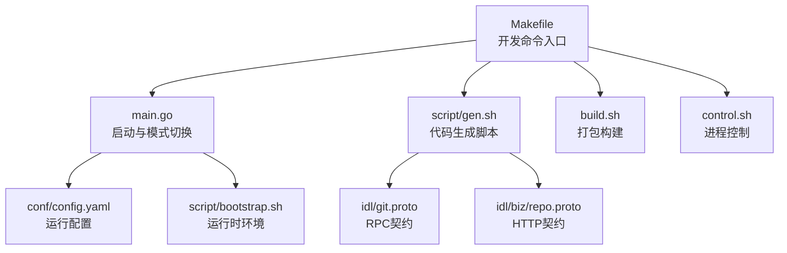
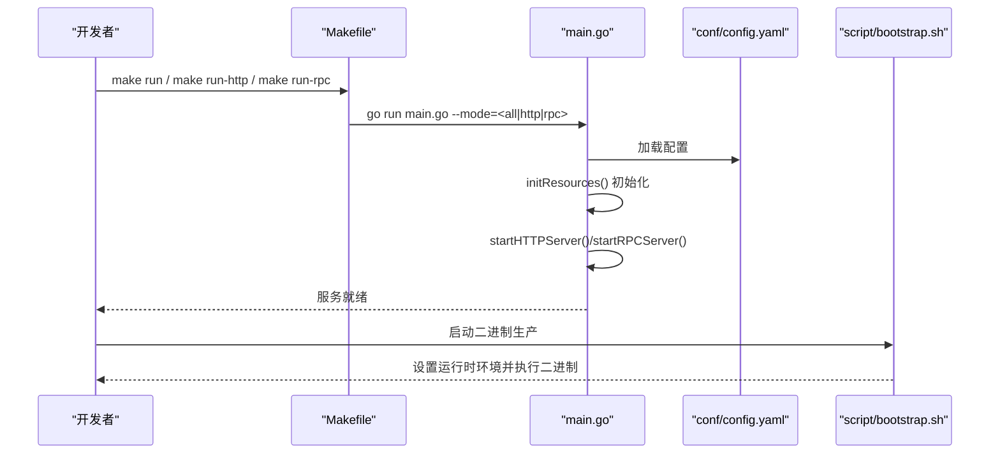
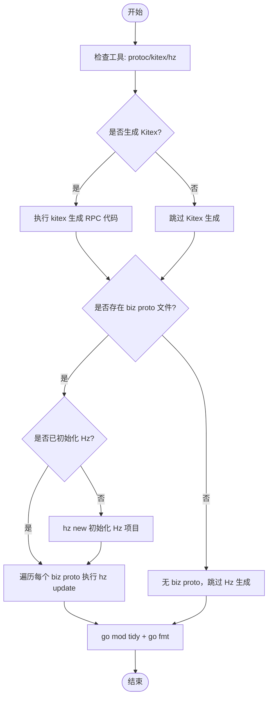
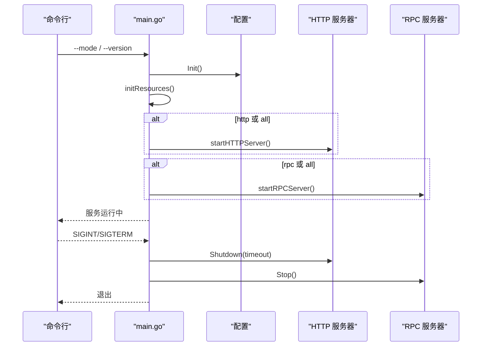
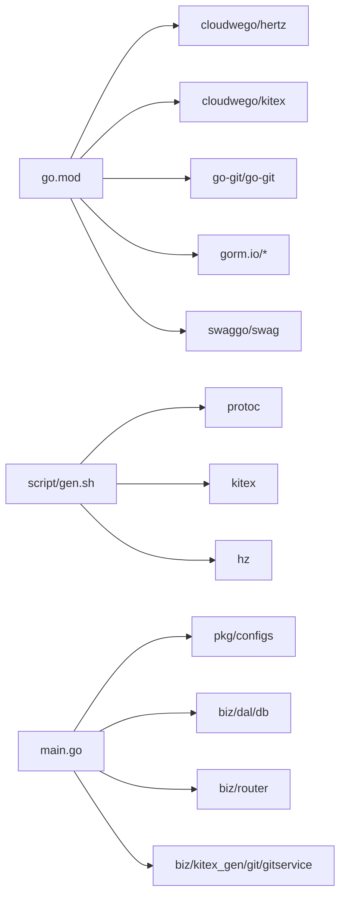

# 开发工具

<cite>
**本文引用的文件**
- [Makefile](file://Makefile)
- [main.go](file://main.go)
- [build.sh](file://build.sh)
- [control.sh](file://control.sh)
- [script/gen.sh](file://script/gen.sh)
- [go.mod](file://go.mod)
- [idl/git.proto](file://idl/git.proto)
- [idl/biz/repo.proto](file://idl/biz/repo.proto)
- [conf/config.yaml](file://conf/config.yaml)
- [deploy/CONFIG_GUIDE.md](file://deploy/CONFIG_GUIDE.md)
- [script/bootstrap.sh](file://script/bootstrap.sh)
- [script/git_submit.sh](file://script/git_submit.sh)
- [OPTIMIZATION_PLAN.md](file://OPTIMIZATION_PLAN.md)
</cite>

## 目录
1. [简介](#简介)
2. [项目结构](#项目结构)
3. [核心组件](#核心组件)
4. [架构总览](#架构总览)
5. [详细组件分析](#详细组件分析)
6. [依赖关系分析](#依赖关系分析)
7. [性能考虑](#性能考虑)
8. [故障排查指南](#故障排查指南)
9. [结论](#结论)
10. [附录](#附录)

## 简介
本指南面向使用本项目的开发者，系统讲解开发工具链与工作流，包括：
- Makefile 开发命令与使用场景
- 代码生成工具（Kitex RPC 与 Hz HTTP）的配置与流程
- IDE 配置建议（VS Code、GoLand）
- 调试工具（Delve）的配置与断点设置
- 版本控制工具使用规范（git 提交规范与分支管理）
- 性能分析工具使用指南
- 常用开发辅助工具推荐与配置

## 项目结构
该项目采用“多协议混合服务”架构：同时提供 HTTP（Hertz）与 RPC（Kitex）能力，通过命令行参数选择启动模式；IDL 使用 Protocol Buffers 描述服务契约；代码生成由 Makefile 与专用脚本驱动；配置集中于 YAML 文件并通过环境变量覆盖。

图表来源
- [Makefile](file://Makefile#L1-L86)
- [main.go](file://main.go#L52-L176)
- [script/gen.sh](file://script/gen.sh#L1-L133)
- [idl/git.proto](file://idl/git.proto#L1-L78)
- [idl/biz/repo.proto](file://idl/biz/repo.proto#L1-L199)
- [build.sh](file://build.sh#L1-L6)
- [control.sh](file://control.sh#L1-L110)
- [conf/config.yaml](file://conf/config.yaml#L1-L25)
- [script/bootstrap.sh](file://script/bootstrap.sh#L1-L14)

章节来源
- [Makefile](file://Makefile#L1-L86)
- [main.go](file://main.go#L52-L176)
- [script/gen.sh](file://script/gen.sh#L1-L133)
- [conf/config.yaml](file://conf/config.yaml#L1-L25)

## 核心组件
- 构建与运行
  - Makefile 提供构建、运行、测试、格式化、清理等常用命令，支持按模式启动 HTTP/RPC/全量服务。
  - main.go 解析命令行参数，按模式初始化资源并启动对应服务。
  - build.sh 与 control.sh 提供打包与进程控制能力。
- 代码生成
  - script/gen.sh 统一调用 kitex 与 hz，生成 RPC 与 HTTP 侧代码，并进行 go mod tidy 与 go fmt。
  - Makefile 提供快捷命令：kitex-gen、hz-gen、gen。
- 配置
  - conf/config.yaml 定义 server、rpc、database、webhook 等运行期配置；deploy/CONFIG_GUIDE.md 提供详细说明与最佳实践。
- 版本控制与提交
  - script/git_submit.sh 提供一键提交与推送流程，含校验、暂存、提交、推送与回滚。

章节来源
- [Makefile](file://Makefile#L1-L86)
- [main.go](file://main.go#L52-L176)
- [build.sh](file://build.sh#L1-L6)
- [control.sh](file://control.sh#L1-L110)
- [script/gen.sh](file://script/gen.sh#L1-L133)
- [conf/config.yaml](file://conf/config.yaml#L1-L25)
- [deploy/CONFIG_GUIDE.md](file://deploy/CONFIG_GUIDE.md#L1-L99)
- [script/git_submit.sh](file://script/git_submit.sh#L1-L94)

## 架构总览
下图展示了启动流程与关键组件交互：

图表来源
- [Makefile](file://Makefile#L19-L28)
- [main.go](file://main.go#L52-L176)
- [conf/config.yaml](file://conf/config.yaml#L1-L25)
- [script/bootstrap.sh](file://script/bootstrap.sh#L1-L14)

## 详细组件分析

### Makefile 开发命令详解
- 构建类
  - build：构建完整二进制至 output 目录
  - build-http：仅构建 HTTP 侧二进制
  - build-rpc：仅构建 RPC 侧二进制
- 运行类
  - run：以 all 模式启动 HTTP+RPC
  - run-http：仅启动 HTTP 服务器
  - run-rpc：仅启动 RPC 服务器
- 代码生成类
  - gen：执行 script/gen.sh 完整生成流程
  - kitex-gen：基于 idl/git.proto 生成 Kitex RPC 代码
  - hz-gen：遍历 idl/biz/*.proto 生成 Hz HTTP 代码
- 质量与清理
  - test：执行单元测试
  - lint：若安装 golangci-lint，则执行静态检查
  - fmt：格式化代码
  - clean：清理 output 目录
- 辅助
  - help：打印命令说明

章节来源
- [Makefile](file://Makefile#L1-L86)

### 代码生成工具（Kitex 与 Hz）
- 生成流程
  - script/gen.sh 统一检查依赖（protoc、kitex、hz），逐个生成 RPC 与 HTTP 代码，最后执行 go mod tidy 与 go fmt。
  - Makefile 的 kitex-gen 与 hz-gen 提供快速生成入口。
- Kitex RPC 代码生成
  - 输入：idl/git.proto
  - 输出：biz/kitex_gen 下的 RPC 客户端/服务端桩代码
- Hz HTTP 代码生成
  - 输入：idl/biz/*.proto
  - 输出：biz/handler/hz、biz/router/hz、biz/model/hz
  - 若首次运行，会先执行 hz new 初始化项目结构，再对每个 proto 执行 hz update。

图表来源
- [script/gen.sh](file://script/gen.sh#L34-L127)
- [Makefile](file://Makefile#L34-L49)

章节来源
- [script/gen.sh](file://script/gen.sh#L1-L133)
- [Makefile](file://Makefile#L34-L49)
- [idl/git.proto](file://idl/git.proto#L1-L78)
- [idl/biz/repo.proto](file://idl/biz/repo.proto#L1-L199)

### 启动与运行（main.go）
- 模式解析
  - --mode 支持 http、rpc、all，默认 all
  - --version 输出版本信息
- 资源初始化
  - 加载配置、初始化数据库、加密工具、定时任务与统计/审计服务
- 服务器启动
  - HTTP：基于 Hertz，默认端口来自配置
  - RPC：基于 Kitex，默认端口来自配置
- 优雅关闭
  - 监听系统信号，超时优雅关闭各服务

图表来源
- [main.go](file://main.go#L52-L176)
- [conf/config.yaml](file://conf/config.yaml#L1-L25)

章节来源
- [main.go](file://main.go#L52-L176)
- [conf/config.yaml](file://conf/config.yaml#L1-L25)

### 打包与进程控制（build.sh 与 control.sh）
- build.sh
  - 创建 output/bin 目录，复制脚本，编译二进制至 output/bin
- control.sh
  - 提供 start/stop/restart/status/build 子命令
  - 自动检测 PID 文件与进程状态，支持优雅停止与强制停止
  - 默认二进制路径与 PID/日志文件位置可按需调整

章节来源
- [build.sh](file://build.sh#L1-L6)
- [control.sh](file://control.sh#L1-L110)

### 配置与运行时（conf/config.yaml 与 script/bootstrap.sh）
- 配置项
  - server.port：HTTP 服务端口
  - rpc.port：RPC 服务端口
  - database.type/path/host/port/user/password/dbname/dsn：数据库类型与连接参数
  - webhook.secret/rate_limit/ip_whitelist：Webhook 安全与限流
- 运行时
  - script/bootstrap.sh 设置 KITEX_RUNTIME_ROOT 与日志目录，创建日志目录并执行二进制

章节来源
- [conf/config.yaml](file://conf/config.yaml#L1-L25)
- [deploy/CONFIG_GUIDE.md](file://deploy/CONFIG_GUIDE.md#L1-L99)
- [script/bootstrap.sh](file://script/bootstrap.sh#L1-L14)

### 版本控制与提交规范（script/git_submit.sh）
- 功能
  - 检查工作区状态，若无变更则退出
  - 自动 git add .
  - 交互式输入提交信息，拼接当前 git status 作为提交消息正文
  - 可选执行 git push
  - 失败时回滚暂存区
- 使用建议
  - 保持提交信息遵循约定式提交风格（feat/fix/docs/chore 等）
  - 提交前先执行 make fmt 与 make lint，确保格式与静态检查通过

章节来源
- [script/git_submit.sh](file://script/git_submit.sh#L1-L94)

## 依赖关系分析
- 工具链依赖
  - go.mod 声明了 Hertz、Kitex、go-git、gorm、swag 等核心依赖
- 生成依赖
  - script/gen.sh 依赖 protoc、kitex、hz
- 运行依赖
  - main.go 依赖配置模块、数据库模块、路由注册、RPC 处理器

图表来源
- [go.mod](file://go.mod#L1-L107)
- [script/gen.sh](file://script/gen.sh#L34-L66)
- [main.go](file://main.go#L14-L26)

章节来源
- [go.mod](file://go.mod#L1-L107)
- [script/gen.sh](file://script/gen.sh#L34-L66)
- [main.go](file://main.go#L14-L26)

## 性能考虑
- 生成与构建
  - 使用 Makefile 的 build-http/build-rpc 可减少不必要的编译产物
  - 生成代码后执行 go fmt 与 go mod tidy，有助于保持依赖与格式一致
- 运行时
  - 配置文件中 database 支持 sqlite/mysql/postgres，生产环境建议使用 mysql/postgres 并结合连接池与索引优化
  - webhook.rate_limit 用于限流，避免突发流量导致系统过载
- 优化规划参考
  - OPTIMIZATION_PLAN.md 提供了分层、并发控制、事务管理、结构化日志等优化方向，可作为长期演进依据

章节来源
- [Makefile](file://Makefile#L7-L17)
- [script/gen.sh](file://script/gen.sh#L115-L121)
- [conf/config.yaml](file://conf/config.yaml#L1-L25)
- [OPTIMIZATION_PLAN.md](file://OPTIMIZATION_PLAN.md#L1-L69)

## 故障排查指南
- 无法生成代码
  - 检查是否安装并可用 protoc、kitex、hz
  - 确认 idl/git.proto 与 idl/biz/*.proto 存在且语法正确
  - 使用 script/gen.sh 的完整流程，观察输出日志定位问题
- 无法启动服务
  - 检查 server.rpc 端口是否被占用
  - 确认 conf/config.yaml 配置项正确，必要时通过环境变量覆盖敏感字段
- 进程控制问题
  - 使用 control.sh status 查看进程状态
  - 若存在僵尸 PID 文件，手动清理后重新 start
- 提交失败
  - 使用 script/git_submit.sh 一键完成 add/commit/push，并在失败时自动回滚暂存区

章节来源
- [script/gen.sh](file://script/gen.sh#L34-L66)
- [conf/config.yaml](file://conf/config.yaml#L1-L25)
- [control.sh](file://control.sh#L76-L87)
- [script/git_submit.sh](file://script/git_submit.sh#L10-L19)

## 结论
本指南围绕 Makefile、代码生成、启动运行、配置管理、版本控制与进程控制等方面提供了系统化的开发工具使用方法。建议在日常开发中：
- 优先使用 Makefile 的快捷命令
- 通过 script/gen.sh 统一生成代码，保持一致性
- 使用 control.sh 管理进程生命周期
- 严格遵循提交规范与配置最佳实践

## 附录

### IDE 配置建议
- VS Code
  - 安装 Go 扩展，启用 gofmt、go vet、golangci-lint
  - 在设置中启用 “Go: Embed Tools” 以自动下载工具链
  - 使用 Tasks/launch.json 配置运行与调试（见下一节）
- GoLand
  - File Watchers 中添加 gofmt、go mod tidy
  - 使用内置的 Go Tool Windows 管理测试与生成

[本节为通用建议，不直接分析具体文件]

### 调试工具（Delve）配置与断点设置
- 命令行调试
  - 使用 dlv debug main.go 启动调试器
  - 使用 dlv attach <pid> 附加到已有进程
- VS Code
  - launch.json 中配置 go 的调试任务，选择 dlv 作为调试器
  - 在断点处设置条件断点，结合日志输出定位问题
- GoLand
  - 使用内置 Run/Debug 配置，选择 Delve 作为调试器
  - 支持远程调试与附加进程

[本节为通用建议，不直接分析具体文件]

### 版本控制工具使用规范
- 提交规范
  - 使用约定式提交风格（feat/fix/docs/chore/refactor/perf/test/build/ci等）
  - 提交信息包含简短主题与必要上下文
- 分支管理
  - 主分支保护，使用 feature/*、fix/*、docs/* 等命名规范
  - Pull Request 合并前确保通过测试与静态检查
- 提交自动化
  - 可使用 script/git_submit.sh 简化提交流程，避免遗漏步骤

章节来源
- [script/git_submit.sh](file://script/git_submit.sh#L40-L94)

### 性能分析工具使用指南
- CPU/内存剖析
  - 使用 go pprof 生成火焰图，定位热点函数
  - 在生产环境可通过 HTTP 接口暴露 pprof 端点（需谨慎）
- 数据库性能
  - 使用数据库自带的慢查询日志与 EXPLAIN 分析 SQL
- 网络与并发
  - 结合结构化日志与监控指标，观察并发峰值与延迟分布

[本节为通用建议，不直接分析具体文件]

### 常用开发辅助工具推荐与配置
- 代码质量
  - golangci-lint：静态检查
  - gosec：安全扫描
  - misspell：拼写检查
- 文档
  - swag：根据注释生成 OpenAPI 文档
- 集成
  - pre-commit 钩子：在提交前自动执行 gofmt、go test、golangci-lint
  - GitHub Actions：CI/CD 流水线（可参考优化规划中的部署与 CI/CD 配置）

[本节为通用建议，不直接分析具体文件]