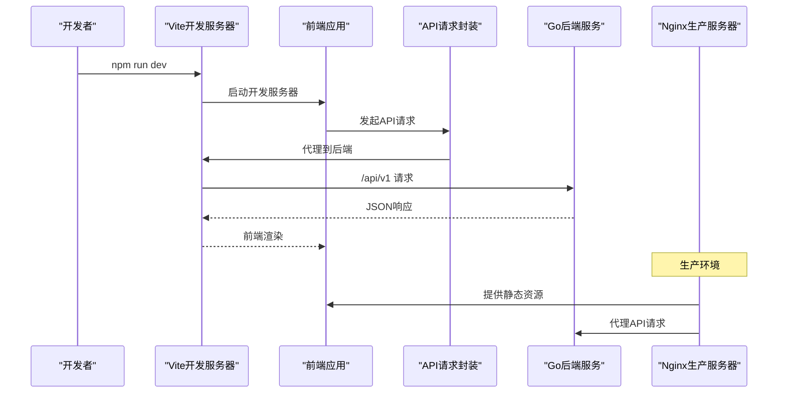
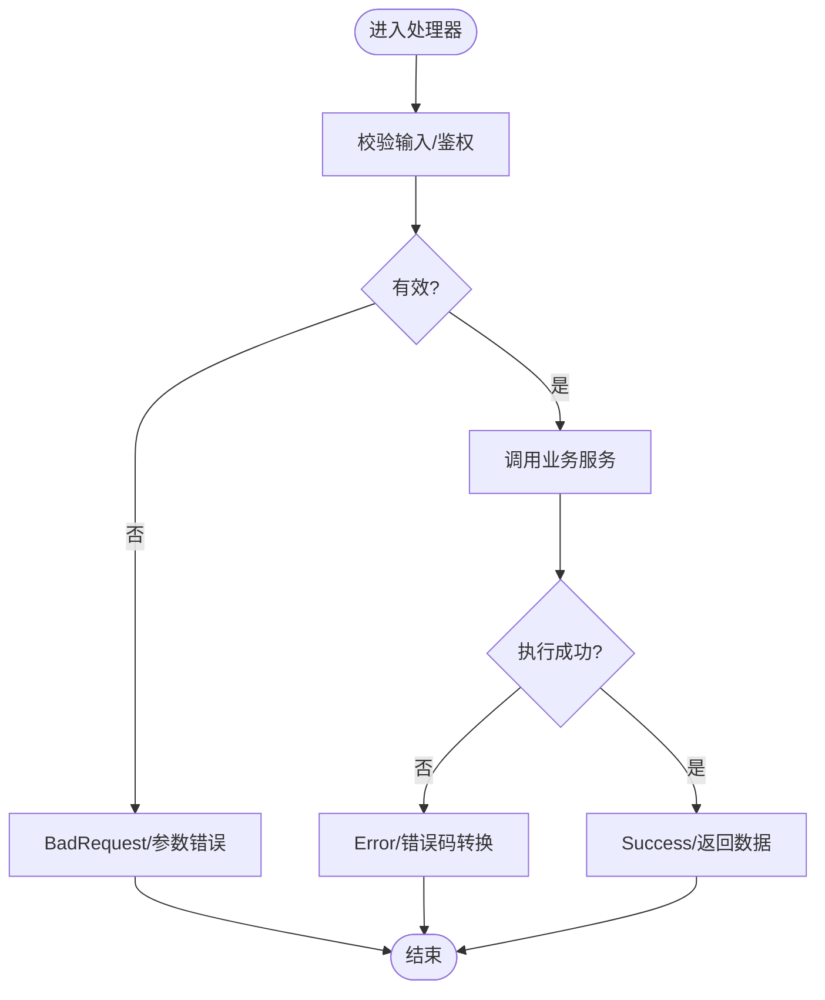
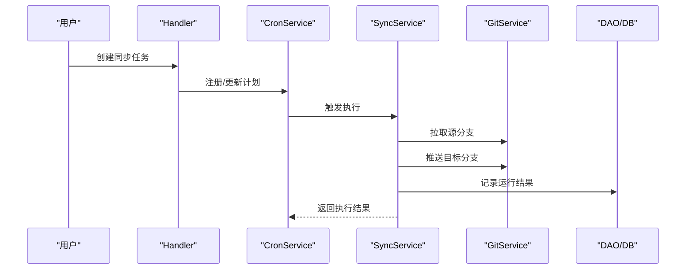
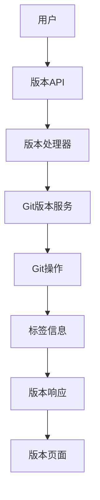
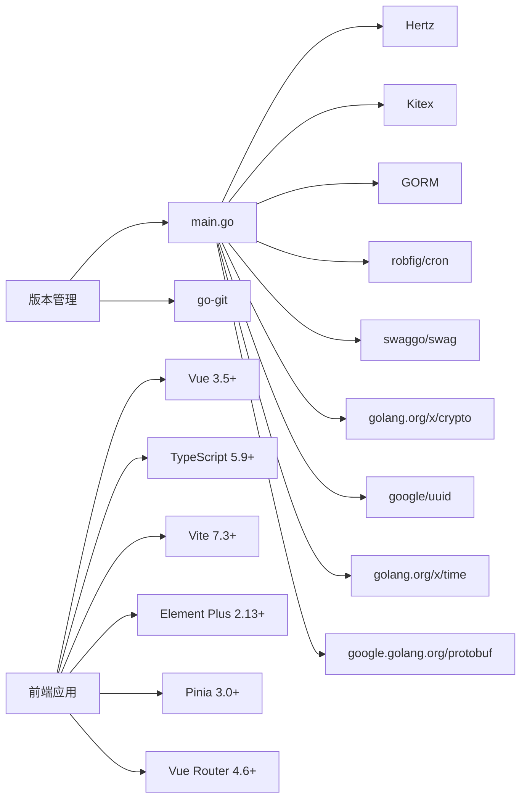

# 开发指南

<cite>
**本文引用的文件**
- [README.md](file://README.md)
- [PROJECT_STRUCTURE.md](file://PROJECT_STRUCTURE.md)
- [main.go](file://main.go)
- [go.mod](file://go.mod)
- [Makefile](file://Makefile)
- [Dockerfile](file://Dockerfile)
- [deploy/README.md](file://deploy/README.md)
- [conf/config.yaml](file://conf/config.yaml)
- [pkg/configs/config.go](file://pkg/configs/config.go)
- [pkg/configs/loader.go](file://pkg/configs/loader.go)
- [pkg/configs/model.go](file://pkg/configs/model.go)
- [pkg/response/response.go](file://pkg/response/response.go)
- [pkg/errno/errno.go](file://pkg/errno/errno.go)
- [biz/dal/db/init.go](file://biz/dal/db/init.go)
- [router.go](file://router.go)
- [router_gen.go](file://router_gen.go)
- [biz/kitex_gen/git/gitservice/gitservice.go](file://biz/kitex_gen/git/gitservice/gitservice.go)
- [biz/rpc_handler/git_handler.go](file://biz/rpc_handler/git_handler.go)
- [biz/service/sync/cron_service.go](file://biz/service/sync/cron_service.go)
- [biz/service/sync/sync_service.go](file://biz/service/sync/sync_service.go)
- [biz/service/git/git_service.go](file://biz/service/git/git_service.go)
- [biz/service/git/git_branch.go](file://biz/service/git/git_branch.go)
- [biz/service/stats/stats_service.go](file://biz/service/stats/stats_service.go)
- [biz/service/stats/line_counter.go](file://biz/service/stats/line_counter.go)
- [biz/middleware/webhook.go](file://biz/middleware/webhook.go)
- [public/js/common.js](file://public/js/common.js)
- [public/js/request.js](file://public/js/request.js)
- [docs/swagger.yaml](file://docs/swagger.yaml)
- [docs/webhook.md](file://docs/webhook.md)
- [script/gen.sh](file://script/gen.sh)
- [script/bootstrap.sh](file://script/bootstrap.sh)
- [test/webhook_client/main.go](file://test/webhook_client/main.go)
- [build.sh](file://build.sh)
- [biz/handler/version/version_service.go](file://biz/handler/version/version_service.go)
- [biz/router/version/version.go](file://biz/router/version/version.go)
- [idl/biz/version.proto](file://idl/biz/version.proto)
- [public/versions.html](file://public/versions.html)
- [script/git_submit.sh](file://script/git_submit.sh)
- [frontend/vite.config.ts](file://frontend/vite.config.ts)
- [frontend/package.json](file://frontend/package.json)
- [frontend/tsconfig.json](file://frontend/tsconfig.json)
- [frontend/tsconfig.app.json](file://frontend/tsconfig.app.json)
- [frontend/tsconfig.node.json](file://frontend/tsconfig.node.json)
- [frontend/env.d.ts](file://frontend/env.d.ts)
- [frontend/src/main.ts](file://frontend/src/main.ts)
- [frontend/src/App.vue](file://frontend/src/App.vue)
- [frontend/src/router/index.ts](file://frontend/src/router/index.ts)
- [frontend/src/stores/useAppStore.ts](file://frontend/src/stores/useAppStore.ts)
- [frontend/src/api/request.ts](file://frontend/src/api/request.ts)
- [frontend/src/api/modules/repo.ts](file://frontend/src/api/modules/repo.ts)
- [frontend/src/types/repo.ts](file://frontend/src/types/repo.ts)
- [frontend/src/utils/format.ts](file://frontend/src/utils/format.ts)
- [frontend/src/components/layout/AppLayout.vue](file://frontend/src/components/layout/AppLayout.vue)
- [frontend/src/views/home/HomePage.vue](file://frontend/src/views/home/HomePage.vue)
- [frontend/nginx.conf](file://frontend/nginx.conf)
</cite>

## 目录
1. [简介](#简介)
2. [项目结构](#项目结构)
3. [核心组件](#核心组件)
4. [架构总览](#架构总览)
5. [详细组件分析](#详细组件分析)
6. [依赖关系分析](#依赖关系分析)
7. [性能考虑](#性能考虑)
8. [故障排查指南](#故障排查指南)
9. [结论](#结论)
10. [附录](#附录)

## 简介
本开发指南面向参与 Git Manage Service 的开发者，提供从环境搭建、代码规范、错误与响应设计、测试与质量保障、调试与工具、项目结构与模块组织、贡献与协作流程，到持续集成与自动化构建的完整说明。项目采用多仓库、多分支自动化同步管理能力，提供 HTTP API 与 gRPC/RPC 双栈服务，支持定时任务、Webhook 触发与可视化 Web UI。

**更新** 新增动态版本信息注入与版本管理功能，支持通过命令行参数获取构建时版本信息，并提供版本查询与版本历史展示功能。**新增前端开发环境搭建**，包含 Vite 配置、TypeScript 配置、Element Plus 集成、开发代理配置、生产部署配置等完整前端开发流程。

## 项目结构
项目采用分层与按功能域划分的组织方式：
- biz：业务层（Handler、Service、DAL、Model、RPC Handler、Router）
- pkg：共享包（配置、错误码、统一响应）
- conf：运行时配置
- deploy：部署相关（Docker、Kubernetes、Compose）
- docs：文档与接口定义
- public：前端静态资源
- script：代码生成与初始化脚本
- test：测试辅助工具
- **frontend**：Vue 3 + TypeScript 前端应用，使用 Vite 构建，Element Plus UI 组件库

```mermaid
graph TB
subgraph "入口与框架"
MAIN["main.go<br/>启动与路由注册"]
ROUTER["router.go<br/>自定义路由"]
ROUTER_GEN["router_gen.go<br/>Hertz生成路由"]
VERSION_HANDLER["biz/handler/version/<br/>版本管理处理器"]
VERSION_ROUTER["biz/router/version/<br/>版本管理路由"]
VERSION_PROTO["idl/biz/version.proto<br/>版本管理IDL"]
END
subgraph "业务层(biz)"
HANDLER["biz/handler/*<br/>HTTP请求处理"]
SERVICE["biz/service/*<br/>业务逻辑"]
DAL["biz/dal/db/*<br/>数据访问层"]
MODEL["biz/model/*<br/>模型定义"]
RPC_H["biz/rpc_handler/*<br/>RPC处理器"]
KITEX["biz/kitex_gen/*<br/>Kitex生成代码"]
end
subgraph "共享包(pkg)"
CFG["pkg/configs/*<br/>配置加载与模型"]
RESP["pkg/response/*<br/>统一响应"]
ERR["pkg/errno/*<br/>错误码"]
end
subgraph "部署与配置"
CONF["conf/config.yaml<br/>运行配置"]
DOCKER["Dockerfile<br/>容器化构建"]
DEPLOY_README["deploy/README.md<br/>部署说明"]
FRONTEND_NGINX["frontend/nginx.conf<br/>前端Nginx配置"]
END
subgraph "前端应用(frontend)"
VITE_CONFIG["vite.config.ts<br/>Vite构建配置"]
TS_CONFIG["tsconfig.json<br/>TypeScript配置"]
MAIN_TS["src/main.ts<br/>应用入口"]
ROUTER_TS["src/router/index.ts<br/>路由配置"]
API_REQUEST["src/api/request.ts<br/>API请求封装"]
ELEMENT_PLUS["Element Plus<br/>UI组件库集成"]
COMPONENTS["src/components/<br/>业务组件"]
VIEWS["src/views/<br/>页面视图"]
STORES["src/stores/<br/>状态管理"]
TYPES["src/types/<br/>类型定义"]
UTILS["src/utils/<br/>工具函数"]
end
MAIN --> ROUTER
MAIN --> ROUTER_GEN
MAIN --> VERSION_HANDLER
MAIN --> VERSION_ROUTER
MAIN --> VERSION_PROTO
MAIN --> CFG
MAIN --> DAL
MAIN --> RPC_H
MAIN --> KITEX
ROUTER --> HANDLER
ROUTER --> VERSION_HANDLER
HANDLER --> SERVICE
SERVICE --> DAL
SERVICE --> MODEL
DAL --> MODEL
CFG --> CONF
RESP --> HANDLER
ERR --> HANDLER
DOCKER --> MAIN
DEPLOY_README --> DOCKER
FRONTEND_NGINX --> FRONTEND_APP["前端应用"]
VITE_CONFIG --> FRONTEND_APP
TS_CONFIG --> FRONTEND_APP
MAIN_TS --> FRONTEND_APP
ROUTER_TS --> FRONTEND_APP
API_REQUEST --> FRONTEND_APP
ELEMENT_PLUS --> FRONTEND_APP
COMPONENTS --> FRONTEND_APP
VIEWS --> FRONTEND_APP
STORES --> FRONTEND_APP
TYPES --> FRONTEND_APP
UTILS --> FRONTEND_APP
```

**图表来源**
- [main.go](file://main.go#L1-L184)
- [router.go](file://router.go#L1-L16)
- [router_gen.go](file://router_gen.go)
- [biz/handler/version/version_service.go](file://biz/handler/version/version_service.go#L1-L88)
- [biz/router/version/version.go](file://biz/router/version/version.go#L1-L33)
- [idl/biz/version.proto](file://idl/biz/version.proto#L1-L81)
- [frontend/vite.config.ts](file://frontend/vite.config.ts#L1-L33)
- [frontend/src/main.ts](file://frontend/src/main.ts#L1-L16)
- [frontend/src/router/index.ts](file://frontend/src/router/index.ts#L1-L79)
- [frontend/src/api/request.ts](file://frontend/src/api/request.ts#L1-L45)
- [frontend/nginx.conf](file://frontend/nginx.conf#L1-L46)

**章节来源**
- [PROJECT_STRUCTURE.md](file://PROJECT_STRUCTURE.md#L1-L109)
- [README.md](file://README.md#L1-L44)

## 核心组件
- 启动与控制流：main.go 负责解析参数、初始化资源、启动 HTTP 与 RPC 服务、信号处理与优雅关闭。
- 配置系统：pkg/configs 提供 Viper 驱动的配置加载、默认值与环境变量覆盖。
- 统一响应与错误码：pkg/response 与 pkg/errno 提供一致的响应结构与错误码体系。
- 数据访问：biz/dal/db 根据配置选择 SQLite/MySQL/Postgres 并进行迁移。
- 业务服务：包括 Git 操作、同步调度、统计计算、审计与系统工具等。
- RPC 与 HTTP：Kitex 生成的 gRPC 服务与 Hertz 生成的路由共同构成双栈接口。
- **版本管理**：新增版本查询、版本历史展示与版本建议功能，支持动态版本信息注入。
- **前端应用**：Vue 3 + TypeScript + Vite + Element Plus 的现代化前端架构，支持开发代理、代码分割和生产优化。

**章节来源**
- [main.go](file://main.go#L1-L184)
- [pkg/configs/config.go](file://pkg/configs/config.go#L1-L43)
- [pkg/configs/loader.go](file://pkg/configs/loader.go#L1-L46)
- [pkg/response/response.go](file://pkg/response/response.go#L1-L87)
- [pkg/errno/errno.go](file://pkg/errno/errno.go#L1-L129)
- [biz/dal/db/init.go](file://biz/dal/db/init.go#L1-L72)
- [frontend/vite.config.ts](file://frontend/vite.config.ts#L1-L33)
- [frontend/src/main.ts](file://frontend/src/main.ts#L1-L16)

## 架构总览
系统以"入口 -> 配置 -> 路由 -> 处理器 -> 服务 -> 数据访问"的链路运行；同时通过 Kitex 生成的 gRPC 服务对外提供 RPC 能力。数据库类型通过配置动态切换，支持 SQLite、MySQL、Postgres。前端通过 Vite 开发服务器提供热重载和代理功能，生产环境通过 Nginx 提供静态资源服务和 API 代理。



**图表来源**
- [frontend/vite.config.ts](file://frontend/vite.config.ts#L12-L20)
- [frontend/src/api/request.ts](file://frontend/src/api/request.ts#L6-L12)
- [frontend/nginx.conf](file://frontend/nginx.conf#L24-L32)

## 详细组件分析

### 启动与生命周期管理
- 支持三种启动模式：http、rpc、all；通过信号处理实现优雅关闭。
- 初始化顺序：配置 -> 数据库 -> 加密工具 -> 业务服务（定时、统计、审计）。
- HTTP 与 RPC 地址从配置读取，确保可配置化。
- **版本信息**：支持 --version 参数显示动态注入的版本信息（版本号、构建时间、Git 提交哈希）。
- **前端开发**：Vite 开发服务器监听 3000 端口，支持热重载和实时错误提示。

**章节来源**
- [main.go](file://main.go#L42-L184)
- [pkg/configs/model.go](file://pkg/configs/model.go#L3-L34)
- [frontend/vite.config.ts](file://frontend/vite.config.ts#L12-L14)

### 配置系统
- 配置来源优先级：当前目录、conf 子目录、上级 conf 子目录；支持环境变量覆盖。
- 默认值：服务端口、RPC 端口、数据库类型与默认路径、Webhook 默认密钥与限流。
- 兼容性：保留旧版全局变量以便向后兼容。

**章节来源**
- [pkg/configs/loader.go](file://pkg/configs/loader.go#L9-L46)
- [pkg/configs/config.go](file://pkg/configs/config.go#L18-L42)
- [pkg/configs/model.go](file://pkg/configs/model.go#L3-L34)
- [conf/config.yaml](file://conf/config.yaml#L1-L25)

### 统一响应与错误处理
- 统一响应结构：包含业务状态码、消息、可选错误详情与数据体。
- 常用封装：成功、异步受理、参数错误、未找到、服务器错误、未授权、禁止访问、冲突等。
- 错误码体系：通用、仓库、分支、同步、认证、标签、系统等分类，支持转换与携带自定义消息。



**图表来源**
- [pkg/response/response.go](file://pkg/response/response.go#L17-L87)
- [pkg/errno/errno.go](file://pkg/errno/errno.go#L119-L129)

**章节来源**
- [pkg/response/response.go](file://pkg/response/response.go#L1-L87)
- [pkg/errno/errno.go](file://pkg/errno/errno.go#L1-L129)

### 数据访问层（GORM）
- 支持 SQLite、MySQL、Postgres 三类驱动，DSN 优先级高于字段拼接。
- 启动时检查表是否存在，若不存在则自动迁移。
- 通过 PO 结构映射到数据库表，DAO 层负责具体 CRUD。

**章节来源**
- [biz/dal/db/init.go](file://biz/dal/db/init.go#L18-L71)

### 业务服务与工作流

#### 同步调度与执行
- CronService：基于 cron 表达式管理定时任务。
- SyncService：执行 Fetch/Push、记录运行结果、冲突检测与保护策略。
- 关键流程：用户创建任务 -> Handler 校验 -> CronService 调度 -> SyncService 执行 -> DAO 记录。



**图表来源**
- [biz/service/sync/cron_service.go](file://biz/service/sync/cron_service.go)
- [biz/service/sync/sync_service.go](file://biz/service/sync/sync_service.go)
- [biz/service/git/git_service.go](file://biz/service/git/git_service.go)
- [biz/dal/db/init.go](file://biz/dal/db/init.go#L66-L71)

**章节来源**
- [biz/service/sync/cron_service.go](file://biz/service/sync/cron_service.go)
- [biz/service/sync/sync_service.go](file://biz/service/sync/sync_service.go)
- [biz/service/git/git_service.go](file://biz/service/git/git_service.go)

#### 分支管理
- GitBranch 服务读取本地 Git 引用，支持列表、创建、删除等操作。
- Handler 层负责路径解析与输出格式化。

**章节来源**
- [biz/service/git/git_branch.go](file://biz/service/git/git_branch.go)
- [PROJECT_STRUCTURE.md](file://PROJECT_STRUCTURE.md#L104-L109)

#### 统计与语言配置
- StatsService：统计提交历史、代码行数等。
- LineCounter：按语言配置统计代码行。

**章节来源**
- [biz/service/stats/stats_service.go](file://biz/service/stats/stats_service.go)
- [biz/service/stats/line_counter.go](file://biz/service/stats/line_counter.go)

#### 版本管理服务
- **版本查询**：GetVersion 提供当前版本信息查询，基于 Git describe 获取最近标签。
- **版本列表**：ListVersions 返回版本历史列表，包含标签、提交哈希、作者、日期和消息。
- **版本建议**：GetNextVersions 提供语义化版本建议（主版本、次版本、补丁版本）。
- **前端展示**：public/versions.html 提供版本历史时间线展示界面。



**图表来源**
- [biz/handler/version/version_service.go](file://biz/handler/version/version_service.go#L14-L87)
- [biz/router/version/version.go](file://biz/router/version/version.go#L25-L28)
- [public/versions.html](file://public/versions.html#L66-L103)

**章节来源**
- [biz/handler/version/version_service.go](file://biz/handler/version/version_service.go#L1-L88)
- [biz/router/version/version.go](file://biz/router/version/version.go#L1-L33)
- [idl/biz/version.proto](file://idl/biz/version.proto#L1-L81)
- [public/versions.html](file://public/versions.html#L1-L106)

### RPC 与 Kitex
- 通过 IDL 定义 gRPC 接口，Kitex 生成服务端桩代码。
- biz/rpc_handler 实现 RPC 逻辑，main.go 启动 Kitex 服务。

**章节来源**
- [biz/kitex_gen/git/gitservice/gitservice.go](file://biz/kitex_gen/git/gitservice/gitservice.go)
- [biz/rpc_handler/git_handler.go](file://biz/rpc_handler/git_handler.go)
- [main.go](file://main.go#L154-L175)

### Webhook 中间件
- biz/middleware/webhook.go 提供 Webhook 验证与限流，结合配置中的密钥与白名单。

**章节来源**
- [biz/middleware/webhook.go](file://biz/middleware/webhook.go)
- [conf/config.yaml](file://conf/config.yaml#L21-L25)

### 前端与接口文档
- public/js 提供通用请求封装与工具函数。
- docs/swagger.yaml 与 docs/swagger.html 提供接口文档。
- docs/webhook.md 提供 Webhook 使用说明。
- **版本页面**：public/versions.html 提供版本历史展示界面。
- **前端应用**：Vue 3 + TypeScript + Vite + Element Plus 的现代化前端架构。

**章节来源**
- [public/js/common.js](file://public/js/common.js)
- [public/js/request.js](file://public/js/request.js)
- [docs/swagger.yaml](file://docs/swagger.yaml)
- [docs/webhook.md](file://docs/webhook.md)
- [public/versions.html](file://public/versions.html#L1-L106)
- [frontend/vite.config.ts](file://frontend/vite.config.ts#L1-L33)
- [frontend/src/main.ts](file://frontend/src/main.ts#L1-L16)

### 前端开发环境搭建

#### Vite 配置
- **开发服务器**：监听 3000 端口，支持热重载和实时错误提示。
- **路径别名**：@ 指向 src 目录，简化导入路径。
- **开发代理**：将 /api/v1 前缀的请求代理到后端服务 http://localhost:38080。
- **构建优化**：代码分割策略，将 element-plus 和第三方依赖单独打包。

**章节来源**
- [frontend/vite.config.ts](file://frontend/vite.config.ts#L1-L33)

#### TypeScript 配置
- **多配置文件**：tsconfig.json 作为根配置，包含 app 和 node 两个子配置。
- **严格模式**：启用严格类型检查，包括未使用变量和参数检测。
- **路径映射**：与 Vite 路径别名保持一致，@/* 映射到 src/*。
- **类型声明**：支持 Vue 单文件组件类型检查。

**章节来源**
- [frontend/tsconfig.json](file://frontend/tsconfig.json#L1-L8)
- [frontend/tsconfig.app.json](file://frontend/tsconfig.app.json#L1-L20)
- [frontend/tsconfig.node.json](file://frontend/tsconfig.node.json#L1-L27)
- [frontend/env.d.ts](file://frontend/env.d.ts#L1-L8)

#### Element Plus 集成
- **UI 组件库**：集成 Element Plus 2.x，提供丰富的 Vue 3 组件。
- **样式引入**：全局引入 Element Plus 样式文件。
- **图标支持**：使用 @element-plus/icons-vue 提供的图标组件。
- **主题定制**：可通过 Element Plus 提供的主题变量进行样式定制。

**章节来源**
- [frontend/src/main.ts](file://frontend/src/main.ts#L1-L16)
- [frontend/package.json](file://frontend/package.json#L11-L19)

#### 开发代理配置
- **API 代理**：/api/v1 前缀请求转发到后端服务。
- **跨域处理**：changeOrigin: true 解决开发环境跨域问题。
- **请求头透传**：保留原始请求头信息，确保后端服务正常工作。

**章节来源**
- [frontend/vite.config.ts](file://frontend/vite.config.ts#L14-L19)
- [frontend/src/api/request.ts](file://frontend/src/api/request.ts#L6-L12)

#### 生产部署配置
- **静态资源**：通过 Nginx 提供前端静态文件服务。
- **缓存策略**：JS/CSS 等静态资源缓存 1 年，index.html 不缓存。
- **API 代理**：将 /api/v1 前缀请求代理到后端服务。
- **Swagger 文档**：通过 /swagger 路径访问后端接口文档。
- **Gzip 压缩**：启用 gzip 压缩提升传输效率。

**章节来源**
- [frontend/nginx.conf](file://frontend/nginx.conf#L1-L46)

#### 应用入口与路由
- **应用入口**：src/main.ts 创建 Vue 应用实例，集成 Pinia、Router 和 Element Plus。
- **路由配置**：支持嵌套路由，包含首页、仓库管理、分支管理、同步任务等功能页面。
- **标题管理**：根据路由元信息动态设置页面标题。

**章节来源**
- [frontend/src/main.ts](file://frontend/src/main.ts#L1-L16)
- [frontend/src/router/index.ts](file://frontend/src/router/index.ts#L1-L79)

#### API 请求封装
- **基础配置**：baseURL 设置为 /api/v1，统一 API 前缀。
- **拦截器**：统一处理响应数据，非 JSON 响应直接返回。
- **错误处理**：对接口返回的错误码进行统一处理，使用 Element Plus Message 组件提示。
- **网络错误**：捕获网络异常，提供友好的错误提示。

**章节来源**
- [frontend/src/api/request.ts](file://frontend/src/api/request.ts#L1-L45)

#### 状态管理与组件
- **Pinia 状态管理**：使用 Pinia 管理应用状态，如侧边栏折叠状态。
- **布局组件**：AppLayout 提供统一的头部导航和主内容区域。
- **业务组件**：包含仓库管理、分支管理、同步任务等业务组件。
- **页面视图**：HomePage 作为首页展示，包含功能介绍和操作按钮。

**章节来源**
- [frontend/src/stores/useAppStore.ts](file://frontend/src/stores/useAppStore.ts#L1-L13)
- [frontend/src/components/layout/AppLayout.vue](file://frontend/src/components/layout/AppLayout.vue#L1-L88)
- [frontend/src/views/home/HomePage.vue](file://frontend/src/views/home/HomePage.vue#L1-L102)

#### 类型定义与工具函数
- **类型定义**：Repository 相关的 TypeScript 接口，包括 RepoDTO、RegisterRepoReq 等。
- **格式化工具**：日期格式化、相对时间计算、状态颜色映射等工具函数。
- **API 模块**：按功能模块组织的 API 请求方法，如仓库管理、分支管理等。

**章节来源**
- [frontend/src/types/repo.ts](file://frontend/src/types/repo.ts#L1-L64)
- [frontend/src/utils/format.ts](file://frontend/src/utils/format.ts#L1-L50)
- [frontend/src/api/modules/repo.ts](file://frontend/src/api/modules/repo.ts#L1-L41)

## 依赖关系分析
- 语言与框架：Go 1.25+，Hertz（HTTP）、Kitex（RPC）、GORM（ORM）、go-git（Git 操作）、cron（定时任务）。
- 数据库驱动：mysql/postgres/sqlite。
- 配置：Viper。
- 文档：Swag。
- **前端技术栈**：Vue 3.5+、TypeScript 5.9+、Vite 7.3+、Element Plus 2.13+、Pinia 3.0+、Vue Router 4.6+。



**图表来源**
- [go.mod](file://go.mod#L5-L21)
- [main.go](file://main.go#L3-L27)
- [frontend/package.json](file://frontend/package.json#L11-L27)

**章节来源**
- [go.mod](file://go.mod#L1-L107)
- [frontend/package.json](file://frontend/package.json#L1-L29)

## 性能考虑
- 数据库：根据并发与数据规模选择 MySQL/Postgres；SQLite 适合开发与小规模场景。
- ORM：避免 N+1 查询，合理使用预加载与索引；批量写入时使用事务。
- 定时任务：cron 表达式尽量分散，避免高峰时段集中触发。
- RPC/HTTP：启用压缩与合理的超时设置；对大对象传输使用分页或流式。
- 日志：区分级别，避免在热路径打印大量结构化日志。
- 前端：静态资源缓存与 CDN；减少不必要的请求与重绘；代码分割优化首屏加载。
- **版本查询**：Git 操作可能较慢，建议缓存版本信息或限制查询频率。
- **前端优化**：Element Plus 按需加载，Vite 代码分割，生产环境 Gzip 压缩。

## 故障排查指南
- 启动失败
  - 检查配置文件与环境变量是否正确加载。
  - 确认数据库连接参数与可达性。
- 数据库问题
  - 若表已存在，跳过迁移；若迁移失败，检查权限与 DSN。
- Webhook 无效
  - 校验签名密钥、IP 白名单与限流设置。
- RPC/HTTP 无法访问
  - 确认端口与防火墙；查看日志定位错误。
- 前端页面异常
  - 检查静态资源路径与跨域设置；确认 API 响应格式一致。
  - **开发代理**：确认 Vite 开发服务器正常运行，代理配置正确。
  - **TypeScript 编译**：检查 tsconfig 配置，确保类型检查通过。
- **版本查询失败**
  - 确认 Git 仓库路径正确且可访问。
  - 检查 Git describe 命令执行权限。
  - 验证版本页面的 repo_key 参数传递。

**章节来源**
- [pkg/configs/loader.go](file://pkg/configs/loader.go#L31-L45)
- [biz/dal/db/init.go](file://biz/dal/db/init.go#L49-L71)
- [conf/config.yaml](file://conf/config.yaml#L21-L25)
- [main.go](file://main.go#L136-L184)
- [frontend/vite.config.ts](file://frontend/vite.config.ts#L12-L19)
- [frontend/src/api/request.ts](file://frontend/src/api/request.ts#L23-L42)

## 结论
本指南提供了从环境搭建到部署运维的全链路开发指引。通过统一的配置、响应与错误码体系，以及清晰的业务分层与双栈接口，项目具备良好的扩展性与可维护性。**新增的版本管理功能**进一步增强了项目的可观测性和运维能力。**新增的前端开发环境**提供了现代化的开发体验，包含完整的开发代理、TypeScript 类型检查、Element Plus UI 组件库集成和生产部署配置。建议在团队内遵循统一的编码规范与审查流程，持续完善测试与文档。

## 附录

### 开发环境搭建与工具配置
- 环境要求：Go 1.25+、Git、Docker（可选）、Node.js 16+（用于前端开发）。
- 获取与编译
  - 下载依赖：go mod tidy
  - 编译二进制：go build -o git-manage-service
  - 运行：go run main.go --mode=all
  - **版本信息**：go run main.go --version 查看动态注入的版本信息
- 一键构建与运行
  - make build/run/run-http/run-rpc
  - build.sh 输出到 output/bin
- 代码生成
  - make gen 或 ./script/gen.sh
  - make kitex-gen 与 make hz-gen
- 容器化
  - Dockerfile 已内置构建与运行时依赖
  - docker-compose 与 Kubernetes 清单位于 deploy/
- **前端开发环境**
  - 安装依赖：npm install
  - 开发运行：npm run dev（默认端口 3000）
  - 生产构建：npm run build
  - 预览构建：npm run preview

**章节来源**
- [README.md](file://README.md#L19-L30)
- [Makefile](file://Makefile#L7-L86)
- [build.sh](file://build.sh#L1-L6)
- [Dockerfile](file://Dockerfile#L1-L77)
- [deploy/README.md](file://deploy/README.md#L23-L48)
- [frontend/package.json](file://frontend/package.json#L6-L10)

### 代码规范、命名约定与最佳实践
- 包与目录
  - 按功能域划分 biz/*、pkg/*，保持单一职责。
  - 生成代码置于 biz/kitex_gen 与 Hertz 生成目录。
  - **前端目录**：src 下按功能域划分 api、components、router、stores、types、utils、views。
- 命名
  - 结构体与导出函数使用清晰语义；常量与错误码使用前缀区分领域。
  - 文件名与目录名采用小写与下划线风格。
  - **TypeScript**：接口使用大驼峰命名，函数使用小驼峰命名。
- 错误处理
  - 优先使用 pkg/errno 定义的错误码；在处理器中统一通过 pkg/response 输出。
- 配置
  - 通过 pkg/configs 加载与覆盖；敏感信息通过环境变量注入。
- 日志
  - 使用标准库 log；区分错误与调试信息。
- 文档
  - 接口文档通过 Swag 生成；Webhook 文档位于 docs/webhook.md。
- **版本管理**
  - 版本查询接口遵循 RESTful 设计，参数通过查询字符串传递。
  - 响应数据结构清晰，包含版本号、提交哈希、标签信息等。
- **前端规范**
  - Vue 组件使用 PascalCase 命名，单文件组件按功能组织。
  - TypeScript 接口定义在 types 目录，API 方法按模块组织在 api/modules。
  - Element Plus 组件统一使用，避免重复造轮子。

**章节来源**
- [pkg/errno/errno.go](file://pkg/errno/errno.go#L31-L129)
- [pkg/response/response.go](file://pkg/response/response.go#L9-L87)
- [pkg/configs/config.go](file://pkg/configs/config.go#L18-L42)
- [docs/swagger.yaml](file://docs/swagger.yaml)
- [docs/webhook.md](file://docs/webhook.md)
- [biz/handler/version/version_service.go](file://biz/handler/version/version_service.go#L14-L87)
- [frontend/src/types/repo.ts](file://frontend/src/types/repo.ts#L1-L64)
- [frontend/src/api/modules/repo.ts](file://frontend/src/api/modules/repo.ts#L1-L41)

### 错误处理机制与统一响应格式
- 统一响应结构：code、msg、error、data。
- 错误码：按领域细分，支持转换与自定义消息。
- 处理器：在业务失败时调用 Error/ErrorWithCode/BadRequest 等封装。

**章节来源**
- [pkg/response/response.go](file://pkg/response/response.go#L9-L87)
- [pkg/errno/errno.go](file://pkg/errno/errno.go#L119-L129)

### 单元测试与集成测试
- 运行全部测试：make test
- Webhook 测试客户端：test/webhook_client/main.go
- 建议
  - 为 Service 与 Handler 编写单元测试，使用内存数据库或模拟 DAO。
  - 对关键流程（同步、分支、统计、版本管理）编写集成测试，覆盖真实数据库与 Git 操作。
  - **前端测试**：为 Vue 组件和工具函数编写单元测试，使用 Vitest 或 Jest。

**章节来源**
- [Makefile](file://Makefile#L52-L54)
- [test/webhook_client/main.go](file://test/webhook_client/main.go)

### 代码审查标准与质量保证
- 代码审查要点
  - 结构清晰、职责单一；错误码与响应一致性。
  - 配置与环境变量使用正确；敏感信息不硬编码。
  - 日志与错误信息可诊断；边界条件与异常路径覆盖。
  - 性能与资源使用：连接池、事务、锁与并发。
  - **版本管理**：Git 操作的安全性与错误处理。
  - **前端代码**：TypeScript 类型检查通过，组件设计符合单一职责。
- 质量工具
  - 代码格式：make fmt
  - Lint：make lint（需安装 golangci-lint）
  - **前端**：TypeScript 编译检查，ESLint 代码规范检查。

**章节来源**
- [Makefile](file://Makefile#L55-L64)

### 调试技巧与开发工具推荐
- 调试
  - 使用日志定位问题；必要时开启数据库与 Git 操作日志。
  - 在本地使用 SQLite 快速复现问题；生产使用 MySQL/Postgres。
  - **版本调试**：使用 git describe 命令手动验证版本信息。
  - **前端调试**：使用 Vue DevTools 检查组件状态，Chrome DevTools 调试网络请求。
- 工具
  - IDE/GOPATH/插件；Docker 与 compose 快速复现环境。
  - Postman/浏览器 Swagger 页面验证接口。
  - golangci-lint、go fmt、go test。
  - **前端工具**：Vite 开发服务器、TypeScript 编译器、ESLint 代码检查。

**章节来源**
- [deploy/README.md](file://deploy/README.md#L23-L48)
- [Makefile](file://Makefile#L55-L64)

### 项目结构与模块组织原则
- 分层架构：Handler -> Service -> DAL，模型分 API/Domain/PO。
- 模块化：pkg 提供共享能力；IDL 与生成代码分离。
- 可替换性：数据库驱动、配置加载、响应与错误码可独立演进。
- **版本管理模块**：独立的版本服务、路由和前端页面，便于维护和扩展。
- **前端模块化**：按功能域划分 api、components、router、stores、types、utils、views，职责清晰。

**章节来源**
- [PROJECT_STRUCTURE.md](file://PROJECT_STRUCTURE.md#L21-L109)

### 贡献指南与协作流程
- 分支策略：主分支受保护，功能开发在特性分支；变更通过 Pull Request。
- 提交信息：简明描述 + 关联 Issue；含破坏性变更说明。
- 审查流程：至少一名维护者审查；通过 CI 与测试。
- 文档：新增功能需补充接口文档与使用说明。
- **前端贡献**：TypeScript 类型检查通过，组件文档完善，样式规范统一。

### 持续集成与自动化构建
- 构建
  - Makefile 提供 build、run、gen、test、lint、fmt 等目标。
  - Dockerfile 提供多阶段构建与运行时依赖。
- 部署
  - deploy/README.md 提供 Docker Compose 与 Kubernetes 部署步骤。
  - **前端部署**：Nginx 配置提供静态资源服务和 API 代理。
- 自动化
  - 建议在 CI 中执行：go test、golangci-lint、go fmt、构建镜像与部署。
  - **前端自动化**：TypeScript 编译检查、ESLint 代码规范检查、构建产物测试。
- **版本管理**
  - 动态版本信息注入：通过编译时 ldflags 注入版本、构建时间和 Git 提交信息。
  - 版本查询接口：提供运行时版本信息查询能力。

**更新** 新增版本管理功能的自动化构建支持，包括动态版本信息注入和版本查询接口。**新增前端自动化构建流程**，包含 TypeScript 编译、ESLint 检查和 Vite 构建。

**章节来源**
- [Makefile](file://Makefile#L1-L86)
- [Dockerfile](file://Dockerfile#L1-L77)
- [deploy/README.md](file://deploy/README.md#L1-L108)
- [main.go](file://main.go#L47-L52)
- [biz/handler/version/version_service.go](file://biz/handler/version/version_service.go#L14-L87)
- [frontend/nginx.conf](file://frontend/nginx.conf#L1-L46)

### Git 提交自动化脚本
- **git_submit.sh** 提供 Git 操作自动化脚本，包含状态检查、提交信息收集、错误处理和回滚机制。
- 支持彩色输出和详细的步骤提示。
- 自动收集 git status 作为提交信息的一部分。

**章节来源**
- [script/git_submit.sh](file://script/git_submit.sh#L1-L53)

### 前端开发最佳实践

#### 开发环境配置
- **Node.js 版本**：建议使用 LTS 版本（16.x 或 18.x）。
- **包管理器**：使用 npm 作为主要包管理器，支持 pnpm 或 yarn。
- **IDE 配置**：推荐 VS Code，安装 Vue、TypeScript、ESLint 插件。
- **开发服务器**：Vite 提供快速的热重载和实时错误提示。

#### 代码组织规范
- **组件设计**：遵循单一职责原则，每个组件专注于特定功能。
- **状态管理**：使用 Pinia 管理应用状态，避免过度复杂的组件通信。
- **API 调用**：统一通过 request.ts 封装，集中处理错误和加载状态。
- **类型安全**：所有 API 请求和响应都应有对应的 TypeScript 接口定义。

#### 性能优化
- **懒加载**：路由级别的代码分割，按需加载组件。
- **组件缓存**：合理使用 keep-alive 缓存页面状态。
- **图片优化**：使用现代图片格式，适当的尺寸和压缩。
- **网络优化**：API 请求去重，缓存策略，错误重试机制。

#### 开发工具推荐
- **Vue DevTools**：调试 Vue 应用，检查组件树和状态。
- **浏览器开发者工具**：Network 面板监控 API 请求，Performance 面板分析性能。
- **ESLint**：代码规范检查，保持代码风格一致。
- **Prettier**：代码格式化，减少代码风格争议。

**章节来源**
- [frontend/vite.config.ts](file://frontend/vite.config.ts#L21-L31)
- [frontend/src/main.ts](file://frontend/src/main.ts#L1-L16)
- [frontend/src/api/request.ts](file://frontend/src/api/request.ts#L1-L45)
- [frontend/src/stores/useAppStore.ts](file://frontend/src/stores/useAppStore.ts#L1-L13)