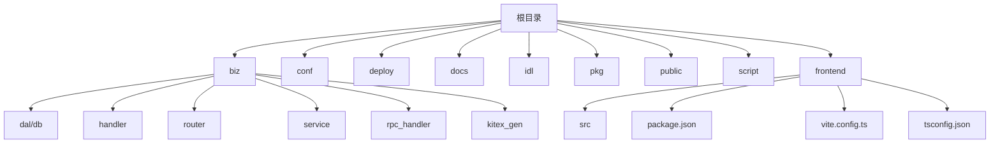
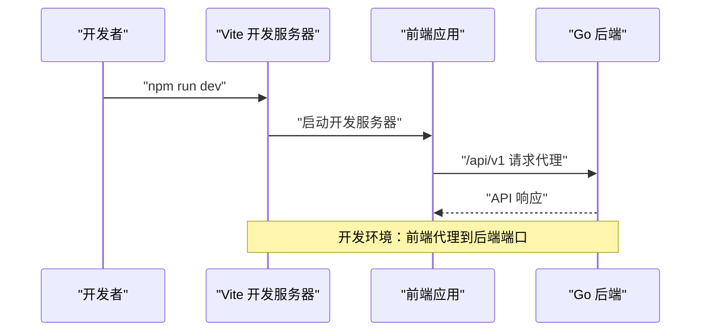
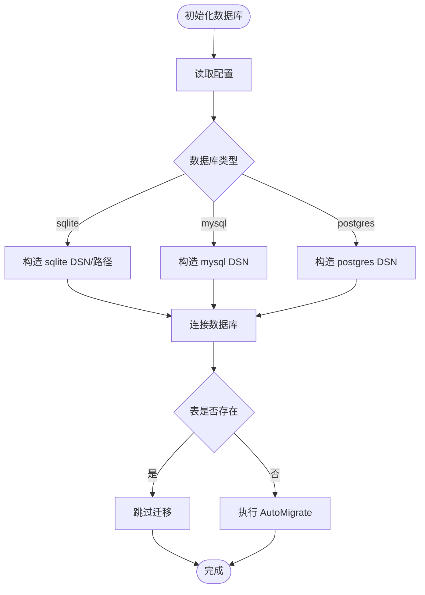
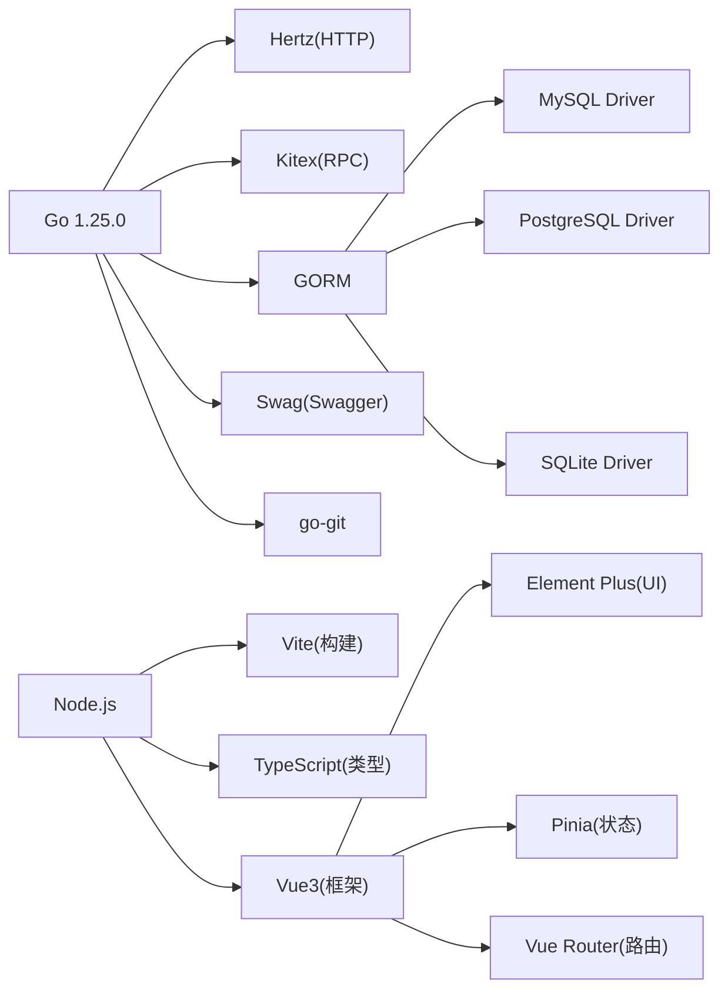

# 开发环境搭建

<cite>
**本文引用的文件**
- [go.mod](file://go.mod)
- [Makefile](file://Makefile)
- [script/bootstrap.sh](file://script/bootstrap.sh)
- [script/gen.sh](file://script/gen.sh)
- [conf/config.yaml](file://conf/config.yaml)
- [deploy/.env.example](file://deploy/.env.example)
- [main.go](file://main.go)
- [pkg/configs/config.go](file://pkg/configs/config.go)
- [pkg/configs/model.go](file://pkg/configs/model.go)
- [Dockerfile](file://Dockerfile)
- [deploy/docker-compose/mysql/docker-compose.yml](file://deploy/docker-compose/mysql/docker-compose.yml)
- [deploy/k8s/deployment.yaml](file://deploy/k8s/deployment.yaml)
- [idl/git.proto](file://idl/git.proto)
- [biz/dal/db/init.go](file://biz/dal/db/init.go)
- [biz/dal/db/repo_dao.go](file://biz/dal/db/repo_dao.go)
- [build.sh](file://build.sh)
- [control.sh](file://control.sh)
- [README.md](file://README.md)
- [frontend/package.json](file://frontend/package.json)
- [frontend/vite.config.ts](file://frontend/vite.config.ts)
- [frontend/tsconfig.json](file://frontend/tsconfig.json)
- [frontend/tsconfig.app.json](file://frontend/tsconfig.app.json)
- [frontend/tsconfig.node.json](file://frontend/tsconfig.node.json)
- [frontend/env.d.ts](file://frontend/env.d.ts)
- [frontend/src/main.ts](file://frontend/src/main.ts)
- [frontend/src/router/index.ts](file://frontend/src/router/index.ts)
- [frontend/src/api/request.ts](file://frontend/src/api/request.ts)
- [frontend/nginx.conf](file://frontend/nginx.conf)
</cite>

## 目录
1. [简介](#简介)
2. [项目结构](#项目结构)
3. [核心组件](#核心组件)
4. [架构总览](#架构总览)
5. [详细组件分析](#详细组件分析)
6. [依赖分析](#依赖分析)
7. [性能考虑](#性能考虑)
8. [故障排除指南](#故障排除指南)
9. [结论](#结论)
10. [附录](#附录)

## 简介
本指南面向首次参与开发的工程师，提供从零搭建开发环境的完整步骤，涵盖以下内容：
- Go 语言版本与环境准备
- CloudWeGo 生态（Kitex、Hertz）与 IDL 工具链安装
- 数据库驱动与多数据库支持（SQLite、MySQL、PostgreSQL）
- 前端技术栈：Node.js + npm + Vite + TypeScript + Vue3 + Element Plus 的环境配置与开发流程
- 环境变量与配置文件详解
- Makefile 构建目标与使用方法
- 自动化脚本（bootstrap.sh、gen.sh）功能说明
- 不同操作系统下的差异与注意事项
- 常见问题排查与解决方案

## 项目结构
该项目采用模块化分层组织，核心目录职责如下：
- biz：业务层（Service、Handler、Model、DAL、RPC 处理器、中间件、路由等）
- conf：应用配置文件
- deploy：部署相关（docker-compose、Kubernetes、示例环境变量）
- docs：文档与 Swagger
- idl：Protocol Buffers 定义（RPC 与 HTTP 业务接口）
- pkg：通用包（配置加载、错误码、响应封装）
- public：前端静态资源
- script：自动化脚本（生成代码、启动、提交钩子）
- frontend：Vue3 前端应用（Vite + TypeScript + Element Plus）

**图表来源**
- [main.go](file://main.go#L1-L176)
- [Makefile](file://Makefile#L1-L86)
- [frontend/src/main.ts](file://frontend/src/main.ts#L1-L16)

**章节来源**
- [README.md](file://README.md#L31-L40)

## 核心组件
- 应用入口与启动模式：支持 HTTP、RPC、全量三种模式，通过命令行参数选择。
- 配置系统：优先加载 conf/config.yaml，支持环境变量覆盖。
- 数据库层：统一通过 GORM 初始化，支持 SQLite、MySQL、PostgreSQL。
- 代码生成：Kitex（RPC）、Hz（HTTP）一体化生成脚本。
- 前端应用：基于 Vue3 + TypeScript + Vite + Element Plus 的现代化前端栈。
- 部署方式：Docker 镜像、docker-compose、Kubernetes。

**章节来源**
- [main.go](file://main.go#L42-L176)
- [pkg/configs/config.go](file://pkg/configs/config.go#L18-L42)
- [pkg/configs/model.go](file://pkg/configs/model.go#L3-L34)
- [biz/dal/db/init.go](file://biz/dal/db/init.go#L18-L71)
- [script/gen.sh](file://script/gen.sh#L1-L133)
- [frontend/src/main.ts](file://frontend/src/main.ts#L1-L16)

## 架构总览
应用在启动时根据模式分别启动 HTTP 服务器与 RPC 服务器，并完成配置、数据库、加密与业务服务的初始化。前端通过 Vite 开发服务器提供热重载开发体验，构建后由 Nginx 提供静态资源服务并与后端 API 代理集成。

**图表来源**
- [frontend/vite.config.ts](file://frontend/vite.config.ts#L12-L20)
- [frontend/src/api/request.ts](file://frontend/src/api/request.ts#L6-L12)

## 详细组件分析

### Go 版本与环境准备
- Go 版本要求：项目声明使用 Go 1.25.0。
- 建议使用版本管理工具（如 sdkenv、goenv）以避免系统 Go 版本冲突。
- 网络代理：国内建议配置 GOPROXY 以加速依赖下载。

**章节来源**
- [go.mod](file://go.mod#L3-L3)

### CloudWeGo 生态与 IDL 工具链
- 依赖组件：
  - Hertz：HTTP 服务器
  - Kitex：RPC 框架
  - Hz：基于 Hertz 的 HTTP 代码生成工具
  - protoc：Protocol Buffers 编译器
- 安装方式（按需安装）：
  - protoc：系统包管理器或官方发布页
  - kitex：go install github.com/cloudwego/kitex/tool/cmd/kitex@latest
  - hz：go install github.com/cloudwego/hertz/cmd/hz@latest
- 代码生成脚本会自动检测并调用上述工具，缺失时会提示安装。

**章节来源**
- [go.mod](file://go.mod#L5-L21)
- [script/gen.sh](file://script/gen.sh#L34-L66)

### 数据库驱动与多数据库支持
- 支持类型：sqlite、mysql、postgres
- 配置项：
  - sqlite：使用本地路径
  - mysql/postgres：支持 DSN 或主机、端口、用户、密码、库名等字段
- 初始化流程：根据配置选择方言，建立连接并进行迁移；若表存在则跳过迁移。

**图表来源**
- [biz/dal/db/init.go](file://biz/dal/db/init.go#L18-L71)
- [pkg/configs/model.go](file://pkg/configs/model.go#L18-L27)

**章节来源**
- [biz/dal/db/init.go](file://biz/dal/db/init.go#L18-L71)
- [pkg/configs/model.go](file://pkg/configs/model.go#L18-L27)

### 前端技术栈与开发环境配置

#### Node.js 与包管理
- Node.js 版本：推荐使用 LTS 版本（如 18.x 或 20.x）
- 包管理器：使用 npm（Node.js 内置）
- 依赖安装：在 frontend 目录执行 `npm install`

#### Vite 配置与开发服务器
- 开发端口：默认 3000（可在 vite.config.ts 中修改）
- 代理配置：将 /api/v1 代理到后端服务（默认 http://localhost:38080）
- 路径别名：@ 指向 src 目录
- 构建优化：自动分割 element-plus 和第三方依赖

#### TypeScript 配置
- tsconfig.json：包含 app 和 node 两个配置文件
- tsconfig.app.json：Vue DOM 环境配置，启用严格模式
- tsconfig.node.json：Node 环境配置，支持 ESNext 模块解析

#### Vue3 与 Element Plus
- Vue3：响应式组件系统
- Element Plus：UI 组件库，提供丰富的业务组件
- Pinia：状态管理
- Vue Router：路由管理

#### 开发脚本
- npm run dev：启动开发服务器
- npm run build：TypeScript 类型检查 + Vite 构建
- npm run preview：预览构建结果

**章节来源**
- [frontend/package.json](file://frontend/package.json#L1-L29)
- [frontend/vite.config.ts](file://frontend/vite.config.ts#L1-L33)
- [frontend/tsconfig.json](file://frontend/tsconfig.json#L1-L8)
- [frontend/tsconfig.app.json](file://frontend/tsconfig.app.json#L1-L20)
- [frontend/tsconfig.node.json](file://frontend/tsconfig.node.json#L1-L27)
- [frontend/src/main.ts](file://frontend/src/main.ts#L1-L16)

### 环境变量与配置文件
- 应用配置文件：conf/config.yaml
  - server.port：HTTP 服务端口
  - rpc.port：RPC 服务端口
  - database.type：数据库类型（sqlite/mysql/postgres）
  - database.path：sqlite 路径
  - database.dsn：mysql/postgres DSN（可选）
  - database.host/port/user/password/dbname：mysql/postgres 连接参数
  - webhook.secret/rate_limit/ip_whitelist：Webhook 安全与限流
- 环境变量覆盖：
  - WEBHOOK_SECRET：覆盖 webhook.secret
  - DB_PATH：覆盖 sqlite 路径
- Docker 环境变量示例：deploy/.env.example 提供了常用键值对模板。
- 前端代理配置：nginx.conf 中配置了 API 代理到后端服务

**章节来源**
- [conf/config.yaml](file://conf/config.yaml#L1-L25)
- [pkg/configs/config.go](file://pkg/configs/config.go#L18-L42)
- [deploy/.env.example](file://deploy/.env.example#L1-L21)
- [frontend/nginx.conf](file://frontend/nginx.conf#L24-L32)

### Makefile 构建目标与使用方法
- 构建类
  - build：编译主程序到 output/git-manage-service
  - build-http：仅编译 HTTP 版本
  - build-rpc：仅编译 RPC 版本
- 运行类
  - run：以 all 模式运行（HTTP+RPC）
  - run-http：仅 HTTP
  - run-rpc：仅 RPC
- 代码生成
  - gen：执行脚本 gen.sh（Kitex+Hz 生成）
  - kitex-gen：针对 git.proto 的 Kitex 代码生成
  - hz-gen：遍历 idl/biz 下的 proto 并生成 Hz 代码
- 质量与测试
  - test：执行单元测试
  - lint：调用 golangci-lint（如未安装则跳过）
  - fmt：格式化代码
- 前端构建
  - frontend-build：构建前端应用到 dist 目录
  - frontend-dev：启动前端开发服务器
- 其他
  - clean：清理输出目录
  - help：打印帮助

**章节来源**
- [Makefile](file://Makefile#L1-L86)

### 自动化脚本
- bootstrap.sh
  - 设置运行根目录与日志目录
  - 创建日志目录
  - 启动二进制文件
- gen.sh
  - 检查工具：protoc、kitex、hz
  - 生成 Kitex RPC 代码（基于 idl/git.proto）
  - 生成 Hz HTTP 代码（如存在 biz proto，先初始化再批量更新）
  - go mod tidy 与 go fmt
  - 输出下一步操作指引

**章节来源**
- [script/bootstrap.sh](file://script/bootstrap.sh#L1-L14)
- [script/gen.sh](file://script/gen.sh#L1-L133)

### 启动流程与路由
- main.go 中根据 --mode 决定启动 HTTP、RPC 或两者
- HTTP 服务器地址由配置决定
- RPC 服务器地址由配置决定
- 初始化顺序：配置 → 数据库 → 加密工具 → 业务服务（定时任务、统计、审计）
- 前端路由：基于 Vue Router 的单页应用路由系统

**章节来源**
- [main.go](file://main.go#L52-L176)
- [frontend/src/router/index.ts](file://frontend/src/router/index.ts#L1-L79)

### 部署与运行差异
- Docker 镜像
  - 使用 Alpine 作为基础镜像，预装 git、openssh-client、ca-certificates、tzdata
  - 暴露 8080（HTTP）、8888（RPC）
  - 默认环境变量：GIN_MODE、PORT、DB_PATH
  - 前端静态文件：通过 Nginx 提供服务
- docker-compose（MySQL）
  - 将应用容器与 MySQL 容器置于同一网络
  - 通过环境变量传递数据库与 Webhook 配置
  - 映射仓库目录与 SSH 密钥
  - 映射前端静态目录
- Kubernetes
  - 通过 Secret 注入数据库密码与 Webhook 密钥
  - 通过 ConfigMap 注入配置文件
  - 通过 PVC 挂载数据与仓库目录
  - Nginx 服务暴露前端静态资源

**章节来源**
- [Dockerfile](file://Dockerfile#L1-L77)
- [deploy/docker-compose/mysql/docker-compose.yml](file://deploy/docker-compose/mysql/docker-compose.yml#L1-L50)
- [deploy/k8s/deployment.yaml](file://deploy/k8s/deployment.yaml#L1-L83)
- [frontend/nginx.conf](file://frontend/nginx.conf#L1-L46)

## 依赖分析
- 语言与框架
  - Go 1.25.0
  - CloudWeGo Hertz（HTTP）、Kitex（RPC）
  - Swag（Swagger 文档）
  - go-git（Git 操作）
  - gorm + gorm.io/drivers（MySQL/PostgreSQL/SQLite）
- 前端技术栈
  - Node.js + npm
  - Vite（现代构建工具）
  - TypeScript（类型安全）
  - Vue3（响应式框架）
  - Element Plus（UI 组件库）
  - Pinia（状态管理）
  - Vue Router（路由管理）
- 工具链
  - protoc、kitex、hz
  - golangci-lint（可选）

**图表来源**
- [go.mod](file://go.mod#L5-L21)
- [frontend/package.json](file://frontend/package.json#L11-L27)

**章节来源**
- [go.mod](file://go.mod#L5-L21)
- [frontend/package.json](file://frontend/package.json#L1-L29)

## 性能考虑
- 选择合适的数据库后端：生产建议使用 MySQL/PostgreSQL；开发可使用 SQLite。
- 合理设置 Webhook 限流与白名单，降低无效请求带来的压力。
- 前端构建优化：Vite 的自动代码分割减少首屏加载时间。
- 使用 Docker/K8s 进行资源隔离与弹性伸缩。
- 在 CI/CD 中缓存 Go 模块，缩短构建时间。

## 故障排除指南
- 无法找到 protoc/kitex/hz
  - 症状：gen.sh 报错或跳过生成
  - 处理：安装对应工具并确保在 PATH 中
- 数据库连接失败
  - 症状：启动时报"failed to connect database"
  - 处理：核对 conf/config.yaml 与环境变量；确认 DSN 或主机/端口/凭据正确
- 表不存在或迁移失败
  - 症状：启动时报"failed to migrate database"
  - 处理：确认数据库权限与可用性；删除旧数据或修正 DSN
- 端口占用
  - 症状：HTTP/RPC 或前端开发服务器无法绑定端口
  - 处理：修改 conf/config.yaml 中的 server.rpc.port 或前端 vite.config.ts 中的 port
- 前端代理问题
  - 症状：前端无法访问后端 API
  - 处理：检查 vite.config.ts 中的代理配置与后端服务端口一致性
- TypeScript 编译错误
  - 症状：npm run build 失败
  - 处理：检查 tsconfig.json 配置和代码中的类型错误
- 权限问题（SSH/Git）
  - 症状：拉取/推送失败
  - 处理：确保 ~/.ssh 权限正确且包含公钥；容器内挂载只读 SSH 密钥
- Docker/K8s 环境变量未生效
  - 症状：配置未按预期
  - 处理：核对 .env 示例与 Secret/ConfigMap 注入键名一致

**章节来源**
- [script/gen.sh](file://script/gen.sh#L34-L66)
- [biz/dal/db/init.go](file://biz/dal/db/init.go#L49-L52)
- [conf/config.yaml](file://conf/config.yaml#L1-L25)
- [frontend/vite.config.ts](file://frontend/vite.config.ts#L12-L20)
- [frontend/tsconfig.json](file://frontend/tsconfig.json#L1-L8)
- [deploy/.env.example](file://deploy/.env.example#L1-L21)

## 结论
本指南提供了从 Go 环境、CloudWeGo 工具链、数据库配置到前端技术栈的全流程说明。建议开发者先完成工具链与数据库准备，再通过 Makefile 与脚本快速生成与运行服务，并结合 Docker/K8s 实现本地与生产的稳定交付。前端采用现代化技术栈，提供良好的开发体验和性能表现。

## 附录

### 环境变量清单
- 应用与服务
  - APP_PORT：HTTP 端口（部署示例）
  - WEBHOOK_SECRET：Webhook 密钥
  - TZ：时区
- 数据库
  - DB_TYPE：数据库类型（sqlite/mysql/postgres）
  - DB_PATH：SQLite 路径
  - DB_HOST/DB_PORT/DB_NAME/DB_USER/DB_PASSWORD：MySQL/PostgreSQL 连接参数
  - MYSQL_ROOT_PASSWORD：MySQL Root 密码（示例）
- 前端开发
  - VITE_API_BASE_URL：API 基础 URL（可选）
  - VITE_DEV_PORT：开发服务器端口（可选）
- 运行时
  - GIN_MODE：运行模式（release/debug）
  - PORT：默认暴露端口（容器）

**章节来源**
- [deploy/.env.example](file://deploy/.env.example#L1-L21)
- [Dockerfile](file://Dockerfile#L63-L69)
- [frontend/vite.config.ts](file://frontend/vite.config.ts#L12-L19)

### 关键文件与职责映射
- main.go：应用入口、模式解析、服务器启动与优雅关闭
- pkg/configs/config.go + model.go：配置加载与模型定义
- biz/dal/db/init.go：数据库初始化与迁移
- script/gen.sh：代码生成（Kitex+Hz）
- Makefile：构建、运行、测试、格式化、清理
- frontend/package.json：前端依赖与脚本配置
- frontend/vite.config.ts：Vite 构建与开发服务器配置
- frontend/tsconfig.json：TypeScript 项目配置入口
- frontend/src/main.ts：前端应用入口与依赖注入
- frontend/src/api/request.ts：API 请求封装与拦截器
- Dockerfile + docker-compose + k8s：容器化与编排
- frontend/nginx.conf：Nginx 配置与 API 代理

**章节来源**
- [main.go](file://main.go#L52-L176)
- [pkg/configs/config.go](file://pkg/configs/config.go#L18-L42)
- [pkg/configs/model.go](file://pkg/configs/model.go#L3-L34)
- [biz/dal/db/init.go](file://biz/dal/db/init.go#L18-L71)
- [script/gen.sh](file://script/gen.sh#L1-L133)
- [Makefile](file://Makefile#L1-L86)
- [frontend/package.json](file://frontend/package.json#L1-L29)
- [frontend/vite.config.ts](file://frontend/vite.config.ts#L1-L33)
- [frontend/tsconfig.json](file://frontend/tsconfig.json#L1-L8)
- [frontend/src/main.ts](file://frontend/src/main.ts#L1-L16)
- [frontend/src/api/request.ts](file://frontend/src/api/request.ts#L1-L45)
- [Dockerfile](file://Dockerfile#L1-L77)
- [deploy/docker-compose/mysql/docker-compose.yml](file://deploy/docker-compose/mysql/docker-compose.yml#L1-L50)
- [deploy/k8s/deployment.yaml](file://deploy/k8s/deployment.yaml#L1-L83)
- [frontend/nginx.conf](file://frontend/nginx.conf#L1-L46)