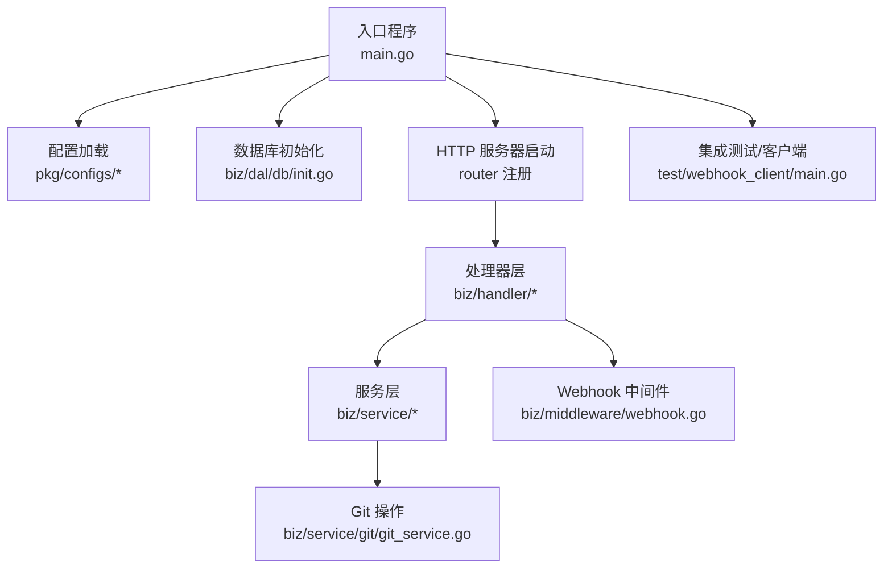
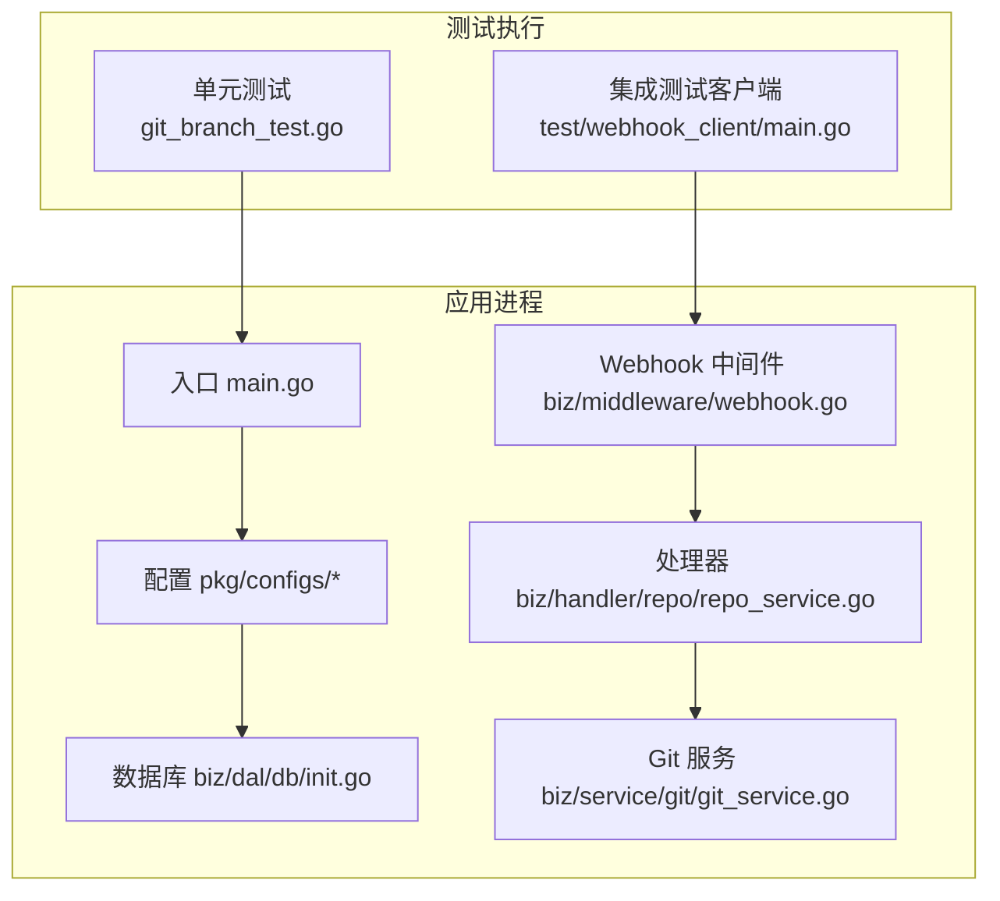
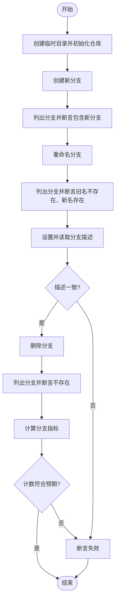
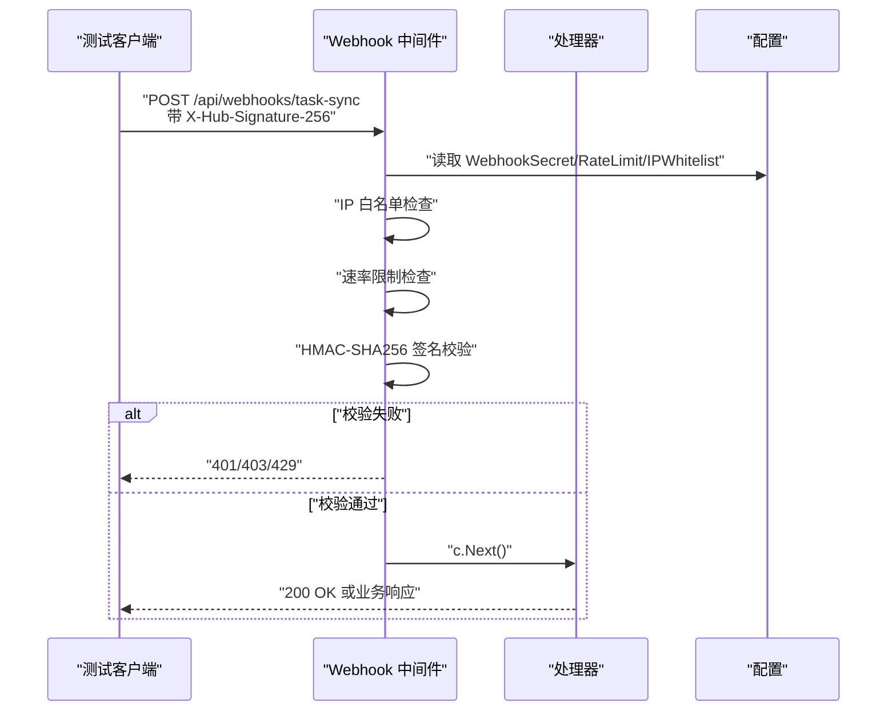
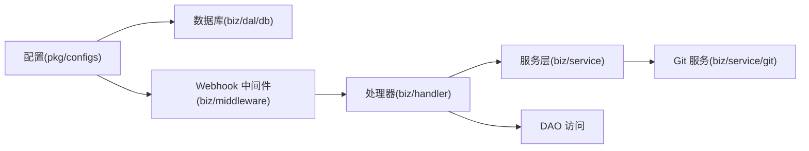

# 测试策略

<cite>
**本文引用的文件**
- [main.go](file://main.go)
- [Makefile](file://Makefile)
- [pkg/configs/config.go](file://pkg/configs/config.go)
- [pkg/configs/loader.go](file://pkg/configs/loader.go)
- [biz/dal/db/init.go](file://biz/dal/db/init.go)
- [biz/middleware/webhook.go](file://biz/middleware/webhook.go)
- [biz/handler/repo/repo_service.go](file://biz/handler/repo/repo_service.go)
- [biz/service/git/git_service.go](file://biz/service/git/git_service.go)
- [biz/service/git/git_branch_test.go](file://biz/service/git/git_branch_test.go)
- [test/webhook_client/main.go](file://test/webhook_client/main.go)
- [deploy/docker-compose/mysql/docker-compose.yml](file://deploy/docker-compose/mysql/docker-compose.yml)
- [go.mod](file://go.mod)
</cite>

## 目录
1. [引言](#引言)
2. [项目结构](#项目结构)
3. [核心组件](#核心组件)
4. [架构总览](#架构总览)
5. [详细组件分析](#详细组件分析)
6. [依赖分析](#依赖分析)
7. [性能考虑](#性能考虑)
8. [故障排查指南](#故障排查指南)
9. [结论](#结论)
10. [附录](#附录)

## 引言
本测试策略文档面向该 Git 多仓库管理服务，系统性阐述单元测试与集成测试的编写方法、最佳实践与执行流程；覆盖 Git 操作测试、业务逻辑测试、API 接口测试与 Webhook 测试；明确测试用例设计原则与覆盖范围要求；给出测试环境搭建与配置（含测试数据库）、测试数据准备与清理机制；提供性能与压力测试方法；并制定测试覆盖率要求与提升策略，最后给出测试工具与框架使用指南。

## 项目结构
该项目采用分层+领域驱动的组织方式：入口程序负责初始化配置、数据库与服务；中间件提供 Webhook 安全校验；处理器封装 API 行为；服务层封装 Git 操作与统计等业务能力；DAO 层通过 GORM 访问数据库；配置通过 Viper 加载；测试位于各模块目录与独立客户端示例中。

图表来源
- [main.go](file://main.go#L115-L134)
- [pkg/configs/config.go](file://pkg/configs/config.go#L18-L42)
- [biz/dal/db/init.go](file://biz/dal/db/init.go#L18-L71)
- [biz/middleware/webhook.go](file://biz/middleware/webhook.go#L18-L68)
- [biz/service/git/git_service.go](file://biz/service/git/git_service.go#L27-L31)

章节来源
- [main.go](file://main.go#L115-L134)
- [Makefile](file://Makefile#L52-L53)

## 核心组件
- 配置与环境
  - 通过 Viper 加载配置文件与环境变量，支持默认值与覆盖；Webhook 密钥、限流、IP 白名单等均来自配置。
- 数据库
  - 支持 MySQL、PostgreSQL、SQLite 三类后端，按类型自动选择 Dialector 并迁移表结构。
- Webhook 安全中间件
  - 提供可选 IP 白名单、速率限制、签名验证（HMAC-SHA256）。
- Git 服务
  - 封装克隆、拉取、推送、分支、远程、提交日志、文件列表、Blame 等常用操作，并兼容 SSH/HTTP 认证与进度回调。
- 处理器
  - 提供仓库增删改查、扫描、克隆、抓取等 API；内部调用 Git 服务与 DAO。

章节来源
- [pkg/configs/config.go](file://pkg/configs/config.go#L18-L42)
- [pkg/configs/loader.go](file://pkg/configs/loader.go#L9-L45)
- [biz/dal/db/init.go](file://biz/dal/db/init.go#L18-L71)
- [biz/middleware/webhook.go](file://biz/middleware/webhook.go#L18-L68)
- [biz/service/git/git_service.go](file://biz/service/git/git_service.go#L27-L31)
- [biz/handler/repo/repo_service.go](file://biz/handler/repo/repo_service.go#L21-L371)

## 架构总览
下图展示测试视角下的关键交互：测试驱动入口程序启动 HTTP 服务，Webhook 中间件拦截外部请求，处理器执行业务逻辑，服务层调用 Git 库与 DAO 访问数据库。

图表来源
- [main.go](file://main.go#L115-L134)
- [pkg/configs/config.go](file://pkg/configs/config.go#L18-L42)
- [biz/dal/db/init.go](file://biz/dal/db/init.go#L18-L71)
- [biz/middleware/webhook.go](file://biz/middleware/webhook.go#L18-L68)
- [biz/handler/repo/repo_service.go](file://biz/handler/repo/repo_service.go#L21-L371)
- [biz/service/git/git_service.go](file://biz/service/git/git_service.go#L27-L31)

## 详细组件分析

### 单元测试：Git 分支 CRUD 与指标
- 测试目标
  - 验证分支创建、重命名、描述设置/读取、删除的正确性。
  - 验证分支指标（如提交数）计算是否符合预期。
- 测试方法
  - 使用临时目录初始化 Git 仓库，写入初始提交以确保存在默认分支。
  - 通过 GitService 的分支操作方法进行增删改查，并断言结果。
  - 通过指标函数获取分支统计并与期望值比对。
- 关键断言点
  - 列表中包含/不包含特定分支名称。
  - 描述字符串精确匹配。
  - 指标字典中的计数值等于预期。
- 最佳实践
  - 使用临时目录隔离测试，结束后清理。
  - 对边界场景（空仓库、不存在分支、非法描述）补充断言。
  - 将 Git 初始化步骤抽象为辅助函数，减少重复。

图表来源
- [biz/service/git/git_branch_test.go](file://biz/service/git/git_branch_test.go#L15-L126)
- [biz/service/git/git_service.go](file://biz/service/git/git_service.go#L27-L31)

章节来源
- [biz/service/git/git_branch_test.go](file://biz/service/git/git_branch_test.go#L15-L175)

### 单元测试：Git 服务方法（示例）
- 测试目标
  - 验证 GitService 的典型方法在不同认证方式与错误场景下的行为。
- 测试要点
  - 认证：HTTP Basic、SSH 私钥、SSH Agent、未认证。
  - 操作：克隆、拉取、推送、获取远程、获取分支、获取文件列表、获取日志、状态、提交、重置等。
  - 错误：无效路径、无权限、网络异常、命令失败。
- 最佳实践
  - 使用最小化输入与可控环境（如只读仓库快照）。
  - 对外部命令与网络调用进行隔离或模拟。
  - 对进度通道进行断言，确保异步事件被正确上报。

章节来源
- [biz/service/git/git_service.go](file://biz/service/git/git_service.go#L133-L800)

### 集成测试：Webhook 授权与速率限制
- 测试目标
  - 验证 Webhook 中间件的 IP 白名单、速率限制、签名验证链路。
- 执行流程
  - 启动 HTTP 服务（main.go 启动路由注册）。
  - 使用测试客户端构造带 HMAC-SHA256 签名的请求体，发送至 Webhook 路由。
  - 中间件依次执行 IP 白名单检查、速率限制、签名验证，通过后进入下游处理器。
- 关键断言点
  - 正常请求返回成功状态码。
  - 缺失签名/格式错误/签名不匹配时返回 401。
  - 超出速率限制返回 429。
  - IP 不在白名单返回 403。

图表来源
- [test/webhook_client/main.go](file://test/webhook_client/main.go#L13-L35)
- [biz/middleware/webhook.go](file://biz/middleware/webhook.go#L18-L68)
- [pkg/configs/config.go](file://pkg/configs/config.go#L18-L42)

章节来源
- [test/webhook_client/main.go](file://test/webhook_client/main.go#L13-L35)
- [biz/middleware/webhook.go](file://biz/middleware/webhook.go#L18-L68)

### 集成测试：API 接口（以仓库为例）
- 测试目标
  - 验证仓库相关 API 的请求绑定、参数校验、业务逻辑与响应格式。
- 典型场景
  - 列表查询、详情查询、创建（含路径合法性校验、远程同步）、更新（含路径变更校验）、删除（关联约束检查）、扫描、克隆（异步任务与进度上报）、抓取。
- 最佳实践
  - 使用内存数据库或独立测试库，避免污染生产数据。
  - 对异步任务（克隆）通过轮询任务状态接口验证最终一致性。
  - 对错误场景（缺失参数、路径非法、冲突、并发）进行充分覆盖。

章节来源
- [biz/handler/repo/repo_service.go](file://biz/handler/repo/repo_service.go#L21-L371)

### 测试用例设计原则与覆盖范围
- 原则
  - 独立性：每个用例自包含，不依赖其他用例执行顺序。
  - 可重复性：相同输入在相同环境下产生相同输出。
  - 可维护性：用例命名清晰，断言明确，便于定位问题。
  - 完整性：覆盖正常路径、边界条件、异常路径。
- 覆盖范围
  - 单元测试：Git 服务方法、业务服务、DAO 方法。
  - 集成测试：Webhook 授权链路、API 端到端流程。
  - 性能测试：高并发请求、长耗时操作（克隆/推送）。
  - 回归测试：关键修复回归验证。

## 依赖分析
- 配置与数据库
  - 配置加载影响 Webhook 安全参数与数据库类型；数据库初始化决定 ORM 表结构与迁移策略。
- Webhook 中间件
  - 依赖配置中的密钥、限流与 IP 白名单；上游处理器需在路由上挂载该中间件。
- Git 服务
  - 依赖 go-git 与系统 git 命令；对外提供统一 API，便于测试隔离。
- 处理器
  - 依赖 DAO 与审计、统计服务；对输入进行绑定与校验，调用服务层完成业务。

图表来源
- [pkg/configs/config.go](file://pkg/configs/config.go#L18-L42)
- [biz/dal/db/init.go](file://biz/dal/db/init.go#L18-L71)
- [biz/middleware/webhook.go](file://biz/middleware/webhook.go#L18-L68)
- [biz/handler/repo/repo_service.go](file://biz/handler/repo/repo_service.go#L21-L371)
- [biz/service/git/git_service.go](file://biz/service/git/git_service.go#L27-L31)

章节来源
- [pkg/configs/loader.go](file://pkg/configs/loader.go#L9-L45)
- [go.mod](file://go.mod#L5-L21)

## 性能考虑
- 单元测试
  - 使用内存存储或小规模本地仓库，避免真实磁盘 IO。
  - 对外部命令与网络调用进行 mock，缩短测试时长。
- 集成测试
  - 控制并发度与速率限制，避免触发 429。
  - 使用独立测试数据库实例，避免与其他负载互相干扰。
- 性能基准
  - 针对克隆、推送、日志统计等耗时操作建立基准测试，记录 P50/P95 延迟。
- 压力测试
  - 使用压测工具对 Webhook 与 API 路由施加高并发请求，观察错误率、延迟分布与资源占用。

## 故障排查指南
- Webhook 401/403/429
  - 检查签名算法与密钥是否与配置一致；确认请求头格式为 sha256=...；核对 IP 是否在白名单；评估速率限制阈值。
- 数据库连接失败
  - 核对数据库类型、DSN/连接参数；确认容器网络与卷挂载；查看迁移日志。
- Git 操作失败
  - 检查认证方式（HTTP/SSH）与密钥可用性；确认 go-git 与系统 git 版本；查看命令输出与错误码。
- API 响应异常
  - 检查请求绑定与校验逻辑；核对 DAO 查询条件与事务一致性；关注异步任务状态。

章节来源
- [biz/middleware/webhook.go](file://biz/middleware/webhook.go#L18-L68)
- [biz/dal/db/init.go](file://biz/dal/db/init.go#L18-L71)
- [biz/service/git/git_service.go](file://biz/service/git/git_service.go#L33-L48)

## 结论
本测试策略围绕“单元测试打地基、集成测试保稳定、性能测试促优化”的思路构建。通过规范化的测试用例设计、完善的环境与数据管理、严格的覆盖率与回归流程，确保系统在多仓库、多分支场景下的可靠性与可维护性。

## 附录

### 测试环境搭建与配置
- 环境变量与配置
  - 通过环境变量覆盖配置项，如 Webhook 密钥、数据库类型与连接参数。
- Docker Compose（MySQL 示例）
  - 提供一键启动应用与数据库的服务编排，挂载仓库目录与 SSH 密钥，暴露端口便于测试访问。
- 测试数据库
  - 建议使用独立数据库实例或容器化数据库，避免与开发/生产环境冲突。

章节来源
- [pkg/configs/config.go](file://pkg/configs/config.go#L18-L42)
- [deploy/docker-compose/mysql/docker-compose.yml](file://deploy/docker-compose/mysql/docker-compose.yml#L11-L26)

### 测试数据准备与清理机制
- 准备
  - 单元测试：使用临时目录初始化最小化仓库；集成测试：准备只读快照或受控仓库。
  - 配置测试数据库，确保迁移完成且无残留数据。
- 清理
  - 单元测试：删除临时目录；集成测试：清空测试数据库或回滚事务。
  - Webhook 与 API 测试：清理任务状态与临时文件。

### 测试覆盖率要求与提升策略
- 覆盖率目标
  - 单元测试：核心业务方法与分支覆盖率达到较高水平；对错误路径与边界条件有专门用例。
  - 集成测试：关键链路（Webhook、API）100% 覆盖。
- 提升策略
  - 引入 mock 与 stub，隔离外部依赖。
  - 对热点路径增加基准测试与回归用例。
  - 使用覆盖率工具持续跟踪并补齐薄弱环节。

### 测试工具与框架使用指南
- 单元测试
  - 使用标准库 testing；对 Git 服务建议引入第三方库进行仓库模拟。
- 集成测试
  - 使用 HTTP 客户端发送请求；Webhook 客户端示例展示了签名构造与请求发送。
- 代码质量
  - Makefile 提供测试、格式化、静态检查等目标；可结合 CI 流水线执行。

章节来源
- [Makefile](file://Makefile#L52-L63)
- [test/webhook_client/main.go](file://test/webhook_client/main.go#L13-L35)
- [go.mod](file://go.mod#L89-L89)