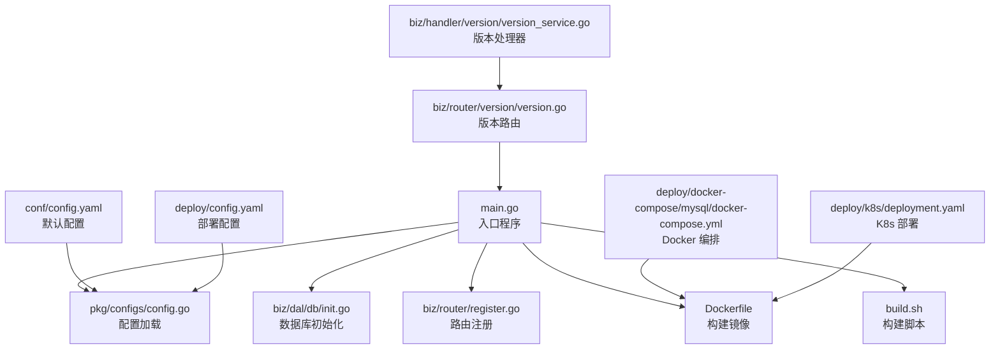
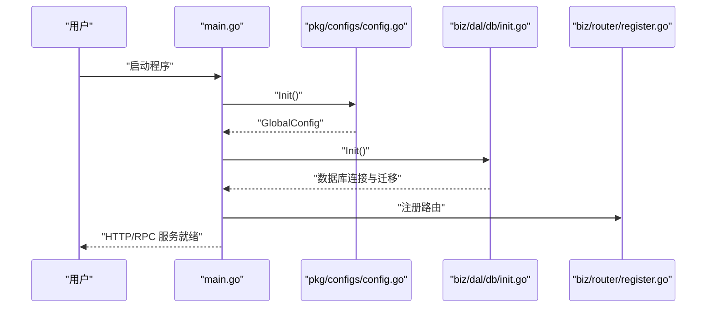
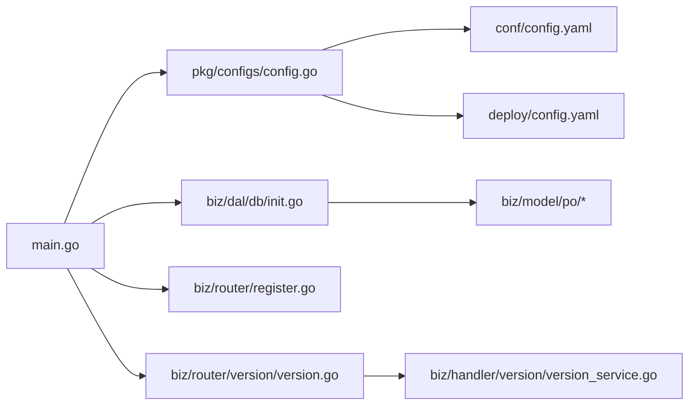

# 快速开始

<cite>
**本文引用的文件**
- [README.md](file://README.md)
- [main.go](file://main.go)
- [go.mod](file://go.mod)
- [Makefile](file://Makefile)
- [Dockerfile](file://Dockerfile)
- [build.sh](file://build.sh)
- [conf/config.yaml](file://conf/config.yaml)
- [pkg/configs/config.go](file://pkg/configs/config.go)
- [biz/dal/db/init.go](file://biz/dal/db/init.go)
- [deploy/README.md](file://deploy/README.md)
- [deploy/config.yaml](file://deploy/config.yaml)
- [deploy/CONFIG_GUIDE.md](file://deploy/CONFIG_GUIDE.md)
- [deploy/docker-compose/mysql/docker-compose.yml](file://deploy/docker-compose/mysql/docker-compose.yml)
- [deploy/k8s/deployment.yaml](file://deploy/k8s/deployment.yaml)
- [deploy/k8s/configmap.yaml](file://deploy/k8s/configmap.yaml)
- [deploy/k8s/secret.yaml](file://deploy/k8s/secret.yaml)
- [script/bootstrap.sh](file://script/bootstrap.sh)
- [biz/router/version/version.go](file://biz/router/version/version.go)
- [biz/handler/version/version_service.go](file://biz/handler/version/version_service.go)
</cite>

## 更新摘要
**所做更改**
- 新增 GitHub Actions 自动化 CI/CD 系统章节
- 新增动态版本信息注入功能说明
- 新增多平台构建支持章节
- 更新预编译二进制文件下载指南
- 新增版本查询接口使用说明
- 更新构建和部署相关章节

## 目录
1. [简介](#简介)
2. [项目结构](#项目结构)
3. [核心组件](#核心组件)
4. [架构总览](#架构总览)
5. [详细组件分析](#详细组件分析)
6. [依赖关系分析](#依赖关系分析)
7. [性能注意事项](#性能注意事项)
8. [故障排除指南](#故障排除指南)
9. [结论](#结论)
10. [附录](#附录)

## 简介
本指南面向首次接触 Git 管理服务的新用户，帮助你在最短时间内完成环境准备、依赖安装、项目编译与运行，并成功访问 Web 界面。内容涵盖：
- Go 环境准备与依赖安装
- 本地编译与运行
- 预编译二进制文件下载与使用
- 版本信息查询功能
- 配置文件设置与数据库初始化
- Docker 本地部署与 Kubernetes 集群部署
- GitHub Actions 自动化 CI/CD 系统
- 多平台构建支持
- 常见问题与故障排除
- 一键启动脚本与开发环境建议

## 项目结构
该项目采用模块化分层组织，主要目录职责如下：
- biz：业务层（Service、Handler、Model、DAO、RPC、中间件）
- conf：应用默认配置
- deploy：部署相关（Docker Compose、Kubernetes、配置说明）
- docs：Swagger 文档与产品手册
- public：前端静态资源
- pkg：通用配置、错误码、响应封装
- script：启动脚本与生成脚本
- idl：协议定义（Proto）



**图表来源**
- [main.go](file://main.go#L58-L121)
- [pkg/configs/config.go](file://pkg/configs/config.go#L18-L42)
- [biz/dal/db/init.go](file://biz/dal/db/init.go#L18-L71)
- [conf/config.yaml](file://conf/config.yaml#L1-L25)
- [deploy/config.yaml](file://deploy/config.yaml#L1-L55)
- [Dockerfile](file://Dockerfile#L1-L77)
- [build.sh](file://build.sh#L1-L6)
- [biz/router/version/version.go](file://biz/router/version/version.go#L17-L32)
- [biz/handler/version/version_service.go](file://biz/handler/version/version_service.go#L14-L87)

**章节来源**
- [README.md](file://README.md#L71-L80)
- [main.go](file://main.go#L1-L184)
- [go.mod](file://go.mod#L1-L107)

## 核心组件
- 入口与启动流程：解析命令行参数，初始化配置、数据库、加密与业务服务，按模式启动 HTTP/RPC 服务。
- 配置系统：优先从 conf、deploy 等路径加载配置，支持环境变量覆盖敏感字段。
- 数据库初始化：根据配置选择 SQLite/MySQL/PostgreSQL，自动迁移表结构。
- 版本信息管理：支持动态版本查询、版本列表获取和下一版本计算。
- 部署方式：Docker Compose 与 Kubernetes 提供开箱即用的编排方案。
- CI/CD 系统：GitHub Actions 自动化多平台构建与发布。

**章节来源**
- [main.go](file://main.go#L58-L121)
- [pkg/configs/config.go](file://pkg/configs/config.go#L18-L42)
- [biz/dal/db/init.go](file://biz/dal/db/init.go#L18-L71)
- [biz/handler/version/version_service.go](file://biz/handler/version/version_service.go#L14-L87)
- [deploy/README.md](file://deploy/README.md#L23-L48)

## 架构总览
下图展示了启动阶段的关键交互：入口程序加载配置、初始化数据库、注册路由并启动 HTTP/RPC 服务。



**图表来源**
- [main.go](file://main.go#L124-L142)
- [pkg/configs/config.go](file://pkg/configs/config.go#L18-L42)
- [biz/dal/db/init.go](file://biz/dal/db/init.go#L18-L71)

## 详细组件分析

### 环境准备与依赖安装
- 安装 Go（版本要求参考模块文件）
- 使用包管理器安装构建依赖（CGO/SQLite 需要 gcc、musl-dev）
- 下载依赖并校验

命令示例（基于仓库内脚本与配置）：
- 安装依赖：参考构建镜像中的依赖安装步骤
- 校验依赖：go mod download
- 生成代码：make gen（包含 Kitex 与 Hz 代码生成）

预期输出：
- 无报错提示依赖下载成功
- 生成目录包含 biz/kitex_gen 与 biz/handler/hz、biz/router/hz 等

**章节来源**
- [go.mod](file://go.mod#L3-L21)
- [Dockerfile](file://Dockerfile#L13-L23)
- [Makefile](file://Makefile#L30-L49)

### 预编译二进制文件下载与使用
**更新** 新增预编译二进制文件下载选项，支持多平台一键使用

从 [Releases](https://github.com/yi-nology/git-manage-service/releases) 页面下载适合你系统的版本：

- **Linux (AMD64)**: `git-manage-service-linux-amd64.tar.gz`
- **Linux (ARM64)**: `git-manage-service-linux-arm64.tar.gz`
- **macOS (Intel)**: `git-manage-service-darwin-amd64.tar.gz`
- **macOS (Apple Silicon)**: `git-manage-service-darwin-arm64.tar.gz`
- **Windows (AMD64)**: `git-manage-service-windows-amd64.exe.zip`
- **Windows (ARM64)**: `git-manage-service-windows-arm64.exe.zip`

#### Linux / macOS
```bash
# 解压
tar -xzf git-manage-service-*.tar.gz

# 添加执行权限
chmod +x git-manage-service-*

# 运行
./git-manage-service-*
```

#### Windows
```powershell
# 解压 zip 文件
# 双击运行或在命令行中执行
.\git-manage-service-windows-amd64.exe
```

**章节来源**
- [README.md](file://README.md#L21-L49)

### 从源码编译
```bash
# 安装依赖
go mod tidy

# 编译
go build -o git-manage-service main.go

# 运行
./git-manage-service
```

**章节来源**
- [README.md](file://README.md#L51-L61)

### 版本信息查询功能
**新增** 支持动态版本信息查询功能

查看版本信息：
```bash
./git-manage-service --version
```

版本查询接口：
- 获取当前版本：`GET /api/v1/version/current?repo_key=your_repo_key`
- 列出所有版本：`GET /api/v1/version/list?repo_key=your_repo_key`
- 计算下一版本：`GET /api/v1/version/next?repo_key=your_repo_key`

**章节来源**
- [main.go](file://main.go#L42-L52)
- [biz/router/version/version.go](file://biz/router/version/version.go#L25-L29)
- [biz/handler/version/version_service.go](file://biz/handler/version/version_service.go#L14-L87)

### 项目编译与运行
- 本地编译：go build
- Makefile 快捷方式：make build、make run、make run-http、make run-rpc
- 直接运行：go run main.go --mode=all

预期输出：
- 成功启动 HTTP 服务（默认端口 8080）
- 成功启动 RPC 服务（默认端口 8888）
- 控制台打印"Server starting on :port"等日志

**章节来源**
- [README.md](file://README.md#L63-L64)
- [Makefile](file://Makefile#L7-L27)
- [main.go](file://main.go#L144-L183)

### GitHub Actions 自动化 CI/CD 系统
**新增** 项目使用 GitHub Actions 自动化构建多平台二进制文件

#### 创建新版本发布
1. **创建版本标签**
```bash
# 创建并推送标签
git tag -a v1.0.0 -m "Release version 1.0.0"
git push origin v1.0.0
```

2. **自动构建**
   - GitHub Actions 会自动检测到标签推送
   - 自动构建 6 个平台的二进制文件：
     - Linux (AMD64/ARM64)
     - macOS (Intel/Apple Silicon)
     - Windows (AMD64/ARM64)
   - 自动创建 GitHub Release 并上传构建产物

3. **手动触发**（可选）
   - 访问 GitHub Actions 页面
   - 选择 "Release Build" 工作流
   - 点击 "Run workflow" 按钮手动触发

**章节来源**
- [README.md](file://README.md#L84-L107)

### 多平台构建支持
**新增** 支持本地多平台构建多平台版本

```bash
# Linux AMD64
GOOS=linux GOARCH=amd64 go build -o git-manage-service-linux-amd64 main.go

# Linux ARM64
GOOS=linux GOARCH=arm64 go build -o git-manage-service-linux-arm64 main.go

# macOS AMD64
GOOS=darwin GOARCH=amd64 go build -o git-manage-service-darwin-amd64 main.go

# macOS ARM64
GOOS=darwin GOARCH=arm64 go build -o git-manage-service-darwin-arm64 main.go

# Windows AMD64
GOOS=windows GOARCH=amd64 go build -o git-manage-service-windows-amd64.exe main.go

# Windows ARM64
GOOS=windows GOARCH=arm64 go build -o git-manage-service-windows-arm64.exe main.go
```

**章节来源**
- [README.md](file://README.md#L108-L128)

### 配置文件设置
- 默认配置位置：conf/config.yaml
- 部署配置位置：deploy/config.yaml
- 支持的数据库类型：sqlite、mysql、postgres
- 关键配置项：server.port、database.type/path 或 host/port/user/password/dbname、webhook.secret/rate_limit/ip_whitelist、debug、rpc.port

配置加载顺序与覆盖：
- 程序启动时从多个路径加载配置
- 环境变量可覆盖敏感字段（如 WEBHOOK_SECRET、DB_PATH）

建议：
- 开发环境使用 sqlite；生产环境使用 mysql/postgres
- 敏感信息通过环境变量或 Secret 注入，避免明文写入配置文件

**章节来源**
- [conf/config.yaml](file://conf/config.yaml#L1-L25)
- [deploy/config.yaml](file://deploy/config.yaml#L1-L55)
- [pkg/configs/config.go](file://pkg/configs/config.go#L18-L42)
- [deploy/CONFIG_GUIDE.md](file://deploy/CONFIG_GUIDE.md#L1-L99)

### 数据库初始化
- 支持三种数据库类型，自动选择并建立连接
- 若检测到表已存在则跳过迁移，否则执行 AutoMigrate
- 迁移对象包含仓库、同步任务、运行记录、审计日志、系统配置、提交统计

操作步骤：
- 启动前确保数据库配置正确
- 首次运行会自动创建表结构
- 如需切换数据库类型，修改配置文件并重启

**章节来源**
- [biz/dal/db/init.go](file://biz/dal/db/init.go#L18-L71)

### 首次运行步骤
- 启动服务：make run 或 go run main.go --mode=all
- 访问 Web 界面：浏览器打开 http://localhost:8080
- 如需调整端口，修改配置文件中的 server.port

预期输出：
- 控制台显示"HTTP Server starting on :8080"
- 页面可正常访问，展示仓库与同步任务列表

**章节来源**
- [README.md](file://README.md#L63-L64)
- [main.go](file://main.go#L144-L159)

### Docker 部署选项
- 本地 Docker 部署（开发测试）
  - 准备配置：检查 deploy/config.yaml 与 .env
  - 启动服务：进入 deploy 目录执行 docker-compose up -d
  - 验证：访问 http://localhost:8080，查看日志
- 多数据库支持：提供 mysql、postgres、sqlite 的 docker-compose 示例

环境变量说明（.env）：
- APP_PORT、DB_TYPE、DB_PASSWORD、WEBHOOK_SECRET

**章节来源**
- [deploy/README.md](file://deploy/README.md#L23-L48)
- [deploy/docker-compose/mysql/docker-compose.yml](file://deploy/docker-compose/mysql/docker-compose.yml#L1-L50)
- [Dockerfile](file://Dockerfile#L63-L76)

### Kubernetes 集群部署
- 创建 ConfigMap 与 Secret
- 部署数据库（可选）与应用
- 注意事项：Pod CrashLoopBackOff、SSH 密钥挂载、配置文件生效

**章节来源**
- [deploy/README.md](file://deploy/README.md#L60-L98)
- [deploy/k8s/configmap.yaml](file://deploy/k8s/configmap.yaml#L1-L20)
- [deploy/k8s/secret.yaml](file://deploy/k8s/secret.yaml#L1-L11)
- [deploy/k8s/deployment.yaml](file://deploy/k8s/deployment.yaml#L1-L83)

### 一键启动脚本
- script/bootstrap.sh：设置运行根目录、日志目录，启动二进制
- 建议在容器或生产环境使用，便于统一日志与工作目录管理

**章节来源**
- [script/bootstrap.sh](file://script/bootstrap.sh#L1-L14)

## 依赖关系分析
- 入口程序依赖配置、数据库、路由与业务服务
- 配置系统支持多路径加载与环境变量覆盖
- 数据库初始化根据配置动态选择驱动并迁移表结构
- 版本查询功能通过 Git 服务获取动态版本信息
- 部署层提供 Docker 与 Kubernetes 的编排模板



**图表来源**
- [main.go](file://main.go#L124-L142)
- [pkg/configs/config.go](file://pkg/configs/config.go#L18-L42)
- [biz/dal/db/init.go](file://biz/dal/db/init.go#L18-L71)
- [biz/router/version/version.go](file://biz/router/version/version.go#L17-L32)
- [biz/handler/version/version_service.go](file://biz/handler/version/version_service.go#L14-L87)
- [conf/config.yaml](file://conf/config.yaml#L1-L25)
- [deploy/config.yaml](file://deploy/config.yaml#L1-L55)

**章节来源**
- [go.mod](file://go.mod#L5-L21)
- [main.go](file://main.go#L1-L184)

## 性能注意事项
- 数据库类型选择：生产环境推荐 mysql/postgres，避免 sqlite 的并发瓶颈
- 日志级别：调试模式可能产生大量日志，生产环境建议关闭 debug
- 端口与网络：确保端口未被占用，防火墙放行 8080/8888
- 镜像与体积：Dockerfile 已进行多阶段构建，减少运行时体积
- 版本查询性能：Git 操作可能较慢，建议缓存版本信息或限制查询频率

## 故障排除指南
- 无法访问 Web 界面
  - 检查 server.port 是否被占用
  - 确认防火墙放行端口
- 数据库连接失败
  - 核对数据库类型与连接参数
  - 确认数据库服务已就绪
- Pod 启动失败（K8s）
  - 查看日志定位错误
  - 检查 Secret 与 ConfigMap 是否正确注入
- SSH 密钥挂载问题
  - 建议使用 Secret 挂载而非 hostPath
- 配置不生效
  - 确认 ConfigMap 更新后 Pod 已重启
  - 检查环境变量覆盖是否正确
- 版本查询失败
  - 确认 Git 仓库路径正确
  - 检查 Git 可执行文件是否可用
  - 验证仓库权限和网络连接

**章节来源**
- [deploy/README.md](file://deploy/README.md#L85-L98)

## 结论
通过本快速开始指南，你可以在本地或容器环境中完成环境准备、依赖安装、编译运行与首次访问。项目现已支持预编译二进制文件下载、GitHub Actions 自动化 CI/CD 系统和多平台构建支持，大大简化了部署流程。建议在开发环境使用 sqlite 与默认端口，在生产环境使用 mysql/postgres 并通过环境变量或 Secret 注入敏感配置。遇到问题时，优先检查配置、端口与数据库连通性，并参考部署文档中的常见问题部分。

## 附录

### 命令行示例与预期输出
- 依赖安装与生成
  - make gen
  - 预期：生成 biz/kitex_gen 与 biz/handler/hz、biz/router/hz
- 本地编译与运行
  - make build
  - make run
  - 预期：控制台输出"HTTP Server starting on :8080"，浏览器访问 http://localhost:8080
- 预编译二进制文件使用
  - Linux/macOS：解压后添加执行权限并运行
  - Windows：直接双击或命令行运行
- 版本信息查询
  - ./git-manage-service --version
  - 预期：显示版本号、构建时间和 Git 提交哈希
- Docker 本地部署
  - cd deploy && docker-compose up -d
  - 预期：容器启动，访问 http://localhost:8080
- Kubernetes 部署
  - kubectl apply -f deploy/k8s/configmap.yaml
  - kubectl apply -f deploy/k8s/secret.yaml
  - kubectl apply -f deploy/k8s/deployment.yaml
  - kubectl apply -f deploy/k8s/service.yaml
  - 预期：Pod 就绪，Service 暴露端口

**章节来源**
- [Makefile](file://Makefile#L7-L27)
- [README.md](file://README.md#L21-L69)
- [deploy/README.md](file://deploy/README.md#L23-L48)
- [deploy/k8s/deployment.yaml](file://deploy/k8s/deployment.yaml#L1-L83)