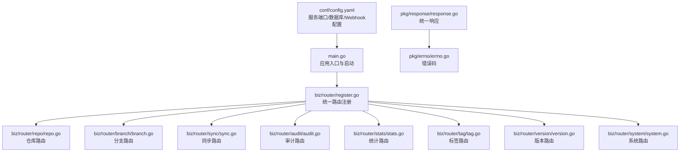
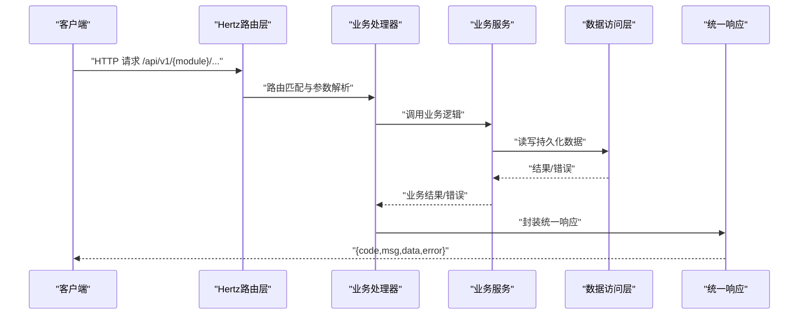
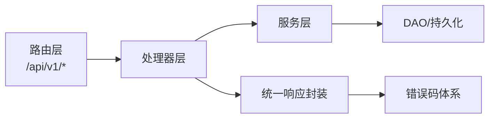

# API模型

<cite>
**本文引用的文件**
- [main.go](file://main.go)
- [router.go](file://router.go)
- [biz/router/register.go](file://biz/router/register.go)
- [biz/router/repo/repo.go](file://biz/router/repo/repo.go)
- [biz/router/branch/branch.go](file://biz/router/branch/branch.go)
- [biz/router/sync/sync.go](file://biz/router/sync/sync.go)
- [biz/router/audit/audit.go](file://biz/router/audit/audit.go)
- [biz/router/stats/stats.go](file://biz/router/stats/stats.go)
- [biz/router/tag/tag.go](file://biz/router/tag/tag.go)
- [biz/router/version/version.go](file://biz/router/version/version.go)
- [biz/router/system/system.go](file://biz/router/system/system.go)
- [biz/model/api/repo.go](file://biz/model/api/repo.go)
- [biz/model/api/branch.go](file://biz/model/api/branch.go)
- [biz/model/api/sync.go](file://biz/model/api/sync.go)
- [biz/model/api/audit.go](file://biz/model/api/audit.go)
- [biz/model/api/stats.go](file://biz/model/api/stats.go)
- [biz/model/api/system.go](file://biz/model/api/system.go)
- [biz/model/api/tag.go](file://biz/model/api/tag.go)
- [biz/model/api/task.go](file://biz/model/api/task.go)
- [pkg/response/response.go](file://pkg/response/response.go)
- [pkg/errno/errno.go](file://pkg/errno/errno.go)
- [conf/config.yaml](file://conf/config.yaml)
</cite>

## 目录
1. [简介](#简介)
2. [项目结构](#项目结构)
3. [核心组件](#核心组件)
4. [架构总览](#架构总览)
5. [详细组件分析](#详细组件分析)
6. [依赖分析](#依赖分析)
7. [性能考虑](#性能考虑)
8. [故障排查指南](#故障排查指南)
9. [结论](#结论)
10. [附录](#附录)

## 简介
本文件面向Git管理服务的API使用者与维护者，系统化梳理HTTP API的请求与响应模型，覆盖仓库管理、同步服务、分支管理、审计日志、统计分析、系统管理、标签管理与任务管理等模块。文档同时说明数据类型、字段含义、校验规则、错误码体系、版本控制策略与最佳实践，帮助读者快速理解并正确使用API。

## 项目结构
- 服务入口与启动：主程序负责初始化配置、数据库、加密工具与业务服务，并按模式启动HTTP或RPC服务。
- 路由注册：统一在生成的注册器中挂载各模块路由，前缀为/api/v1，便于版本化扩展。
- API模型：各模块在biz/model/api下定义请求与响应结构体，用于序列化/反序列化与接口契约。
- 统一响应与错误码：通过统一响应封装与错误码枚举，保证返回一致性与可诊断性。

图表来源
- [main.go](file://main.go#L52-L176)
- [biz/router/register.go](file://biz/router/register.go#L18-L42)
- [biz/router/repo/repo.go](file://biz/router/repo/repo.go#L16-L39)
- [biz/router/branch/branch.go](file://biz/router/branch/branch.go#L16-L43)
- [biz/router/sync/sync.go](file://biz/router/sync/sync.go#L16-L41)
- [biz/router/audit/audit.go](file://biz/router/audit/audit.go#L16-L32)
- [biz/router/stats/stats.go](file://biz/router/stats/stats.go#L16-L49)
- [pkg/response/response.go](file://pkg/response/response.go#L9-L87)
- [pkg/errno/errno.go](file://pkg/errno/errno.go#L7-L129)
- [conf/config.yaml](file://conf/config.yaml#L1-L25)

章节来源
- [main.go](file://main.go#L52-L176)
- [biz/router/register.go](file://biz/router/register.go#L18-L42)
- [conf/config.yaml](file://conf/config.yaml#L1-L25)

## 核心组件
- 统一响应模型
  - 字段：code（业务状态码，0表示成功）、msg（提示信息）、error（调试错误详情，可选）、data（业务数据，可选）。
  - 提供Success、Accepted、Error、BadRequest、NotFound、InternalServerError、Unauthorized、Forbidden、Conflict等便捷方法。
- 错误码体系
  - 通用错误码（0-999）：如成功、参数错误、未授权、禁止、未找到、冲突、服务异常等。
  - 业务域错误码：仓库（10000+）、分支（11000+）、同步任务（12000+）、认证（13000+）、标签（14000+）、系统（15000+）。
  - 向后兼容：保留历史别名映射，确保老客户端稳定。
- 版本控制与前缀
  - 所有REST路由均以/api/v1为前缀，便于未来引入/api/v2等新版本而不破坏现有客户端。

章节来源
- [pkg/response/response.go](file://pkg/response/response.go#L9-L87)
- [pkg/errno/errno.go](file://pkg/errno/errno.go#L31-L129)
- [biz/router/register.go](file://biz/router/register.go#L18-L42)

## 架构总览
- 服务启动
  - main根据启动模式选择HTTP、RPC或双模启动；加载配置、初始化数据库与加密工具；注册路由并启动服务。
- 请求处理
  - 客户端请求到达Hertz路由层，经中间件与校验后进入对应处理器，处理器调用业务服务，最终通过统一响应封装返回。
- 数据模型
  - 请求模型（Req）与领域对象（DTO）在biz/model/api中定义，处理器在DAO/Persistence与DTO之间转换。

图表来源
- [main.go](file://main.go#L136-L176)
- [pkg/response/response.go](file://pkg/response/response.go#L17-L87)

章节来源
- [main.go](file://main.go#L136-L176)
- [pkg/response/response.go](file://pkg/response/response.go#L17-L87)

## 详细组件分析

### 仓库管理API
- 路由前缀：/api/v1/repo
- 主要接口
  - POST /clone：克隆远程仓库到本地路径
  - POST /create：注册已存在的仓库
  - POST /delete：删除仓库
  - GET /detail：查询仓库详情
  - POST /fetch：从远端抓取更新
  - GET /list：列出仓库列表
  - POST /scan：扫描本地目录中的Git仓库
  - GET /task：查询克隆任务状态
  - POST /update：更新仓库配置
- 请求模型
  - RegisterRepoReq：name、path、remote_url、auth_type、auth_key、auth_secret、config_source、remotes、remote_auths
  - ScanRepoReq：path
  - CloneRepoReq：remote_url、local_path、auth_type、auth_key、auth_secret、config_source
  - TestConnectionReq：url
  - MergeReq：source、target、message、strategy
- 响应模型
  - RepoDTO：id、key、name、path、remote_url、auth_type、auth_key、auth_secret、config_source、remote_auths、created_at、updated_at
- 数据类型与校验
  - 字符串字段通常必填；auth_key/auth_secret可能为空表示匿名或使用默认凭据；remotes与remote_auths为可选数组/映射。
- 错误码
  - 仓库不存在、已存在、路径无效、克隆/抓取失败、非Git目录、被同步任务占用等。
- 示例
  - 请求：POST /api/v1/repo/clone
    - Body：{ "remote_url": "...", "local_path": "...", "auth_type": "basic", "auth_key": "...", "auth_secret": "...", "config_source": "manual" }
  - 响应：{ "code": 0, "msg": "success", "data": { "id": 1, "key": "repo-key", "name": "repo-name", ... } }

章节来源
- [biz/router/repo/repo.go](file://biz/router/repo/repo.go#L16-L39)
- [biz/model/api/repo.go](file://biz/model/api/repo.go#L10-L77)
- [pkg/errno/errno.go](file://pkg/errno/errno.go#L43-L54)

### 同步服务API
- 路由前缀：/api/v1/sync
- 主要接口
  - POST /execute：执行一次同步（指定源/目标仓库与分支）
  - GET /history：查询同步历史
  - POST /history/delete：删除同步历史记录
  - POST /run：按任务键触发同步
  - GET /task：查询单个同步任务
  - POST /task/create：创建同步任务
  - POST /task/delete：删除同步任务
  - POST /task/update：更新同步任务
  - GET /tasks：列出同步任务
- 请求模型
  - RunSyncReq：task_key
  - ExecuteSyncReq：repo_key、source_remote、source_branch、target_remote、target_branch、push_options
- 响应模型
  - SyncTaskDTO：id、key、source_repo_key、source_remote、source_branch、target_repo_key、target_remote、target_branch、push_options、cron、enabled、created_at、updated_at、source_repo（RepoDTO）、target_repo（RepoDTO）
  - SyncRunDTO：id、task_key、status、commit_range、error_message、details、start_time、end_time、created_at、updated_at、task（SyncTaskDTO）
- 数据类型与校验
  - 字符串字段如remote/branch需合法；push_options为可选推送参数；enabled为布尔开关；cron为Cron表达式字符串。
- 错误码
  - 任务不存在、执行失败、Cron配置错误、任务禁用、任务已在运行等。
- 示例
  - 请求：POST /api/v1/sync/execute
    - Body：{ "repo_key": "repo-A", "source_remote": "origin", "source_branch": "main", "target_remote": "mirror", "target_branch": "main", "push_options": "" }
  - 响应：{ "code": 0, "msg": "success", "data": { "id": 101, "key": "task-key", "status": "running", ... } }

章节来源
- [biz/router/sync/sync.go](file://biz/router/sync/sync.go#L16-L41)
- [biz/model/api/task.go](file://biz/model/api/task.go#L9-L66)
- [biz/model/api/sync.go](file://biz/model/api/sync.go#L9-L41)
- [pkg/errno/errno.go](file://pkg/errno/errno.go#L72-L81)

### 分支管理API
- 路由前缀：/api/v1/branch
- 主要接口
  - POST /checkout：检出到指定分支
  - GET /compare：比较两个引用差异
  - POST /create：基于基引用创建分支
  - POST /delete：删除分支
  - GET /diff：获取变更差异
  - GET /list：列出分支
  - POST /merge：合并分支
  - GET /merge/check：检查合并可行性
  - GET /patch：获取补丁内容
  - POST /pull：从远端拉取
  - POST /push：推送到远端
  - POST /update：更新分支（名称/描述）
- 请求模型
  - CreateBranchReq：name、base_ref
  - UpdateBranchReq：new_name、desc
  - PushBranchReq：remotes（远端列表）
- 响应模型
  - 列表/详情/差异等视具体接口而定，通常包含分支名、提交哈希、时间戳等。
- 数据类型与校验
  - name/base_ref/new_name为字符串；remotes为字符串数组；部分操作要求工作区干净或无冲突。
- 错误码
  - 分支不存在、已存在、删除/创建/重命名失败、检出失败、推送/拉取失败、合并失败/冲突、工作区脏等。
- 示例
  - 请求：POST /api/v1/branch/create
    - Body：{ "name": "feature-x", "base_ref": "main" }
  - 响应：{ "code": 0, "msg": "success", "data": null }

章节来源
- [biz/router/branch/branch.go](file://biz/router/branch/branch.go#L16-L43)
- [biz/model/api/branch.go](file://biz/model/api/branch.go#L3-L16)
- [pkg/errno/errno.go](file://pkg/errno/errno.go#L56-L70)

### 审计日志API
- 路由前缀：/api/v1/audit
- 主要接口
  - GET /log：查询单条审计日志
  - GET /logs：分页/筛选列出审计日志
- 响应模型
  - AuditLogDTO：id、action、target、operator、details、ip_address、user_agent、created_at
- 数据类型与校验
  - 字段均为字符串或时间戳；支持按时间范围/动作/目标筛选。
- 错误码
  - 未找到等通用错误。
- 示例
  - 请求：GET /api/v1/audit/logs
  - 响应：{ "code": 0, "msg": "success", "data": [{ "id": 1, "action": "REPO_CREATE", "target": "repo-key", ... }] }

章节来源
- [biz/router/audit/audit.go](file://biz/router/audit/audit.go#L16-L32)
- [biz/model/api/audit.go](file://biz/model/api/audit.go#L9-L32)
- [pkg/errno/errno.go](file://pkg/errno/errno.go#L31-L41)

### 统计分析API
- 路由前缀：/api/v1/stats
- 主要接口
  - GET /analyze：仓库总体统计
  - GET /authors：作者统计
  - GET /branches：分支统计
  - GET /commits：提交统计
  - GET /export/csv：导出CSV
  - GET /lines：代码行统计
  - GET /lines/config：读取行统计排除配置
  - POST /lines/config：保存行统计排除配置
  - GET /lines/export/csv：导出行统计CSV
- 响应模型
  - StatsResponse：total_lines、authors（含name、email、total_lines、file_types、time_trend）
  - LineStatsResponse：status、progress、total_files、total_lines、code_lines、comment_lines、blank_lines、languages（name、files、code、comment、blank）等
  - LineStatsConfig/LineStatsConfigRequest：exclude_dirs、exclude_patterns
- 数据类型与校验
  - languages为数组对象；各数值字段为整型；status为枚举字符串。
- 错误码
  - 未找到等通用错误。
- 示例
  - 请求：GET /api/v1/stats/lines
  - 响应：{ "code": 0, "msg": "success", "data": { "status": "ready", "total_lines": 10000, "languages": [...] } }

章节来源
- [biz/router/stats/stats.go](file://biz/router/stats/stats.go#L16-L49)
- [biz/model/api/stats.go](file://biz/model/api/stats.go#L3-L50)
- [pkg/errno/errno.go](file://pkg/errno/errno.go#L31-L41)

### 系统管理API
- 路由前缀：/api/v1/system
- 主要接口
  - GET /dirs：列出目录项（支持父目录与当前目录）
  - GET /ssh-keys：列出可用SSH密钥
  - POST /changes：提交变更（如配置更新）
- 请求模型
  - ListDirsReq：path、search（query参数）
  - ConfigReq：debug_mode、author_name、author_email
- 响应模型
  - ListDirsResp：parent、current、dirs（name、path）
  - DirItem：name、path
  - SSHKey：name、path
- 数据类型与校验
  - 字符串字段；dirs为数组对象。
- 错误码
  - 配置加载/保存失败、目录不存在、访问拒绝、文件操作错误等。
- 示例
  - 请求：GET /api/v1/system/dirs?path=/home&search=git
  - 响应：{ "code": 0, "msg": "success", "data": { "parent": "/home", "current": "/home/git", "dirs": [...] } }

章节来源
- [biz/router/system/system.go](file://biz/router/system/system.go)
- [biz/model/api/system.go](file://biz/model/api/system.go#L3-L29)
- [pkg/errno/errno.go](file://pkg/errno/errno.go#L101-L109)

### 标签管理API
- 路由前缀：/api/v1/tag
- 主要接口
  - POST /create：创建标签（支持指定引用与消息，可选推送远端）
  - POST /push：推送标签到远端
- 请求模型
  - CreateTagReq：tag_name（必填）、ref（必填，分支名或提交哈希）、message、push_remote（可选）
  - PushTagReq：tag_name（必填）、remote（必填）
- 响应模型
  - 通常返回空数据或成功提示。
- 数据类型与校验
  - tag_name/ref必填；push_remote可选。
- 错误码
  - 标签不存在、已存在、创建/删除失败等。
- 示例
  - 请求：POST /api/v1/tag/create
    - Body：{ "tag_name": "v1.2.3", "ref": "main", "message": "Release v1.2.3", "push_remote": "origin" }
  - 响应：{ "code": 0, "msg": "success", "data": null }

章节来源
- [biz/router/tag/tag.go](file://biz/router/tag/tag.go)
- [biz/model/api/tag.go](file://biz/model/api/tag.go#L3-L14)
- [pkg/errno/errno.go](file://pkg/errno/errno.go#L92-L99)

### 版本管理API
- 路由前缀：/api/v1/version
- 主要接口
  - GET /versions：列出版本
  - GET /next：计算下一个版本号
- 响应模型
  - 由版本服务定义，通常包含版本号、发布信息等。
- 数据类型与校验
  - 字符串/数字版本号；遵循语义化版本规范。
- 错误码
  - 未找到等通用错误。
- 示例
  - 请求：GET /api/v1/version/versions
  - 响应：{ "code": 0, "msg": "success", "data": ["v1.0.0","v1.1.0","v1.2.0"] }

章节来源
- [biz/router/version/version.go](file://biz/router/version/version.go)
- [pkg/errno/errno.go](file://pkg/errno/errno.go#L31-L41)

## 依赖分析
- 组件耦合
  - 路由层仅负责注册与转发，不直接持有业务逻辑，降低耦合。
  - 处理器依赖服务层；服务层依赖DAO与领域模型；DAO依赖持久化存储。
- 统一响应与错误码
  - 所有处理器通过统一响应封装返回，错误码集中定义，便于维护与演进。
- 版本控制
  - 路由前缀/api/v1为未来版本预留空间；新增版本时可并行存在，避免破坏性变更。

图表来源
- [biz/router/register.go](file://biz/router/register.go#L18-L42)
- [pkg/response/response.go](file://pkg/response/response.go#L9-L87)
- [pkg/errno/errno.go](file://pkg/errno/errno.go#L7-L129)

章节来源
- [biz/router/register.go](file://biz/router/register.go#L18-L42)
- [pkg/response/response.go](file://pkg/response/response.go#L9-L87)
- [pkg/errno/errno.go](file://pkg/errno/errno.go#L7-L129)

## 性能考虑
- 路由与中间件
  - 使用分组与中间件减少重复逻辑，提升可维护性。
- 统一响应
  - 统一的响应结构有助于前端缓存与错误处理，减少解析成本。
- 错误码
  - 明确的错误码可避免客户端盲目重试，提高整体吞吐。
- 数据模型
  - DTO与PO分离，利于按需加载与懒关联，降低网络传输与内存占用。
- 最佳实践
  - 对大列表分页查询；对耗时操作采用异步任务与轮询；对敏感字段（如凭据）避免在日志中打印；对批量操作进行幂等设计。

## 故障排查指南
- 常见错误码定位
  - 通用错误：参数错误、未授权、禁止、未找到、冲突、服务异常。
  - 仓库相关：仓库不存在、已存在、路径无效、克隆/抓取失败、非Git目录、被同步任务占用。
  - 分支相关：分支不存在、已存在、删除/创建/重命名失败、检出失败、推送/拉取失败、合并失败/冲突、工作区脏。
  - 同步相关：任务不存在、执行失败、Cron配置错误、任务禁用、任务已在运行。
  - 认证相关：认证失败、SSH密钥无效/未找到、远端连接失败、凭据无效。
  - 标签相关：标签不存在、已存在、创建/删除失败。
  - 系统相关：配置加载/保存失败、目录不存在、访问拒绝、文件操作错误。
- 统一响应字段解读
  - code=0：成功；非0：业务错误，结合msg与error字段定位问题。
- 建议排查步骤
  - 检查请求参数与数据类型是否匹配模型定义；
  - 查看服务日志与审计日志；
  - 验证远端连接与凭据有效性；
  - 对于同步/分支/标签等操作，确认工作区状态与权限。

章节来源
- [pkg/errno/errno.go](file://pkg/errno/errno.go#L31-L129)
- [pkg/response/response.go](file://pkg/response/response.go#L35-L87)

## 结论
本文档系统化梳理了Git管理服务的API模型与实现要点，明确了请求/响应结构、数据类型、校验规则、错误码与版本控制策略。通过统一响应与错误码体系，以及清晰的模块划分，既保障了接口的稳定性与可维护性，也为后续版本演进与功能扩展提供了坚实基础。

## 附录
- 服务配置
  - 服务器端口、RPC端口、数据库类型与路径、Webhook密钥与限流等。
- 版本控制与向后兼容
  - 当前版本为2.x，路由前缀为/api/v1；可通过新增/api/v2实现平滑迁移与兼容。

章节来源
- [conf/config.yaml](file://conf/config.yaml#L1-L25)
- [main.go](file://main.go#L29-L41)