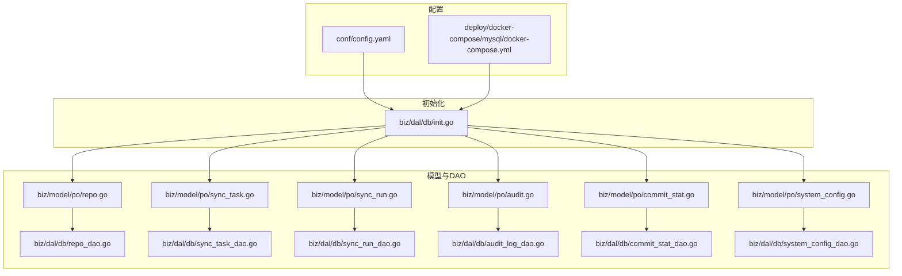
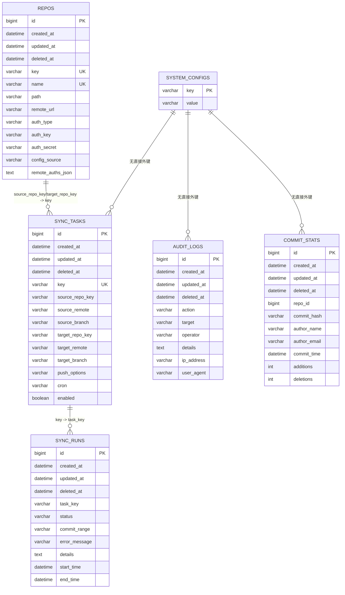
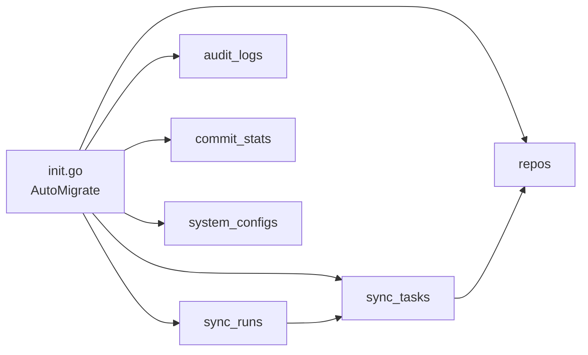
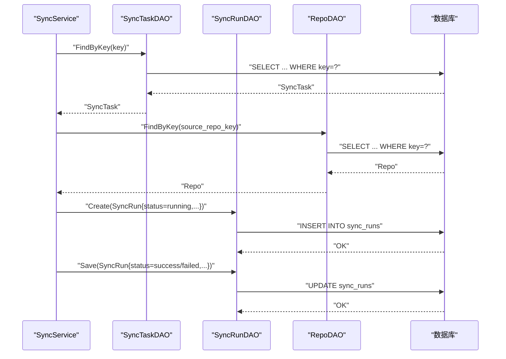

# 数据库表结构

<cite>
**本文引用的文件**
- [biz/model/po/repo.go](file://biz/model/po/repo.go)
- [biz/model/po/sync_task.go](file://biz/model/po/sync_task.go)
- [biz/model/po/sync_run.go](file://biz/model/po/sync_run.go)
- [biz/model/po/audit.go](file://biz/model/po/audit.go)
- [biz/model/po/commit_stat.go](file://biz/model/po/commit_stat.go)
- [biz/model/po/system_config.go](file://biz/model/po/system_config.go)
- [biz/dal/db/init.go](file://biz/dal/db/init.go)
- [biz/dal/db/repo_dao.go](file://biz/dal/db/repo_dao.go)
- [biz/dal/db/sync_task_dao.go](file://biz/dal/db/sync_task_dao.go)
- [biz/dal/db/sync_run_dao.go](file://biz/dal/db/sync_run_dao.go)
- [biz/dal/db/audit_log_dao.go](file://biz/dal/db/audit_log_dao.go)
- [biz/dal/db/commit_stat_dao.go](file://biz/dal/db/commit_stat_dao.go)
- [biz/dal/db/system_config_dao.go](file://biz/dal/db/system_config_dao.go)
- [conf/config.yaml](file://conf/config.yaml)
- [deploy/docker-compose/mysql/docker-compose.yml](file://deploy/docker-compose/mysql/docker-compose.yml)
- [AGENT.md](file://AGENT.md)
</cite>

## 目录
1. [简介](#简介)
2. [项目结构](#项目结构)
3. [核心组件](#核心组件)
4. [架构总览](#架构总览)
5. [详细组件分析](#详细组件分析)
6. [依赖分析](#依赖分析)
7. [性能考虑](#性能考虑)
8. [故障排查指南](#故障排查指南)
9. [结论](#结论)
10. [附录](#附录)

## 简介
本文件系统性梳理 Git 管理服务的核心数据表结构与关系，覆盖以下表：仓库表（repos）、同步任务表（sync_tasks）、同步执行记录表（sync_runs）、审计日志表（audit_logs）、提交统计表（commit_stats）、系统配置表（system_configs）。内容包括字段定义、数据类型、约束与索引、主外键关系、业务约束与完整性校验、典型 DDL 与示例数据、以及性能优化与查询模式建议。

## 项目结构
数据库初始化与迁移在统一入口完成，自动根据配置选择 SQLite/MySQL/Postgres 驱动并执行 AutoMigrate，确保表结构与模型一致。

图表来源
- [biz/dal/db/init.go](file://biz/dal/db/init.go#L18-L71)
- [conf/config.yaml](file://conf/config.yaml#L7-L19)
- [deploy/docker-compose/mysql/docker-compose.yml](file://deploy/docker-compose/mysql/docker-compose.yml#L11-L18)

章节来源
- [biz/dal/db/init.go](file://biz/dal/db/init.go#L18-L71)
- [conf/config.yaml](file://conf/config.yaml#L7-L19)
- [deploy/docker-compose/mysql/docker-compose.yml](file://deploy/docker-compose/mysql/docker-compose.yml#L11-L18)

## 核心组件
本节对六个核心数据表进行逐项说明，包括字段、类型、约束、索引及业务含义。

- 仓库表（repos）
  - 字段与类型
    - id: 主键
    - created_at/updated_at: 时间戳
    - deleted_at: 软删除索引
    - key: 唯一索引，字符串
    - name: 唯一索引，字符串
    - path: 字符串
    - remote_url: 字符串
    - auth_type: 字符串，枚举值（ssh/http/none）
    - auth_key: 字符串
    - auth_secret: 字符串（加密存储）
    - config_source: 字符串（local/database）
    - remote_auths_json: JSON 文本（加密存储）
  - 约束与索引
    - key、name 均为唯一索引
    - gorm.Model 默认软删除索引
  - 业务要点
    - 密钥与远程认证信息在持久化前加密、读取后解密
    - remote_auths_json 存储多远端认证映射

- 同步任务表（sync_tasks）
  - 字段与类型
    - id: 主键
    - created_at/updated_at: 时间戳
    - deleted_at: 软删除索引
    - key: 唯一索引，字符串
    - source_repo_key: 字符串
    - source_remote: 字符串
    - source_branch: 字符串
    - target_repo_key: 字符串
    - target_remote: 字符串
    - target_branch: 字符串
    - push_options: 字符串（如 --force --no-verify）
    - cron: 字符串（Cron 表达式）
    - enabled: 布尔值
  - 关联与索引
    - key 为唯一索引
    - gorm.Model 默认软删除索引
    - 通过外键关联到 repos.key（SourceRepoKey/TargetRepoKey）

- 同步执行记录表（sync_runs）
  - 字段与类型
    - id: 主键
    - created_at/updated_at: 时间戳
    - deleted_at: 软删除索引
    - task_key: 字符串
    - status: 字符串（success/failed/conflict）
    - commit_range: 字符串
    - error_message: 字符串
    - details: 文本（执行日志）
    - start_time/end_time: 时间戳
  - 关联与索引
    - gorm.Model 默认软删除索引
    - 通过外键关联到 sync_tasks.key（task_key）

- 审计日志表（audit_logs）
  - 字段与类型
    - id: 主键
    - created_at/updated_at: 时间戳
    - deleted_at: 软删除索引
    - action: 字符串（索引）
    - target: 字符串（索引）
    - operator: 字符串
    - details: 文本（JSON）
    - ip_address: 字符串
    - user_agent: 字符串
  - 索引
    - action、target 均带索引

- 提交统计表（commit_stats）
  - 字段与类型
    - id: 主键
    - created_at/updated_at: 时间戳
    - deleted_at: 软删除索引
    - repo_id: 整数（索引，非空）
    - commit_hash: 字符串（64字符，索引，非空）
    - author_name: 字符串
    - author_email: 字符串（索引）
    - commit_time: 时间戳（索引）
    - additions: 整数
    - deletions: 整数
  - 约束与索引
    - 复合唯一索引：(repo_id, commit_hash)
    - author_email、commit_time 均带索引

- 系统配置表（system_configs）
  - 字段与类型
    - key: 主键，字符串
    - value: 字符串
  - 用途
    - 键值型系统参数存储

章节来源
- [biz/model/po/repo.go](file://biz/model/po/repo.go#L11-L28)
- [biz/model/po/sync_task.go](file://biz/model/po/sync_task.go#L8-L28)
- [biz/model/po/sync_run.go](file://biz/model/po/sync_run.go#L9-L25)
- [biz/model/po/audit.go](file://biz/model/po/audit.go#L8-L20)
- [biz/model/po/commit_stat.go](file://biz/model/po/commit_stat.go#L9-L22)
- [biz/model/po/system_config.go](file://biz/model/po/system_config.go#L3-L10)

## 架构总览
下图展示表之间的主外键关系与典型访问路径。

图表来源
- [biz/model/po/repo.go](file://biz/model/po/repo.go#L11-L28)
- [biz/model/po/sync_task.go](file://biz/model/po/sync_task.go#L8-L28)
- [biz/model/po/sync_run.go](file://biz/model/po/sync_run.go#L9-L25)
- [biz/model/po/audit.go](file://biz/model/po/audit.go#L8-L20)
- [biz/model/po/commit_stat.go](file://biz/model/po/commit_stat.go#L9-L22)
- [biz/model/po/system_config.go](file://biz/model/po/system_config.go#L3-L10)

## 详细组件分析

### 仓库表（repos）
- 设计要点
  - key/name 唯一，保证仓库标识唯一性
  - auth_secret 与 remote_auths_json 在持久化前后进行加解密
  - 支持多种认证方式（ssh/http/none），便于对接不同远端
- 典型查询
  - 按 key/路径查找仓库
  - 批量列出仓库
- 完整 DDL（示意）
  - 表名：repos
  - 字段：id、created_at、updated_at、deleted_at、key（唯一）、name（唯一）、path、remote_url、auth_type、auth_key、auth_secret、config_source、remote_auths_json
  - 约束：唯一索引 key、name；软删除索引 deleted_at
- 示例数据
  - key: "repo-a"
  - name: "Repo A"
  - remote_url: "https://example.com/repo.git"
  - auth_type: "ssh"
  - config_source: "database"

章节来源
- [biz/model/po/repo.go](file://biz/model/po/repo.go#L11-L28)
- [biz/dal/db/repo_dao.go](file://biz/dal/db/repo_dao.go#L13-L41)

### 同步任务表（sync_tasks）
- 设计要点
  - key 唯一，便于任务检索
  - source_repo_key/target_repo_key 作为外键指向 repos.key
  - enabled + cron 组合用于调度启用与周期表达式
- 典型查询
  - 按仓库 key 查询关联任务
  - 查找启用且有 Cron 的任务
- 完整 DDL（示意）
  - 表名：sync_tasks
  - 字段：id、created_at、updated_at、deleted_at、key（唯一）、source_repo_key、source_remote、source_branch、target_repo_key、target_remote、target_branch、push_options、cron、enabled
  - 约束：唯一索引 key；软删除索引 deleted_at
  - 外键：source_repo_key/target_repo_key 引用 repos.key
- 示例数据
  - key: "task-1"
  - source_repo_key: "repo-a"
  - target_repo_key: "repo-b"
  - source_branch: "main"
  - target_branch: "main"
  - cron: "0 2 * * *"
  - enabled: true

章节来源
- [biz/model/po/sync_task.go](file://biz/model/po/sync_task.go#L8-L28)
- [biz/dal/db/sync_task_dao.go](file://biz/dal/db/sync_task_dao.go#L17-L66)

### 同步执行记录表（sync_runs）
- 设计要点
  - 记录每次同步的开始/结束时间、状态、错误信息与日志
  - task_key 外键指向 sync_tasks.key
- 典型查询
  - 获取最新 N 条执行记录
  - 按任务 key 列表查询最近执行记录
- 完整 DDL（示意）
  - 表名：sync_runs
  - 字段：id、created_at、updated_at、deleted_at、task_key、status、commit_range、error_message、details（text）、start_time、end_time
  - 约束：软删除索引 deleted_at
  - 外键：task_key 引用 sync_tasks.key
- 示例数据
  - task_key: "task-1"
  - status: "success"
  - start_time: "2025-01-01 10:00:00"
  - end_time: "2025-01-01 10:05:00"

章节来源
- [biz/model/po/sync_run.go](file://biz/model/po/sync_run.go#L9-L25)
- [biz/dal/db/sync_run_dao.go](file://biz/dal/db/sync_run_dao.go#L21-L35)

### 审计日志表（audit_logs）
- 设计要点
  - 记录用户操作（CREATE/UPDATE/DELETE/SYNC 等）、目标对象、操作者、IP、UA 等
  - action、target 建有索引，便于快速筛选
- 典型查询
  - 最近 N 条日志
  - 分页列表（排除大字段 details）
- 完整 DDL（示意）
  - 表名：audit_logs
  - 字段：id、created_at、updated_at、deleted_at、action（索引）、target（索引）、operator、details（text）、ip_address、user_agent
- 示例数据
  - action: "SYNC"
  - target: "task:task-1"
  - operator: "admin"
  - ip_address: "127.0.0.1"
  - user_agent: "Go-http-client/1.1"

章节来源
- [biz/model/po/audit.go](file://biz/model/po/audit.go#L8-L20)
- [biz/dal/db/audit_log_dao.go](file://biz/dal/db/audit_log_dao.go#L17-L39)

### 提交统计表（commit_stats）
- 设计要点
  - 以 (repo_id, commit_hash) 为复合唯一键，避免重复写入
  - author_email、commit_time 建有索引，支持按作者与时间范围查询
- 典型查询
  - 批量保存（冲突时更新）
  - 按仓库与哈希集合查询已存在记录
  - 查询某仓库最新提交时间
- 完整 DDL（示意）
  - 表名：commit_stats
  - 字段：id、created_at、updated_at、deleted_at、repo_id（索引，非空）、commit_hash（64字符，索引，非空）、author_name、author_email（索引）、commit_time（索引）、additions、deletions
  - 约束：唯一索引 (repo_id, commit_hash)
- 示例数据
  - repo_id: 1
  - commit_hash: "a1b2c3d4e5f..."
  - author_name: "Alice"
  - author_email: "alice@example.com"
  - commit_time: "2025-01-01 09:00:00"
  - additions: 100
  - deletions: 10

章节来源
- [biz/model/po/commit_stat.go](file://biz/model/po/commit_stat.go#L9-L22)
- [biz/dal/db/commit_stat_dao.go](file://biz/dal/db/commit_stat_dao.go#L17-L65)

### 系统配置表（system_configs）
- 设计要点
  - 键值对存储，key 为主键
- 典型查询
  - 获取单个配置
  - 设置配置
  - 获取全部配置
- 完整 DDL（示意）
  - 表名：system_configs
  - 字段：key（主键）、value
- 示例数据
  - key: "webhook.secret"
  - value: "your-secret-key"

章节来源
- [biz/model/po/system_config.go](file://biz/model/po/system_config.go#L3-L10)
- [biz/dal/db/system_config_dao.go](file://biz/dal/db/system_config_dao.go#L13-L42)

## 依赖分析
- 初始化流程
  - 根据配置选择数据库驱动（sqlite/mysql/postgres），连接后检测表是否存在，不存在则自动迁移
- 模型与 DAO
  - 每个 PO 对应一个 DAO，DAO 聚合了常用 CRUD 与分页/统计查询
- 关系耦合
  - sync_tasks 依赖 repos（外键）
  - sync_runs 依赖 sync_tasks（外键）
  - 其余表相对独立，主要被审计与统计模块间接使用

图表来源
- [biz/dal/db/init.go](file://biz/dal/db/init.go#L54-L67)
- [biz/model/po/repo.go](file://biz/model/po/repo.go#L26-L28)
- [biz/model/po/sync_task.go](file://biz/model/po/sync_task.go#L26-L28)
- [biz/model/po/sync_run.go](file://biz/model/po/sync_run.go#L23-L25)
- [biz/model/po/audit.go](file://biz/model/po/audit.go#L18-L20)
- [biz/model/po/commit_stat.go](file://biz/model/po/commit_stat.go#L20-L22)
- [biz/model/po/system_config.go](file://biz/model/po/system_config.go#L8-L10)

章节来源
- [biz/dal/db/init.go](file://biz/dal/db/init.go#L54-L67)

## 性能考虑
- 索引策略
  - repos: key、name 唯一索引；软删除索引
  - sync_tasks: key 唯一索引；软删除索引
  - sync_runs: 外键索引（task_key）；可按 start_time 建索引以加速“最近执行”查询
  - audit_logs: action、target 建索引；列表查询排除 details 字段
  - commit_stats: (repo_id, commit_hash) 复合唯一；author_email、commit_time 建索引
- 写入优化
  - commit_stats 使用批量插入并冲突更新（Upsert），减少重复写入
  - 分批处理（BatchSave）提升吞吐
- 读取优化
  - 审计日志分页查询仅选择必要字段
  - 按仓库与哈希集合查询采用分块（chunk）降低 IN 列表长度带来的开销
- 连接与方言
  - 支持 sqlite/mysql/postgres，按部署环境选择合适驱动
- 参考规范
  - 表名、列名、索引命名遵循 snake_case 与 idx_/uk_ 前缀规范

章节来源
- [biz/dal/db/audit_log_dao.go](file://biz/dal/db/audit_log_dao.go#L32-L37)
- [biz/dal/db/commit_stat_dao.go](file://biz/dal/db/commit_stat_dao.go#L27-L36)
- [AGENT.md](file://AGENT.md#L608-L666)

## 故障排查指南
- 连接失败
  - 检查配置文件中的数据库类型与连接参数（host/port/user/password/dbname/dsn）
  - 若使用 Docker Compose，确认容器网络与卷挂载
- 迁移失败或表缺失
  - 确认 init.go 中 AutoMigrate 是否执行成功
  - 检查数据库权限是否允许建表与索引
- 数据异常
  - 密钥解密失败：确认加密算法与密钥一致
  - 审计日志列表过大导致慢查询：优先使用分页与排除 details 字段
  - 提交统计重复：确认 (repo_id, commit_hash) 唯一约束是否生效
- 常见问题定位
  - 使用 DAO 层提供的方法进行最小复现（如 FindLatest、FindByTaskKeys、GetByRepoAndHashes 等）

章节来源
- [conf/config.yaml](file://conf/config.yaml#L7-L19)
- [deploy/docker-compose/mysql/docker-compose.yml](file://deploy/docker-compose/mysql/docker-compose.yml#L11-L18)
- [biz/dal/db/init.go](file://biz/dal/db/init.go#L54-L70)
- [biz/dal/db/audit_log_dao.go](file://biz/dal/db/audit_log_dao.go#L29-L39)
- [biz/dal/db/commit_stat_dao.go](file://biz/dal/db/commit_stat_dao.go#L38-L65)

## 结论
该数据库设计围绕仓库、任务、执行、审计与统计五大维度展开，通过明确的主外键关系与索引策略，兼顾了查询效率与扩展性。配合 DAO 层的批量写入与分页读取能力，能够支撑日常同步与审计场景。建议在生产环境中结合实际负载持续评估索引与分区策略，并定期清理历史审计与执行记录以控制表规模。

## 附录
- 典型调用序列（以同步执行为例）

图表来源
- [biz/dal/db/sync_task_dao.go](file://biz/dal/db/sync_task_dao.go#L31-L35)
- [biz/dal/db/repo_dao.go](file://biz/dal/db/repo_dao.go#L23-L27)
- [biz/dal/db/sync_run_dao.go](file://biz/dal/db/sync_run_dao.go#L13-L19)