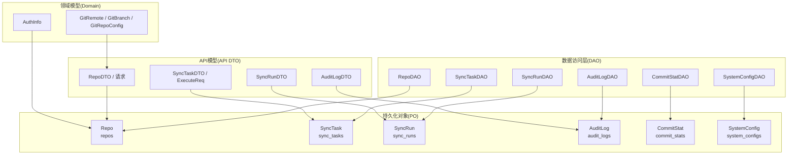
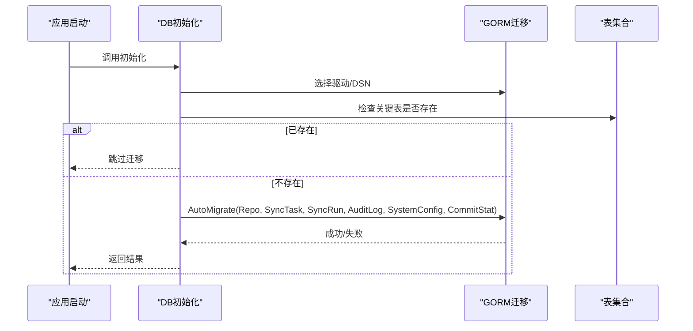
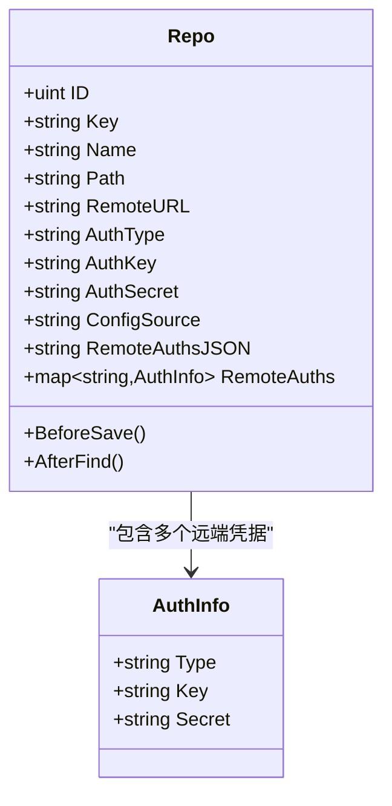
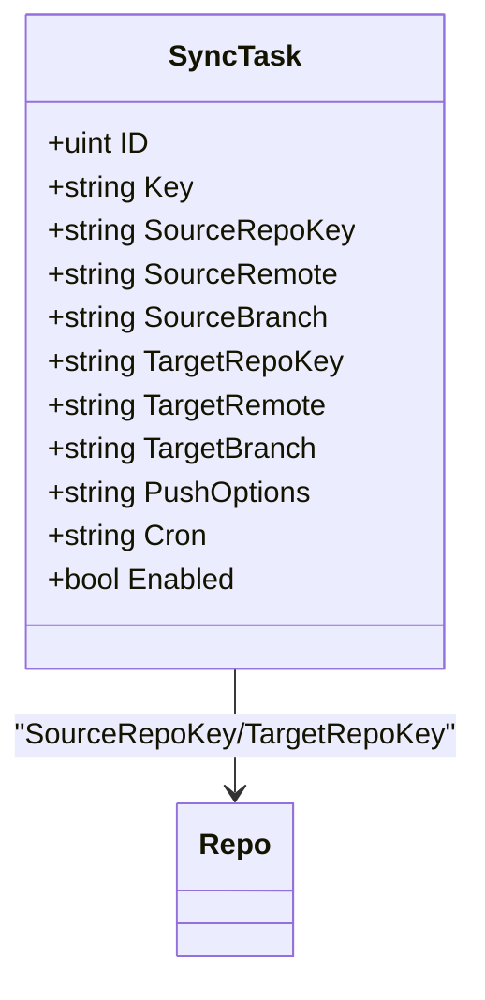
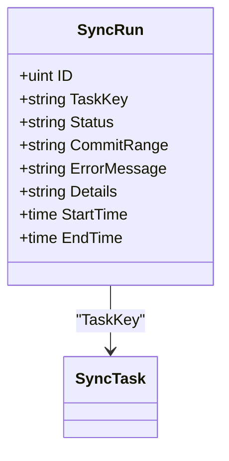
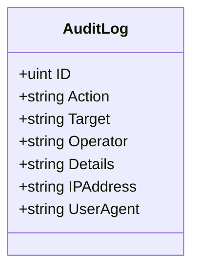
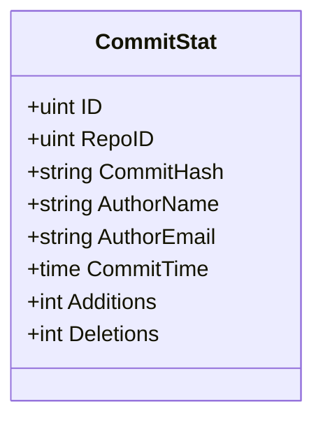
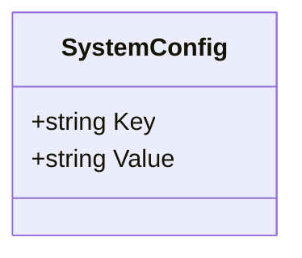
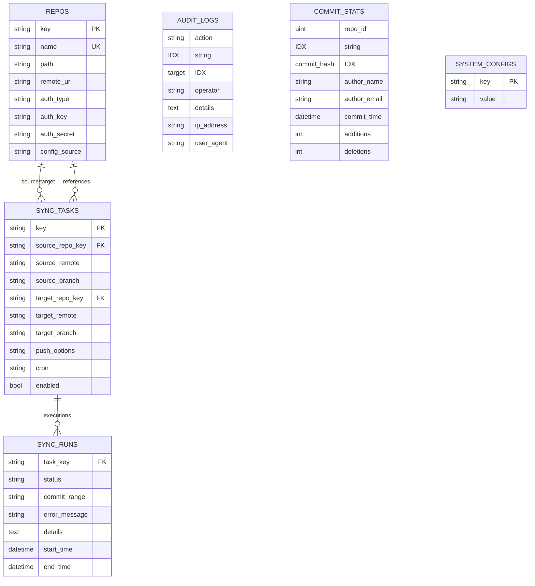

# 数据模型

<cite>
**本文引用的文件**
- [biz/dal/db/init.go](file://biz/dal/db/init.go)
- [biz/model/po/repo.go](file://biz/model/po/repo.go)
- [biz/model/po/sync_task.go](file://biz/model/po/sync_task.go)
- [biz/model/po/sync_run.go](file://biz/model/po/sync_run.go)
- [biz/model/po/audit.go](file://biz/model/po/audit.go)
- [biz/model/po/commit_stat.go](file://biz/model/po/commit_stat.go)
- [biz/model/po/system_config.go](file://biz/model/po/system_config.go)
- [biz/dal/db/repo_dao.go](file://biz/dal/db/repo_dao.go)
- [biz/dal/db/sync_task_dao.go](file://biz/dal/db/sync_task_dao.go)
- [biz/dal/db/sync_run_dao.go](file://biz/dal/db/sync_run_dao.go)
- [biz/dal/db/audit_log_dao.go](file://biz/dal/db/audit_log_dao.go)
- [biz/dal/db/commit_stat_dao.go](file://biz/dal/db/commit_stat_dao.go)
- [biz/dal/db/system_config_dao.go](file://biz/dal/db/system_config_dao.go)
- [biz/model/api/repo.go](file://biz/model/api/repo.go)
- [biz/model/api/sync.go](file://biz/model/api/sync.go)
- [biz/model/api/task.go](file://biz/model/api/task.go)
- [biz/model/api/audit.go](file://biz/model/api/audit.go)
- [biz/model/domain/git.go](file://biz/model/domain/git.go)
- [biz/model/domain/common.go](file://biz/model/domain/common.go)
</cite>

## 目录
1. [简介](#简介)
2. [项目结构](#项目结构)
3. [核心组件](#核心组件)
4. [架构总览](#架构总览)
5. [详细组件分析](#详细组件分析)
6. [依赖分析](#依赖分析)
7. [性能考量](#性能考量)
8. [故障排查指南](#故障排查指南)
9. [结论](#结论)
10. [附录](#附录)

## 简介
本文件系统化梳理 Git 管理服务的数据模型与实现，覆盖数据库表结构、领域模型与业务规则、API 模型的请求/响应格式与参数规范、主键/外键关系与索引设计、约束条件、数据验证与业务规则、ER 图与示例数据、数据访问模式、缓存策略与性能考虑，以及数据生命周期、保留策略与归档规则。

## 项目结构
围绕数据模型的关键目录与文件：
- 数据访问层（DAO）：统一通过 GORM 访问数据库，负责 CRUD 与查询封装
- 持久化对象（PO）：定义数据库表结构、字段约束与索引
- API 模型（API DTO）：面向接口的请求/响应结构
- 领域模型（Domain）：抽象 Git 远端、分支、认证信息等业务概念
- 初始化与迁移：启动时自动迁移或跳过已存在表

图表来源
- [biz/model/po/repo.go](file://biz/model/po/repo.go#L11-L28)
- [biz/model/po/sync_task.go](file://biz/model/po/sync_task.go#L8-L28)
- [biz/model/po/sync_run.go](file://biz/model/po/sync_run.go#L9-L25)
- [biz/model/po/audit.go](file://biz/model/po/audit.go#L8-L20)
- [biz/model/po/commit_stat.go](file://biz/model/po/commit_stat.go#L9-L22)
- [biz/model/po/system_config.go](file://biz/model/po/system_config.go#L3-L10)
- [biz/dal/db/repo_dao.go](file://biz/dal/db/repo_dao.go#L7-L41)
- [biz/dal/db/sync_task_dao.go](file://biz/dal/db/sync_task_dao.go#L7-L66)
- [biz/dal/db/sync_run_dao.go](file://biz/dal/db/sync_run_dao.go#L7-L39)
- [biz/dal/db/audit_log_dao.go](file://biz/dal/db/audit_log_dao.go#L7-L45)
- [biz/dal/db/commit_stat_dao.go](file://biz/dal/db/commit_stat_dao.go#L10-L65)
- [biz/dal/db/system_config_dao.go](file://biz/dal/db/system_config_dao.go#L7-L42)
- [biz/model/api/repo.go](file://biz/model/api/repo.go#L10-L76)
- [biz/model/api/task.go](file://biz/model/api/task.go#L22-L65)
- [biz/model/api/sync.go](file://biz/model/api/sync.go#L9-L40)
- [biz/model/api/audit.go](file://biz/model/api/audit.go#L9-L31)
- [biz/model/domain/git.go](file://biz/model/domain/git.go#L5-L39)
- [biz/model/domain/common.go](file://biz/model/domain/common.go#L3-L7)

章节来源
- [biz/dal/db/init.go](file://biz/dal/db/init.go#L18-L71)

## 核心组件
- 仓库（Repo）
  - 表名：repos
  - 唯一索引：key、name
  - 字段要点：路径、远端 URL、认证类型与凭据（本地加密存储）、配置来源、远程多源凭据映射（JSON 存储并在内存中解密）
- 同步任务（SyncTask）
  - 表名：sync_tasks
  - 唯一索引：key
  - 关联：SourceRepo、TargetRepo（外键指向 Repo.key）
  - 字段要点：源/目标仓库键、远端与分支、推送选项、Cron 定时表达式、启用状态
- 同步执行记录（SyncRun）
  - 表名：sync_runs
  - 关联：Task（外键指向 SyncTask.key）
  - 字段要点：任务键、状态（成功/失败/冲突）、提交范围、错误信息、执行日志、开始/结束时间
- 审计日志（AuditLog）
  - 表名：audit_logs
  - 索引：action、target
  - 字段要点：操作动作、目标标识、操作者、详情（变更 JSON）、IP、UA
- 提交统计（CommitStat）
  - 表名：commit_stats
  - 复合唯一索引：(repo_id, commit_hash)
  - 索引：author_email、commit_time
  - 字段要点：仓库 ID、提交哈希、作者信息、提交时间、增删行数
- 系统配置（SystemConfig）
  - 表名：system_configs
  - 主键：key
  - 字段要点：键值对

章节来源
- [biz/model/po/repo.go](file://biz/model/po/repo.go#L11-L24)
- [biz/model/po/sync_task.go](file://biz/model/po/sync_task.go#L8-L24)
- [biz/model/po/sync_run.go](file://biz/model/po/sync_run.go#L9-L21)
- [biz/model/po/audit.go](file://biz/model/po/audit.go#L8-L16)
- [biz/model/po/commit_stat.go](file://biz/model/po/commit_stat.go#L9-L18)
- [biz/model/po/system_config.go](file://biz/model/po/system_config.go#L3-L6)

## 架构总览
数据库初始化在应用启动时完成，若检测到关键表已存在则跳过迁移；否则进行 AutoMigrate 创建表及索引。各 DAO 负责具体实体的读写与查询，API 层负责请求/响应转换与校验，领域模型承载 Git 与认证相关概念。

图表来源
- [biz/dal/db/init.go](file://biz/dal/db/init.go#L18-L71)

## 详细组件分析

### 仓库（Repo）模型
- 结构与约束
  - 主键：gorm.Model（含 ID、CreatedAt、UpdatedAt、DeletedAt）
  - 唯一索引：key、name
  - 字段：path、remote_url、auth_type、auth_key、auth_secret（入库前加密）、config_source
  - 远程多源凭据：remote_auths（内存对象），remote_auths_json（DB 存储的 JSON）
- 生命周期钩子
  - BeforeSave：对主密钥与 remote_auths 中的密钥进行加密
  - AfterFind：对主密钥与 remote_auths 中的密钥进行解密
- API 映射
  - RegisterRepoReq/CloneRepoReq：注册/克隆请求
  - RepoDTO：对外返回结构，包含解密后的敏感信息（仅在 API 层可见）
- 业务规则
  - key/name 唯一性保证仓库标识唯一
  - auth_type 支持 ssh/http/none，凭据按需加密
  - remote_auths 支持为不同远端配置独立凭据
- 数据访问模式
  - DAO 提供 Create/FindAll/FindByKey/FindByPath/Save/Delete
- 示例数据
  - key: "repo-a"
  - name: "Repo A"
  - path: "/data/repos/a.git"
  - remote_url: "https://example.com/a.git"
  - auth_type: "ssh"
  - auth_key: "/etc/ssh/id_rsa"
  - config_source: "local"

图表来源
- [biz/model/po/repo.go](file://biz/model/po/repo.go#L11-L92)
- [biz/model/domain/common.go](file://biz/model/domain/common.go#L3-L7)

章节来源
- [biz/model/po/repo.go](file://biz/model/po/repo.go#L11-L92)
- [biz/dal/db/repo_dao.go](file://biz/dal/db/repo_dao.go#L13-L41)
- [biz/model/api/repo.go](file://biz/model/api/repo.go#L10-L76)

### 同步任务（SyncTask）模型
- 结构与约束
  - 主键：gorm.Model
  - 唯一索引：key
  - 外键关联：SourceRepoKey -> Repo.Key、TargetRepoKey -> Repo.Key
  - 字段：source_repo_key、source_remote、source_branch、target_repo_key、target_remote、target_branch、push_options、cron、enabled
- API 映射
  - SyncTaskDTO：对外返回结构，包含预加载的 SourceRepo/TargetRepo
  - ExecuteSyncReq：执行同步的请求结构
- 业务规则
  - enabled=true 且 cron 非空的任务参与定时调度
  - 任务与仓库通过 key 关联，避免硬编码 ID
- 数据访问模式
  - DAO 提供 Create/FindAllWithRepos/FindByRepoKey/FindByKey/Save/Delete/CountByRepoKey/GetKeysByRepoKey/FindEnabledWithCron
- 示例数据
  - key: "task-1"
  - source_repo_key: "repo-a"
  - source_remote: "origin"
  - source_branch: "main"
  - target_repo_key: "repo-b"
  - target_remote: "mirror"
  - target_branch: "main"
  - push_options: "--force"
  - cron: "0 2 * * *"
  - enabled: true

图表来源
- [biz/model/po/sync_task.go](file://biz/model/po/sync_task.go#L8-L28)

章节来源
- [biz/model/po/sync_task.go](file://biz/model/po/sync_task.go#L8-L28)
- [biz/dal/db/sync_task_dao.go](file://biz/dal/db/sync_task_dao.go#L13-L66)
- [biz/model/api/task.go](file://biz/model/api/task.go#L22-L65)

### 同步执行记录（SyncRun）模型
- 结构与约束
  - 主键：gorm.Model
  - 外键关联：TaskKey -> SyncTask.Key
  - 字段：task_key、status、commit_range、error_message、details（text）、start_time、end_time
- API 映射
  - SyncRunDTO：对外返回结构，包含预加载的 Task
- 业务规则
  - status 取值用于表示执行结果（success/failed/conflict）
  - details 保存执行日志，适合分页列表时排除该字段以提升性能
- 数据访问模式
  - DAO 提供 Create/Save/FindLatest/FindByTaskKeys/Delete
- 示例数据
  - task_key: "task-1"
  - status: "success"
  - commit_range: "a1b2c3..d4e5f6"
  - start_time: "2025-01-01T10:00:00Z"
  - end_time: "2025-01-01T10:05:00Z"

图表来源
- [biz/model/po/sync_run.go](file://biz/model/po/sync_run.go#L9-L25)

章节来源
- [biz/model/po/sync_run.go](file://biz/model/po/sync_run.go#L9-L25)
- [biz/dal/db/sync_run_dao.go](file://biz/dal/db/sync_run_dao.go#L13-L39)
- [biz/model/api/sync.go](file://biz/model/api/sync.go#L9-L40)

### 审计日志（AuditLog）模型
- 结构与约束
  - 主键：gorm.Model
  - 索引：action、target
  - 字段：action、target、operator、details（text）、ip_address、user_agent
- API 映射
  - AuditLogDTO：对外返回结构
- 业务规则
  - action/target 组合便于检索与聚合
  - 列表接口默认排除 details 以优化性能
- 数据访问模式
  - DAO 提供 Create/FindLatest/Count/FindPage/FindByID
- 示例数据
  - action: "SYNC"
  - target: "task:task-1"
  - operator: "admin"
  - ip_address: "127.0.0.1"
  - user_agent: "Go-http-client/1.1"

图表来源
- [biz/model/po/audit.go](file://biz/model/po/audit.go#L8-L20)

章节来源
- [biz/model/po/audit.go](file://biz/model/po/audit.go#L8-L20)
- [biz/dal/db/audit_log_dao.go](file://biz/dal/db/audit_log_dao.go#L13-L45)
- [biz/model/api/audit.go](file://biz/model/api/audit.go#L9-L31)

### 提交统计（CommitStat）模型
- 结构与约束
  - 主键：gorm.Model
  - 复合唯一索引：(repo_id, commit_hash)
  - 索引：author_email、commit_time
  - 字段：repo_id、commit_hash（64字符）、author_name、author_email、commit_time、additions、deletions
- 业务规则
  - 以 (repo_id, commit_hash) 唯一，支持批量 upsert
  - 通过 latest commit_time 决定增量同步起点
- 数据访问模式
  - DAO 提供 FindLatestCommitTime/BatchSave/GetByRepoAndHashes
- 示例数据
  - repo_id: 1
  - commit_hash: "a1b2c3d4e5f6..."
  - author_name: "Alice"
  - author_email: "alice@example.com"
  - commit_time: "2025-01-01T10:00:00Z"
  - additions: 100
  - deletions: 10

图表来源
- [biz/model/po/commit_stat.go](file://biz/model/po/commit_stat.go#L9-L22)

章节来源
- [biz/model/po/commit_stat.go](file://biz/model/po/commit_stat.go#L9-L22)
- [biz/dal/db/commit_stat_dao.go](file://biz/dal/db/commit_stat_dao.go#L16-L65)

### 系统配置（SystemConfig）模型
- 结构与约束
  - 主键：key
  - 字段：key、value
- 业务规则
  - 键值对形式存储系统运行期配置
- 数据访问模式
  - DAO 提供 GetConfig/SetConfig/GetAll
- 示例数据
  - key: "max_concurrent_syncs"
  - value: "5"

图表来源
- [biz/model/po/system_config.go](file://biz/model/po/system_config.go#L3-L10)

章节来源
- [biz/model/po/system_config.go](file://biz/model/po/system_config.go#L3-L10)
- [biz/dal/db/system_config_dao.go](file://biz/dal/db/system_config_dao.go#L13-L42)

### 领域模型与业务规则
- Git 远端与分支
  - GitRemote：远端名称、拉取/推送 URL、拉取/推送规格、是否镜像
  - GitBranch：分支名、上游远端、合并引用、上游引用
  - GitRepoConfig：仓库内远端与分支集合
- 认证信息
  - AuthInfo：类型（ssh/http/none）、密钥/用户名、密文凭据
- 业务规则
  - Repo 的 remote_auths 支持多远端独立凭据，API 层仅返回解密后数据
  - SyncTask 的 enabled+cron 决定是否纳入定时任务
  - CommitStat 以 (repo_id, commit_hash) 去重，支持批量 upsert

章节来源
- [biz/model/domain/git.go](file://biz/model/domain/git.go#L5-L39)
- [biz/model/domain/common.go](file://biz/model/domain/common.go#L3-L7)

## 依赖分析
- 实体间关系
  - Repo 与 SyncTask：一对多（一个仓库可作为源/目标被多个任务使用）
  - SyncTask 与 SyncRun：一对多（一次任务可多次执行）
  - SyncRun 与 AuditLog：无直接外键，但可通过 target 标识关联
  - CommitStat 与 Repo：一对多（单仓库多提交）
- 查询依赖
  - SyncTaskDAO 在查询时通过 Preload 加载关联 Repo
  - SyncRunDAO 在查询时通过 Preload 加载关联 Task
  - AuditLogDAO 列表查询排除 details 字段以优化性能
- 批量与并发
  - CommitStatDAO 支持批量 upsert，按批处理减少往返
  - CommitStatDAO 分块查询指定哈希集合，避免 IN 参数过大

图表来源
- [biz/model/po/repo.go](file://biz/model/po/repo.go#L11-L28)
- [biz/model/po/sync_task.go](file://biz/model/po/sync_task.go#L8-L28)
- [biz/model/po/sync_run.go](file://biz/model/po/sync_run.go#L9-L25)
- [biz/model/po/audit.go](file://biz/model/po/audit.go#L8-L20)
- [biz/model/po/commit_stat.go](file://biz/model/po/commit_stat.go#L9-L22)
- [biz/model/po/system_config.go](file://biz/model/po/system_config.go#L3-L10)

章节来源
- [biz/dal/db/sync_task_dao.go](file://biz/dal/db/sync_task_dao.go#L17-L21)
- [biz/dal/db/sync_run_dao.go](file://biz/dal/db/sync_run_dao.go#L21-L25)
- [biz/dal/db/audit_log_dao.go](file://biz/dal/db/audit_log_dao.go#L29-L39)
- [biz/dal/db/commit_stat_dao.go](file://biz/dal/db/commit_stat_dao.go#L26-L36)

## 性能考量
- 索引与查询
  - AuditLog 列表接口显式选择列并排除 details，降低网络与解析开销
  - CommitStat 对 author_email、commit_time 建有索引，利于统计与排序
  - CommitStat 复合唯一索引 (repo_id, commit_hash) 支持高效 upsert
- 批处理
  - CommitStatDAO 批量 upsert 使用 OnConflict AssignmentColumns，减少重复写入
  - CommitStatDAO 分块查询指定哈希集合，避免 IN 参数过大导致的性能问题
- 缓存策略
  - 当前未见专用缓存层实现；建议对高频只读配置（如 SystemConfig）增加进程内缓存与定期刷新
  - 对于审计日志列表与提交统计等热点查询，可在应用层引入短期缓存（注意一致性）
- 连接与方言
  - 支持 MySQL、Postgres、Sqlite，按配置选择驱动；生产环境建议使用 MySQL/Postgres 并开启连接池

[本节为通用性能建议，不直接分析特定文件]

## 故障排查指南
- 数据库连接与迁移
  - 若迁移失败，检查数据库类型与 DSN 配置；确认关键表存在时会跳过迁移
- 密钥与凭据
  - Repo 的 auth_secret 与 remote_auths 中的 secret 会在入库前加密、查询后解密；若出现异常，检查加密/解密工具可用性
- 审计日志
  - 列表接口默认不返回 details；如需查看完整详情，请使用按 ID 查询接口
- 同步执行
  - 查看 SyncRun 的 status 与 error_message 获取失败原因；必要时查看 details 日志
- 提交统计
  - 如发现重复或缺失，检查 (repo_id, commit_hash) 唯一键约束与批量 upsert 的冲突更新逻辑

章节来源
- [biz/dal/db/init.go](file://biz/dal/db/init.go#L18-L71)
- [biz/model/po/repo.go](file://biz/model/po/repo.go#L30-L92)
- [biz/dal/db/audit_log_dao.go](file://biz/dal/db/audit_log_dao.go#L29-L39)
- [biz/dal/db/sync_run_dao.go](file://biz/dal/db/sync_run_dao.go#L13-L39)
- [biz/dal/db/commit_stat_dao.go](file://biz/dal/db/commit_stat_dao.go#L26-L36)

## 结论
本数据模型以 GORM PO 为核心，结合 API DTO 与领域模型，清晰地表达了仓库、同步任务、执行记录、审计与统计等核心实体。通过唯一索引与外键约束保障数据完整性，配合 DAO 的批量与分页能力满足高并发场景下的性能需求。建议在生产环境中完善缓存与监控，并持续评估数据生命周期与归档策略。

[本节为总结性内容，不直接分析特定文件]

## 附录

### API 模型与参数规范（摘要）
- 仓库
  - 注册/克隆请求：包含 name、path、remote_url、auth_type、auth_key、auth_secret、config_source、remotes、remote_auths
  - 返回结构：RepoDTO 包含解密后的敏感信息
- 同步任务
  - 任务 DTO：包含 source/target 仓库键、远端与分支、推送选项、cron、enabled
  - 执行请求：ExecuteSyncReq 包含 repo_key、source/target 远端与分支、push_options
- 同步执行
  - SyncRunDTO：包含任务键、状态、提交范围、错误信息、详情、开始/结束时间
- 审计日志
  - AuditLogDTO：包含 action、target、operator、details、ip_address、user_agent

章节来源
- [biz/model/api/repo.go](file://biz/model/api/repo.go#L10-L76)
- [biz/model/api/task.go](file://biz/model/api/task.go#L22-L65)
- [biz/model/api/sync.go](file://biz/model/api/sync.go#L9-L40)
- [biz/model/api/audit.go](file://biz/model/api/audit.go#L9-L31)

### 数据生命周期、保留策略与归档规则（建议）
- 审计日志
  - 建议按月/季度归档历史数据，保留最近 6–12 个月的明细；超过保留期的数据移至冷存储
- 同步执行记录
  - 建议保留最近 30–90 天的执行记录；更早记录归档或清理
- 提交统计
  - 建议按仓库维度设置滚动窗口（如最近 1 年），超出部分可汇总为月度/年度统计并归档
- 仓库与任务
  - 采用“逻辑删除”策略（软删除）保留元数据，物理清理仅限不再需要的历史快照或备份

[本节为通用建议，不直接分析特定文件]