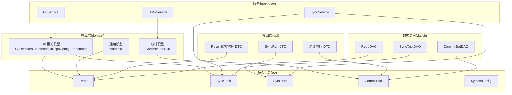
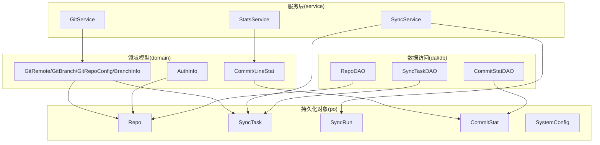
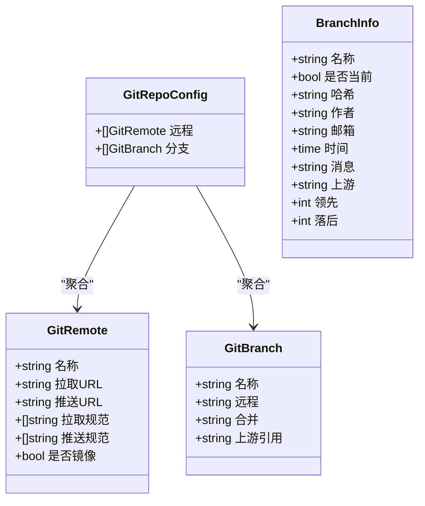
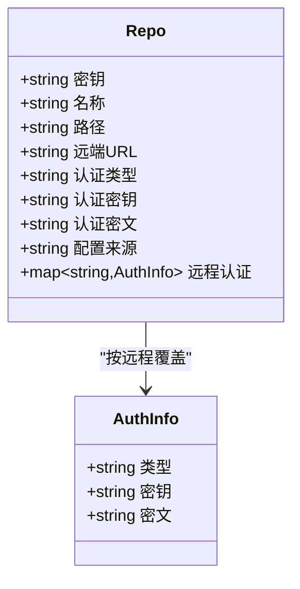
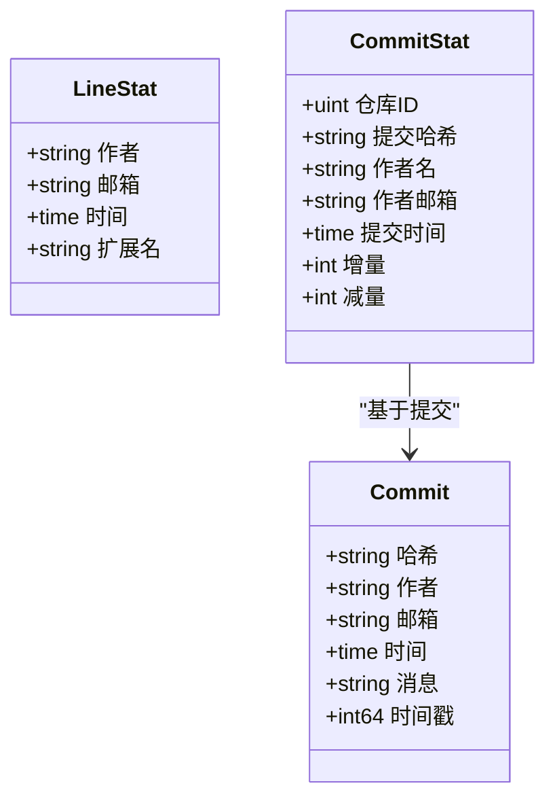
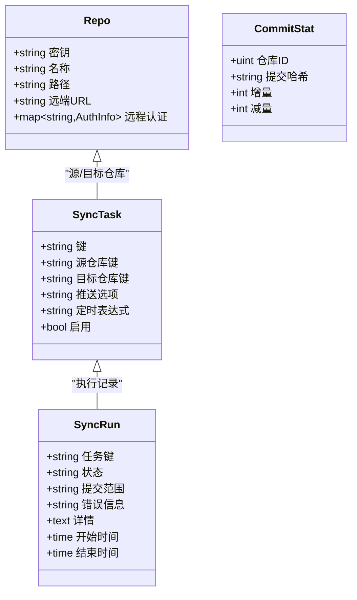
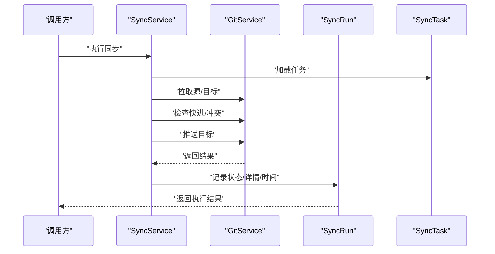
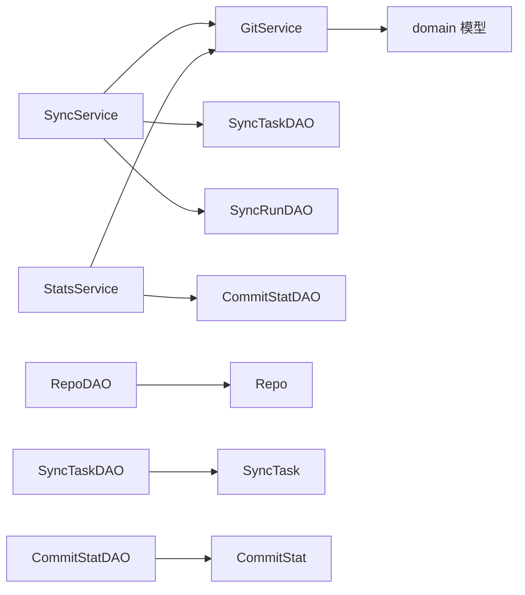
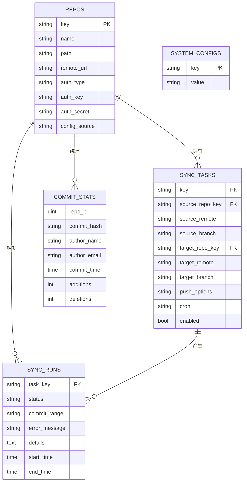

# 领域模型

<cite>
**本文引用的文件**
- [biz/model/domain/git.go](file://biz/model/domain/git.go)
- [biz/model/domain/stats.go](file://biz/model/domain/stats.go)
- [biz/model/domain/common.go](file://biz/model/domain/common.go)
- [biz/model/po/repo.go](file://biz/model/po/repo.go)
- [biz/model/po/sync_task.go](file://biz/model/po/sync_task.go)
- [biz/model/po/commit_stat.go](file://biz/model/po/commit_stat.go)
- [biz/model/po/sync_run.go](file://biz/model/po/sync_run.go)
- [biz/model/po/system_config.go](file://biz/model/po/system_config.go)
- [biz/model/api/repo.go](file://biz/model/api/repo.go)
- [biz/model/api/sync.go](file://biz/model/api/sync.go)
- [biz/model/api/stats.go](file://biz/model/api/stats.go)
- [biz/service/git/git_service.go](file://biz/service/git/git_service.go)
- [biz/service/sync/sync_service.go](file://biz/service/sync/sync_service.go)
- [biz/service/stats/stats_service.go](file://biz/service/stats/stats_service.go)
- [biz/dal/db/repo_dao.go](file://biz/dal/db/repo_dao.go)
- [biz/dal/db/sync_task_dao.go](file://biz/dal/db/sync_task_dao.go)
- [biz/dal/db/commit_stat_dao.go](file://biz/dal/db/commit_stat_dao.go)
</cite>

## 目录
1. [引言](#引言)
2. [项目结构](#项目结构)
3. [核心组件](#核心组件)
4. [架构总览](#架构总览)
5. [详细组件分析](#详细组件分析)
6. [依赖分析](#依赖分析)
7. [性能考虑](#性能考虑)
8. [故障排查指南](#故障排查指南)
9. [结论](#结论)
10. [附录](#附录)

## 引言
本文件系统化梳理“Git 管理服务”的领域模型，覆盖以下方面：
- 领域驱动设计中的核心实体与值对象
- Git 相关领域模型（远程、分支、仓库配置）
- 通用领域模型（认证信息）
- 统计分析领域模型（提交、行统计）
- 聚合与聚合根、领域事件与协作模式
- 业务规则与约束、错误处理与性能优化建议

目标是帮助读者快速理解模型边界、职责与交互，支撑后续功能扩展与维护。

## 项目结构
围绕“领域模型”，本项目采用分层+DDD 的组织方式：
- domain 层：纯领域模型（值对象与实体的抽象）
- po 层：持久化对象（含 GORM 映射、生命周期钩子）
- api 层：对外 DTO（请求/响应），用于接口契约
- service 层：领域服务（封装跨实体的业务流程）
- dal/db 层：数据访问对象（DAO）

图表来源
- [biz/model/domain/git.go](file://biz/model/domain/git.go#L5-L39)
- [biz/model/domain/stats.go](file://biz/model/domain/stats.go#L5-L19)
- [biz/model/domain/common.go](file://biz/model/domain/common.go#L3-L7)
- [biz/model/po/repo.go](file://biz/model/po/repo.go#L11-L24)
- [biz/model/po/sync_task.go](file://biz/model/po/sync_task.go#L8-L24)
- [biz/model/po/commit_stat.go](file://biz/model/po/commit_stat.go#L9-L18)
- [biz/model/po/sync_run.go](file://biz/model/po/sync_run.go#L9-L21)
- [biz/model/po/system_config.go](file://biz/model/po/system_config.go#L3-L6)
- [biz/model/api/repo.go](file://biz/model/api/repo.go#L10-L59)
- [biz/model/api/sync.go](file://biz/model/api/sync.go#L9-L40)
- [biz/model/api/stats.go](file://biz/model/api/stats.go#L3-L49)
- [biz/service/git/git_service.go](file://biz/service/git/git_service.go#L27-L409)
- [biz/service/sync/sync_service.go](file://biz/service/sync/sync_service.go#L13-L249)
- [biz/service/stats/stats_service.go](file://biz/service/stats/stats_service.go#L39-L371)
- [biz/dal/db/repo_dao.go](file://biz/dal/db/repo_dao.go#L7-L41)
- [biz/dal/db/sync_task_dao.go](file://biz/dal/db/sync_task_dao.go#L7-L66)
- [biz/dal/db/commit_stat_dao.go](file://biz/dal/db/commit_stat_dao.go#L10-L65)

章节来源
- [biz/model/domain/git.go](file://biz/model/domain/git.go#L1-L40)
- [biz/model/domain/stats.go](file://biz/model/domain/stats.go#L1-L20)
- [biz/model/domain/common.go](file://biz/model/domain/common.go#L1-L8)
- [biz/model/po/repo.go](file://biz/model/po/repo.go#L1-L93)
- [biz/model/po/sync_task.go](file://biz/model/po/sync_task.go#L1-L29)
- [biz/model/po/commit_stat.go](file://biz/model/po/commit_stat.go#L1-L23)
- [biz/model/po/sync_run.go](file://biz/model/po/sync_run.go#L1-L26)
- [biz/model/po/system_config.go](file://biz/model/po/system_config.go#L1-L11)
- [biz/model/api/repo.go](file://biz/model/api/repo.go#L1-L77)
- [biz/model/api/sync.go](file://biz/model/api/sync.go#L1-L41)
- [biz/model/api/stats.go](file://biz/model/api/stats.go#L1-L50)
- [biz/service/git/git_service.go](file://biz/service/git/git_service.go#L1-L800)
- [biz/service/sync/sync_service.go](file://biz/service/sync/sync_service.go#L1-L263)
- [biz/service/stats/stats_service.go](file://biz/service/stats/stats_service.go#L1-L372)
- [biz/dal/db/repo_dao.go](file://biz/dal/db/repo_dao.go#L1-L42)
- [biz/dal/db/sync_task_dao.go](file://biz/dal/db/sync_task_dao.go#L1-L67)
- [biz/dal/db/commit_stat_dao.go](file://biz/dal/db/commit_stat_dao.go#L1-L66)

## 核心组件
本节从领域视角拆解核心实体与值对象，并给出其业务语义、属性与行为。

- Git 相关领域模型
  - GitRemote：远程仓库元信息，包含名称、拉取/推送 URL、拉取/推送规范、镜像标记等
  - GitBranch：本地分支与上游关联，包含分支名、上游远程、合并引用、上游引用等
  - GitRepoConfig：仓库级配置，聚合多个远程与分支
  - BranchInfo：分支状态信息，包含当前分支标识、最新提交哈希、作者、日期、消息，以及与上游的领先/落后关系
  - 业务规则
    - 远程是否镜像：影响同步策略与推送行为
    - 分支上游引用：用于计算 ahead/behind 关系
    - 分支与上游的 ref 规范：决定 fetch/push 的引用映射

- 通用领域模型
  - AuthInfo：认证信息，支持类型（ssh/http/none）、密钥路径或用户名、密文密码/口令（数据库中加密存储）
  - 业务规则
    - 密钥与口令在入库前加密、出库后解密
    - 支持按远程覆盖仓库级认证

- 统计分析领域模型
  - Commit：单次提交的摘要，包含哈希、作者、邮箱、时间戳、消息
  - LineStat：行统计粒度，包含作者、邮箱、日期、扩展名等
  - 业务规则
    - 提交统计以哈希为唯一键，避免重复
    - 行统计按作者、日期、扩展名聚合

章节来源
- [biz/model/domain/git.go](file://biz/model/domain/git.go#L5-L39)
- [biz/model/domain/common.go](file://biz/model/domain/common.go#L3-L7)
- [biz/model/domain/stats.go](file://biz/model/domain/stats.go#L5-L19)

## 架构总览
下图展示领域模型在各层的分布与交互，强调服务层对领域模型的编排与 DAO 对持久化对象的读写。

图表来源
- [biz/service/git/git_service.go](file://biz/service/git/git_service.go#L27-L409)
- [biz/service/sync/sync_service.go](file://biz/service/sync/sync_service.go#L13-L249)
- [biz/service/stats/stats_service.go](file://biz/service/stats/stats_service.go#L39-L371)
- [biz/dal/db/repo_dao.go](file://biz/dal/db/repo_dao.go#L7-L41)
- [biz/dal/db/sync_task_dao.go](file://biz/dal/db/sync_task_dao.go#L7-L66)
- [biz/dal/db/commit_stat_dao.go](file://biz/dal/db/commit_stat_dao.go#L10-L65)

## 详细组件分析

### Git 相关领域模型
- 实体与值对象
  - GitRemote：远程元信息，支持镜像模式
  - GitBranch：分支与上游的绑定
  - GitRepoConfig：聚合远程与分支
  - BranchInfo：分支状态快照
- 业务行为
  - 仓库配置解析：从本地 Git 配置生成领域模型
  - 远程增删改：封装底层配置变更
  - 分支列表与提交日志：供上层统计与同步使用
- 约束与规则
  - 分支上游引用需与远程名一致
  - 镜像远程影响推送策略
  - 分支 ahead/behind 由上游引用与当前引用决定

图表来源
- [biz/model/domain/git.go](file://biz/model/domain/git.go#L5-L39)

章节来源
- [biz/model/domain/git.go](file://biz/model/domain/git.go#L1-L40)
- [biz/service/git/git_service.go](file://biz/service/git/git_service.go#L357-L409)

### 通用领域模型：认证信息
- AuthInfo：统一的认证抽象，支持按远程覆盖仓库级认证
- 生命周期
  - 入库前加密敏感字段
  - 出库后解密并回填内存结构
- 业务规则
  - 当仓库存在按远程覆盖时优先使用远程认证
  - 认证类型为空或 none 时走免认证路径

图表来源
- [biz/model/domain/common.go](file://biz/model/domain/common.go#L3-L7)
- [biz/model/po/repo.go](file://biz/model/po/repo.go#L11-L24)
- [biz/model/po/repo.go](file://biz/model/po/repo.go#L30-L92)

章节来源
- [biz/model/domain/common.go](file://biz/model/domain/common.go#L1-L8)
- [biz/model/po/repo.go](file://biz/model/po/repo.go#L1-L93)
- [biz/service/sync/sync_service.go](file://biz/service/sync/sync_service.go#L76-L83)

### 统计分析领域模型
- Commit：提交摘要，用于统计与缓存
- LineStat：行统计粒度，按作者、日期、扩展名聚合
- 业务规则
  - 提交统计以 (repo_id, commit_hash) 唯一
  - 行统计按日期趋势与文件类型汇总

图表来源
- [biz/model/domain/stats.go](file://biz/model/domain/stats.go#L5-L19)
- [biz/model/po/commit_stat.go](file://biz/model/po/commit_stat.go#L9-L18)

章节来源
- [biz/model/domain/stats.go](file://biz/model/domain/stats.go#L1-L20)
- [biz/model/po/commit_stat.go](file://biz/model/po/commit_stat.go#L1-L23)
- [biz/service/stats/stats_service.go](file://biz/service/stats/stats_service.go#L52-L139)

### 聚合与聚合根
- 聚合根
  - Repo：仓库聚合根，内含远程认证映射
  - SyncTask：同步任务聚合根，关联源/目标仓库
  - SyncRun：同步执行记录聚合根
  - CommitStat：提交统计聚合（按仓库维度）
- 聚合边界
  - Repo 与 AuthInfo：仓库级认证与远程认证的组合
  - SyncTask 与 Repo：任务依赖仓库元信息
  - SyncRun 与 SyncTask：执行记录归属任务
  - CommitStat：独立聚合，按仓库与哈希唯一

图表来源
- [biz/model/po/repo.go](file://biz/model/po/repo.go#L11-L24)
- [biz/model/po/sync_task.go](file://biz/model/po/sync_task.go#L8-L24)
- [biz/model/po/sync_run.go](file://biz/model/po/sync_run.go#L9-L21)
- [biz/model/po/commit_stat.go](file://biz/model/po/commit_stat.go#L9-L18)

章节来源
- [biz/model/po/repo.go](file://biz/model/po/repo.go#L1-L93)
- [biz/model/po/sync_task.go](file://biz/model/po/sync_task.go#L1-L29)
- [biz/model/po/sync_run.go](file://biz/model/po/sync_run.go#L1-L26)
- [biz/model/po/commit_stat.go](file://biz/model/po/commit_stat.go#L1-L23)

### 领域事件与协作模式
- 领域事件
  - 同步执行完成/失败：通过 SyncRun 记录状态、错误与详情
  - 统计同步完成：通过 CommitStat 批量落库，供查询使用
- 协作模式
  - SyncService 编排 GitService 的 fetch/push 流程，产出 SyncRun
  - StatsService 使用 GitService 的日志流进行统计，批量写入 CommitStat
  - RepoDAO/SyncTaskDAO/CommitStatDAO 负责持久化

图表来源
- [biz/service/sync/sync_service.go](file://biz/service/sync/sync_service.go#L35-L74)
- [biz/service/sync/sync_service.go](file://biz/service/sync/sync_service.go#L85-L249)
- [biz/service/git/git_service.go](file://biz/service/git/git_service.go#L138-L323)
- [biz/model/po/sync_run.go](file://biz/model/po/sync_run.go#L9-L21)
- [biz/model/po/sync_task.go](file://biz/model/po/sync_task.go#L8-L24)

章节来源
- [biz/service/sync/sync_service.go](file://biz/service/sync/sync_service.go#L1-L263)
- [biz/service/git/git_service.go](file://biz/service/git/git_service.go#L1-L800)
- [biz/model/po/sync_run.go](file://biz/model/po/sync_run.go#L1-L26)
- [biz/model/po/sync_task.go](file://biz/model/po/sync_task.go#L1-L29)

### 业务规则与约束
- 认证与安全
  - 入库加密、出库解密；远程认证可覆盖仓库级认证
- 同步规则
  - 快进检查：仅允许目标为源祖先的更新
  - 冲突检测：非快进或源落后于目标视为冲突
  - 推送选项：支持 force/prune 等选项解析
- 统计规则
  - 提交统计去重：按 (repo_id, commit_hash) 唯一
  - 行统计聚合：按作者、日期、扩展名维度
  - 缓存：统计结果短期缓存，避免重复计算

章节来源
- [biz/model/po/repo.go](file://biz/model/po/repo.go#L30-L92)
- [biz/service/sync/sync_service.go](file://biz/service/sync/sync_service.go#L202-L218)
- [biz/dal/db/commit_stat_dao.go](file://biz/dal/db/commit_stat_dao.go#L27-L36)
- [biz/service/stats/stats_service.go](file://biz/service/stats/stats_service.go#L180-L227)

## 依赖分析
- 组件耦合
  - GitService 与 domain 层模型强耦合，负责将 Git 配置/操作映射到领域模型
  - SyncService 依赖 GitService 与 DAO，协调同步流程
  - StatsService 依赖 GitService 与 DAO，负责统计落库与缓存
- 外部依赖
  - go-git：Git 操作（fetch/push/log/blame 等）
  - GORM：ORM 映射与事务
- 循环依赖
  - 未发现直接循环依赖；po 与 domain 通过 service 解耦

图表来源
- [biz/service/git/git_service.go](file://biz/service/git/git_service.go#L27-L409)
- [biz/service/sync/sync_service.go](file://biz/service/sync/sync_service.go#L13-L249)
- [biz/service/stats/stats_service.go](file://biz/service/stats/stats_service.go#L39-L371)
- [biz/dal/db/repo_dao.go](file://biz/dal/db/repo_dao.go#L7-L41)
- [biz/dal/db/sync_task_dao.go](file://biz/dal/db/sync_task_dao.go#L7-L66)
- [biz/dal/db/commit_stat_dao.go](file://biz/dal/db/commit_stat_dao.go#L10-L65)

章节来源
- [biz/service/git/git_service.go](file://biz/service/git/git_service.go#L1-L800)
- [biz/service/sync/sync_service.go](file://biz/service/sync/sync_service.go#L1-L263)
- [biz/service/stats/stats_service.go](file://biz/service/stats/stats_service.go#L1-L372)
- [biz/dal/db/repo_dao.go](file://biz/dal/db/repo_dao.go#L1-L42)
- [biz/dal/db/sync_task_dao.go](file://biz/dal/db/sync_task_dao.go#L1-L67)
- [biz/dal/db/commit_stat_dao.go](file://biz/dal/db/commit_stat_dao.go#L1-L66)

## 性能考虑
- 统计批处理
  - CommitStat 批量保存，使用冲突更新减少重复写入
- 日志流解析
  - 使用流式扫描与缓冲提升大仓库日志解析吞吐
- 缓存策略
  - 统计结果短期缓存，降低重复计算开销
- 并发控制
  - 统计计算异步执行，避免阻塞请求线程

章节来源
- [biz/dal/db/commit_stat_dao.go](file://biz/dal/db/commit_stat_dao.go#L27-L36)
- [biz/service/stats/stats_service.go](file://biz/service/stats/stats_service.go#L258-L371)

## 故障排查指南
- 同步失败
  - 检查 SyncRun 的状态与错误信息，定位 fetch/push/快进阶段
  - 若状态为 conflict，确认源/目标分支关系与推送选项
- 认证问题
  - 确认仓库级与远程级认证配置是否正确
  - 查看密文是否成功加/解密
- 统计异常
  - 检查 CommitStat 是否已存在重复键
  - 核对缓存项状态与进度信息

章节来源
- [biz/model/po/sync_run.go](file://biz/model/po/sync_run.go#L9-L21)
- [biz/model/po/repo.go](file://biz/model/po/repo.go#L30-L92)
- [biz/service/stats/stats_service.go](file://biz/service/stats/stats_service.go#L180-L227)

## 结论
本领域模型以清晰的聚合边界与稳定的 DTO/PO 分层，实现了 Git 管理、同步与统计的完整闭环。通过服务层编排与 DAO 的稳健持久化，既保证了业务逻辑的封装与复用，也为未来扩展（如事件驱动、审计追踪）提供了良好基础。

## 附录
- 数据模型 ER 图

图表来源
- [biz/model/po/repo.go](file://biz/model/po/repo.go#L11-L24)
- [biz/model/po/sync_task.go](file://biz/model/po/sync_task.go#L8-L24)
- [biz/model/po/sync_run.go](file://biz/model/po/sync_run.go#L9-L21)
- [biz/model/po/commit_stat.go](file://biz/model/po/commit_stat.go#L9-L18)
- [biz/model/po/system_config.go](file://biz/model/po/system_config.go#L3-L6)