# DAL层设计

<cite>
**本文引用的文件**
- [main.go](file://main.go)
- [init.go](file://biz/dal/db/init.go)
- [repo_dao.go](file://biz/dal/db/repo_dao.go)
- [sync_task_dao.go](file://biz/dal/db/sync_task_dao.go)
- [sync_run_dao.go](file://biz/dal/db/sync_run_dao.go)
- [audit_log_dao.go](file://biz/dal/db/audit_log_dao.go)
- [commit_stat_dao.go](file://biz/dal/db/commit_stat_dao.go)
- [system_config_dao.go](file://biz/dal/db/system_config_dao.go)
- [repo.go](file://biz/model/po/repo.go)
- [sync_task.go](file://biz/model/po/sync_task.go)
- [sync_run.go](file://biz/model/po/sync_run.go)
- [audit.go](file://biz/model/po/audit.go)
- [commit_stat.go](file://biz/model/po/commit_stat.go)
- [system_config.go](file://biz/model/po/system_config.go)
- [config.go](file://pkg/configs/config.go)
- [model.go](file://pkg/configs/model.go)
</cite>

## 目录
1. [简介](#简介)
2. [项目结构](#项目结构)
3. [核心组件](#核心组件)
4. [架构总览](#架构总览)
5. [详细组件分析](#详细组件分析)
6. [依赖分析](#依赖分析)
7. [性能考虑](#性能考虑)
8. [故障排查指南](#故障排查指南)
9. [结论](#结论)
10. [附录](#附录)

## 简介
本设计文档聚焦于Git管理服务的数据访问层（DAL），系统化阐述DAO模式实现、数据库连接与迁移、事务与查询优化、GORM模型与关联、以及多数据库支持机制。文档覆盖RepoDAO、SyncTaskDAO、SyncRunDAO、AuditLogDAO、CommitStatDAO、SystemConfigDAO等DAO类的职责与接口，并给出典型CRUD与复杂查询的实现路径与优化建议。

## 项目结构
DAL层位于biz/dal/db目录，采用按领域模型分DAO的职责划分；模型定义位于biz/model/po目录，配置位于pkg/configs。应用入口在main.go中完成配置加载、数据库初始化与服务启动。

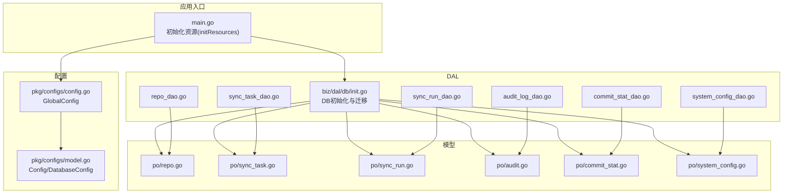

**图示来源**
- [main.go](file://main.go#L115-L134)
- [init.go](file://biz/dal/db/init.go#L18-L71)
- [config.go](file://pkg/configs/config.go#L18-L42)
- [model.go](file://pkg/configs/model.go#L3-L34)

**章节来源**
- [main.go](file://main.go#L115-L134)
- [init.go](file://biz/dal/db/init.go#L18-L71)
- [config.go](file://pkg/configs/config.go#L18-L42)
- [model.go](file://pkg/configs/model.go#L3-L34)

## 核心组件
- 数据库初始化与迁移：根据配置选择SQLite/MySQL/Postgres驱动，自动迁移表结构，跳过已存在表的重复迁移。
- DAO层：每个DAO封装对单一实体的CRUD与领域查询，统一通过全局DB实例执行。
- GORM模型：通过结构体标签定义索引、外键、字段类型与表名；利用钩子实现敏感字段加解密。
- 配置驱动：通过配置文件与环境变量控制数据库类型、DSN或本地路径。

**章节来源**
- [init.go](file://biz/dal/db/init.go#L18-L71)
- [repo_dao.go](file://biz/dal/db/repo_dao.go#L13-L41)
- [sync_task_dao.go](file://biz/dal/db/sync_task_dao.go#L13-L66)
- [sync_run_dao.go](file://biz/dal/db/sync_run_dao.go#L13-L39)
- [audit_log_dao.go](file://biz/dal/db/audit_log_dao.go#L13-L45)
- [commit_stat_dao.go](file://biz/dal/db/commit_stat_dao.go#L16-L65)
- [system_config_dao.go](file://biz/dal/db/system_config_dao.go#L13-L42)
- [repo.go](file://biz/model/po/repo.go#L11-L24)
- [sync_task.go](file://biz/model/po/sync_task.go#L7-L24)
- [sync_run.go](file://biz/model/po/sync_run.go#L9-L21)
- [audit.go](file://biz/model/po/audit.go#L7-L16)
- [commit_stat.go](file://biz/model/po/commit_stat.go#L9-L18)
- [system_config.go](file://biz/model/po/system_config.go#L3-L6)

## 架构总览
DAL层围绕GORM进行数据持久化，DAO类作为领域数据访问的门面，屏蔽具体SQL细节。初始化阶段完成数据库选择、连接与迁移；运行期通过DAO执行业务逻辑所需的读写操作。

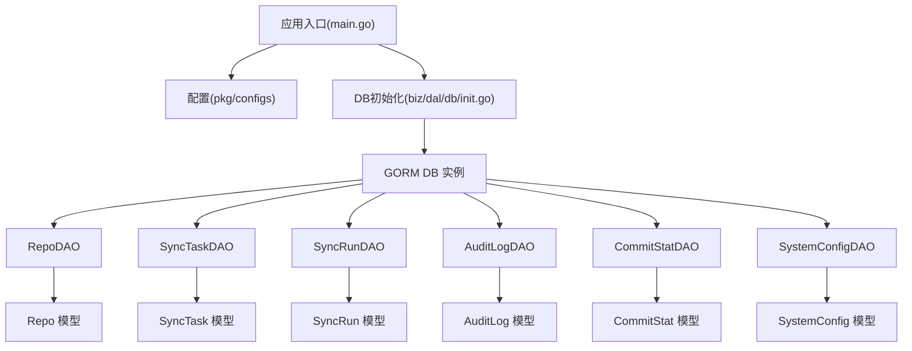

**图示来源**
- [main.go](file://main.go#L115-L134)
- [init.go](file://biz/dal/db/init.go#L18-L71)
- [repo_dao.go](file://biz/dal/db/repo_dao.go#L7-L11)
- [sync_task_dao.go](file://biz/dal/db/sync_task_dao.go#L7-L11)
- [sync_run_dao.go](file://biz/dal/db/sync_run_dao.go#L7-L11)
- [audit_log_dao.go](file://biz/dal/db/audit_log_dao.go#L7-L11)
- [commit_stat_dao.go](file://biz/dal/db/commit_stat_dao.go#L10-L14)
- [system_config_dao.go](file://biz/dal/db/system_config_dao.go#L7-L11)

## 详细组件分析

### 数据库初始化与连接管理
- 支持数据库类型：sqlite、mysql、postgres。默认sqlite，可通过配置切换。
- DSN优先：若配置提供DSN则直接使用；否则根据Host/User/Port等拼接默认DSN。
- 连接建立：使用gorm.Open创建全局DB实例。
- 迁移策略：检测关键表是否存在，若均存在则跳过迁移；否则执行AutoMigrate。
- 多数据库支持：通过配置中的type与DSN/Path字段动态选择dialector。

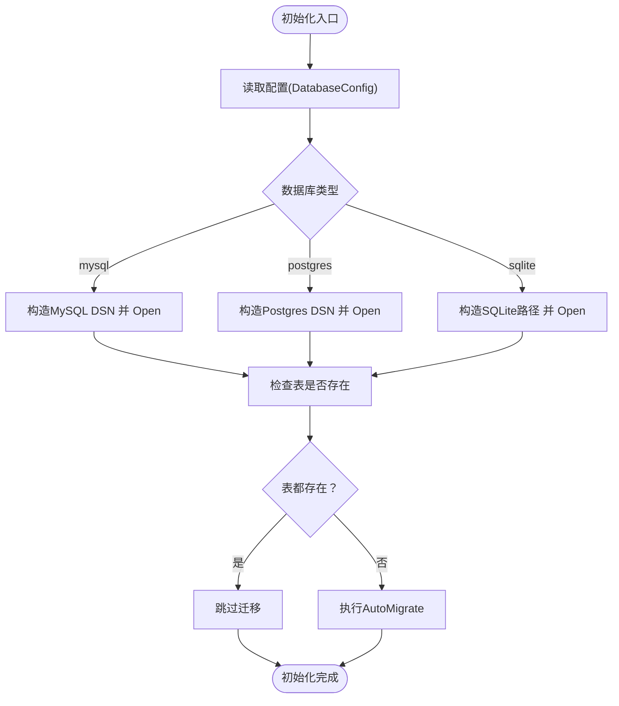

**图示来源**
- [init.go](file://biz/dal/db/init.go#L18-L71)
- [model.go](file://pkg/configs/model.go#L18-L27)

**章节来源**
- [init.go](file://biz/dal/db/init.go#L18-L71)
- [model.go](file://pkg/configs/model.go#L18-L27)

### RepoDAO：仓库数据访问
- 职责：仓库的创建、全量查询、按key/路径查询、保存、删除。
- 关键点：FindByKey/FindByPath基于唯一索引字段查询；Save用于更新；Delete物理删除。
- 适用场景：仓库注册、检索、变更与清理。

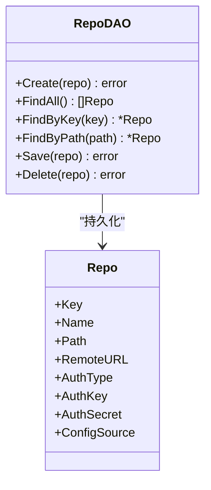

**图示来源**
- [repo_dao.go](file://biz/dal/db/repo_dao.go#L7-L41)
- [repo.go](file://biz/model/po/repo.go#L11-L24)

**章节来源**
- [repo_dao.go](file://biz/dal/db/repo_dao.go#L13-L41)
- [repo.go](file://biz/model/po/repo.go#L11-L24)

### SyncTaskDAO：同步任务数据访问
- 职责：任务创建、带关联预加载的列表、按仓库key过滤、按key查询、保存、删除、统计与键值提取。
- 关键点：FindAllWithRepos使用Preload加载源/目标仓库；FindByRepoKey同时匹配源与目标仓库key；CountByRepoKey与GetKeysByRepoKey用于任务聚合与去重。
- 适用场景：任务列表、启用+定时任务筛选、任务与仓库关联展示。

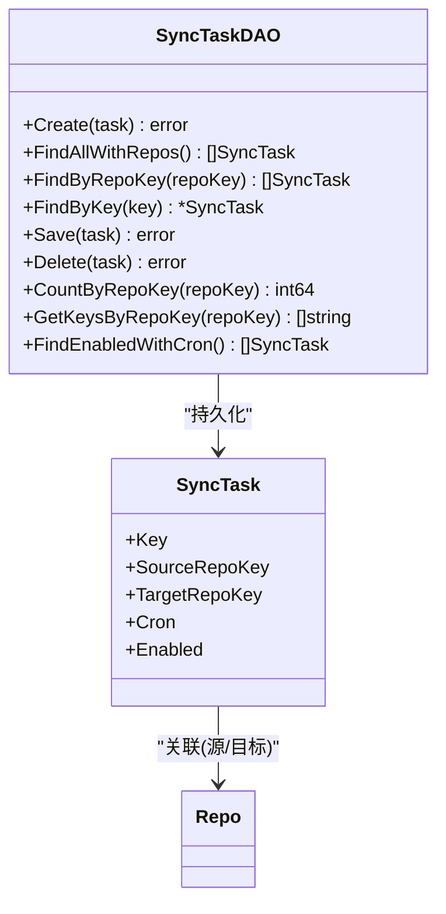

**图示来源**
- [sync_task_dao.go](file://biz/dal/db/sync_task_dao.go#L7-L66)
- [sync_task.go](file://biz/model/po/sync_task.go#L7-L24)
- [repo.go](file://biz/model/po/repo.go#L11-L24)

**章节来源**
- [sync_task_dao.go](file://biz/dal/db/sync_task_dao.go#L13-L66)
- [sync_task.go](file://biz/model/po/sync_task.go#L7-L24)

### SyncRunDAO：同步运行记录数据访问
- 职责：运行记录创建、保存、最近记录查询、按任务keys分页查询、删除。
- 关键点：FindLatest按开始时间倒序并限制数量；FindByTaskKeys支持IN查询并限制结果集；Preload关联任务信息。
- 适用场景：同步历史列表、按任务筛选历史、最新状态概览。

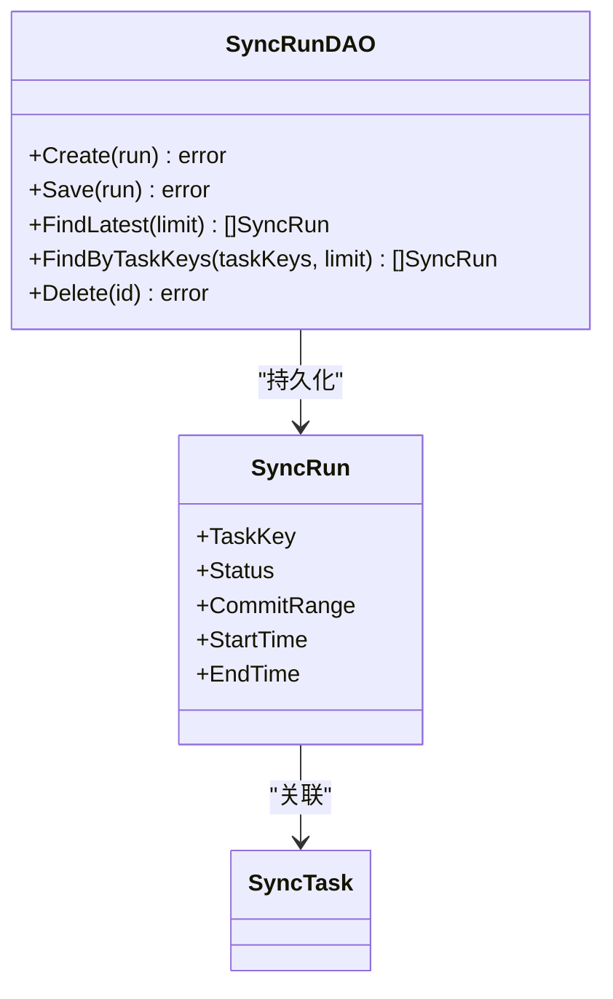

**图示来源**
- [sync_run_dao.go](file://biz/dal/db/sync_run_dao.go#L7-L39)
- [sync_run.go](file://biz/model/po/sync_run.go#L9-L21)
- [sync_task.go](file://biz/model/po/sync_task.go#L7-L24)

**章节来源**
- [sync_run_dao.go](file://biz/dal/db/sync_run_dao.go#L13-L39)
- [sync_run.go](file://biz/model/po/sync_run.go#L9-L21)

### AuditLogDAO：审计日志数据访问
- 职责：审计日志创建、最近日志查询、总数统计、分页查询（排除大字段）、按ID查询。
- 关键点：FindPage显式指定列以避免传输details大字段，提升列表性能；Order+Limit+Offset实现分页。
- 适用场景：审计列表、详情查看、总量统计。

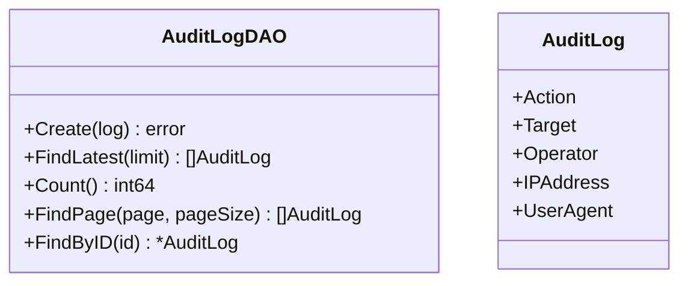

**图示来源**
- [audit_log_dao.go](file://biz/dal/db/audit_log_dao.go#L7-L45)
- [audit.go](file://biz/model/po/audit.go#L7-L16)

**章节来源**
- [audit_log_dao.go](file://biz/dal/db/audit_log_dao.go#L13-L45)
- [audit.go](file://biz/model/po/audit.go#L7-L16)

### CommitStatDAO：提交统计数据访问
- 职责：查询某仓库最新提交时间、批量保存（冲突时更新指定字段）、按仓库与哈希集合查询已存在的统计。
- 关键点：BatchSave使用OnConflict按复合唯一索引执行UPSERT；GetByRepoAndHashes分批查询避免IN参数过大。
- 适用场景：增量统计同步、去重与合并。

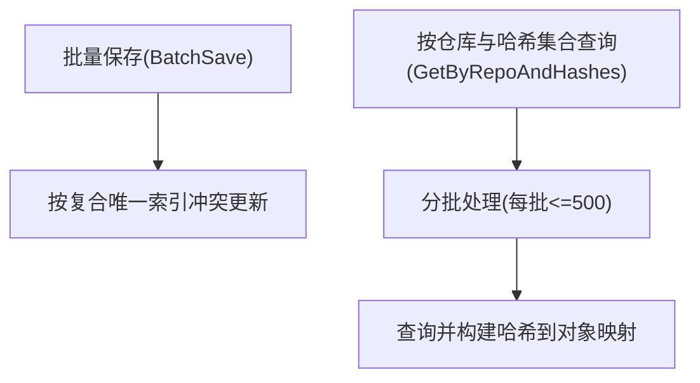

**图示来源**
- [commit_stat_dao.go](file://biz/dal/db/commit_stat_dao.go#L16-L65)
- [commit_stat.go](file://biz/model/po/commit_stat.go#L9-L18)

**章节来源**
- [commit_stat_dao.go](file://biz/dal/db/commit_stat_dao.go#L16-L65)
- [commit_stat.go](file://biz/model/po/commit_stat.go#L9-L18)

### SystemConfigDAO：系统配置数据访问
- 职责：按key获取配置、设置配置、获取全部配置。
- 关键点：Key为主键；SetConfig通过Save实现新增或更新。
- 适用场景：系统参数读取与更新。

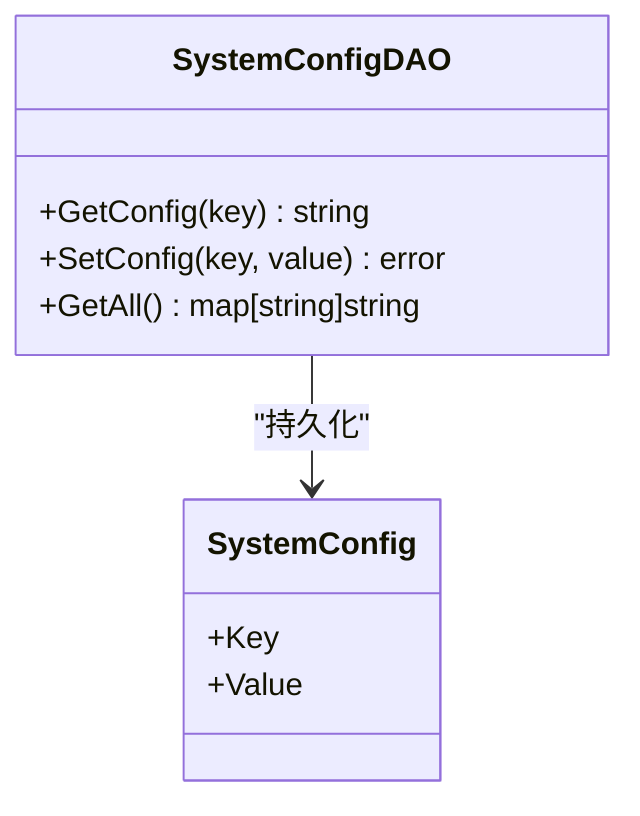

**图示来源**
- [system_config_dao.go](file://biz/dal/db/system_config_dao.go#L7-L42)
- [system_config.go](file://biz/model/po/system_config.go#L3-L6)

**章节来源**
- [system_config_dao.go](file://biz/dal/db/system_config_dao.go#L13-L42)
- [system_config.go](file://biz/model/po/system_config.go#L3-L6)

### GORM模型与关联、索引与查询构建
- 表名：各模型通过TableName自定义表名，确保与迁移一致。
- 关联：SyncTask与Repo之间通过foreignKey与references建立外键关联；SyncRun与SyncTask通过TaskKey与Key关联。
- 索引：Repo的Key/Name设为唯一索引；AuditLog的Action/Target建有普通索引；CommitStat对(RepoID,CommitHash)建复合唯一索引并为AuthorEmail/CommitTime建索引。
- 查询：DAO层广泛使用Where/Order/Limit/Preload/Model/Count/Pluck/Select等链式API；复杂查询通过条件组合与分页实现。

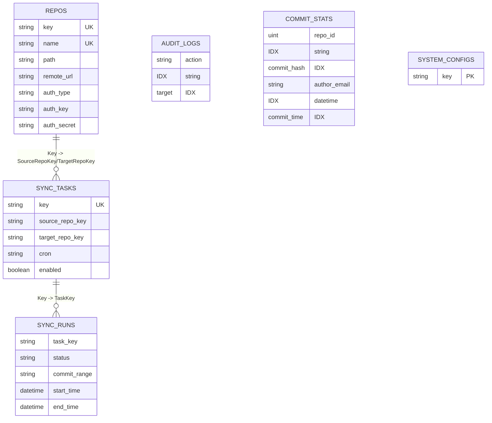

**图示来源**
- [repo.go](file://biz/model/po/repo.go#L11-L24)
- [sync_task.go](file://biz/model/po/sync_task.go#L7-L24)
- [sync_run.go](file://biz/model/po/sync_run.go#L9-L21)
- [audit.go](file://biz/model/po/audit.go#L7-L16)
- [commit_stat.go](file://biz/model/po/commit_stat.go#L9-L18)
- [system_config.go](file://biz/model/po/system_config.go#L3-L6)

**章节来源**
- [repo.go](file://biz/model/po/repo.go#L11-L24)
- [sync_task.go](file://biz/model/po/sync_task.go#L7-L24)
- [sync_run.go](file://biz/model/po/sync_run.go#L9-L21)
- [audit.go](file://biz/model/po/audit.go#L7-L16)
- [commit_stat.go](file://biz/model/po/commit_stat.go#L9-L18)
- [system_config.go](file://biz/model/po/system_config.go#L3-L6)

### 典型CRUD与复杂查询示例（路径）
- 创建/保存/删除
  - 仓库：Create/Save/Delete（参考路径：[repo_dao.go](file://biz/dal/db/repo_dao.go#L13-L41)）
  - 任务：Create/Save/Delete（参考路径：[sync_task_dao.go](file://biz/dal/db/sync_task_dao.go#L13-L44)）
  - 运行记录：Create/Save/Delete（参考路径：[sync_run_dao.go](file://biz/dal/db/sync_run_dao.go#L13-L39)）
  - 审计日志：Create（参考路径：[audit_log_dao.go](file://biz/dal/db/audit_log_dao.go#L13-L15)）
  - 提交统计：BatchSave（参考路径：[commit_stat_dao.go](file://biz/dal/db/commit_stat_dao.go#L27-L36)）
  - 系统配置：GetConfig/SetConfig/GetAll（参考路径：[system_config_dao.go](file://biz/dal/db/system_config_dao.go#L13-L42)）
- 复杂查询
  - 带关联的列表：FindAllWithRepos（参考路径：[sync_task_dao.go](file://biz/dal/db/sync_task_dao.go#L17-L21)）
  - 按仓库key过滤：FindByRepoKey（参考路径：[sync_task_dao.go](file://biz/dal/db/sync_task_dao.go#L23-L29)）
  - 统计与键值提取：CountByRepoKey/GetKeysByRepoKey（参考路径：[sync_task_dao.go](file://biz/dal/db/sync_task_dao.go#L46-L60)）
  - 最近运行记录：FindLatest（参考路径：[sync_run_dao.go](file://biz/dal/db/sync_run_dao.go#L21-L25)）
  - 分页列表（排除大字段）：FindPage（参考路径：[audit_log_dao.go](file://biz/dal/db/audit_log_dao.go#L29-L39)）
  - 批量去重查询：GetByRepoAndHashes（参考路径：[commit_stat_dao.go](file://biz/dal/db/commit_stat_dao.go#L39-L65)）

**章节来源**
- [repo_dao.go](file://biz/dal/db/repo_dao.go#L13-L41)
- [sync_task_dao.go](file://biz/dal/db/sync_task_dao.go#L17-L66)
- [sync_run_dao.go](file://biz/dal/db/sync_run_dao.go#L21-L39)
- [audit_log_dao.go](file://biz/dal/db/audit_log_dao.go#L29-L39)
- [commit_stat_dao.go](file://biz/dal/db/commit_stat_dao.go#L39-L65)
- [system_config_dao.go](file://biz/dal/db/system_config_dao.go#L13-L42)

## 依赖分析
- 入口依赖：main.go依赖配置加载与DB初始化；DB初始化依赖配置模型与GORM驱动。
- DAO依赖：各DAO依赖对应PO模型；DAO间无直接耦合，仅依赖全局DB实例。
- 模型依赖：PO模型定义表结构、索引与关联；Repo模型通过钩子实现敏感字段加解密。

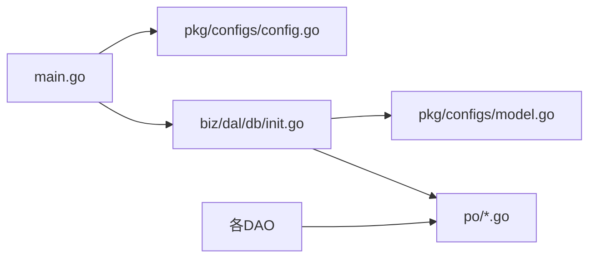

**图示来源**
- [main.go](file://main.go#L115-L134)
- [init.go](file://biz/dal/db/init.go#L18-L71)
- [config.go](file://pkg/configs/config.go#L18-L42)
- [model.go](file://pkg/configs/model.go#L3-L34)

**章节来源**
- [main.go](file://main.go#L115-L134)
- [init.go](file://biz/dal/db/init.go#L18-L71)
- [config.go](file://pkg/configs/config.go#L18-L42)
- [model.go](file://pkg/configs/model.go#L3-L34)

## 性能考虑
- 列裁剪与分页：审计列表使用Select仅取必要列，结合Order+Limit+Offset实现分页，降低网络与解析开销（参考路径：[audit_log_dao.go](file://biz/dal/db/audit_log_dao.go#L29-L39)）。
- 预加载与N+1：关联查询使用Preload减少N+1查询（参考路径：[sync_task_dao.go](file://biz/dal/db/sync_task_dao.go#L17-L21)，[sync_run_dao.go](file://biz/dal/db/sync_run_dao.go#L21-L25)）。
- 批量写入：提交统计使用CreateInBatches与OnConflict实现高吞吐UPSERT（参考路径：[commit_stat_dao.go](file://biz/dal/db/commit_stat_dao.go#L27-L36)）。
- 分批查询：按哈希集合查询时按固定块大小分批，避免IN参数过大（参考路径：[commit_stat_dao.go](file://biz/dal/db/commit_stat_dao.go#L44-L62)）。
- 索引设计：针对高频查询字段建立索引（如AuditLog的Action/Target、CommitStat的复合唯一索引与AuthorEmail/CommitTime索引）。

**章节来源**
- [audit_log_dao.go](file://biz/dal/db/audit_log_dao.go#L29-L39)
- [sync_task_dao.go](file://biz/dal/db/sync_task_dao.go#L17-L21)
- [sync_run_dao.go](file://biz/dal/db/sync_run_dao.go#L21-L25)
- [commit_stat_dao.go](file://biz/dal/db/commit_stat_dao.go#L27-L36)
- [commit_stat_dao.go](file://biz/dal/db/commit_stat_dao.go#L44-L62)

## 故障排查指南
- 连接失败
  - 检查配置类型与DSN/Path是否正确（参考路径：[init.go](file://biz/dal/db/init.go#L24-L47)；[model.go](file://pkg/configs/model.go#L18-L27)）。
  - 查看初始化日志输出，确认是否触发致命错误（参考路径：[init.go](file://biz/dal/db/init.go#L50-L52)）。
- 迁移失败
  - 确认数据库权限与表空间；查看迁移错误日志（参考路径：[init.go](file://biz/dal/db/init.go#L67-L70)）。
- 查询异常
  - 审核列表性能问题：确认是否使用了Select裁剪与分页（参考路径：[audit_log_dao.go](file://biz/dal/db/audit_log_dao.go#L29-L39)）。
  - 关联查询慢：确认是否使用Preload及索引是否覆盖查询条件（参考路径：[sync_task_dao.go](file://biz/dal/db/sync_task_dao.go#L17-L21)）。
- 写入异常
  - 批量写入冲突：检查OnConflict配置与唯一索引是否匹配（参考路径：[commit_stat_dao.go](file://biz/dal/db/commit_stat_dao.go#L32-L35)）。
  - 密钥解密失败：检查加密工具初始化与密文格式（参考路径：[repo.go](file://biz/model/po/repo.go#L30-L62)）。

**章节来源**
- [init.go](file://biz/dal/db/init.go#L24-L47)
- [init.go](file://biz/dal/db/init.go#L50-L52)
- [init.go](file://biz/dal/db/init.go#L67-L70)
- [audit_log_dao.go](file://biz/dal/db/audit_log_dao.go#L29-L39)
- [sync_task_dao.go](file://biz/dal/db/sync_task_dao.go#L17-L21)
- [commit_stat_dao.go](file://biz/dal/db/commit_stat_dao.go#L32-L35)
- [repo.go](file://biz/model/po/repo.go#L30-L62)

## 结论
本DAL层以DAO模式清晰分离职责，依托GORM实现模型化与关联查询，配合合理的索引与查询策略，在多数据库类型下保持可移植性与高性能。通过批量写入、列裁剪与分页等手段有效优化I/O与网络开销，满足审计、同步与统计等场景需求。

## 附录
- 初始化调用链：main.go -> initResources -> configs.Init -> db.Init
- 配置项要点：database.type/dsn/path/host/port/user/password/dbname

**章节来源**
- [main.go](file://main.go#L115-L134)
- [config.go](file://pkg/configs/config.go#L18-L42)
- [model.go](file://pkg/configs/model.go#L18-L27)