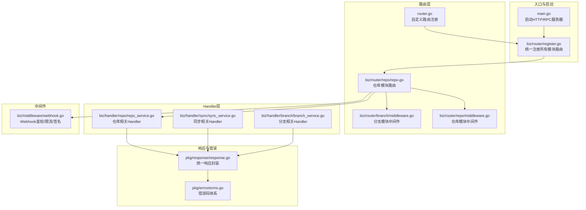
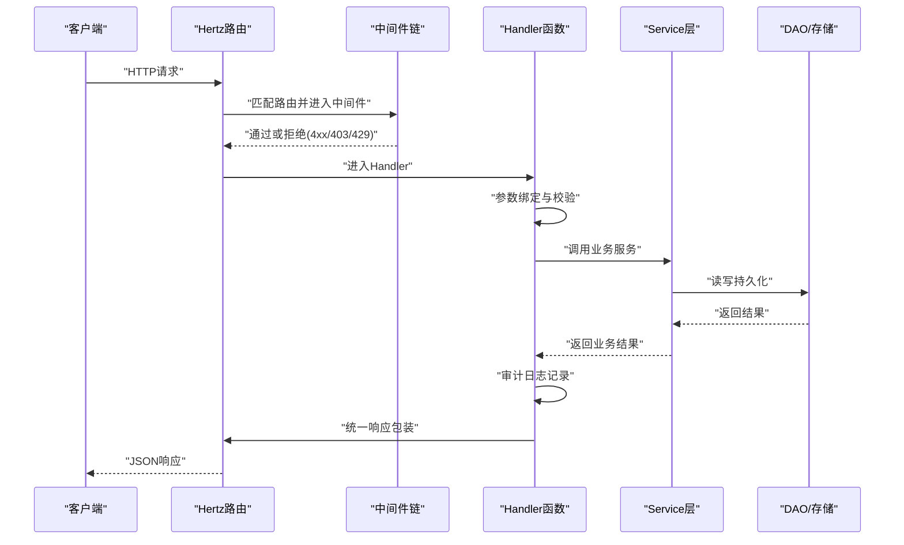
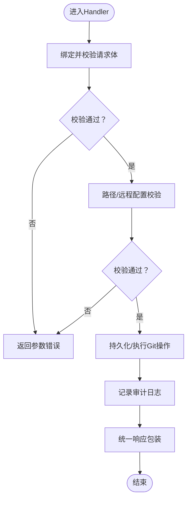
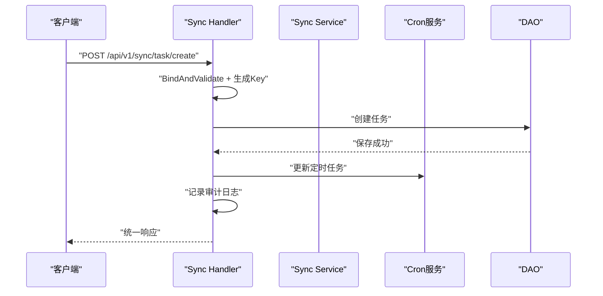
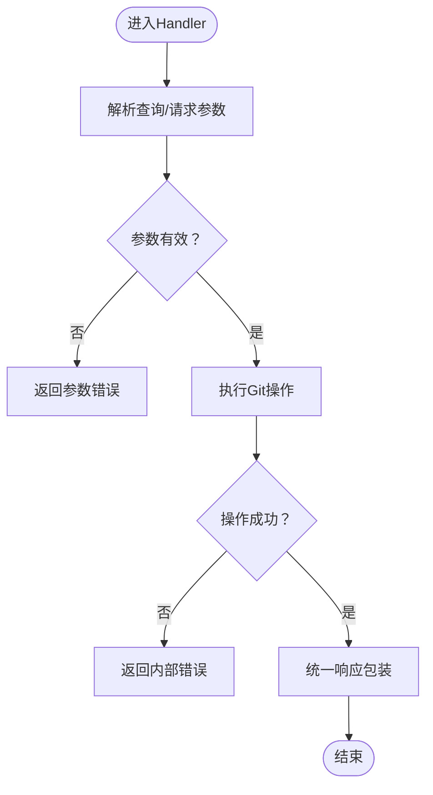
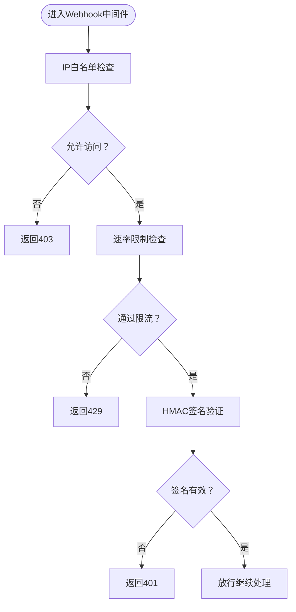
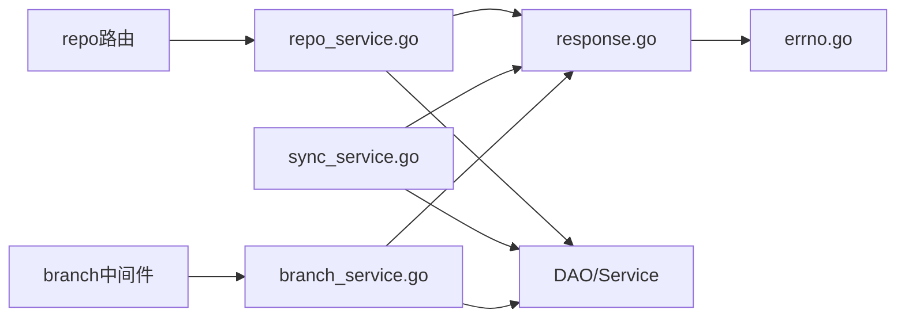

# Handler层设计

<cite>
**本文引用的文件**
- [main.go](file://main.go)
- [router.go](file://router.go)
- [biz/router/register.go](file://biz/router/register.go)
- [pkg/response/response.go](file://pkg/response/response.go)
- [pkg/errno/errno.go](file://pkg/errno/errno.go)
- [biz/handler/repo/repo_service.go](file://biz/handler/repo/repo_service.go)
- [biz/handler/sync/sync_service.go](file://biz/handler/sync/sync_service.go)
- [biz/handler/branch/branch_service.go](file://biz/handler/branch/branch_service.go)
- [biz/middleware/webhook.go](file://biz/middleware/webhook.go)
- [biz/router/repo/repo.go](file://biz/router/repo/repo.go)
- [biz/router/branch/middleware.go](file://biz/router/branch/middleware.go)
- [biz/router/repo/middleware.go](file://biz/router/repo/middleware.go)
- [biz/model/api/repo.go](file://biz/model/api/repo.go)
- [biz/model/api/sync.go](file://biz/model/api/sync.go)
- [biz/model/api/branch.go](file://biz/model/api/branch.go)
</cite>

## 目录
1. [简介](#简介)
2. [项目结构](#项目结构)
3. [核心组件](#核心组件)
4. [架构总览](#架构总览)
5. [详细组件分析](#详细组件分析)
6. [依赖分析](#依赖分析)
7. [性能考虑](#性能考虑)
8. [故障排查指南](#故障排查指南)
9. [结论](#结论)
10. [附录](#附录)

## 简介
本设计文档聚焦于Git管理服务的Handler层，阐述其作为HTTP请求入口的设计理念与实现细节。Handler层负责：
- 请求参数绑定与验证：统一使用框架提供的绑定与校验能力，并结合业务规则进行二次校验。
- 响应格式标准化：通过统一的响应包装器输出一致的JSON结构，便于前端消费与错误处理。
- 中间件集成：在路由层面挂载认证、限流、签名等中间件，保障安全与稳定性。
- 与Service层协作：Handler仅做薄层编排，将业务逻辑委托给Service层，确保职责清晰与可测试性。

Handler层覆盖仓库管理、同步服务、分支管理等核心业务模块，通过路由注册集中管理，形成清晰的REST风格接口体系。

## 项目结构
Handler层位于biz/handler目录下，按业务域划分子包（如repo、sync、branch），每个子包内包含对应的服务处理器函数。路由注册集中在biz/router中，通过分组与中间件链路组织HTTP端点。

图表来源
- [main.go](file://main.go#L136-L152)
- [biz/router/register.go](file://biz/router/register.go#L18-L41)
- [router.go](file://router.go#L10-L15)
- [biz/router/repo/repo.go](file://biz/router/repo/repo.go#L17-L38)
- [biz/handler/repo/repo_service.go](file://biz/handler/repo/repo_service.go#L21-L371)
- [biz/handler/sync/sync_service.go](file://biz/handler/sync/sync_service.go#L19-L258)
- [biz/handler/branch/branch_service.go](file://biz/handler/branch/branch_service.go#L22-L522)
- [pkg/response/response.go](file://pkg/response/response.go#L9-L87)
- [pkg/errno/errno.go](file://pkg/errno/errno.go#L7-L129)
- [biz/middleware/webhook.go](file://biz/middleware/webhook.go#L18-L70)

章节来源
- [main.go](file://main.go#L136-L152)
- [biz/router/register.go](file://biz/router/register.go#L18-L41)
- [router.go](file://router.go#L10-L15)
- [biz/router/repo/repo.go](file://biz/router/repo/repo.go#L17-L38)

## 核心组件
- 统一响应包装器：提供Success、Accepted、Error、BadRequest、NotFound、InternalServerError、Unauthorized、Forbidden、Conflict等方法，保证前后端一致的响应结构。
- 错误码体系：以ErrNo为核心，内置通用与业务域错误码，支持转换与消息定制。
- Handler函数：每个业务模块的HTTP入口，完成参数绑定/校验、调用Service、审计日志记录与响应返回。
- 路由注册：按/api/v1/{module}组织，分组挂载中间件，统一静态资源与根路径重定向。
- 中间件：提供Webhook鉴权（IP白名单、速率限制、签名验证）等安全控制。

章节来源
- [pkg/response/response.go](file://pkg/response/response.go#L9-L87)
- [pkg/errno/errno.go](file://pkg/errno/errno.go#L7-L129)
- [biz/handler/repo/repo_service.go](file://biz/handler/repo/repo_service.go#L21-L371)
- [biz/handler/sync/sync_service.go](file://biz/handler/sync/sync_service.go#L19-L258)
- [biz/handler/branch/branch_service.go](file://biz/handler/branch/branch_service.go#L22-L522)
- [biz/router/register.go](file://biz/router/register.go#L18-L41)
- [biz/middleware/webhook.go](file://biz/middleware/webhook.go#L18-L70)

## 架构总览
Handler层采用“路由-中间件-处理器-服务-数据访问”的分层结构，请求从Hertz路由进入，经过中间件链，到达具体Handler，Handler再调用Service执行业务逻辑，最终通过统一响应包装器返回结果。

图表来源
- [biz/router/register.go](file://biz/router/register.go#L18-L41)
- [biz/handler/repo/repo_service.go](file://biz/handler/repo/repo_service.go#L54-L126)
- [pkg/response/response.go](file://pkg/response/response.go#L17-L87)

## 详细组件分析

### 仓库管理（repo）Handler
职责与流程
- 列表/详情：从DAO查询仓库列表或单个仓库，返回DTO。
- 新增/更新：绑定并校验请求体，进行路径合法性检查，必要时同步远程配置；持久化后触发异步统计同步。
- 删除：校验是否被同步任务使用，避免破坏性删除。
- 扫描/克隆/拉取/任务查询：对Git操作进行封装，支持进度上报与异步任务管理。

参数绑定与校验
- 使用c.BindAndValidate进行结构体绑定与校验。
- 对关键字段（如路径、密钥、远程URL）进行额外业务校验（例如路径必须是Git仓库）。

响应与错误
- 成功统一使用Success；失败使用BadRequest、NotFound、InternalServerError等。
- 审计日志在关键操作后记录，便于追踪。

图表来源
- [biz/handler/repo/repo_service.go](file://biz/handler/repo/repo_service.go#L54-L126)
- [pkg/response/response.go](file://pkg/response/response.go#L58-L87)

章节来源
- [biz/handler/repo/repo_service.go](file://biz/handler/repo/repo_service.go#L21-L371)
- [biz/router/repo/repo.go](file://biz/router/repo/repo.go#L17-L38)
- [biz/router/repo/middleware.go](file://biz/router/repo/middleware.go#L24-L72)
- [biz/model/api/repo.go](file://biz/model/api/repo.go#L10-L77)

### 同步服务（sync）Handler
职责与流程
- 任务列表/详情：支持按仓库过滤，关联查询仓库信息。
- 新增/更新/删除：创建唯一Key，持久化任务；更新/移除定时任务；删除时清理计划。
- 立即执行/一次性执行：异步运行同步任务，记录审计日志。

参数绑定与校验
- 使用c.BindAndValidate进行结构体绑定与校验。
- 关键查询参数（如任务Key、仓库Key）进行存在性校验。

响应与错误
- 成功统一使用Success；失败使用BadRequest、NotFound、InternalServerError等。
- 历史记录删除支持回退兼容（查询参数解析）。

图表来源
- [biz/handler/sync/sync_service.go](file://biz/handler/sync/sync_service.go#L62-L81)
- [pkg/response/response.go](file://pkg/response/response.go#L17-L87)

章节来源
- [biz/handler/sync/sync_service.go](file://biz/handler/sync/sync_service.go#L19-L258)
- [biz/model/api/sync.go](file://biz/model/api/sync.go#L9-L41)

### 分支管理（branch）Handler
职责与流程
- 列表：支持关键词过滤、分页、上游同步状态计算。
- 创建/删除/更新：封装Git操作，支持重命名与描述设置。
- 切换/推送/拉取：处理当前分支与上游关系，支持快进更新。
- 比较/差异/合并/补丁：提供差异统计、文件列表、预合并检查、冲突报告与补丁导出。

参数绑定与校验
- 多数场景使用c.BindAndValidate进行结构体绑定与校验。
- 特殊场景（如比较/差异/合并）对必填参数进行显式校验。

响应与错误
- 成功统一使用Success；失败使用BadRequest、NotFound、InternalServerError等。
- 合并冲突场景返回特定错误码与报告链接，便于前端引导用户处理。

图表来源
- [biz/handler/branch/branch_service.go](file://biz/handler/branch/branch_service.go#L22-L92)
- [pkg/response/response.go](file://pkg/response/response.go#L58-L87)

章节来源
- [biz/handler/branch/branch_service.go](file://biz/handler/branch/branch_service.go#L22-L522)
- [biz/model/api/branch.go](file://biz/model/api/branch.go#L3-L16)

### 中间件集成（Webhook）
Webhook中间件提供三层防护：
- IP白名单：允许指定来源IP访问。
- 速率限制：基于令牌桶算法限制请求频率。
- 签名验证：使用HMAC SHA256校验请求体完整性。

图表来源
- [biz/middleware/webhook.go](file://biz/middleware/webhook.go#L18-L70)

章节来源
- [biz/middleware/webhook.go](file://biz/middleware/webhook.go#L18-L70)

## 依赖分析
Handler层与各模块的耦合关系如下：
- Handler依赖统一响应包装器与错误码体系，确保错误处理一致性。
- Handler依赖DAO进行数据访问，部分场景依赖Service层（如Git、统计、同步）。
- 路由层通过中间件链注入安全与治理能力，Handler无需重复实现。

图表来源
- [biz/handler/repo/repo_service.go](file://biz/handler/repo/repo_service.go#L18-L371)
- [biz/handler/sync/sync_service.go](file://biz/handler/sync/sync_service.go#L16-L258)
- [biz/handler/branch/branch_service.go](file://biz/handler/branch/branch_service.go#L19-L522)
- [pkg/response/response.go](file://pkg/response/response.go#L9-L87)
- [pkg/errno/errno.go](file://pkg/errno/errno.go#L7-L129)
- [biz/router/repo/repo.go](file://biz/router/repo/repo.go#L17-L38)
- [biz/router/branch/middleware.go](file://biz/router/branch/middleware.go#L24-L92)

章节来源
- [biz/handler/repo/repo_service.go](file://biz/handler/repo/repo_service.go#L18-L371)
- [biz/handler/sync/sync_service.go](file://biz/handler/sync/sync_service.go#L16-L258)
- [biz/handler/branch/branch_service.go](file://biz/handler/branch/branch_service.go#L19-L522)
- [pkg/response/response.go](file://pkg/response/response.go#L9-L87)
- [pkg/errno/errno.go](file://pkg/errno/errno.go#L7-L129)
- [biz/router/repo/repo.go](file://biz/router/repo/repo.go#L17-L38)
- [biz/router/branch/middleware.go](file://biz/router/branch/middleware.go#L24-L92)

## 性能考虑
- 异步处理：仓库克隆、统计同步、同步任务执行均采用异步方式，避免阻塞HTTP请求线程。
- 进度上报：通过通道将Git操作进度回传至任务管理器，提升可观测性。
- 分页与过滤：分支列表支持关键词过滤与分页，降低前端渲染压力。
- 速率限制：Webhook中间件限制突发流量，防止恶意或异常请求冲击系统。

## 故障排查指南
常见问题与定位建议
- 参数错误（400）：检查请求体绑定与校验逻辑，确认必填字段与格式。
- 资源不存在（404）：核对Key/路径是否存在，DAO查询是否正确。
- 服务器内部错误（500）：查看服务层日志与Git操作返回值，定位底层异常。
- 权限相关（401/403）：确认Webhook签名、IP白名单与限流配置。
- 冲突（409）：分支合并冲突时，根据返回的报告链接与合并ID进行处理。

章节来源
- [pkg/response/response.go](file://pkg/response/response.go#L58-L87)
- [pkg/errno/errno.go](file://pkg/errno/errno.go#L31-L129)
- [biz/middleware/webhook.go](file://biz/middleware/webhook.go#L18-L70)

## 结论
Handler层通过统一的参数绑定与校验、标准化响应包装、中间件集成与清晰的模块化组织，实现了高内聚、低耦合的HTTP入口设计。配合Service层的业务编排与DAO的数据访问，形成了稳定、可扩展且易维护的架构。

## 附录
- 最佳实践
  - 在Handler中只做绑定、校验、调用与响应，不直接处理复杂业务。
  - 使用统一的响应包装器与错误码，保持前后端契约一致。
  - 对外部输入（如路径、URL、Key）进行双重校验（框架+业务）。
  - 对耗时操作采用异步化与进度上报，提升用户体验。
  - 在路由层集中挂载中间件，避免重复实现。
- 常见问题
  - 忘记绑定/校验导致空指针：统一使用c.BindAndValidate并在失败时返回BadRequest。
  - 响应格式不一致：始终通过Success/Error等方法输出。
  - 安全风险：启用Webhook中间件，严格校验签名与来源IP。
  - 合并冲突：遵循Handler返回的冲突信息与报告链接进行处理。