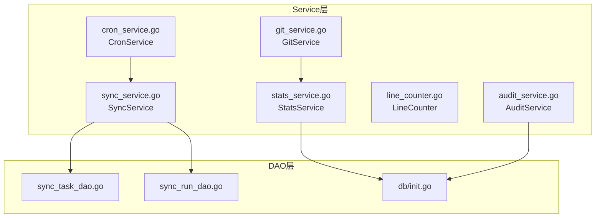
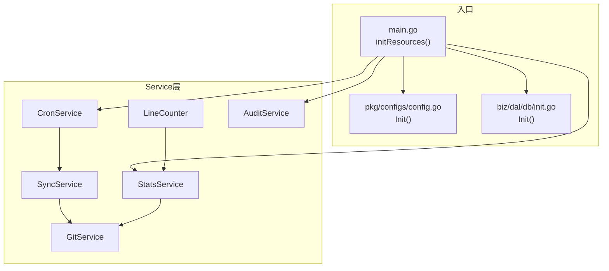
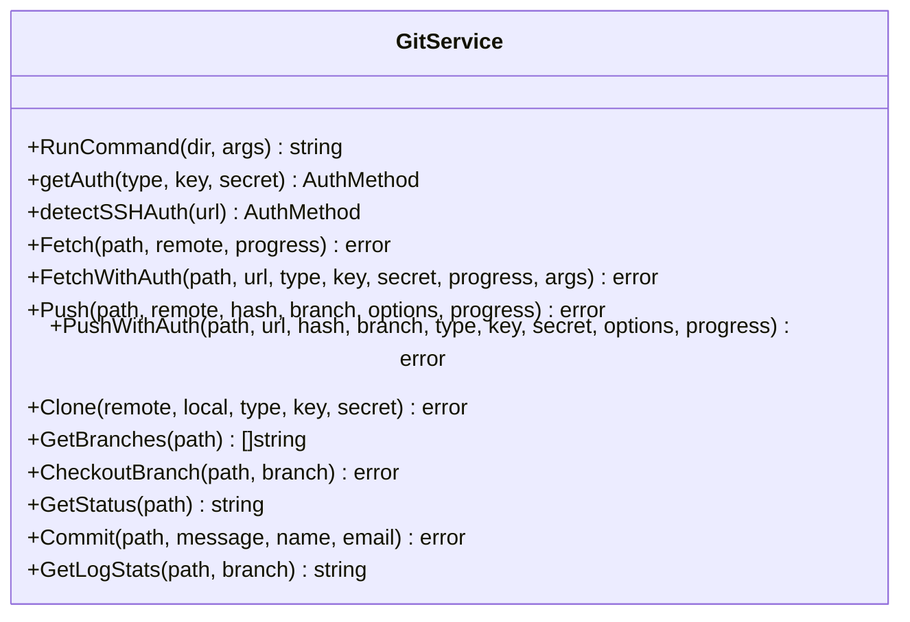
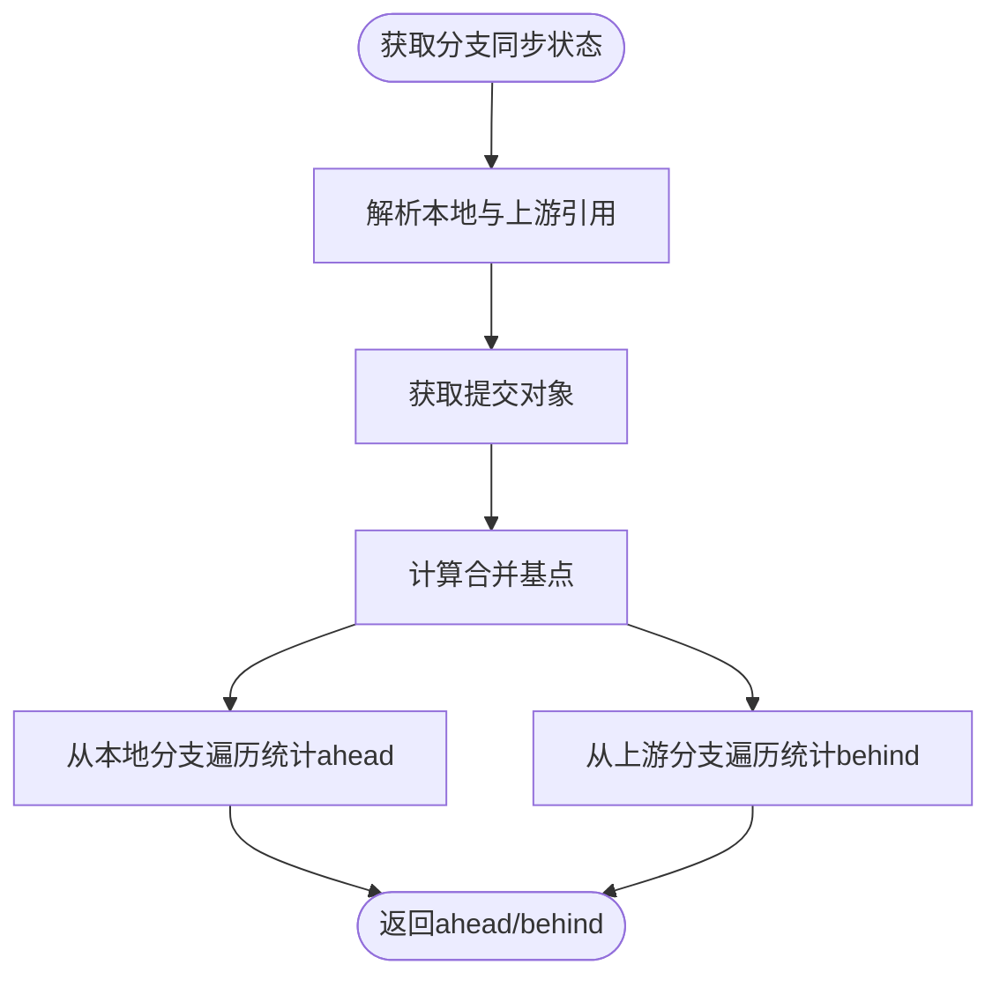
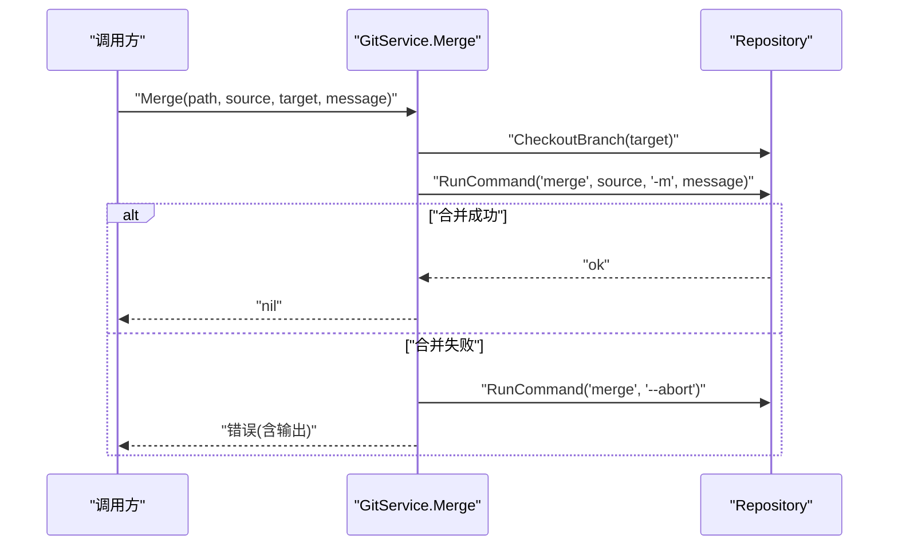
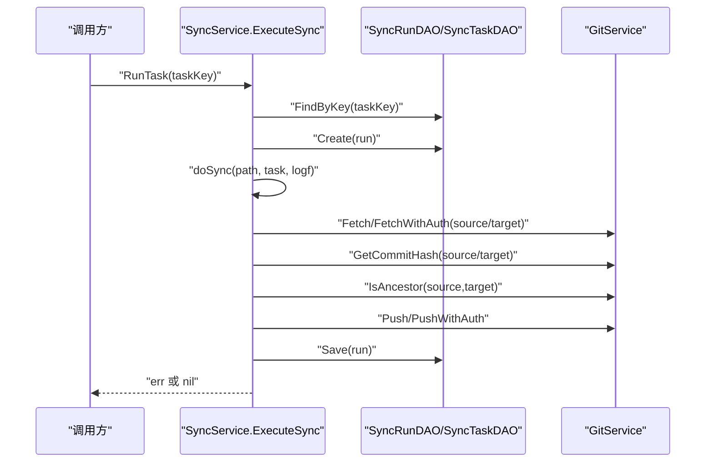
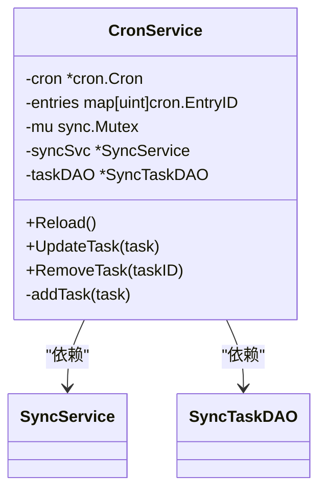
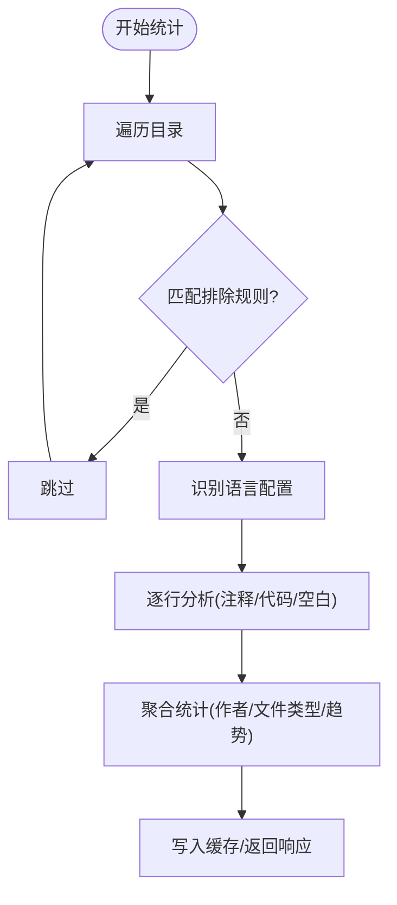
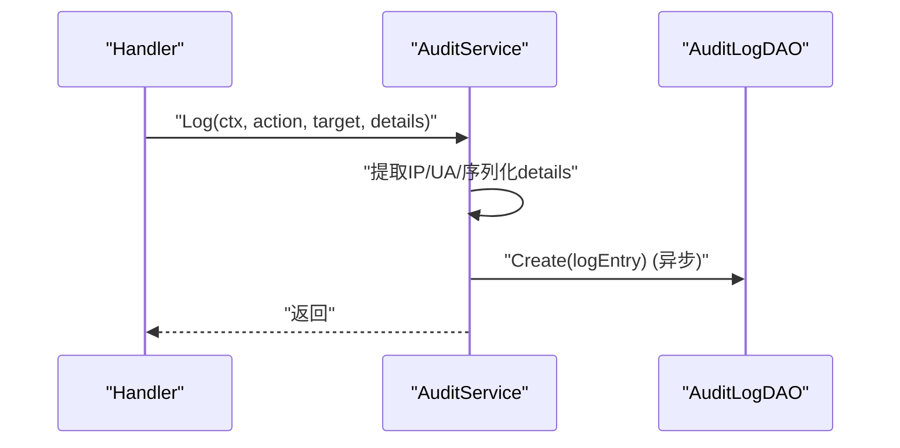
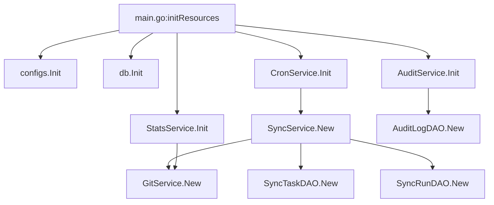

# Service层设计

<cite>
**本文档引用的文件**
- [main.go](file://main.go)
- [pkg/configs/config.go](file://pkg/configs/config.go)
- [biz/dal/db/init.go](file://biz/dal/db/init.go)
- [biz/service/git/git_service.go](file://biz/service/git/git_service.go)
- [biz/service/git/git_branch.go](file://biz/service/git/git_branch.go)
- [biz/service/git/git_merge.go](file://biz/service/git/git_merge.go)
- [biz/service/git/git_branch_sync.go](file://biz/service/git/git_branch_sync.go)
- [biz/service/sync/sync_service.go](file://biz/service/sync/sync_service.go)
- [biz/service/sync/cron_service.go](file://biz/service/sync/cron_service.go)
- [biz/dal/db/sync_task_dao.go](file://biz/dal/db/sync_task_dao.go)
- [biz/dal/db/sync_run_dao.go](file://biz/dal/db/sync_run_dao.go)
- [biz/service/stats/stats_service.go](file://biz/service/stats/stats_service.go)
- [biz/service/stats/language_config.go](file://biz/service/stats/language_config.go)
- [biz/service/stats/line_counter.go](file://biz/service/stats/line_counter.go)
- [biz/service/audit/audit_service.go](file://biz/service/audit/audit_service.go)
</cite>

## 目录
1. [引言](#引言)
2. [项目结构](#项目结构)
3. [核心组件](#核心组件)
4. [架构概览](#架构概览)
5. [详细组件分析](#详细组件分析)
6. [依赖关系分析](#依赖关系分析)
7. [性能考量](#性能考量)
8. [故障排查指南](#故障排查指南)
9. [结论](#结论)

## 引言
本设计文档聚焦于Git管理服务的Service层，系统性阐述其作为业务逻辑核心的设计原则与实现细节。Service层负责封装业务规则、协调多个DAO层操作、处理复杂流程（如仓库同步、分支合并、统计计算），并向上游Handler层提供稳定的服务接口。本文将结合具体代码文件，解释依赖注入模式、错误传播机制、事务管理策略以及与Handler层和DAO层的交互方式，并给出典型业务场景的执行流程图。

## 项目结构
Service层位于biz/service目录下，按功能划分为多个子模块：
- git：封装Git原生操作与go-git库的高级封装，提供分支、合并、差异、推送/拉取等能力
- sync：实现定时任务与仓库同步流程，协调DAO层持久化与Git操作
- stats：提供统计分析能力，包括提交统计、代码行统计与缓存机制
- audit：审计日志记录，异步写入DAO层

**图表来源**
- [biz/service/git/git_service.go](file://biz/service/git/git_service.go#L1-L1204)
- [biz/service/sync/sync_service.go](file://biz/service/sync/sync_service.go#L1-L263)
- [biz/service/sync/cron_service.go](file://biz/service/sync/cron_service.go#L1-L101)
- [biz/service/stats/stats_service.go](file://biz/service/stats/stats_service.go#L1-L372)
- [biz/service/stats/line_counter.go](file://biz/service/stats/line_counter.go#L1-L583)
- [biz/service/audit/audit_service.go](file://biz/service/audit/audit_service.go#L1-L51)
- [biz/dal/db/sync_task_dao.go](file://biz/dal/db/sync_task_dao.go#L1-L67)
- [biz/dal/db/sync_run_dao.go](file://biz/dal/db/sync_run_dao.go#L1-L40)
- [biz/dal/db/init.go](file://biz/dal/db/init.go#L1-L72)

**章节来源**
- [main.go](file://main.go#L115-L134)
- [pkg/configs/config.go](file://pkg/configs/config.go#L18-L42)

## 核心组件
- GitService：统一的Git操作入口，封装go-git与原生命令调用，提供远程认证、分支/提交/差异/推送/拉取等能力
- SyncService：执行仓库同步任务，协调GitService与DAO层，记录同步运行状态与日志
- CronService：基于cron表达式调度SyncService任务，动态增删任务条目
- StatsService：提供统计分析能力，支持缓存与并发控制，异步计算提交统计
- LineCounter：代码行统计器，支持按作者/时间过滤、语言识别与缓存
- AuditService：审计日志记录，异步持久化

**章节来源**
- [biz/service/git/git_service.go](file://biz/service/git/git_service.go#L27-L800)
- [biz/service/sync/sync_service.go](file://biz/service/sync/sync_service.go#L13-L74)
- [biz/service/sync/cron_service.go](file://biz/service/sync/cron_service.go#L14-L33)
- [biz/service/stats/stats_service.go](file://biz/service/stats/stats_service.go#L39-L50)
- [biz/service/stats/line_counter.go](file://biz/service/stats/line_counter.go#L20-L74)
- [biz/service/audit/audit_service.go](file://biz/service/audit/audit_service.go#L11-L50)

## 架构概览
Service层通过依赖注入在初始化阶段装配DAO与GitService实例，对外暴露稳定的业务方法。Handler层（HTTP/RPC）仅负责请求解析与响应封装，业务决策与流程编排全部由Service层完成。DAO层负责数据持久化，采用GORM进行表迁移与查询。

**图表来源**
- [main.go](file://main.go#L115-L134)
- [pkg/configs/config.go](file://pkg/configs/config.go#L18-L42)
- [biz/dal/db/init.go](file://biz/dal/db/init.go#L18-L71)
- [biz/service/sync/cron_service.go](file://biz/service/sync/cron_service.go#L24-L33)
- [biz/service/stats/stats_service.go](file://biz/service/stats/stats_service.go#L46-L50)
- [biz/service/audit/audit_service.go](file://biz/service/audit/audit_service.go#L17-L21)

## 详细组件分析

### GitService：Git操作与认证
- 设计要点
  - 统一封装go-git与原生命令调用，优先使用go-git；对不支持的功能保留命令调用路径
  - 自动检测SSH认证，支持从~/.ssh加载密钥与SSH Agent
  - 支持HTTP Basic Auth与SSH公钥认证
  - 提供分支/提交/差异/推送/拉取/克隆/检出等常用操作
- 关键方法
  - 认证与远程检测：getAuth、detectSSHAuth
  - 仓库操作：IsGitRepo、openRepo、GetRepoConfig、AddRemote、RemoveRemote、SetRemotePushURL
  - 拉取/推送：Fetch、FetchWithAuth、Push、PushWithAuth、PushCurrent、TestRemoteConnection
  - 分支与状态：GetBranches、CheckoutBranch、GetStatus、AddAll、Commit、Reset
  - 日志与统计：GetCommits、GetLogStats、GetLogStatsStream
- 错误处理
  - 对git.NoErrAlreadyUpToDate进行特殊处理，避免误判为错误
  - 原生命令返回错误时，附带输出便于诊断

**图表来源**
- [biz/service/git/git_service.go](file://biz/service/git/git_service.go#L33-L800)

**章节来源**
- [biz/service/git/git_service.go](file://biz/service/git/git_service.go#L50-L127)
- [biz/service/git/git_service.go](file://biz/service/git/git_service.go#L138-L191)
- [biz/service/git/git_service.go](file://biz/service/git/git_service.go#L292-L323)
- [biz/service/git/git_service.go](file://biz/service/git/git_service.go#L578-L592)
- [biz/service/git/git_service.go](file://biz/service/git/git_service.go#L594-L623)
- [biz/service/git/git_service.go](file://biz/service/git/git_service.go#L639-L665)
- [biz/service/git/git_service.go](file://biz/service/git/git_service.go#L781-L800)

### 分支与同步：分支信息、上游状态与推送/拉取
- 分支信息与描述
  - ListBranchesWithInfo：列出分支并填充最近提交信息与上游配置
  - Create/Delete/RenameBranch：分支的创建、删除与重命名
  - Get/SetBranchDescription：分支描述的读取与设置
- 上游同步状态
  - GetBranchSyncStatus：计算本地分支相对于上游的ahead/behind数量
  - PushBranch/PullBranch：推送与拉取分支
  - UpdateBranchFastForward：非当前分支的快进更新
  - FetchAll：批量拉取所有远程

**图表来源**
- [biz/service/git/git_branch_sync.go](file://biz/service/git/git_branch_sync.go#L14-L84)

**章节来源**
- [biz/service/git/git_branch.go](file://biz/service/git/git_branch.go#L13-L79)
- [biz/service/git/git_branch.go](file://biz/service/git/git_branch.go#L81-L149)
- [biz/service/git/git_branch_sync.go](file://biz/service/git/git_branch_sync.go#L14-L84)
- [biz/service/git/git_branch_sync.go](file://biz/service/git/git_branch_sync.go#L87-L150)
- [biz/service/git/git_branch_sync.go](file://biz/service/git/git_branch_sync.go#L152-L214)

### 合并与差异：冲突检测与补丁生成
- 差异与统计
  - GetDiffStat：统计变更文件数与增删行数
  - GetDiffFiles：列出变更文件及状态（新增/修改/删除/重命名）
  - GetRawDiff：输出统一格式的差异内容
- 合并流程
  - MergeDryRun：基于补丁对比检测潜在冲突文件
  - Merge：执行合并并在失败时自动回滚
  - GetPatch：生成两个提交间的补丁内容

**图表来源**
- [biz/service/git/git_merge.go](file://biz/service/git/git_merge.go#L157-L242)

**章节来源**
- [biz/service/git/git_merge.go](file://biz/service/git/git_merge.go#L21-L94)
- [biz/service/git/git_merge.go](file://biz/service/git/git_merge.go#L157-L242)
- [biz/service/git/git_merge.go](file://biz/service/git/git_merge.go#L244-L262)

### 同步服务：任务执行与运行记录
- 任务执行
  - RunTask：根据任务Key查询任务并执行
  - ExecuteSync：创建运行记录、捕获日志、执行doSync、保存最终状态
- 同步流程
  - doSync：分别拉取源与目标、比较提交范围、检查快进、执行推送
  - 认证选择：优先使用仓库级别的远程认证，否则回退到通用认证
  - 冲突处理：区分“目标落后”、“非快进”等不同错误语义

**图表来源**
- [biz/service/sync/sync_service.go](file://biz/service/sync/sync_service.go#L27-L74)
- [biz/service/sync/sync_service.go](file://biz/service/sync/sync_service.go#L85-L249)
- [biz/dal/db/sync_task_dao.go](file://biz/dal/db/sync_task_dao.go#L31-L36)
- [biz/dal/db/sync_run_dao.go](file://biz/dal/db/sync_run_dao.go#L13-L19)

**章节来源**
- [biz/service/sync/sync_service.go](file://biz/service/sync/sync_service.go#L13-L25)
- [biz/service/sync/sync_service.go](file://biz/service/sync/sync_service.go#L27-L74)
- [biz/service/sync/sync_service.go](file://biz/service/sync/sync_service.go#L85-L249)
- [biz/dal/db/sync_task_dao.go](file://biz/dal/db/sync_task_dao.go#L17-L36)
- [biz/dal/db/sync_run_dao.go](file://biz/dal/db/sync_run_dao.go#L21-L35)

### 定时调度：CronService
- 动态管理
  - Reload：清空旧条目并重新加载启用且配置了cron的任务
  - UpdateTask/RemoveTask：动态增删任务条目
- 执行机制
  - addTask：注册cron表达式，触发时调用SyncService.RunTask

**图表来源**
- [biz/service/sync/cron_service.go](file://biz/service/sync/cron_service.go#L14-L33)
- [biz/service/sync/cron_service.go](file://biz/service/sync/cron_service.go#L35-L57)
- [biz/service/sync/cron_service.go](file://biz/service/sync/cron_service.go#L84-L100)

**章节来源**
- [biz/service/sync/cron_service.go](file://biz/service/sync/cron_service.go#L14-L33)
- [biz/service/sync/cron_service.go](file://biz/service/sync/cron_service.go#L35-L57)
- [biz/service/sync/cron_service.go](file://biz/service/sync/cron_service.go#L59-L82)
- [biz/service/sync/cron_service.go](file://biz/service/sync/cron_service.go#L84-L100)

### 统计分析：提交统计与代码行统计
- 提交统计（StatsService）
  - SyncRepoStats：从上次checkpoint开始增量抓取提交，批量写入DAO
  - GetStats：缓存+并发控制，异步计算并返回进度
  - calculateStatsFast：使用git log --numstat流式解析，统计作者贡献与文件类型分布
- 代码行统计（LineCounter）
  - CountLines：遍历文件，按语言配置识别注释/空白/代码行，支持作者/时间过滤
  - 缓存机制：按配置生成缓存键，异步计算完成后写入缓存
  - 语言配置：内置多种语言的注释与字符串界定符，支持自定义排除目录与模式

**图表来源**
- [biz/service/stats/line_counter.go](file://biz/service/stats/line_counter.go#L153-L251)
- [biz/service/stats/line_counter.go](file://biz/service/stats/line_counter.go#L258-L371)
- [biz/service/stats/language_config.go](file://biz/service/stats/language_config.go#L289-L314)

**章节来源**
- [biz/service/stats/stats_service.go](file://biz/service/stats/stats_service.go#L52-L139)
- [biz/service/stats/stats_service.go](file://biz/service/stats/stats_service.go#L179-L227)
- [biz/service/stats/stats_service.go](file://biz/service/stats/stats_service.go#L245-L371)
- [biz/service/stats/line_counter.go](file://biz/service/stats/line_counter.go#L76-L111)
- [biz/service/stats/line_counter.go](file://biz/service/stats/line_counter.go#L113-L151)
- [biz/service/stats/line_counter.go](file://biz/service/stats/line_counter.go#L153-L251)
- [biz/service/stats/language_config.go](file://biz/service/stats/language_config.go#L289-L314)

### 审计服务：日志记录与持久化
- 设计要点
  - 异步写入：在Log方法中启动goroutine持久化，避免阻塞主流程
  - 信息采集：从请求上下文提取IP与UA，序列化详情
  - DAO集成：通过AuditLogDAO写入数据库

**图表来源**
- [biz/service/audit/audit_service.go](file://biz/service/audit/audit_service.go#L24-L50)

**章节来源**
- [biz/service/audit/audit_service.go](file://biz/service/audit/audit_service.go#L11-L50)

## 依赖关系分析
- 初始化顺序
  - main.initResources：加载配置、连接数据库、初始化加密、启动定时/统计/审计服务
  - 数据库初始化：根据配置选择MySQL/Postgres/SQLite，自动迁移表结构
- 依赖注入
  - CronService持有SyncService与SyncTaskDAO实例
  - SyncService持有GitService、SyncTaskDAO、SyncRunDAO实例
  - StatsService持有GitService与CommitStatDAO（通过DAO工厂）
  - AuditService持有AuditLogDAO实例
- 外部依赖
  - go-git：Git操作核心库
  - gorm：数据库ORM
  - cron：定时任务调度

**图表来源**
- [main.go](file://main.go#L115-L134)
- [biz/service/sync/cron_service.go](file://biz/service/sync/cron_service.go#L24-L33)
- [biz/service/sync/sync_service.go](file://biz/service/sync/sync_service.go#L19-L25)
- [biz/service/stats/stats_service.go](file://biz/service/stats/stats_service.go#L46-L50)
- [biz/service/audit/audit_service.go](file://biz/service/audit/audit_service.go#L17-L21)
- [biz/dal/db/init.go](file://biz/dal/db/init.go#L18-L71)

**章节来源**
- [main.go](file://main.go#L115-L134)
- [biz/dal/db/init.go](file://biz/dal/db/init.go#L18-L71)

## 性能考量
- 缓存与并发
  - StatsService与LineCounter均采用内存缓存与并发安全的数据结构，避免重复计算
  - 缓存键包含配置参数，确保不同参数组合的独立缓存
- 流式处理
  - StatsService使用git log --numstat的流式输出，减少内存占用
  - LineCounter使用bufio.Scanner并增大缓冲区，提升大文件处理效率
- 批量写入
  - StatsService在迭代过程中累积批次，降低数据库写入次数
- 异步持久化
  - AuditService与统计计算均采用异步写入，避免阻塞请求链路
- 资源清理
  - main中优雅关闭HTTP/RPC服务器，确保资源释放

[本节为通用性能建议，无需特定文件引用]

## 故障排查指南
- 同步失败
  - 检查SyncRunDAO中的运行记录，确认错误消息与状态（success/failed/conflict）
  - 若状态为conflict，需人工介入解决冲突后再执行
- 认证问题
  - GitService.detectSSHAuth会尝试常见密钥路径与SSH Agent；若失败，检查密钥权限与主机密钥回调
  - FetchWithAuth/PushWithAuth失败通常与认证类型/凭据有关
- 统计未更新
  - 检查StatsService缓存状态与进度，必要时等待异步计算完成
  - 确认数据库连接与表结构迁移已完成
- 审计缺失
  - 确认AuditService.Log已触发异步写入，检查DAO层是否正常

**章节来源**
- [biz/service/sync/sync_service.go](file://biz/service/sync/sync_service.go#L58-L73)
- [biz/service/git/git_service.go](file://biz/service/git/git_service.go#L67-L127)
- [biz/service/stats/stats_service.go](file://biz/service/stats/stats_service.go#L180-L227)
- [biz/service/audit/audit_service.go](file://biz/service/audit/audit_service.go#L44-L50)

## 结论
Service层通过清晰的职责划分与依赖注入，实现了业务规则封装、跨模块协调与可扩展的统计分析能力。GitService提供统一的Git操作抽象，SyncService与CronService保障仓库同步的可靠性与时效性，StatsService与LineCounter满足多样化的统计需求，AuditService确保操作可追溯。配合DAO层的持久化与main.go中的资源初始化，整体架构具备良好的可维护性与扩展性。