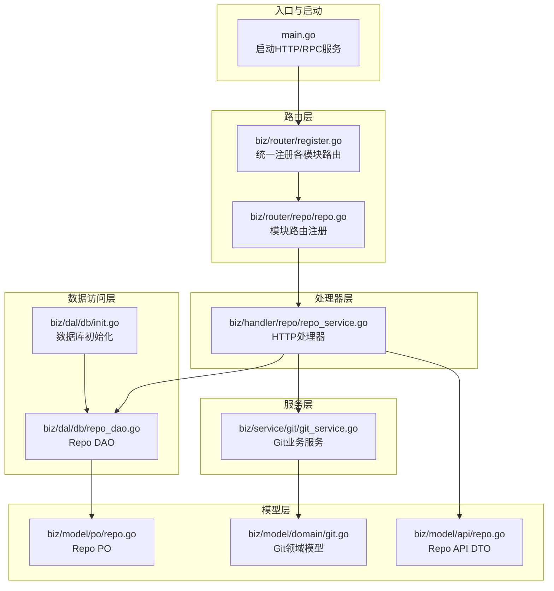
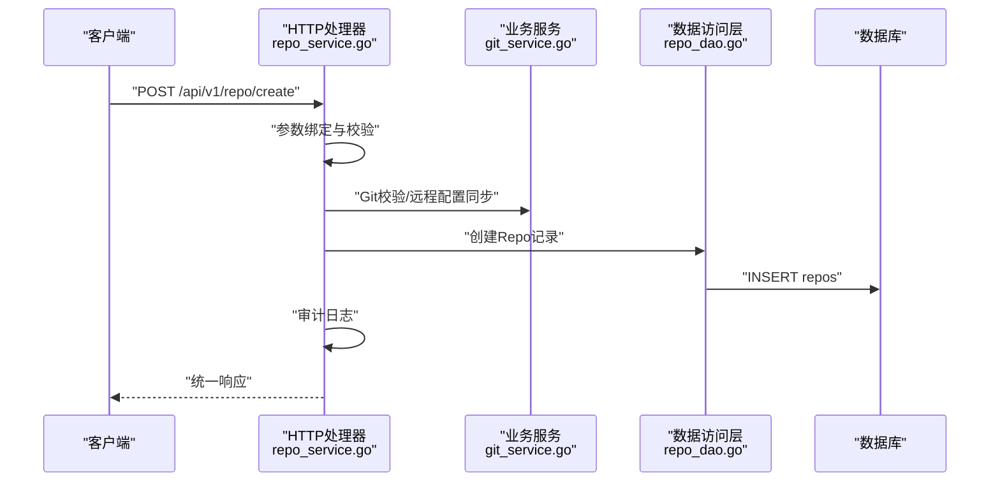
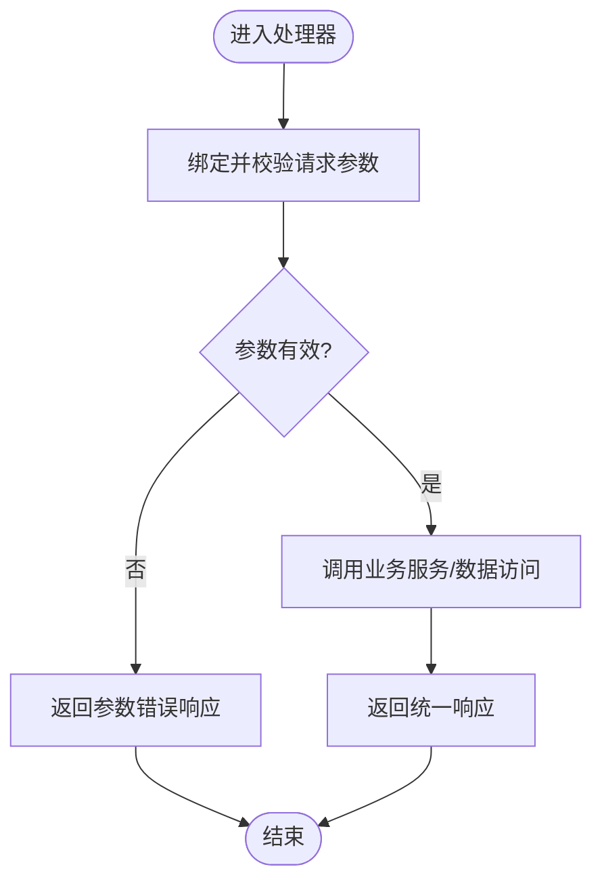
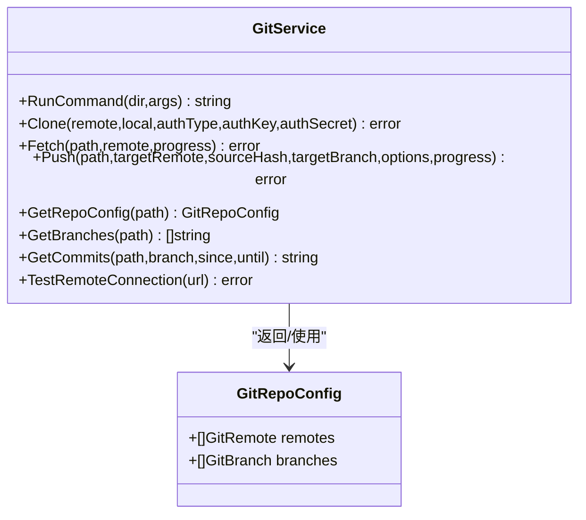
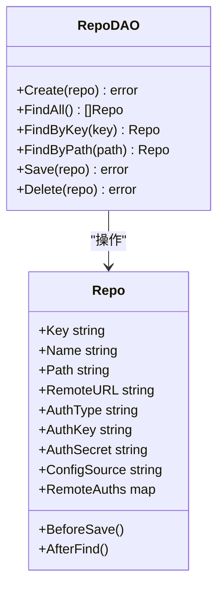
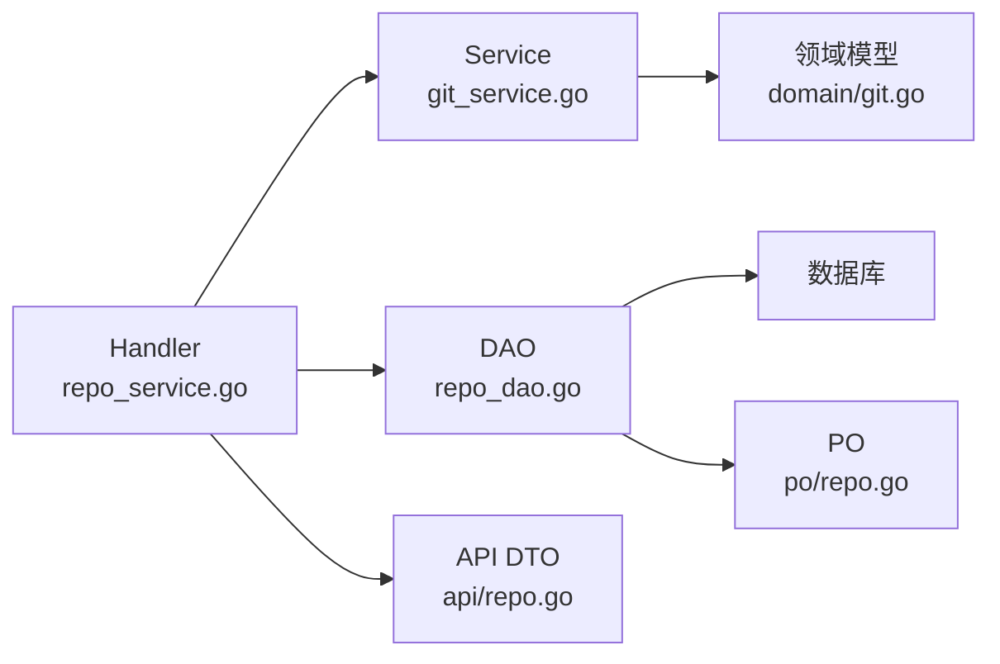

# 分层架构设计

<cite>
**本文引用的文件**
- [main.go](file://main.go)
- [router.go](file://router.go)
- [biz/router/register.go](file://biz/router/register.go)
- [biz/router/repo/repo.go](file://biz/router/repo/repo.go)
- [biz/handler/repo/repo_service.go](file://biz/handler/repo/repo_service.go)
- [pkg/response/response.go](file://pkg/response/response.go)
- [biz/dal/db/init.go](file://biz/dal/db/init.go)
- [biz/dal/db/repo_dao.go](file://biz/dal/db/repo_dao.go)
- [biz/model/po/repo.go](file://biz/model/po/repo.go)
- [biz/model/api/repo.go](file://biz/model/api/repo.go)
- [biz/model/domain/git.go](file://biz/model/domain/git.go)
- [biz/service/git/git_service.go](file://biz/service/git/git_service.go)
- [biz/middleware/webhook.go](file://biz/middleware/webhook.go)
</cite>

## 目录
1. [引言](#引言)
2. [项目结构](#项目结构)
3. [核心组件](#核心组件)
4. [架构总览](#架构总览)
5. [详细组件分析](#详细组件分析)
6. [依赖分析](#依赖分析)
7. [性能考虑](#性能考虑)
8. [故障排查指南](#故障排查指南)
9. [结论](#结论)
10. [附录](#附录)

## 引言
本设计文档围绕“Handler-Service-DAL”三层架构展开，系统性阐述Git管理服务在HTTP与RPC双栈下的分层设计理念与实现方式。三层职责边界清晰：Handler层负责HTTP请求处理与参数校验；Service层封装业务逻辑与流程编排；DAL层专注数据持久化与访问。文档通过数据流与控制流图示、调用序列图与类图，帮助读者快速理解典型请求处理链路与层间解耦机制，并给出接口设计原则与层间通信协议建议。

## 项目结构
项目采用按功能域划分的目录组织方式，结合Hertz路由注册与Kitex RPC服务，形成“路由-处理器-服务-数据访问”的清晰层次：
- 入口与启动：main.go负责初始化配置、数据库、加密工具与业务服务，按模式启动HTTP或RPC服务。
- 路由层：biz/router/* 提供模块化路由注册，统一挂载到Hertz实例。
- 处理器层：biz/handler/* 对应具体业务模块，承担参数绑定、校验与响应封装。
- 服务层：biz/service/* 封装业务规则与跨DAO/外部系统的协调。
- 数据访问层：biz/dal/db/* 提供DAO与GORM初始化，屏蔽数据库差异。
- 模型层：biz/model/* 定义API DTO、领域模型与持久化对象，实现数据转换与安全处理。
- 中间件：biz/middleware/* 提供鉴权、限流等横切能力。

图表来源
- [main.go](file://main.go#L115-L176)
- [biz/router/register.go](file://biz/router/register.go#L18-L42)
- [biz/router/repo/repo.go](file://biz/router/repo/repo.go#L17-L38)
- [biz/handler/repo/repo_service.go](file://biz/handler/repo/repo_service.go#L21-L371)
- [biz/dal/db/init.go](file://biz/dal/db/init.go#L18-L71)
- [biz/dal/db/repo_dao.go](file://biz/dal/db/repo_dao.go#L13-L41)
- [biz/model/po/repo.go](file://biz/model/po/repo.go#L11-L93)
- [biz/model/api/repo.go](file://biz/model/api/repo.go#L10-L77)
- [biz/model/domain/git.go](file://biz/model/domain/git.go#L5-L40)
- [biz/service/git/git_service.go](file://biz/service/git/git_service.go#L27-L800)

章节来源
- [main.go](file://main.go#L115-L176)
- [biz/router/register.go](file://biz/router/register.go#L18-L42)

## 核心组件
- Handler层（HTTP）：以biz/handler/repo/repo_service.go为例，承担参数绑定与校验、调用Service与DAO、封装统一响应格式。
- Service层（业务）：以biz/service/git/git_service.go为例，封装Git操作、认证检测、远程连接测试、日志统计等业务能力。
- DAL层（数据）：以biz/dal/db/init.go与biz/dal/db/repo_dao.go为例，负责数据库连接、迁移与Repo实体的增删改查。
- 模型层：biz/model/api/* 定义API请求/响应结构；biz/model/domain/* 定义领域模型；biz/model/po/* 定义持久化对象并内置加解密钩子。

章节来源
- [biz/handler/repo/repo_service.go](file://biz/handler/repo/repo_service.go#L21-L371)
- [biz/service/git/git_service.go](file://biz/service/git/git_service.go#L27-L800)
- [biz/dal/db/init.go](file://biz/dal/db/init.go#L18-L71)
- [biz/dal/db/repo_dao.go](file://biz/dal/db/repo_dao.go#L13-L41)
- [biz/model/api/repo.go](file://biz/model/api/repo.go#L10-L77)
- [biz/model/domain/git.go](file://biz/model/domain/git.go#L5-L40)
- [biz/model/po/repo.go](file://biz/model/po/repo.go#L11-L93)

## 架构总览
系统支持HTTP与RPC双栈，入口main.go根据启动模式选择性启动HTTP或RPC服务。HTTP侧通过biz/router/*完成模块化路由注册，Handler层接收请求后调用Service与DAO，最终返回统一响应。Service层可直接调用Git库或外部命令执行复杂操作，同时可触发异步统计任务。

图表来源
- [biz/handler/repo/repo_service.go](file://biz/handler/repo/repo_service.go#L52-L126)
- [biz/dal/db/repo_dao.go](file://biz/dal/db/repo_dao.go#L13-L15)
- [biz/service/git/git_service.go](file://biz/service/git/git_service.go#L129-L191)

章节来源
- [main.go](file://main.go#L136-L176)
- [biz/router/register.go](file://biz/router/register.go#L18-L42)
- [biz/router/repo/repo.go](file://biz/router/repo/repo.go#L17-L38)
- [pkg/response/response.go](file://pkg/response/response.go#L17-L87)

## 详细组件分析

### Handler层：HTTP请求处理与参数校验
- 职责边界
  - 参数绑定与校验：使用Hertz的BindAndValidate进行结构化解析与验证。
  - 业务编排：调用Service层能力，协调Git与统计服务，必要时触发异步任务。
  - 统一响应：通过pkg/response/response.go输出标准响应结构，包含状态码、消息与数据。
- 交互模式
  - Handler仅依赖DAO与Service接口，不直接依赖底层数据库驱动。
  - 对外暴露REST接口，内部通过模块化路由注册集中管理。
- 示例路径
  - [repo_service.go](file://biz/handler/repo/repo_service.go#L21-L371)
  - [response.go](file://pkg/response/response.go#L17-L87)

图表来源
- [biz/handler/repo/repo_service.go](file://biz/handler/repo/repo_service.go#L52-L126)
- [pkg/response/response.go](file://pkg/response/response.go#L58-L71)

章节来源
- [biz/handler/repo/repo_service.go](file://biz/handler/repo/repo_service.go#L21-L371)
- [pkg/response/response.go](file://pkg/response/response.go#L17-L87)

### Service层：业务逻辑封装与流程编排
- 职责边界
  - 封装Git操作：克隆、拉取、推送、分支管理、提交统计等。
  - 认证与远程检测：自动识别SSH/HTTP认证，支持代理与密钥检测。
  - 与统计/审计服务协作：触发异步统计任务、记录审计日志。
- 交互模式
  - 通过GitService对外提供统一方法，内部可组合go-git与系统命令。
  - 与DAO解耦，通过领域模型与DTO进行数据转换。
- 示例路径
  - [git_service.go](file://biz/service/git/git_service.go#L27-L800)
  - [git.go](file://biz/model/domain/git.go#L5-L40)

图表来源
- [biz/service/git/git_service.go](file://biz/service/git/git_service.go#L27-L800)
- [biz/model/domain/git.go](file://biz/model/domain/git.go#L21-L24)

章节来源
- [biz/service/git/git_service.go](file://biz/service/git/git_service.go#L27-L800)
- [biz/model/domain/git.go](file://biz/model/domain/git.go#L5-L40)

### DAL层：数据访问与持久化
- 职责边界
  - 数据库初始化：根据配置选择MySQL/Postgres/SQLite，自动迁移表结构。
  - DAO封装：提供Repo等实体的增删改查方法，屏蔽GORM细节。
  - 安全处理：PO在保存前加密敏感字段，在查询后解密，避免明文存储。
- 交互模式
  - 通过全局DB实例访问数据库，DAO方法返回错误便于上层处理。
  - PO与API DTO分离，确保对外接口与内部存储的解耦。
- 示例路径
  - [init.go](file://biz/dal/db/init.go#L18-L71)
  - [repo_dao.go](file://biz/dal/db/repo_dao.go#L13-L41)
  - [repo.go](file://biz/model/po/repo.go#L30-L92)

图表来源
- [biz/dal/db/repo_dao.go](file://biz/dal/db/repo_dao.go#L7-L41)
- [biz/model/po/repo.go](file://biz/model/po/repo.go#L11-L93)

章节来源
- [biz/dal/db/init.go](file://biz/dal/db/init.go#L18-L71)
- [biz/dal/db/repo_dao.go](file://biz/dal/db/repo_dao.go#L13-L41)
- [biz/model/po/repo.go](file://biz/model/po/repo.go#L30-L92)

### 模型层：数据结构与转换
- API DTO：面向前端与外部接口的数据结构，如RegisterRepoReq、RepoDTO。
- 领域模型：描述Git仓库配置、分支与远程等概念，如GitRepoConfig、GitRemote、GitBranch。
- PO：持久化对象，包含加解密钩子，保证敏感信息的安全存储。
- 示例路径
  - [repo.go](file://biz/model/api/repo.go#L10-L77)
  - [git.go](file://biz/model/domain/git.go#L5-L40)
  - [repo.go](file://biz/model/po/repo.go#L11-L93)

章节来源
- [biz/model/api/repo.go](file://biz/model/api/repo.go#L10-L77)
- [biz/model/domain/git.go](file://biz/model/domain/git.go#L5-L40)
- [biz/model/po/repo.go](file://biz/model/po/repo.go#L11-L93)

### 中间件：横切关注点
- Webhook鉴权中间件：支持IP白名单、速率限制与签名验证，保障Webhook入口安全。
- 示例路径
  - [webhook.go](file://biz/middleware/webhook.go#L18-L70)

章节来源
- [biz/middleware/webhook.go](file://biz/middleware/webhook.go#L18-L70)

## 依赖分析
- Handler依赖Service与DAO，不直接依赖数据库驱动，保持低耦合。
- Service依赖领域模型与Git库，向上提供稳定接口。
- DAO依赖GORM与配置，向下访问数据库。
- 模型层通过DTO/PO分离，实现对外接口与内部存储的解耦。
- 路由层通过模块化注册，集中管理HTTP端点。

图表来源
- [biz/handler/repo/repo_service.go](file://biz/handler/repo/repo_service.go#L21-L371)
- [biz/service/git/git_service.go](file://biz/service/git/git_service.go#L27-L800)
- [biz/dal/db/repo_dao.go](file://biz/dal/db/repo_dao.go#L13-L41)
- [biz/model/domain/git.go](file://biz/model/domain/git.go#L5-L40)
- [biz/model/api/repo.go](file://biz/model/api/repo.go#L10-L77)
- [biz/model/po/repo.go](file://biz/model/po/repo.go#L11-L93)

章节来源
- [biz/router/register.go](file://biz/router/register.go#L18-L42)
- [biz/router/repo/repo.go](file://biz/router/repo/repo.go#L17-L38)

## 性能考虑
- 异步任务：创建仓库后触发统计同步，避免阻塞HTTP请求。
- 进度回调：克隆/推送等耗时操作通过通道传递进度，提升用户体验。
- 数据库连接：统一初始化与迁移，减少重复连接开销。
- 速率限制：Webhook中间件限制请求频率，防止突发流量冲击。

章节来源
- [biz/handler/repo/repo_service.go](file://biz/handler/repo/repo_service.go#L117-L123)
- [biz/handler/repo/repo_service.go](file://biz/handler/repo/repo_service.go#L280-L327)
- [biz/middleware/webhook.go](file://biz/middleware/webhook.go#L16-L70)
- [biz/dal/db/init.go](file://biz/dal/db/init.go#L49-L71)

## 故障排查指南
- 参数错误：检查Handler中BindAndValidate是否通过，查看pkg/response/response.go中的BadRequest响应。
- 资源不存在：使用NotFound响应，定位DAO查询条件与键值。
- 服务器内部错误：查看DAO/Service调用链路，确认数据库连接与Git操作返回的错误信息。
- 权限与签名：Webhook鉴权失败时，检查IP白名单、速率限制与签名算法。
- 数据安全：确认PO的BeforeSave/AfterFind钩子是否正确执行加解密。

章节来源
- [pkg/response/response.go](file://pkg/response/response.go#L58-L87)
- [biz/middleware/webhook.go](file://biz/middleware/webhook.go#L18-L70)
- [biz/model/po/repo.go](file://biz/model/po/repo.go#L30-L92)

## 结论
该Git管理服务通过Handler-Service-DAL三层架构实现了清晰的职责分离与良好的解耦：Handler专注于请求与响应，Service封装业务与流程，DAL专注数据持久化。配合模块化路由、统一响应与安全模型，系统具备可扩展性与可维护性。建议在新增模块时遵循相同的分层与接口设计原则，确保一致性与稳定性。

## 附录
- 接口设计原则
  - 单一职责：每层只做一件事，避免交叉职责。
  - 明确边界：层间通过稳定接口通信，禁止跨层直接依赖。
  - 可测试性：通过接口抽象与依赖注入，便于单元测试。
  - 可观测性：统一响应结构与错误码，便于监控与排障。
- 层间通信协议
  - HTTP：RESTful接口，统一响应体结构，明确状态码语义。
  - RPC：基于Kitex生成的IDL接口，保持接口契约稳定。
  - 数据：通过DTO/PO转换，隐藏内部存储细节。