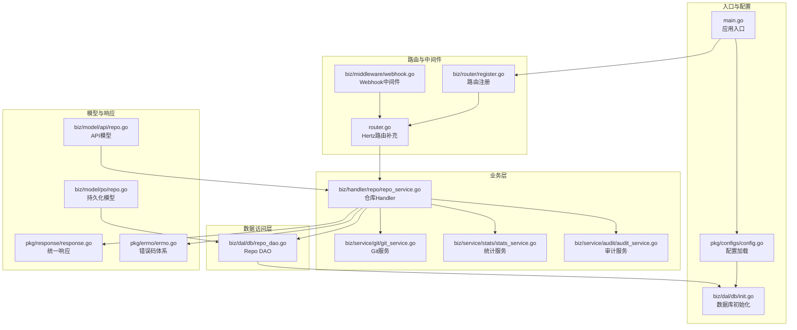
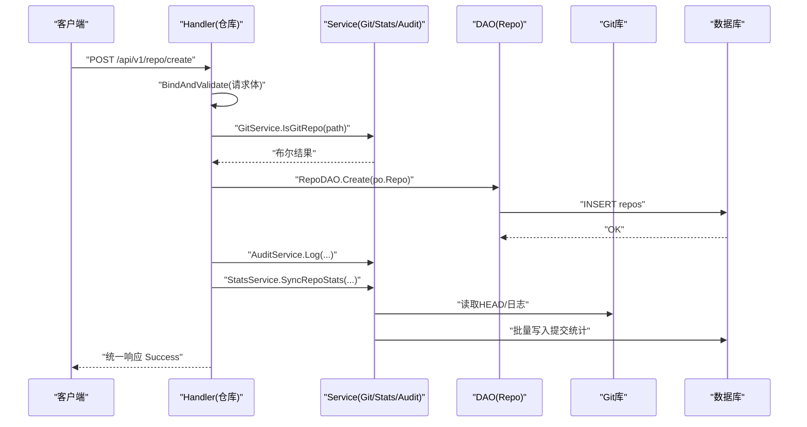
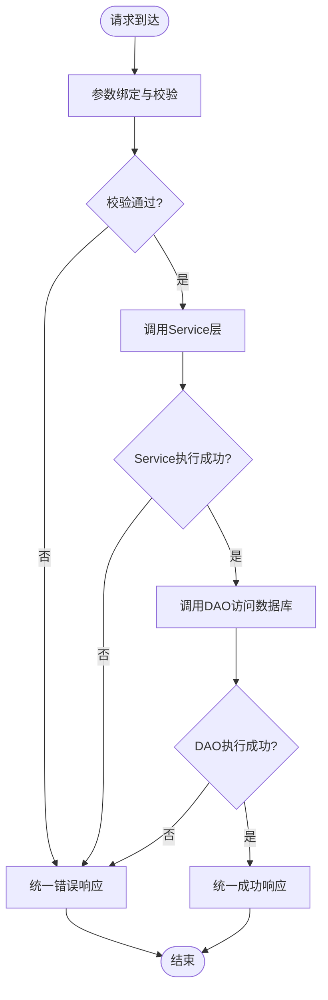
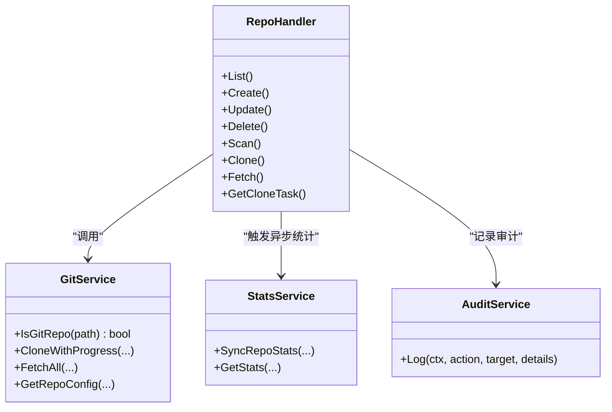
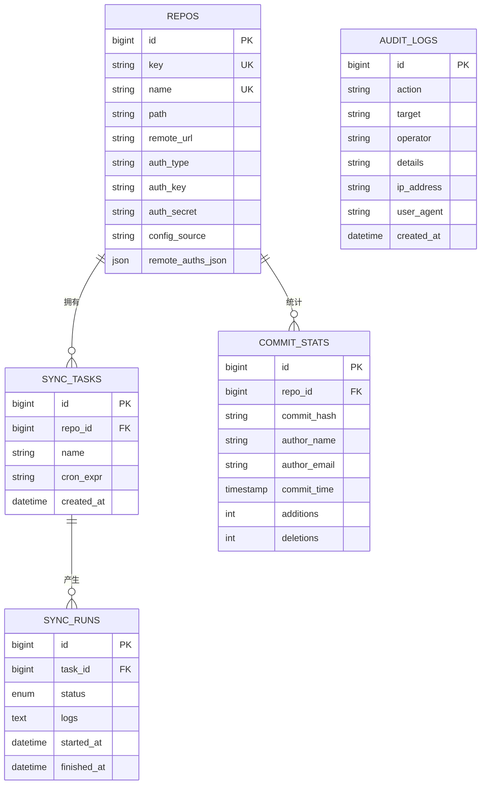
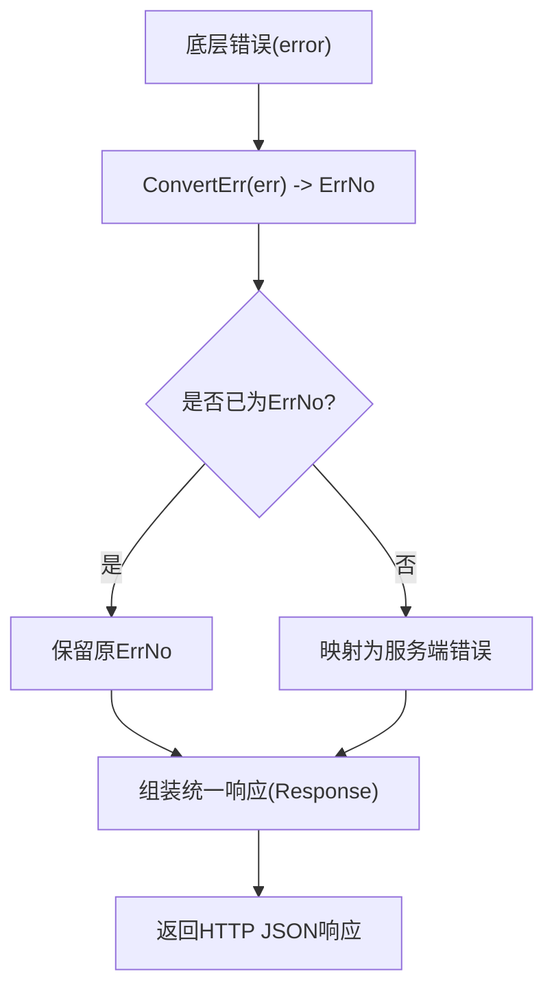
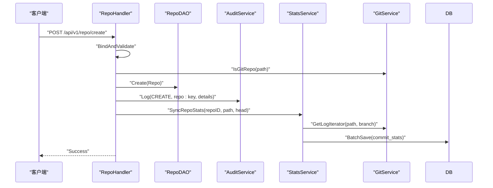
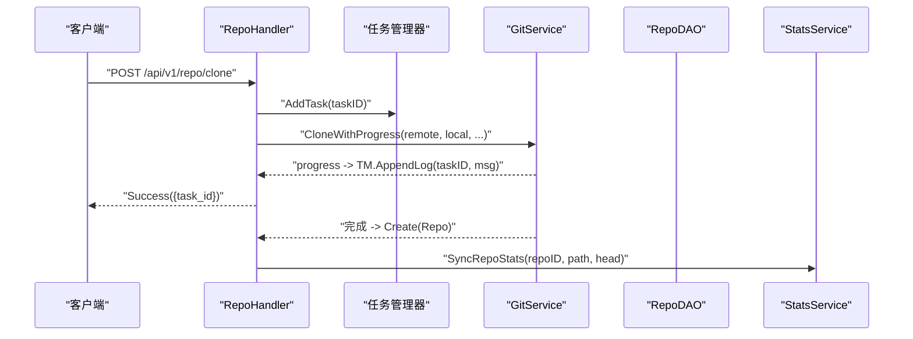
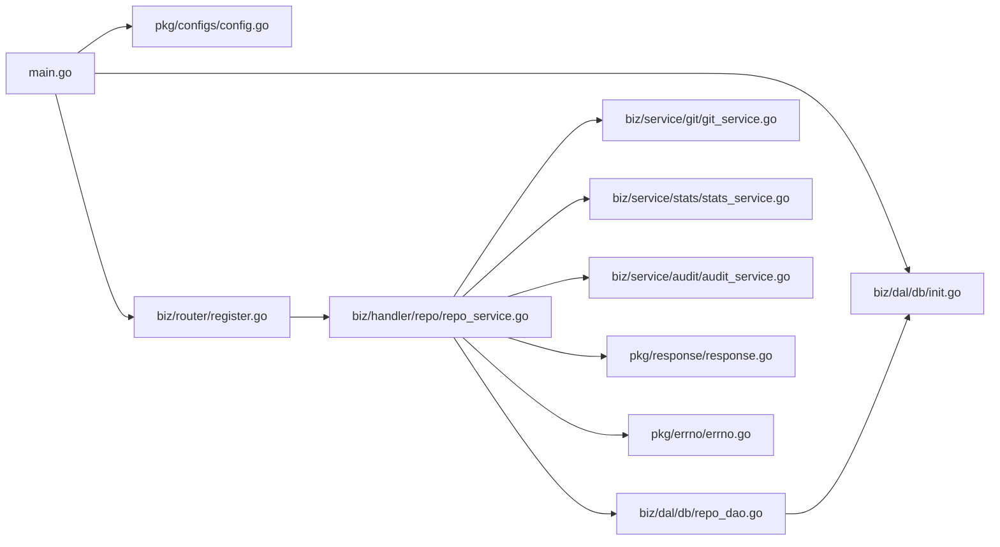

# 层间交互机制

<cite>
**本文引用的文件**   
- [main.go](file://main.go)
- [router.go](file://router.go)
- [biz/router/register.go](file://biz/router/register.go)
- [pkg/configs/config.go](file://pkg/configs/config.go)
- [biz/dal/db/init.go](file://biz/dal/db/init.go)
- [biz/dal/db/repo_dao.go](file://biz/dal/db/repo_dao.go)
- [biz/handler/repo/repo_service.go](file://biz/handler/repo/repo_service.go)
- [biz/service/git/git_service.go](file://biz/service/git/git_service.go)
- [biz/service/stats/stats_service.go](file://biz/service/stats/stats_service.go)
- [biz/service/audit/audit_service.go](file://biz/service/audit/audit_service.go)
- [pkg/response/response.go](file://pkg/response/response.go)
- [pkg/errno/errno.go](file://pkg/errno/errno.go)
- [biz/middleware/webhook.go](file://biz/middleware/webhook.go)
- [biz/model/api/repo.go](file://biz/model/api/repo.go)
- [biz/model/po/repo.go](file://biz/model/po/repo.go)
</cite>

## 目录
1. [引言](#引言)
2. [项目结构](#项目结构)
3. [核心组件](#核心组件)
4. [架构总览](#架构总览)
5. [详细组件分析](#详细组件分析)
6. [依赖分析](#依赖分析)
7. [性能考虑](#性能考虑)
8. [故障排查指南](#故障排查指南)
9. [结论](#结论)
10. [附录](#附录)

## 引言
本文件聚焦于Git管理服务的Handler-Service-DAL三层交互机制，系统性阐述请求在各层之间的传递路径、参数校验、业务处理、数据访问与响应返回的完整流程；解释依赖注入与接口设计原则，给出典型业务场景的调用链路图；详述错误处理从底层异常到HTTP响应的传播路径；并结合实际代码路径示例，说明异步与并发协调机制，最后总结层间解耦最佳实践与性能优化建议。

## 项目结构
该服务采用“HTTP路由 + Handler + Service + DAL + Model”分层架构，并通过统一的初始化流程加载配置、数据库与业务服务，支持HTTP与RPC双栈运行。

**图表来源**
- [main.go](file://main.go#L115-L134)
- [pkg/configs/config.go](file://pkg/configs/config.go#L18-L42)
- [biz/dal/db/init.go](file://biz/dal/db/init.go#L18-L71)
- [biz/router/register.go](file://biz/router/register.go#L18-L41)
- [router.go](file://router.go#L10-L15)
- [biz/handler/repo/repo_service.go](file://biz/handler/repo/repo_service.go#L21-L371)
- [biz/dal/db/repo_dao.go](file://biz/dal/db/repo_dao.go#L7-L42)
- [biz/service/git/git_service.go](file://biz/service/git/git_service.go#L27-L800)
- [biz/service/stats/stats_service.go](file://biz/service/stats/stats_service.go#L39-L372)
- [biz/service/audit/audit_service.go](file://biz/service/audit/audit_service.go#L11-L51)
- [pkg/response/response.go](file://pkg/response/response.go#L9-L87)
- [pkg/errno/errno.go](file://pkg/errno/errno.go#L7-L129)
- [biz/middleware/webhook.go](file://biz/middleware/webhook.go#L16-L70)
- [biz/model/api/repo.go](file://biz/model/api/repo.go#L10-L77)
- [biz/model/po/repo.go](file://biz/model/po/repo.go#L11-L93)

**章节来源**
- [main.go](file://main.go#L115-L134)
- [biz/router/register.go](file://biz/router/register.go#L18-L41)
- [router.go](file://router.go#L10-L15)

## 核心组件
- 应用入口与初始化：负责加载配置、数据库、加密工具与业务服务，按模式启动HTTP/RPC服务。
- 路由与中间件：集中注册各模块路由，提供Webhook鉴权与限流等横切能力。
- Handler层：接收HTTP请求，执行参数绑定与校验，调用Service层完成业务逻辑，组装统一响应。
- Service层：封装领域服务（Git操作、统计计算、审计记录），协调DAO与外部系统。
- DAL层：基于GORM封装DAO，提供仓储操作。
- 模型与响应：API模型用于请求/响应，PO模型映射数据库表，统一响应与错误码体系保证一致的错误传播。

**章节来源**
- [main.go](file://main.go#L115-L134)
- [pkg/configs/config.go](file://pkg/configs/config.go#L18-L42)
- [biz/dal/db/init.go](file://biz/dal/db/init.go#L18-L71)
- [pkg/response/response.go](file://pkg/response/response.go#L9-L87)
- [pkg/errno/errno.go](file://pkg/errno/errno.go#L7-L129)

## 架构总览
下图展示了从HTTP请求到数据库写入的端到端调用链，以及异步统计与审计的协同。

**图表来源**
- [biz/handler/repo/repo_service.go](file://biz/handler/repo/repo_service.go#L52-L126)
- [biz/dal/db/repo_dao.go](file://biz/dal/db/repo_dao.go#L13-L15)
- [biz/service/git/git_service.go](file://biz/service/git/git_service.go#L133-L136)
- [biz/service/stats/stats_service.go](file://biz/service/stats/stats_service.go#L52-L139)
- [biz/service/audit/audit_service.go](file://biz/service/audit/audit_service.go#L24-L50)
- [pkg/response/response.go](file://pkg/response/response.go#L17-L24)

## 详细组件分析

### Handler-Service-DAL 调用链与数据流转
- 请求进入：HTTP路由注册后交由对应Handler处理。
- 参数校验：使用框架内置BindAndValidate进行结构化校验。
- 业务处理：根据业务需要调用Git/Stats/Audit等Service。
- 数据访问：通过DAO执行增删改查，DAO基于GORM连接数据库。
- 统一响应：无论成功或失败，均以统一响应结构返回。

**图表来源**
- [biz/handler/repo/repo_service.go](file://biz/handler/repo/repo_service.go#L52-L126)
- [pkg/response/response.go](file://pkg/response/response.go#L58-L86)
- [pkg/errno/errno.go](file://pkg/errno/errno.go#L119-L129)

**章节来源**
- [biz/handler/repo/repo_service.go](file://biz/handler/repo/repo_service.go#L21-L371)
- [pkg/response/response.go](file://pkg/response/response.go#L9-L87)
- [pkg/errno/errno.go](file://pkg/errno/errno.go#L7-L129)

### Handler-Service 接口设计与依赖注入
- Handler通过构造函数式或全局单例方式获取Service实例，避免硬编码依赖。
- Service内部组合底层能力（如GitService），对外暴露领域方法。
- 通过Init函数集中初始化全局Service实例，确保应用启动时可用。

**图表来源**
- [biz/handler/repo/repo_service.go](file://biz/handler/repo/repo_service.go#L21-L371)
- [biz/service/git/git_service.go](file://biz/service/git/git_service.go#L27-L800)
- [biz/service/stats/stats_service.go](file://biz/service/stats/stats_service.go#L39-L372)
- [biz/service/audit/audit_service.go](file://biz/service/audit/audit_service.go#L11-L51)

**章节来源**
- [biz/handler/repo/repo_service.go](file://biz/handler/repo/repo_service.go#L21-L371)
- [biz/service/git/git_service.go](file://biz/service/git/git_service.go#L27-L800)
- [biz/service/stats/stats_service.go](file://biz/service/stats/stats_service.go#L39-L372)
- [biz/service/audit/audit_service.go](file://biz/service/audit/audit_service.go#L11-L51)

### 数据模型与DAO
- API模型与PO模型分离，API模型面向接口，PO模型映射数据库表，便于演进与安全（敏感字段加解密）。
- DAO提供标准CRUD方法，屏蔽GORM细节，降低上层复杂度。
- 在PO保存前/查找后进行敏感字段加解密，保障数据安全。

**图表来源**
- [biz/model/po/repo.go](file://biz/model/po/repo.go#L11-L93)
- [biz/dal/db/init.go](file://biz/dal/db/init.go#L66-L71)

**章节来源**
- [biz/model/api/repo.go](file://biz/model/api/repo.go#L10-L77)
- [biz/model/po/repo.go](file://biz/model/po/repo.go#L11-L93)
- [biz/dal/db/init.go](file://biz/dal/db/init.go#L18-L71)

### 错误处理传播机制
- 统一错误码：通过ErrNo定义业务错误码，覆盖通用、仓库、分支、同步、认证、标签、系统等分类。
- 统一响应：所有错误最终转换为统一响应结构，包含code/msg/error/data。
- Handler侧：直接调用统一错误响应函数，或在DAO/Service层抛出error，由统一转换逻辑归一化。
- Webhook中间件：在入口处进行IP白名单、速率限制与签名校验，失败即终止并返回相应错误。

**图表来源**
- [pkg/errno/errno.go](file://pkg/errno/errno.go#L119-L129)
- [pkg/response/response.go](file://pkg/response/response.go#L35-L43)

**章节来源**
- [pkg/errno/errno.go](file://pkg/errno/errno.go#L7-L129)
- [pkg/response/response.go](file://pkg/response/response.go#L9-L87)
- [biz/middleware/webhook.go](file://biz/middleware/webhook.go#L18-L70)

### 典型业务场景调用链

#### 场景一：创建仓库并触发异步统计
- Handler接收请求，绑定并校验参数，校验本地路径是否为Git仓库。
- 调用DAO创建Repo记录，记录审计日志。
- 异步触发统计服务，读取HEAD分支并批量写入提交统计。

**图表来源**
- [biz/handler/repo/repo_service.go](file://biz/handler/repo/repo_service.go#L52-L126)
- [biz/dal/db/repo_dao.go](file://biz/dal/db/repo_dao.go#L13-L15)
- [biz/service/audit/audit_service.go](file://biz/service/audit/audit_service.go#L24-L50)
- [biz/service/stats/stats_service.go](file://biz/service/stats/stats_service.go#L52-L139)
- [biz/service/git/git_service.go](file://biz/service/git/git_service.go#L769-L784)

**章节来源**
- [biz/handler/repo/repo_service.go](file://biz/handler/repo/repo_service.go#L52-L126)

#### 场景二：克隆远程仓库并进度上报
- Handler接收请求，创建任务并启动后台协程。
- GitService执行克隆并将进度写入通道，Handler将进度写入任务管理器。
- 克隆完成后持久化Repo并触发统计。

**图表来源**
- [biz/handler/repo/repo_service.go](file://biz/handler/repo/repo_service.go#L263-L327)
- [biz/service/git/git_service.go](file://biz/service/git/git_service.go#L197-L218)
- [biz/service/stats/stats_service.go](file://biz/service/stats/stats_service.go#L52-L139)

**章节来源**
- [biz/handler/repo/repo_service.go](file://biz/handler/repo/repo_service.go#L263-L327)

### 异步与并发协调机制
- 异步统计：StatsService使用缓存+goroutine并发计算，避免阻塞请求；通过cache控制重复计算。
- 异步审计：AuditService在后台协程中写入，不阻塞主流程。
- 任务管理：克隆任务通过全局任务管理器维护状态与日志，支持查询进度。
- 并发安全：StatsService使用sync.Map存储缓存项，注意对共享状态的更新策略；可进一步引入锁或不可变替换以增强线程安全。

**章节来源**
- [biz/service/stats/stats_service.go](file://biz/service/stats/stats_service.go#L31-L50)
- [biz/service/stats/stats_service.go](file://biz/service/stats/stats_service.go#L179-L243)
- [biz/service/audit/audit_service.go](file://biz/service/audit/audit_service.go#L44-L50)
- [biz/handler/repo/repo_service.go](file://biz/handler/repo/repo_service.go#L280-L327)

## 依赖分析
- 入口依赖：main负责加载配置、初始化数据库与业务服务，再注册路由并启动HTTP/RPC。
- Handler依赖：Handler依赖DAO、Service与统一响应/错误码；部分Handler还依赖GitService与StatsService。
- Service依赖：Service依赖GitService与DAO；StatsService内部组合GitService。
- DAO依赖：DAO依赖全局DB连接与GORM。
- 中间件依赖：Webhook中间件依赖配置中的密钥、限流参数与请求上下文。

**图表来源**
- [main.go](file://main.go#L115-L134)
- [pkg/configs/config.go](file://pkg/configs/config.go#L18-L42)
- [biz/router/register.go](file://biz/router/register.go#L18-L41)
- [biz/handler/repo/repo_service.go](file://biz/handler/repo/repo_service.go#L21-L371)
- [biz/dal/db/repo_dao.go](file://biz/dal/db/repo_dao.go#L7-L42)
- [biz/service/git/git_service.go](file://biz/service/git/git_service.go#L27-L800)
- [biz/service/stats/stats_service.go](file://biz/service/stats/stats_service.go#L39-L372)
- [biz/service/audit/audit_service.go](file://biz/service/audit/audit_service.go#L11-L51)
- [pkg/response/response.go](file://pkg/response/response.go#L9-L87)
- [pkg/errno/errno.go](file://pkg/errno/errno.go#L7-L129)

**章节来源**
- [main.go](file://main.go#L115-L134)
- [biz/router/register.go](file://biz/router/register.go#L18-L41)

## 性能考虑
- 缓存与批处理：StatsService对统计计算结果进行缓存，并使用批量写入减少数据库往返。
- 异步处理：创建/克隆等耗时操作异步化，避免阻塞请求；审计与统计在后台执行。
- 连接与迁移：数据库初始化时检查表存在性，避免重复迁移开销。
- 日志与进度：Git克隆通过通道输出进度，既可观测又非阻塞。
- 并发控制：Webhook中间件使用限流器控制请求频率，防止过载。

**章节来源**
- [biz/service/stats/stats_service.go](file://biz/service/stats/stats_service.go#L31-L50)
- [biz/service/stats/stats_service.go](file://biz/service/stats/stats_service.go#L116-L139)
- [biz/dal/db/init.go](file://biz/dal/db/init.go#L54-L71)
- [biz/service/git/git_service.go](file://biz/service/git/git_service.go#L197-L218)
- [biz/middleware/webhook.go](file://biz/middleware/webhook.go#L16-L17)

## 故障排查指南
- 参数错误：Handler侧直接返回统一参数错误响应，检查请求体与必填字段。
- 资源不存在：当DAO查询不到记录时返回统一未找到响应。
- 服务器内部错误：DAO/Service层抛出error，统一转换为服务端错误响应。
- Webhook接入失败：检查IP白名单、速率限制阈值与签名密钥是否正确。
- Git操作失败：查看GitService返回的错误信息，确认认证类型与凭据配置。

**章节来源**
- [pkg/response/response.go](file://pkg/response/response.go#L58-L86)
- [pkg/errno/errno.go](file://pkg/errno/errno.go#L119-L129)
- [biz/middleware/webhook.go](file://biz/middleware/webhook.go#L18-L70)

## 结论
该服务通过清晰的Handler-Service-DAL分层与统一的响应/错误码体系，实现了请求在各层之间的稳定流转；借助异步与缓存机制提升了性能与用户体验；通过中间件与配置中心增强了安全性与可运维性。建议在高并发场景下进一步完善StatsService的并发安全策略，并持续优化DAO批量写入与Git操作的超时与重试策略。

## 附录
- 关键实现路径参考
  - 应用入口与初始化：[main.go](file://main.go#L115-L134)
  - 路由注册：[biz/router/register.go](file://biz/router/register.go#L18-L41)，[router.go](file://router.go#L10-L15)
  - 配置加载：[pkg/configs/config.go](file://pkg/configs/config.go#L18-L42)
  - 数据库初始化与迁移：[biz/dal/db/init.go](file://biz/dal/db/init.go#L18-L71)
  - 仓库Handler示例：[biz/handler/repo/repo_service.go](file://biz/handler/repo/repo_service.go#L52-L126)
  - Git服务示例：[biz/service/git/git_service.go](file://biz/service/git/git_service.go#L197-L218)
  - 统计服务示例：[biz/service/stats/stats_service.go](file://biz/service/stats/stats_service.go#L52-L139)
  - 审计服务示例：[biz/service/audit/audit_service.go](file://biz/service/audit/audit_service.go#L24-L50)
  - 统一响应与错误码：[pkg/response/response.go](file://pkg/response/response.go#L9-L87)，[pkg/errno/errno.go](file://pkg/errno/errno.go#L7-L129)
  - Webhook中间件：[biz/middleware/webhook.go](file://biz/middleware/webhook.go#L18-L70)
  - API与PO模型：[biz/model/api/repo.go](file://biz/model/api/repo.go#L10-L77)，[biz/model/po/repo.go](file://biz/model/po/repo.go#L11-L93)