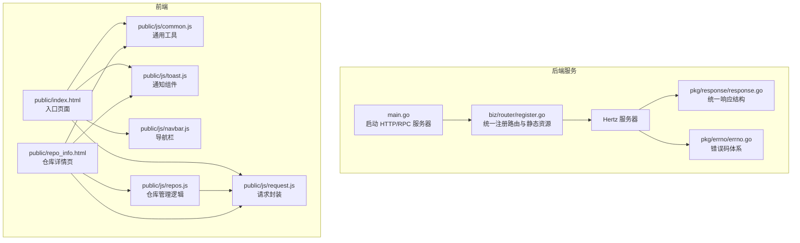
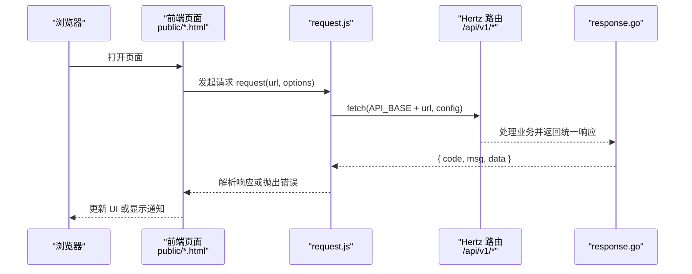
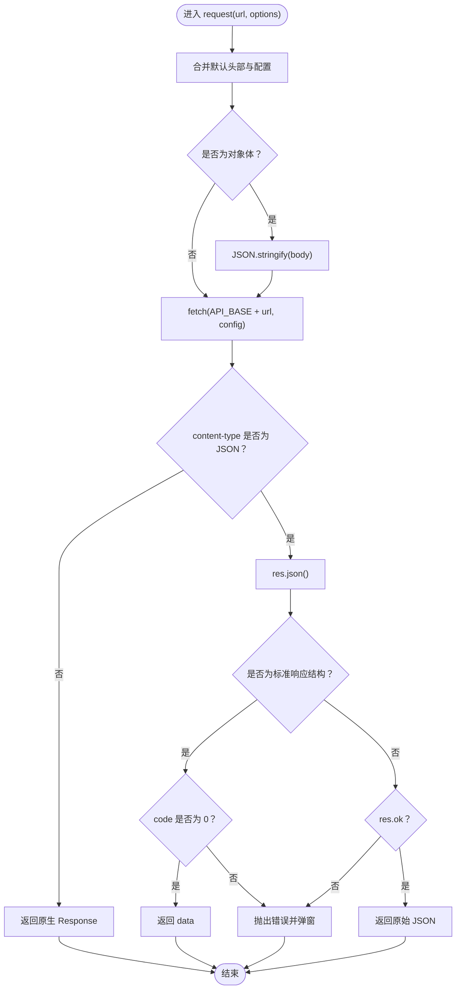
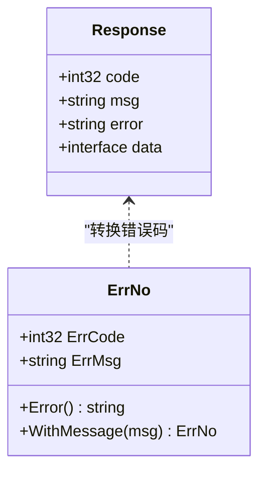
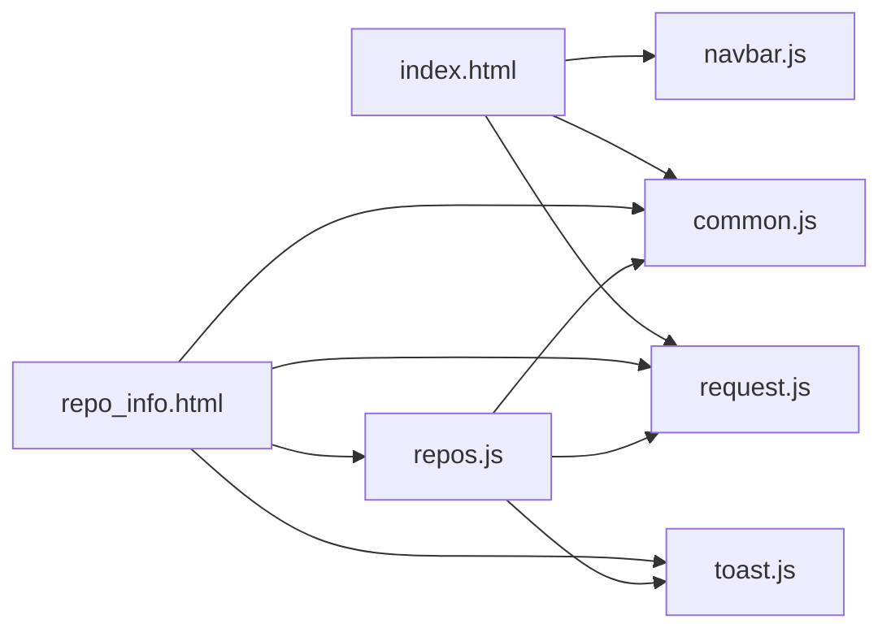
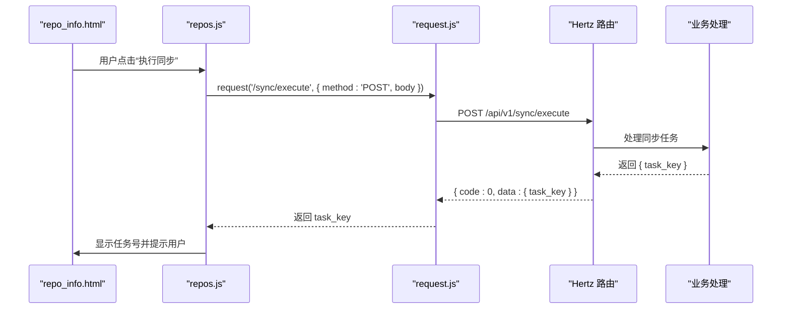
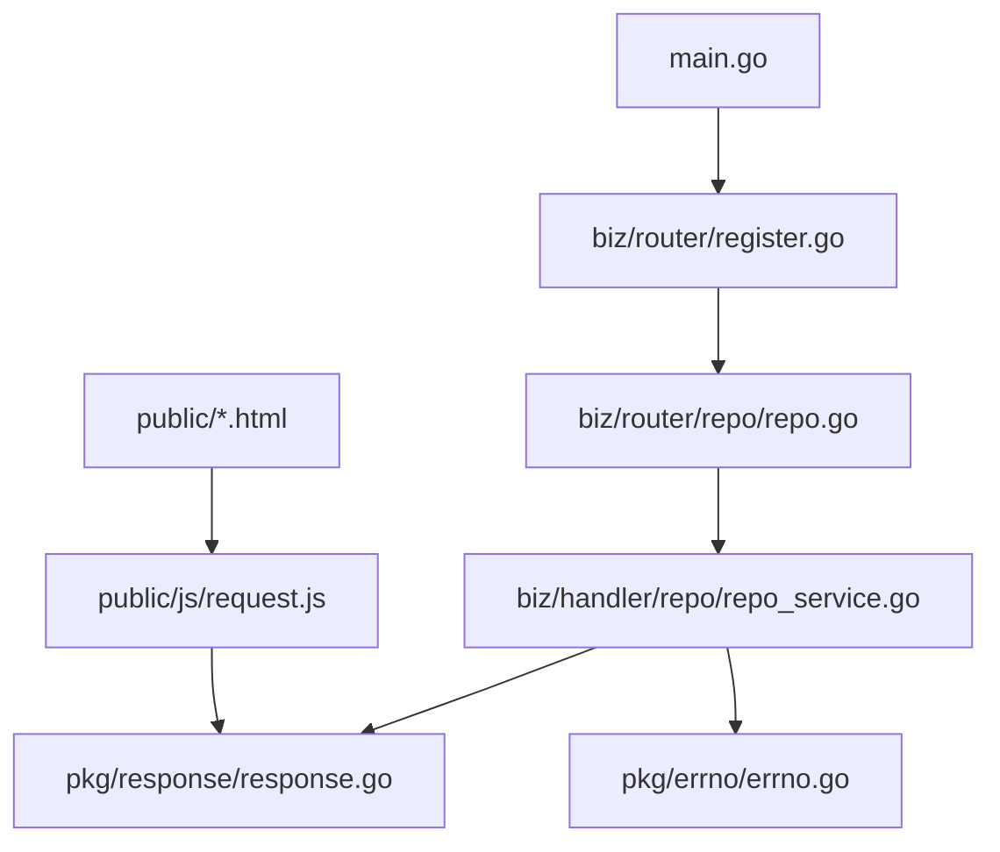

# 前后端交互设计

<cite>
**本文引用的文件**
- [main.go](file://main.go)
- [router.go](file://router.go)
- [biz/router/register.go](file://biz/router/register.go)
- [pkg/response/response.go](file://pkg/response/response.go)
- [pkg/errno/errno.go](file://pkg/errno/errno.go)
- [public/js/request.js](file://public/js/request.js)
- [public/js/common.js](file://public/js/common.js)
- [public/js/toast.js](file://public/js/toast.js)
- [public/js/navbar.js](file://public/js/navbar.js)
- [public/js/repos.js](file://public/js/repos.js)
- [public/index.html](file://public/index.html)
- [public/repo_info.html](file://public/repo_info.html)
- [biz/router/repo/repo.go](file://biz/router/repo/repo.go)
- [biz/handler/repo/repo_service.go](file://biz/handler/repo/repo_service.go)
- [conf/config.yaml](file://conf/config.yaml)
</cite>

## 目录
1. [简介](#简介)
2. [项目结构](#项目结构)
3. [核心组件](#核心组件)
4. [架构总览](#架构总览)
5. [详细组件分析](#详细组件分析)
6. [依赖分析](#依赖分析)
7. [性能考量](#性能考量)
8. [故障排查指南](#故障排查指南)
9. [结论](#结论)
10. [附录](#附录)

## 简介
本文件面向前端与后端工程师，系统性阐述该 Git 管理服务的前后端交互设计。内容覆盖：
- 前端 Web 界面与后端服务的交互模式与数据传输协议
- 静态资源组织结构、JavaScript 模块化设计与异步请求处理机制
- 前端路由与后端 API 的对应关系、RESTful 调用模式与错误处理策略
- 前端状态管理与数据缓存机制
- 用户体验优化与性能考虑
- 前端开发指南与调试技巧
- 跨域处理与安全考虑

## 项目结构
该项目采用“后端 Go 服务 + 前端静态页面”的分层架构：
- 后端通过 Hertz HTTP 服务器提供 RESTful API，并以统一响应结构返回数据
- 前端静态资源位于 public 目录，通过浏览器直接访问；核心逻辑由独立的 JS 模块组成
- 路由注册集中于 biz/router/register.go，统一挂载各模块路由与静态资源

**图表来源**
- [main.go](file://main.go#L136-L176)
- [biz/router/register.go](file://biz/router/register.go#L18-L41)
- [pkg/response/response.go](file://pkg/response/response.go#L9-L15)
- [pkg/errno/errno.go](file://pkg/errno/errno.go#L7-L23)
- [public/index.html](file://public/index.html#L65-L70)
- [public/js/request.js](file://public/js/request.js#L1-L67)
- [public/js/common.js](file://public/js/common.js#L1-L50)
- [public/js/toast.js](file://public/js/toast.js#L1-L56)
- [public/js/navbar.js](file://public/js/navbar.js#L1-L39)
- [public/js/repos.js](file://public/js/repos.js#L1-L712)
- [public/repo_info.html](file://public/repo_info.html#L545-L551)

**章节来源**
- [main.go](file://main.go#L136-L176)
- [biz/router/register.go](file://biz/router/register.go#L18-L41)
- [public/index.html](file://public/index.html#L65-L70)

## 核心组件
- 统一响应结构与错误码
  - 后端统一使用标准响应结构，包含 code、msg、error、data 字段，便于前端一致处理
  - 错误码体系覆盖通用、仓库、分支、同步、认证、标签、系统等模块，便于定位问题
- 请求封装与错误处理
  - 前端通过 request.js 封装 fetch，统一处理非 JSON 响应、标准响应结构与异常弹窗
- 通知与通用工具
  - toast.js 提供基于 Bootstrap 的轻量通知；common.js 提供状态颜色映射、日志弹窗、SSH 密钥加载等
- 前端模块化
  - 各页面逻辑拆分为独立模块（如 repos.js），通过公共依赖（request.js、common.js）协作

**章节来源**
- [pkg/response/response.go](file://pkg/response/response.go#L9-L15)
- [pkg/errno/errno.go](file://pkg/errno/errno.go#L31-L129)
- [public/js/request.js](file://public/js/request.js#L1-L67)
- [public/js/toast.js](file://public/js/toast.js#L1-L56)
- [public/js/common.js](file://public/js/common.js#L1-L50)

## 架构总览
后端通过 Hertz 注册路由，静态资源直接挂载至根路径，前端通过相对路径 /api/v1 调用后端接口。

**图表来源**
- [public/js/request.js](file://public/js/request.js#L11-L62)
- [pkg/response/response.go](file://pkg/response/response.go#L17-L43)
- [biz/router/register.go](file://biz/router/register.go#L20-L35)

**章节来源**
- [biz/router/register.go](file://biz/router/register.go#L18-L41)
- [public/js/request.js](file://public/js/request.js#L3-L67)

## 详细组件分析

### 前端请求封装与错误处理（request.js）
- 功能要点
  - 默认 JSON Content-Type，自动序列化对象体
  - 支持非 JSON 响应（如 CSV 导出）直接返回原生 Response
  - 自动识别后端统一响应结构，当 code 非 0 时抛出错误
  - 统一错误弹窗：优先调用全局 showToast，否则回退 alert
- 使用建议
  - 所有 API 调用均通过 request(url, options) 进行
  - 对需要二进制流的接口（如导出）需自行处理响应类型判断

**图表来源**
- [public/js/request.js](file://public/js/request.js#L11-L62)

**章节来源**
- [public/js/request.js](file://public/js/request.js#L1-L67)

### 统一响应结构与错误码（response.go、errno.go）
- 统一响应结构
  - code：业务状态码，0 表示成功
  - msg：提示消息
  - error：详细错误信息（调试用）
  - data：业务数据
- 错误码体系
  - 通用错误（0-999）、仓库（10000-10999）、分支（11000-11999）、同步（12000-12999）、认证（13000-13999）、标签（14000-14999）、系统（15000-15999）
- 使用建议
  - 前端根据 code 判断成功与否；后端通过 response.Success/Error/BadRequest 等方法返回

**图表来源**
- [pkg/response/response.go](file://pkg/response/response.go#L9-L15)
- [pkg/errno/errno.go](file://pkg/errno/errno.go#L7-L29)

**章节来源**
- [pkg/response/response.go](file://pkg/response/response.go#L9-L87)
- [pkg/errno/errno.go](file://pkg/errno/errno.go#L31-L129)

### 前端页面与模块化（index.html、repo_info.html、repos.js、common.js、toast.js、navbar.js）
- 页面组织
  - index.html 作为入口页，引入 request.js、common.js、navbar.js
  - repo_info.html 作为仓库详情页，引入 ECharts、request.js、toast.js、common.js、repos.js
- 模块职责
  - repos.js：仓库列表、添加/编辑/删除、克隆进度轮询、远程认证配置、执行同步等
  - common.js：状态颜色映射、日志弹窗、复制命令、SSH 密钥加载
  - toast.js：基于 Bootstrap 的通知容器与展示
  - navbar.js：根据当前路径高亮导航项
- 数据流
  - repos.js 通过 request.js 调用 /api/v1/* 接口，解析后更新 DOM
  - 通知与错误通过 showToast 统一呈现

**图表来源**
- [public/index.html](file://public/index.html#L65-L70)
- [public/repo_info.html](file://public/repo_info.html#L545-L551)
- [public/js/request.js](file://public/js/request.js#L65-L67)
- [public/js/toast.js](file://public/js/toast.js#L1-L56)
- [public/js/common.js](file://public/js/common.js#L1-L50)
- [public/js/navbar.js](file://public/js/navbar.js#L1-L39)
- [public/js/repos.js](file://public/js/repos.js#L1-L712)

**章节来源**
- [public/index.html](file://public/index.html#L65-L70)
- [public/repo_info.html](file://public/repo_info.html#L545-L551)
- [public/js/navbar.js](file://public/js/navbar.js#L1-L39)
- [public/js/toast.js](file://public/js/toast.js#L1-L56)
- [public/js/common.js](file://public/js/common.js#L1-L50)
- [public/js/repos.js](file://public/js/repos.js#L1-L712)

### 前端路由与后端 API 对应关系（RESTful 调用模式）
- 前端路由
  - index.html：首页入口
  - repo_info.html：仓库详情页，包含 Git 有效提交度量与真实工程代码度量
  - repos.js：负责仓库列表、添加/编辑/删除、克隆进度轮询、远程认证配置、执行同步等
- 后端路由（示例）
  - /api/v1/repo/list：GET，列出仓库
  - /api/v1/repo/detail：GET，获取仓库详情
  - /api/v1/repo/create：POST，创建仓库
  - /api/v1/repo/update：POST，更新仓库
  - /api/v1/repo/delete：POST，删除仓库
  - /api/v1/repo/scan：POST，扫描本地仓库配置
  - /api/v1/repo/clone：POST，克隆远程仓库（异步任务）
  - /api/v1/repo/task：GET，查询克隆任务进度
  - /api/v1/sync/execute：POST，执行同步任务
  - /api/v1/stats/branches：GET，获取分支列表
  - /api/v1/stats/analyze：GET，分析提交度量
  - /api/v1/version/current：GET，获取当前版本
  - /api/v1/system/ssh-keys：GET，获取 SSH 密钥列表
  - /api/v1/system/test-connection：POST，测试连接
  - /api/v1/system/dirs：GET，目录浏览
- 调用模式
  - GET 查询类接口，参数通过 URL 查询字符串传递
  - POST 修改类接口，参数通过请求体 JSON 传递
  - 异步任务通过 /repo/clone 返回 task_id，前端轮询 /repo/task 获取进度

**图表来源**
- [public/js/repos.js](file://public/js/repos.js#L367-L405)
- [public/js/request.js](file://public/js/request.js#L11-L62)
- [biz/router/repo/repo.go](file://biz/router/repo/repo.go#L25-L35)

**章节来源**
- [biz/router/repo/repo.go](file://biz/router/repo/repo.go#L16-L38)
- [biz/handler/repo/repo_service.go](file://biz/handler/repo/repo_service.go#L21-L371)
- [public/js/repos.js](file://public/js/repos.js#L367-L405)

### 前端状态管理与数据缓存机制
- 状态集中管理
  - repos.js 中维护 allRepos、currentRepoAuths、clonePollInterval 等状态变量
  - 仓库列表与详情数据通过 request.js 调用后端接口获取并更新
- 缓存策略
  - 本地缓存：页面切换时可复用已加载的数据（如 allRepos）
  - 服务端缓存：后端对部分计算结果（如统计）进行缓存，前端通过接口获取最新值
- 交互优化
  - 轮询：克隆进度通过定时器轮询 /repo/task，避免长连接
  - 按需渲染：图表与表格仅在 Tab 切换时初始化与渲染

**章节来源**
- [public/js/repos.js](file://public/js/repos.js#L3-L9)
- [public/js/repos.js](file://public/js/repos.js#L496-L554)

### 错误处理策略
- 前端
  - request.js 统一捕获异常并调用 showToast 或 alert
  - 对非 JSON 响应（如 CSV）直接返回原生 Response，交由调用方处理
- 后端
  - response.Success/Accepted/Error/BadRequest/NotFound 等方法统一返回标准结构
  - errno.go 定义错误码与消息，便于前端识别与提示

**章节来源**
- [public/js/request.js](file://public/js/request.js#L26-L62)
- [pkg/response/response.go](file://pkg/response/response.go#L17-L87)
- [pkg/errno/errno.go](file://pkg/errno/errno.go#L31-L129)

## 依赖分析
- 启动与路由
  - main.go 启动 HTTP 服务器并注册 biz/router/register.go
  - register.go 统一挂载各模块路由与静态资源
- 前后端交互
  - 前端通过 request.js 调用 /api/v1/*，后端 response.go 统一响应
- 配置
  - conf/config.yaml 提供服务端口、数据库类型与 Webhook 配置

**图表来源**
- [main.go](file://main.go#L136-L176)
- [biz/router/register.go](file://biz/router/register.go#L18-L41)
- [biz/router/repo/repo.go](file://biz/router/repo/repo.go#L16-L38)
- [biz/handler/repo/repo_service.go](file://biz/handler/repo/repo_service.go#L21-L371)
- [pkg/response/response.go](file://pkg/response/response.go#L17-L43)
- [pkg/errno/errno.go](file://pkg/errno/errno.go#L119-L129)
- [public/js/request.js](file://public/js/request.js#L11-L62)

**章节来源**
- [main.go](file://main.go#L136-L176)
- [biz/router/register.go](file://biz/router/register.go#L18-L41)
- [conf/config.yaml](file://conf/config.yaml#L1-L25)

## 性能考量
- 减少不必要的网络请求
  - 对于高频查询（如目录浏览），在前端做去抖与节流
- 图表渲染优化
  - ECharts 仅在 Tab 切换时初始化，避免重复渲染
- 异步任务与轮询
  - 克隆进度轮询间隔合理设置（如 1 秒），并在任务完成后及时清理定时器
- 静态资源优化
  - 将第三方库（Bootstrap、ECharts）置于 vendor 目录，减少重复加载

[本节为通用指导，无需具体文件引用]

## 故障排查指南
- 常见问题
  - 请求失败：检查 request.js 是否正确捕获并弹窗；确认后端返回的 code 与 msg
  - 404/400：核对前端调用的 URL 与后端路由是否一致
  - 500：查看后端日志与 response.go 的错误返回
- 调试技巧
  - 在浏览器开发者工具 Network 面板查看请求与响应
  - 在控制台调用 window.showToast('消息', 'type') 快速验证通知
  - 在 repo_info.html 中通过 URL 参数传入 repo_key，验证详情页逻辑

**章节来源**
- [public/js/request.js](file://public/js/request.js#L53-L62)
- [pkg/response/response.go](file://pkg/response/response.go#L35-L87)
- [public/js/toast.js](file://public/js/toast.js#L18-L56)

## 结论
本项目通过统一的响应结构与错误码体系、清晰的前端模块化与请求封装，实现了前后端稳定可靠的交互。建议在后续迭代中进一步完善：
- 增加 CORS 配置与鉴权机制
- 对关键接口增加缓存与限流策略
- 丰富前端单元测试与 E2E 测试

[本节为总结，无需具体文件引用]

## 附录

### API 路由清单（示例）
- 仓库管理
  - GET /api/v1/repo/list
  - GET /api/v1/repo/detail
  - POST /api/v1/repo/create
  - POST /api/v1/repo/update
  - POST /api/v1/repo/delete
  - POST /api/v1/repo/scan
  - POST /api/v1/repo/clone
  - GET /api/v1/repo/task
- 同步与统计
  - POST /api/v1/sync/execute
  - GET /api/v1/stats/branches
  - GET /api/v1/stats/analyze
  - GET /api/v1/version/current
- 系统
  - GET /api/v1/system/ssh-keys
  - POST /api/v1/system/test-connection
  - GET /api/v1/system/dirs

**章节来源**
- [biz/router/repo/repo.go](file://biz/router/repo/repo.go#L16-L38)
- [biz/handler/repo/repo_service.go](file://biz/handler/repo/repo_service.go#L21-L371)

### 跨域处理与安全考虑
- 跨域
  - 当前端与后端部署在不同端口时，需在后端启用 CORS 或通过反向代理统一域名
- 安全
  - Webhook 配置包含 secret 与限流，建议生产环境开启 IP 白名单
  - 前端敏感信息（如密钥）避免明文暴露，后端返回最小权限数据

**章节来源**
- [conf/config.yaml](file://conf/config.yaml#L21-L25)