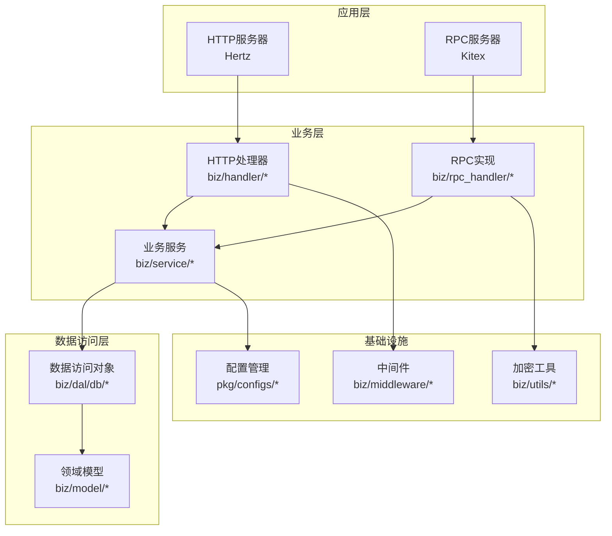
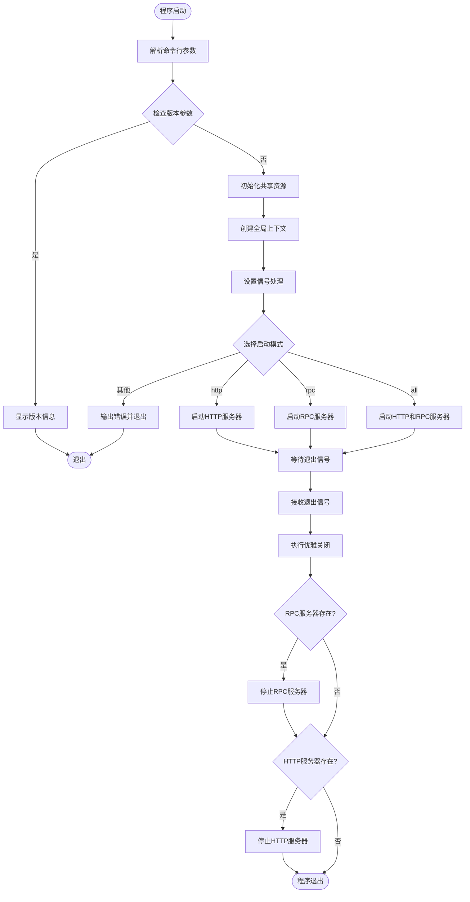
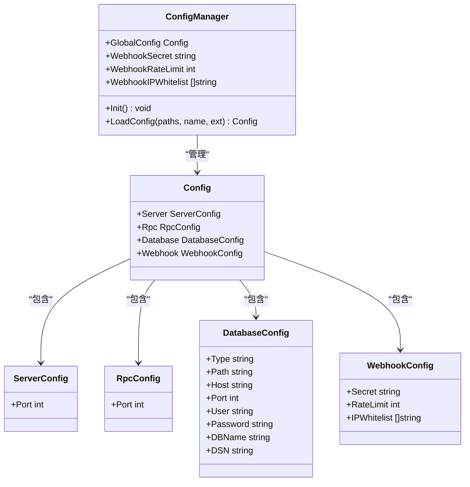
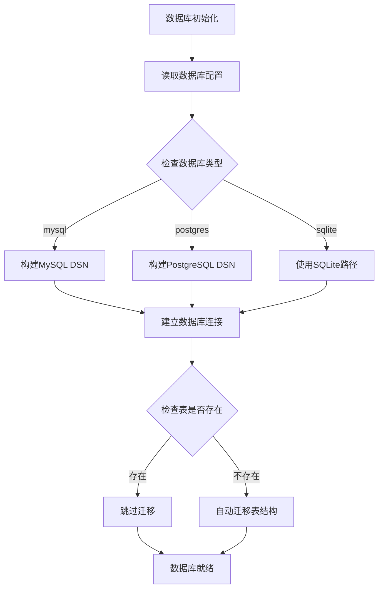
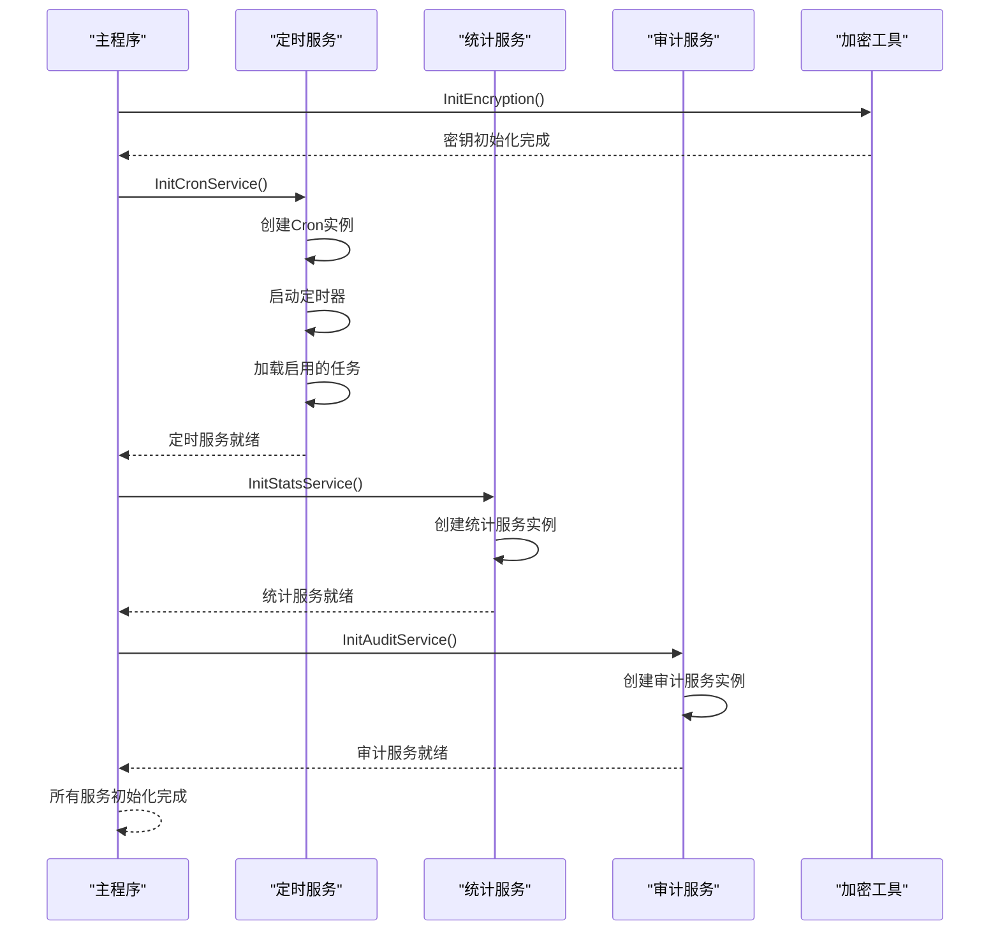
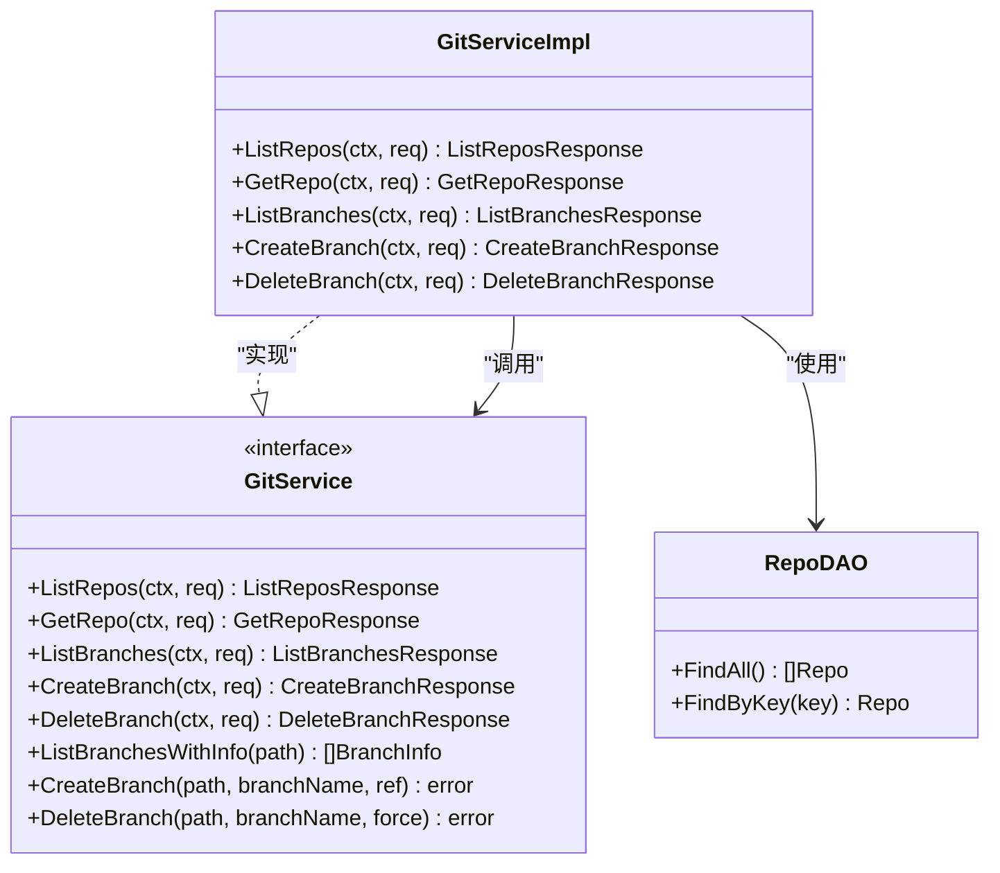
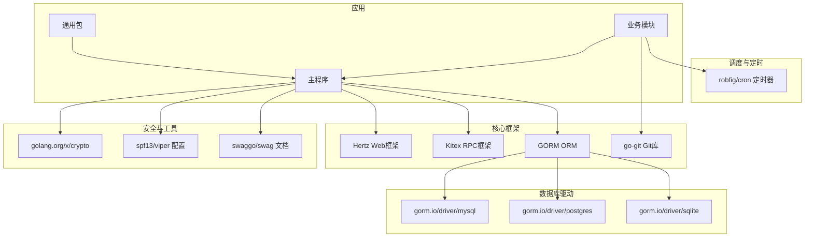
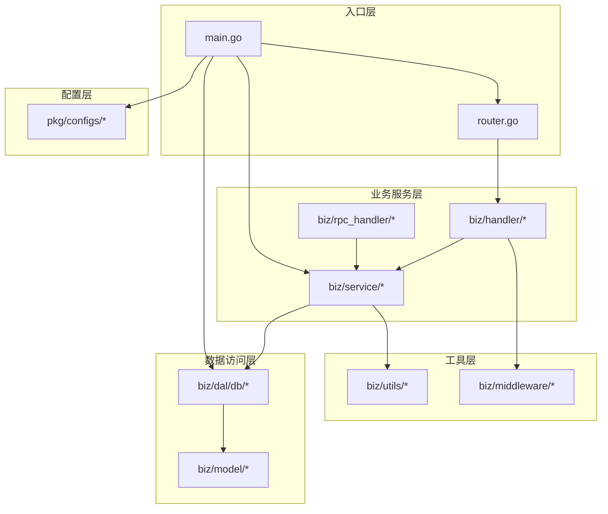

# 整体架构概览

<cite>
**本文档引用的文件**
- [main.go](file://main.go)
- [router.go](file://router.go)
- [pkg/configs/config.go](file://pkg/configs/config.go)
- [conf/config.yaml](file://conf/config.yaml)
- [biz/rpc_handler/git_handler.go](file://biz/rpc_handler/git_handler.go)
- [biz/dal/db/init.go](file://biz/dal/db/init.go)
- [biz/service/sync/cron_service.go](file://biz/service/sync/cron_service.go)
- [biz/service/stats/stats_service.go](file://biz/service/stats/stats_service.go)
- [biz/service/audit/audit_service.go](file://biz/service/audit/audit_service.go)
- [biz/kitex_gen/git/gitservice/server.go](file://biz/kitex_gen/git/gitservice/server.go)
- [biz/utils/crypto.go](file://biz/utils/crypto.go)
- [biz/middleware/webhook.go](file://biz/middleware/webhook.go)
- [go.mod](file://go.mod)
- [Makefile](file://Makefile)
</cite>

## 目录
1. [简介](#简介)
2. [项目结构](#项目结构)
3. [核心组件](#核心组件)
4. [架构总览](#架构总览)
5. [详细组件分析](#详细组件分析)
6. [依赖关系分析](#依赖关系分析)
7. [性能考量](#性能考量)
8. [故障排除指南](#故障排除指南)
9. [结论](#结论)

## 简介
本项目是一个轻量级多仓库、多分支自动化同步管理的Git管理服务，采用双服务器架构（HTTP + RPC），支持灵活的启动模式控制与优雅关闭机制。系统通过统一的主程序入口点进行资源初始化、服务器启动与生命周期管理，并提供配置加载、数据库初始化、业务服务启动的完整时序。

## 项目结构
项目采用分层+功能域混合的组织方式：
- biz：业务域模块，包含数据访问层(DAL)、处理器(handler)、服务(service)、中间件(middleware)、模型(model)等
- pkg：通用包，包含配置管理、错误码、响应封装等
- conf：运行时配置文件
- deploy：部署相关脚本与配置
- idl：接口定义语言文件
- public：前端静态资源
- script：构建与生成脚本



**图表来源**
- [main.go](file://main.go#L52-L176)
- [biz/rpc_handler/git_handler.go](file://biz/rpc_handler/git_handler.go#L1-L131)
- [biz/dal/db/init.go](file://biz/dal/db/init.go#L1-L72)

**章节来源**
- [main.go](file://main.go#L1-L176)
- [Makefile](file://Makefile#L1-L86)

## 核心组件
系统的核心组件包括：
- 双服务器架构：HTTP服务器基于Hertz框架，RPC服务器基于Kitex框架
- 配置管理系统：支持YAML配置文件与环境变量覆盖
- 数据库抽象层：支持SQLite、MySQL、PostgreSQL三种数据库类型
- 业务服务层：包含统计分析、同步调度、审计日志等功能服务
- 安全与中间件：Webhook认证、速率限制、IP白名单等

**章节来源**
- [pkg/configs/config.go](file://pkg/configs/config.go#L1-L43)
- [biz/dal/db/init.go](file://biz/dal/db/init.go#L1-L72)
- [biz/service/sync/cron_service.go](file://biz/service/sync/cron_service.go#L1-L101)
- [biz/service/stats/stats_service.go](file://biz/service/stats/stats_service.go#L1-L372)
- [biz/service/audit/audit_service.go](file://biz/service/audit/audit_service.go#L1-L51)

## 架构总览
系统采用双服务器架构，支持三种启动模式：
- http模式：仅启动HTTP服务器
- rpc模式：仅启动RPC服务器  
- all模式：同时启动HTTP和RPC服务器

```mermaid
sequenceDiagram
participant Main as "主程序(main)"
participant Config as "配置系统"
participant DB as "数据库"
participant Crypto as "加密工具"
participant Cron as "定时服务"
participant Stats as "统计服务"
participant Audit as "审计服务"
participant HTTP as "HTTP服务器"
participant RPC as "RPC服务器"
Main->>Main : 解析命令行参数
Main->>Config : 初始化配置
Config-->>Main : 返回配置
Main->>DB : 初始化数据库连接
DB-->>Main : 连接成功
Main->>Crypto : 初始化加密密钥
Crypto-->>Main : 密钥就绪
Main->>Cron : 启动定时任务
Cron-->>Main : 任务已加载
Main->>Stats : 启动统计服务
Stats-->>Main : 服务就绪
Main->>Audit : 启动审计服务
Audit-->>Main : 服务就绪
alt 模式选择
case http模式
Main->>HTTP : 启动HTTP服务器
HTTP-->>Main : 服务器就绪
case rpc模式
Main->>RPC : 启动RPC服务器
RPC-->>Main : 服务器就绪
case all模式
Main->>HTTP : 启动HTTP服务器
Main->>RPC : 启动RPC服务器
HTTP-->>Main : 服务器就绪
RPC-->>Main : 服务器就绪
end
Note over Main,RPC : 等待信号
Main->>Main : 接收退出信号
Main->>RPC : 优雅关闭RPC服务器
RPC-->>Main : 关闭完成
Main->>HTTP : 优雅关闭HTTP服务器
HTTP-->>Main : 关闭完成
Main-->>Main : 程序退出
```

**图表来源**
- [main.go](file://main.go#L52-L176)
- [pkg/configs/config.go](file://pkg/configs/config.go#L18-L42)
- [biz/dal/db/init.go](file://biz/dal/db/init.go#L18-L71)

**章节来源**
- [main.go](file://main.go#L42-L176)

## 详细组件分析

### 主程序入口点设计
主程序入口点采用清晰的职责分离设计：



**图表来源**
- [main.go](file://main.go#L52-L176)

**章节来源**
- [main.go](file://main.go#L52-L176)

### 配置管理系统
配置系统采用层次化加载策略：



**图表来源**
- [pkg/configs/config.go](file://pkg/configs/config.go#L8-L42)
- [conf/config.yaml](file://conf/config.yaml#L1-L25)

**章节来源**
- [pkg/configs/config.go](file://pkg/configs/config.go#L1-L43)
- [conf/config.yaml](file://conf/config.yaml#L1-L25)

### 数据库初始化流程
数据库初始化支持多种存储后端：



**图表来源**
- [biz/dal/db/init.go](file://biz/dal/db/init.go#L18-L71)

**章节来源**
- [biz/dal/db/init.go](file://biz/dal/db/init.go#L1-L72)

### 业务服务启动序列
系统启动时按顺序初始化各业务服务：



**图表来源**
- [main.go](file://main.go#L115-L134)
- [biz/service/sync/cron_service.go](file://biz/service/sync/cron_service.go#L24-L33)
- [biz/service/stats/stats_service.go](file://biz/service/stats/stats_service.go#L46-L50)
- [biz/service/audit/audit_service.go](file://biz/service/audit/audit_service.go#L17-L21)

**章节来源**
- [main.go](file://main.go#L115-L134)

### RPC服务实现
RPC服务基于Kitex框架实现Git操作：



**图表来源**
- [biz/rpc_handler/git_handler.go](file://biz/rpc_handler/git_handler.go#L12-L131)

**章节来源**
- [biz/rpc_handler/git_handler.go](file://biz/rpc_handler/git_handler.go#L1-L131)

## 依赖关系分析

### 外部依赖关系
系统依赖以下主要外部库：



**图表来源**
- [go.mod](file://go.mod#L5-L21)

**章节来源**
- [go.mod](file://go.mod#L1-L107)

### 内部模块依赖
内部模块间依赖关系清晰，遵循单向依赖原则：



**图表来源**
- [main.go](file://main.go#L3-L27)
- [router.go](file://router.go#L5-L15)

**章节来源**
- [main.go](file://main.go#L1-L176)
- [router.go](file://router.go#L1-L16)

## 性能考量
系统在多个层面考虑了性能优化：

### 缓存策略
- 统计服务使用内存缓存避免重复计算
- 缓存项包含状态、数据、错误信息和进度
- 支持1小时TTL的缓存机制

### 批处理优化
- 统计同步采用批量保存机制（默认50条一批）
- Git日志迭代器支持流式处理大文件

### 并发控制
- 统计计算采用异步并发处理
- 使用sync.Map保证缓存更新的线程安全

### 数据库优化
- 支持多种数据库后端以适应不同规模需求
- 自动迁移避免schema不一致问题

## 故障排除指南
常见问题及解决方案：

### 启动失败
- **症状**：程序启动立即退出
- **原因**：配置文件加载失败或数据库连接异常
- **解决**：检查配置文件格式和数据库连接参数

### 服务器无法启动
- **症状**：HTTP或RPC服务器启动失败
- **原因**：端口被占用或权限不足
- **解决**：修改配置中的端口号或检查防火墙设置

### 定时任务不执行
- **症状**：配置了定时任务但未执行
- **原因**：任务未启用或cron表达式无效
- **解决**：检查任务状态和cron表达式的正确性

### Webhook验证失败
- **症状**：Webhook请求被拒绝
- **原因**：签名验证失败或IP不在白名单中
- **解决**：确认Webhook密钥配置正确和客户端IP地址

**章节来源**
- [biz/middleware/webhook.go](file://biz/middleware/webhook.go#L18-L70)
- [biz/dal/db/init.go](file://biz/dal/db/init.go#L49-L52)

## 结论
本Git管理服务采用清晰的双服务器架构设计，通过模块化的组件组织实现了高内聚、低耦合的系统结构。主程序入口点提供了灵活的启动模式控制和优雅的关闭机制，配置管理系统支持多环境部署，数据库抽象层确保了良好的可扩展性。业务服务层通过合理的并发控制和缓存策略，在保证功能完整性的同时兼顾了性能表现。整体架构设计充分考虑了生产环境的需求，为后续的功能扩展和维护奠定了坚实基础。