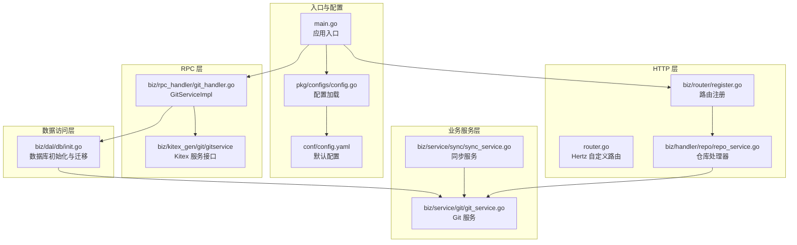
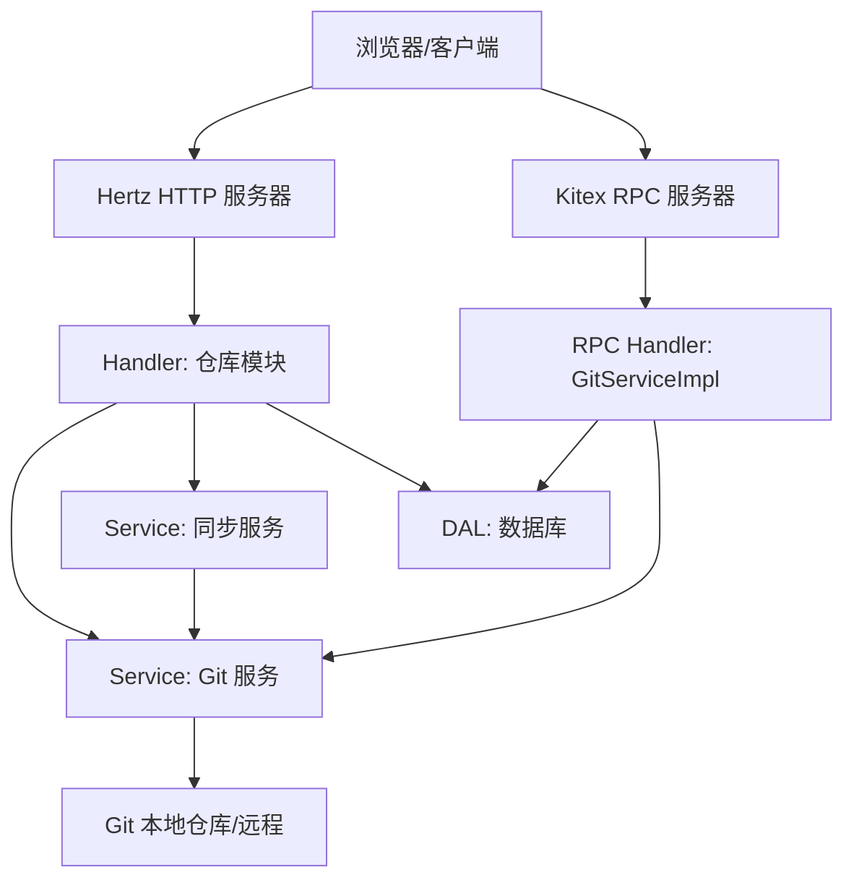
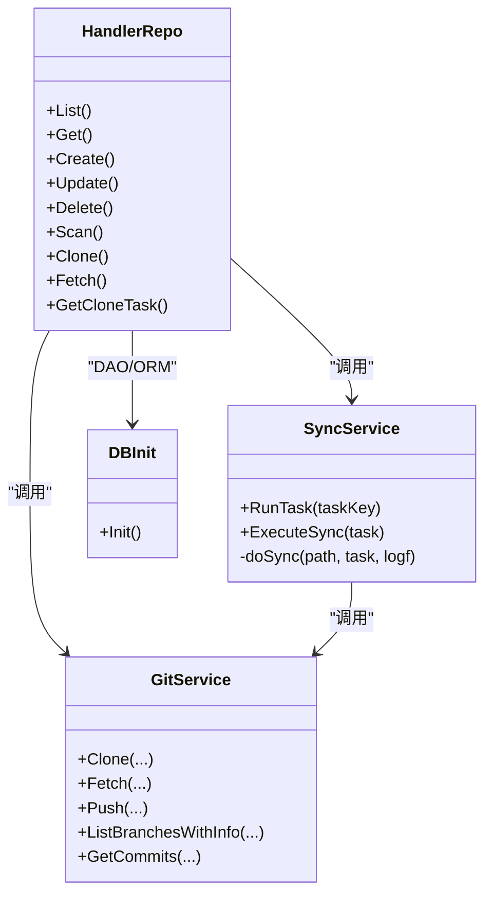
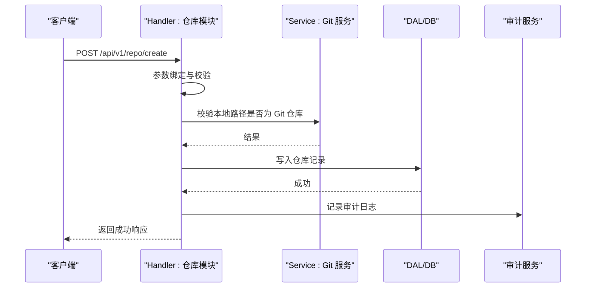
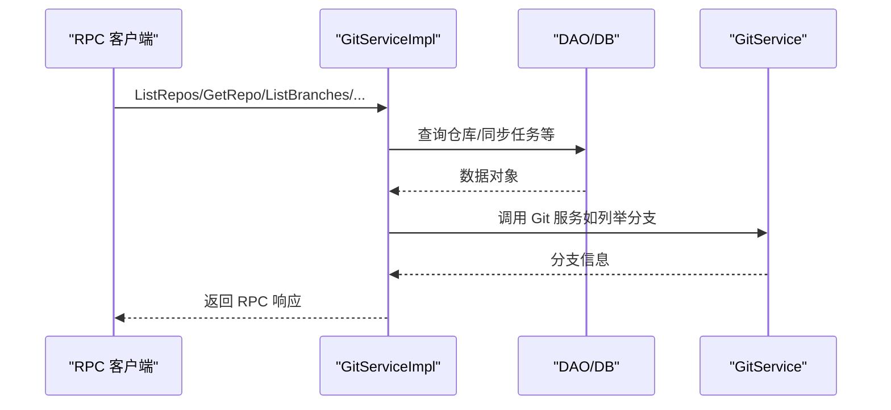
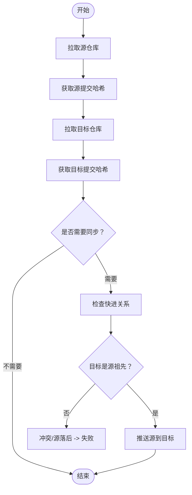
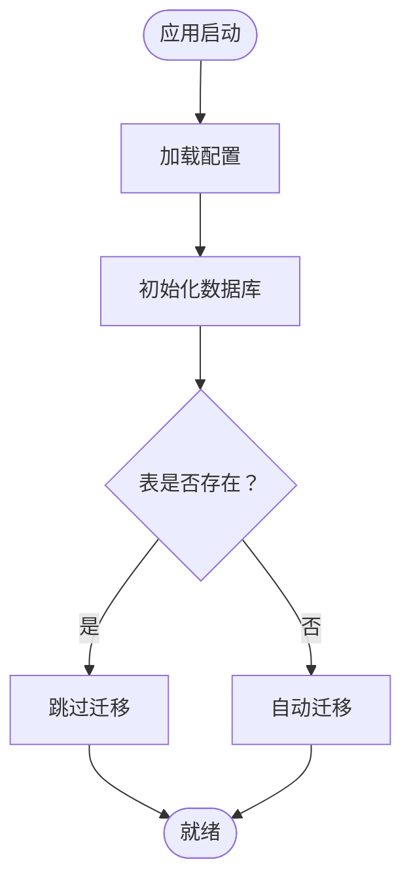
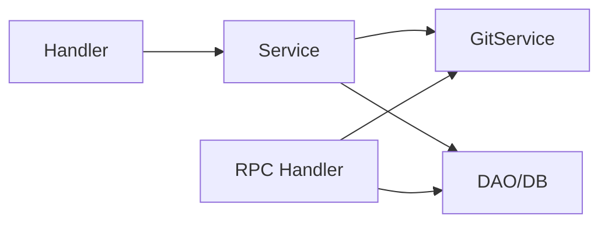

# 架构设计

<cite>
**本文引用的文件**
- [main.go](file://main.go)
- [router.go](file://router.go)
- [biz/router/register.go](file://biz/router/register.go)
- [biz/rpc_handler/git_handler.go](file://biz/rpc_handler/git_handler.go)
- [pkg/configs/config.go](file://pkg/configs/config.go)
- [conf/config.yaml](file://conf/config.yaml)
- [biz/dal/db/init.go](file://biz/dal/db/init.go)
- [biz/service/git/git_service.go](file://biz/service/git/git_service.go)
- [biz/model/domain/git.go](file://biz/model/domain/git.go)
- [biz/handler/repo/repo_service.go](file://biz/handler/repo/repo_service.go)
- [biz/service/sync/sync_service.go](file://biz/service/sync/sync_service.go)
- [biz/middleware/webhook.go](file://biz/middleware/webhook.go)
- [idl/biz/repo.proto](file://idl/biz/repo.proto)
- [deploy/k8s/deployment.yaml](file://deploy/k8s/deployment.yaml)
- [README.md](file://README.md)
</cite>

## 目录
1. [引言](#引言)
2. [项目结构](#项目结构)
3. [核心组件](#核心组件)
4. [架构总览](#架构总览)
5. [详细组件分析](#详细组件分析)
6. [依赖分析](#依赖分析)
7. [性能考虑](#性能考虑)
8. [故障排查指南](#故障排查指南)
9. [结论](#结论)
10. [附录](#附录)

## 引言
本项目是一个轻量级多仓库、多分支自动化同步管理系统，提供 HTTP REST API 与 RPC 双栈服务，并配套前端静态页面。系统采用分层架构（Handler-Service-DAL），围绕 Git 仓库的注册、扫描、克隆、拉取、分支操作与同步任务展开，支持定时调度、Webhook 触发与审计日志。本文档从系统边界、技术选型与权衡出发，给出架构图与组件分解说明，覆盖可扩展性、性能与部署拓扑，并讨论安全性、监控与灾备等跨领域关注点。

## 项目结构
项目采用按业务域划分的层次化组织方式：
- biz：业务域核心，包含 handler（HTTP 路由层）、service（业务服务层）、dal（数据访问层）、model（模型与持久化）、router（路由注册）、rpc_handler（RPC 实现）、middleware（中间件）、service 子模块（git、sync、stats、audit）等
- conf：运行时配置
- deploy：容器化与编排部署示例（Kubernetes）
- docs/public：文档与前端静态资源
- idl：IDL 定义（用于 Kitex RPC 生成）
- pkg：通用包（配置、错误码、响应封装）

**图表来源**
- [main.go](file://main.go#L52-L176)
- [pkg/configs/config.go](file://pkg/configs/config.go#L18-L42)
- [conf/config.yaml](file://conf/config.yaml#L1-L25)
- [biz/router/register.go](file://biz/router/register.go#L18-L41)
- [router.go](file://router.go#L10-L15)
- [biz/handler/repo/repo_service.go](file://biz/handler/repo/repo_service.go#L21-L371)
- [biz/rpc_handler/git_handler.go](file://biz/rpc_handler/git_handler.go#L12-L131)
- [biz/dal/db/init.go](file://biz/dal/db/init.go#L18-L71)
- [biz/service/git/git_service.go](file://biz/service/git/git_service.go#L27-L800)
- [biz/service/sync/sync_service.go](file://biz/service/sync/sync_service.go#L13-L263)

**章节来源**
- [README.md](file://README.md#L31-L40)
- [main.go](file://main.go#L52-L176)
- [biz/router/register.go](file://biz/router/register.go#L18-L41)
- [biz/rpc_handler/git_handler.go](file://biz/rpc_handler/git_handler.go#L12-L131)
- [biz/dal/db/init.go](file://biz/dal/db/init.go#L18-L71)

## 核心组件
- 应用入口与生命周期
  - main.go 提供统一入口，支持 HTTP、RPC 或双栈启动模式；负责初始化配置、数据库、加密工具与业务服务，并优雅关闭
- 配置系统
  - pkg/configs/config.go 负责加载 conf/config.yaml 并注入全局变量；支持环境变量覆盖
- 路由与控制器
  - biz/router/register.go 统一注册各模块路由（/api/v1），并挂载静态资源与根路径重定向
  - router.go 提供 Hertz 自定义路由扩展点
  - biz/handler/repo/repo_service.go 作为典型 Handler 展示了 DAO 调用、Service 协作与审计日志
- RPC 服务
  - biz/rpc_handler/git_handler.go 实现 gitservice 服务接口，桥接 RPC 请求到 DAO 与 Git 服务
- 数据访问层
  - biz/dal/db/init.go 支持 sqlite/mysql/postgres，自动迁移并跳过已存在表
- 业务服务
  - biz/service/git/git_service.go 封装 go-git 与原生命令，提供克隆、拉取、推送、分支操作、日志统计等能力
  - biz/service/sync/sync_service.go 实现跨远端/分支的同步流程，含冲突检测与日志记录
- 中间件与安全
  - biz/middleware/webhook.go 提供 Webhook 的 IP 白名单、速率限制与 HMAC-SHA256 签名校验
- IDL 与生成物
  - idl/biz/repo.proto 定义仓库相关 RPC 接口与消息体，用于 Kitex 生成客户端/服务端代码

**章节来源**
- [main.go](file://main.go#L52-L176)
- [pkg/configs/config.go](file://pkg/configs/config.go#L18-L42)
- [conf/config.yaml](file://conf/config.yaml#L1-L25)
- [biz/router/register.go](file://biz/router/register.go#L18-L41)
- [router.go](file://router.go#L10-L15)
- [biz/handler/repo/repo_service.go](file://biz/handler/repo/repo_service.go#L21-L371)
- [biz/rpc_handler/git_handler.go](file://biz/rpc_handler/git_handler.go#L12-L131)
- [biz/dal/db/init.go](file://biz/dal/db/init.go#L18-L71)
- [biz/service/git/git_service.go](file://biz/service/git/git_service.go#L27-L800)
- [biz/service/sync/sync_service.go](file://biz/service/sync/sync_service.go#L13-L263)
- [biz/middleware/webhook.go](file://biz/middleware/webhook.go#L18-L69)
- [idl/biz/repo.proto](file://idl/biz/repo.proto#L11-L57)

## 架构总览
系统采用“双栈 + 分层”的混合架构：
- 双栈通信
  - HTTP REST API：基于 Hertz，路由在 biz/router/register.go 注册，Handler 调用 Service/DAL 完成业务
  - RPC 服务：基于 Kitex，gRPC/Thrift 风格的接口，Handler 实现 gitservice 服务，直接对接 DAO 与 Git 服务
- 分层架构
  - Handler：接收请求、参数校验、调用 Service、封装响应
  - Service：业务编排、事务与流程控制、调用 Git 服务与 DAO
  - DAL：数据库连接、ORM 初始化与迁移、DAO 方法
- 前后端交互
  - 前端静态资源位于 public/，通过 Hertz 的 Static 挂载；根路径重定向至 index.html，形成 SPA 基础
  - 大部分业务通过 HTTP REST API 与前端交互；RPC 主要面向内部或集成场景

**图表来源**
- [main.go](file://main.go#L136-L176)
- [biz/router/register.go](file://biz/router/register.go#L18-L41)
- [biz/handler/repo/repo_service.go](file://biz/handler/repo/repo_service.go#L21-L371)
- [biz/rpc_handler/git_handler.go](file://biz/rpc_handler/git_handler.go#L12-L131)
- [biz/service/git/git_service.go](file://biz/service/git/git_service.go#L27-L800)
- [biz/service/sync/sync_service.go](file://biz/service/sync/sync_service.go#L13-L263)
- [biz/dal/db/init.go](file://biz/dal/db/init.go#L18-L71)

## 详细组件分析

### Handler-Service-DAL 三层架构
- Handler 层
  - 以仓库模块为例，List/Get/Create/Delete/Fetch/Clone 等接口完成参数绑定、校验与响应封装
  - 调用 DAL 读写数据，调用 Service 执行业务逻辑，必要时记录审计日志
- Service 层
  - Git 服务：封装 go-git 与命令行，提供克隆、拉取、推送、分支操作、日志统计等
  - 同步服务：解析任务配置，执行 fetch、比较快进关系、必要时进行推送与冲突判定
- DAL 层
  - 初始化数据库连接与 ORM，按需迁移表结构；提供 DAO 方法供上层调用

**图表来源**
- [biz/handler/repo/repo_service.go](file://biz/handler/repo/repo_service.go#L21-L371)
- [biz/service/sync/sync_service.go](file://biz/service/sync/sync_service.go#L13-L263)
- [biz/service/git/git_service.go](file://biz/service/git/git_service.go#L27-L800)
- [biz/dal/db/init.go](file://biz/dal/db/init.go#L18-L71)

**章节来源**
- [biz/handler/repo/repo_service.go](file://biz/handler/repo/repo_service.go#L21-L371)
- [biz/service/sync/sync_service.go](file://biz/service/sync/sync_service.go#L13-L263)
- [biz/service/git/git_service.go](file://biz/service/git/git_service.go#L27-L800)
- [biz/dal/db/init.go](file://biz/dal/db/init.go#L18-L71)

### HTTP REST API 工作流（仓库模块）
以下序列图展示“创建仓库”典型流程：请求进入 Hertz 路由，Handler 校验参数并调用 Service/Git/DAO，最终返回成功响应并记录审计日志。

**图表来源**
- [biz/handler/repo/repo_service.go](file://biz/handler/repo/repo_service.go#L52-L126)
- [biz/service/git/git_service.go](file://biz/service/git/git_service.go#L129-L136)
- [biz/dal/db/init.go](file://biz/dal/db/init.go#L18-L71)

**章节来源**
- [biz/handler/repo/repo_service.go](file://biz/handler/repo/repo_service.go#L52-L126)

### RPC 服务工作流（GitServiceImpl）
RPC 服务通过 gitservice 接口对外提供能力，典型方法包括列出仓库、获取仓库、列举分支、创建/删除分支等。Handler 将请求映射到 DAO 与 Git 服务，返回结构化响应。

**图表来源**
- [biz/rpc_handler/git_handler.go](file://biz/rpc_handler/git_handler.go#L15-L131)
- [biz/dal/db/init.go](file://biz/dal/db/init.go#L18-L71)
- [biz/service/git/git_service.go](file://biz/service/git/git_service.go#L453-L470)

**章节来源**
- [biz/rpc_handler/git_handler.go](file://biz/rpc_handler/git_handler.go#L15-L131)

### 同步流程（Fast-Forward 与冲突检测）
同步服务根据任务配置执行 fetch、比较快进关系、必要时进行推送。若目标落后或出现分歧则判定为冲突，避免强制推送破坏历史。

**图表来源**
- [biz/service/sync/sync_service.go](file://biz/service/sync/sync_service.go#L85-L249)

**章节来源**
- [biz/service/sync/sync_service.go](file://biz/service/sync/sync_service.go#L85-L249)

### 配置与数据库初始化
- 配置加载：优先从 conf/config.yaml 加载，支持环境变量覆盖
- 数据库：根据类型选择 sqlite/mysql/postgres，自动迁移表结构

**图表来源**
- [pkg/configs/config.go](file://pkg/configs/config.go#L18-L42)
- [conf/config.yaml](file://conf/config.yaml#L7-L19)
- [biz/dal/db/init.go](file://biz/dal/db/init.go#L18-L71)

**章节来源**
- [pkg/configs/config.go](file://pkg/configs/config.go#L18-L42)
- [conf/config.yaml](file://conf/config.yaml#L7-L19)
- [biz/dal/db/init.go](file://biz/dal/db/init.go#L18-L71)

## 依赖分析
- 组件耦合
  - Handler 依赖 Service 与 DAO；Service 依赖 Git 服务与 DAO；Git 服务依赖 go-git 与系统命令；RPC Handler 依赖 DAO 与 Git 服务
- 外部依赖
  - Hertz（HTTP）、Kitex（RPC）、GORM（ORM）、go-git（Git 操作）、Swagger（API 文档）
- 可能的循环依赖
  - 当前结构清晰分层，未见明显循环依赖迹象

**图表来源**
- [biz/handler/repo/repo_service.go](file://biz/handler/repo/repo_service.go#L21-L371)
- [biz/service/git/git_service.go](file://biz/service/git/git_service.go#L27-L800)
- [biz/service/sync/sync_service.go](file://biz/service/sync/sync_service.go#L13-L263)
- [biz/rpc_handler/git_handler.go](file://biz/rpc_handler/git_handler.go#L12-L131)
- [biz/dal/db/init.go](file://biz/dal/db/init.go#L18-L71)

**章节来源**
- [biz/handler/repo/repo_service.go](file://biz/handler/repo/repo_service.go#L21-L371)
- [biz/service/git/git_service.go](file://biz/service/git/git_service.go#L27-L800)
- [biz/service/sync/sync_service.go](file://biz/service/sync/sync_service.go#L13-L263)
- [biz/rpc_handler/git_handler.go](file://biz/rpc_handler/git_handler.go#L12-L131)
- [biz/dal/db/init.go](file://biz/dal/db/init.go#L18-L71)

## 性能考虑
- 并发与异步
  - 仓库克隆与统计同步采用 goroutine 异步执行，避免阻塞请求线程
- I/O 与网络
  - Git 操作通过 go-git 与命令行结合，建议在高并发场景下对远程认证与带宽进行限流与缓存
- 数据库
  - SQLite 适合单机与小规模场景；MySQL/Postgres 更适合高并发与持久化需求
- 日志与审计
  - 同步过程记录详细日志，便于定位性能瓶颈与异常
- 前端
  - 静态资源由 Hertz 提供，建议启用压缩与缓存策略

[本节为通用指导，无需具体文件引用]

## 故障排查指南
- 启动失败
  - 检查配置文件路径与权限；确认数据库连接参数正确
- HTTP 401/403（Webhook）
  - 核对签名算法与密钥；检查 IP 白名单与速率限制设置
- Git 操作失败
  - 查看同步日志与错误信息；确认远程认证方式与密钥可用性
- RPC 连接问题
  - 确认 RPC 端口开放与地址解析；检查客户端与服务端协议一致性

**章节来源**
- [biz/middleware/webhook.go](file://biz/middleware/webhook.go#L18-L69)
- [biz/service/sync/sync_service.go](file://biz/service/sync/sync_service.go#L35-L74)
- [main.go](file://main.go#L154-L176)

## 结论
该系统以清晰的分层与双栈通信为核心，结合 Git 服务与同步编排，满足多仓库、多分支的自动化同步需求。通过模块化的路由与 RPC 接口、完善的配置与数据库初始化、以及安全中间件与审计日志，系统具备良好的可维护性与可扩展性。建议在生产环境中优先采用 MySQL/Postgres 与 Kubernetes 编排，并完善监控与灾备策略。

[本节为总结性内容，无需具体文件引用]

## 附录

### 系统边界与技术决策
- 系统边界
  - 外部：浏览器/客户端、CI/CD/Webhook 触发方、远程 Git 仓库
  - 内部：HTTP/RPC 服务、业务服务、Git 服务、数据库
- 技术决策与权衡
  - 使用 Hertz 与 Kitex 双栈，兼顾易用性与高性能
  - 采用 GORM 与多数据库适配，便于部署与迁移
  - go-git 与命令行混合，平衡功能完整性与兼容性
  - 前端静态资源与 SPA 设计，降低后端压力

**章节来源**
- [main.go](file://main.go#L136-L176)
- [biz/dal/db/init.go](file://biz/dal/db/init.go#L18-L71)
- [biz/service/git/git_service.go](file://biz/service/git/git_service.go#L27-L800)
- [deploy/k8s/deployment.yaml](file://deploy/k8s/deployment.yaml#L1-L83)

### 部署拓扑与运维要点
- 单节点部署
  - 使用 SQLite 与单一实例，适合开发与测试
- 生产部署
  - 使用 MySQL/Postgres，配合 Kubernetes 部署，挂载持久卷存储仓库与数据
  - 通过 ConfigMap/Secret 注入配置与密钥，暴露 HTTP 与 RPC 端口
- 运维建议
  - 开启健康检查与日志聚合
  - 对 Webhook 与 Git 操作实施限流与鉴权
  - 定期备份数据库与仓库目录

**章节来源**
- [deploy/k8s/deployment.yaml](file://deploy/k8s/deployment.yaml#L1-L83)
- [conf/config.yaml](file://conf/config.yaml#L1-L25)
- [pkg/configs/config.go](file://pkg/configs/config.go#L18-L42)

### 安全性、监控与灾备
- 安全性
  - Webhook 签名验证、IP 白名单、速率限制
  - Git 认证支持 HTTP Basic 与 SSH，建议使用密钥与代理
- 监控
  - 记录同步日志与审计事件，结合外部日志系统
- 灾备
  - 数据库与仓库目录的定期备份与异地存放
  - 通过容器编排实现滚动升级与故障恢复

**章节来源**
- [biz/middleware/webhook.go](file://biz/middleware/webhook.go#L18-L69)
- [biz/service/git/git_service.go](file://biz/service/git/git_service.go#L50-L127)
- [biz/service/sync/sync_service.go](file://biz/service/sync/sync_service.go#L35-L74)