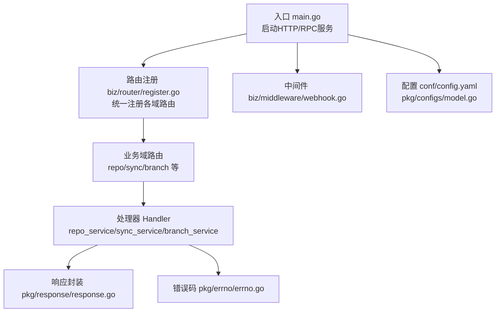
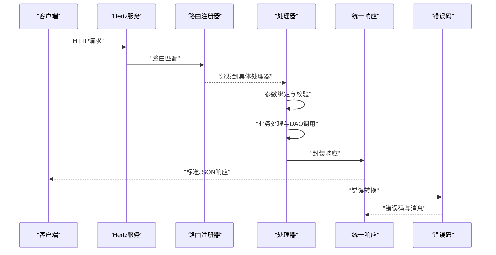
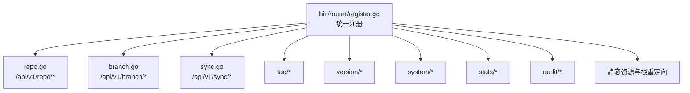
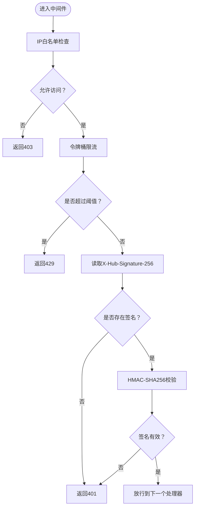
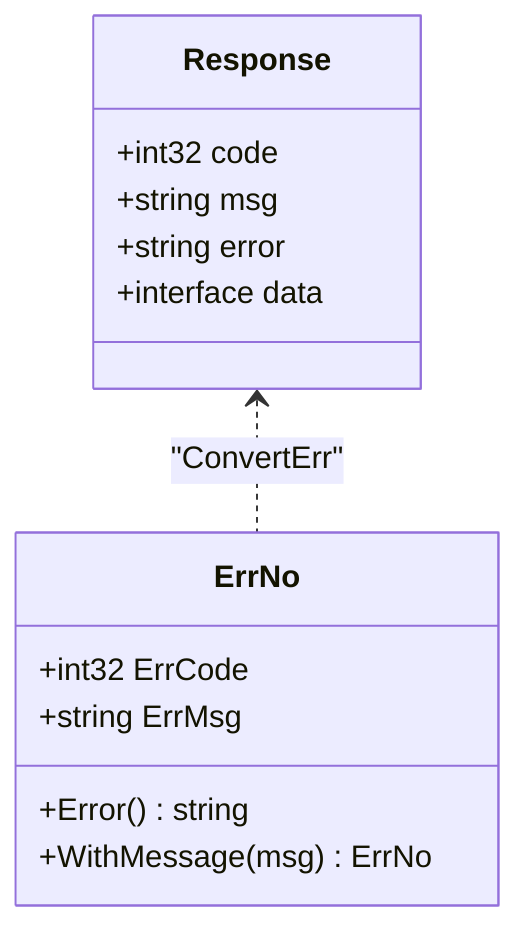
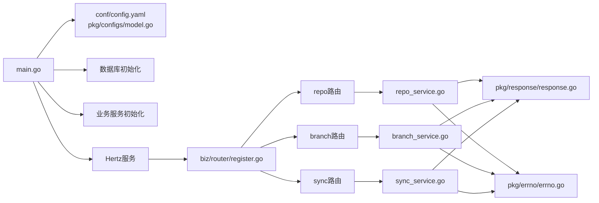

# HTTP REST API架构

<cite>
**本文引用的文件**
- [main.go](file://main.go)
- [router.go](file://router.go)
- [biz/router/register.go](file://biz/router/register.go)
- [biz/router/hz/register.go](file://biz/router/hz/register.go)
- [biz/router/repo/repo.go](file://biz/router/repo/repo.go)
- [biz/router/sync/sync.go](file://biz/router/sync/sync.go)
- [biz/router/branch/branch.go](file://biz/router/branch/branch.go)
- [biz/handler/repo/repo_service.go](file://biz/handler/repo/repo_service.go)
- [biz/handler/sync/sync_service.go](file://biz/handler/sync/sync_service.go)
- [biz/handler/branch/branch_service.go](file://biz/handler/branch/branch_service.go)
- [biz/middleware/webhook.go](file://biz/middleware/webhook.go)
- [pkg/response/response.go](file://pkg/response/response.go)
- [pkg/errno/errno.go](file://pkg/errno/errno.go)
- [conf/config.yaml](file://conf/config.yaml)
- [pkg/configs/model.go](file://pkg/configs/model.go)
</cite>

## 目录
1. [简介](#简介)
2. [项目结构](#项目结构)
3. [核心组件](#核心组件)
4. [架构总览](#架构总览)
5. [详细组件分析](#详细组件分析)
6. [依赖关系分析](#依赖关系分析)
7. [性能考量](#性能考量)
8. [故障排查指南](#故障排查指南)
9. [结论](#结论)
10. [附录](#附录)

## 简介
本文件系统性阐述基于 CloudWeGo Hertz 的 HTTP REST API 架构，覆盖路由注册机制、中间件处理流程、请求响应处理、RESTful 设计与 URL 规范，以及仓库管理、同步服务、分支管理等核心功能的接口实现。同时说明 HTTP 中间件在 Webhook 验证、速率限制与请求拦截中的作用机制，提供标准响应结构、错误码体系、状态码定义、异常处理策略，以及与前端界面的数据交互模式与跨域处理建议。

## 项目结构
项目采用分层与按功能域划分的组织方式：
- 入口与服务编排：main.go 负责初始化资源、启动 HTTP/RPC 服务、信号处理与优雅关闭。
- 路由注册：biz/router/register.go 统一注册各业务域路由；各子域通过各自的 router 文件完成具体路由绑定。
- 处理器（Handler）：biz/handler 下按业务域划分，每个处理器实现具体 API 的请求解析、业务调用与响应封装。
- 中间件：biz/middleware 提供 Webhook 验证等横切能力。
- 响应与错误码：pkg/response 提供统一响应结构；pkg/errno 定义业务错误码。
- 配置：conf/config.yaml 与 pkg/configs/model.go 提供运行时配置模型。

图表来源
- [main.go](file://main.go#L52-L176)
- [biz/router/register.go](file://biz/router/register.go#L18-L42)
- [biz/router/repo/repo.go](file://biz/router/repo/repo.go#L16-L39)
- [biz/router/sync/sync.go](file://biz/router/sync/sync.go#L16-L41)
- [biz/router/branch/branch.go](file://biz/router/branch/branch.go#L16-L43)
- [pkg/response/response.go](file://pkg/response/response.go#L9-L87)
- [pkg/errno/errno.go](file://pkg/errno/errno.go#L7-L129)
- [biz/middleware/webhook.go](file://biz/middleware/webhook.go#L18-L70)
- [conf/config.yaml](file://conf/config.yaml#L1-L25)
- [pkg/configs/model.go](file://pkg/configs/model.go#L3-L34)

章节来源
- [main.go](file://main.go#L52-L176)
- [biz/router/register.go](file://biz/router/register.go#L18-L42)
- [conf/config.yaml](file://conf/config.yaml#L1-L25)
- [pkg/configs/model.go](file://pkg/configs/model.go#L3-L34)

## 核心组件
- Hertz HTTP 服务：负责监听端口、注册路由、处理请求与响应。
- 路由注册器：集中注册各业务域路由，支持静态资源与根路径重定向。
- 处理器：实现具体业务逻辑，负责参数校验、DAO 调用、审计日志与响应封装。
- 中间件：提供 Webhook 验证、IP 白名单、速率限制等安全与防护能力。
- 统一响应与错误码：标准化返回结构与错误码映射，便于前端统一处理。
- 配置系统：集中管理服务端口、数据库类型与连接、Webhook 密钥与限流参数。

章节来源
- [main.go](file://main.go#L136-L176)
- [biz/router/register.go](file://biz/router/register.go#L18-L42)
- [pkg/response/response.go](file://pkg/response/response.go#L9-L87)
- [pkg/errno/errno.go](file://pkg/errno/errno.go#L7-L129)
- [biz/middleware/webhook.go](file://biz/middleware/webhook.go#L18-L70)
- [conf/config.yaml](file://conf/config.yaml#L1-L25)

## 架构总览
Hertz 在启动时加载配置并初始化数据库与统计、审计等服务，随后注册所有业务路由。请求进入后，按路由匹配到对应处理器，处理器内部进行参数绑定与校验、调用业务服务与 DAO 层，最终通过统一响应结构返回结果。Webhook 请求会经过专门的中间件链路进行签名验证与速率限制。

图表来源
- [main.go](file://main.go#L136-L176)
- [biz/router/register.go](file://biz/router/register.go#L18-L42)
- [pkg/response/response.go](file://pkg/response/response.go#L17-L87)
- [pkg/errno/errno.go](file://pkg/errno/errno.go#L119-L129)

## 详细组件分析

### 路由注册机制
- 统一注册：biz/router/register.go 在 /api/v1 下按域注册路由组，包含 repo、branch、sync、tag、version、system、stats、audit 等。
- 子域路由：各子域 router 文件使用 Group 方式构建层级，如 /api/v1/repo、/api/v1/branch 等。
- 静态资源：注册 Swagger 文档与前端静态页面，根路径重定向至 index.html。
- 自定义路由：router.go 支持自定义路由（如 /ping），通过 GeneratedRegister 汇聚。

图表来源
- [biz/router/register.go](file://biz/router/register.go#L18-L42)
- [biz/router/repo/repo.go](file://biz/router/repo/repo.go#L16-L39)
- [biz/router/branch/branch.go](file://biz/router/branch/branch.go#L16-L43)
- [biz/router/sync/sync.go](file://biz/router/sync/sync.go#L16-L41)
- [router.go](file://router.go#L10-L16)

章节来源
- [biz/router/register.go](file://biz/router/register.go#L18-L42)
- [biz/router/repo/repo.go](file://biz/router/repo/repo.go#L16-L39)
- [biz/router/branch/branch.go](file://biz/router/branch/branch.go#L16-L43)
- [biz/router/sync/sync.go](file://biz/router/sync/sync.go#L16-L41)
- [router.go](file://router.go#L10-L16)

### 中间件处理流程
- Webhook 验证中间件：支持 IP 白名单检查、速率限制（基于令牌桶）、签名验证（sha256），通过请求头 X-Hub-Signature-256 进行 HMAC 校验。
- 执行顺序：先做 IP 白名单与限流判断，再进行签名验证，通过后才进入后续处理器。
- 限流参数：来源于配置文件的 rate_limit，用于初始化速率限制器。

图表来源
- [biz/middleware/webhook.go](file://biz/middleware/webhook.go#L18-L70)
- [conf/config.yaml](file://conf/config.yaml#L21-L25)

章节来源
- [biz/middleware/webhook.go](file://biz/middleware/webhook.go#L18-L70)
- [conf/config.yaml](file://conf/config.yaml#L21-L25)

### 请求响应处理
- 统一响应结构：包含 code、msg、error、data 字段，成功响应 code 为 0。
- 常见方法：
  - Success：成功响应
  - Accepted：异步处理响应（HTTP 202）
  - Error/ErrorWithCode：错误响应，自动将业务错误转换为 ErrNo
  - BadRequest/NotFound/InternalServerError/Unauthorized/Forbidden/Conflict：语义化错误响应
- 错误码体系：通用错误码（0-999）与各业务域细分错误码（10000+），支持 ConvertErr 统一转换。

图表来源
- [pkg/response/response.go](file://pkg/response/response.go#L9-L87)
- [pkg/errno/errno.go](file://pkg/errno/errno.go#L7-L129)

章节来源
- [pkg/response/response.go](file://pkg/response/response.go#L9-L87)
- [pkg/errno/errno.go](file://pkg/errno/errno.go#L7-L129)

### 仓库管理 API
- 路由示例：/api/v1/repo/list、/api/v1/repo/detail、/api/v1/repo/create、/api/v1/repo/update、/api/v1/repo/delete、/api/v1/repo/scan、/api/v1/repo/clone、/api/v1/repo/fetch、/api/v1/repo/task
- 处理器职责：参数绑定与校验、DAO 查询与持久化、Git 服务调用、审计日志记录、异步统计触发。
- 关键点：创建/更新时对仓库路径合法性校验；删除前检查是否被同步任务使用；克隆支持进度上报与异步任务管理。

章节来源
- [biz/router/repo/repo.go](file://biz/router/repo/repo.go#L16-L39)
- [biz/handler/repo/repo_service.go](file://biz/handler/repo/repo_service.go#L21-L371)

### 同步服务 API
- 路由示例：/api/v1/sync/tasks、/api/v1/sync/task、/api/v1/sync/task/create、/api/v1/sync/task/update、/api/v1/sync/task/delete、/api/v1/sync/run、/api/v1/sync/execute、/api/v1/sync/history、/api/v1/sync/history/delete
- 处理器职责：任务查询/创建/更新/删除、立即执行与异步执行、历史记录查询与清理、审计日志记录。
- 关键点：任务更新后同步到定时服务；执行同步时支持异步协程；历史记录支持按仓库过滤。

章节来源
- [biz/router/sync/sync.go](file://biz/router/sync/sync.go#L16-L41)
- [biz/handler/sync/sync_service.go](file://biz/handler/sync/sync_service.go#L19-L258)

### 分支管理 API
- 路由示例：/api/v1/branch/list、/api/v1/branch/create、/api/v1/branch/delete、/api/v1/branch/update、/api/v1/branch/checkout、/api/v1/branch/push、/api/v1/branch/pull、/api/v1/branch/compare、/api/v1/branch/diff、/api/v1/branch/merge/check、/api/v1/branch/merge、/api/v1/branch/patch
- 处理器职责：分支列表与筛选、创建/删除/重命名/描述设置、检出、推送/拉取、差异比较与补丁导出、合并预检与合并执行。
- 关键点：合并冲突时返回 409 并提供报告链接；差异导出支持下载；上游配置缺失时给出明确提示。

章节来源
- [biz/router/branch/branch.go](file://biz/router/branch/branch.go#L16-L43)
- [biz/handler/branch/branch_service.go](file://biz/handler/branch/branch_service.go#L22-L522)

### Webhook 验证与安全
- 验证步骤：IP 白名单 → 速率限制 → 签名验证（sha256=hex）
- 配置项：secret、rate_limit、ip_whitelist
- 使用场景：外部系统（如 Git 服务）回调时进行身份与来源校验，防止滥用与伪造请求。

章节来源
- [biz/middleware/webhook.go](file://biz/middleware/webhook.go#L18-L70)
- [conf/config.yaml](file://conf/config.yaml#L21-L25)

### 前端交互与跨域处理
- 静态资源：Hertz 提供 /public 目录静态文件服务，根路径重定向到 index.html，适配单页应用。
- 跨域策略：代码中未显式配置 CORS 中间件，建议在生产环境通过反向代理或网关统一处理跨域（如 Access-Control-Allow-Origin、Credentials 等），以避免浏览器同源策略限制。

章节来源
- [biz/router/register.go](file://biz/router/register.go#L30-L41)

## 依赖关系分析
- 启动阶段：main.go 调用 initResources 初始化配置、数据库、加密工具与业务服务，随后根据模式启动 HTTP 或 RPC 服务。
- 路由阶段：biz/router/register.go 调用各子域 Register 方法，形成完整的 /api/v1 路由树。
- 处理阶段：各处理器依赖 DAO、业务服务与审计模块，统一通过 pkg/response 返回标准响应。
- 错误处理：pkg/errno 提供统一错误码，pkg/response 负责将错误转换为标准响应结构。

图表来源
- [main.go](file://main.go#L115-L176)
- [biz/router/register.go](file://biz/router/register.go#L18-L42)
- [pkg/response/response.go](file://pkg/response/response.go#L9-L87)
- [pkg/errno/errno.go](file://pkg/errno/errno.go#L7-L129)

章节来源
- [main.go](file://main.go#L115-L176)
- [biz/router/register.go](file://biz/router/register.go#L18-L42)

## 性能考量
- 速率限制：Webhook 中间件内置令牌桶限流，可依据业务压力调整 rate_limit。
- 异步处理：仓库克隆、同步执行、统计同步均采用 goroutine 异步执行，避免阻塞请求线程。
- 数据库连接：建议结合连接池配置与慢查询监控，确保高并发下的稳定性。
- 前端静态资源：Hertz 直接提供静态文件，建议配合 CDN 与缓存策略提升加载速度。

## 故障排查指南
- 常见错误码与含义：
  - 通用：成功（0）、参数错误（400）、未授权（401）、禁止（403）、未找到（404）、冲突（409）、服务错误（500）
  - 仓库相关：仓库不存在、已存在、路径无效、克隆/抓取失败、扫描失败、非Git仓库、被同步任务占用
  - 分支相关：分支不存在、已存在、删除/创建/重命名失败、检出失败、推送/拉取失败、合并失败、合并冲突、工作区不干净
  - 同步任务相关：任务不存在、执行失败、Cron 配置错误、任务禁用、任务已在运行
  - 认证相关：认证失败、SSH密钥无效/不存在、远程连接失败、凭据无效
  - 标签相关：标签不存在、已存在、创建/删除失败
  - 系统相关：配置加载/保存失败、目录不存在/访问被拒绝、文件操作错误
- 排查步骤：
  - 检查请求参数与必填字段，关注 BadRequest 返回
  - 查看审计日志与任务历史，定位业务异常
  - 核对 Webhook 配置（secret、rate_limit、ip_whitelist），确认签名与限流规则
  - 关注异步任务状态（如克隆任务ID），通过 /api/v1/repo/task 获取进度

章节来源
- [pkg/errno/errno.go](file://pkg/errno/errno.go#L31-L129)
- [pkg/response/response.go](file://pkg/response/response.go#L58-L87)

## 结论
该系统以 Hertz 为核心，采用清晰的路由分层与处理器职责划分，结合统一响应与错误码体系，实现了稳定可靠的 REST API。Webhook 中间件提供了基础的安全与防护能力。建议在生产环境中补充 CORS 处理与更完善的鉴权机制，并持续优化异步任务与数据库性能，以满足高并发场景需求。

## 附录

### RESTful 设计与 URL 规范
- 基础路径：/api/v1
- 资源命名：使用名词复数形式（如 /repo、/branch、/sync）
- 动作表达：使用 HTTP 方法表达动作（GET 列表/详情、POST 创建/执行、DELETE 删除、PUT 更新）
- 查询参数：分页（page/page_size）、筛选（keyword）、关联查询（repo_key、task_id 等）

### API 调用示例与参数说明
- 仓库管理
  - GET /api/v1/repo/list：无参数，返回仓库列表
  - GET /api/v1/repo/detail?key=string：查询参数 key 必填
  - POST /api/v1/repo/create：请求体包含仓库注册所需字段（名称、路径、远端配置等）
  - POST /api/v1/repo/update：请求体包含 key 与更新字段
  - POST /api/v1/repo/delete：请求体包含 key
  - POST /api/v1/repo/scan：请求体包含本地路径
  - POST /api/v1/repo/clone：请求体包含远端URL与本地路径及认证信息
  - POST /api/v1/repo/fetch：请求体包含 repo_key
  - GET /api/v1/repo/task?task_id=string：查询参数 task_id 必填
- 同步服务
  - GET /api/v1/sync/tasks：可选查询参数 repo_key
  - GET /api/v1/sync/task?key=string：查询参数 key 必填
  - POST /api/v1/sync/task/create：请求体为同步任务定义
  - POST /api/v1/sync/task/update：请求体包含 key 与更新字段
  - POST /api/v1/sync/task/delete：请求体包含 key
  - POST /api/v1/sync/run：请求体包含 task_key
  - POST /api/v1/sync/execute：请求体包含 repo_key 与源/目标分支信息
  - GET /api/v1/sync/history：可选查询参数 repo_key
  - POST /api/v1/sync/history/delete：请求体包含 id 或查询参数 id
- 分支管理
  - GET /api/v1/branch/list?repo_key=string&page=&page_size=&keyword=：分页与筛选
  - POST /api/v1/branch/create：请求体包含 repo_key、name、base_ref
  - POST /api/v1/branch/delete：请求体包含 repo_key、name、force
  - POST /api/v1/branch/update：请求体包含 repo_key、name、new_name、desc
  - POST /api/v1/branch/checkout：请求体包含 repo_key、name
  - POST /api/v1/branch/push：请求体包含 repo_key、name、remotes[]
  - POST /api/v1/branch/pull：请求体包含 repo_key、name
  - GET /api/v1/branch/compare?repo_key=string&base=string&target=string
  - GET /api/v1/branch/diff?repo_key=string&base=string&target=string&file=string
  - GET /api/v1/branch/merge/check?repo_key=string&base=string&target=string
  - POST /api/v1/branch/merge：请求体包含 repo_key、source、target、message
  - GET /api/v1/branch/patch?repo_key=string&base=string&target=string

### 响应格式与状态码
- 成功：code=0，msg="success"，data 为业务数据
- 异步处理：HTTP 202，msg 说明异步开始，data 包含任务标识
- 参数错误：HTTP 200，code=400
- 未授权：HTTP 200，code=401
- 禁止访问：HTTP 200，code=403
- 未找到：HTTP 200，code=404
- 冲突：HTTP 200，code=409（如合并冲突）
- 服务器内部错误：HTTP 200，code=500

章节来源
- [pkg/response/response.go](file://pkg/response/response.go#L17-L87)
- [pkg/errno/errno.go](file://pkg/errno/errno.go#L31-L129)