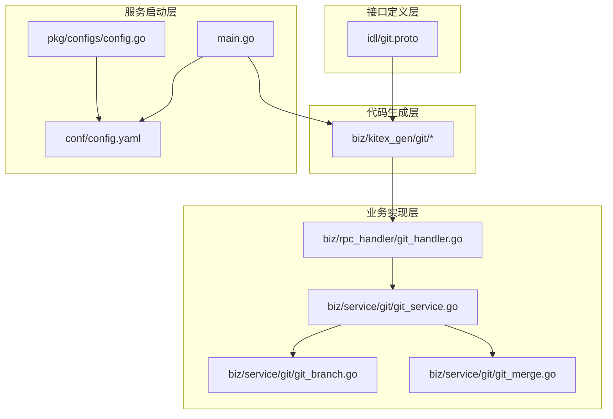
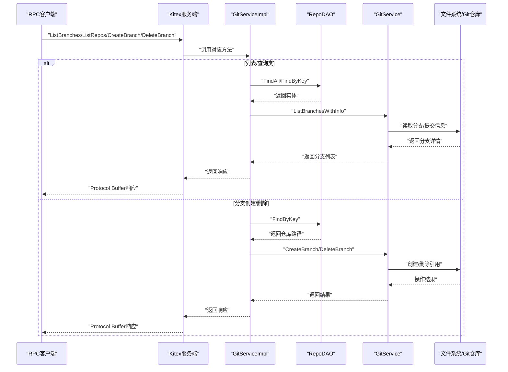
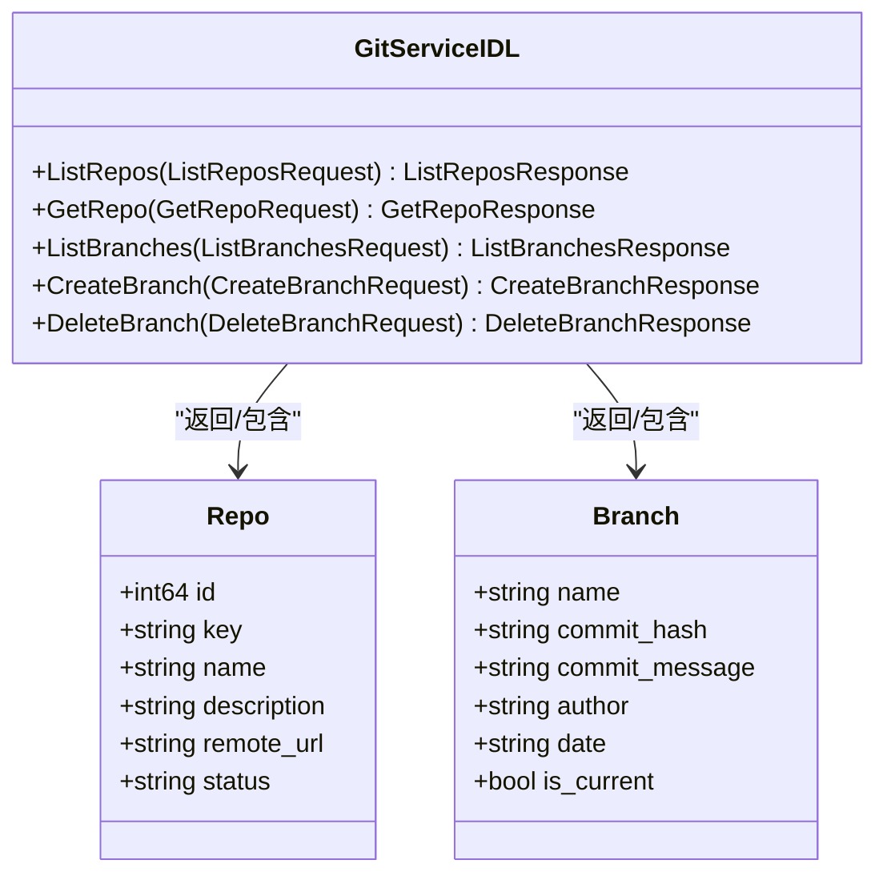
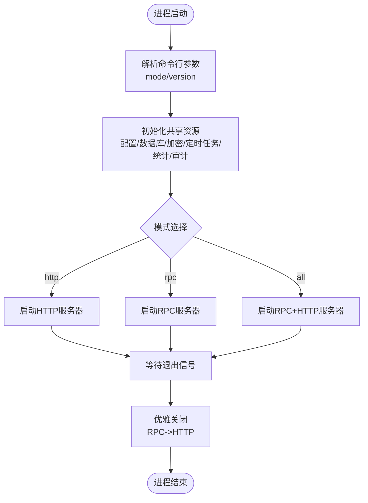
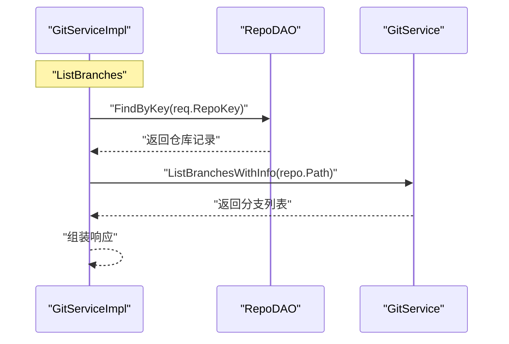
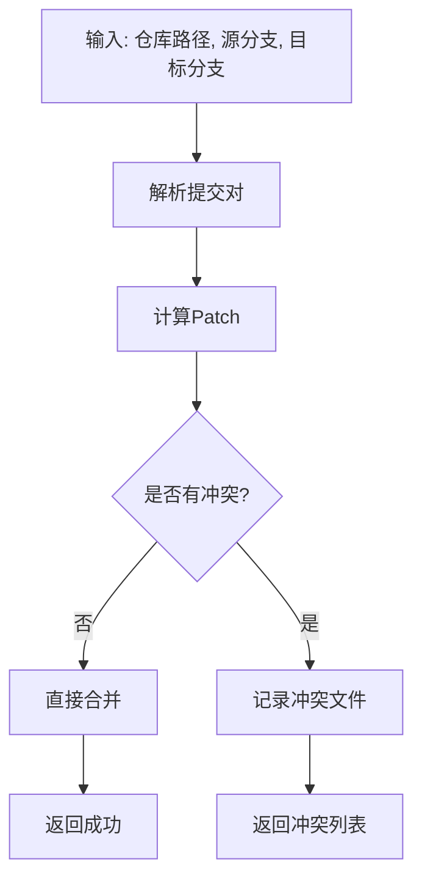
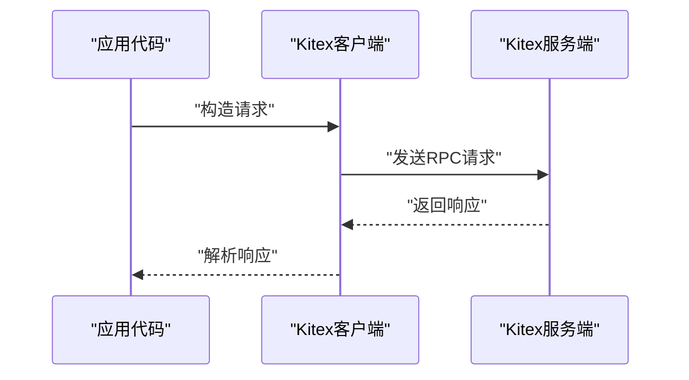
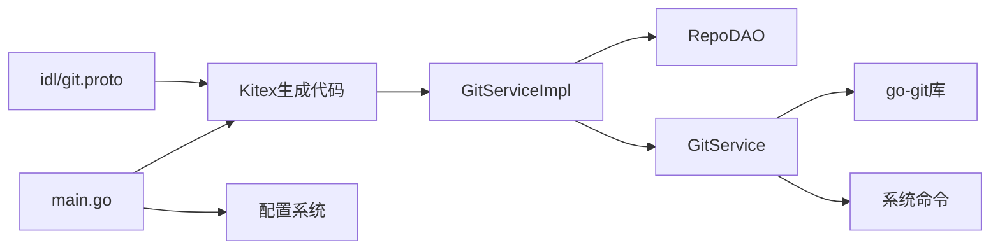

# RPC服务架构

<cite>
**本文档引用的文件**
- [main.go](file://main.go)
- [git.proto](file://idl/git.proto)
- [gitservice.go](file://biz/kitex_gen/git/gitservice/gitservice.go)
- [git.pb.go](file://biz/kitex_gen/git/git.pb.go)
- [git_handler.go](file://biz/rpc_handler/git_handler.go)
- [git_service.go](file://biz/service/git/git_service.go)
- [git_branch.go](file://biz/service/git/git_branch.go)
- [git_merge.go](file://biz/service/git/git_merge.go)
- [config.go](file://pkg/configs/config.go)
- [config.yaml](file://conf/config.yaml)
- [kitex_info.yaml](file://biz/kitex_info.yaml)
</cite>

## 目录
1. [简介](#简介)
2. [项目结构](#项目结构)
3. [核心组件](#核心组件)
4. [架构总览](#架构总览)
5. [详细组件分析](#详细组件分析)
6. [依赖关系分析](#依赖关系分析)
7. [性能考虑](#性能考虑)
8. [故障排除指南](#故障排除指南)
9. [结论](#结论)

## 简介
本文件面向Git管理服务的RPC服务架构，基于CloudWeGo Kitex框架构建，采用Protocol Buffer作为接口定义语言，提供Git仓库管理相关的远程过程调用能力。文档重点阐述以下方面：
- 基于IDL的RPC接口设计与代码生成
- GitService的RPC接口实现（仓库列表、仓库详情、分支列表、创建分支、删除分支）
- RPC服务启动流程、服务注册与客户端集成
- 客户端使用示例与连接池配置、错误重试机制
- RPC与HTTP服务的协作关系与数据传输格式
- 性能优化建议、连接管理与故障处理策略

## 项目结构
该项目采用分层架构，围绕RPC服务展开：
- 接口定义层：IDL文件定义RPC接口与消息类型
- 代码生成层：Kitex根据IDL生成服务端与客户端代码
- 业务实现层：RPC处理器对接DAO与Git服务，完成具体业务逻辑
- 服务启动层：统一入口负责HTTP与RPC服务的启动与优雅关闭

**图表来源**
- [git.proto](file://idl/git.proto#L1-L78)
- [gitservice.go](file://biz/kitex_gen/git/gitservice/gitservice.go#L1-L117)
- [git_handler.go](file://biz/rpc_handler/git_handler.go#L1-L131)
- [git_service.go](file://biz/service/git/git_service.go#L1-L800)
- [git_branch.go](file://biz/service/git/git_branch.go#L1-L187)
- [git_merge.go](file://biz/service/git/git_merge.go#L1-L263)
- [main.go](file://main.go#L1-L176)
- [config.yaml](file://conf/config.yaml#L1-L25)
- [config.go](file://pkg/configs/config.go#L1-L43)

**章节来源**
- [main.go](file://main.go#L1-L176)
- [git.proto](file://idl/git.proto#L1-L78)

## 核心组件
- Protocol Buffer接口定义：在IDL中定义GitService服务及请求/响应消息类型，确保跨语言一致的接口契约。
- Kitex服务生成：通过IDL生成服务端与客户端代码，包含方法注册、序列化/反序列化、服务信息等。
- RPC处理器：实现GitService接口，负责数据访问与业务编排，调用Git服务执行具体操作。
- Git服务：封装go-git与系统命令，提供仓库操作、分支管理、合并处理等能力。
- 配置系统：集中加载配置，支持运行时覆盖，为RPC与HTTP服务提供端口等参数。

**章节来源**
- [git.proto](file://idl/git.proto#L5-L11)
- [gitservice.go](file://biz/kitex_gen/git/gitservice/gitservice.go#L17-L53)
- [git_handler.go](file://biz/rpc_handler/git_handler.go#L12-L131)
- [git_service.go](file://biz/service/git/git_service.go#L27-L31)
- [config.go](file://pkg/configs/config.go#L18-L42)

## 架构总览
RPC服务采用Kitex提供的Server模型，结合自定义配置与优雅关闭流程，同时与HTTP服务并行运行或独立运行。RPC接口以Protocol Buffer进行序列化，内部通过go-git库与系统命令执行Git操作。

**图表来源**
- [gitservice.go](file://biz/kitex_gen/git/gitservice/gitservice.go#L119-L143)
- [git_handler.go](file://biz/rpc_handler/git_handler.go#L16-L130)
- [git_service.go](file://biz/service/git/git_service.go#L129-L136)
- [git_branch.go](file://biz/service/git/git_branch.go#L13-L116)

**章节来源**
- [main.go](file://main.go#L154-L175)
- [gitservice.go](file://biz/kitex_gen/git/gitservice/gitservice.go#L108-L117)
- [git_handler.go](file://biz/rpc_handler/git_handler.go#L16-L130)

## 详细组件分析

### Protocol Buffer接口定义与生成
- 接口定义：GitService包含五个方法：ListRepos、GetRepo、ListBranches、CreateBranch、DeleteBranch；配套消息类型包括Repo、Branch以及各请求/响应对象。
- 代码生成：Kitex生成服务信息、方法注册、客户端与服务端桩代码，使用Protobuf作为PayloadCodec，确保高效序列化与跨语言兼容。
- 服务信息：生成的服务信息包含方法映射、流式模式、包名等元数据，供Kitex运行时使用。

**图表来源**
- [git.proto](file://idl/git.proto#L5-L11)
- [git.proto](file://idl/git.proto#L13-L29)

**章节来源**
- [git.proto](file://idl/git.proto#L1-L78)
- [gitservice.go](file://biz/kitex_gen/git/gitservice/gitservice.go#L89-L117)
- [git.pb.go](file://biz/kitex_gen/git/git.pb.go#L11-L365)

### RPC服务端实现与启动流程
- 服务端创建：通过Kitex生成的NewServer函数创建服务实例，绑定TCP地址与端口。
- 启动方式：支持独立RPC模式、HTTP+RPC模式或仅HTTP模式，通过命令行参数选择。
- 优雅关闭：捕获系统信号，先停止RPC服务，再关闭HTTP服务，确保资源释放与连接清理。

**图表来源**
- [main.go](file://main.go#L52-L113)
- [main.go](file://main.go#L136-L175)

**章节来源**
- [main.go](file://main.go#L52-L175)

### GitService RPC接口实现
- ListRepos：从DAO查询所有仓库，进行简单分页后返回；响应包含仓库列表与总数。
- GetRepo：按key查找仓库，返回仓库信息。
- ListBranches：根据仓库key获取路径，调用GitService.ListBranchesWithInfo获取分支详情。
- CreateBranch：校验仓库存在性，调用GitService.CreateBranch创建分支。
- DeleteBranch：校验仓库存在性，调用GitService.DeleteBranch删除分支。

**图表来源**
- [git_handler.go](file://biz/rpc_handler/git_handler.go#L73-L100)
- [git_branch.go](file://biz/service/git/git_branch.go#L13-L79)

**章节来源**
- [git_handler.go](file://biz/rpc_handler/git_handler.go#L15-L130)

### Git服务与分支/合并处理
- GitService封装了go-git与系统命令，提供仓库打开、远程检测、克隆、拉取、推送、分支操作、合并处理、差异计算等功能。
- 分支操作：支持列出分支详情、创建分支、删除分支、重命名分支、描述设置等。
- 合并处理：提供差异统计、文件变更列表、原始diff内容、合并预检（干跑）与实际合并，合并失败时自动回滚。

**图表来源**
- [git_merge.go](file://biz/service/git/git_merge.go#L158-L242)

**章节来源**
- [git_service.go](file://biz/service/git/git_service.go#L129-L800)
- [git_branch.go](file://biz/service/git/git_branch.go#L81-L154)
- [git_merge.go](file://biz/service/git/git_merge.go#L21-L242)

### 客户端集成与使用示例
- 客户端生成：Kitex为GitService生成客户端桩代码，包含ListRepos、GetRepo、ListBranches、CreateBranch、DeleteBranch等方法。
- 调用流程：客户端构造请求对象，通过Kitex客户端发起RPC调用，服务端处理后返回响应。
- 连接池与重试：建议在生产环境中启用Kitex客户端的连接池与超时控制，并结合指数退避策略实现错误重试。

**图表来源**
- [gitservice.go](file://biz/kitex_gen/git/gitservice/gitservice.go#L674-L732)

**章节来源**
- [gitservice.go](file://biz/kitex_gen/git/gitservice/gitservice.go#L674-L732)

### 配置与环境变量
- 配置加载：pkg/configs模块负责从多个路径加载YAML配置，支持环境变量覆盖。
- 关键配置：包含RPC端口、HTTP端口、数据库类型与路径、Webhook相关参数等。
- 兼容性：保留部分旧版全局变量以便向后兼容。

**章节来源**
- [config.go](file://pkg/configs/config.go#L18-L42)
- [config.yaml](file://conf/config.yaml#L1-L25)

## 依赖关系分析
- 接口到实现：IDL定义的GitService接口由GitServiceImpl实现，Kitex生成的服务信息驱动RPC调用。
- 业务耦合：RPC处理器依赖DAO与Git服务，Git服务依赖go-git与系统命令。
- 外部依赖：Kitex运行时、go-git、SSH认证库、HTTP框架（Hertz）等。

**图表来源**
- [git.proto](file://idl/git.proto#L1-L78)
- [gitservice.go](file://biz/kitex_gen/git/gitservice/gitservice.go#L1-L117)
- [git_handler.go](file://biz/rpc_handler/git_handler.go#L1-L131)
- [git_service.go](file://biz/service/git/git_service.go#L1-L800)
- [main.go](file://main.go#L1-L176)

**章节来源**
- [git.proto](file://idl/git.proto#L1-L78)
- [gitservice.go](file://biz/kitex_gen/git/gitservice/gitservice.go#L1-L117)
- [git_handler.go](file://biz/rpc_handler/git_handler.go#L1-L131)
- [git_service.go](file://biz/service/git/git_service.go#L1-L800)
- [main.go](file://main.go#L1-L176)

## 性能考虑
- 序列化开销：使用Protobuf序列化，相比JSON更高效，适合高频RPC调用场景。
- 并发与连接：建议启用Kitex客户端连接池，合理设置最大并发与超时时间，避免阻塞。
- Git操作成本：分支列举、日志统计等操作可能较耗时，建议缓存热点数据或异步处理。
- 网络与I/O：远程仓库的fetch/push受网络影响较大，建议在客户端侧实现指数退避与重试。
- 日志与调试：Debug模式下会输出命令执行细节，生产环境建议关闭以减少IO开销。

[本节为通用性能建议，不直接分析具体文件]

## 故障排除指南
- RPC服务无法启动：检查配置中的RPC端口是否被占用，确认配置加载是否成功。
- Git命令失败：查看RunCommand输出与错误信息，确认仓库路径、权限与远程URL正确。
- 认证问题：HTTP Basic与SSH密钥认证需正确配置，SSH密钥路径与权限需可读。
- 合并冲突：合并失败时会自动回滚，需检查冲突文件并重新处理。
- 优雅关闭异常：确认信号处理逻辑与资源释放顺序，避免资源泄漏。

**章节来源**
- [main.go](file://main.go#L154-L175)
- [git_service.go](file://biz/service/git/git_service.go#L35-L48)
- [git_merge.go](file://biz/service/git/git_merge.go#L220-L242)

## 结论
该RPC服务架构以Kitex为核心，结合Protocol Buffer接口定义与go-git能力，实现了Git仓库管理的远程调用能力。通过清晰的分层设计与配置系统，既保证了接口一致性与性能，也为后续扩展与维护提供了良好基础。建议在生产环境中完善连接池、重试与监控机制，并持续优化Git操作的性能与稳定性。