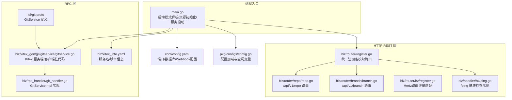
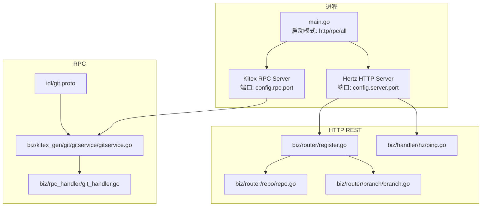
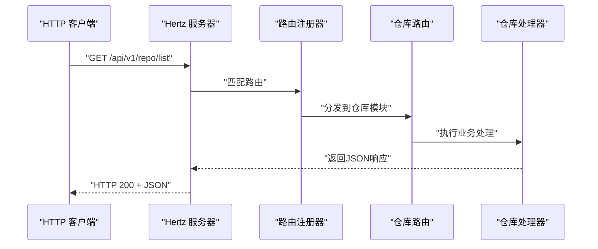
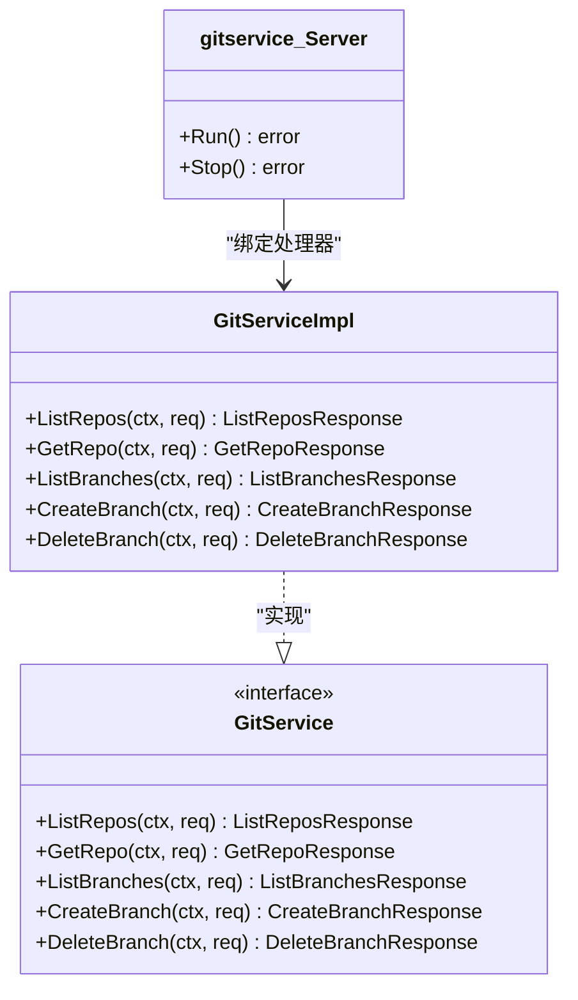
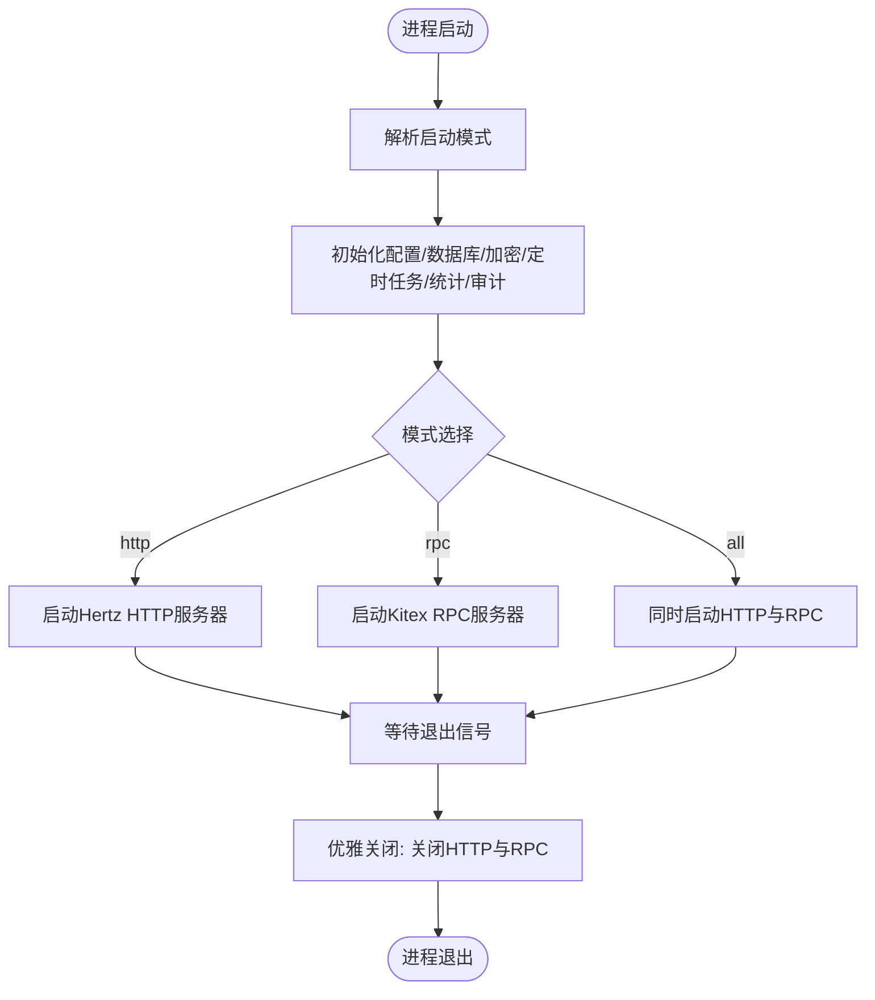
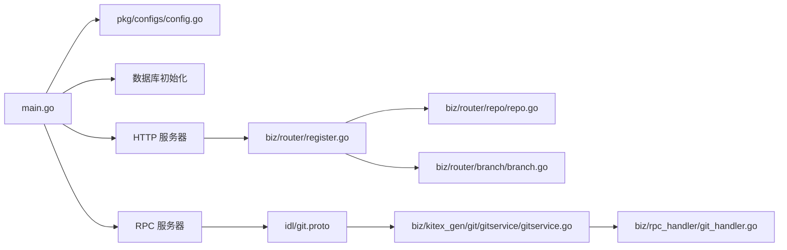

# 协议对比与选择

<cite>
**本文引用的文件**
- [main.go](file://main.go)
- [router.go](file://router.go)
- [biz/rpc_handler/git_handler.go](file://biz/rpc_handler/git_handler.go)
- [biz/kitex_gen/git/gitservice/gitservice.go](file://biz/kitex_gen/git/gitservice/gitservice.go)
- [idl/git.proto](file://idl/git.proto)
- [biz/kitex_info.yaml](file://biz/kitex_info.yaml)
- [conf/config.yaml](file://conf/config.yaml)
- [biz/router/register.go](file://biz/router/register.go)
- [biz/router/repo/repo.go](file://biz/router/repo/repo.go)
- [biz/router/branch/branch.go](file://biz/router/branch/branch.go)
- [biz/router/hz/register.go](file://biz/router/hz/register.go)
- [pkg/configs/config.go](file://pkg/configs/config.go)
- [biz/handler/hz/ping.go](file://biz/handler/hz/ping.go)
- [idl/api.proto](file://idl/api.proto)
</cite>

## 目录
1. [引言](#引言)
2. [项目结构](#项目结构)
3. [核心组件](#核心组件)
4. [架构总览](#架构总览)
5. [详细组件分析](#详细组件分析)
6. [依赖关系分析](#依赖关系分析)
7. [性能考量](#性能考量)
8. [故障排查指南](#故障排查指南)
9. [结论](#结论)
10. [附录](#附录)

## 引言
本文件围绕该Git管理服务的HTTP REST API与RPC服务进行对比分析，重点阐述两类协议在易用性、浏览器兼容性、调试便利性、高性能、强类型与序列化效率等方面的差异，并结合项目实际的混合部署策略，给出协议选择建议、迁移路径与兼容性考虑。同时，基于现有代码结构，梳理了HTTP路由注册、RPC服务生成与运行机制，为后续扩展与优化提供参考。

## 项目结构
该项目采用“混合架构”：在同一进程内同时提供HTTP REST API与RPC服务，便于内部微服务间通过RPC高效通信，同时对外暴露REST接口以支持浏览器与通用HTTP客户端访问。核心入口负责按模式启动不同服务，配置中心加载系统参数，路由层注册各业务模块的HTTP端点，RPC侧由IDL定义服务契约并通过Kitex生成服务端与客户端代码。

**图示来源**
- [main.go](file://main.go#L52-L176)
- [biz/router/register.go](file://biz/router/register.go#L18-L42)
- [biz/router/repo/repo.go](file://biz/router/repo/repo.go#L16-L39)
- [biz/router/branch/branch.go](file://biz/router/branch/branch.go#L16-L43)
- [biz/router/hz/register.go](file://biz/router/hz/register.go#L8-L12)
- [biz/handler/hz/ping.go](file://biz/handler/hz/ping.go#L13-L19)
- [idl/git.proto](file://idl/git.proto#L5-L11)
- [biz/kitex_gen/git/gitservice/gitservice.go](file://biz/kitex_gen/git/gitservice/gitservice.go#L76-L117)
- [biz/rpc_handler/git_handler.go](file://biz/rpc_handler/git_handler.go#L12-L131)
- [biz/kitex_info.yaml](file://biz/kitex_info.yaml#L1-L4)
- [conf/config.yaml](file://conf/config.yaml#L1-L25)
- [pkg/configs/config.go](file://pkg/configs/config.go#L18-L42)

**章节来源**
- [main.go](file://main.go#L52-L176)
- [biz/router/register.go](file://biz/router/register.go#L18-L42)
- [conf/config.yaml](file://conf/config.yaml#L1-L25)

## 核心组件
- HTTP REST API
  - 统一路由注册：通过路由注册器集中注册各业务模块的HTTP端点，支持静态资源与Swagger文档。
  - 模块化路由：如仓库与分支模块分别定义REST风格的路径与方法。
  - 健康检查：提供/ping等轻量接口用于探活。
- RPC 服务
  - IDL定义：使用Protocol Buffers定义GitService及消息体。
  - 服务实现：GitServiceImpl实现具体业务逻辑，连接DAO与Git服务。
  - 服务生成：Kitex根据IDL生成服务端与客户端桩代码，内置Protobuf编解码。
- 配置系统
  - 配置加载：从多路径加载YAML配置，设置全局变量供各模块使用。
  - 运行参数：HTTP与RPC端口分离，便于容器网络与防火墙策略配置。

**章节来源**
- [biz/router/register.go](file://biz/router/register.go#L18-L42)
- [biz/router/repo/repo.go](file://biz/router/repo/repo.go#L16-L39)
- [biz/router/branch/branch.go](file://biz/router/branch/branch.go#L16-L43)
- [biz/handler/hz/ping.go](file://biz/handler/hz/ping.go#L13-L19)
- [idl/git.proto](file://idl/git.proto#L5-L11)
- [biz/rpc_handler/git_handler.go](file://biz/rpc_handler/git_handler.go#L12-L131)
- [biz/kitex_gen/git/gitservice/gitservice.go](file://biz/kitex_gen/git/gitservice/gitservice.go#L76-L117)
- [pkg/configs/config.go](file://pkg/configs/config.go#L18-L42)
- [conf/config.yaml](file://conf/config.yaml#L1-L25)

## 架构总览
下图展示了HTTP与RPC双栈在进程内的协同工作方式：入口根据启动模式选择性或同时启动HTTP与RPC；HTTP侧由Hertz承载REST路由，RPC侧由Kitex承载gRPC风格的IDL服务。

**图示来源**
- [main.go](file://main.go#L76-L86)
- [biz/router/register.go](file://biz/router/register.go#L18-L42)
- [biz/router/repo/repo.go](file://biz/router/repo/repo.go#L16-L39)
- [biz/router/branch/branch.go](file://biz/router/branch/branch.go#L16-L43)
- [biz/handler/hz/ping.go](file://biz/handler/hz/ping.go#L13-L19)
- [idl/git.proto](file://idl/git.proto#L5-L11)
- [biz/kitex_gen/git/gitservice/gitservice.go](file://biz/kitex_gen/git/gitservice/gitservice.go#L76-L117)
- [biz/rpc_handler/git_handler.go](file://biz/rpc_handler/git_handler.go#L12-L131)

## 详细组件分析

### HTTP REST API 组件分析
- 路由注册与分组
  - 统一注册器将各业务模块路由挂载到/api/v1前缀下，便于版本化管理。
  - 仓库与分支模块分别定义多条REST端点，覆盖CRUD与操作类接口。
- 静态资源与文档
  - 提供静态页面目录与Swagger文档静态文件，便于前端直出与接口文档浏览。
- 健康检查
  - /ping提供简单响应，便于探活与负载均衡健康检查。

**图示来源**
- [biz/router/register.go](file://biz/router/register.go#L18-L42)
- [biz/router/repo/repo.go](file://biz/router/repo/repo.go#L16-L39)
- [biz/handler/hz/ping.go](file://biz/handler/hz/ping.go#L13-L19)

**章节来源**
- [biz/router/register.go](file://biz/router/register.go#L18-L42)
- [biz/router/repo/repo.go](file://biz/router/repo/repo.go#L16-L39)
- [biz/router/branch/branch.go](file://biz/router/branch/branch.go#L16-L43)
- [biz/handler/hz/ping.go](file://biz/handler/hz/ping.go#L13-L19)

### RPC 服务组件分析
- IDL与服务契约
  - 使用Protocol Buffers定义GitService及其请求/响应消息，具备强类型与跨语言特性。
- 服务实现
  - GitServiceImpl对接DAO与Git业务服务，完成仓库与分支相关操作。
- 服务生成与编解码
  - Kitex根据IDL生成服务端与客户端桩代码，内置Protobuf编解码，支持流式与非流式调用。

**图示来源**
- [biz/rpc_handler/git_handler.go](file://biz/rpc_handler/git_handler.go#L12-L131)
- [biz/kitex_gen/git/gitservice/gitservice.go](file://biz/kitex_gen/git/gitservice/gitservice.go#L76-L117)
- [idl/git.proto](file://idl/git.proto#L5-L11)

**章节来源**
- [idl/git.proto](file://idl/git.proto#L5-L11)
- [biz/rpc_handler/git_handler.go](file://biz/rpc_handler/git_handler.go#L12-L131)
- [biz/kitex_gen/git/gitservice/gitservice.go](file://biz/kitex_gen/git/gitservice/gitservice.go#L76-L117)

### 启动流程与控制流
- 入口解析启动模式，初始化共享资源后按模式启动HTTP或RPC或两者。
- HTTP侧通过Hertz默认配置监听端口并注册路由。
- RPC侧通过Kitex服务端监听端口并绑定GitServiceImpl。

**图示来源**
- [main.go](file://main.go#L52-L176)

**章节来源**
- [main.go](file://main.go#L52-L176)

## 依赖关系分析
- 启动与配置
  - main.go依赖配置加载模块与数据库初始化，再根据模式启动HTTP或RPC。
- HTTP路由
  - 路由注册器统一注册各模块路由，模块路由文件定义具体路径与处理器。
- RPC链路
  - IDL定义服务契约，Kitex生成桩代码，服务实现绑定到服务端，客户端通过生成的桩代码调用。

**图示来源**
- [main.go](file://main.go#L52-L176)
- [pkg/configs/config.go](file://pkg/configs/config.go#L18-L42)
- [biz/router/register.go](file://biz/router/register.go#L18-L42)
- [biz/router/repo/repo.go](file://biz/router/repo/repo.go#L16-L39)
- [biz/router/branch/branch.go](file://biz/router/branch/branch.go#L16-L43)
- [idl/git.proto](file://idl/git.proto#L5-L11)
- [biz/kitex_gen/git/gitservice/gitservice.go](file://biz/kitex_gen/git/gitservice/gitservice.go#L76-L117)
- [biz/rpc_handler/git_handler.go](file://biz/rpc_handler/git_handler.go#L12-L131)

**章节来源**
- [main.go](file://main.go#L52-L176)
- [pkg/configs/config.go](file://pkg/configs/config.go#L18-L42)
- [biz/router/register.go](file://biz/router/register.go#L18-L42)

## 性能考量
- 协议层面对比
  - HTTP REST API
    - 易用性：浏览器直连、curl调试、Swagger可视化、跨域友好。
    - 序列化：JSON，可读性强但体积与CPU开销相对较高。
    - 流控与中间件：Hertz生态丰富，适合网关与边缘层。
  - RPC（基于Kitex/Protobuf）
    - 高性能：二进制Protobuf序列化，消息体小、编解码快。
    - 强类型：IDL定义契约，编译期校验，减少运行时错误。
    - 内部调用：进程内或同机房微服务间推荐，降低网络与序列化成本。
- 项目实现中的性能特征
  - HTTP端口与RPC端口分离，便于独立扩缩容与网络隔离。
  - Kitex服务端内置Protobuf编解码，方法注册表明确，调用路径清晰。
  - HTTP路由采用分组与中间件，利于限流、鉴权与日志记录。

**章节来源**
- [conf/config.yaml](file://conf/config.yaml#L1-L25)
- [biz/kitex_gen/git/gitservice/gitservice.go](file://biz/kitex_gen/git/gitservice/gitservice.go#L112-L116)
- [biz/router/register.go](file://biz/router/register.go#L18-L42)

## 故障排查指南
- 健康检查
  - 使用/ping确认HTTP服务可用；若无响应，检查路由注册与Hertz运行状态。
- 端口冲突
  - 确认config.yaml中server.port与rpc.port未被占用；必要时通过环境变量覆盖。
- 配置加载
  - 若配置未生效，检查配置文件路径与键名是否正确；关注全局变量回填逻辑。
- RPC调用失败
  - 检查RPC服务端是否启动、IDL与生成代码是否一致、客户端地址与端口是否正确。
- 调试建议
  - HTTP：使用curl或浏览器直接访问；Swagger文档辅助定位问题。
  - RPC：通过日志观察服务端处理函数执行路径，核对请求/响应消息体。

**章节来源**
- [biz/handler/hz/ping.go](file://biz/handler/hz/ping.go#L13-L19)
- [conf/config.yaml](file://conf/config.yaml#L1-L25)
- [pkg/configs/config.go](file://pkg/configs/config.go#L18-L42)
- [biz/kitex_gen/git/gitservice/gitservice.go](file://biz/kitex_gen/git/gitservice/gitservice.go#L76-L117)

## 结论
- 在该Git管理服务中，HTTP与RPC双栈共存：HTTP面向外部浏览器与通用HTTP客户端，强调易用性与调试便利；RPC面向内部服务调用，强调高性能与强类型契约。
- 项目通过清晰的启动模式、配置加载与路由/服务生成机制，实现了灵活的混合架构部署。
- 选择建议
  - 内部服务间调用优先RPC（Kitex+Protobuf），降低序列化与网络开销。
  - 对外提供浏览器/SDK接入时优先HTTP REST API，兼顾易用性与生态工具链。
  - 混合架构下，可通过网关或反向代理实现流量分发与安全策略统一。

## 附录
- 协议切换与迁移指南（概念性说明）
  - 评估阶段：统计当前HTTP与RPC调用量、延迟分布与错误率，识别关键路径。
  - 迁移策略：优先迁移低复杂度、高并发的内部调用至RPC；对外接口保持HTTP，逐步引入OpenAPI/Swagger增强。
  - 兼容性考虑：保留HTTP端点一段时间，提供RPC到HTTP的桥接或反向代理；确保IDL变更遵循向后兼容原则。
  - 渐进式验证：灰度发布新RPC端点，对比性能指标与稳定性，再全量替换。
- 性能基准与资源消耗（概念性说明）
  - 基准测试建议：针对相同业务场景分别压测HTTP与RPC，对比吞吐、P99延迟、CPU/内存占用与连接数。
  - 扩展性分析：RPC在进程内调用更高效，适合水平扩展与服务网格；HTTP更适合多语言客户端与浏览器直连。
- 业务场景选择
  - 外部客户端接入：优先HTTP REST API。
  - 内部微服务通信：优先RPC（Kitex）。
  - 混合架构：通过统一网关/反向代理分流，实现内外有别的协议与安全策略。