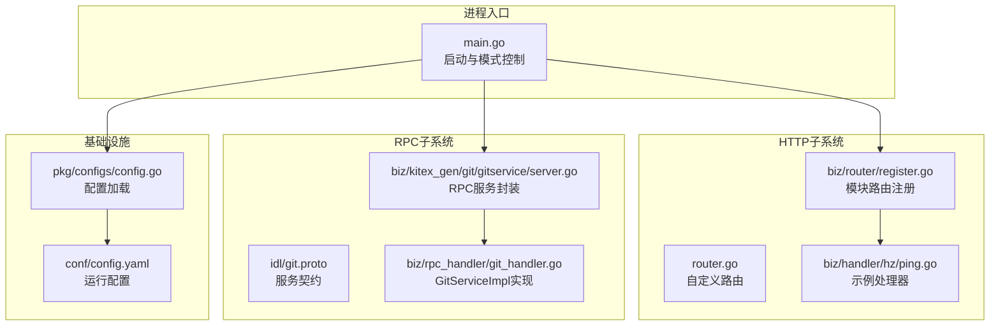
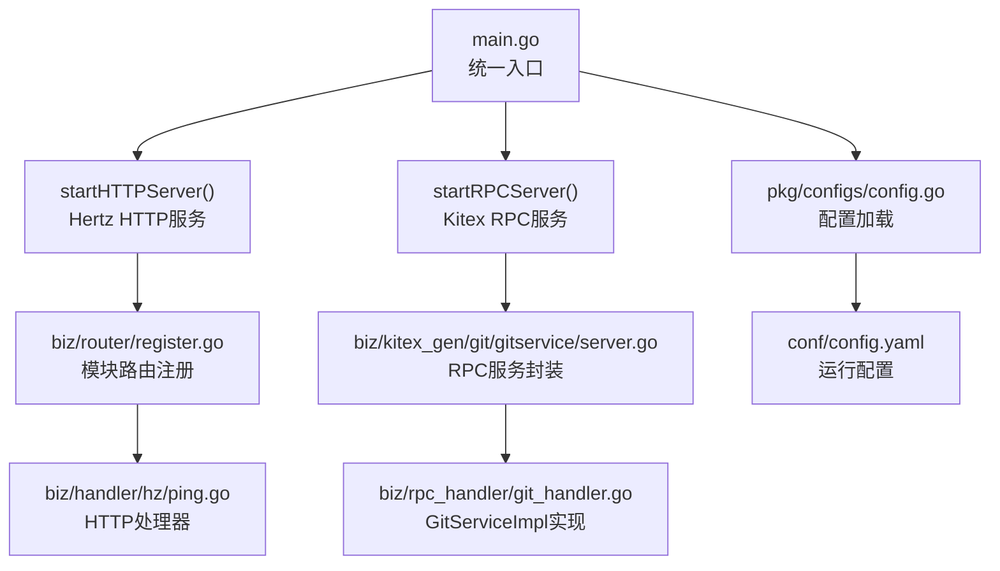
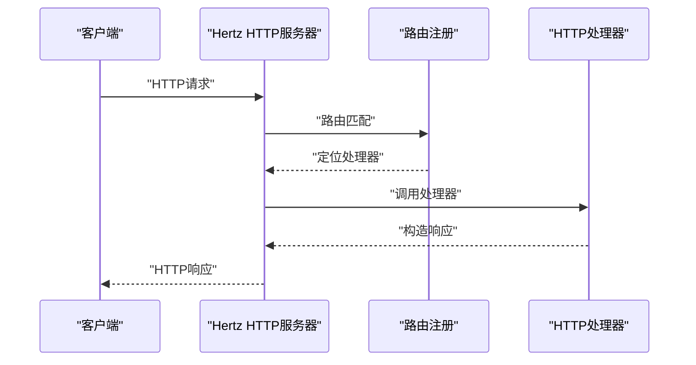
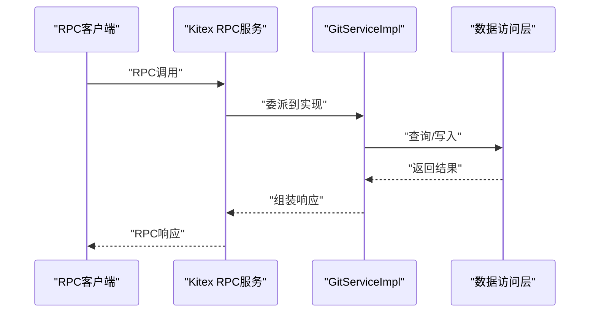
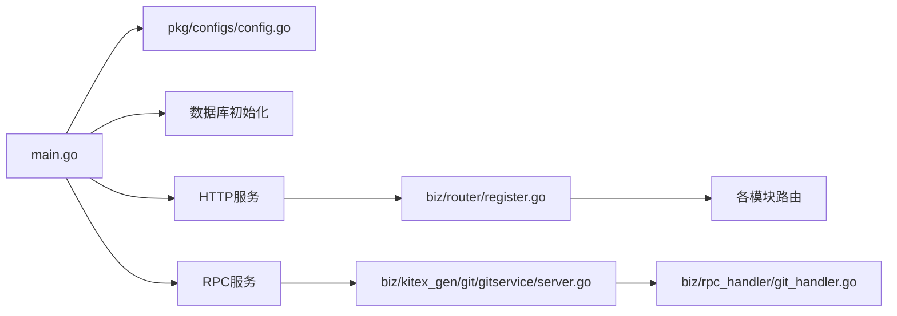

# 通信架构设计

<cite>
**本文引用的文件**
- [main.go](file://main.go)
- [router.go](file://router.go)
- [biz/router/register.go](file://biz/router/register.go)
- [biz/handler/hz/ping.go](file://biz/handler/hz/ping.go)
- [biz/rpc_handler/git_handler.go](file://biz/rpc_handler/git_handler.go)
- [biz/kitex_gen/git/gitservice/server.go](file://biz/kitex_gen/git/gitservice/server.go)
- [biz/middleware/webhook.go](file://biz/middleware/webhook.go)
- [pkg/configs/config.go](file://pkg/configs/config.go)
- [conf/config.yaml](file://conf/config.yaml)
- [idl/git.proto](file://idl/git.proto)
- [Makefile](file://Makefile)
- [build.sh](file://build.sh)
</cite>

## 目录
1. [引言](#引言)
2. [项目结构](#项目结构)
3. [核心组件](#核心组件)
4. [架构总览](#架构总览)
5. [详细组件分析](#详细组件分析)
6. [依赖关系分析](#依赖关系分析)
7. [性能与扩展性考量](#性能与扩展性考量)
8. [故障排查指南](#故障排查指南)
9. [结论](#结论)
10. [附录：API调用示例与客户端集成指南](#附录api调用示例与客户端集成指南)

## 引言
本设计文档面向“Git管理服务”的通信架构，系统化阐述HTTP REST API与RPC服务的双重通信架构设计。内容覆盖协议选择原因、适用场景与性能特点；Hertz HTTP框架与Kitex RPC框架的集成方式与协调机制；路由注册、中间件处理与请求分发流程；协议转换、负载均衡与故障转移策略建议；以及客户端集成指南与最佳实践。通过图示与路径引用，帮助读者快速理解并高效使用该服务。

## 项目结构
服务采用“双栈”运行模式：同时支持HTTP REST API与RPC服务，二者共享业务与数据层，通过统一配置与初始化流程启动。核心目录与职责概览如下：
- biz/router：HTTP路由注册与分组，按模块划分（repo、branch、tag、version、system、sync、stats、audit）。
- biz/handler：HTTP处理器，承载业务逻辑与响应封装。
- biz/rpc_handler：RPC服务实现，对接IDL定义的GitService接口。
- biz/kitex_gen/git：基于IDL生成的RPC代码，含client、server与service接口。
- biz/middleware：通用中间件（如Webhook鉴权与限流）。
- pkg/configs：全局配置加载与环境变量兼容。
- conf：运行时配置文件（端口、数据库、Webhook等）。
- idl：服务契约（Proto），定义RPC接口与消息类型。
- Makefile/build.sh：构建与生成脚本。

图表来源
- [main.go](file://main.go#L52-L176)
- [router.go](file://router.go#L10-L16)
- [biz/router/register.go](file://biz/router/register.go#L18-L42)
- [biz/handler/hz/ping.go](file://biz/handler/hz/ping.go#L13-L19)
- [idl/git.proto](file://idl/git.proto#L5-L11)
- [biz/kitex_gen/git/gitservice/server.go](file://biz/kitex_gen/git/gitservice/server.go#L9-L25)
- [biz/rpc_handler/git_handler.go](file://biz/rpc_handler/git_handler.go#L12-L131)
- [pkg/configs/config.go](file://pkg/configs/config.go#L18-L43)
- [conf/config.yaml](file://conf/config.yaml#L1-L25)

章节来源
- [main.go](file://main.go#L52-L176)
- [biz/router/register.go](file://biz/router/register.go#L18-L42)
- [pkg/configs/config.go](file://pkg/configs/config.go#L18-L43)
- [conf/config.yaml](file://conf/config.yaml#L1-L25)

## 核心组件
- 双栈启动器：根据命令行参数选择HTTP、RPC或两者全开模式，分别初始化对应服务并监听端口。
- HTTP路由体系：按模块分组注册REST接口，静态资源与Swagger文档一并托管。
- RPC服务实现：基于IDL生成的服务接口，实现仓库与分支相关的核心能力。
- 中间件：提供Webhook鉴权、限流与可选IP白名单校验。
- 配置系统：集中加载配置，支持环境变量覆盖，兼容旧版全局变量。

章节来源
- [main.go](file://main.go#L42-L113)
- [biz/router/register.go](file://biz/router/register.go#L18-L42)
- [biz/rpc_handler/git_handler.go](file://biz/rpc_handler/git_handler.go#L12-L131)
- [biz/middleware/webhook.go](file://biz/middleware/webhook.go#L18-L70)
- [pkg/configs/config.go](file://pkg/configs/config.go#L18-L43)

## 架构总览
下图展示HTTP与RPC双栈在进程内的协作关系：统一入口负责资源初始化与服务启动；HTTP侧由Hertz路由分发到处理器；RPC侧由Kitex服务封装并委派给GitServiceImpl；两者共享业务与数据访问层。

图表来源
- [main.go](file://main.go#L136-L176)
- [biz/router/register.go](file://biz/router/register.go#L18-L42)
- [biz/handler/hz/ping.go](file://biz/handler/hz/ping.go#L13-L19)
- [biz/kitex_gen/git/gitservice/server.go](file://biz/kitex_gen/git/gitservice/server.go#L9-L25)
- [biz/rpc_handler/git_handler.go](file://biz/rpc_handler/git_handler.go#L12-L131)
- [pkg/configs/config.go](file://pkg/configs/config.go#L18-L43)
- [conf/config.yaml](file://conf/config.yaml#L1-L25)

## 详细组件分析

### HTTP REST API 设计
- 路由注册机制
  - 自定义路由：根路径与/ping示例。
  - 模块化注册：统一在GeneratedRegister中注册repo、branch、tag、version、system、sync、stats、audit等模块路由。
  - 静态资源：前端页面与Swagger文档托管于/public与/docs。
- 中间件处理
  - Webhook中间件：支持IP白名单、速率限制与签名验证，适用于外部系统回调场景。
- 请求分发流程
  - 客户端请求到达Hertz后，按路由匹配进入对应模块处理器，完成业务处理与响应返回。

图表来源
- [router.go](file://router.go#L10-L16)
- [biz/router/register.go](file://biz/router/register.go#L18-L42)
- [biz/handler/hz/ping.go](file://biz/handler/hz/ping.go#L13-L19)

章节来源
- [router.go](file://router.go#L10-L16)
- [biz/router/register.go](file://biz/router/register.go#L18-L42)
- [biz/middleware/webhook.go](file://biz/middleware/webhook.go#L18-L70)

### RPC 服务设计（Kitex）
- 服务契约与IDL
  - 服务定义：GitService包含ListRepos、GetRepo、ListBranches、CreateBranch、DeleteBranch等方法。
  - 数据模型：Repo、Branch及相关请求/响应消息体。
- 服务封装与实现
  - 服务封装：NewServer函数负责注册服务与选项。
  - 实现类：GitServiceImpl实现GitService接口，具体方法委托DAO与业务服务完成。
- 请求分发流程
  - 客户端通过Kitex生成的客户端调用RPC方法，RPC服务器接收请求后委派至GitServiceImpl，最终返回结果。

图表来源
- [idl/git.proto](file://idl/git.proto#L5-L11)
- [biz/kitex_gen/git/gitservice/server.go](file://biz/kitex_gen/git/gitservice/server.go#L9-L25)
- [biz/rpc_handler/git_handler.go](file://biz/rpc_handler/git_handler.go#L12-L131)

章节来源
- [idl/git.proto](file://idl/git.proto#L5-L78)
- [biz/kitex_gen/git/gitservice/server.go](file://biz/kitex_gen/git/gitservice/server.go#L9-L25)
- [biz/rpc_handler/git_handler.go](file://biz/rpc_handler/git_handler.go#L12-L131)

### 协议选择与适用场景
- HTTP REST API
  - 优点：易调试、跨语言友好、生态完善（Swagger）、浏览器直连、适合对外网关与前端交互。
  - 场景：对外API、Web控制台、第三方集成、可观测性与运维工具。
- RPC（Kitex）
  - 优点：强类型契约、序列化效率高、延迟低、适合内部微服务间通信。
  - 场景：内部服务编排、批量任务调度、高吞吐数据处理。
- 性能特点
  - RPC通常在小对象、高频调用场景下具有更低延迟与更高吞吐；HTTP在大对象与复杂路由场景下更灵活。

### 协议转换与集成协调
- 当前实现为双栈并行：HTTP与RPC各自独立监听不同端口，共享业务与数据层。
- 协议转换建议（概念性）：若需在HTTP与RPC之间进行转换，可在边缘层增加适配器，将HTTP请求映射为RPC调用或反向映射，但需注意序列化差异与错误码对齐。

### 负载均衡与故障转移策略
- 负载均衡：可通过反向代理（如Nginx/K8s Service）对多个实例进行轮询或基于健康检查的加权分配。
- 故障转移：结合健康检查与熔断策略，自动隔离失败实例并重试或降级；RPC侧可启用超时与重试配置以提升稳定性。

## 依赖关系分析
- 入口依赖
  - main.go依赖配置加载、数据库初始化、业务服务初始化，并根据模式启动HTTP或RPC服务。
- HTTP依赖
  - 路由注册依赖各模块路由文件；处理器依赖业务服务与数据访问层。
- RPC依赖
  - 服务封装依赖IDL生成的接口；实现依赖DAO与业务服务。
- 配置依赖
  - 配置加载从YAML读取并更新全局变量，供其他组件使用。

图表来源
- [main.go](file://main.go#L115-L176)
- [pkg/configs/config.go](file://pkg/configs/config.go#L18-L43)
- [biz/router/register.go](file://biz/router/register.go#L18-L42)
- [biz/kitex_gen/git/gitservice/server.go](file://biz/kitex_gen/git/gitservice/server.go#L9-L25)
- [biz/rpc_handler/git_handler.go](file://biz/rpc_handler/git_handler.go#L12-L131)

章节来源
- [main.go](file://main.go#L115-L176)
- [pkg/configs/config.go](file://pkg/configs/config.go#L18-L43)

## 性能与扩展性考量
- 并发与资源
  - 双栈并发运行，需关注端口占用与资源竞争；建议容器化部署时为HTTP与RPC分别暴露端口。
- 序列化与网络
  - RPC使用二进制序列化，适合高吞吐；HTTP JSON便于调试与跨语言互操作。
- 扩展性
  - 通过模块化路由与服务接口易于横向扩展；建议引入服务发现与配置中心以支撑动态扩缩容。

## 故障排查指南
- 启动失败
  - 检查配置文件端口是否被占用；确认数据库连接参数正确。
- HTTP路由无效
  - 确认路由已注册且未被中间件拦截；检查静态资源路径。
- RPC调用异常
  - 检查服务端口与客户端地址；确认IDL一致且已重新生成代码。
- Webhook问题
  - 核对签名算法与密钥；检查速率限制阈值与IP白名单设置。

章节来源
- [conf/config.yaml](file://conf/config.yaml#L1-L25)
- [biz/middleware/webhook.go](file://biz/middleware/webhook.go#L18-L70)
- [Makefile](file://Makefile#L34-L49)

## 结论
该服务采用“HTTP + RPC”双栈架构，在保持对外API友好性的同时，兼顾内部服务间的高性能通信。通过清晰的模块化路由与IDL契约，实现了良好的可维护性与扩展性。建议在生产环境中配合负载均衡与健康检查，进一步提升可用性与稳定性。

## 附录：API调用示例与客户端集成指南

### 构建与运行
- 使用Makefile提供的目标进行构建与运行，支持HTTP-only、RPC-only与全量模式。
- 构建产物输出路径与运行脚本位于构建脚本中。

章节来源
- [Makefile](file://Makefile#L7-L28)
- [build.sh](file://build.sh#L1-L6)

### HTTP REST API 示例（概念性）
- 访问示例
  - GET /ping：用于服务存活探测。
  - GET /api/v1/repo/list：列出仓库。
  - GET /api/v1/repo/detail?key=xxx：获取仓库详情。
  - POST /api/v1/repo/create：创建仓库。
  - POST /api/v1/repo/delete：删除仓库。
  - POST /api/v1/repo/fetch：拉取远程变更。
  - POST /api/v1/repo/scan：扫描仓库。
  - GET /api/v1/repo/task?opId=xxx：查询克隆任务状态。
  - POST /api/v1/repo/update：更新仓库配置。
- Swagger文档
  - 通过/docs/swagger.json与/docs访问在线文档。

章节来源
- [router.go](file://router.go#L10-L16)
- [biz/router/register.go](file://biz/router/register.go#L18-L42)

### RPC 调用示例（概念性）
- 服务契约
  - GitService包含ListRepos、GetRepo、ListBranches、CreateBranch、DeleteBranch等方法。
- 客户端集成步骤
  - 使用IDL生成的客户端代码，配置服务端地址与端口。
  - 调用相应方法并处理响应与错误。
- 服务端实现
  - GitServiceImpl实现上述接口，内部调用DAO与业务服务完成实际操作。

章节来源
- [idl/git.proto](file://idl/git.proto#L5-L11)
- [biz/rpc_handler/git_handler.go](file://biz/rpc_handler/git_handler.go#L12-L131)

### 客户端集成最佳实践
- HTTP
  - 使用标准HTTP客户端，遵循REST规范；对错误码与响应体进行统一解析。
  - 对需要鉴权的接口，携带必要的认证头或令牌。
- RPC
  - 使用Kitex生成的客户端，确保IDL一致；合理设置超时与重试策略。
  - 在多实例部署时，结合服务发现与负载均衡策略提升可用性。