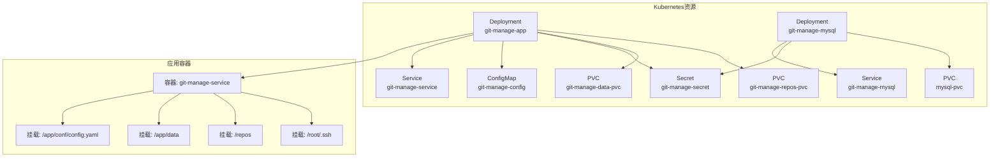
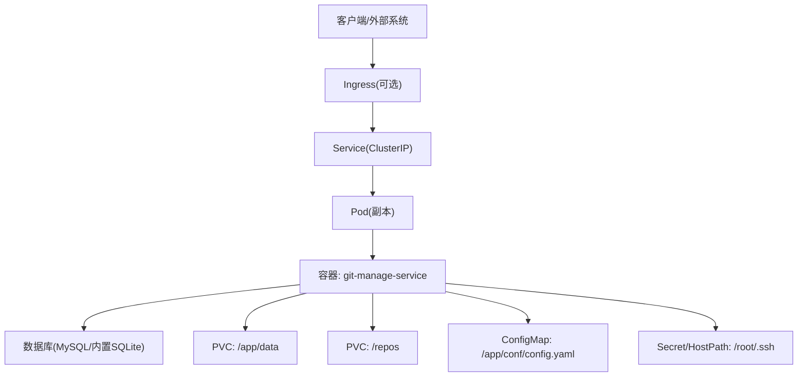
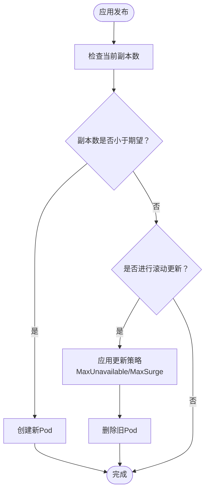
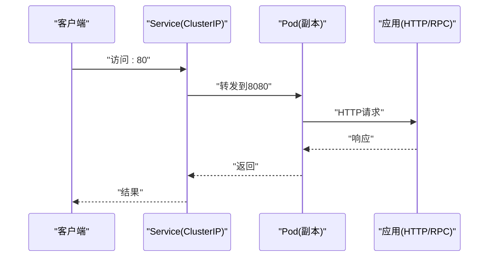
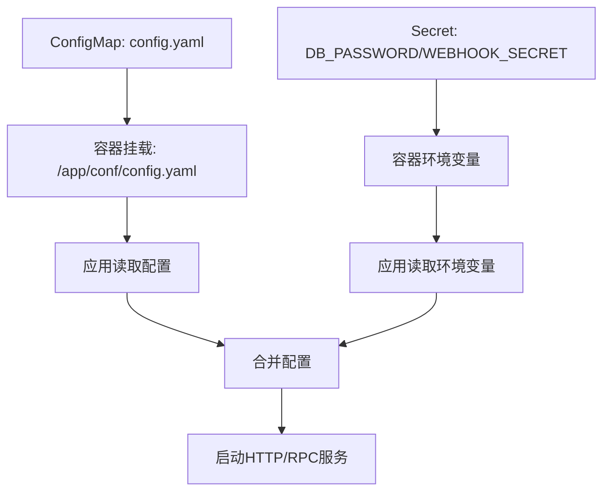
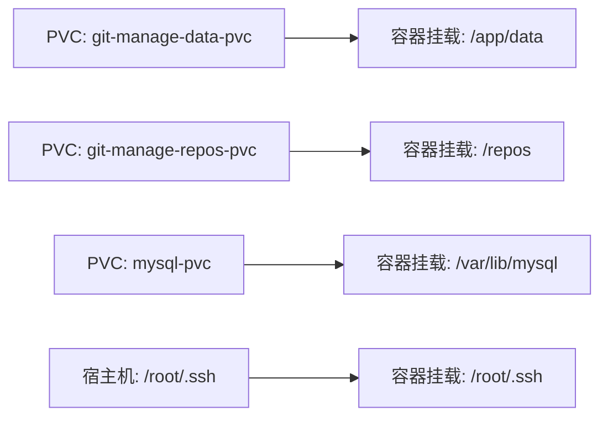
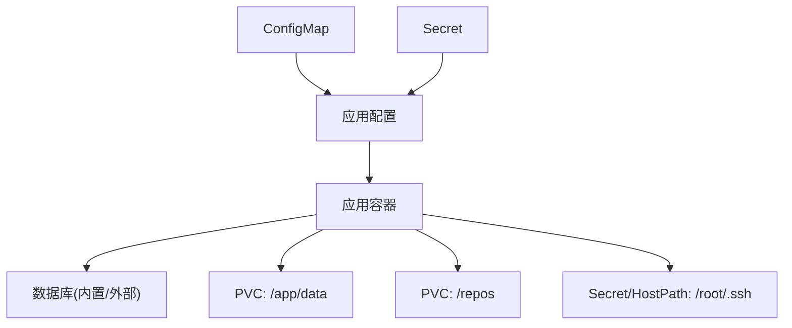

# Kubernetes部署

<cite>
**本文引用的文件**
- [deploy/k8s/deployment.yaml](file://deploy/k8s/deployment.yaml)
- [deploy/k8s/service.yaml](file://deploy/k8s/service.yaml)
- [deploy/k8s/configmap.yaml](file://deploy/k8s/configmap.yaml)
- [deploy/k8s/secret.yaml](file://deploy/k8s/secret.yaml)
- [deploy/k8s/mysql.yaml](file://deploy/k8s/mysql.yaml)
- [deploy/README.md](file://deploy/README.md)
- [deploy/CONFIG_GUIDE.md](file://deploy/CONFIG_GUIDE.md)
- [Dockerfile](file://Dockerfile)
- [conf/config.yaml](file://conf/config.yaml)
- [main.go](file://main.go)
- [pkg/configs/config.go](file://pkg/configs/config.go)
- [biz/middleware/webhook.go](file://biz/middleware/webhook.go)
</cite>

## 目录
1. [引言](#引言)
2. [项目结构](#项目结构)
3. [核心组件](#核心组件)
4. [架构总览](#架构总览)
5. [详细组件分析](#详细组件分析)
6. [依赖关系分析](#依赖关系分析)
7. [性能考虑](#性能考虑)
8. [故障排查指南](#故障排查指南)
9. [结论](#结论)
10. [附录](#附录)

## 引言
本文件面向在Kubernetes中部署Git管理服务的工程团队，系统化说明Kubernetes资源配置文件的结构与职责，解释Deployment控制器、副本与滚动更新策略；阐述Service暴露方式、Ingress路由与负载均衡；说明ConfigMap与Secret的使用场景与配置方法；给出持久化存储、Pod调度与资源限制建议；并提供监控、日志与故障排查方案，以及高可用、备份恢复与灾难恢复策略。

## 项目结构
- 服务入口与配置加载逻辑位于应用层，负责读取配置并启动HTTP/RPC服务。
- 部署层由Kubernetes资源清单组成，包括应用Deployment、Service、ConfigMap、Secret，以及可选的MySQL子资源。
- Dockerfile定义了运行时镜像、暴露端口与默认工作目录，支撑K8s容器编排。

图表来源
- [deploy/k8s/deployment.yaml](file://deploy/k8s/deployment.yaml#L1-L83)
- [deploy/k8s/service.yaml](file://deploy/k8s/service.yaml#L1-L14)
- [deploy/k8s/configmap.yaml](file://deploy/k8s/configmap.yaml#L1-L20)
- [deploy/k8s/secret.yaml](file://deploy/k8s/secret.yaml#L1-L11)
- [deploy/k8s/mysql.yaml](file://deploy/k8s/mysql.yaml#L1-L65)

章节来源
- [deploy/k8s/deployment.yaml](file://deploy/k8s/deployment.yaml#L1-L83)
- [deploy/k8s/service.yaml](file://deploy/k8s/service.yaml#L1-L14)
- [deploy/k8s/configmap.yaml](file://deploy/k8s/configmap.yaml#L1-L20)
- [deploy/k8s/secret.yaml](file://deploy/k8s/secret.yaml#L1-L11)
- [deploy/k8s/mysql.yaml](file://deploy/k8s/mysql.yaml#L1-L65)
- [Dockerfile](file://Dockerfile#L1-L77)
- [conf/config.yaml](file://conf/config.yaml#L1-L25)
- [main.go](file://main.go#L115-L175)
- [pkg/configs/config.go](file://pkg/configs/config.go#L18-L42)

## 核心组件
- 应用Deployment：定义Pod模板、容器镜像、端口、环境变量、卷挂载与持久化声明。
- Service：将ClusterIP暴露给集群内流量，映射到应用容器端口。
- ConfigMap：集中存放非敏感配置（如数据库类型、主机、端口、Webhook基础配置）。
- Secret：存放敏感数据（如数据库密码、Webhook密钥）。
- MySQL子资源（可选）：独立的MySQL Deployment与Service，配合PVC持久化。

章节来源
- [deploy/k8s/deployment.yaml](file://deploy/k8s/deployment.yaml#L1-L83)
- [deploy/k8s/service.yaml](file://deploy/k8s/service.yaml#L1-L14)
- [deploy/k8s/configmap.yaml](file://deploy/k8s/configmap.yaml#L1-L20)
- [deploy/k8s/secret.yaml](file://deploy/k8s/secret.yaml#L1-L11)
- [deploy/k8s/mysql.yaml](file://deploy/k8s/mysql.yaml#L1-L65)

## 架构总览
下图展示从客户端到应用容器的典型访问链路，以及内部数据库与持久化的关系。

图表来源
- [deploy/k8s/service.yaml](file://deploy/k8s/service.yaml#L1-L14)
- [deploy/k8s/deployment.yaml](file://deploy/k8s/deployment.yaml#L1-L83)
- [deploy/k8s/mysql.yaml](file://deploy/k8s/mysql.yaml#L1-L65)

## 详细组件分析

### Deployment控制器与副本管理
- 副本数：当前为1，适合开发或小规模测试；生产建议提升副本数并结合亲和/反亲和策略实现高可用。
- Pod模板标签：与Deployment的selector匹配，确保控制器能正确管理Pod生命周期。
- 容器端口：应用同时监听HTTP与RPC端口，需在Service中按需映射。
- 环境变量注入：通过Secret引用数据库密码与Webhook密钥，避免明文配置。
- 卷挂载：
  - ConfigMap挂载配置文件路径，subPath指向具体文件。
  - PVC挂载应用数据与仓库目录，满足日志、状态与仓库克隆/更新需求。
  - hostPath挂载SSH私钥，存在节点依赖风险，建议替换为Secret挂载以提升可移植性。
- 滚动更新策略：当前未显式声明，默认策略为先删除再创建，建议明确设置MaxUnavailable与MaxSurge以实现平滑升级。

图表来源
- [deploy/k8s/deployment.yaml](file://deploy/k8s/deployment.yaml#L9-L21)
- [deploy/README.md](file://deploy/README.md#L79-L83)

章节来源
- [deploy/k8s/deployment.yaml](file://deploy/k8s/deployment.yaml#L1-L83)
- [deploy/README.md](file://deploy/README.md#L79-L83)

### Service暴露与负载均衡
- Service类型：ClusterIP，仅对集群内流量开放。
- 端口映射：将Service端口80映射到容器端口8080（HTTP），RPC端口8888在容器内暴露但未在Service中映射，如需外部访问应补充对应端口定义。
- 负载均衡：默认由kube-proxy实现，建议在多副本场景下确保Service后端有多个可用Pod。

图表来源
- [deploy/k8s/service.yaml](file://deploy/k8s/service.yaml#L1-L14)
- [deploy/k8s/deployment.yaml](file://deploy/k8s/deployment.yaml#L22-L24)

章节来源
- [deploy/k8s/service.yaml](file://deploy/k8s/service.yaml#L1-L14)
- [deploy/k8s/deployment.yaml](file://deploy/k8s/deployment.yaml#L1-L83)

### ConfigMap与Secret配置
- ConfigMap：集中存放非敏感配置，如数据库类型、主机、端口、Webhook基础配置与调试开关。应用通过挂载文件的方式读取。
- Secret：存放敏感数据，如数据库密码与Webhook密钥。应用通过envFrom或env.valueFrom引用。
- 配置优先级：应用支持环境变量覆盖部分配置（如数据库路径），建议生产环境通过Secret与环境变量注入敏感信息，避免硬编码。

图表来源
- [deploy/k8s/configmap.yaml](file://deploy/k8s/configmap.yaml#L1-L20)
- [deploy/k8s/secret.yaml](file://deploy/k8s/secret.yaml#L1-L11)
- [deploy/k8s/deployment.yaml](file://deploy/k8s/deployment.yaml#L25-L35)
- [pkg/configs/config.go](file://pkg/configs/config.go#L18-L42)
- [main.go](file://main.go#L136-L175)

章节来源
- [deploy/k8s/configmap.yaml](file://deploy/k8s/configmap.yaml#L1-L20)
- [deploy/k8s/secret.yaml](file://deploy/k8s/secret.yaml#L1-L11)
- [deploy/k8s/deployment.yaml](file://deploy/k8s/deployment.yaml#L25-L35)
- [pkg/configs/config.go](file://pkg/configs/config.go#L18-L42)
- [main.go](file://main.go#L136-L175)

### 持久化存储与数据卷
- 应用数据卷：PVC绑定到容器内的/app/data，用于存放应用运行期数据。
- 仓库卷：PVC绑定到容器内的/repos，用于克隆/更新Git仓库。
- MySQL卷：PVC绑定到/var/lib/mysql，持久化数据库数据。
- hostPath挂载：当前将宿主机/root/.ssh挂载到容器，存在节点依赖风险，建议改用Secret挂载SSH密钥以提升可移植性。

图表来源
- [deploy/k8s/deployment.yaml](file://deploy/k8s/deployment.yaml#L36-L60)
- [deploy/k8s/mysql.yaml](file://deploy/k8s/mysql.yaml#L35-L41)

章节来源
- [deploy/k8s/deployment.yaml](file://deploy/k8s/deployment.yaml#L36-L60)
- [deploy/k8s/mysql.yaml](file://deploy/k8s/mysql.yaml#L35-L41)

### 数据库子资源（可选）
- 独立MySQL：通过Deployment与Service提供数据库服务，配合PVC持久化。
- 连接配置：应用侧ConfigMap中指定数据库类型、主机、端口、用户与库名；Secret提供密码。
- 替代方案：若使用外部托管数据库，可在ConfigMap中修改主机与凭据，并移除MySQL子资源。

章节来源
- [deploy/k8s/mysql.yaml](file://deploy/k8s/mysql.yaml#L1-L65)
- [deploy/k8s/configmap.yaml](file://deploy/k8s/configmap.yaml#L10-L16)
- [deploy/k8s/secret.yaml](file://deploy/k8s/secret.yaml#L9-L10)

### Webhook安全与路由
- Webhook密钥：通过Secret注入，中间件使用HMAC-SHA256校验请求签名，保障外部系统触发同步的安全性。
- 配置项：Webhook密钥、速率限制与IP白名单在ConfigMap中提供基础配置，应用侧读取并生效。

章节来源
- [deploy/k8s/secret.yaml](file://deploy/k8s/secret.yaml#L9-L10)
- [biz/middleware/webhook.go](file://biz/middleware/webhook.go#L56-L69)
- [deploy/CONFIG_GUIDE.md](file://deploy/CONFIG_GUIDE.md#L56-L74)

## 依赖关系分析
- 应用依赖配置：ConfigMap与Secret共同决定数据库连接、Webhook密钥与调试开关。
- 应用依赖数据库：可选MySQL子资源或外部数据库；数据库类型与连接参数来自ConfigMap。
- 应用依赖持久化：PVC提供数据与仓库目录的持久化能力。
- 应用依赖SSH密钥：当前使用hostPath挂载，建议迁移到Secret挂载以提升可移植性。

图表来源
- [deploy/k8s/configmap.yaml](file://deploy/k8s/configmap.yaml#L1-L20)
- [deploy/k8s/secret.yaml](file://deploy/k8s/secret.yaml#L1-L11)
- [deploy/k8s/deployment.yaml](file://deploy/k8s/deployment.yaml#L1-L83)
- [deploy/k8s/mysql.yaml](file://deploy/k8s/mysql.yaml#L1-L65)

章节来源
- [deploy/k8s/deployment.yaml](file://deploy/k8s/deployment.yaml#L1-L83)
- [deploy/k8s/mysql.yaml](file://deploy/k8s/mysql.yaml#L1-L65)

## 性能考虑
- 副本扩展：生产建议至少2个副本以上，结合节点反亲和与区域分布提升可用性。
- 资源限制：为容器设置requests/limits，避免资源争抢影响同步任务执行。
- 存储IOPS：仓库目录PVC建议使用高性能存储类，减少克隆/拉取慢导致的延迟。
- 网络带宽：外部仓库访问频繁时，考虑优化网络策略与镜像加速。
- 日志与指标：建议接入集中式日志与Prometheus指标采集，便于容量规划与性能调优。

## 故障排查指南
- Pod反复Crash：检查日志定位初始化阶段错误；确认数据库连接配置与Secret注入是否正确。
- SSH密钥无法挂载：当前使用hostPath存在节点依赖，建议改为Secret挂载SSH私钥。
- 配置不生效：确认ConfigMap已更新并触发Pod重启；或等待kubelet同步（部分场景需要重启）。
- 外部Webhook未生效：核对签名算法与密钥一致，检查速率限制与IP白名单配置。

章节来源
- [deploy/README.md](file://deploy/README.md#L85-L98)

## 结论
通过标准化的Kubernetes资源配置，Git管理服务可在集群中实现稳定、可扩展与可维护的部署。建议在生产环境中提升副本数、明确滚动更新策略、替换hostPath为Secret挂载、完善资源限制与监控告警，并制定备份与灾难恢复预案，以确保业务连续性与安全性。

## 附录

### 部署步骤与最佳实践
- 创建ConfigMap与Secret后，按顺序部署数据库（可选）与应用。
- 生产环境建议：
  - 使用外部托管数据库或高可用数据库集群。
  - 将敏感信息全部放入Secret，避免明文配置。
  - 设置合理的副本数与滚动更新策略。
  - 配置资源requests/limits与存储类。
  - 部署Ingress并启用TLS，结合WAF与限流策略。
  - 建立完善的日志、指标与告警体系。

章节来源
- [deploy/README.md](file://deploy/README.md#L60-L108)