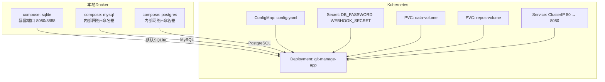
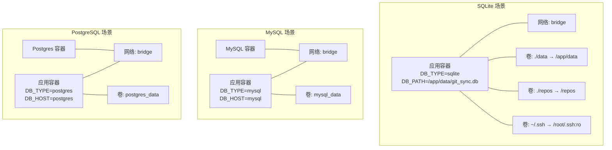
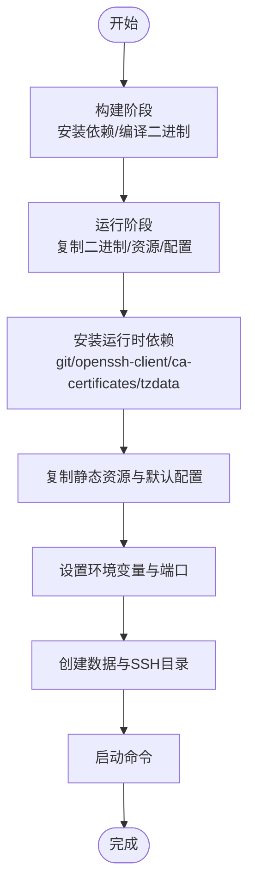
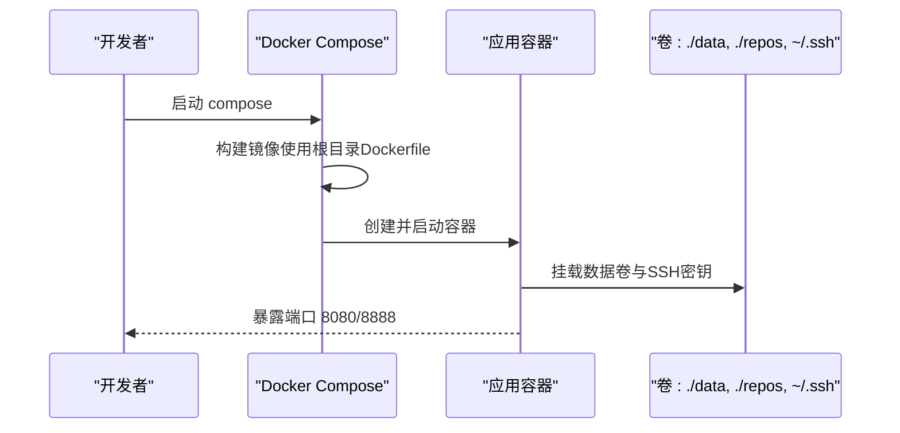
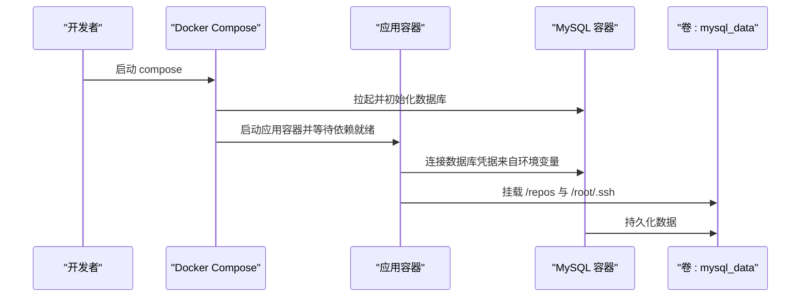
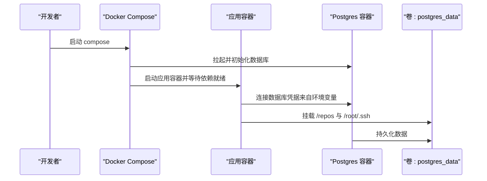
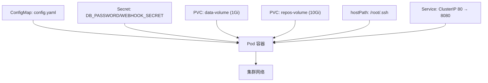
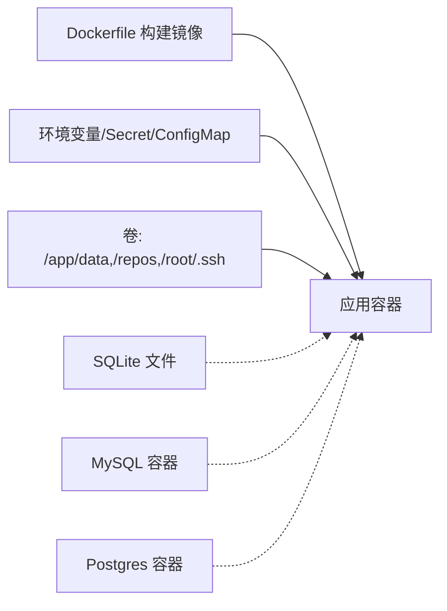

# 容器化部署

<cite>
**本文引用的文件**
- [Dockerfile](file://Dockerfile)
- [docker-compose.yml（SQLite）](file://deploy/docker-compose/sqlite/docker-compose.yml)
- [README.md（SQLite）](file://deploy/docker-compose/sqlite/README.md)
- [docker-compose.yml（MySQL）](file://deploy/docker-compose/mysql/docker-compose.yml)
- [README.md（MySQL）](file://deploy/docker-compose/mysql/README.md)
- [docker-compose.yml（PostgreSQL）](file://deploy/docker-compose/postgres/docker-compose.yml)
- [README.md（PostgreSQL）](file://deploy/docker-compose/postgres/README.md)
- [config.yaml（Kubernetes ConfigMap）](file://deploy/k8s/configmap.yaml)
- [secret.yaml（Kubernetes Secret）](file://deploy/k8s/secret.yaml)
- [deployment.yaml（Kubernetes）](file://deploy/k8s/deployment.yaml)
- [service.yaml（Kubernetes）](file://deploy/k8s/service.yaml)
- [mysql.yaml（Kubernetes）](file://deploy/k8s/mysql.yaml)
- [deploy/README.md](file://deploy/README.md)
- [CONFIG_GUIDE.md](file://deploy/CONFIG_GUIDE.md)
- [config.yaml（默认配置）](file://conf/config.yaml)
- [build.sh](file://build.sh)
</cite>

## 目录
1. [简介](#简介)
2. [项目结构](#项目结构)
3. [核心组件](#核心组件)
4. [架构总览](#架构总览)
5. [详细组件分析](#详细组件分析)
6. [依赖关系分析](#依赖关系分析)
7. [性能与资源规划](#性能与资源规划)
8. [故障排查指南](#故障排查指南)
9. [结论](#结论)
10. [附录](#附录)

## 简介
本文件面向Git管理服务的容器化部署，围绕Docker镜像构建、多阶段优化、运行时环境配置展开；同时提供SQLite、MySQL、PostgreSQL三种数据库后端的Docker Compose配置方案，以及Kubernetes部署清单与最佳实践。内容涵盖容器网络、卷挂载策略、环境变量、启动参数、健康检查建议、日志管理、服务发现与动态扩缩容策略。

## 项目结构
- 根目录Dockerfile定义了两阶段构建：构建阶段使用Go官方Alpine镜像拉取依赖并编译二进制；运行阶段基于Alpine精简镜像，安装运行期依赖（git、openssh、证书、时区），复制二进制、前端静态资源、文档与默认配置，并设置端口与工作目录。
- deploy/docker-compose/ 提供三套Compose编排：sqlite、mysql、postgres，分别对应不同的数据库后端与网络/卷/环境变量配置。
- deploy/k8s/ 提供Kubernetes部署清单：Deployment、Service、ConfigMap、Secret、PVC等，支持将敏感配置通过Secret注入，非敏感配置通过ConfigMap注入。
- conf/config.yaml为应用默认配置模板，结合环境变量实现灵活覆盖。

图表来源
- [docker-compose.yml（SQLite）](file://deploy/docker-compose/sqlite/docker-compose.yml#L1-L30)
- [docker-compose.yml（MySQL）](file://deploy/docker-compose/mysql/docker-compose.yml#L1-L50)
- [docker-compose.yml（PostgreSQL）](file://deploy/docker-compose/postgres/docker-compose.yml#L1-L49)
- [deployment.yaml（Kubernetes）](file://deploy/k8s/deployment.yaml#L1-L83)
- [service.yaml（Kubernetes）](file://deploy/k8s/service.yaml#L1-L14)
- [configmap.yaml（Kubernetes）](file://deploy/k8s/configmap.yaml#L1-L20)
- [secret.yaml（Kubernetes）](file://deploy/k8s/secret.yaml#L1-L11)

章节来源
- [Dockerfile](file://Dockerfile#L1-L77)
- [deploy/README.md](file://deploy/README.md#L1-L108)

## 核心组件
- 多阶段Dockerfile
  - 构建阶段：启用模块代理、替换Alpine镜像源、安装git/gcc/musl-dev以支持CGO/SQLite、下载依赖、编译二进制。
  - 运行阶段：替换Alpine镜像源、安装git/openssh-client/ca-certificates/tzdata、复制二进制、前端静态资源、文档与默认配置、设置端口与工作目录。
- 运行时环境
  - 端口：8080（HTTP API）、8888（RPC），均在Dockerfile中声明。
  - 时区：通过tzdata设置，Compose/K8s示例中统一设置为Asia/Shanghai。
  - SSH：通过只读挂载宿主机~/.ssh至/root/.ssh，便于SSH协议克隆/推送。
  - 数据卷：/app/data（数据库文件/日志/缓存）、/repos（仓库存储）、/app/conf/config.yaml（可选覆盖）。
- 配置体系
  - 默认配置文件：conf/config.yaml，包含server、rpc、database、webhook等基础项。
  - 环境变量覆盖：DB_TYPE、DB_HOST、DB_PORT、DB_USER、DB_PASSWORD、DB_NAME、TZ、WEBHOOK_SECRET等。
  - Kubernetes：ConfigMap注入config.yaml，Secret注入敏感配置。

章节来源
- [Dockerfile](file://Dockerfile#L1-L77)
- [conf/config.yaml](file://conf/config.yaml#L1-L25)
- [CONFIG_GUIDE.md](file://deploy/CONFIG_GUIDE.md#L1-L99)

## 架构总览
下图展示三种数据库后端的容器编排差异与共享的App容器：

图表来源
- [docker-compose.yml（SQLite）](file://deploy/docker-compose/sqlite/docker-compose.yml#L1-L30)
- [docker-compose.yml（MySQL）](file://deploy/docker-compose/mysql/docker-compose.yml#L1-L50)
- [docker-compose.yml（PostgreSQL）](file://deploy/docker-compose/postgres/docker-compose.yml#L1-L49)

## 详细组件分析

### Docker镜像构建与多阶段优化
- 构建阶段
  - 使用Alpine镜像，替换镜像源为阿里云镜像，提升依赖下载速度。
  - 安装git/gcc/musl-dev以支持CGO与SQLite编译。
  - 使用代理加速模块下载，减少首次构建时间。
  - 复制go.mod/go.sum与源码后执行go mod download与go build生成二进制。
- 运行阶段
  - 基于Alpine精简镜像，仅安装git/openssh-client/ca-certificates/tzdata等必要运行时依赖。
  - 复制二进制、public/docs与默认配置，设置GIN_MODE=release、PORT=8080、DB_PATH=/app/data/git_sync.db。
  - 创建/app/data与/root/.ssh目录并设置权限，暴露8080/8888端口，设置CMD启动应用。

图表来源
- [Dockerfile](file://Dockerfile#L1-L77)

章节来源
- [Dockerfile](file://Dockerfile#L1-L77)

### SQLite 部署（Docker Compose）
- 网络：使用bridge网络git-sync-net，应用容器加入该网络。
- 端口映射：8080:8080、8888:8888。
- 环境变量：WEBHOOK_SECRET、DB_TYPE=sqlite、DB_PATH=/app/data/git_sync.db、TZ=Asia/Shanghai。
- 卷挂载：
  - ./data → /app/data（数据库文件与应用数据）
  - ./repos → /repos（仓库存储）
  - ~/.ssh → /root/.ssh:ro（SSH私钥）
- 启动方式：docker-compose up -d，自动构建镜像并启动。

图表来源
- [docker-compose.yml（SQLite）](file://deploy/docker-compose/sqlite/docker-compose.yml#L1-L30)

章节来源
- [docker-compose.yml（SQLite）](file://deploy/docker-compose/sqlite/docker-compose.yml#L1-L30)
- [README.md（SQLite）](file://deploy/docker-compose/sqlite/README.md#L1-L19)

### MySQL 部署（Docker Compose）
- 服务编排：app与mysql两个服务，app依赖mysql。
- 环境变量：DB_TYPE=mysql、DB_HOST=mysql、DB_PORT=3306、DB_USER/DB_PASSWORD/DB_NAME等。
- 卷挂载：/repos → /repos、~/.ssh → /root/.ssh:ro；mysql使用命名卷mysql_data持久化数据。
- 网络：bridge网络git-sync-net，app与mysql在同一网络内。

图表来源
- [docker-compose.yml（MySQL）](file://deploy/docker-compose/mysql/docker-compose.yml#L1-L50)

章节来源
- [docker-compose.yml（MySQL）](file://deploy/docker-compose/mysql/docker-compose.yml#L1-L50)
- [README.md（MySQL）](file://deploy/docker-compose/mysql/README.md#L1-L21)

### PostgreSQL 部署（Docker Compose）
- 服务编排：app与postgres两个服务，app依赖postgres。
- 环境变量：DB_TYPE=postgres、DB_HOST=postgres、DB_PORT=5432、DB_USER/DB_PASSWORD/DB_NAME等。
- 卷挂载：/repos → /repos、~/.ssh → /root/.ssh:ro；postgres使用命名卷postgres_data持久化数据。
- 网络：bridge网络git-sync-net，app与postgres在同一网络内。

图表来源
- [docker-compose.yml（PostgreSQL）](file://deploy/docker-compose/postgres/docker-compose.yml#L1-L49)

章节来源
- [docker-compose.yml（PostgreSQL）](file://deploy/docker-compose/postgres/docker-compose.yml#L1-L49)
- [README.md（PostgreSQL）](file://deploy/docker-compose/postgres/README.md#L1-L21)

### Kubernetes 部署（ConfigMap/Secret/PVC/Service/Deployment）
- ConfigMap：注入config.yaml，包含server.port、database.type/host/port/user/dbname等。
- Secret：注入DB_PASSWORD与WEBHOOK_SECRET，避免明文配置。
- Deployment：
  - 使用git-manage-service:latest镜像（需提前推送到镜像仓库）。
  - 挂载ConfigMap为只读配置文件；挂载PVC为/app/data与/repos；挂载宿主机~/.ssh为只读SSH密钥。
  - 设置容器端口8080/8888。
- Service：ClusterIP，将80端口转发到8080端口。
- PVC：分别为data-volume（1Gi）与repos-volume（10Gi）。

图表来源
- [deployment.yaml（Kubernetes）](file://deploy/k8s/deployment.yaml#L1-L83)
- [service.yaml（Kubernetes）](file://deploy/k8s/service.yaml#L1-L14)
- [configmap.yaml（Kubernetes）](file://deploy/k8s/configmap.yaml#L1-L20)
- [secret.yaml（Kubernetes）](file://deploy/k8s/secret.yaml#L1-L11)

章节来源
- [deployment.yaml（Kubernetes）](file://deploy/k8s/deployment.yaml#L1-L83)
- [service.yaml（Kubernetes）](file://deploy/k8s/service.yaml#L1-L14)
- [configmap.yaml（Kubernetes）](file://deploy/k8s/configmap.yaml#L1-L20)
- [secret.yaml（Kubernetes）](file://deploy/k8s/secret.yaml#L1-L11)

### 环境变量与配置覆盖
- 关键环境变量
  - WEBHOOK_SECRET：Webhook签名密钥，建议通过Secret注入。
  - DB_TYPE：数据库类型（sqlite/mysql/postgres）。
  - DB_*：数据库连接参数（host/port/user/password/dbname），可由Compose/K8s环境变量注入。
  - TZ：时区，建议统一设置为Asia/Shanghai。
  - GIN_MODE：运行模式（release），由Dockerfile预设。
  - PORT：应用监听端口（默认8080），由Dockerfile预设。
- 配置文件优先级
  - 默认配置文件：conf/config.yaml。
  - 环境变量覆盖：如DB_PASSWORD可覆盖config中password字段。
  - Kubernetes：ConfigMap注入config.yaml，Secret注入敏感字段。

章节来源
- [Dockerfile](file://Dockerfile#L63-L69)
- [CONFIG_GUIDE.md](file://deploy/CONFIG_GUIDE.md#L1-L99)
- [config.yaml（默认配置）](file://conf/config.yaml#L1-L25)
- [config.yaml（Kubernetes ConfigMap）](file://deploy/k8s/configmap.yaml#L1-L20)
- [secret.yaml（Kubernetes Secret）](file://deploy/k8s/secret.yaml#L1-L11)

### 健康检查与日志管理（建议）
- 健康检查（建议）
  - HTTP健康探针：对应用的健康端点发起GET请求，返回2xx视为健康。
  - 数据库连通性：在启动脚本中增加数据库连通性探测，失败则退出进程，触发K8s重启策略。
- 日志管理（建议）
  - 应用日志输出到stdout/stderr，由容器运行时收集。
  - 对于SQLite场景，可将/app/data挂载到持久卷，便于采集与归档。
  - 在K8s中可通过ConfigMap设置日志级别，或通过环境变量控制。

[本节为通用建议，不直接分析具体文件，故无“章节来源”]

### 容器网络与服务发现
- Docker Compose
  - 使用bridge网络git-sync-net，服务间通过服务名（如mysql、postgres）解析。
  - 端口映射：8080/8888映射到宿主机。
- Kubernetes
  - Service提供稳定入口：ClusterIP 80 → 8080。
  - Pod通过选择器app=git-manage发现服务。
  - 数据库可作为独立Service或使用外部数据库。

章节来源
- [docker-compose.yml（SQLite）](file://deploy/docker-compose/sqlite/docker-compose.yml#L24-L25)
- [docker-compose.yml（MySQL）](file://deploy/docker-compose/mysql/docker-compose.yml#L23-L26)
- [docker-compose.yml（PostgreSQL）](file://deploy/docker-compose/postgres/docker-compose.yml#L23-L26)
- [service.yaml（Kubernetes）](file://deploy/k8s/service.yaml#L1-L14)

### 动态扩缩容与副本策略
- Deployment副本数：当前为1，可根据负载与SLA调整replicas。
- 横向扩展：增加副本数，结合Service进行流量分发。
- 资源限制：建议为容器设置requests/limits，避免资源争抢。
- 存储：确保PVC具备足够的IOPS与容量，满足并发写入需求。

章节来源
- [deployment.yaml（Kubernetes）](file://deploy/k8s/deployment.yaml#L9-L9)

## 依赖关系分析
- 组件耦合
  - 应用容器依赖数据库（SQLite/MySQL/PostgreSQL）与SSH密钥。
  - Compose/K8s通过环境变量与卷挂载解耦配置与数据。
- 外部依赖
  - 镜像源：Alpine镜像源替换为阿里云镜像。
  - 代理：GOPROXY设置为https://goproxy.cn，提升依赖下载速度。
- 循环依赖
  - 无循环依赖，Compose/K8s按顺序启动服务，应用容器依赖数据库容器。

图表来源
- [Dockerfile](file://Dockerfile#L1-L77)
- [deployment.yaml（Kubernetes）](file://deploy/k8s/deployment.yaml#L1-L83)
- [docker-compose.yml（MySQL）](file://deploy/docker-compose/mysql/docker-compose.yml#L1-L50)
- [docker-compose.yml（PostgreSQL）](file://deploy/docker-compose/postgres/docker-compose.yml#L1-L49)

章节来源
- [Dockerfile](file://Dockerfile#L1-L77)
- [deploy/README.md](file://deploy/README.md#L1-L108)

## 性能与资源规划
- 镜像体积与启动速度
  - 多阶段构建显著减小最终镜像体积，缩短拉取与启动时间。
  - 依赖下载使用代理与镜像源，提升构建效率。
- 运行时性能
  - SQLite适合开发/小规模场景；MySQL/PostgreSQL适合生产高并发。
  - 建议为数据库与应用容器设置CPU/内存requests/limits。
- 存储与I/O
  - /app/data与/repos建议使用高性能持久卷，确保数据库与仓库读写性能。
  - SQLite文件建议位于独立PVC，避免与其他数据混合。

[本节为通用建议，不直接分析具体文件，故无“章节来源”]

## 故障排查指南
- 常见问题
  - Pod反复重启（CrashLoopBackOff）：检查数据库连接参数、Secret是否正确注入、数据库是否就绪。
  - SSH密钥无法挂载：K8s中hostPath依赖节点路径，建议改用Secret挂载私钥。
  - 配置未生效：确认ConfigMap已更新并触发Pod重启，或等待kubelet同步。
- 排查步骤
  - 查看容器日志：docker-compose logs -f 或 kubectl logs -f <pod-name>。
  - 检查环境变量与卷挂载：确认DB_TYPE、DB_HOST、DB_USER、DB_PASSWORD、TZ、卷路径等。
  - 验证网络连通性：在容器内ping数据库主机或使用数据库客户端测试连通。

章节来源
- [deploy/README.md](file://deploy/README.md#L85-L108)

## 结论
通过多阶段Dockerfile与Docker Compose/Kubernetes部署，Git管理服务可在SQLite、MySQL、PostgreSQL三种后端之间灵活切换。结合ConfigMap/Secret/PVC与网络/卷策略，可实现从开发到生产的平滑过渡。建议在生产中采用MySQL/PostgreSQL、严格的Secret管理、合理的资源与存储规划，并完善健康检查与日志采集机制。

## 附录
- 本地构建与打包
  - build.sh用于本地构建二进制并准备引导脚本，便于集成到容器或裸机部署。
- 配置参考
  - CONFIG_GUIDE.md提供了config.yaml各字段的详细说明与最佳实践。

章节来源
- [build.sh](file://build.sh#L1-L6)
- [CONFIG_GUIDE.md](file://deploy/CONFIG_GUIDE.md#L1-L99)